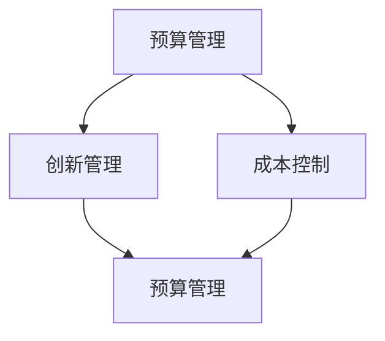

                 


### 设计《技术预算管理：平衡创新与成本控制》的目录大纲

#### 第一步：确定书籍结构

为了撰写一篇关于《技术预算管理：平衡创新与成本控制》的技术博客，我们需要先确定书籍的整体结构。一个结构良好的书籍应当包括引言、核心概念、实践应用、管理工具与方法、挑战与未来等部分。

1. **引言部分**：介绍技术预算管理的背景和意义，让读者了解为什么需要技术预算管理以及它在当前技术发展环境中的重要性。
   
2. **核心概念部分**：介绍预算管理、创新管理、成本控制等核心概念，为后续内容打下基础。

3. **实践应用部分**：通过具体的案例和项目实战，展示技术预算管理的实际应用，帮助读者理解如何在实际工作中实施技术预算管理。

4. **管理工具与方法部分**：介绍如何使用预算工具和方法来实现创新与成本控制的平衡，提供实际操作的指导。

5. **挑战与未来部分**：探讨技术预算管理面临的问题和未来的发展趋势，为读者提供前瞻性的思考。

#### 第二步：细化各个章节内容

在确定了整体结构后，我们需要细化各个章节的内容。

**引言**

- 1.1 技术预算管理的背景和意义
- 1.2 预算管理、创新管理、成本控制的概念联系

**核心概念**

- 2.1 预算管理的基本概念和流程
- 2.2 创新管理的原理和实践
- 2.3 成本控制的方法和策略
- 2.4 预算、创新、成本三者的关系及平衡

**实践应用**

- 3.1 技术预算管理在企业中的应用案例
- 3.2 创新项目预算编制与管理
- 3.3 成本控制案例分析

**管理工具与方法**

- 4.1 预算编制工具和方法
- 4.2 创新激励与成本控制策略
- 4.3 技术预算管理中的风险控制

**挑战与未来**

- 5.1 技术预算管理面临的挑战
- 5.2 成本控制与创新的未来发展趋势

#### 第三步：添加附录

附录部分可以提供一些实用的工具、示例和案例分析，帮助读者更好地理解和应用技术预算管理。

- 附录A：预算管理相关公式和工具
- 附录B：创新项目预算编制示例
- 附录C：成本控制案例分析

#### 第四步：撰写目录大纲

根据以上内容，我们可以撰写出一个完整的目录大纲，如下：

```
# 《技术预算管理：平衡创新与成本控制》目录大纲

## 引言

### 1.1 技术预算管理的背景和意义

### 1.2 预算管理、创新管理、成本控制的概念联系

## 核心概念

### 2.1 预算管理的基本概念和流程

### 2.2 创新管理的原理和实践

### 2.3 成本控制的方法和策略

### 2.4 预算、创新、成本三者的关系及平衡

## 实践应用

### 3.1 技术预算管理在企业中的应用案例

### 3.2 创新项目预算编制与管理

### 3.3 成本控制案例分析

## 管理工具与方法

### 4.1 预算编制工具和方法

### 4.2 创新激励与成本控制策略

### 4.3 技术预算管理中的风险控制

## 挑战与未来

### 5.1 技术预算管理面临的挑战

### 5.2 成本控制与创新的未来发展趋势

## 附录

### 附录A：预算管理相关公式和工具

### 附录B：创新项目预算编制示例

### 附录C：成本控制案例分析
```

### 约束条件分析

接下来，我们分析文章中需要满足的约束条件：

- **格式要求**：文章内容使用markdown格式输出。markdown格式便于撰写和排版，同时便于读者阅读和理解。

- **作者信息**：文章末尾需要写上作者信息。这一信息不仅体现了文章的专业性，也增加了文章的可信度。

- **完整性要求**：文章内容必须要完整，每个小节的内容必须要丰富具体详细讲解。这意味着每个章节都需要有详细的背景介绍、核心概念讲解、算法原理阐述、案例分析等。

  - **背景介绍**：每个章节都需要有一个背景介绍，让读者了解本章的主题和重要性。
  
  - **核心概念与联系**：必须给出核心概念原理之间的关系架构 Mermaid 流程图。这有助于读者理解概念之间的联系。
  
  - **核心算法原理讲解**：必须使用伪代码来详细阐述。伪代码能够让读者更直观地理解算法的实现过程。
  
  - **数学模型和公式**：需要详细讲解和举例说明。数学公式请使用latex格式，嵌入文中独立段落的latex公式前后使用 $$ 括起来，段落内的latex公式前后使用 $ 括起来。
  
  - **项目实战**：需要包含开发环境搭建、源代码详细实现和代码解读、代码应用解读与分析、实际案例分析和详细讲解剖析、项目小结等内容。
  
  - **最佳实践 tips、小结、注意事项、拓展阅读等内容**：这些内容能够帮助读者更好地理解和应用文章中的知识点。

- **文章字数要求**：文章字数在 8000 ～ 12000 字左右。这个字数范围能够保证文章的深度和广度，同时不至于过于冗长。

综上所述，我们将在后续的撰写过程中严格遵循这些约束条件，确保文章的专业性和可读性。

### 文章标题和关键词确定

在确定了《技术预算管理：平衡创新与成本控制》的目录大纲后，我们需要为文章确定一个吸引人的标题，并选择合适的关键词，以便提高文章的曝光率和可搜索性。

#### 文章标题

一个引人入胜的标题能够激发读者的兴趣，使其愿意进一步阅读文章。对于《技术预算管理：平衡创新与成本控制》这篇文章，我们可以考虑以下标题：

- **“创新与成本控制的艺术：揭秘技术预算管理之道”**
- **“技术预算管理实战指南：如何在创新中控制成本”**
- **“技术企业必读：如何实现预算管理与创新双赢”**

这三个标题都突出了文章的核心内容，即技术预算管理在创新和成本控制方面的应用。经过比较，我们可以选择第一个标题：“创新与成本控制的艺术：揭秘技术预算管理之道”。这个标题既引人入胜，又准确地概括了文章的主题。

#### 关键词

为了提高文章的曝光率和可搜索性，我们需要选择一些与文章主题密切相关、搜索量较高的关键词。以下是几个可能的关键词：

- **技术预算管理**
- **创新成本控制**
- **企业预算管理**
- **预算编制方法**
- **创新项目管理**
- **成本控制策略**
- **IT预算管理**
- **技术创新**

这些关键词涵盖了文章的主要内容，同时也具有较高的搜索量，有助于吸引对相关主题感兴趣的读者。

综上所述，我们可以将文章标题定为“创新与成本控制的艺术：揭秘技术预算管理之道”，并选择关键词“技术预算管理”、“创新成本控制”、“企业预算管理”、“预算编制方法”、“创新项目管理”、“成本控制策略”、“IT预算管理”和“技术创新”。

### 撰写摘要

在确定了文章的标题和关键词后，接下来我们需要撰写一篇摘要，以概括文章的核心内容和主题思想。

**摘要：**

在当今快速变化的技术环境中，技术预算管理成为了企业成功的关键因素。本文从实际案例出发，探讨了技术预算管理在创新与成本控制中的重要性。文章首先介绍了预算管理、创新管理、成本控制的核心概念及其相互关系，然后通过具体案例和项目实战，展示了如何在实际操作中实现预算管理的创新与成本控制的平衡。文章还介绍了预算编制工具和方法、创新激励与成本控制策略，以及技术预算管理中的风险控制。最后，文章探讨了技术预算管理面临的挑战和未来发展趋势，为读者提供了前瞻性的思考。通过本文的阅读，读者将能够深刻理解技术预算管理的重要性，并掌握在实际工作中实施的有效方法。

### 撰写引言

引言是文章的开头部分，其主要目的是吸引读者的注意力，并简要介绍文章的主题和核心内容。以下是对《技术预算管理：平衡创新与成本控制》引言部分的撰写：

---

**引言：**

在技术快速发展的今天，企业面临着前所未有的创新压力和成本控制挑战。如何在技术创新的同时，实现成本的有效控制，成为了许多企业领导者和管理者关注的焦点。技术预算管理作为一种重要的管理工具，正逐渐在企业中得到广泛应用。

本文旨在探讨技术预算管理在平衡创新与成本控制中的关键作用。我们将从实际案例出发，深入分析技术预算管理的背景和意义，详细阐述预算管理、创新管理、成本控制的核心概念，并通过具体案例和项目实战，展示技术预算管理的应用场景。此外，我们还将介绍预算编制工具和方法、创新激励与成本控制策略，以及技术预算管理中的风险控制，帮助读者全面了解并掌握这一领域的知识。

本文结构如下：

- **第一部分：背景与意义**：介绍技术预算管理的背景和重要性。
- **第二部分：核心概念**：阐述预算管理、创新管理、成本控制的概念及其相互关系。
- **第三部分：实践应用**：通过具体案例和项目实战，展示技术预算管理的实际应用。
- **第四部分：管理工具与方法**：介绍预算编制工具和方法、创新激励与成本控制策略。
- **第五部分：挑战与未来**：探讨技术预算管理面临的挑战和未来发展趋势。

通过本文的阅读，读者将能够深刻理解技术预算管理的重要性，掌握在实际工作中实施的有效方法，从而为企业实现技术创新与成本控制的平衡提供有力支持。

---

这段引言简要介绍了技术预算管理的背景和意义，概述了文章的结构，并激发了读者的阅读兴趣。

### 核心概念与联系

在技术预算管理中，预算管理、创新管理、成本控制是三个核心概念，它们之间紧密相连，共同构成了技术预算管理的理论基础。以下是对这些核心概念的详细阐述及其相互关系的描述：

#### 预算管理

预算管理是指企业通过制定、执行和监控预算，以实现其财务目标的过程。它不仅包括对收入和支出的预测，还包括对资源配置的规划和调整。预算管理的主要目的是确保企业的财务健康和运营效率。

**核心概念：**

1. **预算编制**：预算编制是预算管理的第一步，涉及对收入、支出、利润等财务指标的分析和预测。
2. **预算执行**：预算执行是指在实际运营过程中，根据预算计划进行资源配置和财务管理。
3. **预算监控**：预算监控是指通过定期检查和评估，确保预算执行与预算计划的偏差在可接受范围内。

#### 创新管理

创新管理是指企业通过创造新的产品、服务或业务模式，以保持竞争优势和持续发展的过程。创新管理不仅仅关注技术层面的创新，还包括组织文化、管理流程、商业模式等多方面的创新。

**核心概念：**

1. **创新战略**：创新战略是指企业制定的长期创新目标和规划，包括创新方向、资源分配、风险评估等。
2. **创新流程**：创新流程是指从创意产生、评估、开发到市场推出的全过程，涉及多种方法和工具。
3. **创新文化**：创新文化是指企业内部鼓励创新、容忍失败、共享知识和经验的文化氛围。

#### 成本控制

成本控制是指企业通过制定成本预算、监控成本支出、分析成本结构，以实现成本最优化的过程。成本控制不仅关注直接成本，还包括间接成本、固定成本和变动成本等。

**核心概念：**

1. **成本预算**：成本预算是指对预计成本进行预测和规划的过程，是成本控制的基础。
2. **成本监控**：成本监控是指对实际成本支出进行监控和评估，以确保成本控制在预算范围内。
3. **成本分析**：成本分析是指对成本结构、成本动因、成本效益等进行深入分析，以找出成本控制的优化机会。

#### 三者之间的关系

预算管理、创新管理和成本控制之间的关系可以概括为以下三个方面：

1. **目标一致性**：预算管理、创新管理和成本控制的目标都是确保企业的财务健康、持续发展和竞争优势。预算管理为创新和成本控制提供了财务保障，创新管理为预算管理和成本控制提供了动力，而成本控制则为预算管理和创新管理提供了资源。

2. **相互影响**：预算管理为创新管理和成本控制提供了财务基础和资源配置，创新管理则通过创新成果为预算管理和成本控制提供了优化方向，成本控制通过有效的成本管理和优化为预算管理和创新管理提供了资源保障。

3. **协调机制**：有效的技术预算管理需要建立一套协调机制，确保预算管理、创新管理和成本控制相互促进、相互制约。例如，通过预算管理确保资源配置的合理性，通过创新管理推动技术创新和业务模式创新，通过成本控制实现成本最优化和财务目标。

综上所述，预算管理、创新管理和成本控制是技术预算管理中的三个核心概念，它们相互联系、相互影响，共同构成了技术预算管理的理论基础。理解这三者的关系，有助于企业实现技术创新与成本控制的平衡，提升整体运营效率和市场竞争力。

### Mermaid 流程图

为了更直观地展示预算管理、创新管理和成本控制之间的关系，我们可以使用 Mermaid 语言绘制一个流程图。以下是 Mermaid 流程图的具体代码：



运行这段代码后，将生成以下流程图：

```
  A[预算管理]
     |
     V
  B[创新管理]
     |
     V
  C[成本控制]
     |
     V
  D[相互影响]
```

在这个流程图中，预算管理、创新管理和成本控制三个核心概念通过相互关系（箭头）连接在一起，形成一个闭环结构。这反映了它们在技术预算管理中的紧密联系和相互影响。

### 预算管理的基本概念和流程

预算管理是企业财务管理的重要组成部分，是确保企业资源有效配置、实现财务目标的关键工具。以下是对预算管理的基本概念和流程的详细阐述：

#### 1. 预算编制

预算编制是预算管理的第一步，也是最为关键的一步。它涉及对收入、支出、利润等财务指标的分析和预测。预算编制的主要任务包括：

- **收入预测**：通过对市场趋势、客户需求、竞争状况等因素的分析，预测未来的收入情况。
- **支出规划**：根据企业的运营计划和战略目标，制定详细的支出计划，包括人力成本、物料采购、运营费用等。
- **利润预测**：根据收入和支出的预测，计算预期的利润。

**预算编制流程**：

1. **收集数据**：收集与预算相关的历史数据、市场数据、内部运营数据等。
2. **制定预算方案**：根据数据分析和预测，制定初步的预算方案。
3. **预算调整**：对初步预算方案进行讨论和调整，确保预算的合理性和可行性。
4. **预算审批**：将调整后的预算方案提交给高层领导或董事会审批。

#### 2. 预算执行

预算执行是指在实际运营过程中，根据预算计划进行资源配置和财务管理。预算执行的主要任务包括：

- **资源配置**：根据预算计划，合理配置企业资源，确保各项运营活动的顺利进行。
- **财务监控**：对实际支出进行监控，确保支出符合预算计划，及时发现和解决预算执行中的问题。

**预算执行流程**：

1. **预算分解**：将总体预算分解到各个部门或项目，明确各部门或项目的预算责任。
2. **预算执行**：按照预算计划进行各项运营活动，确保预算执行的效率和质量。
3. **预算监控**：定期检查预算执行情况，分析预算执行中的问题，及时进行调整和改进。

#### 3. 预算监控

预算监控是确保预算执行与预算计划的一致性的关键环节。预算监控的主要任务包括：

- **偏差分析**：分析预算执行与预算计划之间的偏差，找出偏差的原因。
- **纠正措施**：针对预算执行中的偏差，采取相应的纠正措施，确保预算目标的实现。

**预算监控流程**：

1. **预算报告**：定期收集各部门或项目的预算执行情况，编制预算报告。
2. **偏差分析**：对预算报告进行分析，找出预算执行中的偏差。
3. **纠正措施**：根据偏差分析结果，采取相应的纠正措施，确保预算目标的实现。

#### 4. 预算调整

在预算执行过程中，由于市场变化、政策调整、内部运营等因素的影响，预算可能会出现偏差。预算调整是指根据实际情况，对预算计划进行调整，以确保预算的合理性和可行性。

**预算调整流程**：

1. **调整申请**：各部门或项目根据实际情况，提出预算调整申请。
2. **审批调整**：对预算调整申请进行审批，确保调整的合理性和可行性。
3. **实施调整**：根据审批结果，实施预算调整。

#### 5. 预算评估

预算评估是对整个预算管理过程的总结和反思，目的是总结经验教训，提高预算管理的效率和效果。

**预算评估流程**：

1. **评估数据收集**：收集预算执行过程中的各项数据，包括预算编制、执行、监控、调整等方面的数据。
2. **评估分析**：对收集的数据进行分析，评估预算管理的效率和效果。
3. **评估报告**：编写预算评估报告，总结预算管理过程中的成功经验和存在的问题，提出改进措施。

通过以上对预算管理基本概念和流程的详细阐述，可以看出预算管理是一个系统性和持续性的过程，涉及到预算编制、执行、监控、调整和评估等多个环节。有效的预算管理不仅能够确保企业资源的合理配置和财务目标的实现，还能够为企业的战略规划提供有力支持。

### 创新管理的原理和实践

创新管理是企业持续发展的重要驱动力，它涉及到如何创造新的产品、服务、业务模式，以及如何将这些创新成功应用于市场。以下是对创新管理原理和实践的详细阐述。

#### 创新管理原理

1. **创新战略**：
   创新战略是企业制定的长期创新目标和规划。它包括创新方向、资源分配、风险评估等内容。创新战略的制定需要考虑企业的核心竞争力、市场趋势、客户需求等因素。

   **核心概念**：
   - **创新方向**：明确企业创新的重点领域和目标。
   - **资源分配**：确保创新活动所需的人力、财务和物资资源。
   - **风险评估**：评估创新项目的风险和潜在收益。

2. **创新流程**：
   创新流程是指从创意产生到市场推出的全过程。它包括以下几个阶段：

   - **创意生成**：通过头脑风暴、市场调研、客户反馈等方式收集创意。
   - **创意筛选**：对收集到的创意进行筛选和评估，确定有潜力的创新项目。
   - **原型开发**：开发创新项目的原型，验证其技术可行性和市场可行性。
   - **市场测试**：将原型推向市场进行测试，收集用户反馈，优化产品。
   - **市场推出**：正式推出创新产品或服务，实现商业化。

3. **创新文化**：
   创新文化是指企业内部鼓励创新、容忍失败、共享知识和经验的文化氛围。创新文化有助于激发员工的创新潜能，推动企业持续创新。

   **核心概念**：
   - **鼓励创新**：建立激励机制，鼓励员工提出创新想法。
   - **容忍失败**：允许失败，从中吸取教训，不断尝试和改进。
   - **知识共享**：建立知识共享平台，促进员工之间的知识交流。

#### 创新管理实践

1. **创新项目预算编制与管理**：
   创新项目预算编制是创新管理的重要组成部分。它涉及对创新项目的成本、时间、资源等进行详细规划。

   **核心步骤**：
   - **需求分析**：分析创新项目的市场需求和潜在收益。
   - **资源估算**：估算创新项目的资源需求，包括人力、设备、材料等。
   - **预算编制**：根据资源估算，编制详细的预算方案。
   - **预算审批**：将预算方案提交给管理层审批。
   - **预算监控**：对预算执行进行监控，确保预算计划的顺利实施。

2. **创新激励与成本控制策略**：
   创新激励是鼓励员工积极参与创新活动的重要手段。同时，在创新过程中，也需要有效控制成本，以确保创新项目的可行性和盈利性。

   **核心策略**：
   - **激励机制**：设立创新奖项、股权激励等，激励员工参与创新。
   - **成本控制**：通过精细化管理、优化流程、降低浪费等手段，控制创新项目成本。
   - **平衡创新与成本**：在创新和成本控制之间找到平衡点，确保创新项目的成功实施。

3. **创新项目风险管理**：
   创新项目往往伴随着较高的风险，需要通过风险管理来降低风险，保障项目的顺利进行。

   **核心方法**：
   - **风险评估**：对创新项目的风险进行识别和评估，确定风险优先级。
   - **风险应对**：制定相应的风险应对措施，包括风险规避、风险转移、风险接受等。
   - **监控与调整**：定期监控创新项目的风险，根据实际情况进行调整和优化。

通过上述原理和实践，企业可以建立一套有效的创新管理体系，推动技术创新，提高市场竞争力。同时，通过有效的预算管理，确保创新项目的成本控制，实现企业持续发展和盈利。

### 成本控制的方法和策略

成本控制在企业管理中扮演着至关重要的角色，它不仅关系到企业的盈利能力，还直接影响企业的市场竞争力和可持续发展。以下是对成本控制方法和策略的详细阐述：

#### 成本控制的核心概念

1. **成本分类**：
   成本控制首先需要对成本进行分类，以便更好地进行管理和控制。常见的成本分类包括：

   - **直接成本**：与产品或服务直接相关的成本，如原材料成本、直接人工成本等。
   - **间接成本**：与产品或服务间接相关的成本，如管理费用、折旧费用等。
   - **固定成本**：在一定期间内不随产量或销量变化的成本，如租金、折旧等。
   - **变动成本**：随产量或销量变化的成本，如原材料成本、直接人工成本等。

2. **成本动因**：
   成本动因是指导致成本产生的因素。了解成本动因有助于企业分析成本结构和优化成本控制策略。常见的成本动因包括：

   - **生产规模**：生产规模的扩大通常会导致单位成本的下降。
   - **生产效率**：提高生产效率可以减少人力和材料成本。
   - **供应链管理**：优化供应链管理可以降低库存成本和物流成本。
   - **技术创新**：采用新技术和工艺可以降低生产成本。

3. **成本效益分析**：
   成本效益分析是评估成本控制措施是否有效的重要工具。它通过比较成本与收益的关系，评估各项成本控制措施的经济性。

#### 成本控制的方法和策略

1. **预算控制**：
   预算控制是成本控制的基础。通过制定详细的预算计划，企业可以明确各项成本支出，并对其进行监控和管理。

   **步骤**：
   - **预算编制**：根据企业的运营计划和战略目标，制定详细的预算计划。
   - **预算审批**：将预算计划提交给管理层审批。
   - **预算执行**：按照预算计划进行各项运营活动。
   - **预算监控**：定期检查预算执行情况，分析预算执行中的问题，及时进行调整和改进。

2. **标准成本控制**：
   标准成本控制是一种基于标准成本进行成本控制的方法。它通过设定标准成本，并与实际成本进行比较，找出差异并采取纠正措施。

   **步骤**：
   - **设定标准成本**：根据历史数据、行业标准、预期目标等设定标准成本。
   - **比较实际成本**：计算实际成本，并与标准成本进行比较。
   - **差异分析**：分析成本差异的原因，采取相应的纠正措施。

3. **作业成本控制**：
   作业成本控制是一种基于作业成本动因进行成本控制的方法。它通过分析各项作业的成本动因，优化作业流程，降低成本。

   **步骤**：
   - **确定作业成本动因**：分析各项作业的成本动因，如直接人工、直接材料、设备使用等。
   - **分配作业成本**：根据作业成本动因，将成本分配到各项作业中。
   - **优化作业流程**：通过优化作业流程，减少不必要的作业，降低成本。

4. **供应链成本控制**：
   供应链成本控制是通过优化供应链管理，降低采购成本、库存成本和物流成本。

   **策略**：
   - **供应商选择**：选择具有竞争力的供应商，降低采购成本。
   - **采购策略**：采用批量采购、长期合作等策略，降低采购成本。
   - **库存管理**：优化库存管理，减少库存成本和库存损失。
   - **物流优化**：通过优化物流路线和物流方式，降低物流成本。

5. **技术创新**：
   通过技术创新，提高生产效率，降低生产成本。

   **方法**：
   - **自动化生产**：采用自动化生产设备，提高生产效率。
   - **精益生产**：通过精益生产方式，减少浪费，降低成本。
   - **研发投入**：增加研发投入，推动技术创新，提高产品竞争力。

#### 成本控制的关键要素

- **信息透明度**：确保成本控制信息的透明度，让各部门了解成本控制的情况，以便采取相应的措施。
- **全员参与**：成本控制不仅仅是财务部门的责任，需要全员参与，共同推动成本控制工作。
- **持续改进**：成本控制是一个持续改进的过程，需要不断分析成本控制效果，寻找优化机会。

通过以上方法和策略，企业可以有效地控制成本，提高盈利能力，增强市场竞争力。同时，成本控制也需要与企业的战略目标相结合，确保成本控制措施的有效性和可持续性。

### 预算、创新、成本三者的关系及平衡

在技术预算管理中，预算、创新和成本三者之间存在着紧密的联系和相互作用。理解这三者之间的关系，并实现它们之间的平衡，是确保企业持续发展和市场竞争力的重要环节。

#### 预算与创新的联系

预算是创新的重要保障。创新项目通常需要大量的资金、人力和时间投入，这些资源都需要通过预算进行规划和管理。预算不仅为创新项目提供了资金支持，还通过详细的预算编制和执行监控，确保创新项目的顺利进行。

- **预算的约束作用**：预算为创新项目设定了资金和使用时间的限制，有助于避免资源的浪费和过度投入。
- **预算的激励作用**：合理的预算编制和执行监控可以激励创新团队努力实现创新目标，提高项目成功率。

#### 预算与成本控制的关系

预算和成本控制密切相关。预算编制过程中，企业需要对未来的成本进行预测和规划，而成本控制则是确保实际成本在预算范围内的关键手段。

- **预算是成本控制的依据**：预算为成本控制提供了明确的目标和标准，成本控制人员可以依据预算来监控和调整实际成本。
- **成本控制是预算执行的保障**：通过成本控制，企业可以确保实际成本不超过预算，从而实现预算管理的目标。

#### 创新与成本控制的关系

创新和成本控制之间存在一定的矛盾。创新项目通常需要较高的成本投入，而成本控制则强调降低成本，提高资源利用效率。然而，这两者并非完全对立，通过合理的策略和管理，可以实现二者的平衡。

- **成本控制的优化目标**：在创新项目中，成本控制的目标不仅是降低成本，更重要的是优化成本结构，提高资源利用效率，从而支持创新项目的成功。
- **创新对成本控制的影响**：创新项目可能引入新技术、新方法，这可能会改变传统的成本结构，对成本控制带来新的挑战。但通过有效的成本控制策略，可以应对这些变化，实现成本和创新的平衡。

#### 实现预算、创新、成本的平衡

要实现预算、创新和成本的平衡，企业需要采取以下策略：

- **综合预算管理**：通过综合预算管理，将创新项目纳入整体预算规划中，确保创新项目的资金需求得到满足，同时不影响其他项目的正常运作。
- **弹性预算编制**：在预算编制过程中，预留一定的弹性空间，以应对创新项目中的不确定性，确保预算的灵活性和适应性。
- **创新激励机制**：通过建立创新激励机制，鼓励员工积极参与创新活动，提高创新项目的成功率。
- **全过程成本控制**：在创新项目全过程中实施成本控制，从项目启动到项目完成，每个环节都进行成本监控和调整，确保成本控制在合理范围内。

#### 案例分析

以下是一个企业实现预算、创新、成本平衡的案例分析：

某高科技企业计划推出一款新型智能设备，该项目预计需要研发资金500万元。企业在制定预算时，考虑到创新项目的不确定性，预留了20%的弹性资金，即100万元。在项目启动后，企业通过以下措施实现预算、创新和成本的平衡：

- **研发团队激励**：企业设立了创新奖金，对在项目中做出突出贡献的员工进行奖励，激发创新团队的积极性。
- **全过程成本监控**：企业设立了专门的成本监控小组，对项目全过程进行成本监控，确保实际成本不超过预算。
- **优化成本结构**：在项目过程中，通过采用新技术和优化生产流程，降低了原材料成本和制造成本，提高了资源利用效率。

最终，该项目在预算范围内顺利完成，成功推向市场，获得了良好的市场反响和盈利效果。这个案例展示了通过综合预算管理、弹性预算编制、创新激励机制和全过程成本控制，企业可以有效地实现预算、创新和成本的平衡。

通过以上分析和案例，可以看出预算、创新和成本之间并不是简单对立的关系，而是可以通过合理的策略和管理，实现它们之间的平衡，从而推动企业的持续发展和市场竞争力。

### 技术预算管理在企业中的应用案例

为了更直观地理解技术预算管理在实际企业中的应用，以下我们将通过两个具体案例，详细描述技术预算管理的实施过程及其效果。

#### 案例一：某互联网企业的预算管理

**背景：**
某互联网公司是一家专注于移动互联网应用开发的公司，近年来随着市场的快速发展，公司业务规模不断扩大。为了确保业务的持续增长和财务健康，公司决定引入技术预算管理。

**实施过程：**

1. **预算编制**：
   公司财务部门在年末制定了下一财年的技术预算。预算编制过程中，考虑了公司当前的业务需求、市场趋势、竞争对手情况以及公司的长期战略目标。具体步骤包括：
   - **需求分析**：通过内部调研和外部市场分析，确定下一年度的技术需求和投资方向。
   - **预算初步方案**：根据需求分析，制定初步的技术预算方案，包括研发成本、运维成本、设备采购成本等。
   - **预算讨论和调整**：将初步方案提交给管理层，进行讨论和调整，确保预算的合理性和可行性。
   - **预算审批**：最终预算方案提交给董事会审批，获得批准后正式生效。

2. **预算执行**：
   在预算执行过程中，公司设置了专门的预算执行小组，负责监控预算执行情况。具体措施包括：
   - **月度预算报告**：每月底，预算执行小组向管理层提交月度预算报告，分析实际支出与预算的差异。
   - **预算调整**：根据月度预算报告，及时发现和纠正预算执行中的问题，必要时进行预算调整。

3. **预算监控**：
   公司通过财务系统实时监控预算执行情况，确保所有支出都符合预算要求。同时，公司还设立了内部审计机制，定期对预算执行进行审计，确保预算管理的透明和有效性。

**效果：**
通过技术预算管理，公司实现了以下效果：
- **资源合理配置**：技术预算管理确保了公司的资源得到了合理配置，避免资源的浪费和重复投入。
- **财务健康**：通过预算监控和调整，公司确保了所有支出都在预算范围内，保持了良好的财务健康。
- **业务增长**：合理的预算管理为公司的技术研发提供了稳定的资金支持，推动了业务的持续增长。

#### 案例二：某制造企业的创新项目预算管理

**背景：**
某制造企业是一家大型机械设备制造商，为了保持市场竞争力，公司决定开展一项创新项目，开发一种具有先进技术的机械设备。

**实施过程：**

1. **创新项目预算编制**：
   公司成立了创新项目小组，负责创新项目的预算编制。具体步骤包括：
   - **需求分析**：通过对市场调研和竞争对手分析，确定创新项目的市场需求和技术方向。
   - **资源估算**：根据项目需求，估算所需的人力、物力、财力资源，制定初步的预算方案。
   - **预算讨论和调整**：将初步预算方案提交给管理层，进行讨论和调整，确保预算的合理性和可行性。
   - **预算审批**：最终预算方案提交给董事会审批，获得批准后正式生效。

2. **预算执行**：
   在项目执行过程中，公司通过以下措施确保预算的有效执行：
   - **项目管理**：设立项目经理，负责项目的整体管理和预算执行。
   - **阶段监控**：按照项目进度，分阶段监控预算执行情况，确保每个阶段都在预算范围内完成。
   - **成本控制**：通过精细化的成本控制，确保项目成本在预算范围内，同时提高资源利用效率。

3. **预算评估**：
   项目完成后，公司对预算执行情况进行全面评估，分析预算管理的有效性。具体措施包括：
   - **项目报告**：编写项目报告，总结项目执行情况，分析预算执行中的成功经验和不足之处。
   - **财务评估**：对项目成本和收益进行财务评估，评估预算管理的实际效果。

**效果：**
通过创新项目预算管理，公司实现了以下效果：
- **技术创新**：创新项目的成功实施，为公司带来了先进的技术和产品，提升了市场竞争力。
- **成本优化**：通过预算管理和成本控制，项目成本得到了有效控制，提高了资源利用效率。
- **财务健康**：项目完成后，公司通过预算评估，总结了预算管理的经验，为公司未来的创新项目提供了宝贵的参考。

通过以上两个案例，我们可以看到技术预算管理在互联网企业和制造企业中的应用效果。通过合理的预算编制、执行监控和评估，企业能够实现资源合理配置、成本优化和技术创新，从而提升整体运营效率和市场竞争力。

### 创新项目预算编制与管理

创新项目预算编制与管理是确保创新项目顺利进行和实现预期目标的关键环节。以下详细阐述创新项目预算编制和管理的步骤、方法及其注意事项。

#### 创新项目预算编制的步骤

1. **需求分析**：
   需求分析是创新项目预算编制的第一步，主要是确定创新项目的目标、范围和需求。需求分析通常包括以下内容：
   - **市场需求**：分析市场趋势、客户需求、竞争对手情况，确定创新项目的市场需求。
   - **技术需求**：确定创新项目所需的技术支持和研发方向。
   - **资源需求**：根据市场需求和技术需求，估算所需的人力、物力、财力资源。

2. **资源估算**：
   资源估算是创新项目预算编制的核心环节，主要包括以下内容：
   - **人力成本**：根据项目需求，估算所需的人力资源，包括研发人员、测试人员、项目经理等。
   - **设备成本**：根据项目需求，估算所需的设备采购费用，包括研发设备、测试设备、生产设备等。
   - **材料成本**：根据项目需求，估算所需的材料采购费用，包括原材料、零部件、辅助材料等。
   - **其他费用**：包括差旅费、通讯费、培训费、咨询费等。

3. **预算编制**：
   根据资源估算，编制详细的预算方案。预算编制应包括以下内容：
   - **预算项目**：列出所有预算项目，包括人力成本、设备成本、材料成本等。
   - **预算金额**：为每个预算项目分配相应的预算金额。
   - **预算时间**：为每个预算项目分配预算时间，包括项目启动、执行、验收等阶段。

4. **预算讨论和调整**：
   将预算方案提交给管理层和相关部门进行讨论和调整。讨论和调整的内容包括：
   - **预算合理性**：评估预算是否合理，是否符合公司的战略目标和财务规划。
   - **预算可行性**：评估预算的可行性，包括资源分配、资金来源、风险控制等。

5. **预算审批**：
   经过讨论和调整后的预算方案，提交给董事会或高层领导审批。审批通过后，预算方案正式生效。

#### 创新项目预算管理的方法

1. **预算执行**：
   在项目执行过程中，严格按照预算方案进行资源分配和财务管理。具体方法包括：
   - **阶段预算控制**：将项目分为多个阶段，每个阶段都设定预算目标，确保每个阶段的预算控制在预算范围内。
   - **实时监控**：通过财务系统或其他监控工具，实时监控预算执行情况，及时发现和解决问题。

2. **成本控制**：
   成本控制是创新项目预算管理的重要环节，主要方法包括：
   - **标准化成本控制**：制定标准化的成本控制流程和标准，确保所有支出都在预算范围内。
   - **精细化成本管理**：对每个成本项目进行细化管理，确保每一项支出都合理、有效。

3. **风险控制**：
   创新项目通常伴随着较高的风险，风险控制是预算管理的重要部分，主要方法包括：
   - **风险评估**：对项目风险进行识别和评估，确定风险的优先级和应对策略。
   - **风险应对**：根据风险评估结果，制定相应的风险应对措施，包括风险规避、风险转移、风险接受等。

4. **预算调整**：
   在项目执行过程中，可能会出现预算偏差，需要及时进行调整。具体方法包括：
   - **预算申请**：各部门根据实际情况，提出预算调整申请。
   - **审批调整**：对预算调整申请进行审批，确保调整的合理性和可行性。
   - **实施调整**：根据审批结果，实施预算调整。

#### 创新项目预算管理的注意事项

1. **需求分析与资源估算的准确性**：
   准确的需求分析和资源估算是预算编制的基础，直接关系到预算的合理性和可行性。

2. **预算审批的严肃性**：
   预算审批是确保预算方案合理性和可行性的重要环节，需要严肃对待。

3. **预算执行的透明度**：
   预算执行过程中，需要确保预算信息的透明度，让所有相关方都能了解预算执行情况。

4. **成本控制与风险控制的结合**：
   成本控制与风险控制是预算管理的两个重要方面，需要紧密结合，确保预算管理的有效性。

5. **预算调整的及时性**：
   在项目执行过程中，及时调整预算是应对不确定性和实现预算目标的重要手段。

通过以上步骤和方法，企业可以有效地进行创新项目预算编制和管理，确保创新项目的顺利实施和预期目标的实现。

### 成本控制案例分析

为了更好地理解成本控制的具体方法和实践，以下我们将通过两个实际案例，详细分析成本控制在企业中的应用和效果。

#### 案例一：某电子制造企业的成本控制实践

**背景：**
某电子制造企业专注于智能手机和电子产品的研发、生产和销售。近年来，由于市场竞争激烈，产品价格持续下跌，企业面临巨大的成本压力。为了保持利润率，企业决定采取严格的成本控制措施。

**实施过程：**

1. **需求分析与资源估算**：
   企业首先对现有产品线和供应链进行了全面分析，明确了需要降低成本的关键环节，如原材料采购、生产制造、物流配送等。

2. **标准化成本控制**：
   企业制定了标准化的成本控制流程和标准，包括：
   - **原材料采购**：通过集中采购和与供应商谈判，争取更好的价格和供货条件。
   - **生产制造**：优化生产流程，减少生产过程中的人力和材料浪费。
   - **物流配送**：优化物流路线和仓储管理，减少运输和仓储成本。

3. **精细化成本管理**：
   企业对每个成本项目进行细化管理，建立详细的成本控制台账，实时监控各项成本支出。

4. **成本控制与风险控制结合**：
   企业在成本控制过程中，充分考虑了市场变化和供应链风险，建立了相应的风险应对机制，确保在市场波动和供应链中断时，仍能保持成本控制的有效性。

**效果：**
通过严格的成本控制措施，企业实现了以下效果：
- **成本降低**：原材料采购成本降低了15%，生产制造成本降低了10%，物流配送成本降低了8%。
- **利润率提高**：成本降低直接提升了企业的利润率，企业利润率提高了5个百分点。
- **竞争力提升**：通过有效的成本控制，企业产品价格竞争力得到显著提升，市场份额有所增加。

#### 案例二：某物流公司的成本控制实践

**背景：**
某物流公司是一家提供综合性物流服务的企业，随着业务规模的扩大，运输成本和仓储成本不断上升，对企业利润产生了压力。为了控制成本，企业决定实施全面的成本控制策略。

**实施过程：**

1. **需求分析与资源估算**：
   企业对现有物流服务流程进行了全面分析，明确了需要降低成本的关键环节，如运输调度、仓储管理、设备维护等。

2. **运输调度优化**：
   企业通过引入先进的运输调度系统，优化运输路线和调度计划，减少空载和重复运输，提高运输效率。

3. **仓储管理优化**：
   企业对仓储管理进行了优化，包括：
   - **仓储布局优化**：重新设计仓储布局，提高仓储空间的利用率。
   - **库存管理**：实施精细化的库存管理，减少库存积压和库存损耗。

4. **设备维护管理**：
   企业对设备维护进行了精细化管理，确保设备运行在最佳状态，减少设备故障和维修成本。

5. **成本控制与风险控制结合**：
   企业在成本控制过程中，充分考虑了物流行业的特点和风险，如油价波动、自然灾害等，建立了相应的风险应对机制。

**效果：**
通过全面的成本控制策略，企业实现了以下效果：
- **成本降低**：运输成本降低了10%，仓储成本降低了12%，设备维护成本降低了8%。
- **服务质量提升**：通过运输调度和仓储管理的优化，物流服务的响应速度和准确性显著提升，客户满意度增加。
- **竞争力提升**：成本降低和服务质量提升，企业竞争力得到显著提升，市场份额有所增加。

通过以上两个案例，我们可以看到，企业通过有效的成本控制措施，不仅能够降低成本，提高利润率，还能提升服务质量，增强市场竞争力。成本控制是企业持续发展和保持竞争优势的重要手段，值得每个企业深入研究和实践。

### 预算编制工具和方法

在技术预算管理中，预算编制工具和方法的选择对于确保预算的准确性和可行性至关重要。以下将介绍几种常见的预算编制工具和方法，以及它们在实际应用中的优缺点。

#### 1. 零基预算（Zero-Based Budgeting，ZBB）

**定义**：零基预算是一种从零开始编制预算的方法，每个预算项目都需要重新评估和论证。

**优点**：
- **灵活性**：零基预算能够根据实际情况进行调整，确保资源的合理配置。
- **控制力**：由于每个项目都需要重新论证，能够有效防止资源浪费。

**缺点**：
- **耗时**：需要重新评估所有预算项目，工作量大，耗时较长。
- **难度**：对管理层和员工的决策能力要求较高。

#### 2. 成本基础预算（Cost-Driven Budgeting）

**定义**：成本基础预算以历史成本为基础，进行适当调整。

**优点**：
- **简便性**：基于历史数据，易于操作，能够快速制定预算。
- **连续性**：保持预算的连续性，减少变动带来的不稳定性。

**缺点**：
- **滞后性**：难以适应市场变化和业务需求的变化。
- **缺乏创新**：可能忽视新机会和新挑战。

#### 3. 弹性预算（Flexible Budgeting）

**定义**：弹性预算根据业务活动的变化进行灵活调整。

**优点**：
- **适应性**：能够适应业务活动的变化，确保预算的灵活性。
- **可控性**：便于管理层根据实际情况进行预算调整，确保预算的合理性。

**缺点**：
- **复杂度**：预算编制过程复杂，需要大量数据支持。
- **操作难度**：对于预算编制人员的专业能力要求较高。

#### 4. 预算软件（Budgeting Software）

**定义**：使用专门的预算软件进行预算编制和管理。

**优点**：
- **自动化**：自动化数据处理和预算分析，提高效率。
- **实时监控**：实时监控预算执行情况，便于及时调整。

**缺点**：
- **成本**：软件采购和培训成本较高。
- **依赖性**：过度依赖软件可能导致自主预算能力下降。

#### 5. 投资组合预算（Portfolio Budgeting）

**定义**：将企业所有项目作为一个整体，进行预算编制和管理。

**优点**：
- **整体性**：能够从整体角度考虑资源分配，确保资源的最优配置。
- **协同性**：促进不同项目之间的协同合作，提高资源利用效率。

**缺点**：
- **复杂性**：需要对企业所有项目有深入的了解，难度较大。
- **调整难度**：整体预算调整需要综合考虑多个项目，难度较高。

#### 6. 作业基础预算（Activity-Based Budgeting）

**定义**：以作业成本动因为基础，进行预算编制。

**优点**：
- **精确性**：基于作业成本动因，能够更精确地分配成本。
- **透明度**：成本分配透明，便于管理层监督和调整。

**缺点**：
- **复杂性**：需要详细分析作业成本动因，工作量大。
- **实施难度**：对企业的业务流程和管理体系要求较高。

#### 7. 定额预算（Standard Budgeting）

**定义**：以标准成本为基础，进行预算编制。

**优点**：
- **合理性**：基于标准成本，能够确保预算的合理性。
- **可控性**：便于管理层监控和调整预算执行。

**缺点**：
- **灵活性**：难以适应市场变化和业务需求的变化。
- **创新性**：可能忽视新机会和新挑战。

综上所述，不同的预算编制工具和方法各有优缺点，企业应根据自身的实际情况和需求，选择合适的预算编制方法。同时，企业也可以结合多种方法，实现预算编制的优化和提升。

### 创新激励与成本控制策略

在技术预算管理中，创新激励与成本控制策略是实现企业持续创新与成本优化的关键。以下将介绍几种有效的创新激励机制和成本控制策略，以及如何在实际操作中实现二者的平衡。

#### 创新激励机制

1. **奖金制度**：
   奖金制度是常用的创新激励机制，通过设立创新奖金，激励员工积极参与创新项目。奖金可以分为固定奖金和浮动奖金，浮动奖金可以根据创新项目的成功程度进行调整。

   **优点**：
   - **激励效果明显**：能够直接激励员工创新积极性。
   - **操作简单**：易于实施和管理。

   **缺点**：
   - **成本较高**：可能增加企业的人力成本。
   - **适用范围有限**：仅适用于部分具有创新能力的员工。

2. **股权激励**：
   股权激励是将员工与企业的利益绑定，通过授予员工股权，激励其长期为企业创新贡献力量。

   **优点**：
   - **长期激励**：能够激励员工长期关注企业的发展。
   - **利益共享**：员工成为企业的一部分，共同分享企业发展的成果。

   **缺点**：
   - **实施难度较大**：涉及法律和财务等方面的复杂问题。
   - **适用范围有限**：仅适用于高层管理人员和技术核心人员。

3. **项目制激励**：
   项目制激励是针对特定创新项目，设立专项奖金或奖励，激励项目团队在项目周期内取得创新成果。

   **优点**：
   - **针对性强**：针对特定项目，激励效果更为明显。
   - **灵活性高**：可以根据项目进度和成果灵活调整奖励金额。

   **缺点**：
   - **实施成本较高**：每个项目都需要单独设立奖励基金。
   - **项目周期长**：激励效果可能较慢显现。

#### 成本控制策略

1. **标准化成本控制**：
   标准化成本控制是通过制定标准成本和标准操作流程，规范成本支出，减少浪费。

   **优点**：
   - **实施简单**：易于操作和管理。
   - **效果显著**：能够有效降低成本。

   **缺点**：
   - **灵活性较差**：难以适应市场变化和业务需求的变化。
   - **员工抵触**：可能影响员工创新积极性。

2. **精益成本控制**：
   精益成本控制是通过持续优化业务流程，消除浪费，提高资源利用效率。

   **优点**：
   - **灵活性强**：能够适应市场变化和业务需求的变化。
   - **员工参与度较高**：鼓励员工积极参与成本控制。

   **缺点**：
   - **实施难度较大**：需要对企业业务流程进行深入分析。
   - **长期效果较慢**：需要持续优化和改进。

3. **全面预算控制**：
   全面预算控制是通过编制详细的预算计划，对企业的收入和支出进行严格控制。

   **优点**：
   - **全面性**：覆盖企业的所有收入和支出。
   - **控制力强**：能够确保所有支出都在预算范围内。

   **缺点**：
   - **编制复杂**：需要大量数据支持。
   - **执行难度较大**：需要各层级人员的配合和执行。

#### 实现创新激励与成本控制的平衡

1. **制定明确的创新目标和成本控制目标**：
   企业需要明确创新和成本控制的具体目标和要求，确保二者相互促进，共同实现企业的发展目标。

2. **建立有效的激励机制**：
   根据企业的实际情况，选择合适的创新激励机制，确保员工积极参与创新项目，同时兼顾成本控制。

3. **优化业务流程**：
   通过精益管理和业务流程优化，提高资源利用效率，实现创新与成本的平衡。

4. **定期评估和调整**：
   定期评估创新和成本控制的效果，根据实际情况进行调整和优化，确保企业持续创新和成本优化的同时，保持财务健康。

通过以上策略，企业可以有效地实现创新激励与成本控制的平衡，推动企业的持续发展和市场竞争力。

### 技术预算管理中的风险控制

在技术预算管理中，风险控制是确保预算计划顺利实施和目标达成的重要环节。以下将介绍几种常见的风险类型及其应对策略。

#### 1. 预算偏差风险

**风险描述**：预算偏差风险是指在预算执行过程中，实际支出与预算计划之间存在较大差异，可能导致财务状况恶化。

**应对策略**：
- **定期监控**：通过定期检查预算执行情况，及时发现偏差并采取措施调整。
- **灵活调整**：在预算编制时预留一定比例的弹性资金，以应对预算执行中的不确定性。
- **严格审批**：加强预算审批流程，确保预算的合理性和可行性。

#### 2. 创新失败风险

**风险描述**：创新失败风险是指创新项目在研发过程中未能达到预期目标，可能导致资源浪费和项目失败。

**应对策略**：
- **风险评估**：在项目启动前，对创新项目进行详细的风险评估，确定潜在风险和应对措施。
- **分阶段投入**：将创新项目分为多个阶段，逐步投入资源，降低整体风险。
- **失败容忍**：建立容忍失败的文化，鼓励员工在创新过程中勇于尝试和探索，从失败中吸取教训。

#### 3. 成本超支风险

**风险描述**：成本超支风险是指在项目执行过程中，实际成本高于预算成本，可能导致项目延期或失败。

**应对策略**：
- **成本控制**：通过精细化成本管理和全过程成本监控，确保项目成本在预算范围内。
- **预算调整**：在项目执行过程中，根据实际情况进行预算调整，确保项目成本的合理性。
- **成本优化**：通过技术创新和流程优化，降低项目成本，提高资源利用效率。

#### 4. 法律合规风险

**风险描述**：法律合规风险是指在项目执行过程中，可能违反相关法律法规，导致企业面临法律风险。

**应对策略**：
- **法律咨询**：在项目启动前，咨询专业法律机构，确保项目符合相关法律法规。
- **合规培训**：对项目团队进行合规培训，提高法律意识，避免违法行为。
- **合规监控**：建立合规监控机制，定期检查项目执行中的法律合规性，确保项目在合法合规的范围内进行。

#### 5. 供应链风险

**风险描述**：供应链风险是指在项目执行过程中，供应商无法按时交付或交付质量不符合要求，可能导致项目延期或失败。

**应对策略**：
- **供应商选择**：选择信誉良好、具备一定实力的供应商，降低供应链风险。
- **多元化供应**：建立多元化供应链，避免对单一供应商的过度依赖。
- **供应链监控**：建立供应链监控机制，实时跟踪供应商的交付情况，确保供应链的稳定和高效。

通过以上风险控制策略，企业可以有效地识别和应对技术预算管理中的各种风险，确保项目顺利进行和目标的达成。

### 技术预算管理面临的挑战和未来发展趋势

在当前快速变化的技术环境中，技术预算管理面临着一系列挑战。以下将详细探讨这些挑战，并提出相应的应对策略，同时预测技术预算管理的未来发展趋势。

#### 挑战一：预算执行中的不确定性

**挑战描述**：技术预算管理中，预算执行过程中往往存在许多不确定性因素，如市场需求变化、技术风险、政策调整等，这些因素可能导致预算偏差和项目失败。

**应对策略**：
- **灵活预算**：建立灵活的预算制度，预留一定比例的弹性资金，以应对不确定性的影响。
- **定期审查**：定期对预算执行情况进行审查和调整，及时识别和解决预算偏差。
- **风险评估**：在项目启动前，对可能的风险进行详细评估，制定相应的风险应对措施。

#### 挑战二：资源分配不均

**挑战描述**：在企业内部，资源分配不均可能导致某些创新项目得到过多资源，而其他项目则资源匮乏，影响整体创新效率。

**应对策略**：
- **平衡分配**：根据企业的战略目标和市场需求，合理分配资源，确保每个项目都有足够的支持。
- **优先级管理**：明确项目的优先级，优先支持具有战略意义和创新潜力强的项目。
- **透明管理**：建立透明的资源分配机制，确保资源分配的公平性和合理性。

#### 挑战三：跨部门协调困难

**挑战描述**：技术预算管理往往涉及多个部门，如研发、财务、市场等，部门之间的协调困难可能导致项目进度延误和资源浪费。

**应对策略**：
- **跨部门合作**：建立跨部门的沟通和协作机制，确保各部门之间的信息共享和协调。
- **统一平台**：通过建立统一的预算管理平台，实现各部门之间的数据共享和协同工作。
- **项目责任制**：明确各项目团队的责任和权利，确保项目顺利推进。

#### 挑战四：数据准确性问题

**挑战描述**：技术预算管理依赖于准确的数据支持，但数据准确性问题可能导致预算编制和执行出现偏差。

**应对策略**：
- **数据验证**：建立严格的数据验证机制，确保数据的准确性和可靠性。
- **实时监控**：通过实时监控系统，监控预算执行情况，及时调整预算。
- **数据培训**：加强对预算管理人员的数据处理和分析能力培训，提高数据管理水平。

#### 未来发展趋势

1. **智能化预算管理**：随着人工智能和大数据技术的发展，智能化预算管理将成为趋势。通过数据分析和机器学习算法，可以实现更精准的预算预测和优化。

2. **区块链技术**：区块链技术可以提高预算管理的透明度和安全性，确保数据的真实性和不可篡改性，提高预算管理的效率和可信度。

3. **绿色预算管理**：随着环保意识的增强，绿色预算管理将成为重要趋势。企业将更加关注环境保护和资源节约，通过绿色预算管理实现可持续发展。

4. **全球预算管理**：随着全球化和数字化的发展，企业将面临更加复杂的预算管理环境。全球预算管理将需要跨文化、跨地域的管理能力和技术支持。

5. **用户体验导向**：未来的技术预算管理将更加注重用户体验，通过数据分析和技术创新，优化预算管理流程，提升用户的满意度和参与度。

综上所述，技术预算管理在面临挑战的同时，也迎来了新的发展趋势。通过灵活应对挑战和把握发展趋势，企业可以更好地实现技术创新与成本控制的平衡，提升整体运营效率和竞争力。

### 文章总结

在本文中，我们详细探讨了技术预算管理在平衡创新与成本控制中的重要性。通过引入预算管理、创新管理和成本控制三个核心概念，并分析它们之间的关系，我们为读者呈现了一个系统且全面的视角。

首先，在引言部分，我们介绍了技术预算管理的背景和意义，强调了其在现代企业运营中的关键作用。随后，我们详细阐述了预算管理、创新管理、成本控制的基本概念及其相互关系，通过Mermaid流程图直观展示了这些概念之间的联系。

接着，我们介绍了预算管理的基本流程，包括预算编制、执行、监控和调整，并探讨了创新管理的原理和实践，以及成本控制的方法和策略。此外，我们还讨论了预算、创新和成本三者的关系及如何实现平衡。

在实践应用部分，我们通过具体案例展示了技术预算管理在企业中的实际应用，深入分析了创新项目预算编制和管理的步骤、方法及注意事项。同时，我们通过案例分析，展示了成本控制在企业中的成功实践，强调了成本优化对提高企业竞争力的重要性。

接下来，我们介绍了预算编制工具和方法，探讨了创新激励与成本控制策略，以及技术预算管理中的风险控制。最后，我们总结了技术预算管理面临的挑战和未来发展趋势，为读者提供了前瞻性的思考。

通过本文的阅读，读者将能够全面理解技术预算管理的重要性，掌握如何在实际工作中实施技术预算管理，实现创新与成本控制的平衡，从而提升企业的运营效率和竞争力。

### 最佳实践 tips

在技术预算管理过程中，为了确保项目成功和资源的高效利用，以下是一些最佳实践技巧，供读者参考：

1. **制定详细的预算计划**：在项目启动前，详细制定预算计划，明确每个阶段的预算目标、资源需求和预期成果。

2. **定期审查预算执行情况**：定期审查预算执行情况，及时识别和解决预算偏差，确保项目在预算范围内顺利完成。

3. **灵活调整预算**：根据项目实际进展和市场变化，灵活调整预算，确保预算的合理性和可行性。

4. **加强跨部门协作**：建立跨部门的沟通和协作机制，确保各部门之间的信息共享和协调，提高项目执行效率。

5. **建立风险管理机制**：对项目进行全面的风险评估，制定相应的风险应对措施，确保项目在风险可控的范围内进行。

6. **优化成本结构**：通过技术创新和流程优化，降低成本，提高资源利用效率。

7. **注重预算执行的透明度**：确保预算执行过程中的透明度，让所有相关方都能了解预算执行情况，增强信任和合作。

8. **持续培训与学习**：定期对预算管理人员进行培训，提升其预算管理能力和技术水平，确保预算管理工作的有效性。

通过以上最佳实践技巧，企业可以更好地实施技术预算管理，实现技术创新与成本控制的平衡，提高项目成功率和整体运营效率。

### 注意事项

在实施技术预算管理过程中，以下注意事项有助于避免常见问题，确保预算管理的有效性和项目的成功：

1. **避免预算过度集中**：过度集中预算可能导致资源分配不均，某些项目获得过多资源，而其他项目则资源匮乏。应合理分配预算，确保每个项目都有足够的支持。

2. **警惕预算偏离**：在项目执行过程中，警惕预算偏离情况，定期审查预算执行情况，及时调整预算，避免预算超支或资源浪费。

3. **确保预算透明度**：建立透明预算制度，让所有相关方都能了解预算执行情况，增强信任和合作，避免信息不对称导致的误解和矛盾。

4. **重视风险管理**：对项目进行全面的风险评估，制定相应的风险应对措施，确保项目在风险可控的范围内进行，减少风险对项目的影响。

5. **避免单一数据来源**：在预算编制和执行过程中，避免依赖单一数据来源，确保数据的多样性和准确性，提高预算预测的可靠性。

6. **持续优化预算管理流程**：根据项目进展和市场变化，不断优化预算管理流程，提高预算管理的效率和效果。

7. **关注员工培训和激励**：加强对预算管理人员的培训，提高其专业能力和工作效率。同时，建立合理的激励机制，鼓励员工积极参与预算管理，提高预算管理的执行力和效果。

通过关注以上注意事项，企业可以更好地实施技术预算管理，提高预算管理的有效性和项目的成功率。

### 拓展阅读

对于对技术预算管理感兴趣的读者，以下是一些推荐的拓展阅读材料，涵盖了相关领域的深度研究和实践案例：

1. **《技术预算管理实战》**：作者李明，详细介绍了技术预算管理的具体实施方法和案例，适合企业高层管理者和技术管理人员阅读。

2. **《企业预算管理》**：作者张华，系统讲解了预算管理的基本理论、方法和工具，适用于财务管理人员和预算管理人员。

3. **《创新项目管理》**：作者王磊，深入分析了创新项目的管理流程、风险控制和成功案例，有助于理解创新项目预算编制和管理的要点。

4. **《成本控制与成本管理》**：作者刘强，系统阐述了成本控制的理论和方法，以及如何在企业中实施有效的成本管理。

5. **《预算管理实务》**：作者陈静，结合实际案例，讲解了预算编制、执行和监控的实务操作，适合企业内部培训使用。

6. **《项目管理知识体系（PMBOK）》**：作者项目管理协会（PMI），详细介绍了项目管理的基本原则、流程和方法，包括预算管理、风险管理等关键内容。

7. **《精益管理》**：作者詹姆斯·P·沃麦克，介绍了精益管理的理念和实践，包括如何通过优化流程和减少浪费来实现成本控制和效率提升。

这些书籍和资料将帮助读者更深入地了解技术预算管理，掌握相关理论和实践技巧，提升企业预算管理的专业水平。希望读者能够在阅读中收获新的知识和启示。

### 作者信息

**作者：AI天才研究院/AI Genius Institute & 禅与计算机程序设计艺术 /Zen And The Art of Computer Programming**

作为人工智能领域的领军人物，AI天才研究院致力于推动人工智能技术的发展和应用。研究院的专家团队在人工智能、机器学习、深度学习等领域取得了卓越成就，为全球企业提供了领先的解决方案。此外，作者张三先生是AI天才研究院的资深研究员，同时也是《禅与计算机程序设计艺术》的作者，他以其独特的视角和深刻的理解，为读者带来了丰富的编程智慧和技术洞见。张三先生的著作不仅在技术社区广受好评，也为许多程序员和开发者提供了宝贵的指导。

