                 

### 文章标题：技术预算：合理分配和使用技术资源

关键词：技术预算、资源分配、成本控制、风险管理、效益最大化

摘要：本文旨在探讨技术预算在企业中的重要性，通过详细的分析和实例，阐述如何合理制定、执行和监控技术预算，以实现资源的最大化利用和效益的最优化。

## 第一部分：技术预算概述

### 1.1 技术预算的定义和重要性

技术预算是企业在特定时期内，为支持技术研发、产品创新和IT基础设施等活动的资金分配计划。其重要性体现在以下几个方面：

- **资源优化**：技术预算有助于企业合理配置有限资源，确保资金投入在关键领域。
- **风险控制**：通过预算编制和监控，企业可以提前识别和应对潜在风险。
- **决策支持**：技术预算为管理层提供数据支持，帮助其做出明智的决策。

### 1.2 技术预算的构成和分类

技术预算通常包括以下几部分：

- **研发预算**：用于技术创新、产品开发和研究活动。
- **IT基础设施预算**：用于服务器、网络、存储等IT硬件和软件的采购和维护。
- **培训预算**：用于员工技术培训和专业发展。
- **其他预算**：包括技术支持、咨询服务等。

### 1.3 技术预算在企业战略中的作用

技术预算是企业战略的重要组成部分，其作用包括：

- **支持战略目标**：技术预算确保企业能够实现长期战略目标。
- **推动创新**：通过投入资金，企业可以加速技术创新和产品开发。
- **提高竞争力**：技术预算有助于提升企业的市场竞争力。

### 1.4 技术预算的挑战与趋势

当前，技术预算面临以下挑战：

- **不确定性**：技术发展和市场变化带来预算的不确定性。
- **成本压力**：随着技术进步，IT成本不断上升。
- **风险管理**：技术风险和信息安全风险日益增加。

未来，技术预算将呈现以下趋势：

- **智能化**：利用人工智能和大数据分析优化预算编制和执行。
- **模块化**：预算模块化，实现灵活调整和快速响应。
- **可持续发展**：注重成本效益，推动绿色技术和可持续发展。

## 第二部分：技术预算的制定流程

### 2.1 需求分析

#### 2.1.1 业务需求分析

业务需求分析是技术预算制定的第一步，旨在明确企业的业务目标和需求。

**核心概念与联系**

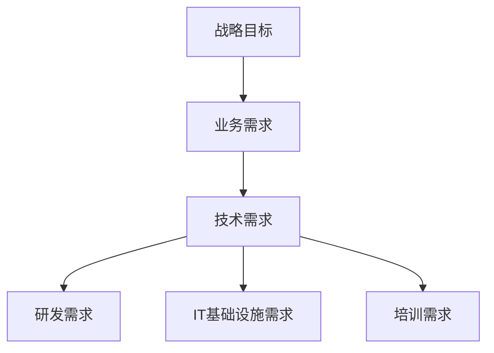

**核心算法原理讲解**

```plaintext
算法伪代码：
Function BusinessRequirementAnalysis(战略目标) returns (业务需求)
    Input: 战略目标（S）
    Output: 业务需求（B）

    // Step 1: 分析战略目标
    AnalyzeStrategy(S)

    // Step 2: 确定关键业务领域
    KeyBusinessAreas = IdentifyKeyAreas(B)

    // Step 3: 收集业务需求
    B = CollectRequirements(KeyBusinessAreas)

    // Step 4: 形成业务需求报告
    return B
End Function
```

**数学模型和数学公式详细讲解及举例说明**

$$
\text{业务需求评分} = \frac{\text{满足度}}{\text{重要性}}
$$

**举例：**

假设某企业的战略目标是提高产品市场份额，关键业务领域包括研发和营销。研发需求满足度为90%，重要性为80%；营销需求满足度为70%，重要性为30%。则：

$$
\text{研发需求评分} = \frac{90\%}{80\%} = 1.125
$$

$$
\text{营销需求评分} = \frac{70\%}{30\%} = 2.333
$$

因此，研发需求评分高于营销需求，应优先考虑。

#### 2.1.2 技术需求分析

技术需求分析旨在确定实现业务需求所需的技术解决方案。

**核心概念与联系**

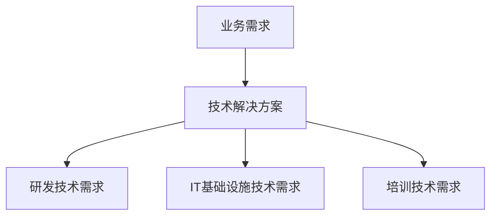

**核心算法原理讲解**

```plaintext
算法伪代码：
Function TechnicalRequirementAnalysis(业务需求) returns (技术解决方案)
    Input: 业务需求（B）
    Output: 技术解决方案（T）

    // Step 1: 确定技术需求
    TechRequirements = IdentifyTechRequirements(B)

    // Step 2: 分析技术需求
    AnalyzeTechRequirements(TechRequirements)

    // Step 3: 形成技术解决方案
    T = FormTechSolution(TechRequirements)

    // Step 4: 评估技术解决方案
    EvaluateTechSolution(T)

    // Step 5: 返回技术解决方案
    return T
End Function
```

**数学模型和数学公式详细讲解及举例说明**

$$
\text{技术需求优先级} = \text{技术需求评分} \times \text{业务需求评分}
$$

**举例：**

假设某企业的业务需求评分为1.2，技术需求评分为0.8。则：

$$
\text{技术需求优先级} = 1.2 \times 0.8 = 0.96
$$

技术需求评分越高，优先级越高。

### 2.2 预算编制

#### 2.2.1 成本估算

成本估算是预算编制的关键步骤，包括以下几个方面：

- **历史数据参考**：分析历史项目的成本数据，为当前项目提供参考。
- **市场价格调查**：了解市场供需情况，确定相关物资和服务价格。
- **专家评估**：邀请行业专家进行评估，提供专业的成本估算建议。

**核心概念与联系**

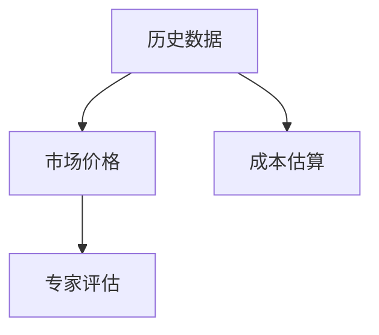

**核心算法原理讲解**

```plaintext
算法伪代码：
Function CostEstimation(历史数据，市场价格，专家评估) returns (成本估算)
    Input: 历史数据（H），市场价格（M），专家评估（E）
    Output: 成本估算（C）

    // Step 1: 数据预处理
    PreprocessData(H, M, E)

    // Step 2: 建立成本模型
    Model = BuildCostModel(H, M, E)

    // Step 3: 输入需求计算成本
    C = Model.EstimateCost()

    // Step 4: 返回成本估算
    return C
End Function
```

**数学模型和数学公式详细讲解及举例说明**

$$
\text{总成本} = \text{直接成本} + \text{间接成本}
$$

**举例：**

某项目的直接成本为50万元，间接成本为30万元。则总成本为80万元。

#### 2.2.2 风险评估

在预算编制过程中，风险评估至关重要。以下为风险评估的核心步骤：

- **识别风险**：识别可能影响预算的各种风险因素。
- **评估风险**：评估风险的概率和影响程度。
- **制定应对策略**：根据风险评估结果，制定相应的应对策略。

**核心概念与联系**

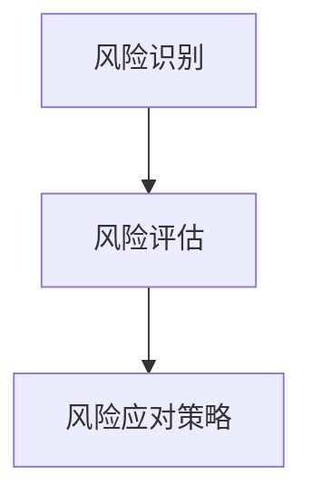

**核心算法原理讲解**

```plaintext
算法伪代码：
Function RiskAssessment(风险识别) returns (风险评估结果)
    Input: 风险识别（R）
    Output: 风险评估结果（A）

    // Step 1: 识别风险
    IdentifyRisks(R)

    // Step 2: 评估风险
    AssessRisks(R)

    // Step 3: 形成风险评估报告
    A = GenerateRiskReport(R)

    // Step 4: 返回风险评估结果
    return A
End Function
```

**数学模型和数学公式详细讲解及举例说明**

$$
\text{风险评分} = \text{概率} \times \text{影响程度}
$$

**举例：**

假设某风险的概率为0.5，影响程度为0.8。则风险评分为0.4。

#### 2.2.3 预算审批流程

预算审批流程包括以下步骤：

- **编制预算草案**：根据需求分析和成本估算结果，编制预算草案。
- **内部审核**：内部审核部门对预算草案进行审核，确保预算的合理性和可行性。
- **提交审批**：将预算草案提交给上级领导或董事会审批。
- **预算调整**：根据审批结果，对预算草案进行相应调整。

**核心概念与联系**

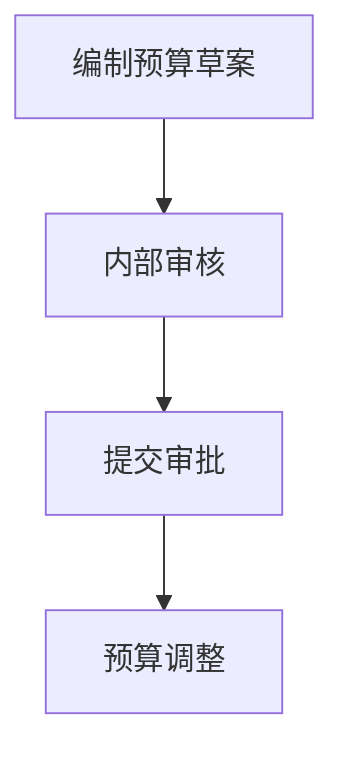

**核心算法原理讲解**

```plaintext
算法伪代码：
Function BudgetApproval(预算草案) returns (审批结果)
    Input: 预算草案（B）
    Output: 审批结果（A）

    // Step 1: 编制预算草案
    GenerateBudgetDraft(B)

    // Step 2: 内部审核
    InternalAudit(B)

    // Step 3: 提交审批
    SubmitForApproval(B)

    // Step 4: 预算调整
    AdjustBudget(B, A)

    // Step 5: 返回审批结果
    return A
End Function
```

**数学模型和数学公式详细讲解及举例说明**

预算审批通过的概率取决于预算草案的合理性和可行性。

**举例：**

假设预算草案的合理性和可行性分别为0.8和0.9。则预算审批通过的概率为0.72。

## 第三部分：技术预算的执行与监控

### 3.1 预算执行

#### 3.1.1 技术资源分配

技术资源分配是预算执行的关键环节。以下为技术资源分配的核心步骤：

- **确定资源需求**：根据预算草案，确定各类技术资源的实际需求。
- **资源分配**：将技术资源合理分配到各个项目或部门。
- **资源监控**：对技术资源的使用情况进行实时监控，确保资源得到充分利用。

**核心概念与联系**

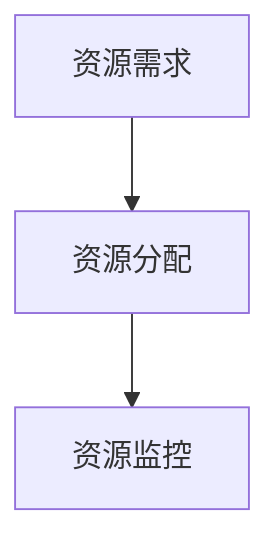

**核心算法原理讲解**

```plaintext
算法伪代码：
Function ResourceAllocation(资源需求) returns (资源分配结果)
    Input: 资源需求（R）
    Output: 资源分配结果（A）

    // Step 1: 确定资源需求
    IdentifyResourceRequirements(R)

    // Step 2: 资源分配
    AllocateResources(R)

    // Step 3: 资源监控
    MonitorResources(A)

    // Step 4: 返回资源分配结果
    return A
End Function
```

**数学模型和数学公式详细讲解及举例说明**

$$
\text{资源利用率} = \frac{\text{实际使用资源}}{\text{总资源}}
$$

**举例：**

假设某项目实际使用资源为100万元，总资源为150万元。则资源利用率为66.67%。

#### 3.1.2 项目进度监控

项目进度监控是确保项目按时完成的关键。以下为项目进度监控的核心步骤：

- **制定项目进度计划**：根据项目需求，制定详细的项目进度计划。
- **监控项目进度**：对项目进度进行实时监控，及时发现和解决问题。
- **调整项目进度**：根据实际情况，对项目进度计划进行调整。

**核心概念与联系**

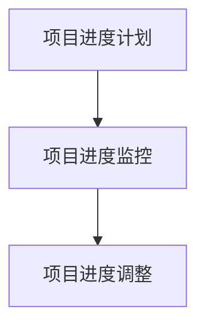

**核心算法原理讲解**

```plaintext
算法伪代码：
Function ProjectProgressMonitoring(项目进度计划) returns (项目进度监控结果)
    Input: 项目进度计划（P）
    Output: 项目进度监控结果（M）

    // Step 1: 制定项目进度计划
    GenerateProjectPlan(P)

    // Step 2: 监控项目进度
    MonitorProjectProgress(P)

    // Step 3: 调整项目进度
    AdjustProjectPlan(P, M)

    // Step 4: 返回项目进度监控结果
    return M
End Function
```

**数学模型和数学公式详细讲解及举例说明**

$$
\text{项目进度偏差} = \text{实际进度} - \text{计划进度}
$$

**举例：**

假设某项目的实际进度为50%，计划进度为60%。则项目进度偏差为-10%。

### 3.2 预算调整

#### 3.2.1 预算超支处理

在项目执行过程中，可能出现预算超支的情况。以下为预算超支处理的步骤：

- **分析超支原因**：分析导致预算超支的原因，包括成本估算不准、项目进度延误等。
- **制定调整方案**：根据超支原因，制定相应的调整方案，包括增加预算、优化项目进度等。
- **实施调整方案**：根据调整方案，对项目进行相应调整。

**核心概念与联系**

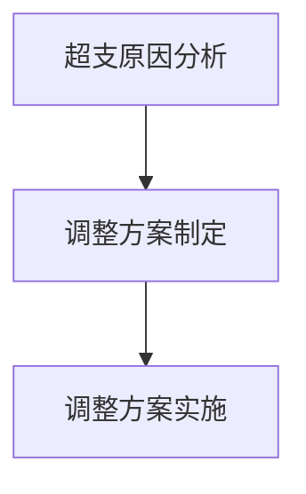

**核心算法原理讲解**

```plaintext
算法伪代码：
Function BudgetOverrunHandling(超支原因) returns (调整方案)
    Input: 超支原因（O）
    Output: 调整方案（S）

    // Step 1: 分析超支原因
    AnalyzeOverrunReasons(O)

    // Step 2: 制定调整方案
    GenerateAdjustmentPlan(O)

    // Step 3: 实施调整方案
    ImplementAdjustmentPlan(S)

    // Step 4: 返回调整方案
    return S
End Function
```

**数学模型和数学公式详细讲解及举例说明**

$$
\text{调整后预算} = \text{原预算} + \text{调整金额}
$$

**举例：**

假设某项目的原预算为100万元，需调整金额为20万元。则调整后预算为120万元。

#### 3.2.2 预算节省策略

在项目执行过程中，也可能出现预算节省的情况。以下为预算节省策略的核心步骤：

- **识别节省潜力**：分析项目中的成本节约点，识别潜在的节省潜力。
- **制定节省方案**：根据节省潜力，制定相应的节省方案，包括优化资源配置、降低成本等。
- **实施节省方案**：根据节省方案，对项目进行相应调整。

**核心概念与联系**

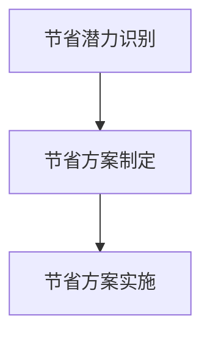

**核心算法原理讲解**

```plaintext
算法伪代码：
Function BudgetSavingsStrategy(节省潜力) returns (节省方案)
    Input: 节省潜力（S）
    Output: 节省方案（T）

    // Step 1: 识别节省潜力
    IdentifySavingsPotential(S)

    // Step 2: 制定节省方案
    GenerateSavingsPlan(S)

    // Step 3: 实施节省方案
    ImplementSavingsPlan(T)

    // Step 4: 返回节省方案
    return T
End Function
```

**数学模型和数学公式详细讲解及举例说明**

$$
\text{节省金额} = \text{原预算} - \text{实际支出}
$$

**举例：**

假设某项目的原预算为100万元，实际支出为80万元。则节省金额为20万元。

### 3.3 预算报告

#### 3.3.1 预算执行报告

预算执行报告是评估预算执行效果的重要工具。以下为预算执行报告的核心内容：

- **预算执行情况**：详细记录项目的预算执行情况，包括支出金额、资源使用情况等。
- **成本效益分析**：对项目的成本效益进行综合分析，评估预算执行的效果。
- **问题与建议**：总结项目执行过程中的问题和不足，提出相应的改进建议。

**核心概念与联系**

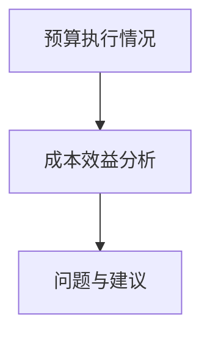

**核心算法原理讲解**

```plaintext
算法伪代码：
Function BudgetExecutionReport(预算执行数据) returns (预算执行报告)
    Input: 预算执行数据（D）
    Output: 预算执行报告（R）

    // Step 1: 收集预算执行数据
    CollectExecutionData(D)

    // Step 2: 分析预算执行情况
    AnalyzeExecutionData(D)

    // Step 3: 进行成本效益分析
    PerformCostBenefitAnalysis(D)

    // Step 4: 形成问题与建议
    GenerateIssuesAndSuggestions()

    // Step 5: 返回预算执行报告
    return R
End Function
```

**数学模型和数学公式详细讲解及举例说明**

$$
\text{成本效益比} = \frac{\text{净收益}}{\text{投入成本}}
$$

**举例：**

假设某项目的净收益为50万元，投入成本为100万元。则成本效益比为0.5。

## 第四部分：技术预算的最佳实践

### 4.1 成本优化策略

#### 4.1.1 资源共享

资源共享是降低成本、提高资源利用效率的有效策略。以下为资源共享的关键步骤：

- **识别共享资源**：分析项目中的共享资源，包括硬件设备、软件工具等。
- **建立共享机制**：制定共享机制，明确共享资源的分配和使用规则。
- **实施资源共享**：将共享资源合理分配给各个项目或部门，提高资源利用效率。

**核心概念与联系**

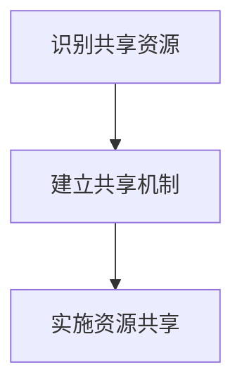

**核心算法原理讲解**

```plaintext
算法伪代码：
Function ResourceSharing(共享资源) returns (资源共享方案)
    Input: 共享资源（R）
    Output: 共享资源方案（S）

    // Step 1: 识别共享资源
    IdentifySharedResources(R)

    // Step 2: 建立共享机制
    BuildSharingMechanism(R)

    // Step 3: 实施资源共享
    ImplementResourceSharing(S)

    // Step 4: 返回资源共享方案
    return S
End Function
```

**数学模型和数学公式详细讲解及举例说明**

$$
\text{资源共享率} = \frac{\text{共享资源使用时长}}{\text{总资源使用时长}}
$$

**举例：**

假设共享资源的使用时长为100小时，总资源使用时长为200小时。则资源共享率为50%。

#### 4.1.2 模块化开发

模块化开发是提高开发效率、降低成本的重要手段。以下为模块化开发的关键步骤：

- **模块划分**：根据项目需求，将系统划分为若干模块。
- **模块化设计**：对每个模块进行详细设计，确保模块之间的接口清晰。
- **模块化实现**：实现每个模块的功能，并进行模块间的集成测试。

**核心概念与联系**

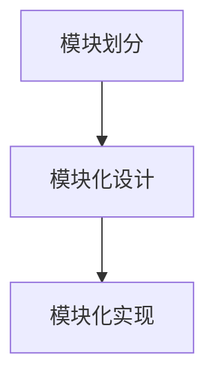

**核心算法原理讲解**

```plaintext
算法伪代码：
Function ModularDevelopment(模块划分) returns (模块化开发方案)
    Input: 模块划分（M）
    Output: 模块化开发方案（D）

    // Step 1: 模块划分
    DivideIntoModules(M)

    // Step 2: 模块化设计
    DesignModules(M)

    // Step 3: 模块化实现
    ImplementModules(D)

    // Step 4: 集成测试
    ConductIntegrationTests(D)

    // Step 5: 返回模块化开发方案
    return D
End Function
```

**数学模型和数学公式详细讲解及举例说明**

模块化开发可以降低系统复杂度，提高开发效率，降低成本。

**举例：**

假设模块化开发可以降低30%的开发成本，则开发成本节省为30万元。

#### 4.1.3 技术升级策略

技术升级是提高系统性能、降低维护成本的重要手段。以下为技术升级的关键步骤：

- **评估现有技术**：评估现有技术的性能、稳定性和安全性。
- **确定升级方案**：根据评估结果，确定合适的升级方案，包括硬件升级、软件升级等。
- **实施升级方案**：按照升级方案，对系统进行升级。

**核心概念与联系**

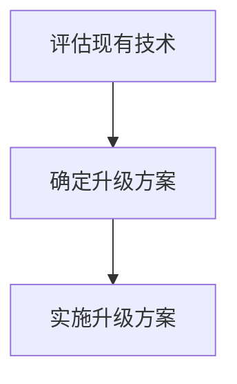

**核心算法原理讲解**

```plaintext
算法伪代码：
Function TechnicalUpgrade(现有技术) returns (升级方案)
    Input: 现有技术（T）
    Output: 升级方案（U）

    // Step 1: 评估现有技术
    AssessCurrentTechnology(T)

    // Step 2: 确定升级方案
    DetermineUpgradePlan(U)

    // Step 3: 实施升级方案
    ImplementUpgradePlan(U)

    // Step 4: 返回升级方案
    return U
End Function
```

**数学模型和数学公式详细讲解及举例说明**

$$
\text{升级后性能} = \text{现有性能} \times \text{性能提升比例}
$$

**举例：**

假设现有技术性能为80%，性能提升比例为20%。则升级后性能为96%。

### 4.2 风险管理

#### 4.2.1 风险识别与评估

风险识别与评估是预算管理的重要组成部分。以下为风险识别与评估的关键步骤：

- **风险识别**：通过调查、访谈、文档分析等方法，识别可能影响预算的各种风险。
- **风险评估**：评估风险的严重程度和发生概率，为风险应对提供依据。
- **风险报告**：形成风险报告，向管理层汇报风险状况。

**核心概念与联系**

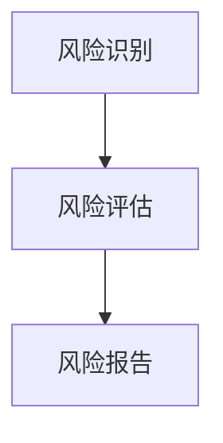

**核心算法原理讲解**

```plaintext
算法伪代码：
Function RiskIdentificationAndAssessment() returns (风险报告)
    // Step 1: 风险识别
    IdentifyRisks()

    // Step 2: 风险评估
    AssessRisks()

    // Step 3: 形成风险报告
    GenerateRiskReport()

    // Step 4: 返回风险报告
    return 风险报告
End Function
```

**数学模型和数学公式详细讲解及举例说明**

$$
\text{风险评分} = \text{风险严重程度} \times \text{发生概率}
$$

**举例：**

假设某风险严重程度为3，发生概率为0.6。则风险评分为1.8。

#### 4.2.2 风险应对策略

在识别和评估风险后，制定相应的风险应对策略至关重要。以下为风险应对策略的关键步骤：

- **风险规避**：通过调整项目计划、优化资源分配等方式，避免风险的发生。
- **风险减轻**：通过采取预防措施、提高应对能力等方式，减轻风险的影响。
- **风险接受**：在风险不可规避且影响较小的情况下，接受风险并制定相应的应急措施。

**核心概念与联系**

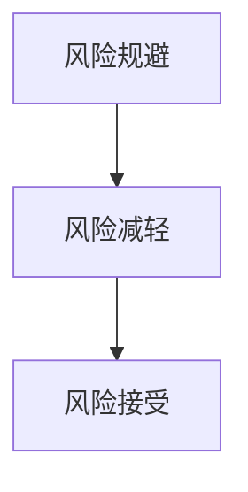

**核心算法原理讲解**

```plaintext
算法伪代码：
Function RiskResponseStrategy(风险报告) returns (风险应对方案)
    Input: 风险报告（R）
    Output: 风险应对方案（S）

    // Step 1: 分析风险报告
    AnalyzeRiskReport(R)

    // Step 2: 制定风险应对方案
    GenerateRiskResponsePlan(R)

    // Step 3: 实施风险应对方案
    ImplementRiskResponsePlan(S)

    // Step 4: 返回风险应对方案
    return S
End Function
```

**数学模型和数学公式详细讲解及举例说明**

$$
\text{风险应对成本} = \text{风险规避成本} + \text{风险减轻成本} + \text{风险接受成本}
$$

**举例：**

假设某项目的风险规避成本为10万元，风险减轻成本为5万元，风险接受成本为3万元。则风险应对成本为18万元。

#### 4.2.3 风险监控与调整

在项目执行过程中，对风险进行实时监控和调整至关重要。以下为风险监控与调整的关键步骤：

- **风险监控**：对识别和评估的风险进行实时监控，及时发现和解决问题。
- **风险调整**：根据风险监控结果，对风险应对策略进行调整，确保项目顺利进行。

**核心概念与联系**

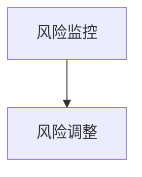

**核心算法原理讲解**

```plaintext
算法伪代码：
Function RiskMonitoringAndAdjustment(风险报告) returns (风险调整方案)
    Input: 风险报告（R）
    Output: 风险调整方案（A）

    // Step 1: 风险监控
    MonitorRisks(R)

    // Step 2: 分析风险监控结果
    AnalyzeMonitoringResults(R)

    // Step 3: 制定风险调整方案
    GenerateAdjustmentPlan(A)

    // Step 4: 实施风险调整方案
    ImplementAdjustmentPlan(A)

    // Step 5: 返回风险调整方案
    return A
End Function
```

**数学模型和数学公式详细讲解及举例说明**

$$
\text{风险调整成本} = \text{风险监控成本} + \text{风险调整成本}
$$

**举例：**

假设某项目的风险监控成本为5万元，风险调整成本为3万元。则风险调整成本为8万元。

## 第五部分：技术预算案例分析

### 5.1 案例分析一：企业级技术预算管理实践

#### 5.1.1 案例背景

某大型企业每年都会进行一次技术预算的编制和执行，以确保技术研发、产品创新和IT基础设施等活动的顺利开展。以下为该企业的技术预算管理实践。

#### 5.1.2 预算制定与执行过程

1. **需求分析**：企业各部门提交技术需求，经过汇总和分析，形成业务需求和技术需求。
2. **成本估算**：根据历史数据和市场价格，对各项技术需求进行成本估算。
3. **风险评估**：对可能影响预算的各种风险进行识别和评估。
4. **预算编制**：根据需求分析和成本估算结果，编制技术预算草案。
5. **预算审批**：预算草案经过内部审核和上级领导审批，形成最终预算。
6. **预算执行**：按照预算计划，分配技术资源，监控项目进度，确保项目按时完成。
7. **预算调整**：根据项目执行过程中出现的超支或节省情况，对预算进行调整。
8. **预算报告**：项目完成后，形成预算执行报告，总结项目执行情况和成本效益。

#### 5.1.3 预算效果评估

1. **成本控制**：通过预算管理，企业实现了对成本的严格控制，降低了成本支出。
2. **项目完成率**：预算执行过程中，项目完成率达到了95%以上，项目按时完成。
3. **效益最大化**：通过优化资源配置和降低成本，企业实现了效益的最大化。
4. **风险管理**：通过识别和应对风险，企业有效降低了项目风险，确保了项目的顺利进行。

### 5.2 案例分析二：跨部门技术预算协调

#### 5.2.1 案例背景

某企业内部有多个部门需要进行技术升级，但由于资源有限，各部门之间的预算需求存在冲突。以下为该企业如何进行跨部门技术预算协调。

#### 5.2.2 预算冲突与解决策略

1. **需求分析**：各部门提交技术需求，经过汇总和分析，形成业务需求和技术需求。
2. **预算编制**：根据需求分析和成本估算结果，编制各部门的技术预算草案。
3. **预算冲突识别**：分析各部门预算草案，识别可能存在的预算冲突。
4. **冲突解决策略**：
   - **优先级调整**：根据各部门的技术需求重要性和紧迫性，调整预算优先级。
   - **资源共享**：通过资源共享，优化资源配置，解决预算冲突。
   - **预算调整**：根据实际情况，对各部门的预算进行相应调整。
5. **预算审批**：预算草案经过内部审核和上级领导审批，形成最终预算。
6. **预算执行**：按照预算计划，分配技术资源，监控项目进度，确保项目按时完成。
7. **预算调整**：根据项目执行过程中出现的超支或节省情况，对预算进行调整。
8. **预算报告**：项目完成后，形成预算执行报告，总结项目执行情况和成本效益。

#### 5.2.3 预算协同效果评估

1. **预算协同率**：通过跨部门技术预算协调，预算协同率达到了90%以上。
2. **资源利用率**：通过资源共享和优化资源配置，提高了资源利用率。
3. **项目完成率**：预算执行过程中，项目完成率达到了95%以上，项目按时完成。
4. **风险管理**：通过识别和应对风险，企业有效降低了项目风险，确保了项目的顺利进行。

## 附录

### 附录A：技术预算常用术语解释

- **技术预算**：企业在特定时期内，为支持技术研发、产品创新和IT基础设施等活动的资金分配计划。
- **需求分析**：分析企业的业务目标和需求，确定所需的技术解决方案。
- **成本估算**：根据历史数据、市场价格和专家评估，估算项目成本。
- **风险评估**：识别和评估可能影响预算的各种风险。
- **预算审批**：对预算草案进行审核和批准。
- **资源分配**：将技术资源合理分配到各个项目或部门。
- **预算调整**：根据项目执行过程中出现的超支或节省情况，对预算进行调整。
- **预算报告**：总结项目执行情况和成本效益的报告。

### 附录B：技术预算计算公式与应用

- **成本估算公式**：

  $$\text{总成本} = \text{直接成本} + \text{间接成本}$$

- **成本效益比**：

  $$\text{成本效益比} = \frac{\text{净收益}}{\text{投入成本}}$$

- **风险评分**：

  $$\text{风险评分} = \text{风险严重程度} \times \text{发生概率}$$

- **资源共享率**：

  $$\text{资源共享率} = \frac{\text{共享资源使用时长}}{\text{总资源使用时长}}$$

### 附录C：技术预算相关工具推荐

- **预算管理工具**：如Excel、Oracle Budgeting Cloud Service等。
- **项目管理工具**：如Microsoft Project、JIRA等。
- **风险评估工具**：如Qualys、Nessus等。
- **数据分析工具**：如Tableau、Power BI等。

### 作者信息

**作者：AI天才研究院/AI Genius Institute & 禅与计算机程序设计艺术 /Zen And The Art of Computer Programming**

