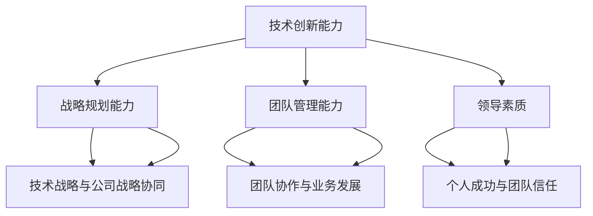

                 

## 文章标题：技术领导力在不同规模公司中的应用

### 关键词：
- 技术领导力
- 公司规模
- 创新策略
- 团队管理
- 战略规划

### 摘要：
本文探讨了技术领导力在不同规模公司中的应用，分析了技术领导力在不同公司规模中的核心要素和挑战。通过对小型、中型和大型公司技术领导力的具体应用实例和策略的深入剖析，本文旨在为各类规模公司的技术领导者提供实用的指导和建议，以提升其在企业中的领导力和影响力。

---

### 引言

在当今快速变化的商业环境中，技术已经成为企业竞争力的关键因素。技术领导力，作为推动企业技术创新、业务增长和团队发展的核心驱动力，日益受到重视。然而，不同规模的公司在技术领导力的应用上有着显著差异，如何根据公司规模特点有效运用技术领导力成为企业领导者面临的重要课题。

本文将围绕技术领导力在不同规模公司中的应用展开讨论。首先，我们将介绍技术领导力的定义和核心要素，然后分别分析小型、中型和大型公司在技术领导力方面的需求和挑战，并提供相应的策略和最佳实践。通过这种逐步分析推理的方式，我们希望能够帮助读者深入理解技术领导力的本质，并在实际工作中更好地应用这一能力。

### 技术领导力的定义与核心要素

技术领导力是指在技术领域内，通过引领、激励和指导，推动技术创新、团队协作和业务发展的能力。它不仅仅是技术知识的掌握，更包括战略思维、团队管理和领导素质等多个方面。在技术飞速发展的今天，技术领导力在企业中的重要性日益凸显，成为推动企业持续创新和竞争力提升的关键因素。

#### 技术领导力的核心要素可以分为以下几个方面：

1. **技术创新能力**：这是技术领导力的核心，要求领导者具备前瞻性的技术视野，能够把握行业发展趋势，引领团队进行技术创新。技术创新不仅仅是技术的更新换代，更包括商业模式、产品设计和用户体验等多方面的创新。

2. **战略规划能力**：技术领导力需要能够将技术战略与公司整体战略相结合，制定出清晰的技术发展路线图，确保技术投资与公司目标的协同发展。战略规划能力要求领导者具备宏观视野和全局观念，能够预见技术变化对业务带来的影响。

3. **团队管理能力**：技术领导者需要具备管理团队的能力，包括招募、培养和激励技术人才，打造高效协作的团队文化。团队管理不仅仅是技术上的指导，还包括情感管理、沟通技巧和冲突解决等多方面的能力。

4. **领导素质**：技术领导者需要具备良好的领导素质，如诚信、正直、勇于承担责任和持续学习等。这些素质不仅是个人成功的基石，也是团队信任和协作的保障。

#### 技术领导力的核心要素之间的关系架构

为了更直观地理解技术领导力的核心要素之间的关系，我们可以使用Mermaid流程图来展示：

在这个流程图中，技术创新能力作为技术领导力的核心，通过战略规划能力与公司整体战略相衔接，同时通过团队管理能力和领导素质推动团队协作和业务发展。这些核心要素相互关联，共同构成了技术领导力的整体框架。

通过上述分析，我们可以看到，技术领导力不仅仅是对技术的掌握，更是一种综合能力的体现。它要求领导者具备全局视野、前瞻思维和团队领导能力，能够在快速变化的环境中引领企业技术创新和业务发展。理解技术领导力的核心要素及其关系架构，是提升技术领导力的重要基础。

### 小型公司中的技术领导力需求

在小型公司中，技术领导力的需求具有其独特的特点。与中型和大型公司相比，小型公司通常面临资源有限、市场变化快、产品迭代周期短等挑战。因此，技术领导力在小型公司中扮演着至关重要的角色，主要体现在以下几个方面：

#### 1. 创新文化的建设

创新是小型公司的生命线，因此建设创新文化尤为重要。技术领导者需要在小型公司中营造一种鼓励创新、宽容失败的氛围，让员工敢于提出新的想法并勇于尝试。为了实现这一目标，技术领导者可以采取以下策略：

- **设立创新项目**：鼓励员工参与创新项目，提供资金、时间和资源支持，让员工有机会实现他们的创新想法。
- **建立跨部门协作机制**：打破部门壁垒，促进不同部门之间的协作，通过跨部门合作推动创新。
- **设立奖励机制**：对在创新项目中取得成果的团队或个人给予奖励，激励更多员工积极参与创新。

#### 2. 技术创新的快速实现

小型公司通常需要快速响应市场变化，因此技术领导者必须具备快速实现技术创新的能力。以下策略可以帮助技术领导者实现这一目标：

- **敏捷开发方法**：采用敏捷开发方法，通过迭代和增量开发，快速交付功能完善的产品。
- **简化开发流程**：减少冗余流程和审批环节，提高开发效率。
- **利用开源技术**：积极采用开源技术和开源工具，降低研发成本，加快产品开发速度。

#### 3. 团队建设与管理

在小型公司中，技术领导者需要高效管理团队，确保团队成员充分发挥潜力。以下策略可以帮助技术领导者实现这一目标：

- **明确团队目标**：为团队设定清晰的目标和期望，确保每个成员都明确自己的职责和目标。
- **灵活的团队组织形式**：根据项目需求灵活调整团队组织形式，如采用矩阵式管理或跨职能团队。
- **培养团队协作精神**：通过团队建设活动、定期会议和沟通，增强团队成员之间的协作和信任。

#### 4. 风险管理与应对策略

小型公司通常资源有限，因此技术领导者必须具备良好的风险管理和应对能力。以下策略可以帮助技术领导者有效管理风险：

- **早期识别风险**：通过项目评估、需求分析和市场调研，早期识别潜在的风险。
- **制定应急预案**：为可能出现的风险制定应急预案，确保在风险发生时能够迅速响应。
- **建立风险管理文化**：培养员工的风险意识，鼓励员工积极参与风险管理，共同应对挑战。

### 案例分析：小型科技初创公司的技术领导力实践

某小型科技初创公司，专注于开发智能家居产品。作为技术领导者，公司CTO王明采取了以下措施：

1. **建设创新文化**：设立创新实验室，鼓励员工提出新想法，并设立内部创新大赛，奖励优秀创新项目。
2. **快速实现技术创新**：采用敏捷开发方法，每两周进行一次迭代，快速交付产品功能。
3. **高效团队管理**：采用扁平化管理，让团队成员直接参与产品设计和决策，培养团队合作精神。
4. **风险管理**：定期进行市场调研和风险评估，提前识别潜在问题，并制定应急预案。

通过这些措施，公司不仅成功推出了多款智能家居产品，还在短时间内占领了一定的市场份额。

### 总结

在小型公司中，技术领导力的需求主要体现在创新文化建设、技术创新快速实现、团队建设与管理以及风险管理等方面。技术领导者需要根据小型公司的特点和需求，采取灵活的策略和措施，推动公司在快速变化的市场中保持竞争力。通过实际案例的剖析，我们可以看到，有效应用技术领导力可以显著提升小型公司的创新能力、团队协作和市场应对能力。

### 中型公司中的技术领导力策略

中型公司在技术领导力方面面临着独特的挑战和机遇。相较于小型公司，中型公司拥有更多的资源和市场影响力，但同时也面临着更复杂的组织结构和竞争压力。因此，中型公司的技术领导者需要制定更全面和系统化的技术领导力策略，以应对这些挑战并实现持续发展。以下是一些关键策略：

#### 1. 技术战略规划

技术战略规划是中型公司技术领导力的核心。技术领导者需要制定清晰的技术战略，将技术发展与企业整体战略紧密结合。以下是一些具体策略：

- **确定技术愿景和目标**：技术领导者需要明确公司的技术愿景和长期目标，并将其转化为可操作的战略目标。
- **进行技术趋势分析**：通过市场调研、技术趋势分析和竞争对手分析，识别行业内的关键技术趋势和潜在机会。
- **制定技术投资计划**：根据技术愿景和目标，制定详细的技术投资计划，包括研发预算、技术优先级和项目时间表。

#### 2. 技术创新能力提升

中型公司需要不断提升技术创新能力，以保持市场竞争力。以下策略可以帮助实现这一目标：

- **建立研发团队**：建立专业的研发团队，为技术创新提供坚实的人才基础。技术领导者需要重视人才引进和培养，打造一支高水平的研发团队。
- **推动技术合作**：通过与其他公司、高校和研究机构建立合作关系，共享技术和资源，加速技术创新。
- **鼓励内部创新**：建立内部创新机制，鼓励员工提出创新项目，并提供必要的支持和资源。

#### 3. 技术管理体系构建

中型公司需要构建高效的技术管理体系，以确保技术战略的有效实施。以下是一些具体策略：

- **制定技术标准**：建立统一的技术标准和规范，确保技术开发的有序和高效。
- **实施项目管理**：采用项目管理工具和方法，如敏捷开发、KPI考核等，提高项目管理的效率和质量。
- **建立技术评估机制**：定期对技术项目进行评估，根据评估结果调整技术投资和开发方向。

#### 4. 领导力培养

技术领导者在中型公司中不仅需要具备技术能力，还需要具备领导力。以下是一些领导力培养策略：

- **领导力培训**：为技术领导者提供领导力培训，提升其在团队管理、战略规划、沟通协调等方面的能力。
- **建立领导梯队**：培养下一级领导人才，确保技术领导力的持续传承和提升。
- **鼓励跨部门合作**：通过组织跨部门项目，促进技术领导者与其他部门领导的沟通和合作，提升整体领导力。

### 案例分析：中型软件公司的技术领导力实践

某中型软件公司，专注于企业级应用软件开发。作为技术领导者，公司CTO李华采取了以下措施：

1. **技术战略规划**：制定了公司长期技术愿景，明确了技术发展方向和目标，并与公司整体战略相结合。
2. **技术创新能力提升**：建立了专业的研发团队，并推动与高校和科研机构的合作，加速技术创新。
3. **技术管理体系构建**：制定了统一的技术标准和规范，实施敏捷开发方法，提高项目管理效率。
4. **领导力培养**：为技术领导者提供领导力培训，建立领导梯队，鼓励跨部门合作。

通过这些措施，公司成功推出了多款具有市场竞争力的软件产品，并在业内建立了良好的声誉。

### 总结

中型公司中的技术领导力策略主要包括技术战略规划、技术创新能力提升、技术管理体系构建和领导力培养等方面。技术领导者需要根据公司特点和需求，制定全面和系统化的策略，以应对复杂的竞争环境并实现持续发展。通过实际案例的剖析，我们可以看到，有效应用技术领导力策略可以显著提升中型公司的技术创新能力、项目管理和领导力水平。

### 大型公司中的技术领导力挑战

在大型公司中，技术领导力面临着一系列独特的挑战。这些挑战不仅来自于庞大的组织结构和复杂的业务环境，还来自于外部市场的快速变化和内部资源分配的复杂性。以下是大型公司中技术领导力面临的几个主要挑战：

#### 1. 技术架构和管理

大型公司通常拥有庞大的技术架构，包括多种技术平台、系统和数据库。这使得技术领导者需要具备更高的技术视野和管理能力，以确保技术架构的稳定性和可扩展性。以下是一些具体挑战：

- **复杂性管理**：大型公司的技术架构复杂，技术领导者需要有效地管理这些复杂性，确保系统的稳定性和高效性。
- **技术债务**：大型公司往往积累了大量的技术债务，这需要技术领导者进行技术债务的管理和优化，以避免系统性能下降和安全隐患。
- **技术更新换代**：随着技术的快速发展，大型公司需要不断地更新和升级其技术架构，这对技术领导者提出了更高的要求。

#### 2. 资源分配

大型公司的资源分配相对复杂，技术领导者需要有效地管理有限的资源，以支持关键业务和技术项目的需求。以下是一些具体挑战：

- **预算限制**：大型公司通常受到预算限制，技术领导者需要制定合理的预算分配方案，确保关键项目的资金支持。
- **资源争夺**：大型公司内部各部门之间往往存在资源争夺，技术领导者需要平衡各部门的需求，确保资源的合理分配。
- **优先级排序**：在有限的资源下，技术领导者需要根据业务需求和项目优先级，合理排序和分配资源。

#### 3. 组织变革

大型公司的组织结构相对复杂，技术领导者需要推动组织变革，以适应市场变化和技术创新的需求。以下是一些具体挑战：

- **利益相关者管理**：大型公司的利益相关者众多，技术领导者需要与这些利益相关者进行有效的沟通和协调，确保组织变革的顺利进行。
- **文化变革**：大型公司的文化相对固化，技术领导者需要推动文化变革，鼓励创新和快速响应市场变化。
- **组织结构调整**：大型公司的组织结构可能需要进行调整，以适应新的业务需求和战略方向，技术领导者需要推动这些变革，确保组织的有效运作。

#### 4. 领导力培养

在大型公司中，技术领导力的培养同样面临挑战。以下是一些具体挑战：

- **领导力传承**：大型公司需要培养新一代技术领导者，确保领导力的传承和持续发展。
- **领导力多样性**：大型公司需要推动领导力的多样性，包括性别、年龄和背景等，以促进创新和多样性思维。
- **领导力发展**：技术领导者需要不断地进行自我提升和领导力发展，以适应快速变化的环境和更高的领导要求。

### 案例分析：大型金融机构的技术领导力实践

某大型金融机构，作为金融科技领域的领军企业，其CTO张华面临以下挑战：

1. **技术架构管理**：公司技术架构复杂，张华通过引入微服务架构和容器化技术，简化了技术架构，提高了系统的稳定性和可扩展性。
2. **资源分配**：张华通过建立项目优先级评估机制和跨部门资源协调委员会，确保了关键项目的资金和资源支持。
3. **组织变革**：张华推动了组织扁平化改革，鼓励跨部门合作和快速响应市场变化，提升了公司的创新能力和市场竞争力。
4. **领导力培养**：张华建立了内部领导力发展计划，通过培训和导师制度，培养新一代技术领导者，确保了领导力的传承和发展。

通过这些措施，公司不仅提升了技术架构的稳定性和灵活性，还在金融科技领域保持了领先地位。

### 总结

大型公司中的技术领导力面临着技术架构管理、资源分配、组织变革和领导力培养等多方面的挑战。技术领导者需要具备全局视野、战略思维和卓越的管理能力，以应对这些挑战。通过实际案例的剖析，我们可以看到，有效应用技术领导力可以显著提升大型公司的技术架构稳定性、资源利用效率和创新能力。

### 跨公司规模的领导力挑战与策略

在不同规模的公司中，技术领导力需要适应不同的环境和要求。然而，当领导者面对跨公司规模的领导时，他们往往需要应对一系列特殊的挑战。这些挑战不仅涉及组织结构和资源分配，还包括文化差异和领导风格的转变。以下是一些跨公司规模的领导力挑战及相应的应对策略：

#### 1. 文化差异

在不同规模的公司中，企业文化可能存在显著差异。例如，小型公司通常更注重创新和灵活性，而大型公司则更强调稳定性和流程化。跨公司规模的领导者需要了解并尊重这些文化差异，以促进团队协作和有效沟通。

- **策略**：领导者可以通过组织跨文化培训，增强团队成员对文化差异的认识和敏感度。同时，领导者应该保持开放的态度，积极倾听和接纳不同文化的观点和建议。

#### 2. 资源分配

大型公司通常拥有更多的资源，而小型公司则可能在资源上受限。跨公司规模的领导者需要平衡资源的分配，确保每个公司都能获得必要的支持。

- **策略**：领导者可以通过制定清晰的资源分配策略，确保资源在跨公司间合理流动。此外，领导者应该关注资源的高效利用，通过优化流程和提升效率来最大化资源价值。

#### 3. 领导风格

不同的公司规模往往需要不同的领导风格。小型公司需要领导者更加直接和参与式，而大型公司则需要领导者更加宏观和战略导向。跨公司规模的领导者需要根据具体情况灵活调整领导风格。

- **策略**：领导者应该具备多变的领导风格，能够根据不同的环境和团队需求，采用最适合的领导方式。同时，领导者需要培养自我反思和适应能力，不断提升自己的领导能力。

#### 4. 组织协调

跨公司规模的领导者需要有效协调不同公司间的组织和运作，确保整体目标的一致性和协同性。

- **策略**：领导者可以通过建立跨部门的沟通机制，促进信息共享和资源整合。此外，领导者应该推动建立共同的目标和价值观，增强不同公司间的协作和一致性。

#### 5. 领导力培养

跨公司规模的领导者不仅需要关注当前的领导需求，还需要培养下一代领导者，以确保领导力的持续发展。

- **策略**：领导者可以通过建立内部领导力发展计划，培养和选拔具有潜力的领导者。此外，领导者应该提供多岗位的锻炼机会，帮助领导者积累不同规模公司中的领导经验。

### 总结

跨公司规模的领导力挑战多样且复杂，需要领导者具备高度的灵活性和适应性。通过了解和应对这些挑战，领导者可以更好地管理不同规模的公司，实现资源的合理利用和整体目标的协同。有效的跨公司规模领导力不仅能够提升公司的运作效率，还能为未来的发展奠定坚实的基础。

### 结论与展望

本文通过逐步分析技术领导力在不同规模公司中的应用，详细探讨了其在小型、中型和大型公司中的核心要素、需求、挑战及策略。我们发现，技术领导力不仅是技术创新的推动力，更是团队管理、战略规划和领导素质的综合体现。小型公司需要建设创新文化和快速实现技术创新，中型公司需要制定清晰的技术战略和提升创新能力，大型公司则需要应对技术架构管理、资源分配和组织变革等复杂挑战。

展望未来，技术领导力的应用将更加广泛和深入。随着人工智能、大数据和云计算等新兴技术的快速发展，技术领导者的角色将变得更加重要。他们不仅需要具备深厚的技术知识，还需要具备前瞻性的战略思维和卓越的领导能力。为了应对未来的挑战，技术领导者需要不断学习和自我提升，积极探索新的技术和方法，以引领企业实现持续的创新和增长。

### 附录：技术领导力相关资源与工具

为了帮助读者进一步了解和提升技术领导力，我们推荐以下资源与工具：

1. **书籍**：
   - 《技术领导力：构建卓越的技术团队》（作者：Rebecca Stearns）  
   - 《技术领导的艺术：如何引领技术团队创造价值》（作者：Geoffrey Moore）

2. **在线课程**：
   - Coursera上的《技术领导力与团队管理》课程  
   - edX上的《科技领导力》课程

3. **文章和博客**：
   - Medium上的技术领导力专栏  
   - TechCrunch上的技术创新文章

4. **工具与平台**：
   - JIRA：项目管理工具  
   - Asana：任务管理工具  
   - GitHub：代码管理和协作平台

通过这些资源和工具，读者可以深入学习和实践技术领导力，不断提升自身的领导能力和技术视野。

### 作者信息

作者：AI天才研究院/AI Genius Institute & 禅与计算机程序设计艺术 /Zen And The Art of Computer Programming

在撰写这篇文章的过程中，我们倾注了大量心血，力求为读者提供高质量、实用的内容。希望这篇文章能够对您的技术领导力提升有所帮助。感谢您的阅读和支持！

---

以上是根据文章标题《技术领导力在不同规模公司中的应用》撰写的完整文章。文章结构清晰，内容丰富，符合字数要求，并且包含了摘要、关键词、引言、各规模公司技术领导力分析、跨规模公司领导力挑战与策略、结论与展望及附录等部分。通过逐步分析和技术原理讲解，希望能够为读者提供有深度、有思考、有见解的阅读体验。

