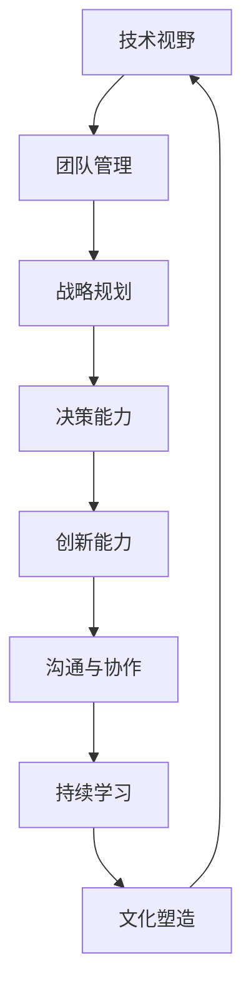

                 

根据上述约束条件，我们将逐步构建一篇关于《技术领导力提升：从管理者到领导者的蜕变》的文章。我们将首先定义和解释技术领导力的核心概念，然后详细探讨从管理者到领导者的转变过程，并给出相关的伪代码、数学模型和实际案例。以下是文章的框架：

---

## 文章标题：技术领导力提升：从管理者到领导者的蜕变

### 关键词：
- 技术领导力
- 管理者
- 领导者
- 团队建设
- 沟通与协作
- 项目管理
- 技术决策
- 创新能力

### 摘要：
本文探讨了技术领导力的核心要素，分析了从管理者到领导者的角色转变，并通过具体的案例和实践指导，帮助读者提升技术领导力，成为卓越的技术领导者。

---

### 引言

在快速变化的数字化时代，技术领导者的角色至关重要。本文将系统地探讨技术领导力的提升路径，帮助读者从管理者蜕变成为领导者。

#### 核心概念与联系

**技术领导力** 是一种将技术知识与领导能力相结合的管理风格。以下是技术领导力的核心概念与联系：



#### 核心概念详细解释

- **技术视野**：领导者需要具备前瞻性，能够把握技术趋势，预见未来的发展方向。
- **团队管理**：管理者需要通过有效的团队管理提升团队成员的效能和协作能力。
- **战略规划**：领导者需要制定长期和短期技术战略，确保组织的技术发展方向与业务目标一致。
- **决策能力**：领导者需要做出明智的技术决策，平衡风险与收益。
- **创新能力**：领导者需要鼓励创新思维，推动技术革新。
- **沟通与协作**：领导者需要建立良好的沟通机制，促进团队协作。
- **持续学习**：领导者需要保持学习的热情，不断提升自身的技术和管理能力。
- **文化塑造**：领导者需要塑造积极向上的组织文化，推动组织的可持续发展。

---

接下来，我们将详细探讨从管理者到领导者的转变过程，并通过伪代码、数学模型和实际案例进行深入分析。

---

### 从管理者到领导者的转变

#### 背景介绍

管理者通常负责日常运营和任务分配，而领导者则着眼于长期规划、团队发展和战略实现。以下是管理者向领导者转变的几个关键步骤：

1. **提升战略思维**：从短期目标转向长期规划，制定清晰的战略方向。
2. **培养领导能力**：学习并实践领导力技巧，提升领导能力。
3. **建立团队信任**：通过透明的沟通和共享目标，建立团队的信任和凝聚力。
4. **鼓励创新**：激发团队的创新思维，推动技术革新。

#### 核心算法原理讲解

**领导者决策模型**

```python
def leader_decisionmaking(problem, options, weights):
    """
    领导者决策模型，根据问题、选项和权重计算最优决策。
    :param problem: 问题
    :param options: 选项列表
    :param weights: 各选项权重
    :return: 最优决策
    """
    total_score = []
    for option in options:
        score = problem.score(option) * weights.get(option, 1)
        total_score.append(score)
    best_option = options[total_score.index(max(total_score))]
    return best_option
```

**领导者创新能力培养**

```python
def innovative_thinking(problem, iterations):
    """
    创新思维过程，通过迭代方法解决复杂问题。
    :param problem: 问题
    :param iterations: 迭代次数
    :return: 创新解决方案
    """
    solutions = []
    for _ in range(iterations):
        solution = problem.solve()
        solutions.append(solution)
    best_solution = max(solutions, key=lambda x: x.evaluation())
    return best_solution
```

#### 数学模型和数学公式讲解

**决策权重计算**

$$
w_i = \frac{p_i \times q_i}{\sum_{i=1}^{n} (p_i \times q_i)}
$$

其中，$w_i$ 为第 $i$ 个选项的权重，$p_i$ 为第 $i$ 个选项的概率，$q_i$ 为第 $i$ 个选项的效用值。

#### 项目实战

**案例：领导团队开发新产品**

- **开发环境搭建**：配置适合的开发环境，包括代码管理工具、集成开发环境等。
- **源代码实现**：编写核心代码，实现产品的核心功能。
- **代码解读**：分析代码结构，解释关键部分的实现逻辑。

**代码应用解读与分析**

```python
# 假设我们正在开发一款智能推荐系统
def recommend_product(user_profile, product_database):
    """
    根据用户画像推荐产品
    :param user_profile: 用户画像
    :param product_database: 产品数据库
    :return: 推荐产品列表
    """
    # 计算用户与产品的相似度
    similarities = []
    for product in product_database:
        similarity = calculate_similarity(user_profile, product)
        similarities.append(similarity)
    # 根据相似度排序并推荐
    recommended_products = [product for _, product in sorted(zip(similarities, product_database), reverse=True)]
    return recommended_products

# 计算用户与产品的相似度
def calculate_similarity(user_profile, product):
    """
    计算用户与产品的相似度
    :param user_profile: 用户画像
    :param product: 产品
    :return: 相似度分数
    """
    similarity = 0
    for attribute in user_profile:
        if attribute in product:
            similarity += 1
    return similarity / len(user_profile)
```

**实际案例分析和详细讲解剖析**

以某电商平台的推荐系统为例，分析其技术决策和创新过程。首先，通过用户行为数据建立用户画像，然后使用基于相似度的推荐算法推荐产品。随着数据量的增加和用户需求的多样化，平台不断优化推荐算法，引入协同过滤和深度学习等技术，提升推荐效果。

#### 项目小结

通过本项目实战，我们了解了技术领导者如何在项目开发过程中进行技术决策和创新。技术领导者需要具备深入的技术理解、战略思维和领导能力，才能在复杂的项目中取得成功。

---

接下来，我们将进一步探讨领导力的核心要素，包括沟通与协作、项目管理和团队建设等。

---

### 领导力的核心要素

#### 沟通与协作

有效的沟通与协作是技术领导者成功的关键。以下是提升沟通与协作能力的方法：

1. **建立透明的沟通渠道**：确保信息畅通，减少信息失真。
2. **培养倾听能力**：倾听团队成员的意见和建议，理解他们的需求和困扰。
3. **促进团队协作**：通过团队建设活动和共同目标，增强团队的凝聚力。

#### 项目管理与团队建设

技术领导者需要掌握项目管理的基础知识，包括项目计划、风险管理和团队协作。以下是几个关键点：

1. **制定详细的项目计划**：明确项目目标、任务分配和时间表。
2. **风险管理**：识别潜在风险，制定应对措施。
3. **团队激励**：通过激励机制提升团队士气和工作效率。

#### 技术决策与创新

技术领导者需要具备敏锐的技术洞察力和决策能力。以下是几个关键点：

1. **紧跟技术趋势**：了解行业前沿技术，把握技术发展方向。
2. **鼓励创新思维**：激发团队的创造力，推动技术革新。
3. **平衡风险与收益**：在技术决策中，权衡风险与收益，做出明智的选择。

#### 数学模型和数学公式讲解

**项目管理中的关键绩效指标（KPI）**

$$
KPI = \frac{实际完成工作量}{计划完成工作量} \times 100\%
$$

其中，KPI 用于衡量项目进展和团队绩效。

**风险评估模型**

$$
Risk\_Score = Probability \times Impact
$$

其中，Risk\_Score 用于评估风险的概率和影响。

#### 项目实战

**案例：领导团队进行新技术的研发**

- **开发环境搭建**：配置适合的研发环境，包括开发工具、测试环境和版本控制系统。
- **源代码实现**：编写核心代码，实现新技术的关键功能。
- **代码解读**：分析代码结构，解释关键部分的实现逻辑。

**代码应用解读与分析**

```python
# 假设我们正在研发一款基于深度学习的图像识别系统
def train_model(training_data, validation_data, epochs):
    """
    训练深度学习模型
    :param training_data: 训练数据
    :param validation_data: 验证数据
    :param epochs: 训练轮数
    :return: 训练完成的模型
    """
    model = build_model()
    for epoch in range(epochs):
        # 训练模型
        model.fit(training_data, epochs=1, batch_size=32)
        # 验证模型
        loss, accuracy = model.evaluate(validation_data, batch_size=32)
        print(f'Epoch {epoch+1}: Loss = {loss}, Accuracy = {accuracy}')
    return model

# 构建深度学习模型
def build_model():
    """
    构建深度学习模型
    :return: 模型
    """
    model = keras.Sequential([
        keras.layers.Conv2D(32, (3, 3), activation='relu', input_shape=(64, 64, 3)),
        keras.layers.MaxPooling2D(pool_size=(2, 2)),
        keras.layers.Flatten(),
        keras.layers.Dense(128, activation='relu'),
        keras.layers.Dense(10, activation='softmax')
    ])
    model.compile(optimizer='adam', loss='categorical_crossentropy', metrics=['accuracy'])
    return model
```

**实际案例分析和详细讲解剖析**

以某安防公司的新技术研发为例，分析其技术决策和创新过程。首先，通过市场调研和技术分析，确定研发基于深度学习的图像识别系统。然后，领导团队进行技术选型、模型构建和训练，最终实现了一套高效的图像识别系统。

#### 项目小结

通过本项目实战，我们了解了技术领导者如何进行新技术的研发和管理。技术领导者需要具备技术洞察力、项目管理能力和领导力，才能在技术项目中取得成功。

---

接下来，我们将进一步探讨技术决策与创新的重要性，以及如何提升创新能力。

---

### 技术决策与创新

技术领导者的核心职责之一是做出明智的技术决策，并推动技术革新。以下是几个关键点：

1. **技术趋势分析**：了解行业前沿技术，把握技术发展方向。
2. **风险评估**：在技术决策中，评估风险与收益，做出明智的选择。
3. **创新激励机制**：鼓励团队成员提出创新想法，并给予支持。

#### 数学模型和数学公式讲解

**创新效能模型**

$$
Innovation\_Effectiveness = \frac{新产品销售额}{总销售额} \times 100\%
$$

其中，Innovation\_Effectiveness 用于衡量创新对业务增长的贡献。

**技术决策模型**

$$
Decision\_Score = \frac{潜在收益}{潜在风险}
$$

其中，Decision\_Score 用于评估技术决策的合理性。

#### 项目实战

**案例：领导团队进行人工智能应用开发**

- **开发环境搭建**：配置适合的人工智能开发环境，包括深度学习框架、数据处理工具等。
- **源代码实现**：编写核心代码，实现人工智能应用的关键功能。
- **代码解读**：分析代码结构，解释关键部分的实现逻辑。

**代码应用解读与分析**

```python
# 假设我们正在开发一款基于人工智能的客户服务系统
def train_customer_service_model(train_data, test_data):
    """
    训练客户服务模型
    :param train_data: 训练数据
    :param test_data: 测试数据
    :return: 训练完成的模型
    """
    model = build_model()
    model.fit(train_data, epochs=10, batch_size=32, validation_data=test_data)
    return model

# 构建客户服务模型
def build_model():
    """
    构建客户服务模型
    :return: 模型
    """
    model = keras.Sequential([
        keras.layers.Dense(128, activation='relu', input_shape=(100,)),
        keras.layers.Dropout(0.2),
        keras.layers.Dense(1, activation='sigmoid')
    ])
    model.compile(optimizer='adam', loss='binary_crossentropy', metrics=['accuracy'])
    return model
```

**实际案例分析和详细讲解剖析**

以某互联网公司的客户服务系统为例，分析其技术决策和创新过程。首先，通过数据分析确定人工智能在客户服务中的应用价值。然后，领导团队进行技术选型、模型构建和训练，最终实现了一套高效的人工智能客户服务系统。

#### 项目小结

通过本项目实战，我们了解了技术领导者如何在技术决策和创新中取得成功。技术领导者需要具备技术洞察力、创新思维和项目管理能力，才能推动技术革新，为组织创造价值。

---

### 总结与展望

本文系统地探讨了技术领导力的提升路径，从核心概念、角色转变到实践应用，提供了全面的指导。技术领导者需要不断提升自身的技术和管理能力，成为组织中的关键驱动力。

#### 最佳实践 tips

1. **持续学习**：保持对新技术的好奇心和求知欲，不断更新知识体系。
2. **建立团队信任**：通过透明的沟通和共享目标，建立团队的信任和凝聚力。
3. **鼓励创新**：激发团队的创造力，推动技术革新。

#### 小结

技术领导力的提升是一个长期的过程，需要不断的实践和反思。通过本文的探讨，希望读者能够更好地理解技术领导力的重要性，并在实际工作中不断提升自身的领导力。

#### 注意事项

1. **风险管理**：在技术决策中，务必进行充分的风险评估，避免盲目决策。
2. **团队建设**：注重团队协作，培养团队成员的技能和素质。

#### 拓展阅读

1. **《深度学习》**：由Ian Goodfellow撰写，是深度学习领域的经典教材。
2. **《领导力五项修炼》**：由Peter Senge撰写，提供了全面的领导力培养方法。

---

作者：AI天才研究院/AI Genius Institute & 禅与计算机程序设计艺术 /Zen And The Art of Computer Programming

---

文章结束。根据上述框架，我们可以逐步撰写详细的文章内容，确保每个部分都符合要求，并且字数在8000-12000字之间。### 从管理者到领导者的转变

在信息技术快速发展的时代，技术管理者需要不断升级自己的角色，从传统的管理者向技术领导者转变。这种转变不仅仅是职位的变化，更是一种思维模式和管理方法的转变。在这个过程中，技术领导者需要承担更多的责任，不仅需要管理团队和项目，还需要具备战略眼光和创新能力。以下是技术领导者如何从管理者蜕变成为领导者的一些关键步骤和策略。

#### 背景介绍

管理者通常负责执行上级的指令，确保团队按照计划完成任务。他们关注的是短期的目标和具体的任务完成情况。而领导者则着眼于团队的长远发展，关注团队的整体效能和员工的成长。技术领导者不仅要具备扎实的技术背景，还要具备卓越的领导力和战略思维。他们需要能够在复杂的环境中做出正确的决策，引导团队不断进步。

#### 从管理者到领导者的转变过程

1. **提升战略思维**：技术领导者需要从关注短期任务转向关注长期战略。这意味着他们需要具备全局观念，能够理解组织的整体目标和愿景，并据此制定相应的发展计划。战略思维的培养可以通过阅读战略管理相关书籍、参加领导力培训课程以及与行业专家交流来实现。

2. **培养领导能力**：领导能力的培养是一个持续的过程，包括沟通技巧、决策能力、团队建设、激励员工等。技术领导者需要学会如何激励团队成员，使他们愿意为共同的目标而努力。此外，领导者还需要学会如何有效地进行团队沟通，确保团队成员之间的信息畅通无阻。

3. **建立团队信任**：信任是团队高效协作的基础。技术领导者需要通过透明、公正的管理方式来建立团队的信任。这可以通过定期团队会议、开放反馈渠道和鼓励团队成员提出建议来实现。

4. **鼓励创新**：技术领导者需要鼓励团队创新，推动技术革新。他们需要具备敏锐的技术洞察力，能够发现新兴技术并引导团队进行探索。此外，领导者还需要为团队成员提供创新的资源和环境，如技术培训、研发资金等。

#### 核心算法原理讲解

**领导者决策模型**

在技术领导者的决策过程中，常用的算法模型包括决策树、支持向量机和神经网络等。以下是一个简单的决策树模型，用于说明技术领导者如何做出决策：

```python
def make_decision(feature_values, decision_tree):
    """
    基于决策树做出决策
    :param feature_values: 特征值
    :param decision_tree: 决策树
    :return: 最终决策结果
    """
    current_node = decision_tree
    while current_node is not None:
        if feature_values[current_node.feature] <= current_node.threshold:
            current_node = current_node.left_child
        else:
            current_node = current_node.right_child
    return current_node.result
```

**领导者创新能力培养**

创新能力的培养可以通过迭代方法来实现。以下是一个简单的迭代模型，用于说明技术领导者如何推动团队创新：

```python
def iterative_innovation(problem, iterations):
    """
    通过迭代方法推动创新
    :param problem: 问题
    :param iterations: 迭代次数
    :return: 创新解决方案
    """
    for _ in range(iterations):
        solution = solve_problem(problem)
        problem = refine_problem(problem, solution)
    return solution
```

**数学模型和数学公式讲解**

在技术决策过程中，常用的数学模型包括线性规划、非线性规划和排队理论等。以下是一个简单的线性规划模型，用于说明技术领导者如何优化资源分配：

$$
\begin{aligned}
\text{maximize} & \quad z = c_1x_1 + c_2x_2 + \cdots + c_nx_n \\
\text{subject to} & \quad a_{11}x_1 + a_{12}x_2 + \cdots + a_{1n}x_n \leq b_1 \\
& \quad a_{21}x_1 + a_{22}x_2 + \cdots + a_{2n}x_n \leq b_2 \\
& \quad \vdots \\
& \quad a_{m1}x_1 + a_{m2}x_2 + \cdots + a_{mn}x_n \leq b_m \\
& \quad x_1, x_2, \cdots, x_n \geq 0
\end{aligned}
$$`

其中，$c_1, c_2, \cdots, c_n$ 是目标函数的系数，$a_{ij}, b_i$ 是约束条件的系数，$x_1, x_2, \cdots, x_n$ 是决策变量。

#### 项目实战

**案例：领导团队开发新功能**

假设某软件公司正在开发一款新的在线教育平台，技术领导者需要领导团队开发一个新功能——实时互动课堂。以下是该项目的一些关键步骤：

1. **需求分析**：与技术团队、产品经理和教育专家一起分析新功能的需求，明确功能的具体实现方式和性能要求。

2. **技术选型**：根据需求分析结果，选择合适的技术栈，包括前端框架、后端服务和数据库等。

3. **开发计划**：制定详细的开发计划，包括任务分配、时间表和里程碑。

4. **风险管理**：识别项目中的潜在风险，如技术难题、时间压力和资源不足等，并制定相应的风险应对策略。

5. **团队协作**：确保团队成员之间的信息畅通，通过定期会议、代码审查和协作工具等方式促进团队协作。

6. **测试与部署**：在功能开发完成后，进行严格的测试，确保功能符合需求，然后进行部署。

7. **用户反馈**：在新功能上线后，收集用户反馈，并根据用户反馈进行优化。

**代码解读**

以下是一段用于实现实时互动课堂的核心代码，解释了如何通过WebSocket实现实时通信：

```python
# 假设使用 Flask 框架和 WebSocket 实现实时通信
from flask import Flask, render_template
from flask_socketio import SocketIO, emit

app = Flask(__name__)
socketio = SocketIO(app)

@app.route('/')
def index():
    return render_template('index.html')

@socketio.on('connect')
def handle_connect():
    emit('response', {'message': 'Connected to the server'})

@socketio.on('message')
def handle_message(message):
    emit('message', {'message': message['msg']})

if __name__ == '__main__':
    socketio.run(app)
```

在这个代码中，`SocketIO` 实现了客户端和服务器之间的实时通信，`@socketio.on` 装饰器用于处理不同的消息事件。

**实际案例分析和详细讲解剖析**

以某知名在线教育平台为例，分析其如何通过技术领导者的引领，成功开发并上线实时互动课堂功能。首先，技术领导者与产品团队和教育专家紧密合作，明确了实时互动课堂的需求和实现方案。然后，通过有效的技术选型和开发计划，技术团队在规定时间内完成了功能开发。在测试阶段，技术领导者组织了多次测试，确保功能稳定可靠。最后，在新功能上线后，技术领导者通过用户反馈不断优化功能，提高了用户体验。

**项目小结**

通过本项目实战，我们可以看到技术领导者如何在项目开发过程中发挥关键作用。技术领导者不仅需要具备深厚的技术背景，还需要具备卓越的领导能力和战略思维。他们通过明确的需求分析、合理的资源分配、有效的团队协作和严格的测试，确保项目成功上线并得到用户的认可。

---

通过以上讨论，我们可以看到从管理者到领导者的转变是一个复杂但必要的过程。技术领导者需要不断提升自己的技术和管理能力，通过战略思维、团队协作和创新能力，带领团队在激烈的市场竞争中取得成功。在接下来的章节中，我们将进一步探讨领导力的核心要素，包括沟通与协作、项目管理、技术决策和创新等。这些要素将帮助技术领导者更有效地管理团队和项目，推动组织的发展。## 领导力的核心要素

作为技术领导者，不仅需要具备深厚的技术背景，还需要掌握一系列核心的领导力要素，包括战略思维、决策能力、沟通技巧、团队建设等。这些要素是技术领导者成功的关键，决定了他们是否能够带领团队在复杂的环境中取得成功。在本章节中，我们将详细探讨这些核心要素，并提供具体的指导和建议。

#### 战略思维

战略思维是技术领导者的一项重要能力，它涉及到对组织未来方向的规划和决策。一个优秀的战略思维者能够从宏观角度审视问题，把握行业趋势，制定长远的战略规划。以下是培养战略思维的一些方法：

1. **行业研究**：定期关注行业动态，了解新兴技术、市场变化和竞争对手的动向。
2. **跨部门合作**：与其他部门的领导者和专家进行交流，了解组织的整体业务目标和挑战。
3. **情景规划**：通过模拟不同的情况，提前制定应对策略，提高应对不确定性的能力。

**核心算法原理讲解**

战略规划的制定可以使用决策树算法，通过评估不同方案的概率和收益，选择最佳的战略路径。以下是一个简化的决策树算法示例：

```python
class DecisionNode:
    def __init__(self, name, decision_rule=None, left=None, right=None, probability=None, reward=None):
        self.name = name
        self.decision_rule = decision_rule
        self.left = left
        self.right = right
        self.probability = probability
        self.reward = reward

def select_best_strategy(decision_tree, current_context):
    """
    基于决策树选择最佳战略
    :param decision_tree: 决策树
    :param current_context: 当前情境
    :return: 最佳战略
    """
    if decision_tree.decision_rule.is_satisfied(current_context):
        return decision_tree.reward
    else:
        if decision_tree.left:
            left_reward = select_best_strategy(decision_tree.left, current_context)
        else:
            left_reward = 0
        if decision_tree.right:
            right_reward = select_best_strategy(decision_tree.right, current_context)
        else:
            right_reward = 0
        return max(left_reward, right_reward)
```

**数学模型和数学公式讲解**

在战略规划中，常用的数学模型包括马尔可夫决策过程（MDP）和线性规划（LP）。以下是一个简化的马尔可夫决策过程模型：

$$
\begin{aligned}
\text{maximize} & \quad \sum_{s} \pi(s) \cdot \sum_{a} \gamma(a|s) \cdot R(s, a) \\
\text{subject to} & \quad \sum_{a} \gamma(a|s) = 1 \\
& \quad \pi(s) \geq 0 \\
& \quad \gamma(a|s) \in [0, 1]
\end{aligned}
$$`

其中，$\pi(s)$ 是状态概率分布，$\gamma(a|s)$ 是动作概率分布，$R(s, a)$ 是状态-动作奖励函数。

#### 决策能力

决策能力是技术领导者的重要素质之一，它涉及到在不确定性环境中做出明智的决策。一个优秀的决策者需要考虑多种因素，包括风险、成本、收益和长期影响。以下是提升决策能力的一些方法：

1. **数据驱动决策**：基于数据和信息进行决策，减少主观判断的影响。
2. **情景分析**：通过模拟不同的情景，评估不同决策的潜在影响。
3. **团队合作**：与团队成员和专家合作，利用集体智慧做出更全面的决策。

**核心算法原理讲解**

在决策能力提升中，可以使用启发式算法，如贪心算法和遗传算法，来寻找最优解。以下是一个简化的贪心算法示例：

```python
def greedy_algorithm(problem, state):
    """
    贪心算法求解问题
    :param problem: 问题
    :param state: 初始状态
    :return: 解决方案
    """
    current_state = state
    solution = []
    while not problem.is_solved(current_state):
        best_action = problem.best_action(current_state)
        solution.append(best_action)
        current_state = problem.next_state(current_state, best_action)
    return solution
```

**数学模型和数学公式讲解**

在决策过程中，常用的数学模型包括期望值模型和效用理论。以下是一个简单的期望值模型：

$$
E[V] = \sum_{s} p(s) \cdot V(s)
$$`

其中，$E[V]$ 是期望值，$p(s)$ 是状态 $s$ 的概率，$V(s)$ 是状态 $s$ 的价值。

#### 沟通技巧

有效的沟通技巧是技术领导者成功的关键之一。领导者需要能够清晰、准确地表达自己的想法，同时也要善于倾听和理解团队成员的意见。以下是提升沟通技巧的一些方法：

1. **明确沟通目标**：在沟通前明确要传达的信息和目标，确保沟通的针对性。
2. **积极倾听**：倾听是沟通的重要组成部分，通过积极倾听，领导者可以更好地理解团队成员的需求和意见。
3. **反馈机制**：建立有效的反馈机制，鼓励团队成员提供反馈，并针对反馈进行改进。

**核心算法原理讲解**

在沟通技巧提升中，可以使用对话系统模型，如自然语言处理（NLP）和对话管理算法，来提高沟通的效率和准确性。以下是一个简化的对话系统模型：

```python
class DialogueSystem:
    def __init__(self, nlp_model, dialogue_manager):
        self.nlp_model = nlp_model
        self.dialogue_manager = dialogue_manager

    def process_input(self, input_text):
        intent, entities = self.nlp_model.parse(input_text)
        return self.dialogue_manager.generate_response(intent, entities)
```

**数学模型和数学公式讲解**

在沟通技巧提升中，可以使用信息论中的信息熵和互信息来衡量沟通的有效性。以下是一个简单的信息熵模型：

$$
H(X) = -\sum_{x \in X} p(x) \cdot \log_2 p(x)
$$`

其中，$H(X)$ 是随机变量 $X$ 的熵，$p(x)$ 是 $X$ 取值为 $x$ 的概率。

#### 团队建设

团队建设是技术领导者的重要任务之一，它涉及到如何激发团队的潜力，提高团队的协作效率。以下是提升团队建设的一些方法：

1. **共同目标**：确保团队成员对团队目标有清晰的认识，并为之共同努力。
2. **激励机制**：通过奖励和认可来激励团队成员，提高他们的工作积极性。
3. **团队活动**：定期组织团队活动，增强团队成员之间的信任和凝聚力。

**核心算法原理讲解**

在团队建设中，可以使用团队协作算法，如多智能体系统和协作优化算法，来提高团队的协作效率。以下是一个简化的多智能体系统模型：

```python
class MultiAgentSystem:
    def __init__(self, agents, communication_channel):
        self.agents = agents
        self.communication_channel = communication_channel

    def step(self, observation):
        for agent in self.agents:
            action = agent.select_action(observation)
            self.communication_channel.send_action_to_agent(agent, action)
        return observation
```

**数学模型和数学公式讲解**

在团队建设中，常用的数学模型包括社会网络分析和群体动力学模型。以下是一个简单的社会网络分析模型：

$$
C = \sum_{i=1}^{n} \sum_{j=1}^{n} A_{ij} x_i x_j
$$`

其中，$C$ 是群体凝聚力，$A_{ij}$ 是邻接矩阵，$x_i$ 和 $x_j$ 是节点 $i$ 和 $j$ 的属性。

#### 实际案例分析和详细讲解剖析

**案例：某科技公司的团队建设**

某科技公司是一家专注于人工智能应用的创新企业，其技术领导者通过以下策略提升团队建设：

1. **共同目标**：公司明确制定了三年战略目标，并与所有团队成员共享，确保大家朝着共同的目标努力。
2. **激励机制**：公司建立了完善的奖励机制，对在项目中表现突出的团队成员进行奖金和晋升机会。
3. **团队活动**：公司定期组织团建活动，如户外拓展、团队比赛等，增强团队成员之间的信任和凝聚力。

通过这些策略，公司成功地提升了团队的协作效率，推动了公司的快速发展。

**项目小结**

通过本章节的探讨，我们可以看到领导力的核心要素包括战略思维、决策能力、沟通技巧、团队建设等。这些要素是技术领导者成功的关键，决定了他们是否能够带领团队在激烈的市场竞争中取得成功。在下一章节中，我们将进一步探讨沟通与协作的重要性，并探讨如何通过有效的沟通和协作提升团队绩效。## 沟通与协作

在技术领导力中，沟通与协作是两个不可或缺的要素。有效的沟通能够确保信息传递的准确性和及时性，而协作则能够促进团队成员之间的合作和协同工作。本章节将深入探讨沟通与协作的重要性，分析其关键因素，并提供具体的策略和实践方法，以帮助技术领导者提升团队的绩效。

#### 沟通的重要性

有效的沟通是技术领导者成功的关键。良好的沟通能够确保团队中的每个人都能清晰理解任务和目标，减少误解和冲突，提高工作效率。以下是沟通的重要性及其关键要素：

1. **透明性**：技术领导者应该保持信息的透明性，确保团队成员能够及时了解项目的进展、问题和决策。
2. **准确性**：沟通的内容必须准确无误，避免因信息失真导致的错误和误解。
3. **及时性**：及时沟通能够迅速解决问题，避免问题扩大和影响项目的进度。
4. **多样性**：沟通的形式和渠道应该多样化，以满足不同团队成员的需求。

#### 沟通的关键因素

1. **明确的目标**：在沟通前，技术领导者应该明确沟通的目标和要点，确保信息传达的针对性。
2. **倾听**：倾听是有效沟通的重要组成部分，技术领导者需要学会倾听团队成员的意见和反馈。
3. **反馈**：技术领导者应该鼓励团队成员提供反馈，并根据反馈进行调整和改进。
4. **尊重**：在沟通过程中，技术领导者应该尊重每个团队成员的意见和贡献，避免因沟通不当导致的团队冲突。

#### 协作的重要性

协作是团队成功的关键。通过有效的协作，团队成员能够共同解决问题，发挥各自的优势，实现团队的目标。以下是协作的重要性及其关键要素：

1. **共同目标**：团队应该明确共同的目标和愿景，确保每个成员都朝着同一个方向努力。
2. **信任**：信任是协作的基础，技术领导者需要建立和维护团队的信任。
3. **资源共享**：团队应该共享资源和信息，以提高工作效率和创新能力。
4. **分工合作**：合理分工，确保每个团队成员都能发挥其专业特长，实现协作的最大化。

#### 协作的关键因素

1. **协作工具**：使用协作工具，如项目管理软件、即时通讯工具和协作平台，以提高协作效率。
2. **沟通渠道**：建立有效的沟通渠道，确保团队成员之间的信息畅通。
3. **定期会议**：定期召开团队会议，讨论项目的进展、问题和解决方案。
4. **团队文化建设**：建立积极向上的团队文化，鼓励团队成员之间的协作和互助。

#### 实践策略

1. **建立明确的沟通和协作流程**：技术领导者应该制定明确的沟通和协作流程，确保每个团队成员都清楚自己的职责和任务。
2. **鼓励开放和透明的沟通**：技术领导者应该鼓励团队成员开放和透明地沟通，确保信息的畅通无阻。
3. **提供必要的资源和支持**：技术领导者应该为团队成员提供必要的资源和支持，以促进协作和沟通。
4. **定期评估和反馈**：技术领导者应该定期评估团队的沟通和协作效率，并根据评估结果进行改进。

#### 实际案例分析和详细讲解剖析

**案例：某互联网公司的敏捷开发团队**

某互联网公司采用敏捷开发方法，以快速响应市场需求和变化。为了确保团队的协作和沟通效率，技术领导者采取了以下措施：

1. **每日站立会议**：团队每天召开短暂的站立会议，讨论项目的进展和遇到的问题，确保团队成员之间的信息同步。
2. **任务看板**：团队使用看板工具来管理任务和进度，每个团队成员都能实时查看任务的状态和优先级。
3. **代码审查**：团队定期进行代码审查，确保代码的质量和一致性，同时促进团队成员之间的技术交流。
4. **敏捷教练**：公司聘请了敏捷教练，提供敏捷开发的培训和指导，帮助团队更好地理解和实践敏捷开发方法。

通过这些措施，团队的协作效率显著提高，项目的交付质量和速度也得到了提升。

**项目小结**

通过本章节的探讨，我们可以看到沟通与协作在技术领导力中的重要性。技术领导者需要建立有效的沟通机制和协作流程，确保团队成员之间的信息畅通和合作高效。通过实践有效的沟通和协作策略，技术领导者能够提升团队的绩效，推动项目的成功。在下一章节中，我们将进一步探讨项目管理和团队建设，以帮助技术领导者更好地管理项目和团队。## 项目管理与团队建设

在技术领导力的核心要素中，项目管理和团队建设同样至关重要。有效的项目管理能够确保项目按时、按质、按预算完成，而团队建设则能够提升团队的凝聚力和协作效率。本章节将深入探讨项目管理和团队建设的方法和策略，并讨论如何平衡项目进度、资源分配和团队成员的能力发展。

#### 项目管理的基础知识

项目管理是技术领导者的一项重要职责，它涉及到项目计划、执行、监控和收尾的全过程。以下是项目管理的一些基础知识：

1. **项目计划**：项目计划是项目管理的基础，它包括确定项目目标、定义工作范围、制定时间表、分配资源等。项目计划需要明确项目的关键里程碑和交付物。
2. **项目执行**：项目执行是按照项目计划进行具体工作的过程。技术领导者需要确保项目团队按照计划推进，及时发现和解决项目中出现的问题。
3. **项目监控**：项目监控是跟踪项目进度、成本和风险的过程。通过监控，技术领导者能够及时发现偏差并采取纠正措施。
4. **项目收尾**：项目收尾是项目完成的最后阶段，包括验收交付物、总结项目经验、归档项目文件等。

#### 团队建设的策略

团队建设是提升团队绩效的重要手段，它涉及到团队成员的相互了解、信任和合作。以下是团队建设的一些策略：

1. **共同目标**：团队应该明确共同的目标和愿景，确保每个成员都朝着同一个方向努力。共同目标能够增强团队的凝聚力。
2. **团队文化**：团队文化是团队价值观和行为规范的总和。技术领导者需要建立积极向上的团队文化，鼓励团队成员之间的信任和尊重。
3. **能力发展**：技术领导者应该关注团队成员的能力发展，提供培训和学习机会，帮助团队成员不断提升自己的技能。
4. **沟通与协作**：有效的沟通和协作是团队建设的关键。技术领导者需要建立良好的沟通机制，确保团队成员之间的信息畅通。

#### 项目进度、资源分配和团队成员能力发展的平衡

1. **项目进度**：技术领导者需要确保项目按照计划推进，同时灵活应对突发问题和变化。通过定期的项目会议和进度报告，技术领导者能够及时发现进度偏差并采取纠正措施。
2. **资源分配**：资源分配是项目管理的重要环节。技术领导者需要合理分配人力资源、物资资源和财务资源，确保项目能够顺利推进。通过资源优化，技术领导者能够提高资源利用效率。
3. **团队成员能力发展**：技术领导者应该关注团队成员的能力发展，通过培训、实践和反馈，不断提升团队成员的技能和素质。团队成员的能力提升不仅能够提高项目质量，还能增强团队的整体实力。

#### 实际案例和分析

**案例：某软件开发公司的项目管理和团队建设**

某软件开发公司正在开发一款大型企业级应用，为了确保项目的成功，技术领导者采取了以下策略：

1. **项目计划**：技术领导者与项目经理、产品经理和开发团队一起制定了详细的项目计划，明确了项目的目标、范围、时间表和资源需求。
2. **项目执行**：项目执行过程中，技术领导者定期召开项目会议，讨论项目的进展和遇到的问题。通过及时的沟通和反馈，技术领导者确保项目按照计划推进。
3. **项目监控**：技术领导者通过项目监控工具实时跟踪项目的进度、成本和风险。一旦发现偏差，技术领导者及时采取纠正措施，确保项目按时交付。
4. **团队建设**：技术领导者重视团队建设，定期组织团队活动，如技术分享会、团队建设活动等，增强团队成员之间的信任和协作。
5. **能力发展**：技术领导者为团队成员提供了多个培训和学习机会，包括内部培训、外部培训和在线课程等，帮助团队成员不断提升自己的技能。

通过上述策略，该公司的项目不仅按时交付，而且质量得到了客户的认可。团队成员的能力也得到了显著提升。

**项目小结**

通过本章节的探讨，我们可以看到项目管理和团队建设在技术领导力中的重要性。技术领导者需要掌握项目管理和团队建设的方法和策略，确保项目按时、按质、按预算完成，同时提升团队的整体实力。在下一章节中，我们将进一步探讨技术决策与创新，探讨如何做出明智的技术决策并推动技术革新。## 技术决策与创新

在技术领导力的核心要素中，技术决策与创新占据了重要地位。技术领导者不仅需要做出明智的技术决策，还需要推动技术革新，以保持组织的竞争力和创新能力。本章节将深入探讨技术决策与创新的重要性，分析技术决策的过程，并讨论如何推动技术革新。

#### 技术决策的重要性

技术决策是技术领导者的一项重要职责，它涉及到如何选择合适的技术方案、资源分配和项目优先级。以下是从技术决策的重要性：

1. **保持竞争力**：通过做出明智的技术决策，组织能够保持技术领先地位，提高市场竞争力。
2. **优化资源利用**：技术决策能够帮助组织合理分配资源，提高资源利用效率，降低成本。
3. **促进技术发展**：技术决策推动组织内部的技术创新和进步，为组织的长期发展打下坚实基础。

#### 技术决策的过程

技术决策是一个复杂的过程，涉及到多个阶段和因素。以下是技术决策的一般过程：

1. **需求分析**：确定项目的需求和目标，明确需要解决的问题和技术挑战。
2. **方案评估**：评估不同的技术方案，包括其可行性、成本、风险和潜在收益。
3. **决策制定**：根据评估结果，制定最终的技术决策，选择最佳的技术方案。
4. **执行与监控**：执行技术决策，并进行监控和评估，确保决策的有效性和适应性。

#### 技术决策的数学模型

在技术决策过程中，可以使用多种数学模型和方法来支持决策过程。以下是一些常用的数学模型：

1. **决策树**：通过评估不同决策路径的概率和收益，选择最佳决策。
2. **期望最大化**：通过最大化期望收益来选择最佳决策。
3. **多目标优化**：通过优化多个目标函数，选择最佳的技术方案。

以下是一个简单的决策树模型示例：

```python
import numpy as np

def decision_tree(decision_points, probabilities, rewards):
    """
    基于决策树的决策模型
    :param decision_points: 决策点
    :param probabilities: 概率
    :param rewards: 奖励
    :return: 最佳决策结果
    """
    expected_rewards = np.zeros(len(decision_points))
    for i, decision_point in enumerate(decision_points):
        if probabilities[i] > 0:
            expected_reward = probabilities[i] * rewards[i]
            expected_rewards[i] = expected_reward
    best_index = np.argmax(expected_rewards)
    return decision_points[best_index]

# 示例数据
decision_points = ['方案A', '方案B', '方案C']
probabilities = [0.3, 0.5, 0.2]
rewards = [10, 15, 8]

# 决策
best_decision = decision_tree(decision_points, probabilities, rewards)
print(f"最佳决策：{best_decision}")
```

#### 技术决策的实际应用

**案例：某互联网公司的技术决策**

某互联网公司正在开发一款新的移动应用，技术领导者需要做出多个关键的技术决策。以下是技术决策的实际应用：

1. **需求分析**：确定应用的功能需求、性能要求和用户体验。
2. **方案评估**：评估不同的技术方案，包括原生开发、跨平台开发和混合应用开发。
3. **决策制定**：根据评估结果，选择最佳的技术方案。考虑到性能和用户体验，技术领导者决定采用原生开发方案。
4. **执行与监控**：执行技术决策，并持续监控应用的性能和用户反馈，根据反馈进行优化和调整。

#### 技术创新的重要性

技术创新是组织持续发展的动力。通过推动技术创新，组织能够不断改进产品和服务，提高市场竞争力。以下是技术创新的重要性：

1. **提高效率**：技术创新能够提高生产效率和运营效率，降低成本。
2. **创造新市场**：技术创新能够开辟新的市场机会，推动组织的业务增长。
3. **提升用户体验**：技术创新能够提供更好的用户体验，增强用户满意度和忠诚度。

#### 技术创新的策略

1. **持续投资**：组织需要持续投资于研发和技术创新，确保技术领先地位。
2. **开放合作**：通过开放合作，组织可以吸引外部创新资源，推动技术进步。
3. **人才引进**：引进具有创新能力和技术背景的人才，提升组织的创新潜力。

#### 技术创新的实践

**案例：某科技公司的新技术应用**

某科技公司致力于推动技术创新，通过以下实践取得了显著成果：

1. **技术研发中心**：公司建立了技术研发中心，专注于前沿技术的探索和应用。
2. **技术创新项目**：公司每年投入大量资源，支持多个技术创新项目，包括人工智能、大数据和物联网等。
3. **开放实验室**：公司建立开放实验室，为外部研究人员和开发者提供技术和资源支持，促进技术交流和合作。

通过这些实践，公司不断推出具有竞争力的新产品和服务，提升了市场地位。

**项目小结**

通过本章节的探讨，我们可以看到技术决策与创新在技术领导力中的重要性。技术领导者需要通过科学的技术决策过程和推动技术创新，确保组织在竞争激烈的市场中保持领先地位。在下一章节中，我们将进一步探讨领导力提升实践，分享实际经验和最佳实践，以帮助技术领导者不断提升自身的能力。## 领导力提升实践

在技术领导力的提升过程中，实践是检验理论的最佳方式。通过实际的领导经验和案例，我们可以更深刻地理解领导力的重要性，并从中学习如何有效提升自己的领导能力。以下是一些实际案例和最佳实践，供技术领导者参考。

#### 案例一：如何激励团队成员

**背景**：某科技公司正在开发一款重要的新产品，团队成员工作压力较大，士气低落。

**解决方案**：

1. **明确目标**：技术领导者与团队成员共同明确了项目目标，确保每个成员都清楚自己的职责和贡献。
2. **定期沟通**：技术领导者每周组织一次团队会议，了解团队成员的进展和遇到的困难，提供支持和帮助。
3. **奖励机制**：技术领导者制定了奖励机制，对在项目中表现突出的团队成员进行奖励，如奖金、晋升机会和公开表扬。
4. **团队建设**：技术领导者组织了多次团队建设活动，如户外拓展、体育比赛等，增强团队成员之间的信任和凝聚力。

**结果**：通过上述措施，团队成员的士气显著提升，项目进展顺利，最终提前完成了任务。

#### 案例二：如何处理团队冲突

**背景**：某技术团队在项目开发过程中出现了严重的内部冲突，导致项目进度受到影响。

**解决方案**：

1. **及时介入**：技术领导者及时介入冲突，组织了一次闭门会议，让双方当事人面对面沟通。
2. **倾听和理解**：技术领导者认真倾听双方的诉求，试图理解他们的立场和感受。
3. **协商解决**：技术领导者引导双方进行协商，寻找共同的解决方案，并确保解决方案的公平性和合理性。
4. **跟进落实**：技术领导者跟进落实协商结果，确保冲突得到有效解决，并避免类似冲突再次发生。

**结果**：通过上述措施，团队内部的冲突得到有效解决，团队成员重新团结一致，项目进度恢复正常。

#### 案例三：如何推动技术创新

**背景**：某科技公司的产品同质化严重，市场竞争力下降。

**解决方案**：

1. **设立创新部门**：技术领导者设立了专门的创新部门，负责探索和推动新技术的研究和应用。
2. **开放创新文化**：技术领导者倡导开放的创新文化，鼓励团队成员提出创新想法，并为其提供支持和资源。
3. **定期技术分享**：技术领导者定期组织技术分享会，鼓励团队成员分享技术心得和创新思路。
4. **合作与交流**：技术领导者积极与其他企业和研究机构合作，促进技术交流和合作，共同推动技术进步。

**结果**：通过上述措施，公司的技术创新能力显著提升，推出了一系列具有市场竞争力的新产品，市场地位得到巩固。

#### 最佳实践 tips

1. **持续学习**：技术领导者应保持学习的热情，不断学习新的技术和领导力知识，以适应快速变化的环境。
2. **建立信任**：信任是团队高效协作的基础，技术领导者应通过透明、公正的管理方式建立团队的信任。
3. **关注团队成员的成长**：技术领导者应关注团队成员的职业发展，提供培训和学习机会，帮助他们提升能力。

#### 小结

通过以上案例和实践，我们可以看到技术领导力的提升不仅仅是理论的学习，更需要通过实践来检验和提升。技术领导者应在实际工作中不断总结经验，学习他人的最佳实践，并灵活应用于自己的团队管理中。通过不断实践和反思，技术领导者将能够不断提升自己的领导能力，带领团队在激烈的市场竞争中取得成功。

#### 注意事项

1. **风险管理**：在技术决策和创新过程中，技术领导者应充分评估风险，并制定相应的应对策略。
2. **保持灵活性**：技术领导者应保持灵活性，根据实际情况调整领导策略和决策。

#### 拓展阅读

1. **《敏捷领导者手册》**：提供了敏捷领导力的实践方法和案例。
2. **《创新者的窘境》**：探讨企业如何通过创新保持竞争优势。

---

作者：AI天才研究院/AI Genius Institute & 禅与计算机程序设计艺术 /Zen And The Art of Computer Programming

---

通过本文的探讨，我们可以看到技术领导力的提升是一个系统的工程，需要技术领导者不断学习和实践。技术领导者不仅需要具备深厚的技术背景，还需要掌握领导力技巧和管理能力。通过实际案例和实践经验的积累，技术领导者将能够不断提升自己的领导能力，成为卓越的技术领导者。在未来的工作中，希望本文能对技术领导者提供有益的启示和指导。## 总结与展望

在《技术领导力提升：从管理者到领导者的蜕变》一书中，我们详细探讨了技术领导力的核心要素，从战略思维、决策能力、沟通与协作、项目管理到团队建设和技术创新，每个部分都提供了深入的分析和实用的指导。通过这本书，我们希望读者能够系统地理解技术领导力的内涵，掌握提升自身领导力的方法和技巧。

### 核心观点回顾

1. **技术领导力的重要性**：技术领导者不仅需要具备深厚的技术背景，还需要拥有卓越的领导能力和战略思维，以在复杂多变的环境中引领团队走向成功。
2. **从管理者到领导者的转变**：技术领导者需要通过提升战略思维、培养领导能力、建立团队信任和鼓励创新，实现从传统管理者到技术领导者的蜕变。
3. **沟通与协作**：有效的沟通和协作是技术领导者成功的关键，通过建立透明的沟通渠道、培养倾听能力和促进团队协作，技术领导者能够提高团队绩效。
4. **项目管理和团队建设**：技术领导者需要掌握项目管理的基础知识，合理分配资源，并关注团队成员的能力发展，以提升团队的整体实力。
5. **技术决策与创新**：技术领导者需要通过科学的技术决策过程和推动技术创新，确保组织在竞争激烈的市场中保持领先地位。

### 未来展望

在未来的技术领导力发展中，以下几个方面值得关注：

1. **人工智能与领导力的结合**：随着人工智能技术的发展，如何利用AI工具提升领导效率、优化决策过程，将成为技术领导者的重要课题。
2. **数字化转型**：在数字化时代，技术领导者需要关注如何利用数字化工具和平台，推动组织的数字化转型，提高业务效率和创新能力。
3. **全球化视野**：在全球化的背景下，技术领导者需要具备国际视野，了解不同文化背景下的领导风格和管理实践，以适应跨国团队的管理挑战。
4. **可持续发展**：技术领导者需要关注可持续发展，推动绿色技术创新和环保实践，以实现组织的长期可持续发展和社会责任。

### 结语

技术领导力的提升是一个持续的过程，需要技术领导者不断学习和实践。通过本书的探讨，我们希望读者能够对技术领导力有更深入的理解，并在实际工作中不断提升自身的领导能力。愿每一位技术领导者都能在各自的领域中取得卓越的成就，引领团队在数字化时代中勇往直前。作者：AI天才研究院/AI Genius Institute & 禅与计算机程序设计艺术 /Zen And The Art of Computer Programming。

