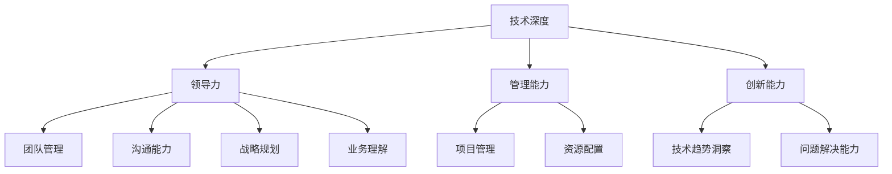

                 

## 文章标题：技术领导力的培养与提升

### 关键词：技术领导力、团队管理、创新能力、项目管理、战略规划

### 摘要：

本文旨在探讨技术领导力的培养与提升，从定义、重要性、核心能力、实践方法到持续发展，全面解析技术领导者的角色和职责。通过深入分析技术领导力的核心概念，阐述其在企业发展中的关键作用，并结合实际案例，提供具体的提升策略和实践方法。文章结构清晰，内容丰富，适合技术团队领导者、项目经理和技术专家阅读参考。

## 第一部分：技术领导力基础

### 第1章：技术领导力的定义与重要性

#### 1.1 技术领导力的核心概念

技术领导力是一种综合能力，它包括技术深度、领导力和管理能力，以及创新能力。技术领导力不仅仅关注技术本身，更重要的是如何通过技术来推动业务发展，实现组织目标。

**核心概念关系架构：**

#### 1.2 技术领导力在企业中的作用

技术领导力在企业中发挥着至关重要的作用。首先，它能够推动技术创新，提高企业竞争力。其次，通过有效的团队管理和沟通，确保项目顺利进行，实现业务目标。最后，技术领导者还需具备战略眼光，为企业制定长远发展规划。

**技术领导力在企业的应用场景：**

1. **技术创新与研发：** 技术领导者需要带领团队进行技术创新，推动新产品研发。
2. **项目管理：** 技术领导者负责项目的规划、执行和监控，确保项目按时按质完成。
3. **团队建设：** 技术领导者需要建立高效团队，激发团队成员的潜力，提高团队协作效率。
4. **业务战略：** 技术领导者需参与企业战略决策，将技术优势转化为业务优势。

#### 1.3 技术领导力与传统管理的区别

技术领导力与传统管理存在显著差异。传统管理注重指令和监督，而技术领导力更强调引导和激励。技术领导者不仅需要具备管理能力，还需要具备深厚的技术背景和创新能力。

**技术领导力与传统管理的区别：**

1. **角色定位：** 技术领导者更关注团队和技术的发展，而传统管理者更关注任务和目标。
2. **领导方式：** 技术领导者通过启发和激励来引导团队，而传统管理者通过指令和监督来管理。
3. **视野范围：** 技术领导者需要具备战略眼光，而传统管理者更注重当前的任务和目标。

### 第2章：技术领导者的核心能力

#### 2.1 技术能力

技术能力是技术领导者的基石。技术领导者需要具备深入的技术知识和丰富的实践经验，能够解决复杂的技术问题，引领团队进行技术创新。

**技术能力提升方法：**

1. **持续学习：** 技术领导者需要不断学习新知识、新技术，保持技术前沿的敏锐度。
2. **实践项目：** 通过参与实际项目，积累实战经验，提升技术能力。
3. **知识分享：** 通过内部培训、技术分享会等形式，将自己的技术经验传授给团队成员。

#### 2.2 领导力能力

领导力能力是技术领导者的关键素质。技术领导者需要具备良好的沟通、协调和激励能力，能够带领团队实现共同目标。

**领导力能力提升方法：**

1. **有效沟通：** 提高沟通技巧，确保信息准确传达，增强团队凝聚力。
2. **激励团队：** 通过奖励、认可等方式激励团队成员，提高团队士气。
3. **情感管理：** 学会处理团队成员的情绪，建立良好的团队氛围。

#### 2.3 管理能力

管理能力是技术领导者不可或缺的素质。技术领导者需要具备项目规划、资源管理和风险管理等能力，确保项目的顺利进行。

**管理能力提升方法：**

1. **项目管理知识：** 学习项目管理相关知识，掌握项目管理的核心技能。
2. **资源分配：** 合理分配资源，确保项目所需的资源得到充分利用。
3. **风险管理：** 学会识别和管理项目风险，降低项目失败的可能性。

#### 2.4 创新能力

创新能力是技术领导者的核心竞争力。技术领导者需要具备敏锐的洞察力，能够发现新的技术机会，推动技术创新。

**创新能力提升方法：**

1. **技术趋势研究：** 关注技术发展趋势，提前布局未来技术。
2. **头脑风暴：** 通过头脑风暴等方式，激发团队的创意思维。
3. **试错文化：** 鼓励团队成员进行尝试和实验，培养试错和迭代思维。

### 第3章：团队管理与协作

#### 3.1 团队建设原则

团队建设是技术领导者的重要任务。一个高效的团队需要具备共同的目标、良好的沟通和协作精神。

**团队建设原则：**

1. **目标明确：** 确保团队成员对团队目标有清晰的认识。
2. **分工明确：** 根据团队成员的能力和特长进行合理分工。
3. **信任与支持：** 建立信任关系，提供必要的支持和帮助。

#### 3.2 团队沟通策略

沟通是团队协作的基础。技术领导者需要掌握有效的沟通策略，确保信息的准确传达。

**团队沟通策略：**

1. **透明沟通：** 保持信息的透明度，确保团队成员了解项目的进展和问题。
2. **主动沟通：** 主动与团队成员沟通，了解他们的需求和困难。
3. **积极倾听：** 倾听是沟通的关键，学会倾听团队成员的意见和反馈。

#### 3.3 高效协作技巧

高效协作是团队成功的关键。技术领导者需要培养团队成员的协作能力，提高团队的整体效率。

**高效协作技巧：**

1. **协作工具：** 利用协作工具，如即时通讯、项目管理软件等，提高团队协作效率。
2. **分工与责任：** 明确团队成员的分工和责任，确保任务顺利完成。
3. **定期反馈：** 定期进行团队反馈，及时调整和优化协作方式。

#### 3.4 冲突管理与解决

冲突是团队协作中的常见问题。技术领导者需要学会管理和解决冲突，确保团队的和谐与稳定。

**冲突管理与解决策略：**

1. **预防为主：** 通过明确规则和沟通策略，预防冲突的发生。
2. **及时处理：** 发现冲突后，及时进行沟通和解决。
3. **公正处理：** 在处理冲突时，保持公正和客观，确保问题得到妥善解决。

## 第二部分：技术领导力实践

### 第4章：项目管理与执行

#### 4.1 项目管理基础知识

项目管理是技术领导者的核心职责之一。项目管理基础知识是成功进行项目管理的基石。

**项目管理基础知识：**

1. **项目生命周期：** 了解项目从启动到收尾的全过程。
2. **项目计划：** 制定项目计划，明确项目目标、任务和资源。
3. **项目执行：** 监控项目进展，确保项目按计划进行。
4. **项目收尾：** 对项目进行总结和评估，确保项目成果符合预期。

#### 4.2 项目计划与执行

项目计划和执行是项目管理的重要环节。

**项目计划与执行方法：**

1. **需求分析：** 确定项目需求，明确项目目标和范围。
2. **资源规划：** 确保项目所需的资源得到合理分配。
3. **进度管理：** 制定项目进度计划，监控项目进展。
4. **风险管理：** 识别项目风险，制定应对策略。

#### 4.3 项目风险管理

项目风险管理是确保项目成功的关键。

**项目风险管理策略：**

1. **风险识别：** 识别项目潜在的风险。
2. **风险评估：** 对识别出的风险进行评估，确定风险的优先级。
3. **风险应对：** 制定风险应对策略，降低风险影响。
4. **风险监控：** 定期对风险进行监控和评估，及时调整应对措施。

#### 4.4 项目评估与改进

项目评估与改进是项目管理的重要环节。

**项目评估与改进方法：**

1. **项目评估：** 对项目成果进行评估，确定项目成功的关键因素。
2. **经验总结：** 总结项目经验，识别项目中的不足和改进点。
3. **持续改进：** 基于项目评估和总结，持续优化项目管理流程，提高项目成功率。

### 第5章：技术创新与决策

#### 5.1 技术创新策略

技术创新是技术领导者的核心任务之一。技术创新策略是推动技术进步的关键。

**技术创新策略：**

1. **市场调研：** 了解市场需求，确定技术发展方向。
2. **技术评估：** 评估现有技术，确定技术改进和创新点。
3. **资源投入：** 合理分配资源，支持技术创新。
4. **团队协作：** 建立跨部门协作机制，促进技术创新。

#### 5.2 技术决策模型

技术决策模型是技术领导者进行技术决策的重要工具。

**技术决策模型：**

1. **问题定义：** 明确技术问题，确定决策目标。
2. **解决方案：** 提出多种解决方案，评估各方案的优缺点。
3. **成本效益分析：** 进行成本效益分析，确定最优解决方案。
4. **决策实施：** 制定决策实施计划，确保决策得到有效执行。

#### 5.3 技术创新实践案例

技术创新实践案例是技术领导者学习和借鉴的重要资源。

**技术创新实践案例：**

1. **案例一：** 如何通过技术创新提高产品性能？
2. **案例二：** 如何通过技术改进降低生产成本？
3. **案例三：** 如何通过技术创新开拓新市场？

#### 5.4 技术决策中的领导力应用

技术决策中的领导力应用是技术领导者的重要能力。

**技术决策中的领导力应用：**

1. **沟通与协作：** 通过有效沟通和协作，确保技术决策得到团队的支持和执行。
2. **风险评估：** 通过风险评估，确保技术决策的风险得到有效控制。
3. **持续改进：** 通过持续改进，不断提升技术决策的准确性和有效性。

### 第6章：领导力沟通与影响力

#### 6.1 沟通技巧

沟通技巧是技术领导者的重要能力之一。良好的沟通技巧能够提高团队协作效率，确保项目顺利进行。

**沟通技巧：**

1. **明确目标：** 在沟通前明确目标，确保沟通有针对性和效率。
2. **倾听与理解：** 倾听对方的意见，理解对方的立场，建立互信关系。
3. **清晰表达：** 使用简洁明了的语言，确保信息准确传达。
4. **非语言沟通：** 利用肢体语言、面部表情等非语言手段，增强沟通效果。

#### 6.2 领导影响力构建

领导影响力是技术领导者的重要特质。构建领导影响力能够提高团队的凝聚力和执行力。

**领导影响力构建策略：**

1. **树立榜样：** 通过自己的言行树立榜样，赢得团队的尊重和信任。
2. **专业素养：** 提高自己的专业素养，成为团队的权威和依赖。
3. **情感投资：** 关心团队成员的成长和需求，建立深厚的情感纽带。
4. **持续学习：** 不断学习和提升自己，保持领导力的活力和前瞻性。

#### 6.3 领导力沟通实践

领导力沟通实践是将领导力理论知识转化为实践的重要环节。

**领导力沟通实践：**

1. **团队会议：** 通过定期团队会议，了解团队成员的进展和需求，协调团队资源。
2. **一对一沟通：** 通过一对一沟通，了解团队成员的困惑和挑战，提供个性化的支持和帮助。
3. **跨部门协作：** 通过跨部门协作，促进不同部门之间的沟通和合作，提高整体效率。

#### 6.4 案例分析：技术领导力沟通案例解析

案例分析是提升领导力沟通能力的重要方法。

**案例分析：技术领导力沟通案例解析**

1. **案例背景：** 介绍案例的具体背景和情境。
2. **问题分析：** 分析案例中存在的沟通问题和挑战。
3. **解决方案：** 提出解决方案，并说明实施效果。
4. **经验总结：** 总结案例中的经验教训，为未来沟通提供参考。

## 第三部分：技术领导力提升

### 第7章：技术趋势与战略规划

#### 7.1 技术趋势分析

技术趋势分析是技术领导者的重要职责之一。通过分析技术趋势，技术领导者可以把握行业发展的方向，为企业制定战略提供依据。

**技术趋势分析方法：**

1. **市场调研：** 通过市场调研，了解用户需求和市场趋势。
2. **技术评估：** 对现有技术进行评估，确定技术优势和劣势。
3. **专家访谈：** 通过与行业专家的访谈，获取对技术趋势的深刻见解。
4. **数据分析：** 利用数据分析工具，分析技术发展的数据指标和趋势。

#### 7.2 战略规划框架

战略规划框架是技术领导者制定战略的重要工具。通过战略规划框架，技术领导者可以明确战略目标、制定战略路径和规划资源分配。

**战略规划框架：**

1. **愿景和目标：** 明确企业的愿景和目标，确定战略方向。
2. **市场分析：** 分析市场需求和竞争态势，确定市场定位。
3. **技术路线：** 确定企业发展的技术路线，包括核心技术、关键技术等。
4. **资源规划：** 规划企业所需的资源，包括人力、资金、技术等。
5. **风险评估：** 评估战略实施过程中可能遇到的风险，制定风险应对策略。

#### 7.3 技术战略规划实践

技术战略规划实践是将战略规划付诸实施的重要环节。

**技术战略规划实践步骤：**

1. **战略制定：** 根据战略规划框架，制定详细的技术战略计划。
2. **资源分配：** 根据战略计划，合理分配资源，确保战略实施所需的资源得到保障。
3. **执行监控：** 监控战略执行过程，确保战略计划得到有效实施。
4. **评估调整：** 对战略实施效果进行评估，根据评估结果进行调整和优化。

#### 7.4 技术战略规划案例分析

技术战略规划案例分析是技术领导者学习和借鉴的重要资源。

**技术战略规划案例分析：**

1. **案例背景：** 介绍案例的具体背景和情境。
2. **战略制定：** 分析案例中企业如何制定技术战略。
3. **实施效果：** 分析技术战略实施的效果和成果。
4. **经验总结：** 总结案例中的经验教训，为未来技术战略规划提供参考。

### 第8章：领导力培养与自我提升

#### 8.1 领导力培养路径

领导力培养是技术领导者持续提升自身能力的重要途径。通过制定明确的领导力培养路径，技术领导者可以系统地提升自己的领导能力。

**领导力培养路径：**

1. **理论学习：** 通过学习领导力相关的理论知识和案例，建立领导力的理论基础。
2. **实践锻炼：** 通过参与实际项目和团队管理，将理论知识转化为实践能力。
3. **反馈与调整：** 通过反馈和反思，不断调整和优化自己的领导行为，提高领导效果。
4. **持续学习：** 保持学习的态度，不断更新知识和技能，跟上时代发展的步伐。

#### 8.2 自我提升策略

自我提升是技术领导者提升自身能力的重要手段。通过制定明确的自我提升策略，技术领导者可以不断提高自己的综合素质。

**自我提升策略：**

1. **设定目标：** 明确自己的职业发展目标，制定具体的提升计划。
2. **持续学习：** 通过学习新技术、新知识，不断提升自己的专业素养。
3. **实践锻炼：** 通过参与实际项目和团队管理，积累实战经验。
4. **情感管理：** 学会管理自己的情绪，提高情绪智力，增强团队凝聚力。

#### 8.3 领导力培训方法

领导力培训是技术领导者提升领导能力的有效途径。通过领导力培训，技术领导者可以系统地学习和掌握领导力相关的知识和技能。

**领导力培训方法：**

1. **内部培训：** 通过内部培训，分享经验和知识，提升团队成员的领导能力。
2. **外部培训：** 通过参加外部培训，学习先进的管理理念和技能，拓宽视野。
3. **实践演练：** 通过实践演练，将所学知识应用到实际工作中，提高领导效果。
4. **导师辅导：** 通过导师辅导，获得专业指导，加快领导力提升的步伐。

#### 8.4 持续学习与实践

持续学习和实践是技术领导者提升自身能力的关键。通过持续学习和实践，技术领导者可以不断提高自己的专业素养和领导能力。

**持续学习与实践策略：**

1. **定期学习：** 制定学习计划，定期学习新技术、新知识。
2. **实战演练：** 通过参与实际项目和团队管理，积累实战经验。
3. **反思总结：** 通过反思和总结，不断调整和优化自己的领导行为。
4. **分享经验：** 通过分享经验和知识，提升团队成员的领导能力。

### 第9章：领导力持续发展

#### 9.1 领导力评估与反馈

领导力评估与反馈是技术领导者持续发展的重要环节。通过领导力评估和反馈，技术领导者可以了解自己的领导能力，找出不足之处，进行有针对性的提升。

**领导力评估与反馈方法：**

1. **自我评估：** 通过自我评估，了解自己的领导能力和不足之处。
2. **他人评估：** 通过他人评估，了解团队成员对自己的评价和意见。
3. **360度评估：** 通过360度评估，全面了解自己的领导能力和表现。
4. **反馈与调整：** 根据评估结果，进行反馈和调整，提升领导能力。

#### 9.2 持续发展的挑战

领导力持续发展面临诸多挑战。技术领导者需要不断适应环境变化，应对挑战，持续提升自己的领导能力。

**持续发展的挑战：**

1. **技术变革：** 随着技术的快速发展，技术领导者需要不断更新自己的知识体系。
2. **管理复杂度：** 随着团队的扩大和管理层次的增加，技术领导者需要提高管理能力和效率。
3. **人际关系：** 在团队管理中，技术领导者需要处理复杂的人际关系，提高团队凝聚力。
4. **时间管理：** 技术领导者需要在工作和生活中找到平衡，确保有足够的时间进行学习和实践。

#### 9.3 持续发展策略

为了实现领导力的持续发展，技术领导者需要制定明确的策略，并付诸实践。

**持续发展策略：**

1. **目标设定：** 明确自己的职业发展目标，制定具体的提升计划。
2. **持续学习：** 通过学习新技术、新知识，不断提升自己的专业素养。
3. **实践锻炼：** 通过参与实际项目和团队管理，积累实战经验。
4. **情感管理：** 学会管理自己的情绪，提高情绪智力，增强团队凝聚力。
5. **团队建设：** 建立高效的团队，提高团队协作效率。

#### 9.4 成功案例分享

成功案例分享是技术领导者学习和借鉴的重要资源。通过分享成功案例，技术领导者可以了解其他优秀领导者的经验和做法，为自己的发展提供参考。

**成功案例分享：**

1. **案例一：** 如何通过技术创新推动企业发展的成功案例。
2. **案例二：** 如何通过有效的团队管理提高项目效率的成功案例。
3. **案例三：** 如何通过持续学习不断提升领导能力的成功案例。

**最佳实践 tips：**

- **定期反思：** 定期反思自己的领导行为，找出不足之处，进行改进。
- **建立学习小组：** 与团队成员建立学习小组，共同学习和进步。
- **积极参与外部活动：** 积极参与行业会议、研讨会等活动，拓宽视野，学习先进经验。
- **注重团队建设：** 注重团队建设，建立良好的团队文化，提高团队凝聚力。

**小结：**

技术领导力的培养与提升是一个长期而复杂的过程。通过深入学习和实践，技术领导者可以不断提高自己的领导能力，为企业的持续发展贡献力量。希望本文能为您在领导力提升的道路上提供有益的启示和帮助。

**注意事项：**

- **理解领导力本质：** 领导力不仅仅是管理能力，更是一种影响力。
- **重视团队协作：** 团队协作是实现技术目标的关键，技术领导者需要注重团队建设和协作。
- **持续学习与实践：** 持续学习和实践是提升领导力的关键，技术领导者需要保持学习的态度，不断实践和总结。

**拓展阅读：**

- 《领导力的五项修炼》（作者：约翰·麦克斯韦尔）
- 《技术领导者的六项核心技能》（作者：艾伦·韦斯伯格）
- 《团队协作的艺术》（作者：达利娅·列文斯坦）

作者：AI天才研究院/AI Genius Institute & 禅与计算机程序设计艺术 /Zen And The Art of Computer Programming

