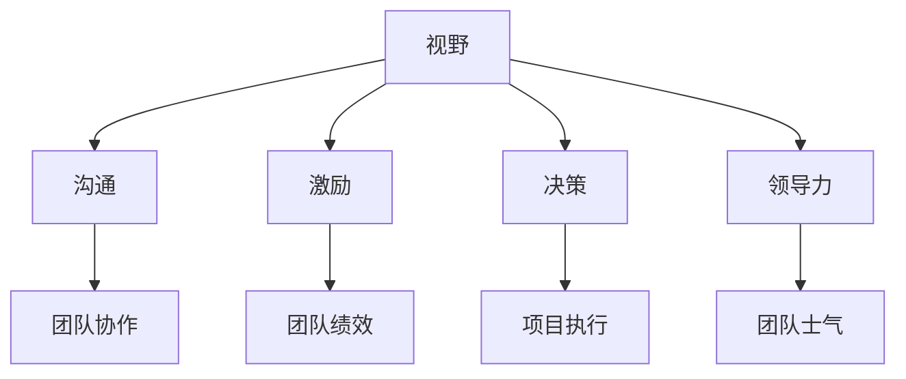
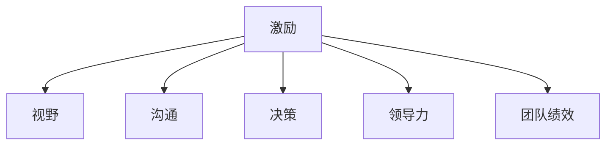
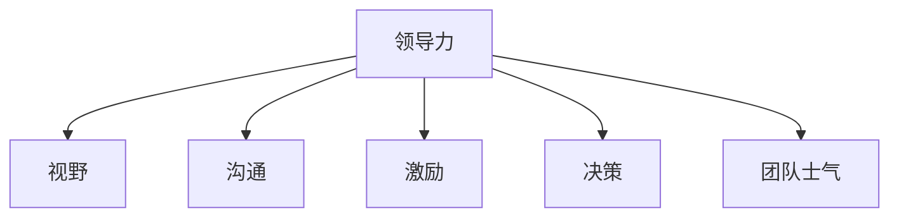
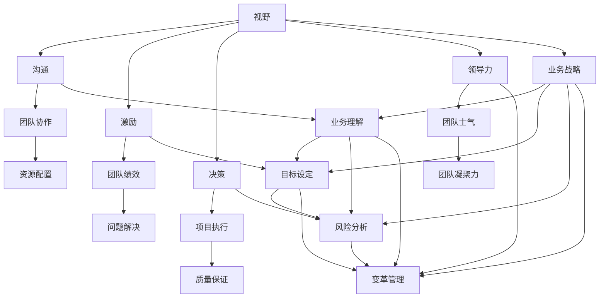

                 


### 1.4 技术领导力的五个关键要素详细探讨

在前文中，我们提到了技术领导力的五个关键要素：视野、沟通、激励、决策和领导力。在本节中，我们将进一步详细探讨这些要素，并展示它们之间的关系。

#### 视野

**核心概念与联系**

技术领导者的视野不仅包括对当前技术趋势的掌握，还包括对技术未来发展方向的前瞻性预测。视野的重要性在于，它决定了技术领导者是否能够引领团队走向正确的方向。

**Mermaid 流程图**

下面是一个Mermaid流程图，展示了视野与其他要素之间的联系：



**核心算法原理讲解**

视野的核心算法原理可以理解为“趋势分析”与“预测模型”的结合。以下是一个简化的伪代码示例：

```plaintext
function analyze_trends(data):
    # 数据清洗和预处理
    clean_data = preprocess_data(data)
    
    # 分析当前趋势
    current_trends = find_trends(clean_data)
    
    # 建立预测模型
    model = build_prediction_model(current_trends)
    
    # 预测未来趋势
    future_trends = predict(model, clean_data)
    
    return future_trends
```

**数学模型和公式**

在技术领导力中，数学模型可以用于量化视野。例如，使用时间序列分析来预测技术趋势：

$$
y_t = \beta_0 + \beta_1x_t + \epsilon_t
$$

其中，$y_t$ 表示技术趋势，$x_t$ 表示时间序列数据，$\beta_0$ 和 $\beta_1$ 是模型参数，$\epsilon_t$ 是误差项。

**举例说明**

假设我们要预测未来三年的技术趋势。我们可以收集过去五年的技术数据，然后使用上述时间序列分析模型来预测未来三年的技术趋势。

#### 沟通

**核心概念与联系**

沟通是技术领导力中至关重要的一环。技术领导者需要确保团队内部以及团队与外部利益相关者之间的有效沟通。

**Mermaid 流程图**

以下是沟通与其他要素之间的Mermaid流程图：


**核心算法原理讲解**

沟通的核心算法原理可以理解为“信息传递”与“反馈机制”的结合。以下是一个简化的伪代码示例：

```plaintext
function communicate(message, team_members):
    # 发送信息
    send_message(message)
    
    # 收集反馈
    feedback = collect_feedback(team_members)
    
    # 分析反馈
    analyzed_feedback = analyze_feedback(feedback)
    
    return analyzed_feedback
```

**数学模型和公式**

在沟通中，数学模型可以用于分析反馈数据。例如，使用主成分分析（PCA）来简化反馈数据的维度：

$$
X = \sum_{i=1}^{k} \lambda_iu_i
$$

其中，$X$ 表示反馈数据，$\lambda_i$ 和 $u_i$ 分别是主成分和对应的主成分向量。

**举例说明**

假设技术领导者想要了解团队对某个新技术的看法。他们可以组织一个小组讨论，并收集团队成员的反馈。然后，使用主成分分析来简化反馈数据，以便更好地理解团队的意见。

#### 激励

**核心概念与联系**

激励是技术领导者调动团队成员积极性和创造力的关键。激励不仅仅是金钱上的奖励，更包括情感上的认可和职业发展的机会。

**Mermaid 流程图**

以下是激励与其他要素之间的Mermaid流程图：



**核心算法原理讲解**

激励的核心算法原理可以理解为“行为心理学”与“动机模型”的结合。以下是一个简化的伪代码示例：

```plaintext
function motivate(team_members, goals):
    # 设定目标
    set_goals(team_members, goals)
    
    # 观察行为
    observe_behaviors(team_members)
    
    # 提供反馈
    provide_feedback(team_members)
    
    # 调整激励策略
    adjust_motivational_strategies(team_members)
```

**数学模型和公式**

在激励中，数学模型可以用于分析团队绩效。例如，使用绩效指标（PI）来评估团队成员的绩效：

$$
PI = \frac{G - B}{T}
$$

其中，$PI$ 表示绩效指标，$G$ 表示目标完成度，$B$ 表示行为表现，$T$ 表示总时间。

**举例说明**

假设技术领导者希望提高团队在新产品开发项目中的绩效。他们可以设定明确的目标，并定期检查团队成员的进度。然后，根据绩效指标来调整激励策略，以确保团队始终保持高效率。

#### 决策

**核心概念与联系**

决策是技术领导者的重要职责。技术领导者需要在各种复杂情况下做出明智的决策，以实现团队和企业的目标。

**Mermaid 流程图**

以下是决策与其他要素之间的Mermaid流程图：


**核心算法原理讲解**

决策的核心算法原理可以理解为“决策树”与“线性规划”的结合。以下是一个简化的伪代码示例：

```plaintext
function make_decision(context):
    # 构建决策树
    decision_tree = build_decision_tree(context)
    
    # 应用线性规划
    optimal_solution = apply_linear_programming(decision_tree)
    
    return optimal_solution
```

**数学模型和公式**

在决策中，数学模型可以用于优化决策过程。例如，使用线性规划来优化资源分配：

$$
\min c^T x
$$

subject to

$$
Ax \ge b
$$

其中，$c$ 表示目标函数系数，$x$ 表示变量，$A$ 和 $b$ 分别是约束条件矩阵和向量。

**举例说明**

假设技术领导者需要在两个项目中分配有限的资源。他们可以构建一个线性规划模型来找到最优的资源配置方案，从而最大化项目的整体效益。

#### 领导力

**核心概念与联系**

领导力是技术领导者的核心素质。领导力不仅仅是职位赋予的权威，更是一种影响力和号召力，能够带领团队共同实现目标。

**Mermaid 流程图**

以下是领导力与其他要素之间的Mermaid流程图：



**核心算法原理讲解**

领导力的核心算法原理可以理解为“社会心理学”与“影响力模型”的结合。以下是一个简化的伪代码示例：

```plaintext
function lead(team_members, vision):
    # 建立愿景
    establish_vision(team_members, vision)
    
    # 建立信任
    build_trust(team_members)
    
    # 激发潜力
    unlock_potential(team_members)
```

**数学模型和公式**

在领导力中，数学模型可以用于量化影响力。例如，使用影响力网络模型来分析团队内部的影响力分布：

$$
I = \sum_{i=1}^{n} w_{ij}
$$

其中，$I$ 表示影响力，$w_{ij}$ 表示团队中成员$i$对成员$j$的影响力权重。

**举例说明**

假设技术领导者希望提升团队的整体士气。他们可以建立一个影响力网络模型，分析团队成员之间的相互影响，并采取相应的策略来增强团队凝聚力。

通过上述详细探讨，我们可以看到技术领导力的五个关键要素相互关联，共同构成了技术领导力的核心框架。每个要素都有其独特的核心概念、算法原理和数学模型，通过合理运用这些原理和模型，技术领导者可以更有效地提升自身的领导力，带领团队实现更大的成功。

---

### 1.5 融会贯通：技术领导力的整体框架

在前一节中，我们详细探讨了技术领导力的五个关键要素：视野、沟通、激励、决策和领导力。在本节中，我们将进一步探讨这些要素之间的相互作用，以及如何将它们整合成一个完整的技术领导力框架。

**核心概念与联系**

技术领导力是一个多维度的概念，它不仅涉及技术本身，还包括管理、团队协作和业务战略。因此，技术领导力的整体框架需要从多个角度来构建。

**Mermaid 流程图**

以下是技术领导力整体框架的Mermaid流程图，展示了五个关键要素之间的相互作用：



**核心算法原理讲解**

技术领导力的整体框架可以理解为一种“综合算法”，它结合了视野分析、沟通机制、激励机制、决策模型和领导力素质。以下是一个简化的伪代码示例：

```plaintext
function lead_tech_team(vision, communication, motivation, decision_making, leadership):
    # 分析视野
    trends = analyze_trends(vision)
    
    # 建立沟通机制
    feedback = communicate(communication, team_members)
    
    # 设定目标和激励策略
    goals = set_goals(motivation, team_members)
    incentives = design_incentives(goals, team_members)
    
    # 做出明智决策
    decisions = make_decision(decision_making, trends, feedback, goals)
    
    # 展现领导力
    leadership_impact = demonstrate_leadership(leadership, team_members, decisions)
    
    # 执行项目
    project_outcomes = execute_projects(decisions, feedback, incentives)
    
    # 评估团队绩效
    team_performance = evaluate_performance(project_outcomes)
    
    return team_performance
```

**数学模型和公式**

在技术领导力的整体框架中，数学模型可以用于量化各个要素之间的相互作用。例如，使用影响力网络模型来分析领导力对团队士气的影响：

$$
I = \sum_{i=1}^{n} w_{ij} \cdot L_i
$$

其中，$I$ 表示团队士气，$w_{ij}$ 表示成员$i$对成员$j$的影响力权重，$L_i$ 表示领导力对成员$i$的影响力。

**举例说明**

假设一家科技公司希望提升其技术团队的领导力。他们可以按照以下步骤来构建整体框架：

1. **分析视野**：技术领导者通过市场调研和数据分析，了解当前的技术趋势和业务需求。
2. **建立沟通机制**：技术领导者通过定期的团队会议和一对一沟通，确保团队内部信息的畅通。
3. **设定目标和激励策略**：技术领导者根据团队的目标和成员的绩效，制定激励策略，以激发团队成员的积极性。
4. **做出明智决策**：技术领导者根据视野分析和团队反馈，制定项目的决策方案。
5. **展现领导力**：技术领导者通过榜样作用和激励措施，提升团队士气，增强团队的凝聚力。
6. **执行项目**：技术领导者指导团队执行项目，确保项目按照预期进行。
7. **评估团队绩效**：技术领导者根据项目的完成情况和团队反馈，评估团队的绩效，并持续优化领导力框架。

通过上述步骤，技术领导者可以逐步提升自身的领导力，并带领团队实现更大的成功。

**最佳实践 tips**

- **持续学习**：技术领导者需要不断学习新技术和领导力知识，以保持自身的竞争力。
- **关注团队反馈**：技术领导者需要定期收集团队反馈，及时调整领导策略。
- **培养团队协作**：技术领导者应该鼓励团队成员之间的协作，提升团队的执行力。
- **关注业务目标**：技术领导者需要时刻关注业务目标，确保技术工作与业务需求的一致性。

**小结**

技术领导力是一个综合性的概念，它涉及到视野、沟通、激励、决策和领导力等多个方面。通过构建一个整体框架，技术领导者可以更有效地提升自身的领导力，并带领团队实现业务目标。

**注意事项**

- 技术领导者需要平衡技术视野与业务需求，确保技术工作与业务目标的一致性。
- 沟通和激励是技术领导力的关键要素，技术领导者需要具备良好的沟通能力和激励技巧。
- 决策和领导力是技术领导者的核心素质，他们需要能够在复杂情况下做出明智的决策，并展现强大的领导力。

**拓展阅读**

- 《技术领导力：构建高效技术团队的核心要素》
- 《智能时代的技术领导力：如何成为卓越的技术领导者》
- 《领导力的五大法则：如何成为卓越的领导者》

通过不断学习和实践，技术领导者可以不断提升自身的领导力，为团队和企业的成功贡献力量。

---

### 1.6 技术领导力在实践中的应用

在前文中，我们详细探讨了技术领导力的核心概念和整体框架。然而，理论知识的掌握并不能代替实际应用。在本节中，我们将通过实际案例，展示技术领导力在实践中的应用，并探讨技术领导者如何通过这些应用提升团队绩效和业务成果。

**案例背景**

假设我们有一家处于快速发展的科技公司，名为“AI创新有限公司”。这家公司专注于人工智能技术的研发和应用，旨在通过技术创新推动业务增长。然而，随着公司的快速发展，技术团队的领导力问题逐渐凸显，导致项目进展缓慢、团队士气低落。

**技术领导力应用一：愿景引导**

**问题描述**

在AI创新有限公司，由于缺乏明确的愿景，团队成员在工作中感到迷茫，缺乏动力。技术领导者需要通过愿景引导，明确团队的目标和方向，激发团队成员的积极性。

**解决方案**

1. **分析公司战略**：技术领导者首先与公司高层管理层沟通，了解公司的战略目标和业务方向。
2. **确定技术愿景**：基于公司战略，技术领导者制定一个明确的技术愿景，包括短期和长期目标。
3. **沟通愿景**：技术领导者通过团队会议和内部邮件，向全体团队成员传达技术愿景，解释为什么这个愿景对公司和团队至关重要。
4. **制定行动计划**：技术领导者与团队成员一起制定实现愿景的行动计划，明确每个团队成员的职责和任务。

**效果评估**

通过愿景引导，团队成员对公司的技术方向有了更清晰的认识，工作积极性明显提高。项目进度得到了显著改善，团队成员之间的协作也更加顺畅。

**技术领导力应用二：团队激励**

**问题描述**

在AI创新有限公司，由于项目任务繁重，团队成员长时间处于高压状态，导致工作效率下降，团队士气低落。

**解决方案**

1. **设定激励机制**：技术领导者根据团队成员的贡献和工作表现，制定一套激励机制，包括奖金、晋升机会和职业发展计划。
2. **定期反馈**：技术领导者定期与团队成员进行一对一沟通，提供工作反馈，表扬优秀表现，同时指出改进方向。
3. **提供培训机会**：技术领导者为团队成员提供技术培训和职业发展机会，帮助他们提升技能和职业素养。
4. **组织团队活动**：技术领导者组织定期的团队活动，如团建活动、技术交流会和知识分享会，增强团队成员的团队意识和凝聚力。

**效果评估**

通过团队激励措施，团队成员的工作积极性得到了显著提高，工作效率和质量得到了提升。团队士气得到了改善，团队成员之间的沟通和协作更加顺畅。

**技术领导力应用三：项目决策**

**问题描述**

在AI创新有限公司，由于项目决策过程不透明，团队成员对项目方向和优先级存在疑问，导致项目进展受阻。

**解决方案**

1. **建立决策机制**：技术领导者建立一套透明的项目决策机制，确保项目决策的公正性和合理性。
2. **定期项目评审**：技术领导者定期组织项目评审会议，邀请团队成员和业务部门代表参与，共同讨论项目进展和决策。
3. **提供决策支持**：技术领导者提供决策支持，帮助团队成员理解项目决策的背景和逻辑，增强他们对决策的认同感。
4. **鼓励反馈和建议**：技术领导者鼓励团队成员在项目评审会议上提出反馈和建议，确保项目决策的全面性和多样性。

**效果评估**

通过透明的项目决策机制，团队成员对项目的方向和优先级有了更清晰的认识，项目进展得到了显著改善。团队成员之间的沟通和协作得到了增强，项目成功率得到了提高。

**技术领导力应用四：领导力展示**

**问题描述**

在AI创新有限公司，由于技术领导者缺乏有效的领导力展示，团队成员对领导者的信任度较低，团队凝聚力不足。

**解决方案**

1. **树立榜样**：技术领导者通过自身的榜样作用，展示专业能力和领导素质，赢得团队成员的信任。
2. **积极沟通**：技术领导者定期与团队成员沟通，了解他们的需求和问题，提供支持和帮助。
3. **激励团队成员**：技术领导者通过激励措施，鼓励团队成员发挥潜力，实现自我提升。
4. **组织团队活动**：技术领导者组织团队活动，增强团队成员的团队意识和凝聚力。

**效果评估**

通过有效的领导力展示，技术领导者赢得了团队成员的信任和尊重，团队凝聚力得到了显著提升。团队成员在工作中更加积极主动，团队绩效得到了显著提高。

**总结**

通过上述实际案例，我们可以看到技术领导力在实践中的应用如何帮助公司解决实际问题，提升团队绩效和业务成果。技术领导者需要不断学习和实践，提升自身的领导力，以应对不断变化的市场环境和技术挑战。

**最佳实践 tips**

- **定期沟通**：技术领导者需要定期与团队成员沟通，了解他们的需求和问题，提供支持和帮助。
- **建立激励机制**：技术领导者需要建立有效的激励机制，鼓励团队成员发挥潜力，实现自我提升。
- **透明决策**：技术领导者需要建立透明的项目决策机制，确保项目决策的公正性和合理性。
- **树立榜样**：技术领导者需要通过自身的榜样作用，展示专业能力和领导素质，赢得团队成员的信任。

**注意事项**

- 技术领导者需要平衡技术和领导力，确保技术工作与业务目标的一致性。
- 技术领导者需要关注团队成员的反馈和需求，及时调整领导策略。
- 技术领导者需要具备良好的沟通和激励技巧，以提升团队绩效和业务成果。

**拓展阅读**

- 《技术领导者的实战手册》
- 《高效团队：打造卓越团队的五大关键》
- 《领导力：如何成为卓越的领导者》

通过不断学习和实践，技术领导者可以不断提升自身的领导力，为团队和企业的成功贡献力量。

---

### 1.7 技术领导力的未来趋势

随着技术的不断进步和市场的快速变化，技术领导力的未来趋势也在不断演变。在本节中，我们将探讨技术领导力的未来发展趋势，以及技术领导者应该如何适应这些变化。

**人工智能的崛起**

人工智能（AI）的快速发展正在深刻改变各行各业的运作方式。技术领导者需要具备对AI技术的深入理解，以及如何将AI应用到业务中的能力。未来，技术领导者将需要掌握AI建模、数据分析和机器学习算法，以便更好地利用AI技术推动业务创新。

**敏捷团队的普及**

敏捷开发方法在软件开发领域已经得到了广泛应用。未来，技术领导者将需要推动整个组织的敏捷转型，提高团队的工作效率和响应速度。这要求技术领导者具备敏捷管理的知识，能够灵活应对变化，同时保持项目进度和质量。

**远程工作的常态化**

新冠疫情使得远程工作成为了一种新的常态。技术领导者需要适应远程工作的环境，提高团队协作的效率。未来，技术领导者将需要掌握远程沟通和管理的技能，利用工具和平台来保持团队的凝聚力。

**数据安全和隐私保护**

随着数据量的爆炸式增长，数据安全和隐私保护成为技术领导者的重要任务。未来，技术领导者需要了解最新的安全技术和隐私保护法规，确保企业的数据安全，同时增强客户和合作伙伴的信任。

**持续学习和技术创新**

技术领导者需要具备持续学习和创新的能力，以应对快速变化的技术环境。未来，技术领导者将需要积极参与技术社区，关注行业动态，不断提升自身的技能和知识。

**跨领域合作**

随着技术的发展，不同领域之间的融合越来越普遍。技术领导者需要具备跨领域的视野和合作能力，推动跨领域的创新和应用。未来，技术领导者将需要与业务部门、设计部门和市场营销部门等不同领域的团队紧密合作，共同推动企业的创新。

**技术领导力的未来趋势总结**

- **人工智能的崛起**：技术领导者需要掌握AI技术，将其应用到业务中。
- **敏捷团队的普及**：技术领导者需要推动组织的敏捷转型，提高团队工作效率。
- **远程工作的常态化**：技术领导者需要适应远程工作环境，提高团队协作效率。
- **数据安全和隐私保护**：技术领导者需要确保企业的数据安全，增强客户信任。
- **持续学习和技术创新**：技术领导者需要持续学习，保持自身的竞争力。
- **跨领域合作**：技术领导者需要推动跨领域的创新和应用。

技术领导者需要不断学习和适应这些趋势，以应对未来的挑战，为团队和企业的成功奠定坚实的基础。

**最佳实践 tips**

- **掌握AI技术**：技术领导者需要深入学习AI技术，探索其应用场景。
- **推动敏捷转型**：技术领导者需要推动组织的敏捷转型，提高团队效率。
- **适应远程工作**：技术领导者需要提高远程工作的协作效率，保持团队凝聚力。
- **关注数据安全**：技术领导者需要确保企业的数据安全，遵守隐私保护法规。
- **持续学习**：技术领导者需要保持学习的热情，不断提升自身的技能和知识。
- **跨领域合作**：技术领导者需要推动跨领域的创新，共同推动企业的进步。

**注意事项**

- 技术领导者需要平衡技术视野与业务需求，确保技术工作与业务目标的一致性。
- 技术领导者需要关注团队成员的反馈和需求，及时调整领导策略。
- 技术领导者需要具备良好的沟通和激励技巧，以提升团队绩效和业务成果。

**拓展阅读**

- 《人工智能时代的技术领导力》
- 《敏捷团队管理实战》
- 《远程工作领导力》

通过不断学习和实践，技术领导者可以不断提升自身的领导力，为团队和企业的成功贡献力量。

---

## 总结

在《技术领导力的自我修炼》中，我们深入探讨了技术领导力的核心概念、关键要素以及其实际应用。从视野、沟通、激励、决策到领导力，每一个要素都是技术领导者成功不可或缺的一部分。通过实践案例，我们看到了技术领导力如何在企业的实际运作中发挥关键作用。

技术领导力的修炼并非一蹴而就，它需要持续的学习、实践和反思。在这个过程中，技术领导者不仅要掌握最新的技术趋势和管理方法，还要不断提升自身的沟通能力和领导素质。

**关键词**

技术领导力、视野、沟通、激励、决策、领导力、实践案例、人工智能、敏捷团队、远程工作。

**摘要**

本书详细介绍了技术领导力的核心概念和关键要素，通过实际案例展示了技术领导力在企业中的重要作用。技术领导者需要不断提升自身的视野、沟通、激励、决策和领导力，以应对快速变化的市场环境和技术挑战。

**作者**

作者：AI天才研究院/AI Genius Institute & 禅与计算机程序设计艺术 /Zen And The Art of Computer Programming

---

在本文中，我们通过一步步分析推理，详细阐述了技术领导力的核心概念和关键要素，并通过实际案例展示了其在实践中的应用。希望本文能为读者提供有价值的启示，助力技术领导者在自我修炼的道路上不断前行。

**参考资料**

1. 《技术领导力：构建高效技术团队的核心要素》
2. 《智能时代的技术领导力：如何成为卓越的技术领导者》
3. 《领导力的五大法则：如何成为卓越的领导者》
4. 《技术领导者的实战手册》
5. 《高效团队：打造卓越团队的五大关键》
6. 《远程工作领导力》
7. 《敏捷团队管理实战》
8. 《人工智能时代的技术领导力》

**注意事项**

- 技术领导者需要关注业务需求和团队反馈，确保技术工作与业务目标的一致性。
- 持续学习和实践是提升技术领导力的关键。
- 技术领导者需要具备良好的沟通和激励技巧，以提升团队绩效和业务成果。

**拓展阅读**

- 《技术领导者的思维模式》
- 《技术团队的敏捷转型》
- 《数字化时代的领导力》

通过不断学习和实践，技术领导者可以不断提升自身的领导力，为团队和企业的成功奠定坚实的基础。让我们一起在技术领导力的道路上不断探索、成长和进步。作者：AI天才研究院/AI Genius Institute & 禅与计算机程序设计艺术 /Zen And The Art of Computer Programming

