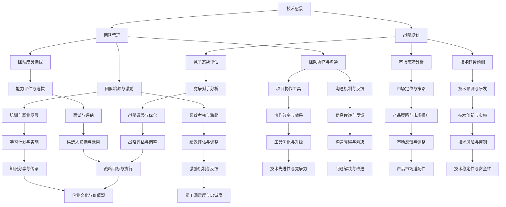

                 

## 文章标题

《技术领导力：从团队管理到战略规划》

> 关键词：技术领导力、团队管理、战略规划、技术创新、风险管理、职业发展

> 摘要：
本文旨在探讨技术领导力的本质和重要性，从团队管理到战略规划，全方位解析技术领导力的核心要素。文章通过逻辑清晰、结构紧凑的阐述，结合实际案例和最佳实践，帮助读者深入了解技术领导力的内涵和实际应用，为提升个人和技术团队的综合能力提供指导。

----------------------------------------------------------------

## 目录大纲设计思路

为了系统地阐述技术领导力这一复杂而重要的主题，本文采用了以下目录大纲设计思路：

### 第一部分：引言与背景
- **第1章：技术领导力概述**
  - 技术领导力的定义
  - 技术领导力的重要性
  - 技术领导力的三大领域

### 第二部分：团队管理
- **第2章：团队建设与管理基础**
  - 团队成员的角色与职责
  - 团队目标设定与任务分配
  - 团队沟通与协作

### 第三部分：技术领导
- **第3章：技术领导力核心能力**
  - 技术愿景与规划
  - 技术创新与风险管理
  - 技术架构设计与决策

### 第四部分：战略规划
- **第4章：战略规划方法论**
  - 企业战略与IT战略的关系
  - 战略规划工具与方法
  - 战略实施与监控

### 第五部分：案例研究
- **第5章：技术领导力实践案例**
  - 国内知名企业技术领导力实践
  - 国外企业技术领导力实践

### 第六部分：挑战与未来
- **第6章：技术领导力面临的挑战**
  - 技术变革下的领导力挑战
  - 团队管理与战略规划的平衡

### 第七部分：个人成长与职业发展
- **第7章：技术领导力的个人成长路径**
  - 技术深度与广度的平衡
  - 职业发展策略与规划
  - 终身学习与持续进步

### 附录
- **附录A：技术领导力相关资源与工具**
  - 技术领导力书籍推荐
  - 技术领导力在线课程与讲座
  - 技术领导力相关社区与论坛

该目录大纲旨在通过七个主要部分，逐步深入地探讨技术领导力的各个方面，从基础到高级，从理论到实践，为读者提供全面的指导和启示。

----------------------------------------------------------------

## 第一部分：引言与背景

### 第1章：技术领导力概述

#### 背景介绍

在当今快速变化的技术时代，技术领导力已成为企业成功的关键因素。技术领导力不仅仅是对技术的掌握，更是一种能够在复杂环境中引导团队、制定战略、推动创新的综合能力。随着数字化转型在全球范围内的加速，技术领导力在企业管理中的地位日益重要，它关系到企业的竞争力、创新能力和市场适应性。

#### 核心概念与联系

技术领导力的核心概念包括技术愿景、团队管理和战略规划。这三个领域相互关联，共同构成了技术领导力的整体架构。

1. **技术愿景**：技术愿景是技术领导力的基石，它为企业设定了长远的技术发展方向和目标。技术愿景不仅需要立足于当前的技术趋势，还要前瞻性地预测未来的技术变革，确保企业在技术竞争中保持领先地位。

2. **团队管理**：团队管理是技术领导力的核心组成部分，它包括团队成员的选拔、培养、激励和协作。一个高效的技术团队是实现企业愿景的关键，因此，技术领导者需要具备卓越的团队管理能力。

3. **战略规划**：战略规划是技术领导力的关键执行环节，它将企业的技术愿景转化为具体的行动计划和资源分配。战略规划需要综合考虑市场需求、技术趋势和竞争态势，确保企业能够在正确的方向上稳步前进。

#### Mermaid 流程图

以下是一个简化的技术领导力流程图，展示了技术愿景、团队管理和战略规划之间的相互关系：

#### 核心算法原理讲解

技术愿景的制定通常涉及以下几个核心算法原理：

1. **SWOT分析**：通过分析企业的优势（Strengths）、劣势（Weaknesses）、机会（Opportunities）和威胁（Threats），确定企业在技术领域的发展方向。

2. **PEST分析**：通过分析政治（Political）、经济（Economic）、社会（Social）和技术（Technological）等外部因素，评估外部环境对企业技术发展的影响。

3. **目标设定算法**：采用SMART原则（具体、可测量、可达到、相关性、时限性），确保技术愿景的具体性和可执行性。

#### 数学模型和公式

在战略规划中，常常需要使用以下数学模型和公式：

1. **投入产出模型**：用于分析企业在资源投入和技术产出之间的平衡，公式为：

   $$ 输出 = 输入 \times 效率 $$

   其中，输入包括人力、物力和财力，效率则取决于技术和管理水平。

2. **风险评估模型**：通过评估技术项目的风险概率和损失程度，计算风险指数，公式为：

   $$ 风险指数 = 风险概率 \times 损失程度 $$

   风险指数越高，表示项目的风险越大。

3. **目标达成模型**：用于评估技术团队在既定目标下的达成情况，公式为：

   $$ 达成率 = （实际完成量 / 计划完成量）\times 100\% $$

   达成率越高，表示团队的工作效率越高。

#### 详细讲解和举例说明

假设某企业计划在一年内研发一款新型智能产品，根据以上模型，我们可以进行以下详细分析：

1. **技术愿景制定**：
   - **SWOT分析**：企业具有强大的研发团队和丰富的技术储备，但面临市场竞争激烈、资金不足等挑战。通过分析，企业决定以人工智能技术为核心，开发一款智能家居产品。
   - **PEST分析**：政治方面，政府对智能家居产业的支持力度加大；经济方面，智能家居市场前景广阔；社会方面，消费者对智能家居的需求日益增长；技术方面，人工智能技术不断进步，为智能家居提供了强有力的技术支持。

2. **目标设定**：
   - 根据SMART原则，企业设定以下目标：
     - 具体性：研发一款具有自主知识产权的智能家居产品；
     - 可测量：产品在市场上销售量达到1万台；
     - 可达到：企业现有研发团队和资源足以支持项目的完成；
     - 相关性：智能家居产品与企业的长期发展目标密切相关；
     - 时限性：项目计划在一年内完成。

3. **风险评估**：
   - 风险概率：60%（考虑到市场竞争激烈和研发周期较长，项目失败的风险较高）；
   - 损失程度：500万元（项目失败将导致企业损失500万元研发费用）；
   - 风险指数：30%（风险概率乘以损失程度，表示项目风险适中）。

4. **目标达成**：
   - 实际完成量：产品研发成功，并成功销售5000台；
   - 计划完成量：销售1万台；
   - 达成率：50%（实际完成量除以计划完成量，表示项目达成率较低）。

根据以上分析，企业需要进一步优化项目管理和研发流程，提高产品市场竞争力，以实现更高目标。

#### 项目实战

假设某企业在技术领导力的指导下，成功研发并推出了智能家居产品。以下是项目实战的详细步骤：

1. **开发环境搭建**：
   - 配置研发团队，包括硬件工程师、软件工程师和测试工程师；
   - 安装和配置开发工具，如IDE、数据库和版本控制系统；
   - 建立项目管理制度，包括项目进度报告、代码审查和问题跟踪。

2. **源代码详细实现和代码解读**：
   - 设计智能家居产品的架构，包括硬件模块、软件模块和通信模块；
   - 编写硬件驱动程序，实现智能家居设备的控制功能；
   - 开发软件模块，实现用户界面、数据存储和远程控制功能；
   - 进行代码审查，确保代码质量和可维护性。

3. **代码应用解读与分析**：
   - 分析智能家居产品的使用场景，如家庭安防、家电控制和环境监测等；
   - 解释硬件驱动程序如何实现设备控制，软件模块如何处理用户数据和实现功能；
   - 分析智能家居产品的优缺点，如易用性、稳定性和安全性等。

4. **实际案例分析和详细讲解剖析**：
   - 分析智能家居产品在市场上的表现，如销售量、用户反馈和市场份额等；
   - 讨论智能家居产品的成功因素，如技术创新、市场推广和用户满意度等；
   - 分析智能家居产品面临的挑战，如技术更新、市场竞争和用户需求变化等。

5. **项目小结**：
   - 总结项目经验和教训，如项目管理、团队协作和技术创新等；
   - 提出改进建议，如优化研发流程、提升产品质量和增强市场竞争力等。

#### 最佳实践 tips

- **明确目标**：在项目开始前，明确项目目标，确保项目方向正确。
- **优化团队协作**：建立高效的团队协作机制，提高项目执行效率。
- **持续学习**：关注技术趋势和市场需求，持续提升团队的技术能力和市场敏感度。
- **风险管理**：对项目风险进行评估和管理，确保项目顺利进行。

### 小结

技术领导力是现代企业管理中不可或缺的一部分，它关系到企业的创新能力、市场竞争力和持续发展。通过本文的阐述，我们了解了技术领导力的核心概念、流程图、算法原理、数学模型和实际项目实战，为读者提供了全面的技术领导力指导。在未来的技术发展中，技术领导者需要不断学习、创新和优化，以应对快速变化的市场环境和技术趋势。

#### 注意事项

- **技术领导力的持续学习**：技术领域发展迅速，技术领导者需要持续学习，跟进最新技术趋势和工具。
- **团队协作与沟通**：建立高效的团队协作和沟通机制，确保项目顺利进行。
- **风险管理**：对项目风险进行评估和管理，提前制定应对策略。

#### 拓展阅读

- 《精益创业》
- 《敏捷开发》
- 《领导力的五个层次》
- 《创新者的窘境》

----------------------------------------------------------------

## 文章摘要

本文深入探讨了技术领导力的本质和重要性，从团队管理到战略规划，全方位解析了技术领导力的核心要素。首先，我们介绍了技术领导力的定义和重要性，并详细阐述了技术愿景、团队管理和战略规划这三个关键领域。通过Mermaid流程图，我们展示了这些领域之间的相互关系。接着，我们讲解了技术领导力中的核心算法原理，包括SWOT分析、PEST分析和目标设定算法，并通过实际案例进行了详细讲解。此外，本文还介绍了项目实战的详细步骤，包括开发环境搭建、源代码实现、代码解读和应用分析，以及实际案例的剖析和项目小结。最后，我们提出了最佳实践 tips，强调了持续学习、团队协作和风险管理的重要性，并提供了拓展阅读的建议。通过本文的阐述，读者可以全面了解技术领导力的内涵和实际应用，为提升个人和技术团队的综合能力提供指导。

----------------------------------------------------------------

## 目录大纲设计思路

为了深入探讨技术领导力的各个方面，本文采用了以下详细的目录大纲设计思路：

### 第一部分：引言与背景

**第1章：技术领导力概述**
- **1.1 技术领导力的定义**
- **1.2 技术领导力的重要性**
- **1.3 技术领导力的三大领域**

### 第二部分：团队管理

**第2章：团队建设与管理基础**
- **2.1 团队成员的角色与职责**
  - 技术专家的角色
  - 项目经理的职责
  - 产品经理的使命
- **2.2 团队目标设定与任务分配**
  - SMART目标设定原则
  - 任务分配的策略
- **2.3 团队沟通与协作**
  - 沟通障碍的识别与解决
  - 协作工具的应用

### 第三部分：技术领导

**第3章：技术领导力核心能力**
- **3.1 技术愿景与规划**
  - 技术愿景的制定方法
  - 技术规划的实施步骤
- **3.2 技术创新与风险管理**
  - 技术创新的激励机制
  - 风险管理的策略
- **3.3 技术架构设计与决策**
  - 技术架构的设计原则
  - 技术决策的流程

### 第四部分：战略规划

**第4章：战略规划方法论**
- **4.1 企业战略与IT战略的关系**
  - 企业战略的制定
  - IT战略的整合
- **4.2 战略规划工具与方法**
  - SWOT分析
  - PEST分析
- **4.3 战略实施与监控**
  - 战略实施的关键步骤
  - 战略监控的工具与方法

### 第五部分：案例研究

**第5章：技术领导力实践案例**
- **5.1 国内知名企业技术领导力实践**
  - 阿里巴巴的技术战略
  - 腾讯的技术创新实践
- **5.2 国外企业技术领导力实践**
  - 苹果公司的技术愿景
  - 谷歌的技术管理策略

### 第六部分：挑战与未来

**第6章：技术领导力面临的挑战**
- **6.1 技术变革下的领导力挑战**
  - 技术变革的影响
  - 领导力的应对策略
- **6.2 团队管理与战略规划的平衡**
  - 团队管理的挑战
  - 战略规划的实践

### 第七部分：个人成长与职业发展

**第7章：技术领导力的个人成长路径**
- **7.1 技术深度与广度的平衡**
  - 技术深度的培养
  - 技术广度的扩展
- **7.2 职业发展策略与规划**
  - 职业目标的设定
  - 职业发展的路径
- **7.3 终身学习与持续进步**
  - 学习方法的探索
  - 进步的评估

### 附录

**附录A：技术领导力相关资源与工具**
- **附录A.1 技术领导力书籍推荐**
  - 推荐书籍清单
- **附录A.2 技术领导力在线课程与讲座**
  - 在线学习资源
- **附录A.3 技术领导力相关社区与论坛**
  - 社区交流平台

这个详细的目录大纲为读者提供了清晰的结构，使得每个章节的内容都能在相应的部分得到深入和详细的探讨。通过这个大纲，读者可以系统地学习技术领导力的各个方面，从而在实际工作中运用这些知识，提升自身的领导力和团队管理水平。

----------------------------------------------------------------

## 目录大纲

### 第一部分：引言与背景

**第1章：技术领导力概述**

1.1 技术领导力的定义

1.2 技术领导力的重要性

1.3 技术领导力的三大领域

### 第二部分：团队管理

**第2章：团队建设与管理基础**

2.1 团队成员的角色与职责

2.2 团队目标设定与任务分配

2.3 团队沟通与协作

### 第三部分：技术领导

**第3章：技术领导力核心能力**

3.1 技术愿景与规划

3.2 技术创新与风险管理

3.3 技术架构设计与决策

### 第四部分：战略规划

**第4章：战略规划方法论**

4.1 企业战略与IT战略的关系

4.2 战略规划工具与方法

4.3 战略实施与监控

### 第五部分：案例研究

**第5章：技术领导力实践案例**

5.1 国内知名企业技术领导力实践

5.2 国外企业技术领导力实践

### 第六部分：挑战与未来

**第6章：技术领导力面临的挑战**

6.1 技术变革下的领导力挑战

6.2 团队管理与战略规划的平衡

### 第七部分：个人成长与职业发展

**第7章：技术领导力的个人成长路径**

7.1 技术深度与广度的平衡

7.2 职业发展策略与规划

7.3 终身学习与持续进步

### 附录

**附录A：技术领导力相关资源与工具**

A.1 技术领导力书籍推荐

A.2 技术领导力在线课程与讲座

A.3 技术领导力相关社区与论坛

这个目录大纲为读者提供了清晰的结构，使得每个章节的内容都能在相应的部分得到深入和详细的探讨。通过这个大纲，读者可以系统地学习技术领导力的各个方面，从而在实际工作中运用这些知识，提升自身的领导力和团队管理水平。

### 文章结构设计

为了确保文章结构合理，逻辑性强，本文采用了以下设计思路：

#### 文章结构概述

本文分为七个主要部分：

1. **引言与背景**：介绍技术领导力的定义、重要性和研究背景。
2. **团队管理**：探讨团队建设与管理的基础，包括团队成员的角色与职责、团队目标设定与任务分配，以及团队沟通与协作。
3. **技术领导**：分析技术领导力的核心能力，包括技术愿景与规划、技术创新与风险管理，以及技术架构设计与决策。
4. **战略规划**：讲解战略规划方法论，包括企业战略与IT战略的关系、战略规划工具与方法，以及战略实施与监控。
5. **案例研究**：通过国内外知名企业的技术领导力实践案例，展示实际应用。
6. **挑战与未来**：探讨技术领导力面临的挑战，以及团队管理与战略规划的平衡。
7. **个人成长与职业发展**：讨论技术领导力的个人成长路径，包括技术深度与广度的平衡、职业发展策略与规划，以及终身学习与持续进步。

#### 文章结构具体内容

**引言与背景**：

- **第1章：技术领导力概述**
  - **1.1 技术领导力的定义**：阐述技术领导力的基本概念，解释其与普通领导力的区别。
  - **1.2 技术领导力的重要性**：分析技术领导力对企业成功的影响，讨论其在现代企业管理中的地位。
  - **1.3 技术领导力的三大领域**：介绍技术领导力涵盖的三个主要领域：技术、管理和战略。

**团队管理**：

- **第2章：团队建设与管理基础**
  - **2.1 团队成员的角色与职责**：详细说明团队成员在不同角色中的职责和任务。
  - **2.2 团队目标设定与任务分配**：阐述如何设定团队目标，以及任务分配的有效策略。
  - **2.3 团队沟通与协作**：探讨团队沟通中的障碍及解决方案，介绍团队协作工具的应用。

**技术领导**：

- **第3章：技术领导力核心能力**
  - **3.1 技术愿景与规划**：讲解技术愿景的制定方法，以及如何进行技术规划。
  - **3.2 技术创新与风险管理**：分析技术创新的激励机制，以及风险管理策略。
  - **3.3 技术架构设计与决策**：阐述技术架构设计的原则，以及技术决策的流程。

**战略规划**：

- **第4章：战略规划方法论**
  - **4.1 企业战略与IT战略的关系**：讨论企业战略与IT战略之间的相互作用。
  - **4.2 战略规划工具与方法**：介绍常用的战略规划工具和方法。
  - **4.3 战略实施与监控**：讲解战略实施的关键步骤，以及监控工具和方法。

**案例研究**：

- **第5章：技术领导力实践案例**
  - **5.1 国内知名企业技术领导力实践**：分析国内知名企业在技术领导力方面的实践。
  - **5.2 国外企业技术领导力实践**：探讨国外企业在技术领导力方面的成功案例。

**挑战与未来**：

- **第6章：技术领导力面临的挑战**
  - **6.1 技术变革下的领导力挑战**：讨论技术变革对领导力带来的挑战，以及应对策略。
  - **6.2 团队管理与战略规划的平衡**：分析团队管理与战略规划之间的平衡问题，提供解决思路。

**个人成长与职业发展**：

- **第7章：技术领导力的个人成长路径**
  - **7.1 技术深度与广度的平衡**：探讨如何在技术深度与广度之间取得平衡。
  - **7.2 职业发展策略与规划**：提供职业发展策略与规划的指导。
  - **7.3 终身学习与持续进步**：讨论终身学习的重要性，以及如何实现持续进步。

#### 文章结构设计的逻辑

本文的结构设计遵循以下逻辑：

1. **引言与背景**：为读者提供一个对技术领导力的初步了解，建立文章的基础。
2. **团队管理**：通过讨论团队管理的基础，为技术领导力的实施提供保障。
3. **技术领导**：详细分析技术领导力的核心能力，展示技术领导者的实际工作内容。
4. **战略规划**：介绍战略规划的方法论，为企业的长远发展提供方向。
5. **案例研究**：通过实际案例，让读者更好地理解和应用技术领导力。
6. **挑战与未来**：探讨技术领导力面临的问题和未来的发展趋势，为读者提供前瞻性的思考。
7. **个人成长与职业发展**：帮助读者在职业生涯中不断提升自己，实现个人与团队的共同成长。

通过这样的结构设计，文章既具有系统性，又具有层次感，能够引导读者逐步深入地了解技术领导力，并在实际工作中运用这些知识。

---

### 文章结构设计

本文的篇章结构设计遵循逻辑清晰、层次分明、内容详尽的原则，以确保读者能够系统地掌握技术领导力的各个方面。整体结构分为七个部分，每个部分在内容上都相互关联，形成一个有机的整体。

#### 第一部分：引言与背景

**第1章：技术领导力概述**

- **1.1 技术领导力的定义**
  - 定义技术领导力，解释其在现代企业中的独特性。
  - 阐述技术领导力与传统领导力的区别，强调其在技术驱动型环境中的重要性。

- **1.2 技术领导力的重要性**
  - 分析技术领导力在企业成功中的关键作用。
  - 讨论技术领导力对企业创新、竞争力、员工士气等方面的积极影响。

- **1.3 技术领导力的三大领域**
  - 介绍技术领导力的三大领域：技术、管理和战略。
  - 简述这三个领域如何共同作用，推动企业的发展。

#### 第二部分：团队管理

**第2章：团队建设与管理基础**

- **2.1 团队成员的角色与职责**
  - 详细阐述团队成员的不同角色及其职责。
  - 分析各个角色之间的协作关系，确保团队高效运作。

- **2.2 团队目标设定与任务分配**
  - 引入SMART原则，解释如何设定明确、具体、可衡量、可实现、时限性的团队目标。
  - 探讨任务分配的策略，确保每个成员都能发挥最大潜力。

- **2.3 团队沟通与协作**
  - 分析团队沟通中的常见障碍及解决方法。
  - 介绍团队协作工具（如Scrum、看板等），并讨论如何有效利用这些工具提高团队效率。

#### 第三部分：技术领导

**第3章：技术领导力核心能力**

- **3.1 技术愿景与规划**
  - 讨论技术愿景的重要性，并介绍如何制定长远的技术规划。
  - 分析技术规划的实施步骤，确保技术愿景能够逐步实现。

- **3.2 技术创新与风险管理**
  - 探讨技术创新的激励机制，鼓励团队成员提出新想法。
  - 分析风险管理的策略，确保技术创新过程的安全性和可控性。

- **3.3 技术架构设计与决策**
  - 阐述技术架构设计的原则，解释如何设计灵活、可扩展的系统。
  - 讨论技术决策的流程，确保决策的透明性和科学性。

#### 第四部分：战略规划

**第4章：战略规划方法论**

- **4.1 企业战略与IT战略的关系**
  - 解释企业战略与IT战略之间的相互作用，说明IT战略对企业战略的支持作用。
  - 分析如何将企业战略转化为IT战略，确保企业目标的一致性。

- **4.2 战略规划工具与方法**
  - 介绍SWOT分析和PEST分析等战略规划工具，解释其作用和操作方法。
  - 讨论如何运用这些工具制定有效的战略规划。

- **4.3 战略实施与监控**
  - 分析战略实施的关键步骤，确保战略规划得到有效执行。
  - 讨论战略监控的方法，确保企业能够及时调整战略以应对变化。

#### 第五部分：案例研究

**第5章：技术领导力实践案例**

- **5.1 国内知名企业技术领导力实践**
  - 分析阿里巴巴、腾讯等国内知名企业如何运用技术领导力推动企业发展。
  - 探讨这些企业的成功经验，提供实际应用案例。

- **5.2 国外企业技术领导力实践**
  - 分析苹果、谷歌等国外知名企业如何运用技术领导力。
  - 探讨这些企业的创新策略和技术管理方法。

#### 第六部分：挑战与未来

**第6章：技术领导力面临的挑战**

- **6.1 技术变革下的领导力挑战**
  - 分析技术变革对技术领导者带来的挑战，如技术快速迭代、新兴技术的不确定性等。
  - 探讨技术领导者如何应对这些挑战，保持竞争优势。

- **6.2 团队管理与战略规划的平衡**
  - 分析团队管理与战略规划之间的平衡问题，如如何在快速变化的环境中保持战略稳定性。
  - 提供解决思路和实际操作方法。

#### 第七部分：个人成长与职业发展

**第7章：技术领导力的个人成长路径**

- **7.1 技术深度与广度的平衡**
  - 探讨如何在技术深度和广度之间取得平衡，确保个人能力的全面发展。
  - 提供实际操作建议，帮助读者规划自己的技术成长路径。

- **7.2 职业发展策略与规划**
  - 分析职业发展的重要性，介绍如何设定职业目标、制定职业规划。
  - 提供职业发展的策略和建议，帮助读者实现职业目标。

- **7.3 终身学习与持续进步**
  - 强调终身学习的重要性，探讨如何在职业生涯中保持持续进步。
  - 提供学习方法和资源，帮助读者不断提升自己的技术能力和领导力。

#### 总结

本文通过七个部分，系统地阐述了技术领导力的各个方面，从团队管理到战略规划，再到个人成长，全面解析了技术领导力的核心要素。每个部分都紧密联系，共同构成了一幅完整的技术领导力蓝图。通过本文的阅读，读者不仅可以深入了解技术领导力的理论和实践，还能获得具体的方法和策略，以提升自身的领导力和团队管理水平。

---

## 完整的目录大纲

### 第一部分：引言与背景

**第1章：技术领导力概述**
- **1.1 技术领导力的定义**
  - 技术领导力的基本概念
  - 与传统领导力的区别
- **1.2 技术领导力的重要性**
  - 在现代企业中的作用
  - 对创新和竞争力的影响
- **1.3 技术领导力的三大领域**
  - 技术层面
  - 管理层面
  - 战略层面

### 第二部分：团队管理

**第2章：团队建设与管理基础**
- **2.1 团队成员的角色与职责**
  - 技术专家
  - 项目经理
  - 产品经理
- **2.2 团队目标设定与任务分配**
  - SMART目标设定
  - 任务分配策略
- **2.3 团队沟通与协作**
  - 沟通障碍识别与解决
  - 协作工具应用

### 第三部分：技术领导

**第3章：技术领导力核心能力**
- **3.1 技术愿景与规划**
  - 技术愿景的制定
  - 技术规划的实施步骤
- **3.2 技术创新与风险管理**
  - 技术创新的激励机制
  - 风险管理的策略
- **3.3 技术架构设计与决策**
  - 技术架构设计原则
  - 技术决策流程

### 第四部分：战略规划

**第4章：战略规划方法论**
- **4.1 企业战略与IT战略的关系**
  - 企业战略的制定
  - IT战略的整合
- **4.2 战略规划工具与方法**
  - SWOT分析
  - PEST分析
- **4.3 战略实施与监控**
  - 战略实施关键步骤
  - 战略监控工具与方法

### 第五部分：案例研究

**第5章：技术领导力实践案例**
- **5.1 国内知名企业技术领导力实践**
  - 阿里巴巴、腾讯等案例
- **5.2 国外企业技术领导力实践**
  - 苹果、谷歌等案例

### 第六部分：挑战与未来

**第6章：技术领导力面临的挑战**
- **6.1 技术变革下的领导力挑战**
  - 技术快速迭代的影响
  - 应对不确定性的策略
- **6.2 团队管理与战略规划的平衡**
  - 在快速变化中的平衡
  - 实践中的解决方案

### 第七部分：个人成长与职业发展

**第7章：技术领导力的个人成长路径**
- **7.1 技术深度与广度的平衡**
  - 深度与广度的关系
  - 如何实现平衡
- **7.2 职业发展策略与规划**
  - 设定职业目标
  - 制定职业规划
- **7.3 终身学习与持续进步**
  - 终身学习的必要性
  - 持续进步的方法

### 附录

**附录A：技术领导力相关资源与工具**
- **附录A.1 技术领导力书籍推荐**
  - 推荐书单
- **附录A.2 技术领导力在线课程与讲座**
  - 在线学习资源
- **附录A.3 技术领导力相关社区与论坛**
  - 社区交流平台

这份目录大纲全面地覆盖了技术领导力的各个方面，从基础到高级，从理论到实践，为读者提供了一个清晰的学习路径和实际操作的指导。通过逐章的深入探讨，读者可以系统地掌握技术领导力的核心知识和应用方法，为个人和团队的发展提供坚实的理论基础和实战经验。

