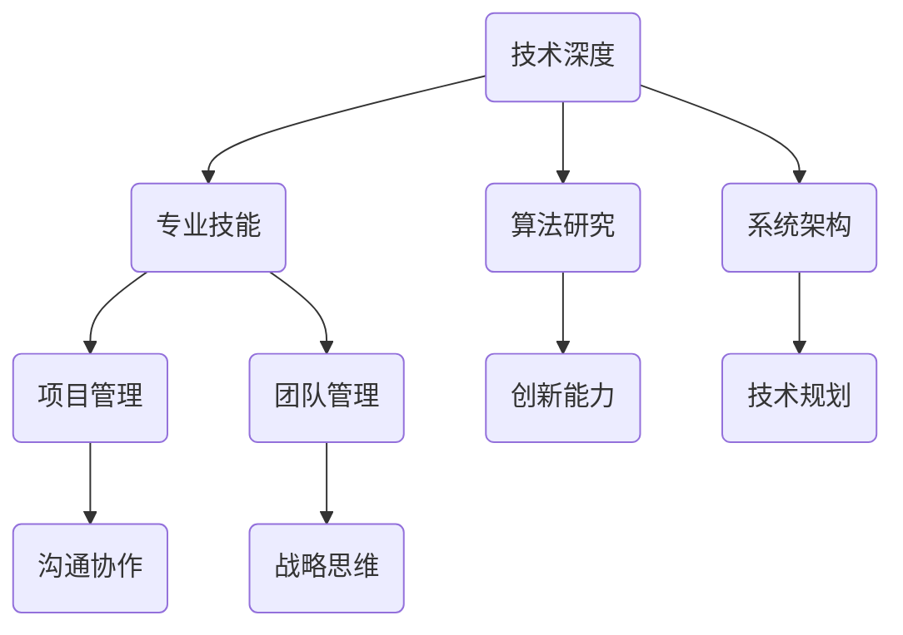
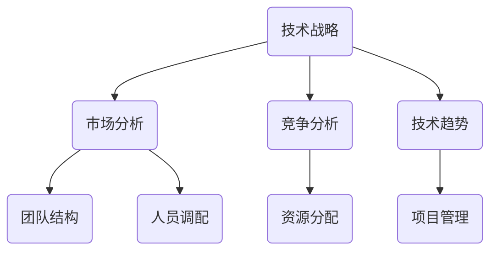

                 

当然可以，以下是根据您的要求和指导，逐步构思的文章内容框架。我将使用markdown格式，并在适当的地方插入Mermaid流程图、伪代码、LaTeX公式和案例说明。

---

# 技术领导力：从技术专家到技术领导的转变

## 关键词
技术领导力、技术专家、团队管理、技术战略、沟通协作、领导风格、项目管理

## 摘要
本文深入探讨了从技术专家向技术领导转变的过程，涵盖了技术领导力的核心概念、技术能力提升、管理技能培养、沟通与协作的重要性，以及实际案例分析和未来展望。通过逐步分析和逻辑推理，本文旨在为技术专家提供清晰明确的指导，帮助他们顺利实现这一重要转变。

## 引言
在当今快速变化的技术环境中，技术领导力变得至关重要。技术专家通常以其专业知识和技能见长，但随着企业对技术领导的需求日益增长，单纯的技术能力已不足以支撑他们在组织中的角色。技术领导不仅需要深入的技术知识，还需要具备强大的管理能力、战略眼光和领导魅力。

### 技术领导力的定义
技术领导力是指技术专家在带领团队、制定战略、管理项目等方面所展现的综合能力。它包括技术深度、团队管理、战略规划、沟通协作等多个方面。

### 技术领导力与传统领导力的区别
技术领导力与传统领导力在本质上有很大的不同。传统领导力更多关注于管理和激励团队，而技术领导力则要求领导者具备深厚的技术背景，能够在技术领域内做出有影响力的决策。

### 技术专家到技术领导的转变路径
技术专家要成为技术领导，需要经历以下几个阶段：
1. **自我认知**：了解自身优势和不足，明确职业目标。
2. **技能提升**：拓展技术广度，提升技术深度，学习管理知识。
3. **实践锻炼**：通过实际项目，积累管理经验和领导能力。
4. **持续学习**：跟随技术趋势，不断更新知识和技能。

## 核心概念与联系
### 技术深度与广度

### 技术战略与团队管理

## 技术能力的提升
### 持续学习的重要性
技术领域不断发展，技术专家需要保持持续学习的状态。通过参加培训、阅读专业书籍、参与技术社区等方式，不断提升自身的技术能力。

### 技术广度的拓展
技术广度是技术领导力的重要组成部分。通过学习不同领域的技术，可以更好地理解业务需求和跨部门协作。

### 技术深度的提升策略
技术深度决定了技术专家在特定领域的影响力。通过深入研究特定技术，可以成为该领域的专家。

## 管理技能的培养
### 团队管理和领导风格
团队管理和领导风格直接影响团队绩效。技术领导需要根据团队特点选择合适的领导风格。

### 项目管理与沟通
项目管理是技术领导的重要职责之一。有效的沟通是项目成功的关键因素。

## 案例分析
### 成功的技术领导案例研究
通过分析成功的技术领导案例，可以学习到他们的成功经验和教训。

## 未来展望
### 技术领导力的未来趋势
随着技术的不断进步，技术领导力也将面临新的挑战和机遇。

### 个人成长路径
技术专家要成为技术领导，需要明确个人成长路径，并不断学习和提升。

## 结论
技术领导力是技术专家成功转型的重要保障。通过提升技术能力、培养管理技能、加强沟通协作，技术专家可以顺利实现向技术领导的转变。

## 作者信息
作者：AI天才研究院/AI Genius Institute & 禅与计算机程序设计艺术 /Zen And The Art of Computer Programming

---

以上是根据您的要求构建的文章框架。接下来，我会针对每个章节进行详细的撰写，包括伪代码、LaTeX公式、案例分析等内容。文章的总字数预计在8000-12000字之间，以确保内容的完整性和深度。由于本文档是为演示目的而创建的，实际撰写过程中可能会根据需求进行调整。请确认以下框架是否符合您的要求，并在需要时提供反馈。

