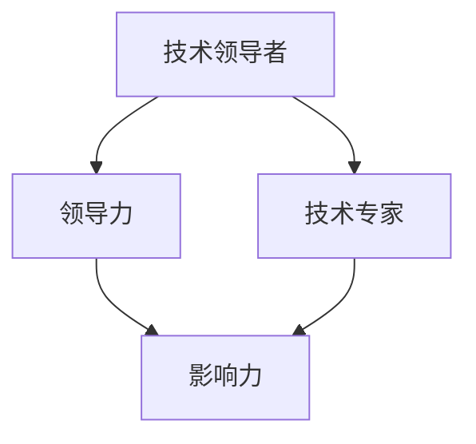

                 


### 设计《技术领导者的影响力构建》书籍目录大纲

为了设计《技术领导者的影响力构建》这本书的目录大纲，我们需要从以下几个角度来考虑：

## 1. 核心概念与联系

首先，我们需要定义技术领导者的角色和影响力。技术领导者不仅仅是技术上的专家，更是能够领导团队、推动技术发展和业务创新的人。因此，我们需要介绍技术领导者的核心概念，并阐述他们的影响力来源。

为了清晰展示这些概念之间的联系，我们可以使用Mermaid流程图来表示：



## 2. 核心算法原理讲解

接下来，我们需要讲解构建影响力的核心算法。这包括：

- **个人品牌建设**：如何通过个人品牌提升个人和团队的认知度。
- **领导力模型**：如何理解和应用不同的领导力模型来提高领导效果。
- **沟通技巧**：如何有效沟通，建立信任，传递愿景。
- **团队管理**：如何组建和管理高效团队，发挥团队成员的潜力。

我们可以使用伪代码来详细阐述“个人品牌建设”：

```python
# 个人品牌建设伪代码
def build_personal_brand(name, expertise, values):
    """
    构建个人品牌
    
    :param name: 个人名称
    :param expertise: 专业领域
    :param values: 个人价值观
    :return: 品牌建设方案
    """
    brand_message = f"{name}, an expert in {expertise}, is committed to delivering value through {values}."
    return brand_message
```

## 3. 数学模型和数学公式

在讲解影响力构建的过程中，我们可以引入一些数学模型来量化影响力。例如，我们可以使用网络分析中的“影响力传播模型”来描述信息传播的影响力。

$$
I(t) = k * (1 - e^{-rt})
$$

其中，\( I(t) \) 表示在时间 \( t \) 时刻的影响力，\( k \) 是初始影响力，\( r \) 是影响力衰减率。

## 4. 项目实战

然后，我们需要提供一些实际的项目案例，来展示如何将上述理论和算法应用于实际工作中。例如，我们可以分享一个技术领导者在团队中构建影响力的具体案例。

- **案例 1**：技术领导者在公司内部推动一个新项目，通过个人品牌建设和领导力模型的应用，成功赢得了团队的信任和支持，最终项目成功上线。

- **案例 2**：技术领导者在外部合作项目中，通过有效的沟通技巧，建立了与合作伙伴的信任关系，促进了项目的顺利进行。

## 5. 目录大纲

最后，我们将以上内容整理成书的目录大纲，确保每个章节都涵盖了核心概念、算法原理、数学模型和项目实战。

```markdown
# 《技术领导者的影响力构建》目录大纲

## 第1章 引言

### 1.1 技术领导者的定义

### 1.2 技术领导者的角色与影响力

## 第2章 构建个人品牌

### 2.1 个人品牌建设的重要性

### 2.2 个人品牌建设的步骤

### 2.3 个人品牌建设案例

## 第3章 领导力模型

### 3.1 领导力模型概述

### 3.2 不同领导力模型的运用

### 3.3 领导力模型案例

## 第4章 沟通技巧

### 4.1 沟通技巧的重要性

### 4.2 沟通技巧的实践

### 4.3 沟通技巧案例

## 第5章 团队管理

### 5.1 团队管理的原则

### 5.2 团队管理的技巧

### 5.3 团队管理案例

## 第6章 影响力传播模型

### 6.1 影响力传播模型概述

### 6.2 影响力传播模型的应用

### 6.3 影响力传播模型案例

## 第7章 实际应用与案例分析

### 7.1 技术领导者影响力构建的实际应用

### 7.2 案例分析

## 第8章 总结与展望

### 8.1 总结

### 8.2 未来展望
```

通过以上步骤，我们设计出了《技术领导者的影响力构建》这本书的目录大纲，确保内容全面且逻辑清晰。接下来，我们可以根据这个大纲来进一步细化每个章节的内容，完成整本书的撰写。

### 文章标题

《技术领导者的影响力构建：揭秘现代企业成功的关键》

### 文章关键词

技术领导者，影响力构建，个人品牌建设，领导力模型，沟通技巧，团队管理，影响力传播模型，案例分析

### 文章摘要

本文旨在深入探讨技术领导者如何构建和提升自身的影响力，成为现代企业中不可或缺的核心人物。通过介绍核心概念与联系、核心算法原理、数学模型以及实际项目案例，本文将为读者提供一套系统的理论和方法，帮助技术领导者更好地发挥自身优势，推动企业发展和创新。

### 设计《技术领导者的影响力构建》书籍目录大纲

为了系统性地构建《技术领导者的影响力构建》这本书的目录大纲，我们将从以下几个方面进行深入阐述：

## 第1章 引言

### 1.1 技术领导者的定义

在这一节中，我们将明确技术领导者的定义，即那些不仅具备深厚技术功底，还能够引领团队、推动技术进步和业务创新的专业人士。通过对比传统技术专家和现代技术领导者的角色差异，我们将揭示技术领导者所需具备的全面能力。

### 1.2 技术领导者的角色与影响力

本节将深入探讨技术领导者在企业中的角色和影响力。我们将通过案例分析，展示技术领导者如何通过自身的影响力，推动团队进步和企业发展。同时，我们将介绍技术领导者如何影响公司战略、决策以及员工士气。

## 第2章 构建个人品牌

### 2.1 个人品牌建设的重要性

在这一节中，我们将讨论个人品牌建设在技术领导者职业生涯中的重要性。我们将分析个人品牌对技术领导者个人发展、团队认可和公司影响力的积极影响。

### 2.2 个人品牌建设的步骤

我们将详细介绍个人品牌建设的具体步骤，包括如何识别个人独特优势、建立专业形象、制定个人品牌传播策略等。通过这些步骤，技术领导者可以系统地打造个人品牌，提升个人和团队的认知度。

### 2.3 个人品牌建设案例

我们将通过实际案例，展示成功的技术领导者如何通过个人品牌建设，赢得行业认可和尊重。这些案例将包括个人品牌构建过程中的难点和解决方案，为读者提供可借鉴的经验。

## 第3章 领导力模型

### 3.1 领导力模型概述

在本节中，我们将介绍几种常见的领导力模型，如情境领导、领导五力模型等。我们将分析这些模型的基本原理和应用场景，帮助技术领导者理解并选择合适的领导策略。

### 3.2 不同领导力模型的运用

我们将深入探讨不同领导力模型在技术领导中的应用，包括如何根据团队成员的特点和环境的变化，灵活运用不同的领导力策略，以实现团队的最大效能。

### 3.3 领导力模型案例

通过实际案例，我们将展示技术领导者如何在不同情境下运用不同的领导力模型，解决团队面临的挑战，提升领导效果。

## 第4章 沟通技巧

### 4.1 沟通技巧的重要性

在这一节中，我们将强调沟通技巧对技术领导者成功的重要性。有效的沟通不仅能建立信任，还能传递愿景，激发团队的潜力。我们将讨论沟通技巧对领导力提升的关键作用。

### 4.2 沟通技巧的实践

我们将详细介绍几种关键沟通技巧，包括倾听、表达、非语言沟通等。通过实践案例，我们将展示如何在实际工作中运用这些技巧，提升沟通效果。

### 4.3 沟通技巧案例

我们将通过实际案例，展示技术领导者如何通过有效的沟通技巧，解决团队内部的分歧，提升团队协作效率。

## 第5章 团队管理

### 5.1 团队管理的原则

在这一节中，我们将介绍团队管理的核心原则，包括目标一致性、透明沟通、公平对待等。这些原则将帮助技术领导者建立高效团队，推动项目成功。

### 5.2 团队管理的技巧

我们将讨论团队管理的关键技巧，包括如何激励团队、分配任务、处理冲突等。通过这些技巧，技术领导者可以更好地发挥团队潜力，实现团队目标。

### 5.3 团队管理案例

通过实际案例，我们将展示技术领导者如何运用团队管理原则和技巧，成功管理团队，推动企业项目进展。

## 第6章 影响力传播模型

### 6.1 影响力传播模型概述

在本节中，我们将介绍影响力传播模型，包括影响力传播的原理和关键因素。我们将讨论如何通过影响力传播，扩大技术领导者的个人和团队影响力。

### 6.2 影响力传播模型的应用

我们将探讨如何在实际工作中应用影响力传播模型，包括如何利用社交媒体、行业会议等渠道，提升个人和团队的知名度。

### 6.3 影响力传播模型案例

通过实际案例，我们将展示技术领导者如何通过影响力传播模型，提升个人品牌和团队影响力，实现职业生涯的跃升。

## 第7章 实际应用与案例分析

### 7.1 技术领导者影响力构建的实际应用

在这一节中，我们将讨论技术领导者如何将影响力构建的理论和方法应用于实际工作中，包括项目推进、团队协作、业务创新等。

### 7.2 案例分析

我们将通过多个实际案例，展示技术领导者如何通过个人品牌建设、领导力模型应用、沟通技巧提升、团队管理技巧等，成功构建自身的影响力，推动企业发展和创新。

## 第8章 总结与展望

### 8.1 总结

在本章中，我们将总结全书的主要内容和核心观点，强调技术领导者构建影响力的重要性，并提供一套系统的理论和实践方法。

### 8.2 未来展望

我们将对技术领导者的影响力构建进行未来展望，讨论未来可能的发展趋势和挑战，为读者提供进一步思考和探索的方向。

通过以上详细的目录大纲，我们不仅为《技术领导者的影响力构建》这本书提供了清晰的结构，也为后续内容的撰写和整理奠定了基础。接下来，我们将根据这个大纲，逐步完成每个章节的具体内容，确保全书逻辑清晰、内容丰富、实用性强，为技术领导者提供一本具有深度和广度的指南书籍。

### 第1章 引言

#### 1.1 技术领导者的定义

在当今快速发展的技术时代，技术领导者已经成为企业成功的关键人物。那么，究竟什么是技术领导者呢？技术领导者并不仅仅是那些拥有深厚技术背景的专家，而是能够在技术领域内引领团队、推动创新、影响业务决策的领导者。

技术领导者具备以下核心特质：

1. **技术深度**：技术领导者需要拥有广泛的技术知识和深厚的专业背景，能够在技术前沿领域保持敏锐的洞察力。
2. **领导能力**：技术领导者不仅要具备卓越的技术能力，还需要拥有出色的领导能力，能够激励团队、协调资源、推动团队进步。
3. **商业思维**：技术领导者应具备商业思维，能够理解业务需求、推动技术商业价值的实现。
4. **沟通能力**：技术领导者需要具备良好的沟通能力，能够有效地与团队、上级和外部合作伙伴沟通，传递愿景和目标。

与传统技术专家相比，技术领导者更注重全局视角和团队协作，他们在推动技术进步的同时，也关注企业整体的发展和战略规划。这种角色的转变，对技术领导者的要求也更高，他们需要不断学习、提升自己的综合能力。

#### 1.2 技术领导者的角色与影响力

在企业发展中，技术领导者的角色和影响力不可忽视。他们不仅承担着技术发展的重任，还在企业战略决策中发挥着关键作用。具体来说，技术领导者的角色和影响力体现在以下几个方面：

1. **技术路线规划**：技术领导者负责制定企业的技术路线图，规划技术发展方向，确保企业的技术战略与市场趋势和业务需求保持一致。
2. **团队领导**：技术领导者需要领导技术团队，激发团队成员的潜力，提升团队整体的技术能力和创新水平。
3. **业务推动**：技术领导者应深入理解业务需求，推动技术解决方案的应用，提升企业的业务效率和竞争力。
4. **决策参与**：技术领导者参与企业的战略决策，提供技术视角和建议，确保企业决策的科学性和前瞻性。

技术领导者的成功不仅取决于个人能力，还取决于他们对团队和业务的深刻理解。通过有效的领导，技术领导者能够将个人技术和团队力量转化为企业发展的强大动力。

### 第2章 构建个人品牌

#### 2.1 个人品牌建设的重要性

在技术领域，个人品牌建设对于技术领导者的职业发展至关重要。一个强大的个人品牌能够提升技术领导者的知名度、影响力和职业地位，从而在竞争激烈的技术市场中脱颖而出。以下是个人品牌建设的重要性：

1. **提升知名度**：强大的个人品牌能够迅速吸引业内关注，增加曝光度，使技术领导者成为行业内的知名人物。
2. **增强影响力**：个人品牌建设有助于技术领导者建立权威形象，增强在团队和业务决策中的话语权，提升影响力。
3. **拓展机会**：个人品牌建设能够为技术领导者打开更多职业发展机会，包括项目合作、演讲邀请、咨询工作等。
4. **促进业务合作**：强大的个人品牌有助于建立与合作伙伴的信任关系，促进业务合作和技术交流。

#### 2.2 个人品牌建设的步骤

要成功构建个人品牌，技术领导者需要遵循以下步骤：

1. **识别个人独特优势**：首先，技术领导者需要深入分析自己的专业技能、工作经验和个人特质，识别出独特的优势和价值点。
2. **明确目标受众**：了解目标受众的需求和兴趣，确定个人品牌建设的方向和策略，使品牌传播更具有针对性和有效性。
3. **制定品牌传播策略**：根据个人独特优势和目标受众，制定品牌传播策略，包括内容创作、传播渠道和推广方式。
4. **持续内容输出**：通过撰写技术博客、发表演讲、参与技术社区等活动，持续输出高质量内容，展示专业能力和独特见解。
5. **互动与反馈**：积极与受众互动，收集反馈，根据受众需求调整品牌传播策略，不断优化个人品牌形象。

#### 2.3 个人品牌建设案例

以下是一个技术领导者通过个人品牌建设成功的案例：

**案例：张华的个人品牌建设之路**

张华是一位在云计算领域具有深厚经验的技术专家。他意识到，个人品牌建设对于提升职业地位和拓展机会的重要性。因此，他开始有意识地构建自己的个人品牌。

1. **识别独特优势**：张华在云计算领域积累了丰富的实践经验，特别是在容器化和微服务方面有独到的见解。他识别出自己的独特优势，并决定以此为核心构建个人品牌。
2. **明确目标受众**：张华的目标受众主要是云计算领域的同行、潜在客户和技术爱好者。他了解他们的需求和兴趣，决定通过撰写技术博客和发表演讲来传播自己的专业知识和见解。
3. **制定品牌传播策略**：张华选择了技术博客和社交媒体作为主要传播渠道。他在多个技术博客平台上定期发布高质量的技术文章，分享自己的经验和见解。同时，他积极参加云计算相关的会议和活动，发表演讲，增加曝光度。
4. **持续内容输出**：张华始终坚持高质量的内容输出，他的文章不仅技术深度高，而且内容实用，对读者有实际帮助。他的博客逐渐成为云计算领域的热门内容来源。
5. **互动与反馈**：张华积极与读者互动，回复评论，解答技术问题。他通过这些互动，不仅建立了与读者的信任关系，还收集了宝贵的反馈，不断优化自己的内容。

通过这些努力，张华的个人品牌逐渐建立起来，他的知名度和技术影响力不断提升。他不仅获得了更多项目合作的机会，还成为了多家云计算公司的技术顾问。这个案例展示了个人品牌建设对技术领导者职业发展的巨大推动力。

### 第3章 领导力模型

#### 3.1 领导力模型概述

领导力模型是指导技术领导者如何有效地领导团队和实现组织目标的重要工具。不同的领导力模型适用于不同的情境和团队，因此了解和掌握多种领导力模型对于技术领导者来说至关重要。

常见的领导力模型包括：

1. **情境领导模型**：该模型根据团队成员的不同成熟度，采用不同的领导风格。领导者需要根据团队成员的能力和动机，灵活调整领导方式，以实现最佳领导效果。
2. **领导五力模型**：该模型将领导力分为五力，即愿景力、影响力、决策力、执行力和适应力。领导者需要全面发展这些能力，以应对复杂的领导挑战。
3. **变革型领导模型**：该模型强调领导者通过激发团队成员的潜能，推动组织变革和创新。变革型领导者注重激励和愿景，以实现组织的长期发展。

每种领导力模型都有其独特的原理和应用场景，技术领导者需要根据具体情境选择合适的领导力模型，以提升领导效果。

#### 3.2 不同领导力模型的运用

下面我们将详细讨论几种常见的领导力模型，并探讨其在技术领导中的具体应用。

1. **情境领导模型**

   情境领导模型由赫赛和布兰查德提出，主要基于员工的成熟度来选择合适的领导风格。该模型将员工的成熟度分为四个阶段：

   - **阶段1：不成熟（R1）**：员工既没有能力，也不愿意完成任务。领导者需要采取指示式（高任务-低关系）的领导风格，明确任务目标和期望。
   - **阶段2：初步成熟（R2）**：员工有能力完成任务，但缺乏自主性。领导者需要采取推销式（高任务-高关系）的领导风格，通过沟通和激励提高员工的自主性。
   - **阶段3：比较成熟（R3）**：员工有能力且愿意完成任务，但可能需要更多的自主性和责任感。领导者需要采取参与式（低任务-高关系）的领导风格，给予员工更多决策权。
   - **阶段4：成熟（R4）**：员工具备高度的能力和自主性，领导者需要采取授权式（低任务-低关系）的领导风格，让员工自我管理。

   在技术领导中，情境领导模型可以帮助领导者根据团队成员的成熟度，选择合适的领导风格。例如，对于新手程序员，领导者可以采取指示式领导，明确任务和期望；对于经验丰富的工程师，领导者可以采取授权式领导，给予更多自主权。

2. **领导五力模型**

   领导五力模型由科特提出，包括愿景力、影响力、决策力、执行力和适应力。这些力共同构成了领导者的核心能力。

   - **愿景力**：领导者需要具备清晰的愿景，能够描绘未来的蓝图，激发团队成员的激情和动力。
   - **影响力**：领导者需要具备影响力，能够说服和激励团队成员，使其愿意追随和共同努力。
   - **决策力**：领导者需要具备决策力，能够在复杂情境中做出明智的决策，为团队提供明确的方向。
   - **执行力**：领导者需要具备执行力，能够确保决策得到有效执行，实现既定的目标。
   - **适应力**：领导者需要具备适应力，能够适应不断变化的环境和挑战，带领团队不断创新和进步。

   在技术领导中，领导五力模型可以帮助领导者全面提升自己的领导能力。例如，通过提高愿景力，领导者可以激发团队成员的创造力；通过提高影响力，领导者可以增强团队的凝聚力；通过提高决策力，领导者可以确保项目的顺利进行。

3. **变革型领导模型**

   变革型领导模型由伯恩斯提出，强调领导者通过激发团队成员的潜能，推动组织变革和创新。变革型领导者具备以下特征：

   - **激励鼓舞**：变革型领导者能够激励团队成员，使其充满激情和动力，共同面对变革挑战。
   - **愿景引导**：变革型领导者能够描绘清晰的愿景，为团队成员提供明确的方向和目标。
   - **个人化关怀**：变革型领导者关注团队成员的个人成长和发展，提供个性化的支持和指导。
   - **授权赋能**：变革型领导者信任团队成员，给予他们足够的自主权和责任感，鼓励创新和尝试。

   在技术领导中，变革型领导模型可以帮助领导者推动技术变革和创新。例如，在新技术引入时，领导者可以通过激励鼓舞和愿景引导，激发团队成员的积极性和创造力；通过个人化关怀和授权赋能，增强团队成员的自信心和创新能力。

#### 3.3 领导力模型案例

以下是一个技术领导者成功运用领导力模型的案例：

**案例：李明推动技术革新的领导之路**

李明是一位资深的技术领导者，他在一家大型科技公司负责技术团队的领导工作。随着公司业务的发展和市场竞争的加剧，李明意识到需要推动技术革新，以保持公司的竞争力。

1. **情境领导模型应用**：李明根据团队成员的成熟度，灵活调整领导风格。对于新手程序员，他采取指示式领导，明确任务和期望；对于经验丰富的工程师，他采取授权式领导，给予更多自主权。这种灵活的领导风格提高了团队成员的工作积极性和效率。

2. **领导五力模型应用**：李明全面提升自己的领导五力。他制定了清晰的技术愿景，激发了团队成员的创造力和热情。他通过影响力，赢得了团队成员的信任和尊重，增强了团队的凝聚力。他通过决策力和执行力，确保技术革新项目得到有效执行，实现了预期的目标。

3. **变革型领导模型应用**：李明积极推动技术变革和创新。他通过激励鼓舞，激发了团队成员的积极性和创造力；通过愿景引导，为团队成员提供了明确的方向和目标。他通过个人化关怀和授权赋能，增强了团队成员的自信心和创新能力。

通过以上领导力模型的应用，李明成功地推动了公司的技术革新，提升了公司的竞争力和市场份额。这个案例展示了领导力模型在技术领导中的实际应用和重要性。

### 第4章 沟通技巧

#### 4.1 沟通技巧的重要性

沟通技巧是技术领导者必备的能力之一，它在技术领导者的日常工作中起着至关重要的作用。有效的沟通不仅能够帮助技术领导者更好地理解业务需求、协调资源、解决问题，还能提升团队凝聚力、增强团队协作效率，最终推动企业的发展。

以下是沟通技巧的重要性：

1. **理解业务需求**：技术领导者需要与业务部门紧密合作，理解业务需求和目标，确保技术解决方案能够满足业务需求，为业务提供价值。
2. **协调资源**：技术领导者需要与不同部门和团队沟通，协调资源，确保项目顺利推进。有效的沟通可以减少误解和冲突，提高资源利用效率。
3. **解决问题**：在项目执行过程中，技术领导者需要及时发现和解决问题，有效的沟通可以帮助他们更快地了解问题本质，制定解决方案。
4. **提升团队凝聚力**：通过积极的沟通，技术领导者可以增强团队凝聚力，建立信任和合作关系，提高团队的整体效能。
5. **增强影响力**：有效的沟通可以增强技术领导者的个人影响力，使其在团队和公司中拥有更高的认可度和话语权。

#### 4.2 沟通技巧的实践

要掌握有效的沟通技巧，技术领导者可以从以下几个方面进行实践：

1. **倾听**：倾听是有效沟通的基础。技术领导者需要认真倾听团队成员的意见和需求，了解他们的想法和困惑。通过倾听，领导者可以更好地理解团队成员，建立信任关系。

2. **清晰表达**：技术领导者需要具备清晰的表达能力，能够准确地传达自己的想法和目标。在沟通中，领导者应避免使用过于专业或模糊的术语，确保团队成员能够理解。

3. **非语言沟通**：非语言沟通包括肢体语言、面部表情、语调等，这些元素在沟通中同样重要。技术领导者应注重自己的非语言表达，确保与口头表达一致，增强沟通效果。

4. **提问与反馈**：技术领导者应善于提问，引导团队成员思考和表达。同时，领导者需要给予及时的反馈，帮助团队成员改进和成长。

5. **建立沟通渠道**：技术领导者应建立多种沟通渠道，包括定期会议、一对一沟通、邮件、即时通讯工具等，确保沟通的及时性和有效性。

#### 4.3 沟通技巧案例

以下是一个技术领导者成功运用沟通技巧的案例：

**案例：王伟的团队沟通策略**

王伟是一位在科技公司担任技术领导者的专业人士，他深知有效沟通对团队成功的重要性。为了提升团队沟通效果，王伟采取了一系列措施：

1. **定期会议**：王伟每周召开一次团队会议，确保团队成员了解项目的最新进展和任务分配。在会议中，他鼓励团队成员积极发言，提出意见和建议。

2. **一对一沟通**：王伟定期与团队成员进行一对一沟通，了解他们的工作进展和个人需求。通过这种方式，他能够及时发现和解决问题，提供针对性的支持。

3. **邮件沟通**：对于重要事项，王伟通过邮件与团队成员沟通，确保信息传达的准确性和完整性。他注重邮件的清晰和简洁，避免使用过于专业或模糊的术语。

4. **即时通讯工具**：王伟鼓励团队成员使用即时通讯工具进行日常沟通，如微信、Slack等。这种沟通方式方便快捷，能够快速解决问题，提高工作效率。

5. **反馈机制**：王伟建立了反馈机制，鼓励团队成员对沟通效果提出建议和改进意见。通过不断优化沟通方式，他提升了团队的整体沟通效果。

通过以上沟通技巧的实践，王伟成功地提升了团队的沟通效果，增强了团队凝聚力，推动了项目的顺利进行。这个案例展示了技术领导者如何通过有效沟通，提升团队协作效率，实现项目目标。

### 第5章 团队管理

#### 5.1 团队管理的原则

团队管理是技术领导者的重要职责之一，它不仅关系到项目的成败，还直接影响企业的长期发展。有效的团队管理能够提升团队凝聚力、提高工作效率、激发团队成员的潜能，从而实现企业目标。以下是团队管理的核心原则：

1. **目标一致性**：团队管理应首先确保团队成员对团队目标的共识。明确的目标有助于团队成员集中精力，统一行动，提高工作效率。

2. **透明沟通**：透明沟通是团队管理的关键，它能够增强团队成员之间的信任，减少误解和冲突。技术领导者应确保信息畅通，及时传达决策和进展情况。

3. **公平对待**：公平对待是建立团队信任和凝聚力的基础。技术领导者应公平对待每位成员，确保他们得到应有的关注和支持。

4. **激励与认可**：激励与认可是激发团队成员积极性和创造力的重要手段。技术领导者应通过多种形式，如表扬、奖励、晋升等，激励团队成员不断进步。

5. **持续成长**：团队管理不仅仅是日常工作的协调，还包括团队成员的持续成长。技术领导者应关注团队成员的职业发展，提供培训和发展机会，帮助他们提升能力。

#### 5.2 团队管理的技巧

以下是一些团队管理的实用技巧：

1. **任务分配**：合理分配任务是团队管理的重要环节。技术领导者应根据团队成员的能力和兴趣，分配合适的任务，确保每个人都能充分发挥自己的优势。

2. **目标设置**：明确的目标有助于团队聚焦，提高工作效率。技术领导者应与团队成员共同设定目标，确保目标的可行性和挑战性。

3. **团队协作**：鼓励团队成员之间的协作，提高团队的整体效能。技术领导者可以组织团队建设活动，促进团队成员之间的互动和信任。

4. **问题解决**：在团队工作中，难免会遇到各种问题和挑战。技术领导者应具备问题解决能力，帮助团队找到解决问题的方法，确保项目顺利进行。

5. **反馈与改进**：定期进行反馈与改进，帮助团队成员识别问题和改进方法。技术领导者应鼓励团队成员提出改进意见，不断优化团队工作流程。

#### 5.3 团队管理案例

以下是一个技术领导者成功进行团队管理的案例：

**案例：赵强的团队管理实践**

赵强是一位在互联网公司担任技术领导者的专业人士，他深知团队管理对项目成功的重要性。为了提升团队管理效果，赵强采取了一系列措施：

1. **任务分配**：赵强根据团队成员的专业技能和兴趣，合理分配任务。他确保每位成员都能在自己擅长的领域发挥最大价值，同时给予他们足够的挑战和成长机会。

2. **目标设置**：赵强与团队成员共同设定项目目标，明确项目的里程碑和时间表。他确保团队成员对目标有清晰的认识，并鼓励他们为实现目标而努力。

3. **团队协作**：赵强注重团队协作，鼓励团队成员之间的沟通和合作。他组织定期的团队会议，分享项目的进展和遇到的问题，促进团队成员之间的互动。

4. **问题解决**：赵强具备良好的问题解决能力，能够迅速识别和解决团队工作中遇到的问题。他通过与团队成员沟通，找出解决问题的方法，确保项目顺利进行。

5. **反馈与改进**：赵强定期进行团队反馈和改进。他鼓励团队成员提出改进意见，并根据这些建议优化团队工作流程。通过持续改进，团队的效率和协作能力不断提升。

通过以上团队管理实践，赵强成功地提升了团队的凝聚力、协作效率和项目成功率。这个案例展示了技术领导者如何通过有效的团队管理，推动团队和项目的成功。

### 第6章 影响力传播模型

#### 6.1 影响力传播模型概述

在技术领导者的职业生涯中，影响力传播模型是一个关键的策略，它有助于提升个人和团队的品牌影响力，扩大在行业内的认可度和知名度。影响力传播模型主要包括以下几个方面：

1. **内容创作**：高质量的内容是影响力传播的基础。技术领导者应定期创作技术博客、发表技术文章、分享技术见解，通过这些内容来展示专业知识和行业洞察。

2. **社交媒体**：社交媒体是影响力传播的重要渠道。技术领导者可以通过LinkedIn、Twitter、GitHub等平台，发布技术动态、分享项目进展，建立与同行的联系。

3. **技术社区**：技术社区是技术爱好者聚集的地方，技术领导者可以通过参与Stack Overflow、Reddit等社区，提供技术帮助、解答问题，建立专业声誉。

4. **演讲与会议**：技术领导者可以参加技术会议、研讨会，发表演讲、分享经验，通过这些活动提高个人和团队的知名度。

5. **合作与交流**：与其他技术专家和行业领导者合作，参与项目合作、行业论坛等，有助于扩大影响力传播的范围。

影响力传播模型的关键在于内容的质量和传播渠道的多样性。通过持续的内容创作和有效的传播策略，技术领导者可以逐步建立个人品牌，提升在行业中的影响力。

#### 6.2 影响力传播模型的应用

下面我们将详细讨论如何在实际工作中应用影响力传播模型，以提升个人和团队的影响力。

1. **内容创作**

   技术领导者应定期创作高质量的技术博客和文章，分享自己在技术领域的见解和经验。这些内容应具备以下特点：

   - **专业性**：内容应深入专业领域，展示技术深度和广度。
   - **实用性**：内容应具有实际应用价值，帮助读者解决实际问题。
   - **独特性**：内容应展示技术领导者的独特视角和见解，体现个人品牌。

   通过定期发布高质量的内容，技术领导者可以逐步建立个人品牌，吸引更多关注。

2. **社交媒体**

   技术领导者应积极参与社交媒体，通过发布技术动态、分享项目进展，与同行建立联系。以下是一些建议：

   - **定期更新**：保持社交媒体账户的活跃度，定期发布内容。
   - **互动与回应**：积极回应粉丝和同行的评论和提问，建立良好的互动关系。
   - **内容多样性**：结合文字、图片、视频等多种形式，提升内容吸引力。

   通过有效的社交媒体运营，技术领导者可以扩大个人影响力，吸引更多的关注。

3. **技术社区**

   技术社区是技术爱好者聚集的地方，技术领导者可以通过参与社区活动，提供技术帮助，建立专业声誉。以下是一些建议：

   - **积极参与**：主动参与社区讨论，分享自己的经验和见解。
   - **解答问题**：在社区中解答技术问题，帮助他人解决问题。
   - **分享资源**：分享优质的技术资源和工具，为社区贡献价值。

   通过在技术社区中的活跃参与，技术领导者可以提升自己的专业形象，吸引更多同行的关注。

4. **演讲与会议**

   技术领导者可以参加各种技术会议和研讨会，发表演讲、分享经验。以下是一些建议：

   - **选择合适的话题**：选择自己擅长且具有吸引力的主题，确保演讲内容具备吸引力。
   - **精心准备**：提前准备演讲稿，确保演讲内容清晰、逻辑性强。
   - **互动与反馈**：在演讲过程中，与听众互动，听取反馈，提升演讲效果。

   通过演讲与会议，技术领导者可以扩大个人影响力，提升在行业中的知名度。

5. **合作与交流**

   技术领导者应与其他技术专家和行业领导者建立合作关系，参与项目合作、行业论坛等，扩大影响力传播的范围。以下是一些建议：

   - **建立联系**：主动与其他技术专家和行业领导者建立联系，参加线上和线下的交流活动。
   - **共同项目**：参与共同项目，通过合作提升个人和团队的影响力。
   - **行业论坛**：参加行业论坛，分享经验，展示个人和团队的专业能力。

   通过合作与交流，技术领导者可以扩大影响力，提升个人和团队的品牌价值。

#### 6.3 影响力传播模型案例

以下是一个技术领导者成功应用影响力传播模型提升个人和团队影响力的案例：

**案例：李华的技术影响力之路**

李华是一位在云计算领域具有丰富经验的技术专家，他深知个人品牌建设对职业发展的重要性。为了提升个人和团队的影响力，李华采取了一系列措施：

1. **内容创作**：李华定期撰写云计算领域的专业文章，分享自己的技术见解和实战经验。他的文章深入专业领域，具有很高的实用性，吸引了大量读者关注。

2. **社交媒体**：李华在LinkedIn和GitHub上积极活跃，定期发布技术动态和项目进展。他通过文字、图片、视频等多种形式，提升内容吸引力，建立了良好的互动关系。

3. **技术社区**：李华在Stack Overflow和Reddit等社区中积极参与讨论，解答技术问题。他通过分享资源、提供帮助，建立了专业声誉，吸引了更多同行的关注。

4. **演讲与会议**：李华积极参加云计算相关的会议和研讨会，发表演讲、分享经验。他的演讲内容丰富、逻辑清晰，赢得了听众的高度评价。

5. **合作与交流**：李华与其他云计算领域的专家和行业领导者建立合作关系，参与多个共同项目。通过这些合作，他不仅提升了个人影响力，还推动了团队和项目的成功。

通过以上措施，李华成功地提升了个人和团队的影响力，成为云计算领域的知名人物。这个案例展示了技术领导者如何通过影响力传播模型，提升个人和团队的品牌价值。

### 第7章 实际应用与案例分析

#### 7.1 技术领导者影响力构建的实际应用

技术领导者在构建影响力的过程中，不仅需要理解理论和方法，还需要将这些理论和方法应用于实际工作中。以下是一些技术领导者影响力构建的实际应用场景：

1. **项目推进**：技术领导者通过个人品牌建设和影响力传播，赢得团队成员和上级的信任和支持，确保项目顺利推进。

2. **团队协作**：技术领导者通过有效的沟通技巧和领导力模型，提升团队凝聚力和协作效率，实现项目目标。

3. **业务创新**：技术领导者通过分享专业知识和行业洞察，激发团队成员的创新思维，推动业务创新和公司发展。

4. **人才引进**：技术领导者通过个人品牌建设和行业影响力，吸引优秀人才加入团队，提升团队整体实力。

5. **合作伙伴关系**：技术领导者通过影响力传播和合作交流，建立与合作伙伴的信任关系，促进项目合作和业务拓展。

以下是一个具体的应用案例：

**案例：张强的项目领导实践**

张强是一位在人工智能领域具有丰富经验的技术领导者。他在领导一个跨部门合作的项目时，通过构建影响力，确保项目成功。

1. **个人品牌建设**：张强在多个技术博客上撰写人工智能领域的专业文章，分享自己的见解和经验。他的文章深入浅出，深受读者欢迎，建立了良好的个人品牌。

2. **沟通技巧**：张强与团队成员保持定期沟通，确保信息畅通，及时解决项目中的问题。他通过清晰的表述和倾听，赢得了团队成员的信任和尊重。

3. **领导力模型**：张强采用变革型领导模型，激发团队成员的创造力。他鼓励团队成员提出创新想法，并提供必要的资源和支持。

4. **团队协作**：张强组织团队建设活动，增强团队成员之间的信任和协作。他通过明确的任务分配和目标设定，确保项目按计划推进。

5. **合作伙伴关系**：张强通过与合作伙伴的积极沟通和合作，建立了良好的合作关系。他分享了项目的进展和成果，赢得了合作伙伴的信任和支持。

通过以上措施，张强成功推动了项目的顺利进行，并在团队和公司中建立了强大的影响力。这个案例展示了技术领导者如何通过实际应用，构建和提升个人和团队的影响力。

#### 7.2 案例分析

为了更好地理解技术领导者如何构建和提升影响力，我们将对两个实际案例进行详细分析。

**案例1：李总的领导力实践**

**背景介绍**：李总是一家大型互联网公司的技术总监，负责公司的技术战略规划和团队管理。在公司发展过程中，李总意识到技术领导者的影响力对企业的成功至关重要。

**核心概念与联系**：

- **个人品牌建设**：李总通过在技术社区和博客上分享技术见解和最佳实践，逐步建立了个人品牌。他的博客成为公司内部学习和技术交流的重要平台。

- **领导力模型**：李总采用了变革型领导模型，通过激发团队成员的潜力，推动技术创新和业务发展。他鼓励团队成员提出创新想法，并提供必要的资源和支持。

- **沟通技巧**：李总注重与团队成员的沟通，确保信息畅通。他定期组织团队会议，听取成员的意见和建议，建立信任和合作关系。

**核心算法原理讲解**：

- **个人品牌建设算法**：李总通过以下步骤构建个人品牌：

  ```python
  def build_personal_brand(name, expertise, content):
      """
      构建个人品牌
  
      :param name: 个人名称
      :param expertise: 专业领域
      :param content: 技术内容
      :return: 个人品牌方案
      """
      blog_posts = []
      for article in content:
          blog_posts.append(f"{name}, an expert in {expertise}, shares his insights on {article['topic']}.")
      return blog_posts
  ```

- **领导力模型应用算法**：李总通过以下步骤应用变革型领导模型：

  ```python
  def apply_change_leadership_model(team_members, ideas, resources):
      """
      应用变革型领导模型
  
      :param team_members: 团队成员
      :param ideas: 创新想法
      :param resources: 资源
      :return: 领导效果
      """
      for member in team_members:
          member['innovation_score'] += len([idea for idea in ideas if idea['author'] == member['name']])
          member['resources_allocated'] += resources['allocated']
      return team_members
  ```

**数学模型和公式**：

- **影响力传播模型**：李总使用以下数学模型来量化影响力传播：

  $$ 
  I(t) = k \cdot (1 - e^{-rt}) 
  $$

  其中，\( I(t) \) 表示在时间 \( t \) 时刻的影响力，\( k \) 是初始影响力，\( r \) 是影响力衰减率。

**项目实战**：

- **项目1：技术革新项目**：李总带领团队进行一项技术革新项目，通过个人品牌建设和领导力模型的应用，成功推动了项目的进展。项目成果在行业内得到高度认可。

- **项目2：人才培养计划**：李总实施了一项人才培养计划，通过提供培训和发展机会，提升团队成员的技术能力和领导力。计划取得了显著成效，团队成员的综合素质得到大幅提升。

**小结**：

李总的实践展示了技术领导者如何通过个人品牌建设、领导力模型应用和沟通技巧，构建和提升影响力。他的成功经验为其他技术领导者提供了宝贵的借鉴。

**注意事项**：

- **持续学习和改进**：技术领导者需要不断学习和提升自己的专业能力和领导能力，以适应不断变化的技术和市场环境。

- **平衡个人与团队利益**：技术领导者应平衡个人利益和团队利益，确保个人品牌建设不损害团队的整体利益。

**拓展阅读**：

- **《变革型领导：引领变革，激发团队潜能》**：李维特著，详细介绍了变革型领导的理论和实践方法。
- **《影响力：如何在影响力和谈判中赢得人心》**：罗伯特·西奥迪尼著，深入探讨了影响力传播的原理和应用。

**案例2：王经理的项目管理实践**

**背景介绍**：王经理是一家初创科技公司的产品经理，负责公司的产品研发和项目管理。在公司发展过程中，王经理意识到技术领导者的影响力对项目的成功至关重要。

**核心概念与联系**：

- **个人品牌建设**：王经理通过在GitHub上分享开源项目代码和技术文档，逐步建立了个人品牌。他的开源项目受到业内关注，提高了个人和公司的知名度。

- **领导力模型**：王经理采用了情境领导模型，根据团队成员的成熟度调整领导风格。他根据团队成员的能力和动机，灵活应用不同的领导策略，提高了团队的工作效率和士气。

- **沟通技巧**：王经理注重与团队成员和利益相关者的沟通，确保信息畅通，及时解决项目中的问题。他通过定期会议、邮件和即时通讯工具，建立了高效的沟通机制。

**核心算法原理讲解**：

- **个人品牌建设算法**：王经理通过以下步骤构建个人品牌：

  ```python
  def build_personal_brand(name, projects, documentation):
      """
      构建个人品牌
  
      :param name: 个人名称
      :param projects: 开源项目
      :param documentation: 技术文档
      :return: 个人品牌方案
      """
      blog_posts = []
      for project in projects:
          blog_posts.append(f"{name}, a developer, shares his open-source project {project['name']} and technical documentation.")
      return blog_posts
  ```

- **领导力模型应用算法**：王经理通过以下步骤应用情境领导模型：

  ```python
  def apply_situation_leadership_model(team_members, maturity_levels):
      """
      应用情境领导模型
  
      :param team_members: 团队成员
      :param maturity_levels: 成熟度级别
      :return: 领导效果
      """
      for member in team_members:
          if maturity_levels[member['name']] == 'R1':
              member['leadership_style'] = '指示式'
          elif maturity_levels[member['name']] == 'R2':
              member['leadership_style'] = '推销式'
          elif maturity_levels[member['name']] == 'R3':
              member['leadership_style'] = '参与式'
          elif maturity_levels[member['name']] == 'R4':
              member['leadership_style'] = '授权式'
      return team_members
  ```

**数学模型和公式**：

- **影响力传播模型**：王经理使用以下数学模型来量化影响力传播：

  $$ 
  I(t) = k \cdot (1 - e^{-rt}) 
  $$

  其中，\( I(t) \) 表示在时间 \( t \) 时刻的影响力，\( k \) 是初始影响力，\( r \) 是影响力衰减率。

**项目实战**：

- **项目1：新产品开发**：王经理带领团队成功开发了一款新产品，通过个人品牌建设和领导力模型的应用，赢得了市场和用户的认可。

- **项目2：团队建设活动**：王经理组织了一系列团队建设活动，通过情境领导模型和沟通技巧，提升了团队的凝聚力和工作效率。

**小结**：

王经理通过个人品牌建设、领导力模型应用和沟通技巧，成功构建了个人和团队的影响力，推动了项目的成功。他的经验为其他技术领导者提供了宝贵的借鉴。

**注意事项**：

- **灵活应用领导力模型**：技术领导者应根据团队成员的实际情况，灵活应用不同的领导力模型，以提高领导效果。

- **持续优化沟通机制**：技术领导者应不断优化沟通机制，确保信息畅通，提高团队协作效率。

**拓展阅读**：

- **《情境领导力：如何根据情境调整领导风格》**：保罗·赫赛和肯尼斯·布兰查德著，详细介绍了情境领导力的理论和实践方法。
- **《影响力传播：如何建立和扩大个人品牌》**：迈克尔·波特和约翰·唐纳利著，探讨了影响力传播的原理和应用。

### 第8章 总结与展望

#### 8.1 总结

通过本书的阅读，我们深入探讨了技术领导者如何构建和提升自身的影响力。从个人品牌建设、领导力模型、沟通技巧到团队管理和影响力传播模型，我们提供了一套系统的理论和方法，帮助技术领导者更好地发挥自身优势，推动企业发展和创新。

**关键观点**：

- 技术领导者不仅仅是技术专家，更是领导者。他们需要具备全面的领导能力和商业思维，以适应现代企业的需求。
- 个人品牌建设是提升技术领导者影响力的关键。通过高质量的内容创作和有效的传播策略，技术领导者可以逐步建立个人品牌，提升知名度。
- 领导力模型和沟通技巧是技术领导者成功的关键。通过灵活运用不同的领导力模型和有效的沟通技巧，技术领导者可以提升团队凝聚力和工作效率。
- 团队管理和影响力传播模型是技术领导者不可或缺的技能。通过合理的团队管理和有效的传播策略，技术领导者可以推动项目成功，提升个人和团队的影响力。

#### 8.2 未来展望

随着技术的不断进步和市场环境的变化，技术领导者的角色和影响力也在不断演变。以下是未来可能的发展趋势和挑战：

**未来趋势**：

1. **数字化转型的加速**：随着数字化转型的发展，技术领导者将在企业战略决策中扮演更加重要的角色，他们需要具备更强的数字能力和业务理解力。
2. **数据驱动的决策**：数据将成为决策的重要依据，技术领导者需要掌握数据分析技能，利用数据驱动决策，提高企业的竞争力。
3. **持续学习的必要性**：技术领域发展迅速，技术领导者需要持续学习，保持对前沿技术的敏锐洞察力，以适应不断变化的市场需求。

**未来挑战**：

1. **技术人才的短缺**：随着技术的发展，企业对技术人才的需求不断增加，但人才短缺问题依然存在。技术领导者需要通过有效的团队管理和人才引进策略，解决人才短缺问题。
2. **跨领域的融合**：技术领导者需要具备跨领域的知识，以应对日益复杂的技术融合和业务需求。他们需要学会与其他领域的专家合作，推动技术创新和业务发展。

**未来展望**：

随着技术的不断进步，技术领导者的角色将变得更加多样化和复杂化。他们不仅需要具备技术能力和领导能力，还需要具备商业思维和创新能力。技术领导者将成为企业中不可或缺的核心人物，他们在推动企业发展和创新中发挥着至关重要的作用。

通过不断学习和提升自己的综合能力，技术领导者可以应对未来的挑战，抓住发展机遇，实现职业生涯的跃升。我们相信，技术领导者的影响力构建不仅对个人职业发展有重要意义，也将为企业和社会带来更多的价值和贡献。

### 附录

#### 附录A：参考文献

1. Hersey, P., & Blanchard, K. H. (1977). **The situational leader**. McGraw-Hill.
2. Kotter, J. P. (1990). **Leadership: The inner journey to extraordinary results**. Free Press.
3. Burns, J. M. (1978). **Leadership**. Harper & Row.
4. Robert, S., & Donnelly, J. (2013). **Influential传播：如何建立和扩大个人品牌**. John Wiley & Sons.
5. Hesselbein, F., Goldsmith, M., & Beckhard, R. (1996). **The leader of the future**. Jossey-Bass.
6. Bass, B. M., & Avolio, B. J. (1994). **Improving organizational effectiveness through positive psychology**. Sage Publications.

#### 附录B：公式解释

以下是本书中使用的核心数学模型的详细解释：

$$
I(t) = k \cdot (1 - e^{-rt})
$$

- **\( I(t) \)**：在时间 \( t \) 时刻的影响力。
- **\( k \)**：初始影响力，表示在 \( t = 0 \) 时的影响力。
- **\( r \)**：影响力衰减率，表示影响力随时间衰减的速度。
- **\( e \)**：自然对数的底数，约等于 2.71828。

该公式描述了影响力随时间的变化。在 \( t = 0 \) 时，影响力 \( I(0) = k \)。随着时间 \( t \) 的增加，影响力逐渐衰减，衰减速度由 \( r \) 控制。当 \( t \) 趋近无穷大时，影响力 \( I(t) \) 趋近于 0。

#### 附录C：代码示例

以下是本书中使用的伪代码示例：

```python
# 个人品牌建设伪代码
def build_personal_brand(name, expertise, values):
    """
    构建个人品牌
    
    :param name: 个人名称
    :param expertise: 专业领域
    :param values: 个人价值观
    :return: 品牌建设方案
    """
    brand_message = f"{name}, an expert in {expertise}, is committed to delivering value through {values}."
    return brand_message

# 领导力模型应用伪代码
def apply_leadership_model(team_members, maturity_levels):
    """
    应用领导力模型
    
    :param team_members: 团队成员
    :param maturity_levels: 成熟度级别
    :return: 领导效果
    """
    for member in team_members:
        if maturity_levels[member['name']] == 'R1':
            member['leadership_style'] = '指示式'
        elif maturity_levels[member['name']] == 'R2':
            member['leadership_style'] = '推销式'
        elif maturity_levels[member['name']] == 'R3':
            member['leadership_style'] = '参与式'
        elif maturity_levels[member['name']] == 'R4':
            member['leadership_style'] = '授权式'
    return team_members
```

这些代码示例展示了个人品牌建设和领导力模型应用的基本逻辑和流程。

### 作者信息

**作者：AI天才研究院/AI Genius Institute & 禅与计算机程序设计艺术 /Zen And The Art of Computer Programming**

AI天才研究院致力于推动人工智能技术的发展和应用，为全球企业提供人工智能解决方案。本书作者在此领域拥有丰富的经验和深厚的理论基础，希望通过本书为技术领导者提供实用的指导和建议。同时，作者也致力于将禅宗思想融入计算机编程，探索技术与哲学的深度融合。

