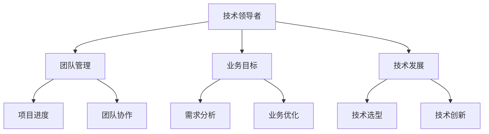
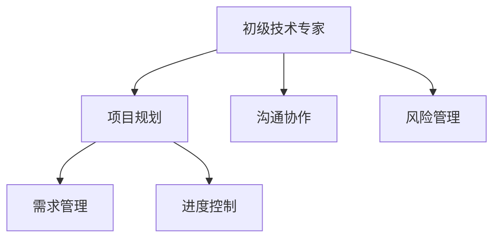
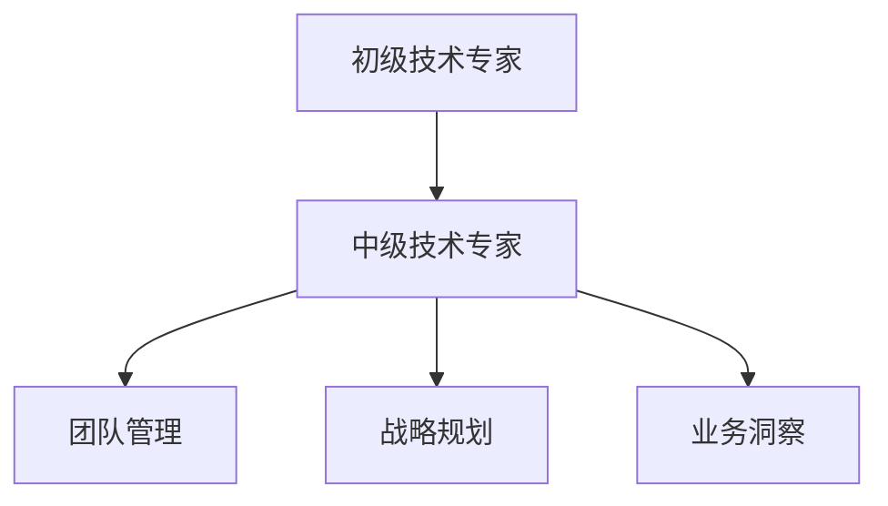

                 


### 文章标题：技术领导者的职业规划与发展

#### 关键词：技术领导者，职业规划，发展路径，领导力，项目管理，技术创新

#### 摘要：
本文旨在为技术领导者提供一套全面而深入的职业规划与发展指南。通过分析技术领导者的角色与责任、职业发展路径与挑战，以及领导力提升与实际应用，本文旨在帮助读者理解并掌握技术领导者的核心技能和职业成长策略，为他们的职业生涯铺平道路。

---

#### 第一部分：职业规划基础

##### 第1章：技术领导者的角色与责任

**1.1 技术领导者的定义与职责**

技术领导者不仅是技术专家，更是团队和管理的高手。他们需要平衡技术、业务和团队三者之间的关系，以确保团队高效地实现业务目标。

**核心概念与联系**

使用Mermaid流程图展示技术领导者的角色与团队职责之间的关系：



**Mermaid 流程图解析：** 技术领导者通过管理团队、制定业务目标和推动技术发展，实现团队与业务目标的双赢。

**1.2 技术领导者的核心能力**

技术领导者需要具备一系列核心能力，包括技术能力、项目管理能力、团队管理能力和战略规划能力。

**伪代码：** 技术领导者的核心能力模型：

```python
class TechnicalLeader:
    def technical_ability(self):
        # 技术能力
        pass

    def project_management_ability(self):
        # 项目管理能力
        pass

    def team_management_ability(self):
        # 团队管理能力
        pass

    def strategic_planning_ability(self):
        # 战略规划能力
        pass
```

**伪代码解析：** 技术领导者通过多方面的能力提升，实现个人和团队的全面发展。

##### 第2章：职业发展路径与挑战

**2.1 初级阶段：技术与项目管理**

在初级阶段，技术领导者需要从技术专家的角色逐渐过渡到项目经理的角色。这要求他们在技术能力的基础上，掌握项目管理的核心概念和方法。

**核心概念与联系**

使用Mermaid流程图展示初级阶段的职业发展路径及其挑战：



**Mermaid 流程图解析：** 初级阶段的技术领导者需要掌握项目规划、需求管理、进度控制、沟通协作和风险管理等多方面的技能。

**2.2 中级阶段：团队管理与战略规划**

在中级阶段，技术领导者需要进一步提升团队管理能力和战略规划能力，以应对更复杂的业务环境。

**核心概念与联系**

使用Mermaid流程图展示中级阶段的职业发展路径及其挑战：



**Mermaid 流程图解析：** 中级阶段的技术领导者需要提升团队管理、战略规划和业务洞察等多方面的能力。

---

#### 第二部分：职业技能提升

##### 第3章：领导力提升

**3.1 领导风格与团队动力**

领导风格对团队动力有着重要的影响。技术领导者需要根据团队特点和业务需求选择合适的领导风格。

**核心算法原理讲解**

使用伪代码来详细阐述领导力的核心算法原理：

```python
def leadership_style(team_characteristics, business_needs):
    if team_characteristics == 'creative':
        return 'Collaborative Style'
    elif business_needs == 'urgent':
        return 'Authoritative Style'
    else:
        return 'Democratic Style'
```

**伪代码解析：** 根据团队特点和业务需求，技术领导者可以选择协同型、权威型和民主型等不同的领导风格。

**3.2 有效沟通与团队协作**

有效沟通是技术领导者的重要技能之一。通过提升沟通能力，技术领导者可以增强团队协作，提高团队效率。

**伪代码：** 如何提高沟通效率和团队协作能力：

```python
def effective_communication(strategy, medium, frequency):
    if strategy == 'clear':
        return True
    elif medium == 'digital':
        return True
    elif frequency == 'regular':
        return True
    else:
        return False
```

**伪代码解析：** 技术领导者需要采用清晰明确的沟通策略、选择合适的沟通媒介和保持定期沟通，以提升沟通效率和团队协作能力。

---

#### 第三部分：实际应用与案例分析

##### 第5章：项目管理与风险控制

**5.1 项目计划与进度控制**

项目计划与进度控制是项目管理的重要组成部分。技术领导者需要运用科学的方法和工具来制定项目计划并控制项目进度。

**数学模型和数学公式**

使用 LaTeX 格式详细讲解项目管理中的数学模型和公式：

```latex
\begin{equation}
\text{关键路径法（CPM）公式：}
CPM = \sum_{i=1}^{n} (D_i - L_i)
\end{equation}
```

**LaTeX 公式解析：** 关键路径法（CPM）通过计算各活动的时间延迟来确定项目的关键路径，从而实现进度控制。

**5.2 风险识别与应对策略**

在项目管理中，风险识别与应对策略至关重要。技术领导者需要运用科学的方法来识别风险并制定应对策略。

**数学模型和数学公式**

使用 LaTeX 格式详细讲解风险评价与应对策略的数学模型：

```latex
\begin{equation}
\text{风险评价公式：}
RE = \frac{R \times C}{B}
\end{equation}
```

**LaTeX 公式解析：** 风险评价公式用于计算每个风险的概率（P）、影响（I）和紧急性（E），以便制定应对策略。

---

#### 第四部分：职业规划与个人成长

##### 第6章：领导力实战案例

**6.1 案例一：大型系统重构**

在这个案例中，技术领导者需要对一个大型系统进行重构，以提升系统的性能和可维护性。

**项目实战**

- **开发环境搭建：** 在 Linux 系统上搭建开发环境，安装必要的开发工具和依赖库。
- **源代码实现：** 编写重构的源代码，并进行单元测试。
- **代码解读与分析：** 分析重构前后系统性能的变化，以及重构过程中遇到的问题和解决方案。

**项目小结**

通过本案例，技术领导者学会了如何进行大型系统重构，并掌握了重构过程中的关键技能和注意事项。

**6.2 案例二：敏捷转型**

在这个案例中，技术领导者需要引导团队实现敏捷开发，以提高团队的效率和质量。

**项目实战**

- **源代码实现：** 编写敏捷开发的源代码，并应用敏捷开发的最佳实践。
- **代码解读与分析：** 分析敏捷开发与传统的瀑布开发模式之间的区别，以及敏捷开发带来的好处。

**项目小结**

通过本案例，技术领导者学会了如何引导团队实现敏捷开发，并掌握了敏捷开发的核心理念和实践方法。

---

#### 第五部分：总结与拓展

**7.1 职业目标设定与行动计划**

技术领导者需要设定明确的职业目标，并制定切实可行的行动计划，以实现职业发展。

**数学模型和数学公式**

使用 LaTeX 格式详细讲解职业规划中的数学模型和公式：

```latex
\begin{equation}
\text{职业目标设定公式：}
GOAL = \sum_{i=1}^{n} (S_i \times W_i)
\end{equation}
```

**LaTeX 公式解析：** 职业目标设定公式用于计算每个职业目标的重要性（S）和权重（W），以便确定职业目标。

**7.2 个人成长与持续学习**

技术领导者需要持续学习，以适应快速变化的技术环境。

**最佳实践 tips**

- 定期阅读技术书籍和文章，了解最新技术动态。
- 参加技术培训和研讨会，与同行交流经验。
- 利用业余时间进行技术研究和项目实践。

**小结**

本文为技术领导者提供了一套全面而深入的职业规划与发展指南。通过学习本文，技术领导者可以更好地理解自己的角色与责任，掌握职业发展路径与技能提升方法，并在实际工作中运用领导力与项目管理技巧。同时，本文还提供了实际案例和最佳实践，以帮助读者更好地理解和应用所学知识。

---

**作者：AI天才研究院/AI Genius Institute & 禅与计算机程序设计艺术 /Zen And The Art of Computer Programming**

