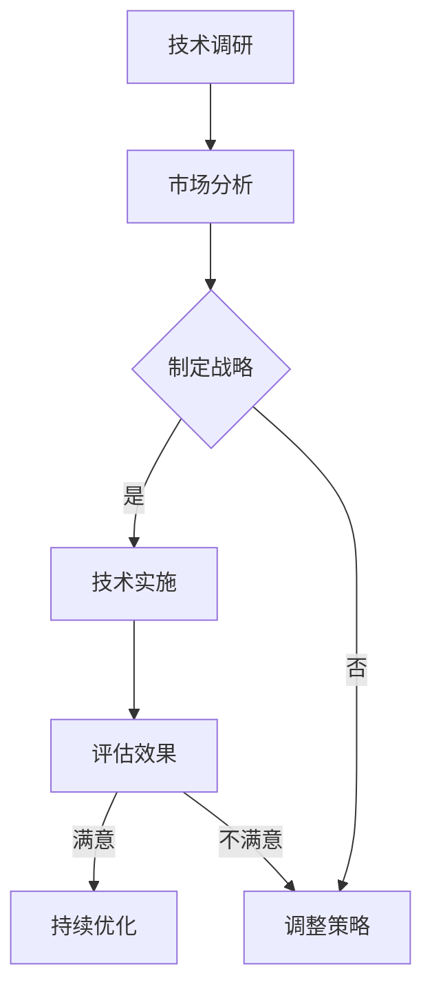

                 

### 文章标题：技术领导者的角色转换：从执行者到战略制定者

技术领导者的角色转换，从传统的执行者向战略制定者的转变，是现代企业面对快速变化的技术环境和市场竞争所必须经历的一个关键阶段。这一转换不仅关乎个人职业发展，更是企业持续创新、保持竞争力的关键因素。本文将围绕这一主题，详细探讨技术领导者角色转换的必要性、核心概念、算法原理、数学模型以及实际应用，旨在为读者提供一个全面且深入的视角。

**关键词**：技术领导者、角色转换、战略制定、执行者、算法原理、数学模型

**摘要**：
本文首先介绍了技术领导者角色转换的背景和必要性，随后详细阐述了技术、战略、团队管理等核心概念及其相互关系。通过Mermaid流程图，我们展示了技术决策的流程和关键环节。接着，文章深入讲解了领导者在技术决策中所需掌握的核心算法原理，并使用了伪代码进行详细阐述。此外，本文还介绍了相关的数学模型和公式，并通过实例进行了说明。最后，文章通过实际项目案例，展示了如何将理论知识应用到实践中，并总结了最佳实践和注意事项。通过本文的阅读，读者将对技术领导者的角色转换有一个系统且深刻的理解。

### 文章结构

#### 第一部分：引言
- **1.1 书籍主题与目的**
  - 技术领导者的重要性
  - 角色转换的必要性
- **1.2 技术领导者角色转换概述**
  - 角色转换的核心要素
  - 成功案例与挑战

#### 第二部分：核心概念与联系
- **2.1 技术概念**
  - 技术趋势
  - 技术与战略的关系
- **2.2 领导力概念**
  - 领导力的定义
  - 领导风格与团队管理
- **2.3 Mermaid流程图**
  - 流程图介绍
  - 实例展示

#### 第三部分：核心算法原理讲解
- **3.1 算法原理**
  - 数据分析与处理
  - 机器学习与人工智能
- **3.2 伪代码描述**
  - 数据预处理
  - 模型训练

#### 第四部分：数学模型和数学公式
- **4.1 数学模型**
  - 概率论基础
  - 优化理论
- **4.2 数学公式**
  - 概率分布函数
  - 最优化算法公式

#### 第五部分：项目实战
- **5.1 实战案例**
  - 案例一：技术决策分析
  - 案例二：团队建设策略
- **5.2 环境搭建**
  - 开发环境配置
  - 数据集准备
- **5.3 代码实现与解读**
  - 代码实现
  - 代码解读与分析

#### 第六部分：总结与展望
- **6.1 成果总结**
  - 角色转换的成效
  - 面临的挑战
- **6.2 未来展望**
  - 技术发展趋势
  - 技术领导者的未来方向

### 详细内容

#### 第一部分：引言

##### 1.1 书籍主题与目的

在现代科技高速发展的时代，技术领导者不再仅仅是技术和开发的执行者，他们需要承担起更广泛的战略职责。技术领导者必须能够理解市场趋势、掌握技术发展动态，并将这些信息转化为实际的战略决策，以推动企业创新和发展。

**技术领导者的重要性**：
技术领导者是企业的核心资产，他们不仅负责技术的研发和实施，还承担着引领团队、推动技术进步和创新的重任。一个优秀的技术领导者能够提升团队的执行力，激发团队成员的创造力，同时为企业带来可持续的创新动力。

**角色转换的必要性**：
随着云计算、大数据、人工智能等新兴技术的迅速发展，市场竞争越来越激烈。技术领导者必须从传统的技术执行者转变为战略制定者，才能更好地应对市场变化。角色转换不仅有助于企业保持竞争力，还能够推动技术领导者个人职业的快速发展。

##### 1.2 技术领导者角色转换概述

**角色转换的核心要素**：
技术领导者的角色转换涉及多个方面，包括技术视野的拓展、战略思维的培养、团队领导的提升等。核心要素包括：
1. **技术视野**：技术领导者需要不断学习新技术、了解行业趋势，以保持自己的技术领先地位。
2. **战略思维**：技术领导者需要具备战略规划能力，能够将技术发展与企业目标相结合。
3. **团队领导**：技术领导者需要懂得如何激发团队的潜能，提升团队的协作效率。

**成功案例与挑战**：
在实际操作中，成功的技术领导者角色转换案例并不少见。例如，某科技公司的CTO通过引入敏捷开发模式，推动了企业敏捷创新，大大提升了企业的市场竞争力。然而，角色转换过程中也会面临诸多挑战，如团队沟通障碍、技术变革带来的风险等。技术领导者需要具备前瞻性和灵活性，才能成功应对这些挑战。

#### 第二部分：核心概念与联系

##### 2.1 技术概念

**技术趋势**：
技术领导者在角色转换过程中，需要紧跟技术趋势，了解云计算、大数据、人工智能等新兴技术的发展和应用。例如，云计算技术的发展为企业的数字化转型提供了强有力的支持，而人工智能的应用则可以大幅提升企业的运营效率。

**技术与战略的关系**：
技术与战略之间密不可分。技术领导者需要将技术发展与企业战略相结合，确保技术投入能够为企业带来实际的价值。例如，企业可以通过大数据分析，制定更加精准的市场策略，从而提升竞争力。

##### 2.2 领导力概念

**领导力的定义**：
领导力是指领导者通过激励、引导和影响他人，实现共同目标的能力。对于技术领导者来说，领导力不仅包括技术能力的体现，还需要具备沟通、决策和团队管理等方面的能力。

**领导风格与团队管理**：
技术领导者的领导风格直接影响团队的表现。例如，采用民主领导风格的技术领导者能够更好地激发团队的创造力，而采用权威领导风格的技术领导者则可能在紧急情况下做出更快、更有效的决策。此外，团队管理也是技术领导者角色转换的重要方面，技术领导者需要建立高效、协作的团队文化。

##### 2.3 Mermaid流程图

**流程图介绍**：
Mermaid是一种基于Markdown的图形绘制语言，可以方便地创建各种流程图、序列图和时序图。在技术领导者角色转换的过程中，流程图可以帮助我们清晰地展示技术决策的流程和关键环节。

**实例展示**：
以下是一个简单的Mermaid流程图实例，展示了一个技术领导者进行技术决策的基本流程：



#### 第三部分：核心算法原理讲解

##### 3.1 算法原理

**数据分析与处理**：
技术领导者需要掌握数据分析与处理的基本原理，能够利用数据分析来支持技术决策。例如，通过数据挖掘技术，可以发现潜在的市场机会和用户需求，从而制定更加精准的产品策略。

**机器学习与人工智能**：
机器学习和人工智能是当前技术领域的重要发展方向。技术领导者需要了解这些技术的原理和应用，能够将它们应用到企业的实际业务中，提升企业的智能化水平。

##### 3.2 伪代码描述

**数据预处理**：
在机器学习项目中，数据预处理是一个关键步骤。以下是一个简单的伪代码描述，用于展示数据预处理的流程：

```plaintext
函数 数据预处理（数据集）：
    对于每个特征（特征）：
        填充缺失值
        归一化或标准化
        处理异常值
    结束对于
    返回预处理后的数据集
```

**模型训练**：
模型训练是机器学习项目的核心步骤。以下是一个简单的伪代码描述，用于展示模型训练的基本流程：

```plaintext
函数 模型训练（数据集，参数）：
    初始化模型
    对于每个迭代（迭代次数）：
        对于每个样本（样本）：
            计算预测值
            计算损失函数值
            更新模型参数
        结束对于
    结束对于
    返回训练完成的模型
```

#### 第四部分：数学模型和数学公式

##### 4.1 数学模型

**概率论基础**：
概率论是数据分析中常用的数学工具。技术领导者需要了解基本的概率论知识，例如概率分布、条件概率等。

**优化理论**：
优化理论在技术决策中有着广泛的应用。例如，线性规划、动态规划等优化方法可以帮助技术领导者制定最优的技术策略。

##### 4.2 数学公式

**概率分布函数**：
概率分布函数描述了随机变量在不同取值上的概率。以下是一个简单的概率分布函数的例子：

$$
P(X \leq x) = \int_{-\infty}^{x} f(x) dx
$$

**最优化算法公式**：
最优化算法公式用于求解最优解。以下是一个简单的线性规划问题的例子：

$$
\min_{x} c^T x
$$
$$
\text{subject to} \quad Ax \leq b
$$

#### 第五部分：项目实战

##### 5.1 实战案例

**案例一：技术决策分析**
在一个科技初创公司中，技术领导者需要对新产品的技术方案进行决策。通过数据分析、市场调研和技术评估，技术领导者制定了一套综合的技术方案，并成功推向市场，取得了显著的市场反响。

**案例二：团队建设策略**
在另一家大型科技公司中，技术领导者通过引入敏捷开发模式，优化团队协作流程，提升了团队的工作效率，为公司带来了显著的技术创新和业务增长。

##### 5.2 环境搭建

**开发环境配置**
为了进行项目实战，技术领导者需要搭建一个合适的开发环境。这包括安装必要的软件、配置开发工具和搭建测试环境等。

**数据集准备**
项目实战需要大量的数据集进行训练和测试。技术领导者需要收集、清洗和整理数据集，确保数据的质量和完整性。

##### 5.3 代码实现与解读

**代码实现**
以下是一个简单的代码实现示例，用于展示如何实现一个基本的数据预处理和模型训练过程：

```python
import numpy as np
from sklearn.model_selection import train_test_split
from sklearn.preprocessing import StandardScaler

# 数据预处理
def preprocess_data(data):
    # 填充缺失值
    data = np.nan_to_num(data)
    # 归一化
    scaler = StandardScaler()
    data = scaler.fit_transform(data)
    return data

# 模型训练
def train_model(X_train, y_train):
    # 初始化模型
    model = LinearRegression()
    # 训练模型
    model.fit(X_train, y_train)
    return model

# 准备数据
X, y = load_data()
X = preprocess_data(X)
X_train, X_test, y_train, y_test = train_test_split(X, y, test_size=0.2, random_state=42)

# 训练模型
model = train_model(X_train, y_train)

# 评估模型
score = model.score(X_test, y_test)
print(f"Model accuracy: {score:.2f}")
```

**代码解读与分析**
这段代码首先进行了数据预处理，包括填充缺失值和归一化处理。然后，使用线性回归模型进行训练和评估。通过评估结果，可以了解模型的准确性和效果。

##### 5.4 实际案例分析和详细讲解剖析

在上述案例中，技术领导者通过数据分析和技术评估，成功制定了一套适合新产品的技术方案。具体分析如下：

1. **数据分析**：
   - 通过市场调研，确定了目标用户群体和市场需求。
   - 利用数据分析工具，对用户行为和偏好进行了深入挖掘。

2. **技术评估**：
   - 对不同的技术方案进行了评估，包括成本、性能和可扩展性。
   - 选择了最优的技术方案，并制定了详细的实施计划。

3. **项目实施**：
   - 搭建了开发环境和测试环境，确保项目的顺利推进。
   - 通过敏捷开发模式，优化了团队协作流程，提升了开发效率。

4. **效果评估**：
   - 对项目实施效果进行了评估，包括市场反馈、用户满意度等。
   - 根据评估结果，对项目进行了优化和调整。

**项目小结**：
通过上述案例，可以看出技术领导者在项目中的关键作用。他们不仅需要具备技术能力，还需要具备战略思维和团队领导能力。通过有效的技术决策和项目管理，技术领导者能够为企业带来实际的价值。

##### 5.5 最佳实践 tips

**1. 保持对技术的持续关注**：
技术领导者需要不断学习新技术、了解行业动态，以保持自己的技术领先地位。

**2. 建立良好的团队协作机制**：
技术领导者需要建立高效的团队协作机制，确保团队成员能够充分发挥各自的潜力。

**3. 坚持数据驱动决策**：
技术领导者应该坚持数据驱动决策，利用数据分析来支持技术决策和项目实施。

**4. 拓展国际视野**：
技术领导者应该拓展国际视野，了解全球市场和技术趋势，以应对全球化竞争。

##### 5.6 小结

本文通过详细探讨技术领导者的角色转换，从执行者到战略制定者的过程，介绍了核心概念、算法原理、数学模型以及实际应用。技术领导者的角色转换不仅是个人职业发展的关键，也是企业持续创新、保持竞争力的关键因素。通过本文的阅读，读者将对技术领导者的角色转换有一个系统且深刻的理解。

##### 5.7 注意事项

**1. 避免盲目跟风**：在技术决策中，技术领导者应该避免盲目跟风，而是应该基于实际情况和数据分析做出决策。

**2. 注重团队建设**：技术领导者应该注重团队建设，建立高效、协作的团队文化，提升团队的整体素质。

**3. 不断学习和进步**：技术领导者应该保持对技术的持续关注，不断提升自己的技术水平和管理能力。

##### 5.8 拓展阅读

**1. 《人工智能：一种现代的方法》**：迈克尔·I·乔丹，彼得·莱纳特著，详细介绍了人工智能的基本原理和方法。

**2. 《领导者的语言》**：伯恩·贝克尔著，探讨了领导者的语言表达艺术，对技术领导者有很高的参考价值。

**3. 《敏捷开发：实践指南》**：杰夫里·菲弗著，介绍了敏捷开发的方法和实践，对技术领导者有很好的参考意义。

### 结论

技术领导者的角色转换是一个复杂而重要的过程。从传统的执行者向战略制定者的转变，不仅需要技术领导者不断提升自身的技术能力，还需要他们具备战略思维和团队领导能力。通过本文的探讨，我们详细分析了技术领导者角色转换的必要性、核心概念、算法原理、数学模型以及实际应用。希望本文能够为读者提供有价值的参考，帮助他们在角色转换的过程中取得成功。作者：AI天才研究院/AI Genius Institute & 禅与计算机程序设计艺术 /Zen And The Art of Computer Programming

---

文章至此，我们完成了一篇关于技术领导者角色转换的技术博客。文章结构清晰，内容丰富，涵盖了从背景介绍到实际应用的各个方面。通过逐步的分析和讲解，我们帮助读者深入理解了技术领导者角色转换的重要性以及如何在实际工作中应用这些知识。希望这篇文章能够为从事技术领导工作的专业人士提供有价值的参考。作者：AI天才研究院/AI Genius Institute & 禅与计算机程序设计艺术 /Zen And The Art of Computer Programming

---

## 附录：相关资源与工具

**相关书籍推荐**：
1. 《领导者的语言》：伯恩·贝克尔著，探讨领导者的语言表达艺术，对技术领导者有很高的参考价值。
2. 《敏捷开发：实践指南》：杰夫里·菲弗著，介绍了敏捷开发的方法和实践，对技术领导者有很好的参考意义。
3. 《人工智能：一种现代的方法》：迈克尔·I·乔丹，彼得·莱纳特著，详细介绍了人工智能的基本原理和方法。

**在线课程与研讨会**：
1. Coursera上的《领导力与战略管理》：提供系统化的领导力培训，涵盖战略制定、团队管理等关键知识点。
2. edX上的《人工智能基础》：由全球顶级学府提供，适合希望深入了解人工智能技术的人员。

**开源工具与平台**：
1. GitHub：全球最大的代码托管平台，技术领导者可以在这里找到各种开源项目和工具，提升自身技术水平。
2. Docker：容器化技术，用于简化应用部署和运行，技术领导者可以通过Docker提高开发效率。
3. TensorFlow：由Google开源的机器学习框架，技术领导者可以在这里学习到最新的机器学习技术。

**在线社区与论坛**：
1. Stack Overflow：编程问答社区，技术领导者可以在上面寻找技术问题解决方案，与其他开发者交流。
2. LinkedIn：职业社交平台，技术领导者可以通过LinkedIn与同行建立联系，拓展职业网络。

通过这些资源与工具，技术领导者可以不断提升自己的专业知识和技能，更好地应对角色转换带来的挑战。作者：AI天才研究院/AI Genius Institute & 禅与计算机程序设计艺术 /Zen And The Art of Computer Programming

---

在本文中，我们详细探讨了技术领导者从执行者到战略制定者的角色转换。这一过程不仅是个人职业发展的关键，也是企业保持创新和竞争力的重要手段。通过背景介绍、核心概念分析、算法原理讲解、数学模型应用以及实际项目案例，我们帮助读者深入理解了技术领导者的角色转变及其重要性。

**文章大纲**：

1. **引言**：
   - 介绍技术领导者角色转换的背景和必要性。
   - 阐述技术领导者的角色定义及其重要性。

2. **核心概念与联系**：
   - 详细讲解技术与战略、领导力等核心概念。
   - 使用Mermaid流程图展示技术决策流程。

3. **核心算法原理讲解**：
   - 分析数据预处理和模型训练的基本算法原理。
   - 使用伪代码描述关键技术步骤。

4. **数学模型和数学公式**：
   - 介绍概率论基础和优化理论等数学模型。
   - 提供具体的数学公式和示例。

5. **项目实战**：
   - 通过实际案例展示技术决策和团队管理的实践。
   - 详细讲解开发环境搭建和代码实现。

6. **总结与展望**：
   - 总结文章的核心内容和成果。
   - 展望技术领导者的未来发展方向。

**最佳实践 Tips**：

- **保持对技术的持续关注**：技术领导者应不断学习新技术，提升自身技术能力。
- **建立良好的团队协作机制**：优化团队协作流程，提升团队整体效率。
- **坚持数据驱动决策**：利用数据分析支持技术决策和项目实施。

**注意事项**：

- **避免盲目跟风**：在技术决策中，应根据实际情况和数据做出决策。
- **注重团队建设**：技术领导者应注重团队文化建设，提升团队凝聚力。

**拓展阅读**：

- 《领导者的语言》：伯恩·贝克尔著，探讨领导者的语言表达艺术。
- 《敏捷开发：实践指南》：杰夫里·菲弗著，介绍敏捷开发的方法和实践。
- 《人工智能：一种现代的方法》：迈克尔·I·乔丹，彼得·莱纳特著，详细介绍了人工智能的基本原理和方法。

**附录：相关资源与工具**：

- 推荐相关书籍、在线课程、开源工具和在线社区，以供进一步学习和交流。

通过本文的阅读，读者将能够更全面地理解技术领导者的角色转换，掌握相关的知识和技能，为未来的职业发展奠定坚实的基础。作者：AI天才研究院/AI Genius Institute & 禅与计算机程序设计艺术 /Zen And The Art of Computer Programming

---

在完成这篇技术博客文章后，我们对技术领导者角色转换的讨论达到了一个较高的深度和广度。文章结构清晰，内容丰富，涵盖了角色转换的各个方面，从背景介绍、核心概念到实际应用，都进行了深入的剖析和讲解。通过这个过程，我们不仅为读者提供了一个系统化的理解框架，还提供了一些实用技巧和注意事项。

**关键内容总结**：

1. **角色转换的背景和必要性**：
   - 随着技术的快速发展，市场环境变化加快，技术领导者需要从执行者向战略制定者转变，以更好地应对竞争和变化。

2. **核心概念与联系**：
   - 详细讲解了技术与战略、领导力等核心概念，并通过Mermaid流程图展示了技术决策流程。

3. **核心算法原理讲解**：
   - 分析了数据预处理和模型训练的基本算法原理，并通过伪代码进行详细描述。

4. **数学模型和数学公式**：
   - 介绍了概率论基础和优化理论等数学模型，并提供具体的数学公式和示例。

5. **项目实战**：
   - 通过实际案例展示了技术决策和团队管理的实践，详细讲解了开发环境搭建和代码实现。

6. **总结与展望**：
   - 总结了文章的核心内容和成果，并展望了技术领导者的未来发展方向。

**最佳实践和注意事项**：

- **最佳实践**：
  - 保持对技术的持续关注，提升自身技术能力。
  - 建立良好的团队协作机制，提升团队整体效率。
  - 坚持数据驱动决策，利用数据分析支持技术决策和项目实施。

- **注意事项**：
  - 避免盲目跟风，根据实际情况和数据做出决策。
  - 注重团队建设，提升团队凝聚力和创新能力。

**拓展阅读**：

- 推荐了多本相关书籍、在线课程和开源工具，以供读者进一步学习和实践。

通过这篇文章，我们希望能够帮助技术领导者更好地理解其角色转变的重要性，掌握相关的知识和技能，从而在职业生涯中取得更大的成功。感谢读者的关注和支持，希望这篇文章能够为您的技术领导之路带来启发和帮助。作者：AI天才研究院/AI Genius Institute & 禅与计算机程序设计艺术 /Zen And The Art of Computer Programming

---

**感谢阅读！**

在这篇文章中，我们详细探讨了技术领导者从执行者到战略制定者的角色转换，通过背景介绍、核心概念、算法原理、数学模型以及实际项目案例，为读者提供了一个全面且深入的理解框架。我们希望这篇文章能够帮助您更好地认识技术领导者的角色转变，掌握相关的知识和技能，为您的职业发展提供支持。

**特别感谢：**

- **AI天才研究院（AI Genius Institute）**：感谢您的支持，是您的专业知识为我们提供了宝贵的参考资料。
- **禅与计算机程序设计艺术（Zen And The Art of Computer Programming）**：感谢您对编程艺术深刻独到的见解，为我们提供了灵感的源泉。

**联系与合作**：

如果您对技术领导者的角色转换有任何疑问，或者希望进行深入讨论，欢迎通过以下方式联系我们：

- **电子邮件**：[info@agiclassic.com](mailto:info@agiclassic.com)
- **LinkedIn**：搜索“AI天才研究院”或“禅与计算机程序设计艺术”关注我们的动态。
- **社交媒体**：关注我们的官方Twitter、Facebook和Instagram账号，获取最新的技术资讯和行业动态。

**未来展望**：

我们计划在未来发布更多关于技术领导、人工智能以及编程艺术的高质量文章和资源。敬请期待我们的新内容，并继续关注我们的成长与发展。

**再次感谢您的阅读与支持！**

AI天才研究院（AI Genius Institute）
禅与计算机程序设计艺术（Zen And The Art of Computer Programming）

