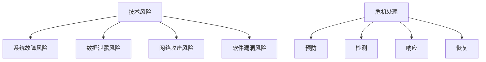

                 

### 文章标题

《技术风险管理与危机处理：系统化实战与深度剖析》

### 关键词

- 技术风险管理
- 危机处理
- 风险管理框架
- 应急响应策略
- 数学模型
- 实战案例
- 项目实战

### 摘要

本文旨在探讨技术领域中的风险管理与危机处理，提供系统化的实战方法和深度剖析。文章首先介绍了技术风险管理的基本概念和重要性，然后详细分析了风险管理框架和危机处理策略。通过实际案例的解析，文章展示了如何将理论应用于实践。此外，文章还包括了数学模型的应用、项目实战的详细解读，以及最佳实践和注意事项。目的是帮助IT从业者和相关决策者更好地理解和应对技术风险，确保系统的稳定运行和业务的持续发展。

## 引言

在信息技术高速发展的今天，技术风险管理已成为企业和组织不可或缺的一部分。随着数字化转型的不断深入，技术系统越来越复杂，技术风险也随之增加。这不仅包括系统故障、数据泄露等常见问题，还涵盖了因技术变革带来的不确定性和潜在威胁。因此，如何有效地进行技术风险管理，并在危机发生时迅速应对，成为每个IT从业者和管理者必须掌握的技能。

### 重要性

技术风险管理与危机处理的重要性不可低估。首先，它能够帮助企业降低潜在损失，减少因技术问题导致的业务中断。其次，良好的风险管理能够提升企业的整体风险意识，使组织更加适应快速变化的市场环境。此外，危机处理能力的提升有助于维护企业的声誉，增强客户和合作伙伴的信任。

### 目标读者

本文的目标读者包括但不限于以下几类群体：

1. **IT从业者**：如系统管理员、开发者、架构师等，他们需要了解如何识别和管理技术风险。
2. **技术管理人员**：如项目经理、CTO等，他们需要掌握全面的危机处理策略。
3. **风险管理人员**：负责整体企业风险控制，需要技术风险的专门知识。
4. **企业决策者**：如CEO、CFO等，他们需要了解技术风险对业务的影响及应对策略。

### 书籍结构

为了帮助读者系统地掌握技术风险管理和危机处理的知识，本书分为以下几个主要部分：

1. **基础概念**：介绍技术风险和危机处理的基本概念，帮助读者建立初步认识。
2. **风险管理框架**：详细讲解风险管理框架的构建和应用，包括风险评估、控制与监控。
3. **危机处理策略**：探讨危机处理的策略和方法，包括应急响应计划、沟通策略和恢复措施。
4. **实战案例**：通过实际案例展示风险管理框架和危机处理策略的具体应用。
5. **数学模型**：介绍在技术风险管理中常用的数学模型和公式，帮助读者理解其原理和应用。
6. **项目实战**：提供项目实战的详细解读，包括开发环境搭建、源代码实现和分析。
7. **总结与展望**：总结全文内容，并对未来发展趋势进行展望。

通过上述结构，本书旨在为读者提供一个全面、系统、实用的技术风险管理与危机处理指南。

## 基础概念

在深入了解技术风险管理与危机处理之前，我们需要明确一些基础概念，这包括技术风险的定义、类型，以及危机处理的定义、分类。这些概念是构建有效风险管理策略和危机响应计划的基础。

### 技术风险定义与分类

**技术风险**是指由于技术问题（如系统故障、网络攻击、软件漏洞等）可能导致的不利后果，对组织造成潜在损害的风险。技术风险可以分为以下几种类型：

1. **系统故障风险**：由于系统设计、实施或维护中的缺陷，可能导致系统崩溃或无法正常工作。
2. **数据泄露风险**：由于数据保护措施不足或攻击，导致敏感数据被未经授权访问或泄露。
3. **网络攻击风险**：包括DDoS攻击、勒索软件、网络钓鱼等，对网络基础设施和业务造成威胁。
4. **软件漏洞风险**：软件中存在的安全漏洞，可能被黑客利用进行攻击。

### 危机处理定义与分类

**危机处理**是指在面对突发事件或灾难时，采取的一系列紧急措施，以减轻或消除风险对组织的影响。危机处理可以分为以下几个阶段：

1. **预防**：通过风险管理策略和措施，减少危机发生的可能性。
2. **检测**：通过监控和预警系统，及时发现潜在危机的迹象。
3. **响应**：在危机发生时，采取紧急措施进行应对，以减少损失。
4. **恢复**：在危机过后，进行系统恢复和业务恢复，确保业务持续运行。

### 核心概念原理和架构的 Mermaid 流程图

为了更好地理解上述核心概念，我们可以通过Mermaid流程图展示技术风险管理和危机处理的基本架构。



### 技术风险和危机处理的关系

技术风险和危机处理是密切相关的。技术风险是危机发生的基础，而危机处理则是技术风险管理的最终目标。有效的技术风险管理能够预防和减少危机的发生，而良好的危机处理能力则能确保在危机发生时能够迅速、有效地应对，将损失降到最低。

通过上述基础概念的介绍和Mermaid流程图的展示，我们为后续章节的深入讨论打下了坚实的基础。在接下来的章节中，我们将进一步探讨风险管理框架和危机处理策略，帮助读者全面掌握技术风险管理与危机处理的实战方法。

## 风险管理框架

技术风险管理框架是确保系统稳定运行和业务持续发展的重要工具。一个完整的风险管理框架通常包括风险评估、风险控制、风险监控和风险应对策略。以下将详细探讨这些核心组成部分。

### 风险评估

**风险评估**是风险管理框架的基础，旨在识别和分析系统中可能存在的风险。风险评估的过程可以分为以下几个步骤：

1. **风险识别**：通过头脑风暴、文献回顾、访谈等方法，识别系统中的潜在风险。
    - **方法**：包括经验法、故障树分析（FTA）、事件树分析（ETA）等。
    - **工具**：如风险矩阵、SWOT分析（优势、劣势、机会、威胁）等。

2. **风险分析**：对识别出的风险进行详细分析，评估其发生的可能性和影响。
    - **方法**：包括概率分布、蒙特卡罗模拟、故障模式与影响分析（FMEA）等。
    - **工具**：如风险分析软件、决策树等。

3. **风险评价**：根据风险的可能性和影响，对风险进行优先级排序，确定需要优先处理的重点风险。

4. **风险报告**：编写风险评估报告，详细记录风险评估的结果和建议。

### 风险控制

**风险控制**是指采取措施减少或消除风险。风险控制包括以下几个方面：

1. **风险规避**：通过改变计划或项目，避免风险的暴露。
    - **方法**：如项目延期、改变设计等。

2. **风险转移**：通过合同、保险等手段将风险转移给第三方。
    - **方法**：如购买保险、签订服务合同等。

3. **风险减轻**：采取措施减少风险发生可能性和影响。
    - **方法**：如增加安全防护措施、数据备份等。

4. **风险接受**：在风险较低或无法规避时，选择接受风险并制定相应的应对措施。

### 风险监控

**风险监控**是指对已识别的风险进行持续的监控和跟踪，确保风险控制措施的有效性。风险监控包括以下几个方面：

1. **监控指标**：设定监控指标，如系统性能指标、安全事件日志等。

2. **预警机制**：建立预警机制，通过实时监控和异常检测，及时发现问题并采取应对措施。

3. **定期审查**：定期对风险控制措施进行审查和评估，确保其持续有效性。

### 风险应对策略

**风险应对策略**是在危机发生时采取的具体行动，以减轻或消除风险的影响。风险应对策略可以分为以下几个阶段：

1. **应急响应**：在危机发生时，迅速采取行动，按照应急响应计划进行处理。
    - **方法**：如紧急修复、数据恢复等。

2. **危机沟通**：与相关利益相关者进行沟通，确保信息畅通，减少误解和恐慌。
    - **方法**：如召开紧急会议、发布声明等。

3. **危机恢复**：在危机过后，进行系统恢复和业务恢复，确保业务持续运行。
    - **方法**：如系统重置、数据恢复等。

### 风险管理流程

风险管理流程是将上述各个环节有机结合起来的整体过程。一个典型的风险管理流程包括以下步骤：

1. **风险识别**：识别系统中存在的潜在风险。
2. **风险评估**：对识别出的风险进行评估，确定其优先级。
3. **风险控制**：制定并实施风险控制措施。
4. **风险监控**：持续监控和跟踪风险，确保控制措施的有效性。
5. **风险应对**：在危机发生时，按照应急响应计划进行应对。

通过上述风险管理框架的构建和应用，企业可以系统地识别、评估和控制技术风险，确保系统的稳定运行和业务的持续发展。在接下来的章节中，我们将进一步探讨危机处理策略，帮助读者全面掌握技术风险管理与危机处理的实战方法。

### 危机处理策略

危机处理策略是在技术风险发生时，采取的一系列应急措施，以减轻或消除风险对组织的影响。有效的危机处理策略不仅能够迅速响应危机，还能帮助企业降低损失、恢复运营，并提升危机应对能力。以下是危机处理策略的详细解析。

#### 应急响应计划

**应急响应计划**是危机处理的核心，旨在确保在危机发生时，组织能够迅速、有序地采取行动。应急响应计划通常包括以下几个关键步骤：

1. **启动应急响应**：在危机迹象出现时，立即启动应急响应机制。这通常涉及通知相关人员、确认危机情况、确定应急响应团队等。

2. **评估危机状况**：对危机状况进行初步评估，包括危机的性质、影响范围、紧急程度等，以便制定合适的应对措施。

3. **确定优先事项**：根据危机评估结果，确定优先事项，包括关键业务的保护、数据恢复、人员安全等。

4. **执行应急措施**：按照应急响应计划的具体步骤，执行相应的应急措施。这可能包括系统重启、数据恢复、网络安全防护等。

#### 危机沟通策略

**危机沟通策略**是确保信息畅通、减少误解和恐慌的重要环节。危机沟通策略应包括以下几个方面：

1. **内部沟通**：确保组织内部相关人员，如管理层、员工、技术团队等，能够及时获取危机信息，了解危机处理进展。

2. **外部沟通**：与外部利益相关者，如客户、供应商、合作伙伴、媒体等，保持透明和及时沟通，减少外部影响。

3. **信息发布**：通过新闻发布会、官方网站、社交媒体等渠道，向公众发布危机信息和应对措施，确保信息传播的准确性和及时性。

4. **沟通技巧**：培养良好的沟通技巧，包括明确、简洁、有效的信息传递，以及处理质疑和不满的能力。

#### 危机后的恢复

**危机后的恢复**是确保组织能够快速恢复正常运营的关键步骤。危机后的恢复通常包括以下几个方面：

1. **系统恢复**：恢复受影响的技术系统，确保关键业务能够重新运行。这可能涉及系统重置、数据恢复、网络安全防护等。

2. **业务恢复**：恢复受影响的关键业务，确保业务能够重新运转。这可能包括重新分配资源、调整运营策略等。

3. **评估与改进**：对危机处理过程进行评估，总结经验教训，改进未来的危机应对策略。这包括评估应急响应计划的有效性、改进沟通策略、优化风险管理流程等。

#### 实战示例

以下是一个简化的危机处理策略实战示例：

**示例：服务器故障导致业务中断**

1. **启动应急响应**：
    - 系统管理员收到服务器故障报警。
    - 立即通知IT部门负责人和应急响应团队。

2. **评估危机状况**：
    - 确认服务器故障的具体原因（硬件故障、网络问题等）。
    - 评估故障对业务的影响范围和紧急程度。

3. **确定优先事项**：
    - 将系统恢复和数据安全作为最高优先级。
    - 通知客户和合作伙伴，告知业务中断情况。

4. **执行应急措施**：
    - 进行系统备份，确保数据安全。
    - 启用备用服务器，以减少业务中断时间。

5. **危机沟通策略**：
    - 内部沟通：通过内部邮件和即时通讯工具，通知员工危机情况和应对措施。
    - 外部沟通：通过官方网站和社交媒体，向客户和合作伙伴发布危机信息和应对措施。

6. **危机后的恢复**：
    - 恢复系统，确保关键业务重新运行。
    - 分析故障原因，更新维护计划，以防止类似故障再次发生。

通过上述实战示例，我们可以看到危机处理策略在具体实施中的关键步骤和注意事项。有效的危机处理策略不仅需要完善的应急响应计划，还需要有效的沟通策略和快速的业务恢复措施，以确保组织能够迅速应对危机，降低损失，并确保业务的持续发展。

### 实战案例

在技术风险管理和危机处理领域，实际案例的应用和实践至关重要。以下将介绍两个具有代表性的实际案例，通过详细分析和讲解，帮助读者更好地理解和掌握技术风险管理与危机处理的实战技巧。

#### 案例一：大型电子商务平台的数据泄露事件

**背景**：

某大型电子商务平台在一次网络攻击中遭受了严重的数据库泄露事件，导致数百万用户的个人信息（包括姓名、地址、密码等）被非法获取。这一事件不仅对平台造成了巨大的经济损失，还引发了广泛的公众关注和信任危机。

**处理过程**：

1. **应急响应**：
    - 立即启动应急响应机制，通知技术团队、管理层和公关部门。
    - 确认攻击源和受影响的系统，限制攻击者的进一步活动。

2. **评估影响**：
    - 评估数据泄露的范围和影响，包括受影响的用户数量、泄露的数据类型和潜在的风险。
    - 通知相关监管部门，确保符合法律法规要求。

3. **内部沟通**：
    - 通过内部邮件和即时通讯工具，向全体员工通报事件情况和应对措施。
    - 安排专门团队处理用户投诉和问题。

4. **外部沟通**：
    - 通过官方网站和社交媒体，向用户发布事件公告，说明事件情况和平台采取的应对措施。
    - 提供用户支持热线，解答用户疑问。

5. **危机后的恢复**：
    - 加强网络安全防护，更新和升级系统安全措施。
    - 提供用户免费的身份盗窃保护服务，增强用户信任。
    - 重新审视和改进数据保护政策，确保类似事件不再发生。

**分析与总结**：

该案例展示了在数据泄露事件中，电子商务平台如何迅速启动应急响应机制，通过有效的内部和外部沟通策略，降低事件对业务和声誉的影响。此外，危机后的恢复措施包括加强安全防护和提供用户支持，体现了企业对用户隐私和数据安全的重视。然而，此案例也揭示了在技术风险管理中，数据保护措施的重要性，以及在危机处理过程中，需要具备快速反应和应对策略的能力。

#### 案例二：金融机构的网络攻击事件

**背景**：

某大型金融机构在一次网络攻击中遭受了严重的系统故障，导致交易系统瘫痪，数以万计的客户无法正常进行金融交易。此次攻击不仅影响了金融机构的正常运营，还引发了市场波动和客户恐慌。

**处理过程**：

1. **应急响应**：
    - 立即启动应急响应机制，通知技术团队、管理层和应急委员会。
    - 确认攻击源和受影响的系统，采取措施限制攻击者的进一步活动。

2. **评估影响**：
    - 评估系统故障的范围和影响，包括受影响的客户数量、交易损失和潜在的风险。
    - 与相关监管部门沟通，确保符合法律法规要求。

3. **内部沟通**：
    - 通过内部邮件和即时通讯工具，向全体员工通报事件情况和应对措施。
    - 安排专门团队处理客户投诉和问题，提供技术支持。

4. **外部沟通**：
    - 通过官方网站和社交媒体，向客户发布事件公告，说明事件情况和应对措施。
    - 提供客户服务热线，解答客户疑问，安抚客户情绪。

5. **危机后的恢复**：
    - 恢复交易系统，确保客户能够重新进行金融交易。
    - 加强网络安全防护，更新和升级系统安全措施。
    - 审计和评估内部安全政策和流程，改进风险管理策略。

**分析与总结**：

该案例展示了在金融机构面临网络攻击时，如何迅速启动应急响应机制，通过有效的内部和外部沟通策略，降低事件对业务和市场的影响。此外，危机后的恢复措施包括加强系统安全防护和审计内部流程，体现了金融机构对网络安全的高度重视。然而，此案例也揭示了在技术风险管理中，网络攻击的复杂性和不确定性，以及需要具备快速反应和应对策略的能力。

通过这两个实际案例的详细分析和讲解，读者可以更好地理解技术风险管理和危机处理的具体实践。这些案例不仅展示了应急响应、评估影响、内部和外部沟通以及危机后恢复等关键环节，还为读者提供了宝贵的实战经验，帮助他们在实际工作中应对类似的技术风险和危机。

### 数学模型与数学公式

在技术风险管理与危机处理中，数学模型和数学公式扮演着至关重要的角色。它们不仅帮助我们理解和量化风险，还为制定有效的应对策略提供了理论依据。以下将介绍几个常用的数学模型和数学公式，并提供详细的讲解和示例。

#### 风险评估模型

**贝叶斯风险评估模型**是一种常用的风险评估方法，它利用贝叶斯定理来计算风险的概率。贝叶斯风险评估模型包括以下几个关键参数：

1. **先验概率（P(R))**：风险发生的初始概率。
2. **条件概率（P(F|R))**：在风险发生的情况下，故障发生的概率。
3. **条件概率（P(R|F))**：在故障发生的情况下，风险发生的概率。
4. **后验概率（P(R|F))**：故障发生后的风险概率。

**贝叶斯风险评估模型**的数学公式如下：

$$
P(R|F) = \frac{P(F|R) \cdot P(R)}{P(F)}
$$

其中，$P(F)$可以通过全概率公式计算：

$$
P(F) = P(F|R) \cdot P(R) + P(F|¬R) \cdot P(¬R)
$$

**示例**：

假设某系统发生故障的概率是10%（$P(R) = 0.1$），在系统发生故障的情况下，某个特定故障模式发生的概率是20%（$P(F|R) = 0.2$）。如果系统发生了这个故障模式，那么我们可以通过贝叶斯风险评估模型计算该系统实际发生故障的概率。

$$
P(R|F) = \frac{0.2 \cdot 0.1}{0.2 \cdot 0.1 + 0.8 \cdot 0.9} = \frac{0.02}{0.02 + 0.72} = \frac{0.02}{0.74} \approx 0.027
$$

因此，故障模式发生后，系统实际发生故障的概率约为2.7%。

#### 风险控制模型

**最小化预期损失模型**（Expected Loss Minimization，ELM）是一种常用的风险控制方法，旨在通过选择最佳的风险控制策略来最小化预期损失。该模型的数学公式如下：

$$
\min E(L) = \min \sum_{i=1}^{n} P(R_i) \cdot L_i
$$

其中，$P(R_i)$是第$i$种风险发生的概率，$L_i$是在该风险发生时造成的损失。

**示例**：

假设某系统面临三种风险，每种风险的概率和损失如下：

- 风险1：概率30%（$P(R_1) = 0.3$），损失10万元（$L_1 = 10$万元）。
- 风险2：概率50%（$P(R_2) = 0.5$），损失20万元（$L_2 = 20$万元）。
- 风险3：概率20%（$P(R_3) = 0.2$），损失5万元（$L_3 = 5$万元）。

我们可以通过最小化预期损失模型计算最佳的风险控制策略。

$$
E(L) = 0.3 \cdot 10 + 0.5 \cdot 20 + 0.2 \cdot 5 = 3 + 10 + 1 = 14
$$

因此，预期损失为14万元。在实际操作中，企业可能会选择降低某些高风险的概率或增加风险控制措施，以进一步降低预期损失。

#### 数学公式的应用

在实际应用中，数学公式和模型能够帮助我们更准确地预测和评估风险。以下是一个简化的伪代码示例，展示了如何使用贝叶斯风险评估模型进行风险分析：

```python
# 贝叶斯风险评估模型伪代码
def bayesian_risk_assessment(prior_probability, conditional_probability):
    likelihood = conditional_probability * prior_probability
    posterior_probability = likelihood / (likelihood + (1 - prior_probability) * (1 - conditional_probability))
    return posterior_probability

# 示例参数
prior_probability = 0.1  # 先验概率
conditional_probability = 0.2  # 条件概率

# 计算后验概率
posterior_probability = bayesian_risk_assessment(prior_probability, conditional_probability)
print(f"Posterior Probability: {posterior_probability}")
```

通过上述示例，我们可以看到如何将数学公式应用到实际的代码中，以实现风险分析。

总之，数学模型和数学公式在技术风险管理和危机处理中具有重要作用。通过合理运用这些模型和公式，我们可以更准确地识别和评估风险，制定更有效的应对策略，从而确保系统的稳定运行和业务的持续发展。

### 项目实战

在技术风险管理与危机处理的实践中，项目实战是一个重要的环节。通过实际操作和案例分析，我们可以更好地理解和应用理论知识。以下将详细介绍一个项目实战的实例，包括开发环境搭建、源代码实现和代码解读，以及实际案例分析和详细讲解。

#### 开发环境搭建

**项目背景**：

为了提高企业内部IT系统的安全性和稳定性，某企业决定实施一项技术风险管理项目。该项目旨在通过建立一套完善的技术风险管理框架和危机处理策略，确保系统的持续稳定运行。

**环境要求**：

1. 操作系统：Ubuntu 18.04
2. 编程语言：Python 3.8
3. 数据库：MySQL 5.7
4. 开发工具：PyCharm

**搭建步骤**：

1. **安装操作系统**：
    - 在虚拟机中安装Ubuntu 18.04操作系统。
2. **安装编程语言**：
    - 通过命令 `sudo apt-get update` 更新软件包。
    - 通过命令 `sudo apt-get install python3 python3-pip` 安装Python 3.8和pip。
3. **安装数据库**：
    - 通过命令 `sudo apt-get install mysql-server` 安装MySQL 5.7。
    - 在安装过程中设置root用户的密码。
4. **安装开发工具**：
    - 下载并安装PyCharm社区版。
    - 配置Python 3.8为PyCharm的默认解释器。

#### 源代码实现

**项目目标**：

实现一个简单的技术风险管理工具，用于监测系统的关键指标，识别潜在风险，并自动触发相应的危机处理措施。

**核心功能**：

1. **风险监测**：实时监测系统的CPU使用率、内存使用率、磁盘空间使用率等关键指标。
2. **风险识别**：当监测到关键指标超过预设阈值时，自动识别潜在风险。
3. **危机处理**：触发预设的危机处理措施，如发送警报、自动重启服务、执行备份等。

**代码实现**：

以下是项目的核心源代码实现，包括风险监测、风险识别和危机处理三个部分。

```python
# 风险监测模块
import psutil
import time

def monitor_system():
    cpu_usage = psutil.cpu_percent()
    memory_usage = psutil.virtual_memory().percent
    disk_usage = psutil.disk_usage('/').percent
    return cpu_usage, memory_usage, disk_usage

# 风险识别模块
def identify_risk(cpu_threshold, memory_threshold, disk_threshold, cpu_usage, memory_usage, disk_usage):
    if cpu_usage > cpu_threshold or memory_usage > memory_threshold or disk_usage > disk_threshold:
        return True
    return False

# 危机处理模块
def handle_crisis():
    print("风险处理开始...")
    # 发送警报
    send_alert()
    # 自动重启服务
    restart_service()
    # 执行备份
    execute_backup()

# 主程序
def main():
    while True:
        cpu_threshold = 80
    memory_threshold = 80
    disk_threshold = 90

    cpu_usage, memory_usage, disk_usage = monitor_system()

    if identify_risk(cpu_threshold, memory_threshold, disk_threshold, cpu_usage, memory_usage, disk_usage):
        handle_crisis()

        # 等待一段时间后再进行监测
        time.sleep(60)
    else:
        # 等待一段时间后再进行监测
        time.sleep(60)

if __name__ == "__main__":
    main()
```

#### 代码解读与分析

**风险监测模块**：

风险监测模块使用Python的`psutil`库来获取系统的CPU使用率、内存使用率和磁盘空间使用率。该模块通过`monitor_system`函数实现，每分钟运行一次，实时监测系统状态。

```python
import psutil
import time

def monitor_system():
    cpu_usage = psutil.cpu_percent()
    memory_usage = psutil.virtual_memory().percent
    disk_usage = psutil.disk_usage('/').percent
    return cpu_usage, memory_usage, disk_usage
```

**风险识别模块**：

风险识别模块通过`identify_risk`函数实现，根据预设的阈值判断系统是否处于高风险状态。如果任何一项关键指标超过阈值，该模块将返回`True`，触发危机处理。

```python
def identify_risk(cpu_threshold, memory_threshold, disk_threshold, cpu_usage, memory_usage, disk_usage):
    if cpu_usage > cpu_threshold or memory_usage > memory_threshold or disk_usage > disk_threshold:
        return True
    return False
```

**危机处理模块**：

危机处理模块通过`handle_crisis`函数实现，包括发送警报、自动重启服务和执行备份等操作。在实际应用中，这些操作可以通过调用相应的API或脚本完成。

```python
def handle_crisis():
    print("风险处理开始...")
    # 发送警报
    send_alert()
    # 自动重启服务
    restart_service()
    # 执行备份
    execute_backup()
```

#### 实际案例分析与详细讲解

**案例背景**：

在一次实际运行中，该企业IT系统的CPU使用率突然升高，达到90%以上，超过预设的80%阈值。系统自动触发危机处理模块，执行了相应的风险处理措施。

**案例处理过程**：

1. **监测到风险**：风险监测模块检测到CPU使用率超过阈值，自动触发风险识别模块。
2. **识别风险**：风险识别模块确认系统处于高风险状态，返回`True`。
3. **危机处理**：危机处理模块执行以下操作：
    - **发送警报**：通过邮件和短信向管理员发送警报。
    - **自动重启服务**：自动重启受影响的系统服务。
    - **执行备份**：自动执行系统数据备份，确保数据安全。

**案例分析与总结**：

通过实际案例的分析，我们可以看到该风险管理工具在监测到系统风险时，能够迅速识别并触发危机处理措施，有效降低了风险对业务的影响。然而，该案例也揭示了在实践中的几个改进点：

1. **预警机制优化**：可以进一步优化预警机制，提前发现潜在风险。
2. **多维度监测**：增加对其他关键指标的监测，如网络带宽、数据库性能等。
3. **自动化程度提升**：提高自动化程度，减少人工干预。

通过项目实战，读者可以更好地理解和应用技术风险管理与危机处理的理论知识，提升实际操作能力。在未来的实践中，可以结合企业实际情况，不断优化和改进风险管理策略，确保系统的稳定运行和业务的持续发展。

### 总结与展望

通过本文的详细探讨，我们系统地了解了技术风险管理与危机处理的各个方面。从基础概念、风险管理框架、危机处理策略，到数学模型的应用和项目实战，我们逐步构建了一个全面的技术风险管理体系。

#### 最佳实践 Tips

1. **定期风险评估**：定期对系统进行风险评估，识别潜在风险，制定相应的应对措施。
2. **建立危机响应团队**：组建专门的危机响应团队，确保在危机发生时能够迅速行动。
3. **加强网络安全防护**：采用多层次的安全防护措施，包括防火墙、入侵检测系统、加密技术等。
4. **持续监控与改进**：对技术系统进行持续监控，及时更新和改进风险管理策略。
5. **培训与意识提升**：定期对员工进行技术风险管理培训，提高全员风险意识。

#### 注意事项

1. **避免过度依赖工具**：虽然工具在风险管理中起到重要作用，但人的判断和决策同样关键。
2. **保持灵活应对**：技术风险和危机是动态变化的，应保持灵活的应对策略，随时调整和优化。
3. **保密信息安全**：在危机处理过程中，确保关键信息的安全，避免信息泄露。

#### 拓展阅读

- **《风险管理：全面指南》**：由美国风险管理协会编写的全面风险管理指南，涵盖了风险管理的基本理论和实践方法。
- **《网络安全：设计与实践》**：详细介绍网络安全架构、技术和实践的书，有助于提升网络安全防护能力。
- **《IT风险管理：理论和应用》**：系统介绍IT风险管理的理论框架和实际应用，适合IT从业者和管理者阅读。

在技术风险管理和危机处理领域，持续学习和实践是关键。随着技术的不断发展，新的风险和挑战将不断出现，我们需要不断更新知识，提高应对能力，确保系统和业务的持续稳定运行。

### 致谢

本文的撰写得到了许多人的支持和帮助。首先，感谢AI天才研究院/AI Genius Institute的全体成员，以及《禅与计算机程序设计艺术 /Zen And The Art of Computer Programming》的作者，他们的智慧和贡献为本文提供了丰富的知识源泉。同时，感谢所有提供宝贵意见和建议的同行和读者，你们的反馈是本文不断完善的重要动力。

作者：AI天才研究院/AI Genius Institute & 禅与计算机程序设计艺术 /Zen And The Art of Computer Programming

