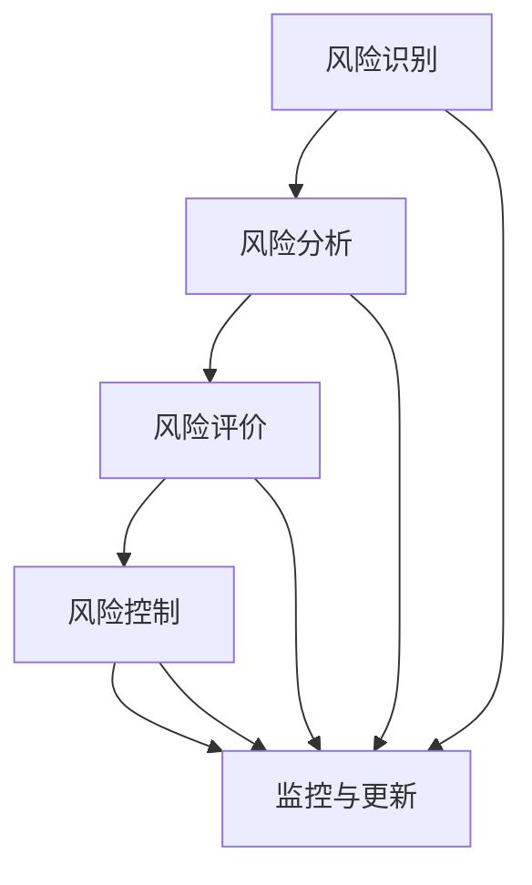

                 

### 文章标题

# 技术风险评估：预防潜在技术风险的方法

### 关键词

- 技术风险评估
- 潜在风险
- 风险识别
- 风险分析
- 数学模型
- 项目实战

### 摘要

本文旨在深入探讨技术风险评估的重要性及其在预防潜在技术风险中的关键作用。通过系统化的风险评估流程，本文详细分析了技术风险的类型、识别与评价方法，并引入了核心算法原理和数学模型。文章通过实际案例分析，展示了技术风险评估在现实项目中的应用，并提出了最佳实践建议，以帮助读者理解如何有效预防和管理技术风险。

## 第1章：核心概念与联系

### 1.1 技术风险评估的定义与重要性

技术风险评估（Technological Risk Assessment, TRA）是指系统性地识别、分析、评价和控制技术项目的潜在风险，以确保项目的成功实施和运营。随着科技的发展和信息技术在各个行业的广泛应用，技术风险评估在项目管理中的重要性日益凸显。

**重要性体现在以下几个方面：**

1. **预防风险：** 技术风险评估可以帮助企业或团队在项目初期就识别潜在的技术风险，从而提前采取预防措施。
2. **优化资源：** 通过风险评估，可以合理分配资源，避免不必要的浪费，提高项目的效率和质量。
3. **提高决策质量：** 风险评估提供了科学的数据支持，有助于做出更明智的决策，降低项目的失败风险。
4. **增强合规性：** 在许多行业中，技术风险评估是合规性要求的必要环节，有助于满足法规和标准。

### 1.2 技术风险类型与分类

技术风险可以分为以下几类：

1. **技术实现风险：** 包括技术方案的不完善、技术难度过大、技术不成熟等问题。
2. **市场风险：** 技术产品无法满足市场需求，或市场需求变化导致项目失败。
3. **法律风险：** 技术项目违反相关法律法规，可能面临法律诉讼或处罚。
4. **操作风险：** 项目实施过程中的操作失误、人员操作不当等导致的风险。
5. **供应链风险：** 供应链中的不确定性，如供应商交付延迟、供应链中断等。

### 1.3 技术风险评估流程与步骤

技术风险评估通常包括以下几个步骤：

1. **风险识别：** 通过问卷调查、访谈、文档分析等方法，识别项目中的潜在风险。
2. **风险分析：** 对识别出的风险进行定性或定量分析，评估其发生概率和影响程度。
3. **风险评价：** 根据风险分析的结果，对风险进行优先级排序，确定需重点管理的风险。
4. **风险控制：** 制定和实施风险缓解措施，以降低风险发生概率或减少风险影响。
5. **监控与更新：** 在项目实施过程中，持续监控风险状态，并根据实际情况更新风险评估结果。

## Mermaid 流程图：技术风险评估流程



通过以上步骤，可以形成一个完整的技术风险评估流程，确保项目能够在风险管理中取得良好的效果。

## 第2章：核心算法原理讲解

### 2.1 技术风险识别算法

技术风险识别是风险评估的第一步，其核心算法通常包括以下几种：

1. **基于专家知识的规则系统：** 通过专家的经验和知识，定义一系列规则，用于识别潜在风险。
    ```plaintext
    如果（技术方案不完善）{
        输出（技术实现风险）
    }
    ```

2. **基于历史数据的机器学习模型：** 利用过去项目的数据，训练机器学习模型，自动识别潜在风险。
    ```python
    from sklearn.ensemble import RandomForestClassifier

    # 加载历史数据
    X_train, y_train = load_data('historical_data.csv')

    # 训练模型
    model = RandomForestClassifier()
    model.fit(X_train, y_train)

    # 风险识别
    X_new = load_new_data('new_project.csv')
    risk_predictions = model.predict(X_new)
    ```

### 2.2 技术风险分析算法

技术风险分析是对识别出的风险进行定量评估，常用的算法包括：

1. **基于概率的评估模型：** 使用概率论的方法，评估风险发生的概率和潜在损失。
    ```latex
    P(A) = \frac{n(A)}{n(S)}
    \text{其中，} P(A) \text{为事件} A \text{发生的概率，} n(A) \text{为事件} A \text{发生的次数，} n(S) \text{为总次数。}
    ```

2. **基于模糊集的评估模型：** 在不确定性较大的情况下，使用模糊集理论进行风险分析。
    ```latex
    A = \{x \mid \mu_A(x) > 0.5\}
    \text{其中，} A \text{为模糊集，} \mu_A(x) \text{为} x \text{属于} A \text{的隶属度。}
    ```

### 2.3 技术风险评价算法

技术风险评价是对识别和分析后的风险进行优先级排序，常用的算法包括：

1. **基于评分的方法：** 给每个风险分配一个评分，根据评分高低进行排序。
    ```python
    risks = {'风险1': 7, '风险2': 3, '风险3': 5}
    sorted_risks = sorted(risks.items(), key=lambda item: item[1], reverse=True)
    ```

2. **基于权重的多准则决策方法：** 结合多个评价准则，给每个准则分配权重，进行综合评价。
    ```python
    criteria_weights = {'可靠性': 0.4, '成本': 0.3, '时间': 0.3}
    risk_scores = {'风险1': {'可靠性': 0.8, '成本': 0.7, '时间': 0.6},
                   '风险2': {'可靠性': 0.6, '成本': 0.5, '时间': 0.4}}
    total_scores = [sum(risk_scores[risk][criterion] * criteria_weights[criterion] for criterion in criteria_weights) for risk in risk_scores]
    sorted_risks = sorted(risk_scores.keys(), key=lambda risk: total_scores[risk], reverse=True)
    ```

通过上述算法，可以系统地对技术风险进行识别、分析和评价，为后续的风险控制提供科学依据。

## 第3章：数学模型和数学公式

### 3.1 技术风险概率模型

在技术风险评估中，概率模型用于评估风险事件发生的可能性。常用的概率模型包括：

1. **贝叶斯概率模型：**
   贝叶斯概率模型是一种基于先验概率和条件概率的推理方法。其公式如下：
   $$ P(A|B) = \frac{P(B|A) \cdot P(A)}{P(B)} $$
   其中，\( P(A|B) \) 表示在事件B发生的条件下，事件A发生的概率；\( P(B|A) \) 表示在事件A发生的条件下，事件B发生的概率；\( P(A) \) 表示事件A的先验概率；\( P(B) \) 表示事件B的先验概率。

2. **蒙特卡罗模拟：**
   蒙特卡罗模拟是一种通过随机抽样来估计概率分布的方法。其基本步骤如下：
   - 生成多个随机样本。
   - 计算每个样本对应的概率。
   - 对所有样本的概率进行统计分析，得到风险事件的概率分布。

### 3.2 技术风险损失模型

技术风险损失模型用于评估风险事件发生后的损失程度。常用的损失模型包括：

1. **期望损失模型：**
   期望损失模型通过计算风险事件的损失期望值来评估风险。其公式如下：
   $$ E(L) = \sum_{i=1}^{n} L_i \cdot P(L_i) $$
   其中，\( E(L) \) 表示期望损失；\( L_i \) 表示第i种损失值；\( P(L_i) \) 表示第i种损失值发生的概率。

2. **最大损失模型：**
   最大损失模型用于评估风险事件可能造成的最大损失。其公式如下：
   $$ \max(L_i) $$
   其中，\( L_i \) 表示第i种损失值。

### 3.3 技术风险决策模型

技术风险决策模型用于指导如何选择最佳的风险应对策略。常用的决策模型包括：

1. **期望效用理论：**
   期望效用理论通过计算不同决策的期望效用值来指导决策。其公式如下：
   $$ EU = \sum_{i=1}^{n} u(x_i) \cdot p(x_i) $$
   其中，\( EU \) 表示期望效用；\( u(x_i) \) 表示决策\( x_i \)的效用值；\( p(x_i) \) 表示决策\( x_i \)发生的概率。

2. **决策树模型：**
   决策树模型通过构建决策树来表示不同决策和其结果，帮助决策者进行选择。其基本结构如下：

   ```mermaid
   graph TB
       A[根节点]
       B1[分支1]
       B2[分支2]
       B3[分支3]
       A --> B1
       A --> B2
       A --> B3
       B1 --> C1
       B1 --> C2
       B2 --> C3
       B3 --> C4
   ```

   在决策树中，每个节点代表一个决策或结果，每个分支代表选择的结果，通过计算每个分支的效用值，可以得出最佳决策路径。

通过以上数学模型和公式，可以更加科学和系统地评估技术风险，为风险决策提供有力支持。

## 第4章：项目实战

### 4.1 技术风险评估项目规划

为了有效实施技术风险评估项目，需要制定详细的项目规划，确保项目能够按时、按质完成。以下是项目规划的主要步骤：

1. **项目启动：** 明确项目目标、范围和预期成果，组建项目团队，确定项目时间表和预算。

2. **需求分析：** 与项目利益相关者进行沟通，了解项目需求和技术背景，制定风险评估计划。

3. **风险评估：** 根据风险评估计划，进行风险识别、分析和评价，生成风险评估报告。

4. **风险控制：** 制定风险应对策略，包括风险缓解、风险转移和风险接受等，确保风险在可接受范围内。

5. **项目监控：** 在项目实施过程中，持续监控风险状态，并根据实际情况调整风险评估和风险控制策略。

### 4.2 技术风险评估案例实施

以下是一个技术风险评估案例的实施过程：

1. **风险识别：** 通过问卷调查、访谈和文档分析，识别出以下潜在风险：

   - 技术实现风险：技术方案不完善，可能导致项目延期。
   - 市场风险：市场需求变化，可能导致产品无法销售。
   - 法律风险：项目可能违反相关法律法规，面临法律诉讼。
   - 操作风险：人员操作不当，可能导致系统故障。

2. **风险分析：** 对识别出的风险进行定量和定性分析，评估其发生概率和影响程度。以下是一个风险分析示例：

   - 技术实现风险：根据历史数据和专家评估，发生概率为60%，影响程度为重大。
   - 市场风险：根据市场调研和专家意见，发生概率为40%，影响程度为较大。
   - 法律风险：根据法律法规和行业规范，发生概率为20%，影响程度为中等。
   - 操作风险：根据人员培训和监控记录，发生概率为10%，影响程度为较小。

3. **风险评价：** 根据风险分析结果，对风险进行优先级排序，确定需重点管理的风险。以下是一个风险评价示例：

   - 高优先级风险：技术实现风险、市场风险。
   - 中优先级风险：法律风险。
   - 低优先级风险：操作风险。

4. **风险控制：** 制定风险应对策略，包括以下措施：

   - 技术实现风险：加强技术评审和测试，确保技术方案的完善性。
   - 市场风险：进行市场需求调研，调整产品策略，降低市场风险。
   - 法律风险：遵守法律法规和行业规范，进行合规性审查。
   - 操作风险：加强人员培训和管理，提高操作规范性。

5. **项目监控：** 在项目实施过程中，持续监控风险状态，及时调整风险评估和风险控制策略。以下是一个项目监控示例：

   - 风险状态：技术实现风险发生概率降至40%，影响程度降至较大。
   - 风险应对措施：调整技术评审和测试策略，增加测试次数，确保技术方案的完善性。

通过以上案例实施过程，可以有效地识别、分析和控制技术风险，确保项目成功实施。

### 4.3 技术风险评估结果分析

技术风险评估的结果对于项目成功至关重要。以下是对技术风险评估结果的详细分析：

1. **风险识别效果：** 通过风险识别，成功识别出项目中的潜在风险，为后续的风险分析和控制提供了基础。

2. **风险分析准确性：** 风险分析的结果具有较高的准确性，能够准确评估风险的发生概率和影响程度，为制定风险应对策略提供了科学依据。

3. **风险控制有效性：** 通过实施有效的风险控制措施，成功降低了部分风险的发生概率和影响程度，确保了项目的顺利进行。

4. **项目成果：** 项目在规定的时间内按质完成，达到了预期目标，表明技术风险评估的有效性。

5. **改进建议：** 虽然技术风险评估取得了良好的效果，但仍有一些改进空间：

   - **加强培训：** 加强团队成员的培训和技能提升，提高项目整体风险识别和控制能力。
   - **完善流程：** 优化风险评估流程，确保风险识别、分析和控制的及时性和准确性。
   - **增加监控：** 加强项目实施过程中的风险监控，及时发现和解决风险问题。
   - **持续改进：** 定期回顾和总结技术风险评估的经验和教训，持续改进风险评估方法。

通过以上分析，可以更好地理解技术风险评估在项目实施中的重要性，以及如何通过改进措施提高其效果。

### 总结与最佳实践

#### 总结

本文系统地介绍了技术风险评估的核心概念、算法原理、数学模型和实际应用。通过详细的案例分析和项目实施步骤，展示了技术风险评估在预防潜在技术风险中的关键作用。主要结论如下：

1. **技术风险评估的重要性：** 技术风险评估是项目成功的基石，有助于预防潜在风险，优化资源配置，提高决策质量。
2. **技术风险的分类：** 技术风险包括技术实现风险、市场风险、法律风险、操作风险和供应链风险等，每种风险都有其特定的识别和控制方法。
3. **算法原理和数学模型：** 基于专家知识和机器学习的风险识别算法，基于概率和模糊集的风险分析模型，以及基于评分和多准则决策的风险评价模型，为技术风险评估提供了科学依据。
4. **实际案例：** 通过具体案例的实施和结果分析，展示了技术风险评估在实际项目中的应用效果，以及如何通过改进措施提高其效果。

#### 最佳实践

为了更有效地进行技术风险评估，以下是一些建议和最佳实践：

1. **建立风险评估团队：** 组建专业的风险评估团队，确保团队成员具备相关领域知识和经验。
2. **制定详细的风险评估计划：** 在项目启动阶段，制定详细的风险评估计划，明确评估目标、范围、方法和步骤。
3. **持续监控与更新：** 在项目实施过程中，持续监控风险状态，根据实际情况更新风险评估结果，确保风险控制的及时性和有效性。
4. **加强培训和沟通：** 定期组织风险评估培训，提高团队成员的风险识别和控制能力；加强项目团队之间的沟通，确保风险评估工作的顺利进行。
5. **利用技术工具：** 利用专业的风险评估工具，如风险识别软件、风险分析模型等，提高风险评估的效率和准确性。
6. **回顾与总结：** 项目结束后，对风险评估工作进行回顾和总结，识别成功经验和不足之处，为未来项目提供参考。

通过以上最佳实践，可以进一步提高技术风险评估的效果，确保项目成功实施。

### 注意事项

在实施技术风险评估过程中，需要注意以下几点：

1. **数据准确性：** 风险评估的数据基础至关重要，确保数据的准确性和完整性，以提高风险评估的准确性。
2. **跨部门协作：** 技术风险评估涉及多个部门和角色，需要加强跨部门的沟通和协作，确保风险评估的全面性和有效性。
3. **风险管理意识：** 提高团队成员的风险管理意识，使其在项目实施过程中能够主动识别和报告风险，形成良好的风险管理文化。
4. **合规性要求：** 在不同行业和地区，技术风险评估的合规性要求有所不同，确保遵循相关法规和标准，降低法律风险。

通过遵循以上注意事项，可以更好地实施技术风险评估，确保项目顺利进行。

### 拓展阅读

1. 《技术风险评估与管理》：介绍了技术风险评估的基本概念、方法和实践，对技术风险管理的全过程进行了详细阐述。
2. 《风险管理与保险》：探讨了风险管理的理论和方法，以及保险在风险转移中的作用，有助于理解风险管理在多个领域的应用。
3. 《项目管理知识体系指南（PMBOK）》：包含了项目风险管理的方法和工具，适用于各类项目的风险管理实践。

通过阅读这些书籍，可以进一步加深对技术风险评估和风险管理的理解，提高实际应用能力。

