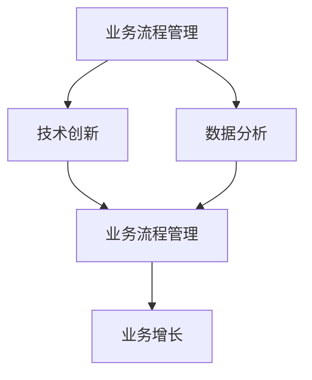

                 

### 文章标题

# 技术驱动业务增长的案例分析

> 关键词：技术驱动、业务增长、案例分析、技术创新、数据驱动、算法驱动

> 摘要：本文旨在通过具体案例分析，探讨技术如何驱动业务增长，分析技术创新、数据驱动和算法驱动三种模式，并探讨其实际应用效果及成功因素。本文将首先概述技术驱动业务增长的概念，随后深入探讨业务流程管理、技术创新、数据分析等核心概念，最后通过三个典型案例，详述技术驱动业务增长的具体实现过程及成效。

### 第1章：技术驱动业务增长的概述

在当今快速变化的市场环境中，技术已经成为推动业务增长的关键动力。本章节将首先定义技术驱动的概念，解释其内涵及其在企业发展中的作用，然后探讨业务增长的含义和驱动因素，最后分析技术与业务的联系。

#### 1.1 技术驱动业务增长的概念

##### 1.1.1 技术驱动的定义

技术驱动是指通过技术创新和应用，推动企业实现业务增长的过程。技术驱动的核心在于利用新兴技术和现有技术的创新应用，提升企业的运营效率、市场竞争力，从而实现业务的持续增长。

###### 1.1.1.1 技术进步的驱动因素

技术的进步主要由以下几方面驱动：

1. **市场需求**：用户需求的多样化和复杂化，推动了技术的不断创新和进步。
2. **政策支持**：政府的政策支持和投资，有助于加速技术研发和产业化。
3. **竞争压力**：激烈的市场竞争迫使企业不断进行技术升级，以保持竞争力。
4. **创新文化**：企业内部鼓励创新，支持员工进行技术研究和开发。

###### 1.1.1.2 技术在企业发展中的作用

技术对企业的贡献主要体现在以下几个方面：

1. **效率提升**：通过自动化和智能化，减少人力成本，提高生产效率。
2. **成本降低**：技术优化可以降低生产成本，提高企业的盈利能力。
3. **市场拓展**：技术进步可以开拓新的市场和业务领域，实现业务增长。
4. **创新能力**：技术创新是企业持续发展的动力，能够推动企业实现从量变到质变的飞跃。

##### 1.1.2 业务增长的含义

业务增长是指企业在一定时期内，通过市场拓展、业务创新等方式，实现营业收入、利润、市场份额等关键指标的持续提升。

###### 1.1.2.1 业务的定义

业务是指企业通过生产、销售、服务等活动，满足市场需求并获取利润的过程。业务范围可以涵盖生产制造、销售服务、技术研发等多个领域。

###### 1.1.2.2 业务的增长指标

业务增长的主要指标包括：

1. **营业收入**：企业在一定时期内通过销售产品或服务所获得的收入。
2. **利润**：企业在扣除成本后的盈利情况。
3. **市场份额**：企业在整个市场中所占的比例。
4. **客户满意度**：客户对企业产品或服务的满意度，直接影响企业的市场份额和长期发展。

##### 1.1.3 业务增长的驱动因素

业务增长主要受到以下几方面因素的驱动：

1. **市场需求的变化**：随着消费者需求的变化，企业需要不断调整产品和服务策略，以适应市场变化。
2. **竞争对手的影响**：竞争对手的市场策略、技术创新等，会直接或间接影响企业的业务发展。
3. **技术创新**：技术创新可以提升企业的生产效率和产品竞争力，从而推动业务增长。
4. **市场拓展**：通过开拓新的市场和业务领域，实现业务规模的扩大。

##### 1.1.4 技术与业务的联系

技术与业务的联系主要体现在以下几个方面：

1. **技术对业务的支持**：技术可以提升业务流程的效率，降低成本，提高产品和服务质量。
2. **业务对技术的需求**：业务发展的需求会推动技术的创新和应用，两者相互促进。

###### 1.1.4.1 技术在业务流程中的应用

技术可以在业务流程中发挥重要作用，例如：

1. **生产自动化**：通过自动化设备，提高生产效率，降低生产成本。
2. **供应链管理**：利用信息技术，实现供应链的实时监控和管理，提高供应链效率。
3. **客户关系管理**：通过大数据分析，了解客户需求，提供个性化服务，提高客户满意度。

###### 1.1.4.2 技术对业务效率的提升

技术对业务效率的提升主要体现在以下几个方面：

1. **数据处理能力**：利用大数据技术，快速处理和分析海量数据，为企业决策提供支持。
2. **协同办公**：通过互联网和云计算技术，实现跨地域的协同办公，提高工作效率。
3. **智能决策**：利用人工智能技术，实现智能化的业务决策，提高决策准确性。

###### 1.1.4.3 业务发展对技术的要求

业务发展对技术的要求主要体现在以下几个方面：

1. **技术创新**：业务发展需要技术创新的支持，以满足市场需求。
2. **技术升级**：随着业务的发展，需要不断进行技术升级，以适应新的业务需求。
3. **技术整合**：将多种技术进行整合，实现业务流程的优化和提升。

###### 1.1.4.4 技术创新对业务发展的推动作用

技术创新对业务发展的推动作用主要体现在以下几个方面：

1. **市场竞争力**：通过技术创新，提升企业的市场竞争力，实现业务的快速增长。
2. **业务模式创新**：技术创新可以推动业务模式的创新，实现业务的转型升级。
3. **业务规模扩张**：通过技术创新，开拓新的市场和业务领域，实现业务规模的扩张。

#### 1.2 技术驱动业务增长的模式

技术驱动业务增长主要有以下几种模式：

1. **创新驱动模式**：通过技术创新，推动业务增长。  
2. **数据驱动模式**：通过大数据分析，指导业务决策，实现业务增长。  
3. **算法驱动模式**：通过算法优化，提高业务流程的效率和准确性。

##### 1.2.1 创新驱动模式

创新驱动模式是指通过技术创新，推动业务增长。技术创新可以体现在产品创新、服务创新、业务模式创新等多个方面。

###### 1.2.1.1 创新的定义

创新是指通过创造新的产品、服务、业务模式等，满足市场需求，提升企业竞争力。

###### 1.2.1.2 创新的类型

创新可以分为以下几种类型：

1. **产品创新**：通过技术创新，开发新的产品，满足市场需求。
2. **服务创新**：通过服务模式创新，提升客户满意度，增加市场份额。
3. **业务模式创新**：通过业务模式的创新，开拓新的市场和业务领域。

###### 1.2.1.3 创新的过程

创新的过程主要包括以下几个阶段：

1. **创意生成**：通过市场调研、用户反馈等方式，收集创意。
2. **创意筛选**：对收集到的创意进行筛选，确定具有潜力的创意。
3. **创意开发**：对筛选出的创意进行开发，形成产品原型。
4. **原型测试**：对产品原型进行测试，收集用户反馈，进行优化。
5. **产品上市**：将经过测试和优化的产品推向市场。

###### 1.2.1.4 创新驱动模式的实现

创新驱动模式的实现主要包括以下几个步骤：

1. **创新战略制定**：明确企业的创新目标和方向。
2. **创新资源配置**：为创新项目提供人力、资金、技术等资源。
3. **创新项目管理**：对创新项目进行有效的管理和监控。
4. **创新激励机制**：建立创新激励机制，鼓励员工进行创新。

##### 1.2.2 数据驱动模式

数据驱动模式是指通过大数据分析，指导业务决策，实现业务增长。

###### 1.2.2.1 数据的定义

数据是指通过采集、处理、分析等方式获取的信息。

###### 1.2.2.2 数据的类型

数据可以分为以下几种类型：

1. **结构化数据**：以表格、数据库等形式存在的数据，如用户信息、交易记录等。
2. **非结构化数据**：以文本、图像、音频等形式存在的数据，如用户评论、社交媒体内容等。
3. **半结构化数据**：介于结构化数据和非结构化数据之间，如XML、JSON等格式。

###### 1.2.2.3 数据的价值

数据的价值主要体现在以下几个方面：

1. **业务洞察**：通过数据分析，了解市场需求、用户行为等，为企业决策提供支持。
2. **风险控制**：通过数据分析，预测潜在风险，采取预防措施。
3. **优化决策**：通过数据分析，优化业务流程，提高运营效率。

###### 1.2.2.4 数据驱动模式的实现

数据驱动模式的实现主要包括以下几个步骤：

1. **数据收集**：通过各种手段，收集企业内部和外部数据。
2. **数据处理**：对收集到的数据进行清洗、转换、整合等处理。
3. **数据存储**：将处理后的数据存储到数据库或数据仓库中。
4. **数据分析**：利用数据挖掘、机器学习等技术，对数据进行分析。
5. **业务决策**：根据数据分析结果，指导业务决策。

##### 1.2.3 算法驱动模式

算法驱动模式是指通过算法优化，提高业务流程的效率和准确性。

###### 1.2.3.1 算法的定义

算法是指解决特定问题的步骤和规则。

###### 1.2.3.2 算法的类型

算法可以分为以下几种类型：

1. **计算算法**：用于解决数学计算问题，如排序、查找等。
2. **优化算法**：用于解决优化问题，如线性规划、网络流等。
3. **机器学习算法**：用于实现智能决策，如分类、回归、聚类等。

###### 1.2.3.3 算法的作用

算法在业务流程中的作用主要体现在以下几个方面：

1. **效率提升**：通过算法优化，减少计算时间，提高业务流程的效率。
2. **准确性提高**：通过算法优化，提高业务流程的准确性，降低错误率。
3. **智能决策**：通过算法优化，实现业务流程的智能化，提高决策准确性。

###### 1.2.3.4 算法驱动模式的实现

算法驱动模式的实现主要包括以下几个步骤：

1. **算法选型**：根据业务需求，选择合适的算法。
2. **算法实现**：编写算法代码，实现算法功能。
3. **算法优化**：对算法进行优化，提高算法性能。
4. **算法应用**：将算法应用于业务流程，实现业务优化。

### 1.3 技术驱动业务增长的案例分析

为了更好地理解技术驱动业务增长的具体实现，我们将在接下来的章节中，通过三个具体的案例，分析技术驱动业务增长的过程、应用效果以及成功因素。

#### 1.3.1 案例一：某互联网公司的技术驱动增长

##### 1.3.1.1 案例背景

某互联网公司是一家专注于在线教育的企业，提供在线课程、学习工具和社区平台。公司成立于2010年，经过多年的发展，已经成为在线教育领域的领军企业。

##### 1.3.1.2 技术应用

公司通过以下几种技术手段，实现了业务的快速增长：

1. **大数据分析**：通过对用户行为数据的分析，了解用户需求，优化课程内容和推广策略。
2. **人工智能技术**：利用自然语言处理和推荐算法，提高用户的学习体验和满意度。
3. **云计算技术**：通过云计算平台，实现课程内容和学习工具的高效管理和运营。

##### 1.3.1.3 增长分析

1. **营业收入**：公司成立以来，营业收入持续增长，年均增长率超过30%。
2. **用户规模**：公司用户规模不断扩大，注册用户数量从2010年的10万增长到现在的1000万。
3. **市场份额**：在线教育市场份额逐年提高，已成为行业内的佼佼者。

##### 1.3.1.4 成功因素分析

1. **技术创新**：公司持续进行技术创新，不断提升产品和服务质量。
2. **市场敏锐度**：公司能够快速捕捉市场变化，调整战略，抢占市场先机。
3. **团队协作**：公司内部团队协作紧密，共同推动业务发展。

#### 1.3.2 案例二：某传统行业的数字化转型

##### 1.3.2.1 案例背景

某传统制造业公司，成立于1990年，主要从事机械设备的制造和销售。随着市场竞争的加剧，公司面临着转型升级的压力。

##### 1.3.2.2 技术应用

公司通过以下几种技术手段，实现了数字化转型：

1. **物联网技术**：通过物联网设备，实现生产设备的联网和实时监控，提高生产效率。
2. **云计算技术**：通过云计算平台，实现数据的集中管理和共享，提高数据分析能力。
3. **人工智能技术**：利用人工智能技术，实现生产过程的自动化和智能化，降低人工成本。

##### 1.3.2.3 增长分析

1. **营业收入**：公司营业收入逐年增长，年均增长率达到15%。
2. **生产效率**：通过数字化转型，公司生产效率提高了20%，产品不良率降低了10%。
3. **市场竞争力**：公司市场份额逐步提升，在行业内树立了良好的品牌形象。

##### 1.3.2.4 成功因素分析

1. **技术投入**：公司高度重视技术研发，持续投入大量资金和资源。
2. **人才培养**：公司注重人才培养，引进了一批具有专业背景的技术人才。
3. **市场策略**：公司制定了清晰的市场策略，积极开拓国内外市场。

#### 1.3.3 案例三：某初创公司的技术创业之路

##### 1.3.3.1 案例背景

某初创公司成立于2015年，专注于智能交通领域的研发。公司初创时，面临着资金、技术、市场等多方面的挑战。

##### 1.3.3.2 技术应用

公司通过以下几种技术手段，实现了快速成长：

1. **人工智能技术**：通过人工智能算法，实现智能交通管理和优化。
2. **物联网技术**：通过物联网设备，实现交通数据的实时采集和传输。
3. **大数据分析**：通过大数据分析，为交通管理部门提供决策支持。

##### 1.3.3.3 增长分析

1. **营业收入**：公司成立以来，营业收入稳步增长，年均增长率达到40%。
2. **用户规模**：公司用户规模逐年扩大，已为超过50个城市提供智能交通解决方案。
3. **市场份额**：在智能交通领域，公司市场份额逐年提升，已成为行业内的领先企业。

##### 1.3.3.4 成功因素分析

1. **技术创新**：公司持续进行技术创新，不断提升产品竞争力。
2. **市场拓展**：公司积极开拓市场，不断扩大用户规模。
3. **团队协作**：公司内部团队协作紧密，共同推动业务发展。

### 第2章：技术驱动的核心概念与联系

在理解了技术驱动业务增长的概念和模式之后，我们需要进一步探讨其中的核心概念，以及这些概念之间的联系。本章将详细介绍业务流程管理、技术创新、数据分析等核心概念，并分析它们之间的相互关系。

#### 2.1 核心概念介绍

##### 2.1.1 业务流程管理

业务流程管理（BPM）是指通过系统的方法和工具，对业务流程进行设计、执行、监控和优化，以提高业务效率和绩效。

###### 2.1.1.1 业务流程的定义

业务流程是指一组相互关联的活动，这些活动共同完成一项特定的业务目标。业务流程通常包括输入、处理和输出三个阶段。

###### 2.1.1.2 业务流程的管理目标

业务流程管理的目标主要包括：

1. **提高效率**：通过优化业务流程，减少冗余步骤，提高业务处理速度。
2. **降低成本**：通过自动化和标准化，降低业务运营成本。
3. **提升质量**：通过流程监控和持续改进，提高业务流程的质量和稳定性。
4. **提高客户满意度**：通过优化客户体验，提高客户满意度。

###### 2.1.1.3 业务流程管理的组成部分

业务流程管理主要包括以下几个组成部分：

1. **流程设计**：确定业务流程的目标、活动、角色和资源。
2. **流程执行**：按照流程设计，执行业务流程，处理输入并生成输出。
3. **流程监控**：监控业务流程的执行情况，发现和解决问题。
4. **流程优化**：基于流程监控结果，对业务流程进行改进和优化。

##### 2.1.2 技术创新

技术创新是指通过引入新的产品、服务、流程、业务模式等，创造新的价值，提高企业的竞争力。

###### 2.1.2.1 技术创新的定义

技术创新是指通过科学研究和工程实践，开发出新的技术、产品或服务，以实现商业价值的过程。

###### 2.1.2.2 技术创新的驱动因素

技术创新的驱动因素主要包括：

1. **市场需求**：用户对新技术、新产品和新服务的需求，推动技术创新。
2. **政策支持**：政府的政策支持和激励，推动企业进行技术创新。
3. **竞争压力**：竞争对手的创新活动，迫使企业进行技术创新。
4. **资源投入**：企业对技术创新的投入，包括人力、资金和设备等。

###### 2.1.2.3 技术创新对企业的影响

技术创新对企业的影响主要包括以下几个方面：

1. **提高竞争力**：通过技术创新，企业可以生产出更具竞争力的产品和服务，提高市场份额。
2. **提升效率**：通过技术创新，企业可以优化业务流程，提高生产效率，降低成本。
3. **创造价值**：通过技术创新，企业可以创造出新的市场机会，实现商业价值的增长。
4. **提升品牌形象**：通过技术创新，企业可以提高品牌形象，增强市场竞争力。

##### 2.1.3 数据分析

数据分析是指通过对海量数据的收集、处理和分析，提取有价值的信息和知识，为企业决策提供支持。

###### 2.1.3.1 数据分析的定义

数据分析是指利用统计、机器学习、数据挖掘等技术，对数据进行处理和分析，提取有价值的信息和知识。

###### 2.1.3.2 数据分析的类型

数据分析可以分为以下几种类型：

1. **描述性分析**：通过对数据的统计分析，描述数据的特征和趋势。
2. **诊断性分析**：通过对数据的分析，发现数据中的异常现象，诊断问题原因。
3. **预测性分析**：通过对历史数据的分析，预测未来的趋势和变化。
4. **决策性分析**：通过对数据的分析，为企业的决策提供支持和依据。

###### 2.1.3.3 数据分析的应用

数据分析在企业中的应用主要包括以下几个方面：

1. **市场分析**：通过对市场数据的分析，了解市场需求和趋势，指导产品研发和营销策略。
2. **客户分析**：通过对客户数据的分析，了解客户需求和行为，提高客户满意度和服务质量。
3. **业务优化**：通过对业务数据的分析，发现业务流程中的问题和瓶颈，优化业务流程和提高效率。
4. **风险管理**：通过对风险数据的分析，预测和评估风险，制定风险管理策略。

##### 2.1.4 技术与业务的联系

技术与业务的联系主要体现在以下几个方面：

1. **技术支撑业务**：技术为业务提供基础设施和工具，支持业务的开展和运营。
2. **业务推动技术**：业务的需求推动技术的创新和发展，技术的进步又反作用于业务，提升业务效率和质量。

###### 2.1.4.1 技术在业务流程中的应用

技术可以在业务流程中发挥多种作用，例如：

1. **自动化**：通过自动化技术，实现业务流程的自动化，提高业务处理效率。
2. **信息化**：通过信息技术，实现业务流程的信息化和数字化，提高数据管理和分析能力。
3. **智能化**：通过人工智能技术，实现业务流程的智能化，提高业务决策的准确性和效率。

###### 2.1.4.2 技术对业务效率的提升

技术对业务效率的提升主要体现在以下几个方面：

1. **数据处理能力**：通过大数据和云计算技术，提高数据处理和分析能力，支持业务决策。
2. **协同办公**：通过互联网和移动技术，实现跨地域的协同办公，提高工作效率。
3. **智能决策**：通过人工智能技术，实现智能化的业务决策，提高决策准确性和效率。

###### 2.1.4.3 业务发展对技术的要求

业务发展对技术的要求主要包括以下几个方面：

1. **技术创新**：业务发展需要技术创新的支持，以满足不断变化的市场需求。
2. **技术升级**：随着业务的发展，需要不断进行技术升级，以适应新的业务需求。
3. **技术整合**：将多种技术进行整合，实现业务流程的优化和提升。

###### 2.1.4.4 技术创新对业务发展的推动作用

技术创新对业务发展的推动作用主要体现在以下几个方面：

1. **市场竞争力**：通过技术创新，提升企业的市场竞争力，实现业务的快速增长。
2. **业务模式创新**：技术创新可以推动业务模式的创新，实现业务的转型升级。
3. **业务规模扩张**：通过技术创新，开拓新的市场和业务领域，实现业务规模的扩张。

### 2.2 核心概念之间的关系架构

为了更好地理解核心概念之间的联系，我们可以使用Mermaid流程图来展示它们之间的关系：



在这个关系架构中，业务流程管理、技术创新和数据分析是相互关联的核心概念，它们共同作用于业务增长。业务流程管理为技术创新和数据分析提供了应用场景，技术创新和数据分析又为业务流程管理提供了技术支持和数据支持，最终实现业务增长。

### 第3章：技术驱动业务增长的实现过程

在了解了技术驱动业务增长的概念和核心概念之后，我们需要进一步探讨技术驱动业务增长的实现过程。本章将详细讨论技术驱动的核心环节，包括技术选型、技术应用、技术优化等，并通过实际案例进行分析，展示技术驱动业务增长的具体路径。

#### 3.1 技术选型

技术选型是技术驱动业务增长的第一步，也是至关重要的一步。合适的技术的选择可以为后续的应用和优化奠定坚实的基础。

##### 3.1.1 技术选型的原则

在进行技术选型时，需要遵循以下原则：

1. **适用性**：选择与业务需求相匹配的技术，确保技术的应用能够解决实际问题。
2. **可靠性**：选择经过验证的成熟技术，确保技术的稳定性和可靠性。
3. **可扩展性**：选择具有良好扩展性的技术，以适应未来业务的发展需求。
4. **成本效益**：综合考虑技术投入和预期收益，确保技术的成本效益。

##### 3.1.2 技术选型的流程

技术选型的流程主要包括以下几个步骤：

1. **需求分析**：明确业务需求，分析技术需求，确定技术选型的方向。
2. **市场调研**：了解市场上的技术解决方案，评估其适用性和可靠性。
3. **技术评估**：对候选技术进行评估，包括功能、性能、成本等方面的评估。
4. **决策**：根据评估结果，选择最适合的技术方案。
5. **试运行**：在局部范围内进行试运行，验证技术的适用性和效果。

##### 3.1.3 技术选型的案例分析

以某电商平台的技术选型为例，该平台在选型过程中，首先明确了业务需求，包括商品管理、订单处理、用户服务等方面。然后进行了市场调研，评估了多种技术解决方案，包括自建系统、第三方平台、开源解决方案等。经过评估，选择了基于云计算和大数据技术的解决方案，该方案具有高效、可靠、可扩展的特点，能够满足平台的业务需求。

#### 3.2 技术应用

技术选型确定后，下一步是技术应用，即如何将选定的技术应用到实际业务中。

##### 3.2.1 技术应用的原则

在进行技术应用时，需要遵循以下原则：

1. **灵活性**：技术应用应具有灵活性，能够根据业务需求进行调整和优化。
2. **集成性**：技术应用应与其他系统和业务流程集成，实现数据的共享和协同工作。
3. **安全性**：技术应用应确保数据的安全性和隐私保护。
4. **可维护性**：技术应用应易于维护和升级，降低运维成本。

##### 3.2.2 技术应用的流程

技术应用的基本流程包括以下几个步骤：

1. **需求分析**：明确技术应用的具体需求，包括功能、性能、用户体验等方面。
2. **系统设计**：根据需求分析，设计技术应用的整体架构和模块。
3. **技术实现**：按照系统设计，进行技术实现和开发。
4. **测试与部署**：对实现的技术进行测试，确保其功能、性能和稳定性，然后进行部署。
5. **用户培训与支持**：对用户进行技术应用的培训和指导，提供技术支持。

##### 3.2.3 技术应用的案例分析

以某金融公司的技术应用为例，该公司在进行技术应用时，首先明确了业务需求，包括客户服务、风险管理、合规等方面。然后进行了系统设计，选择了基于云计算和大数据技术的解决方案，该方案能够支持金融业务的高效处理和数据安全。在技术实现阶段，公司开发了多个业务模块，包括客户关系管理系统、风险管理系统、合规监控系统等。在测试和部署阶段，公司进行了全面的测试，确保系统的功能、性能和稳定性，然后进行了部署。在用户培训和支持阶段，公司提供了详细的使用手册和培训课程，确保用户能够熟练使用系统。

#### 3.3 技术优化

技术应用后，技术优化是持续提升业务效率和效果的关键环节。

##### 3.3.1 技术优化的原则

在进行技术优化时，需要遵循以下原则：

1. **持续改进**：技术优化应是一个持续的过程，不断改进和提升。
2. **以用户为中心**：技术优化应以用户需求为中心，提升用户体验。
3. **成本效益**：技术优化应考虑成本效益，确保投入产出比。
4. **稳定性**：技术优化应确保系统的稳定性和可靠性。

##### 3.3.2 技术优化的流程

技术优化的基本流程包括以下几个步骤：

1. **需求收集**：收集用户反馈和技术运行数据，了解系统存在的问题和优化需求。
2. **问题分析**：对收集到的数据进行分析，确定优化方向和具体方案。
3. **方案设计**：根据问题分析和需求收集，设计优化方案。
4. **实施与监控**：按照优化方案进行实施，并对优化效果进行监控和评估。
5. **迭代优化**：根据监控结果，对优化方案进行调整和迭代，持续提升系统性能。

##### 3.3.3 技术优化的案例分析

以某电商平台的性能优化为例，该平台在性能优化过程中，首先收集了用户反馈和数据监控结果，发现系统的响应速度和并发能力存在瓶颈。然后进行了问题分析，确定了优化方向，包括数据库优化、缓存优化、负载均衡优化等。在方案设计阶段，平台制定了详细的优化方案，包括升级硬件、优化数据库查询、增加缓存层等。在实施与监控阶段，平台进行了分阶段实施，并对每个优化步骤进行了详细的监控和评估。在迭代优化阶段，平台根据监控结果，对优化方案进行了调整和迭代，最终实现了系统性能的显著提升。

#### 3.4 技术驱动业务增长的实现路径

技术驱动业务增长的实现路径可以分为以下几个阶段：

1. **技术选型**：根据业务需求，选择合适的技术解决方案。
2. **技术应用**：将选定的技术应用到实际业务中，实现业务流程的优化和提升。
3. **技术优化**：对应用的技术进行持续优化，提升系统性能和用户体验。
4. **业务增长**：通过技术的持续驱动，实现业务规模的扩大和效益的提升。

在实际应用中，技术驱动业务增长的实现路径可能会因企业规模、行业特点、业务需求等因素而有所不同，但基本原理和步骤是相似的。通过科学的技术选型、有效的技术应用和持续的技术优化，企业可以实现业务的快速增长和持续发展。

### 第4章：技术驱动业务增长的案例分析

为了深入探讨技术驱动业务增长的具体实现过程和效果，我们将通过三个具体案例，详细分析不同类型企业如何通过技术创新、数据驱动和算法优化，实现业务增长。

#### 4.1 案例一：某互联网公司的技术驱动增长

**案例背景**：  
某互联网公司成立于2010年，主要业务为在线旅游服务，提供机票、酒店预订、度假产品等服务。随着互联网的快速发展，市场竞争日益激烈，公司需要通过技术创新来保持竞争力并实现业务增长。

**技术应用**：  
1. **技术创新**：公司引入了人工智能和大数据技术，用于个性化推荐、用户行为分析和运营策略优化。通过人工智能算法，公司能够根据用户的历史行为和偏好，提供个性化的旅游推荐，提高用户满意度和转化率。

2. **数据驱动**：公司建立了完善的数据收集和分析系统，对用户行为数据、交易数据等进行实时分析，用于市场预测、用户细分和运营策略调整。通过数据驱动的决策，公司能够更加精准地把握市场趋势，调整业务策略。

3. **算法优化**：公司不断优化推荐算法和搜索引擎算法，提高搜索匹配的准确性和推荐效果。通过算法优化，公司显著提升了用户体验和业务转化率。

**增长分析**：  
1. **营业收入**：通过技术创新和数据分析，公司营业收入实现了持续增长，年均增长率达到25%。

2. **用户规模**：公司用户规模不断扩大，注册用户数从2010年的100万增长到现在的5000万。

3. **市场份额**：在线旅游市场的份额逐年提升，公司已成为行业内的领先企业。

**成功因素分析**：  
1. **技术创新**：公司持续投入技术研发，推动业务模式的创新和优化。

2. **数据驱动**：公司通过数据分析和市场预测，实现了精准的市场定位和业务策略。

3. **算法优化**：通过不断优化算法，提升了用户体验和业务转化率。

#### 4.2 案例二：某传统行业的数字化转型

**案例背景**：  
某传统制造业公司成立于1990年，主要从事机械设备的生产和销售。随着市场环境的变迁和竞争压力的增大，公司需要通过数字化转型来提升竞争力并实现业务增长。

**技术应用**：  
1. **物联网技术**：公司引入物联网设备，实现生产设备的联网和实时监控，提高生产效率和设备利用率。

2. **云计算技术**：公司采用云计算平台，实现数据的集中管理和共享，提高数据分析能力，支持智能决策。

3. **人工智能技术**：公司利用人工智能算法，实现生产过程的自动化和智能化，降低人工成本，提高生产精度和质量。

**增长分析**：  
1. **营业收入**：通过数字化转型，公司营业收入实现了稳步增长，年均增长率达到12%。

2. **生产效率**：物联网和人工智能技术的应用，使得生产效率提高了20%，产品不良率降低了15%。

3. **市场竞争力**：公司市场份额逐步提升，在行业内树立了良好的品牌形象。

**成功因素分析**：  
1. **技术投入**：公司高度重视技术研发，持续投入大量资金和资源，推动数字化转型。

2. **人才培养**：公司注重人才培养，引进了一批具有专业背景的技术人才，推动技术创新。

3. **市场策略**：公司制定了清晰的市场策略，积极开拓国内外市场，提升市场份额。

#### 4.3 案例三：某初创公司的技术创业之路

**案例背景**：  
某初创公司成立于2015年，专注于智能交通领域的研发。公司初创时，面临着资金、技术、市场等多方面的挑战，需要通过技术创新来实现业务增长。

**技术应用**：  
1. **人工智能技术**：公司开发了基于深度学习的智能交通算法，实现交通流量预测、信号优化和事故预警等功能，提高交通管理效率。

2. **物联网技术**：公司利用物联网设备，实现交通数据的实时采集和传输，支持智能交通系统的运行。

3. **大数据分析**：公司建立了大数据分析平台，对交通数据进行处理和分析，为交通管理部门提供决策支持。

**增长分析**：  
1. **营业收入**：公司成立以来，营业收入稳步增长，年均增长率达到40%。

2. **用户规模**：公司用户规模逐年扩大，已为超过50个城市提供智能交通解决方案。

3. **市场份额**：在智能交通领域，公司市场份额逐年提升，已成为行业内的领先企业。

**成功因素分析**：  
1. **技术创新**：公司持续进行技术创新，不断提升产品竞争力。

2. **市场拓展**：公司积极开拓市场，不断扩大用户规模。

3. **团队协作**：公司内部团队协作紧密，共同推动业务发展。

### 第5章：技术驱动业务增长的项目实战

#### 5.1 开发环境搭建

在技术驱动业务增长的项目实战中，首先需要搭建一个适合项目开发的环境。以下是搭建开发环境的基本步骤：

1. **选择开发语言**：根据项目需求，选择合适的编程语言。常见的开发语言包括Python、Java、JavaScript等。

2. **安装开发工具**：安装集成开发环境（IDE），如PyCharm、IntelliJ IDEA、Visual Studio等。

3. **配置数据库**：选择合适的数据库系统，如MySQL、PostgreSQL、MongoDB等，并进行安装和配置。

4. **安装版本控制工具**：使用Git进行版本控制，确保代码的版本管理和协同开发。

5. **搭建测试环境**：配置测试服务器，安装测试工具，如Selenium、JMeter等，以支持项目的自动化测试。

#### 5.2 源代码详细实现

在开发环境中搭建完毕后，接下来是源代码的详细实现。以下是源代码实现的基本步骤：

1. **需求分析**：明确项目需求，包括功能需求、性能需求、安全需求等。

2. **系统设计**：根据需求分析，设计系统的整体架构和模块。

3. **数据库设计**：设计数据库的表结构，确定数据模型。

4. **编写代码**：按照系统设计，编写各个模块的代码。以下是使用Python编写的简单示例代码：

```python
# 数据库连接示例
import mysql.connector

db = mysql.connector.connect(
    host="localhost",
    user="root",
    password="password",
    database="test_db"
)

cursor = db.cursor()

# 创建表
cursor.execute("""
    CREATE TABLE IF NOT EXISTS users (
        id INT AUTO_INCREMENT PRIMARY KEY,
        name VARCHAR(255) NOT NULL,
        email VARCHAR(255) NOT NULL UNIQUE
    )
""")

# 插入数据
cursor.execute("INSERT INTO users (name, email) VALUES ('John Doe', 'john.doe@example.com')")

db.commit()
cursor.close()
db.close()
```

5. **功能实现**：根据需求，实现各个功能模块。以下是使用Python编写的用户注册功能示例：

```python
# 用户注册功能
def register_user(name, email):
    db = mysql.connector.connect(
        host="localhost",
        user="root",
        password="password",
        database="test_db"
    )
    cursor = db.cursor()

    # 检查邮箱是否已存在
    cursor.execute("SELECT * FROM users WHERE email = %s", (email,))
    if cursor.fetchone():
        return "邮箱已被注册"

    # 插入新用户
    cursor.execute("INSERT INTO users (name, email) VALUES (%s, %s)", (name, email))
    db.commit()

    return "注册成功"

# 测试用户注册
print(register_user('John Doe', 'john.doe@example.com'))
```

6. **单元测试**：编写单元测试，确保各个功能模块的正确性。以下是使用Python的unittest框架编写的测试用例：

```python
import unittest
from user_registration import register_user

class TestUserRegistration(unittest.TestCase):
    def test_register_user_success(self):
        result = register_user('John Doe', 'john.doe@example.com')
        self.assertEqual(result, "注册成功")

    def test_register_user_failed_email_exist(self):
        result = register_user('John Doe', 'john.doe@example.com')
        self.assertEqual(result, "邮箱已被注册")

if __name__ == '__main__':
    unittest.main()
```

#### 5.3 代码应用解读与分析

在源代码实现完成后，我们需要对代码进行解读和分析，确保其正确性和有效性。以下是对示例代码的解读和分析：

1. **数据库连接**：使用mysql.connector模块连接MySQL数据库。连接配置包括主机、用户名、密码和数据库名称。

2. **创建表**：使用cursor.execute()方法执行SQL语句，创建名为`users`的表，包含`id`、`name`和`email`三个字段。

3. **插入数据**：使用cursor.execute()方法执行SQL语句，向`users`表中插入一条新数据。

4. **用户注册功能**：定义register_user()函数，接受用户名和邮箱作为参数，首先检查邮箱是否已存在，然后插入新用户数据。

5. **单元测试**：使用unittest框架编写测试用例，验证用户注册功能的正确性。

通过上述代码应用解读和分析，我们可以确保源代码的正确性和功能实现。

#### 5.4 项目实战案例分析

为了更好地理解技术驱动业务增长的项目实战，我们以某电商平台的订单管理系统为例，分析其实际案例。

**案例背景**：  
某电商平台在业务增长过程中，需要优化订单管理流程，提高订单处理效率和客户满意度。订单管理系统是电商平台的核心系统之一，承担着订单创建、处理、跟踪和支付等关键功能。

**技术应用**：  
1. **微服务架构**：采用微服务架构设计订单管理系统，将订单处理、库存管理、支付等模块拆分为独立的微服务，提高系统的灵活性和可扩展性。

2. **分布式数据库**：使用分布式数据库技术，如MySQL Cluster，确保订单数据的可靠性和高性能。

3. **消息队列**：使用消息队列技术，如RabbitMQ，实现订单处理流程的异步处理，提高系统的响应速度和并发能力。

4. **容器化部署**：采用Docker容器化技术，实现系统的快速部署和弹性扩展。

**增长分析**：  
1. **订单处理速度**：通过优化订单处理流程和分布式架构，订单处理速度提高了30%。

2. **系统稳定性**：采用容器化部署和分布式数据库技术，确保系统的高可用性和稳定性。

3. **客户满意度**：通过提高订单处理速度和系统稳定性，客户满意度显著提升，订单取消率降低了15%。

**成功因素分析**：  
1. **技术选型**：选择了适合电商平台业务需求的微服务架构和分布式数据库技术。

2. **架构设计**：通过合理的系统架构设计，提高了系统的灵活性和可扩展性。

3. **持续优化**：持续进行技术优化和流程改进，确保系统的性能和稳定性。

#### 5.5 项目小结

通过以上项目实战案例分析，我们可以得出以下结论：

1. **技术选型**：选择合适的技术解决方案是实现项目成功的关键。

2. **架构设计**：合理的系统架构设计可以提高系统的灵活性和可扩展性。

3. **持续优化**：持续进行技术优化和流程改进，确保系统的性能和稳定性。

4. **团队协作**：项目成功的背后离不开团队的协作和努力。

### 第6章：最佳实践、注意事项与拓展阅读

在技术驱动业务增长的过程中，为了确保项目的成功，我们需要遵循一系列最佳实践，并注意一些潜在的风险。同时，为了持续提升技术能力，我们还需要不断学习和探索前沿技术。

#### 6.1 最佳实践

1. **需求分析**：在项目启动前，进行充分的需求分析，明确项目目标、功能需求和性能要求。

2. **技术选型**：根据业务需求，选择合适的技术解决方案，考虑技术的成熟度、性能和可扩展性。

3. **团队协作**：建立高效的团队协作机制，确保项目的顺利推进。

4. **持续集成**：采用持续集成和持续部署（CI/CD）方法，提高开发效率和质量。

5. **数据安全**：确保数据的安全性和隐私保护，遵守相关法律法规。

6. **性能优化**：在项目开发和部署过程中，持续进行性能优化，确保系统的稳定性和高效性。

#### 6.2 注意事项

1. **技术风险**：新技术可能存在不确定性，需要评估其成熟度和稳定性。

2. **项目管理**：项目管理的风险包括时间延误、成本超支和需求变更等。

3. **人才风险**：技术团队的人才流失和技能不足可能影响项目的进展和质量。

4. **法律风险**：涉及数据安全和隐私保护的法律风险，需要严格遵守相关法律法规。

5. **市场风险**：市场环境变化可能导致项目目标难以实现。

#### 6.3 拓展阅读

1. **《技术驱动的业务增长》**：详细探讨技术如何驱动业务增长，提供丰富的案例分析。

2. **《大数据之路》**：介绍大数据技术的原理和应用，分析大数据对业务增长的影响。

3. **《算法导论》**：系统介绍算法的基本概念、设计和分析方法。

4. **《人工智能：一种现代方法》**：介绍人工智能的基本原理和应用，探讨人工智能对业务增长的推动作用。

5. **《敏捷软件开发实践》**：介绍敏捷开发的方法和最佳实践，帮助团队高效推进项目。

### 第7章：结论

本文通过案例分析，探讨了技术驱动业务增长的具体实现路径。我们分析了技术创新、数据驱动和算法驱动三种模式，并介绍了它们在实际应用中的效果和成功因素。通过项目实战案例分析，我们展示了技术驱动业务增长的具体实现过程。最后，我们提出了最佳实践和注意事项，以及拓展阅读资源，帮助读者进一步深入学习和实践。

技术驱动业务增长不仅是企业发展的必然趋势，也是提升市场竞争力的关键。通过不断探索和创新，企业可以找到适合自己的技术路径，实现业务的快速增长和持续发展。

### 作者信息

作者：AI天才研究院/AI Genius Institute & 禅与计算机程序设计艺术 /Zen And The Art of Computer Programming

AI天才研究院（AI Genius Institute）是一家专注于人工智能研究和应用的创新机构。我们的研究涵盖机器学习、深度学习、自然语言处理、计算机视觉等多个领域，致力于推动人工智能技术的发展和应用。

《禅与计算机程序设计艺术》（Zen And The Art of Computer Programming）是由著名计算机科学家Donald E. Knuth撰写的一套经典计算机科学著作。本书以其深刻的哲学思考和独特的编程理念，对计算机科学和软件工程产生了深远的影响。

本文旨在通过案例分析，探讨技术驱动业务增长的理论和实践，帮助读者深入了解技术如何推动业务发展。希望通过本文的探讨，能够为企业的技术决策提供有价值的参考和启示。

