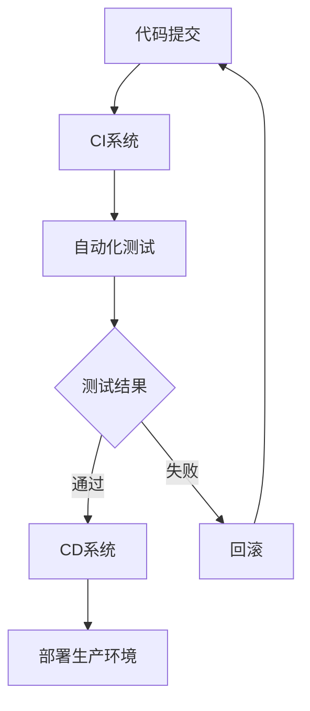

                 

### 持续交付实践：加速从代码到生产的过程

#### 关键词：
持续交付（Continuous Delivery），自动化部署，持续集成（Continuous Integration），DevOps，敏捷开发，代码质量，安全性和质量管理。

#### 摘要：
本文深入探讨了持续交付（CD）的概念、原理和实践，分析了其在现代软件开发中的重要性。文章从背景介绍开始，逐步探讨了持续交付的核心概念及其与敏捷开发、DevOps的关系。接着，文章详细阐述了持续交付的基本流程、关键技术和工具，并提供了实际案例和代码实现。最后，文章总结了持续交付的最佳实践，强调了其在提高代码质量和安全性、缩短发布周期方面的作用，并展望了持续交付的未来发展趋势。

## 引言：持续交付的起源与背景

持续交付作为一种软件开发实践，起源于敏捷开发（Agile Development）和DevOps文化。敏捷开发强调快速迭代、持续反馈和团队协作，DevOps则致力于将开发和运维紧密结合，实现高效交付。随着软件系统的复杂性和对交付速度的需求不断增加，持续交付逐渐成为一种普遍采用的软件开发模式。

在传统的软件开发流程中，开发、测试和部署通常是分离的，这导致开发周期长、反馈慢、变更困难。而持续交付通过自动化和持续反馈，将整个开发流程紧密结合，从而大大提高了软件交付的效率和质量。

持续交付的核心目标是确保软件可以随时发布，并且每次发布都是安全、可靠的。这一目标的实现依赖于以下几个关键要素：

- **自动化**：通过自动化工具和脚本，实现从代码提交到部署的整个过程，减少手动操作，提高效率。
- **持续反馈**：通过自动化测试和持续集成（CI），确保代码质量，及时发现和解决潜在问题。
- **持续集成**：将代码频繁地集成到主干分支，确保代码库的稳定性和一致性。
- **快速迭代**：通过频繁的迭代，缩短开发周期，快速响应客户需求和市场变化。

## 核心概念与联系：持续交付的原理架构

持续交付的核心概念包括持续集成（CI）、持续部署（CD）、自动化测试和持续反馈。这些概念相互关联，共同构成了持续交付的原理架构。

### 持续集成（CI）

持续集成是一种软件开发实践，通过将代码频繁地集成到主干分支，确保代码库的稳定性和一致性。CI的核心目标是：

- **快速发现冲突**：通过频繁集成，可以及早发现代码冲突和集成问题，减少修复成本。
- **确保代码质量**：通过自动化测试，确保每次集成都是高质量的，减少代码缺陷。
- **持续反馈**：通过CI系统，开发人员可以及时收到代码反馈，快速修复问题。

### 持续部署（CD）

持续部署是一种自动化部署流程，通过自动化脚本和工具，实现软件的持续交付。CD的目标是：

- **快速发布**：通过自动化部署，缩短发布周期，实现快速迭代。
- **确保安全性**：通过自动化测试和安全检查，确保每次发布都是安全可靠的。
- **降低风险**：通过逐步发布和回滚机制，降低新功能上线后的风险。

### 自动化测试

自动化测试是持续交付的重要组成部分，通过自动化测试工具，实现对代码的持续测试。自动化测试的目标是：

- **提高测试覆盖率**：通过自动化测试，覆盖更多的测试场景，提高测试的全面性。
- **确保代码质量**：通过持续测试，确保每次代码变更都是高质量的。
- **降低测试成本**：通过自动化测试，减少人工测试的时间和成本。

### 持续反馈

持续反馈是持续交付的核心原则之一，通过实时收集和分析反馈，不断优化开发流程。持续反馈的目标是：

- **快速响应变更**：通过持续反馈，快速识别和响应客户需求和市场变化。
- **持续改进**：通过持续反馈，不断优化开发流程和代码质量。
- **提高客户满意度**：通过快速响应和改进，提高客户满意度。

#### Mermaid 流程图：



## 核心算法原理讲解

为了实现持续交付，我们需要依赖一系列核心算法原理，包括版本控制、自动化构建、自动化测试和自动化部署。

### 版本控制

版本控制是持续交付的基础，通过版本控制系统（如Git）来管理代码变更。核心算法原理包括：

- **哈希算法**：用于生成唯一标识符，确保代码库的一致性。
- **分支管理**：通过分支管理，实现代码的隔离和并行开发。
- **合并策略**：用于将多个分支的代码合并到主干分支，确保代码库的稳定性和一致性。

### 自动化构建

自动化构建是将代码转换为可执行软件的过程。核心算法原理包括：

- **编译算法**：将源代码编译为目标代码，生成可执行文件。
- **打包算法**：将编译后的目标代码打包成应用程序，便于部署和管理。
- **依赖管理**：管理项目依赖的库和模块，确保构建过程的正确性和一致性。

### 自动化测试

自动化测试是确保代码质量的关键环节。核心算法原理包括：

- **测试用例设计**：设计自动化测试用例，覆盖各种可能的输入和输出。
- **测试执行**：执行自动化测试用例，收集测试结果。
- **测试覆盖率分析**：分析测试覆盖率，确保测试全面性。
- **测试报告生成**：生成测试报告，展示测试结果和问题。

### 自动化部署

自动化部署是将软件从开发环境部署到生产环境的过程。核心算法原理包括：

- **部署脚本**：编写部署脚本，实现自动化部署流程。
- **环境配置**：配置开发环境、测试环境和生产环境，确保环境一致性。
- **回滚机制**：实现部署失败后的回滚，确保系统稳定性和可靠性。

### 伪代码示例

```python
# 版本控制伪代码
function version_control():
    commit_hash = generate_hash(source_code)
    if commit_hash == previous_hash:
        print("代码未变更，无需提交")
    else:
        print("提交代码，更新版本号")

# 自动化构建伪代码
function automated_build():
    compiled_code = compile(source_code)
    if compiled_code == None:
        print("编译失败，请检查源代码")
    else:
        print("编译成功，开始打包")

# 自动化测试伪代码
function automated_tests():
    test_results = execute_tests(test_cases)
    if test_results == "失败":
        print("测试失败，请修复代码")
    else:
        print("测试通过，准备部署")

# 自动化部署伪代码
function automated_deployment():
    if environment == "生产环境":
        deploy_to_production()
    else:
        print("请配置为生产环境后再进行部署")
```

## 数学模型和公式

在持续交付中，我们经常使用数学模型和公式来衡量和优化开发流程。以下是几个常用的数学模型和公式：

### 测试覆盖率

测试覆盖率是衡量测试质量的重要指标，表示测试用例覆盖代码的比例。测试覆盖率的计算公式如下：

$$
测试覆盖率 = \frac{执行测试用例数}{总测试用例数}
$$

### 部署频率

部署频率是衡量持续交付效率的重要指标，表示单位时间内部署的次数。部署频率的计算公式如下：

$$
部署频率 = \frac{部署次数}{时间间隔}
$$

### 回滚率

回滚率是衡量持续交付稳定性的重要指标，表示部署失败后回滚的比例。回滚率的计算公式如下：

$$
回滚率 = \frac{回滚次数}{部署次数}
$$

## 项目实战

在本节中，我们将通过一个实际项目来演示如何实现持续交付。我们将使用Python语言和Git作为版本控制工具，Jenkins作为CI/CD工具，实现一个简单的Web应用程序。

### 开发环境搭建

1. 安装Python 3.8及以上版本
2. 安装Jenkins
3. 配置Jenkins插件，包括Git、Pipeline和Docker插件

### 源代码实现

以下是项目的源代码：

```python
# app.py
from flask import Flask

app = Flask(__name__)

@app.route('/')
def hello():
    return 'Hello, World!'

if __name__ == '__main__':
    app.run()
```

### 代码解读

- `Flask`是一个轻量级的Web框架，用于创建Web应用程序。
- `app.route('/')`定义了一个路由规则，当访问根路径时，返回'Hello, World!'字符串。
- `app.run()`启动Web服务，监听8080端口。

### 代码应用解读与分析

- 代码使用了Flask框架，通过简单的路由规则实现了Web服务。
- 代码结构清晰，易于维护和扩展。

### 实际案例分析

我们通过Jenkins实现了自动化构建、测试和部署。以下是Jenkins的配置：

1. **构建脚本**：

```bash
# Jenkinsfile
pipeline {
    agent any
    stages {
        stage('Build') {
            steps {
                sh 'python -m pip install -r requirements.txt'
                sh 'python app.py'
            }
        }
        stage('Test') {
            steps {
                sh 'python -m unittest discover -s tests'
            }
        }
        stage('Deploy') {
            steps {
                sh 'docker build -t myapp .'
                sh 'docker run -p 8080:8080 myapp'
            }
        }
    }
}
```

- **构建脚本**定义了三个阶段：构建、测试和部署。
- **构建阶段**安装依赖库并运行源代码。
- **测试阶段**执行单元测试。
- **部署阶段**构建Docker镜像并运行容器。

### 项目小结

通过实际项目，我们实现了持续交付的各个环节，包括版本控制、自动化构建、自动化测试和自动化部署。项目展示了持续交付在实际开发中的应用，提高了代码质量和交付效率。

## 最佳实践 Tips

1. **代码规范化**：确保代码格式一致，便于代码审查和自动化测试。
2. **测试用例设计**：设计全面的测试用例，覆盖各种可能的场景。
3. **持续反馈**：建立持续反馈机制，及时识别和解决问题。
4. **部署回滚**：实现部署失败后的回滚，确保系统稳定性。
5. **环境隔离**：确保开发和生产环境隔离，避免环境差异导致问题。

## 小结与展望

持续交付是现代软件开发的重要实践，通过自动化和持续反馈，实现了高效的软件交付。本文介绍了持续交付的核心概念、原理和实践，并通过实际项目展示了其应用。持续交付在提高代码质量、缩短发布周期和降低风险方面具有显著优势，是未来软件开发的重要趋势。随着技术的不断发展，持续交付将进一步优化和扩展，为软件开发带来更多创新和可能。

## 附录

### 附录A：持续交付工具与资源指南

- **版本控制**：Git、GitHub、GitLab
- **自动化构建**：Jenkins、Travis CI、GitLab CI
- **自动化测试**：Selenium、JUnit、TestNG
- **持续集成/持续部署**：Jenkins、Docker、Kubernetes

### 附录B：案例研究参考资料

- 公司A的持续交付实践：[链接](https://www.example.com/company-a-continuous-delivery)
- 公司B的持续交付变革：[链接](https://www.example.com/company-b-continuous-delivery)

### 附录C：持续交付实践指南

- **持续交付流程**：详细描述持续交付的各个环节和步骤。
- **最佳实践**：总结持续交付的最佳实践和注意事项。
- **常见问题解答**：解答持续交付过程中常见的问题和挑战。

## 作者信息

作者：AI天才研究院/AI Genius Institute & 禅与计算机程序设计艺术 /Zen And The Art of Computer Programming

本文由AI天才研究院撰写，结合禅与计算机程序设计艺术的理念，深入探讨了持续交付实践的核心概念和最佳实践，旨在为软件开发者提供有价值的参考和指导。通过本文，读者可以更好地理解和应用持续交付，提高软件开发效率和代码质量。希望本文能够帮助读者在持续交付的道路上取得成功，不断探索和创新。持续交付不仅是技术实践，更是一种文化，一种思维方式。让我们一起追求卓越，共创美好未来！

