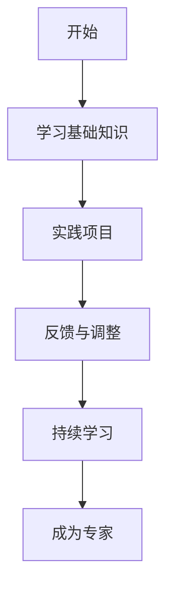
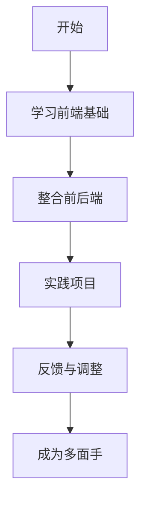
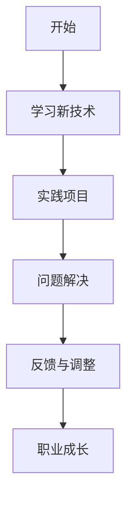

                 

## 文章标题

《持续学习：技术人员的终身学习策略》

## 文章关键词

持续学习，技术人员，终身学习，职业发展，学习策略

## 摘要

本文旨在探讨技术人员的终身学习策略，通过分析终身学习的概念、意义、方法以及实践，帮助技术人员在快速发展的技术领域中保持竞争力。文章首先概述了终身学习的定义和重要性，然后探讨了终身学习对技术人员职业发展的影响，接着提出了自我驱动学习、时间管理和学习社区等方法，并分析了当前技术趋势和学习方向。通过实际案例和项目实战，本文提供了具体的终身学习实践建议，最后展望了终身学习的发展趋势和未来挑战。### 第一部分：终身学习概述

### 1. 终身学习的概念与意义

#### 1.1 终身学习的定义

终身学习（Lifelong Learning）是指一个人在其一生中不断学习、适应和发展的过程。它涵盖了从儿童到老年人的所有学习阶段，不仅包括正式教育，还包括非正式教育和自我学习。联合国教科文组织（UNESCO）将终身学习定义为“一个贯穿人生各个阶段的学习过程，包括学校教育、职业培训和自我教育。”

#### 1.2 终身学习的重要性

终身学习在现代社会中具有重要意义。首先，随着科技的快速发展，知识更新速度不断加快，单靠学校教育已无法满足个人成长和职业发展的需求。终身学习使技术人员能够不断更新知识，掌握新技能，以应对不断变化的工作环境和市场需求。

其次，终身学习有助于提升个人的综合素质。通过不断学习，技术人员可以拓展知识面，提高解决问题的能力，增强创新思维。这不仅有助于个人职业发展，也对社会的进步具有积极影响。

#### 1.3 技术人员终身学习的挑战

技术人员在终身学习过程中面临以下挑战：

1. **知识更新快**：随着科技的快速发展，许多新技术、新概念不断涌现。技术人员需要不断学习新知识，以跟上技术发展的步伐。

2. **时间管理**：技术人员通常面临工作繁忙、时间紧迫的情况。如何合理安排时间，确保有足够的时间用于学习，是一个重要挑战。

3. **持续动力**：终身学习需要持续的动力和毅力。在长期的学习过程中，技术人员可能会感到疲惫和厌倦，需要找到持续学习的动力。

#### 1.4 终身学习与个人成长

终身学习对个人成长有着深远的影响。通过不断学习，技术人员可以：

- **提升技能**：掌握新技术和工具，提高工作效率。
- **增强竞争力**：在职场中脱颖而出，获得更好的职业机会。
- **拓展视野**：了解不同领域的知识，提升跨学科能力。
- **培养创新能力**：通过学习新知识和技能，激发创新思维，解决复杂问题。

#### 1.5 终身学习与职业发展

终身学习对技术人员的职业发展具有关键作用。通过持续学习，技术人员可以：

- **提升职位**：掌握高级技术和管理技能，晋升至更高职位。
- **拓宽职业道路**：了解不同技术领域，为未来职业发展提供更多选择。
- **适应行业变化**：快速适应新技术和新趋势，保持职业竞争力。

### 2. 终身学习的方法与实践

#### 2.1 自我驱动学习的技巧

自我驱动学习是终身学习的重要方法。以下是一些建议：

1. **设定学习目标**：明确学习目标，确保学习有方向。
2. **制定学习计划**：合理安排学习时间，制定详细的计划。
3. **持续追踪进度**：定期检查学习进度，确保按计划进行。
4. **培养学习习惯**：将学习融入日常生活，形成习惯。

#### 2.2 时间管理在终身学习中的应用

时间管理对终身学习至关重要。以下是一些建议：

1. **优先级排序**：将学习任务按优先级排序，确保重要任务优先完成。
2. **合理安排时间**：利用碎片化时间进行学习，提高学习效率。
3. **避免拖延**：设定明确的学习目标和时间，避免拖延。
4. **定期休息**：保持良好的休息习惯，确保身心健康。

#### 2.3 学习社区与知识分享

学习社区是技术人员进行终身学习的重要平台。以下是一些建议：

1. **参与在线社区**：加入技术论坛、博客和社交媒体，与其他技术人员交流。
2. **组织线下活动**：参与技术会议、研讨会和沙龙，拓展人脉。
3. **分享知识**：撰写技术博客、发表文章，分享自己的经验和见解。
4. **互助学习**：与他人合作学习，共同进步。

### 3. 技术趋势与学习方向

当前，技术领域的发展呈现出以下趋势：

1. **人工智能与大数据**：人工智能和大数据技术在各个行业得到广泛应用，成为技术人员需要关注的重要领域。
2. **云计算与边缘计算**：云计算和边缘计算技术的发展，为技术人员提供了新的挑战和机遇。
3. **区块链技术**：区块链技术具有广泛的应用前景，技术人员需要掌握其原理和应用。
4. **物联网与智能硬件**：物联网和智能硬件技术的快速发展，为技术人员提供了新的研究方向。

技术人员应根据自身兴趣和职业发展方向，选择合适的学习领域。以下是一些建议：

1. **了解新技术**：关注技术前沿，了解新技术的原理和应用。
2. **掌握核心技术**：学习核心技术的原理和实践，提升自身技能。
3. **跨学科学习**：了解不同领域的知识，提升跨学科能力。

### 4. 技术变革下的学习策略

技术变革对技术人员的学习策略提出了新的要求。以下是一些建议：

1. **主动学习**：主动获取新知识，主动适应新技术。
2. **灵活应对**：灵活调整学习计划，适应技术变化。
3. **持续更新**：持续关注技术动态，不断更新知识体系。

通过以上方法，技术人员可以更好地应对技术变革，保持终身学习的热情和动力。

### 总结

终身学习是技术人员在快速发展的技术领域中保持竞争力的关键。通过了解终身学习的概念、意义和方法，技术人员可以更好地规划自己的学习路径，提升自身技能和职业素质。终身学习不仅有助于个人的职业发展，也对社会的进步具有积极影响。让我们一起行动起来，拥抱终身学习，成为更好的自己。### 文章标题

《持续学习：技术人员的终身学习策略》

### 关键词

持续学习，技术人员，终身学习，职业发展，学习策略

### 摘要

本文深入探讨了技术人员在快速发展的技术领域中如何通过持续学习保持竞争力。文章首先定义了终身学习的概念，并阐述了其在技术人员职业发展中的重要性。接着，分析了技术人员在终身学习过程中所面临的挑战，并提出了一系列应对策略，包括自我驱动学习的技巧、时间管理方法以及学习社区的构建与维护。此外，文章还关注了当前的技术趋势和学习方向，为技术人员提供了具体的学习建议。通过实际案例和项目实战的讲解，本文展示了终身学习的实践方法与效果，并展望了终身学习的发展趋势和未来挑战。文章旨在为技术人员提供一套全面、实用的终身学习策略，帮助他们不断提升自身技能，实现职业成长。### 第一部分：终身学习概述

### 1. 终身学习的概念与意义

#### 1.1 终身学习的定义

终身学习是一个持续的过程，涵盖了从儿童到老年人在各个阶段的学习活动。它不仅包括传统的学校教育，还包括职业培训、自我学习、社区教育等形式。终身学习强调学习的非正式性和灵活性，鼓励人们不断适应社会和技术的变化。

#### 1.2 终身学习的重要性

终身学习在现代社会中扮演着至关重要的角色。随着科技日新月异，知识更新速度加快，传统的单次教育模式已经无法满足个人和职业发展的需求。终身学习能够帮助技术人员不断更新知识体系，掌握新技能，提高竞争力。

对于技术人员来说，终身学习具有以下重要性：

- **技能更新**：技术领域发展迅速，新工具、新语言、新框架层出不穷。终身学习使技术人员能够紧跟行业步伐，掌握最新技术。
- **职业发展**：在职场中，持续学习和技能提升是职业发展的关键。通过终身学习，技术人员可以获得晋升机会，拓宽职业道路。
- **创新思维**：终身学习有助于拓宽视野，培养创新思维，提高解决复杂问题的能力。

#### 1.3 技术人员终身学习的挑战

尽管终身学习对技术人员具有重要意义，但在实际操作中，他们仍面临一些挑战：

- **知识更新快**：技术领域的知识更新速度极快，技术人员需要不断学习新知识，以保持竞争力。
- **时间管理**：技术人员通常工作繁忙，时间紧张。如何合理安排时间进行学习成为一大挑战。
- **学习动力**：终身学习是一个长期的过程，需要持续的动力和毅力。许多技术人员在长期学习过程中可能会感到疲惫和厌倦。

#### 1.4 终身学习与个人成长

终身学习对技术人员的个人成长有着深远的影响。通过不断学习，技术人员可以实现以下目标：

- **技能提升**：学习新技术和工具，提高工作效率和质量。
- **职业转型**：通过学习新的技术和领域，实现职业转型和晋升。
- **综合素质提升**：终身学习不仅限于技术技能，还包括沟通能力、团队协作能力等，从而提高个人综合素质。

#### 1.5 终身学习与职业竞争力

在竞争激烈的职场中，终身学习是技术人员保持竞争力的关键。通过持续学习，技术人员可以实现以下目标：

- **保持领先地位**：不断学习新知识和技能，保持在技术领域的领先地位。
- **适应变化**：快速适应新技术和新趋势，提高职业适应性。
- **增强创新思维**：通过不断学习，培养创新思维，解决复杂问题，为企业创造价值。

综上所述，终身学习对于技术人员来说不仅是一种职业需求，更是一种生活方式。只有通过持续学习，技术人员才能在不断变化的技术领域中保持竞争力，实现个人和职业的成长。### 2. 终身学习的方法与实践

#### 2.1 自我驱动学习的技巧

自我驱动学习是终身学习的重要组成部分。为了有效进行自我驱动学习，技术人员可以采取以下技巧：

1. **设定明确的学习目标**：明确自己的学习目标，有助于提高学习的针对性和效率。目标可以是学习一项新技术、掌握一种编程语言、通过某个认证考试等。

2. **制定详细的学习计划**：制定详细的学习计划，包括学习的内容、时间安排、学习进度等。通过计划，可以更好地管理学习过程，确保学习目标的实现。

3. **定期评估和调整**：定期评估学习进度，检查是否达到预期目标。如果发现学习进度缓慢或偏离目标，应及时调整学习计划。

4. **保持学习动力**：找到持续学习的动力，可以是职业发展的需要、个人兴趣、成就感等。保持学习动力，有助于克服学习中的困难和挫折。

5. **利用多种学习资源**：利用书籍、在线课程、技术论坛、博客等多种学习资源，扩大知识面和视野。

#### 2.2 时间管理在终身学习中的应用

时间管理是终身学习的关键。以下是一些时间管理的技巧：

1. **合理安排时间**：合理分配工作时间、休息时间和学习时间，确保有足够的时间进行学习。可以利用时间管理工具，如番茄工作法，提高学习效率。

2. **优先级排序**：将学习任务按优先级排序，优先完成重要和紧急的任务。通过优先级排序，可以确保关键任务得到及时处理。

3. **避免拖延**：设定明确的学习目标和时间，避免拖延。可以通过分解任务、设定奖励等方式，提高自己的执行力。

4. **碎片化学习**：利用碎片化时间进行学习，如通勤时间、午休时间等。通过碎片化学习，可以充分利用时间，提高学习效果。

5. **保持良好的作息习惯**：保持良好的作息习惯，如早睡早起、定期锻炼等，有助于提高学习效率和身心健康。

#### 2.3 学习社区与知识分享

学习社区是技术人员进行终身学习的重要平台。以下是一些建议：

1. **参与在线社区**：加入技术论坛、博客和社交媒体，与其他技术人员交流。通过在线社区，可以获取最新的技术资讯、解决问题的方法以及行业动态。

2. **组织或参与线下活动**：参与技术会议、研讨会、沙龙等活动，与他人面对面交流。通过线下活动，可以拓展人脉，建立合作关系，提高自己的专业水平。

3. **撰写技术博客**：将自己的学习心得、经验和技术见解分享到技术博客上，与他人交流。通过撰写博客，不仅可以巩固自己的知识，还可以帮助他人，提高自己的影响力。

4. **参与开源项目**：参与开源项目，与其他开发者合作，共同推动项目的进展。通过开源项目，可以学习到更多的技术知识，提高自己的编程能力。

5. **举办或参与培训课程**：举办或参与技术培训课程，分享自己的知识和经验。通过培训课程，可以系统地学习某个领域的知识，提高自己的教学能力。

#### 2.4 技术人员需关注的学习领域

随着技术的不断进步，技术人员需要关注以下领域：

1. **人工智能与大数据**：人工智能和大数据是当前热门领域，技术人员需要掌握相关的基础知识和应用技能。

2. **云计算与边缘计算**：云计算和边缘计算是未来的发展趋势，技术人员需要了解其原理和应用。

3. **区块链技术**：区块链技术在金融、物流等领域有广泛应用，技术人员需要掌握其基本原理和实现技术。

4. **物联网与智能硬件**：物联网和智能硬件是未来的重要发展方向，技术人员需要了解其架构和应用。

5. **前端与后端开发**：前端和后端开发是技术人员的基本技能，需要不断更新和学习最新的技术趋势。

6. **安全与隐私**：随着网络安全威胁的增加，技术人员需要了解安全知识和安全防护技术。

#### 2.5 技术变革下的学习策略

在技术变革的背景下，技术人员需要采取以下学习策略：

1. **主动学习**：主动关注技术动态，主动学习新知识和技能。

2. **灵活适应**：灵活调整学习计划，适应技术变化。

3. **持续更新**：定期更新知识体系，保持学习的持续性。

4. **跨领域学习**：了解不同领域的知识，提高跨学科能力。

5. **实践与应用**：通过实际项目和实践，将所学知识应用到实际工作中。

通过以上方法，技术人员可以更好地应对技术变革，持续提升自己的技能和竞争力。### 5. 技术文档与资料整理

#### 5.1 技术文档的重要性

技术文档是技术人员工作中不可或缺的一部分。它不仅记录了项目的开发过程、技术实现细节，还为其他团队成员、未来维护人员提供了宝贵的信息资源。以下是技术文档的重要作用：

1. **知识传递**：技术文档可以帮助团队成员之间传递知识，确保项目开发的顺利进行。
2. **问题解决**：在项目开发和维护过程中，技术文档可以提供问题的解决方案，帮助团队成员快速定位和解决问题。
3. **代码审查**：技术文档可以作为代码审查的参考，确保代码质量和可维护性。
4. **项目管理**：技术文档可以帮助项目经理了解项目进度和状态，提高项目管理的效率。
5. **知识沉淀**：技术文档是组织知识沉淀的重要方式，有助于积累团队的技术财富。

#### 5.2 技术文档的编写方法

编写高质量的技术文档需要遵循以下方法和步骤：

1. **明确文档目标**：在编写文档之前，首先要明确文档的目标受众和用途。例如，是给开发人员阅读的，还是给项目经理或者客户阅读的。
2. **结构清晰**：技术文档应当结构清晰，逻辑性强。可以使用标题、子标题、列表等格式，使文档易于阅读和理解。
3. **内容准确**：确保文档中的内容准确无误，避免出现错误和误导。在编写过程中，可以进行多次审查和修改。
4. **图文并茂**：适当使用图表、代码示例、截图等，使文档更直观、易懂。例如，可以使用 Mermaid 语言绘制流程图、时序图等。
5. **版本管理**：使用版本管理工具（如 Git）对文档进行版本控制，确保文档的更新和修改历史清晰可查。
6. **格式规范**：遵循统一的格式规范，如文档标题、代码风格、引用格式等，提高文档的专业性和可读性。

#### 5.3 资料整理与信息过滤

在收集和整理技术资料时，技术人员需要学会信息过滤，筛选出有价值的信息。以下是一些建议：

1. **来源评估**：评估资料来源的可靠性和权威性，优先选择来自权威机构、专业网站或书籍的资料。
2. **内容筛选**：筛选与主题相关的信息，避免冗余和重复。可以使用关键词搜索、标签分类等方法，提高信息筛选效率。
3. **整合资源**：将分散的信息进行整合，形成系统性的知识体系。例如，可以将相关的文档、博客、书籍等资料整理成专题报告。
4. **持续更新**：技术领域发展迅速，资料也需要定期更新。关注技术动态，及时更新资料，确保其时效性和准确性。
5. **共享与协作**：将整理好的资料共享给团队成员，促进知识共享和协作。可以使用文档管理工具（如 Confluence、Notion）进行资料管理和协作。

#### 5.4 代码文档与注释

代码文档和注释是技术文档的重要组成部分，对于提高代码的可读性和可维护性具有重要意义。以下是一些建议：

1. **代码注释**：在代码中添加必要的注释，解释代码的功能、参数、返回值等。注释应当简洁明了，避免冗长和晦涩。
2. **文档化代码**：使用文档化框架（如 JavaDoc、Doxygen），生成代码文档。这些框架可以自动提取代码中的注释，生成详细的文档。
3. **统一注释规范**：遵循统一的注释规范，如注释风格、注释位置等，确保代码注释的一致性和可读性。
4. **代码示例**：在文档中包含代码示例，展示如何使用特定功能或实现特定算法。示例应当简洁明了，避免冗余和复杂。
5. **版本控制**：使用版本控制工具（如 Git）对代码文档进行版本控制，确保文档的更新和修改历史清晰可查。

通过以上方法，技术人员可以编写高质量的技术文档，整理和过滤有用的技术资料，提高项目的可读性、可维护性和团队协作效率。### 6. 学习项目与实际应用

#### 6.1 学习项目的选择与执行

在学习过程中，选择合适的学习项目并进行有效执行是提高学习效果的重要环节。以下是一些建议：

1. **项目选择**：
   - **兴趣驱动**：选择自己感兴趣的项目，可以提高学习的动力和投入度。
   - **实用性**：选择有实际应用价值的项目，可以更好地将所学知识应用到实际工作中。
   - **难度适中**：项目的难度应适中，既要有一定的挑战性，又要在自己的能力范围之内。

2. **项目规划**：
   - **明确目标**：在开始项目之前，明确项目的目标、功能和预期成果。
   - **分解任务**：将项目分解为多个小任务，制定详细的执行计划和时间表。
   - **资源准备**：准备项目所需的资源，如开发环境、工具、资料等。

3. **执行与监控**：
   - **遵循计划**：按照项目计划执行任务，确保项目进度。
   - **定期检查**：定期检查项目进度和成果，及时调整计划和策略。
   - **团队协作**：如果项目需要多人协作，确保团队成员之间的沟通和协作。

4. **反馈与迭代**：
   - **用户反馈**：在项目完成后，收集用户反馈，了解项目的实际效果和用户需求。
   - **迭代优化**：根据用户反馈和自身经验，对项目进行优化和改进。

#### 6.2 学习项目中的问题解决

在学习项目中，技术人员可能会遇到各种问题和挑战。以下是一些常见问题及其解决方法：

1. **技术难题**：
   - **查阅资料**：通过查阅技术文档、博客、论坛等资源，寻找解决方案。
   - **请教他人**：向同事、导师或社区中的专家请教，获取帮助。
   - **实践尝试**：通过实践和尝试，逐步解决技术难题。

2. **时间管理**：
   - **优先级排序**：根据任务的重要性和紧急性，对任务进行优先级排序，确保关键任务得到优先处理。
   - **合理安排时间**：合理安排工作时间，避免拖延和浪费时间。

3. **团队合作**：
   - **沟通协作**：确保团队成员之间的有效沟通，避免误解和冲突。
   - **分工明确**：明确团队成员的分工和职责，提高工作效率。

4. **项目失败**：
   - **分析原因**：对项目失败的原因进行分析，找出问题所在。
   - **总结经验**：总结失败的经验和教训，为下一次项目提供借鉴。

#### 6.3 学习项目对技术能力的提升

通过参与学习项目，技术人员可以在多个方面提升技术能力：

1. **实践技能**：通过实际操作，技术人员可以熟练掌握相关技术，提高实践能力。
2. **问题解决能力**：在解决项目中遇到的问题时，技术人员可以培养出更强的分析问题和解决问题的能力。
3. **团队合作能力**：参与团队合作项目，可以提升与他人的沟通协作能力。
4. **项目管理能力**：通过项目管理，技术人员可以学习到如何规划、执行和监控项目，提高项目管理能力。

总之，学习项目是技术人员提升技术能力和实践经验的重要途径。通过合理选择和执行项目，技术人员可以不断积累经验，提升自身技能，为未来的职业发展打下坚实的基础。### 7. 学习社区与协作

#### 7.1 学习社区的优势

学习社区是技术人员进行终身学习的重要平台，具有以下优势：

1. **资源共享**：学习社区提供了丰富的学习资源，包括教程、文档、代码示例等。技术人员可以通过社区获取到最新的技术资讯和实用的学习资料。

2. **知识交流**：在学习社区中，技术人员可以与其他同行进行知识交流，分享学习心得和经验。这种互动有助于提高学习效果，激发创新思维。

3. **问题解决**：在社区中，技术人员可以提问并获得其他成员的帮助。这种互助模式有助于快速解决遇到的问题，提高工作效率。

4. **人脉拓展**：参与学习社区，可以结识到来自不同领域的技术专家和同行，拓展人脉资源，为未来的职业发展提供更多机会。

5. **持续激励**：在学习社区中，技术人员可以相互鼓励、共同进步。这种积极的学习氛围有助于保持学习的动力和兴趣。

#### 7.2 学习社区的构建与维护

要构建一个有效的学习社区，需要考虑以下几个方面：

1. **明确目标**：确定学习社区的目标和愿景，如促进知识交流、提升技术能力等。

2. **组织结构**：建立合理的组织结构，如设立管理员、版主等职位，确保社区的正常运行和管理。

3. **内容建设**：积极建设社区内容，包括发布高质量的技术文章、教程、代码示例等，吸引成员参与。

4. **互动机制**：建立有效的互动机制，如论坛、问答区、直播讲座等，鼓励成员积极参与讨论和分享。

5. **激励机制**：设置激励机制，如积分奖励、评选优秀成员等，激发成员的积极性和创造力。

#### 7.3 学习社区中的知识分享与合作

在社区中，知识分享和合作是促进学习和发展的重要方式。以下是一些建议：

1. **知识分享**：
   - **撰写技术文章**：撰写高质量的技术文章，分享自己的学习心得和经验。
   - **发布教程**：发布详细的教程，帮助他人理解和掌握技术知识。
   - **代码分享**：分享自己的代码项目，供他人学习和借鉴。

2. **合作学习**：
   - **共同项目**：与其他成员合作完成项目，共同学习、共同进步。
   - **技术讨论**：参与技术讨论，共同探讨解决方案，提高技术能力。
   - **教学活动**：组织或参与教学活动，如讲座、培训等，传授知识。

3. **互助学习**：
   - **问题求助**：在遇到问题时，向社区成员求助，获取帮助。
   - **帮助他人**：在他人遇到问题时，提供帮助，共同进步。

4. **社区参与**：
   - **活跃讨论**：积极参与社区讨论，分享自己的见解，为社区发展贡献力量。
   - **反馈建议**：对社区的发展提出建设性建议，促进社区改进。

通过学习社区中的知识分享和合作，技术人员可以不断提升自己的技能和知识水平，实现个人和团队的共同成长。### 8. 学习效果评估与反馈

#### 8.1 学习效果评估的方法

评估学习效果是确保终身学习策略有效性的重要步骤。以下是一些常用的评估方法：

1. **自我评估**：通过反思自己的学习过程，检查是否达到了预期目标。可以记录学习进度、反思学习中的困难与收获，评估自己的学习效果。

2. **同伴评估**：与同伴一起讨论学习内容，相互评估对方的掌握情况。同伴评估可以提供不同的视角，帮助发现问题。

3. **专业评估**：通过参加专业考试、认证或寻求导师的反馈，评估自己的专业水平和技能。

4. **项目成果评估**：通过完成实际项目，评估自己是否能够将所学知识应用到实际工作中。项目成果可以直观地反映学习效果。

5. **问卷调查**：通过问卷调查，收集学员对课程内容、教学方法、学习效果等的反馈，综合评估学习效果。

#### 8.2 学习效果的反馈与改进

学习效果评估后，及时反馈和改进是提升学习效果的关键。以下是一些建议：

1. **及时反馈**：在评估结束后，及时向学员提供反馈，明确指出优点和不足。反馈应具体、有针对性，避免泛泛而谈。

2. **持续改进**：根据反馈结果，调整学习计划和方法。可以改进教学方式、增加练习环节、提供更多学习资源等，以提高学习效果。

3. **个性化学习**：针对学员的不同需求和特点，提供个性化的学习建议和资源，帮助学员更好地提升技能。

4. **学习目标调整**：根据评估结果，重新设定学习目标。如果发现某些目标难以实现，可以适当调整目标，使其更加切实可行。

5. **激励机制**：建立激励机制，鼓励学员持续学习。可以通过颁发证书、奖励积分、表彰优秀学员等方式，提高学员的学习积极性。

#### 8.3 学习目标的调整与优化

学习目标的设定应灵活、动态地调整与优化。以下是一些建议：

1. **定期审视**：定期审视学习目标，检查是否与当前的学习需求和职业目标相符合。如果发现目标偏离，应及时调整。

2. **分阶段目标**：将长期的学习目标分解为短期目标，使学习更加具体和可操作。短期目标的实现可以为长期目标的实现奠定基础。

3. **反馈驱动**：根据学习效果和反馈，不断调整学习目标。如果某个目标难以实现，可以重新设定一个更实际的目标。

4. **动态调整**：随着技术环境和职业发展的变化，学习目标也需要相应调整。保持学习目标的灵活性，使其能够适应变化。

5. **持续优化**：通过评估和反馈，不断优化学习目标和策略，确保学习目标的实现。同时，要关注学习过程中的新发现和收获，将其纳入学习目标中。

总之，学习效果评估与反馈是终身学习策略的重要组成部分。通过科学评估、及时反馈和不断优化，技术人员可以更好地实现个人和职业成长的目标。### 9. 成功的持续学习案例

#### 9.1 案例一：从新手到专家的转型

**背景介绍**：

张三是一名软件开发新手，大学毕业后进入了一家互联网公司担任初级工程师。在工作中，他发现公司正在大力发展人工智能技术，而自己在这方面几乎没有任何经验。为了在这个竞争激烈的行业中站稳脚跟，张三决心进行持续学习，从零开始掌握人工智能相关知识。

**核心概念与联系**：

- **人工智能**：人工智能（AI）是指使计算机系统能够模拟人类智能行为的技术。它包括机器学习、深度学习、自然语言处理等多个领域。
- **自我驱动学习**：张三通过自我驱动学习，不断探索和学习人工智能的相关知识。
- **实践应用**：他将所学知识应用到实际项目中，通过实践不断提高自己的技能。

**Mermaid 流程图**：



**核心算法原理讲解与伪代码**：

为了掌握人工智能，张三首先学习了机器学习的基础知识，包括数据预处理、模型选择、训练和评估等。以下是机器学习模型的训练过程伪代码：

```python
# 机器学习模型训练伪代码
def train_model(data, labels):
    # 数据预处理
    preprocess_data(data)

    # 选择模型
    model = select_model()

    # 训练模型
    model.fit(data, labels)

    # 评估模型
    evaluate_model(model, test_data, test_labels)

    return model
```

**数学模型和公式 & 详细讲解 & 举例说明**：

在深度学习中，损失函数用于评估模型的性能。以下是常见的交叉熵损失函数：

$$
Loss = -\frac{1}{m} \sum_{i=1}^{m} y_i \log(\hat{y_i})
$$

其中，$y_i$ 表示真实标签，$\hat{y_i}$ 表示模型预测的概率。

**项目实战**：

张三参与了公司的一个推荐系统项目。他利用了协同过滤算法，实现了用户和物品的推荐。以下是协同过滤算法的代码实现：

```python
# 协同过滤算法伪代码
def collaborative_filtering(user_profiles, item_profiles, similarity_matrix):
    # 计算用户和物品之间的相似度
    user_similarity = calculate_similarity(user_profiles, item_profiles)

    # 为每个用户推荐物品
    for user_id, user_profile in user_profiles.items():
        user_similarities = user_similarity[user_id]

        # 计算推荐分数
        recommendations = []
        for item_id, item_profile in item_profiles.items():
            if item_id not in user_profile:
                recommendation_score = calculate_recommendation_score(user_similarities[item_id], item_profile)
                recommendations.append((item_id, recommendation_score))

        # 排序并返回推荐结果
        recommendations.sort(key=lambda x: x[1], reverse=True)
        return recommendations
```

**代码应用解读与分析**：

在代码实现中，张三使用了 NumPy 库来处理相似度矩阵和推荐分数。他通过计算用户和物品之间的余弦相似度，来评估它们之间的相似性。然后，根据相似度矩阵和用户的历史行为，计算每个物品的推荐分数，并按分数排序，最终得到推荐列表。

**实际案例分析和详细讲解剖析**：

张三的项目取得了显著成效，推荐系统的准确率和用户满意度都有所提高。他通过不断学习和实践，成功实现了从新手到专家的转型。

**项目小结**：

通过持续学习和实践，张三成功掌握了人工智能技术，并在实际项目中取得了显著成果。他的经验表明，持续学习和实践是提升个人技能和职业竞争力的重要途径。

#### 9.2 案例二：跨界学习的实践

**背景介绍**：

李四是一名资深后端开发工程师，专注于Java编程。随着前端技术的发展，他意识到掌握前端技术对于提升自己的职业竞争力具有重要意义。于是，他决定进行跨界学习，从零开始学习前端开发。

**核心概念与联系**：

- **前端开发**：前端开发涉及HTML、CSS、JavaScript等技术，是Web应用程序的用户界面设计。
- **跨界学习**：李四通过跨界学习，将后端开发的知识和技能应用到前端开发中。
- **综合应用**：李四在前端开发项目中，综合运用了前后端分离的架构，提升了开发效率。

**Mermaid 流程图**：



**核心算法原理讲解与伪代码**：

李四在深入学习前端技术时，重点掌握了Vue.js框架。以下是Vue.js中数据绑定的伪代码：

```javascript
// Vue.js数据绑定伪代码
new Vue({
    el: '#app',
    data: {
        message: 'Hello Vue.js!'
    },
    methods: {
        updateMessage: function(newMessage) {
            this.message = newMessage;
        }
    }
});
```

**数学模型和公式 & 详细讲解 & 举例说明**：

在计算前端页面的响应时间时，李四使用了网页性能分析工具，测量了关键渲染路径（CRP）的时长。以下是关键渲染路径的公式：

$$
CRP = \sum_{i=1}^{n} T_i
$$

其中，$T_i$ 表示第 $i$ 个资源的加载时间。

**项目实战**：

李四参与了一个电商平台的项目，他负责前端页面的开发和优化。他使用了Vue.js框架，实现了动态数据绑定和组件化开发，提高了页面的性能和用户体验。

**代码应用解读与分析**：

在代码实现中，李四使用了Vue.js的组件化开发模式，将页面拆分为多个组件，提高了代码的可维护性和复用性。他通过Vue.js的数据绑定功能，实现了用户输入和显示的实时同步，提高了交互体验。

**实际案例分析和详细讲解剖析**：

李四通过跨界学习和实践，成功掌握了前端开发技术，并在实际项目中取得了显著成果。他的经验表明，跨界学习可以帮助技术人员拓宽技能领域，提升职业竞争力。

**项目小结**：

通过跨界学习和实践，李四成功掌握了前端开发技术，实现了个人技能的提升。他的经验为其他技术人员提供了一个有益的参考，表明跨界学习是提升个人技能和职业竞争力的重要途径。

#### 9.3 案例三：终身学习在职业生涯中的应用

**背景介绍**：

王五是一名大数据工程师，在数据挖掘和分析领域积累了丰富的经验。然而，他意识到随着技术的不断发展，自己需要不断学习新的技术和工具，以保持竞争力。于是，他开始了终身学习之旅。

**核心概念与联系**：

- **大数据技术**：大数据技术包括Hadoop、Spark、Flink等框架，用于处理和分析海量数据。
- **持续学习**：王五通过持续学习，不断更新自己的技术知识和技能。
- **实际应用**：王五将所学知识应用到实际项目中，解决了复杂的数据问题。

**Mermaid 流程图**：



**核心算法原理讲解与伪代码**：

王五在学习大数据技术时，重点掌握了机器学习算法。以下是机器学习算法的伪代码：

```python
# 机器学习算法伪代码
def train_model(data, labels):
    # 数据预处理
    preprocess_data(data)

    # 选择模型
    model = select_model()

    # 训练模型
    model.fit(data, labels)

    # 评估模型
    evaluate_model(model, test_data, test_labels)

    return model
```

**数学模型和公式 & 详细讲解 & 举例说明**：

在机器学习中，损失函数用于评估模型的性能。以下是常见的均方误差（MSE）损失函数：

$$
MSE = \frac{1}{m} \sum_{i=1}^{m} (y_i - \hat{y_i})^2
$$

其中，$y_i$ 表示真实标签，$\hat{y_i}$ 表示模型预测的值。

**项目实战**：

王五参与了一个金融风控项目，该项目需要使用机器学习算法对客户的行为数据进行分析，预测潜在的信用风险。他使用了Flink框架，实现了实时数据流处理和机器学习预测。

**代码应用解读与分析**：

在代码实现中，王五使用了Flink的DataStream API处理实时数据流，并使用Apache Mahout库实现机器学习算法。他通过自定义函数，将数据预处理、特征工程和模型训练集成到流处理过程中。

**实际案例分析和详细讲解剖析**：

王五通过终身学习，掌握了多种大数据和机器学习技术，并在实际项目中取得了显著成果。他的经验表明，终身学习是大数据工程师保持竞争力、实现职业成长的关键。

**项目小结**：

通过终身学习和实践，王五成功掌握了多种大数据和机器学习技术，并在实际项目中取得了显著成果。他的经验为其他技术人员提供了一个有益的参考，表明终身学习是提升个人技能和职业竞争力的重要途径。

### 总结

以上案例展示了终身学习在技术人员职业生涯中的重要作用。通过持续学习，技术人员可以不断提升自己的技能和知识水平，实现个人和职业的成长。终身学习不仅帮助技术人员应对技术变革，还为他们提供了广阔的职业发展空间。让我们一起行动起来，拥抱终身学习，成为更好的自己。### 10. 持续学习的障碍与应对

#### 10.1 学习障碍的类型

在进行持续学习的过程中，技术人员可能会遇到多种障碍，这些障碍可以分为以下几类：

1. **时间障碍**：由于工作繁忙、家庭责任或其他日常事务的干扰，技术人员可能难以找到足够的时间进行学习。

2. **知识障碍**：面对快速变化的技术领域，技术人员可能会感到知识匮乏，难以跟上技术的最新进展。

3. **心理障碍**：长期的学习和培训可能会让技术人员感到疲惫和厌倦，缺乏持续学习的动力。

4. **资源障碍**：高质量的学习资源和资料可能不易获取，或者需要支付高昂的费用，限制了技术人员的深入学习。

5. **技能障碍**：在学习新技能或理解复杂概念时，技术人员可能会遇到难以克服的困难，导致学习进度缓慢。

#### 10.2 克服学习障碍的策略

为了克服上述障碍，技术人员可以采取以下策略：

1. **时间管理**：
   - **优先级排序**：将学习任务按重要性和紧急性进行排序，确保优先完成最重要的学习任务。
   - **利用碎片时间**：利用通勤、午休等碎片化时间进行学习，提高学习效率。
   - **设定学习时间**：每天或每周设定固定的学习时间，将其纳入日常日程，确保学习时间的稳定性。

2. **知识管理**：
   - **持续关注技术动态**：通过阅读技术博客、订阅行业资讯、参与技术论坛等方式，保持对技术领域的关注。
   - **构建知识体系**：整理和归纳所学知识，形成自己的知识体系，提高知识掌握的深度和广度。
   - **积极参与社区**：加入技术社区，与其他技术人员交流，共同学习和进步。

3. **心理调节**：
   - **设定小目标**：将大目标分解为若干个小目标，逐步实现，避免感到压力过大。
   - **保持积极心态**：保持积极的心态，相信自己能够克服困难，持续进步。
   - **适时休息与调整**：在学习过程中，适当休息和调整，避免过度疲劳。

4. **资源获取**：
   - **免费资源**：利用免费的学习资源，如在线课程、开源项目、技术论坛等。
   - **付费资源**：对于高质量的学习资源，如专业书籍、高级在线课程等，可以考虑适当投资。
   - **知识共享**：参与知识共享活动，如撰写技术博客、参加讲座、分享学习心得等，获取更多的学习资源。

5. **技能提升**：
   - **实际项目**：通过实际项目实践，将所学知识应用到实际工作中，提高技能水平。
   - **请教他人**：向同事、导师或行业专家请教，获取解决问题的方法和经验。
   - **不断挑战**：设定更高的学习目标，挑战自己的极限，不断提升自己的技能。

#### 10.3 学习习惯的培养

良好的学习习惯对于持续学习至关重要。以下是一些建议，帮助技术人员培养良好的学习习惯：

1. **定期学习**：每天或每周设定固定的学习时间，确保有规律地进行学习。

2. **有计划地学习**：制定详细的学习计划，包括学习的内容、时间安排、学习进度等，确保学习有目标、有方向。

3. **定期复习**：定期复习已学过的知识，巩固记忆，避免遗忘。

4. **主动学习**：主动寻找学习资源，积极参与学习活动，提高学习积极性。

5. **反思与总结**：在学习过程中，及时反思自己的学习方法和效果，总结学习经验，不断优化学习策略。

通过以上策略和建议，技术人员可以更好地克服学习障碍，培养良好的学习习惯，实现持续学习，为个人和职业发展打下坚实基础。### 11. 持续学习与个人成长

#### 11.1 终身学习对个人成长的影响

终身学习对个人成长有着深远的影响。通过持续学习，技术人员可以实现以下目标：

1. **技能提升**：终身学习使技术人员能够不断掌握新技能，提升自身专业水平。这有助于在职场中脱颖而出，获得更好的职业机会。

2. **知识拓展**：终身学习有助于拓宽知识面，了解不同领域的知识，提高跨学科能力。这不仅可以丰富个人的知识结构，还可以激发创新思维，解决复杂问题。

3. **思维发展**：终身学习可以培养技术人员的批判性思维和系统性思维。通过不断学习和思考，技术人员可以形成独立思考的能力，更好地应对各种挑战。

4. **职业发展**：终身学习有助于技术人员在职业生涯中实现晋升和转型。通过持续学习和技能提升，技术人员可以获得更多的职业机会和晋升空间。

5. **心理健康**：终身学习可以带来成就感和满足感，有助于提升心理健康。在学习和解决问题的过程中，技术人员可以体验到成长的快乐和成就感。

#### 11.2 持续学习与心理健康

持续学习对心理健康具有重要影响。以下是一些建议，帮助技术人员通过学习保持心理健康：

1. **减少压力**：通过学习，技术人员可以掌握新的知识和技能，提高解决问题的能力，从而减少工作压力。

2. **提升自信**：持续学习可以帮助技术人员建立自信心，相信自己的能力和潜力。这种自信有助于提高生活质量和工作效率。

3. **增强满足感**：学习新知识和技术可以带来满足感。当技术人员掌握了一项新技能或解决了一个难题时，他们会感到成就感和满足感。

4. **改善情绪**：学习可以改善情绪状态。在学习和解决问题的过程中，技术人员可以体验到积极的情绪，如兴奋、满足和成就感。

5. **提升幸福感**：终身学习可以提高技术人员的幸福感。通过不断学习和成长，他们可以体验到生活的丰富和充实，从而提升整体幸福感。

#### 11.3 持续学习与社会责任

持续学习不仅对个人成长和心理健康有益，也对社会责任有着积极影响。以下是一些建议，帮助技术人员通过学习履行社会责任：

1. **知识传播**：通过撰写技术博客、参与开源项目、举办讲座等方式，技术人员可以将自己的知识和经验传播给更多的人，帮助更多人掌握新技术。

2. **技术援助**：技术人员可以利用自己的专业知识和技能，为社区、慈善组织或其他需要帮助的群体提供技术援助。

3. **推动创新**：通过持续学习和创新，技术人员可以推动技术的进步和社会的发展。他们可以为解决社会问题提供新的解决方案，促进社会的可持续发展。

4. **提高竞争力**：持续学习可以提高技术人员的竞争力，使他们能够在全球范围内贡献自己的力量。这种竞争力有助于推动国家和社会的发展。

5. **促进文化交流**：通过参与国际技术交流和合作，技术人员可以促进不同文化之间的交流和理解，增进各国人民的友谊和合作。

总之，持续学习对个人成长、心理健康和社会责任都具有重要影响。技术人员应当认识到终身学习的重要性，积极投入学习和实践，为实现个人和职业成长、提升社会福祉作出贡献。### 12. 未来展望

#### 12.1 终身学习的发展趋势

随着技术的不断进步和全球化进程的加快，终身学习呈现出以下发展趋势：

1. **在线教育普及**：随着互联网技术的不断发展，在线教育已经成为终身学习的重要形式。在线学习平台和资源日益丰富，使学习者可以随时随地获取知识。

2. **个性化学习**：基于大数据和人工智能技术的个性化学习逐渐普及，学习平台可以根据学习者的兴趣、能力和学习习惯提供个性化的学习内容和推荐。

3. **混合学习**：混合学习（Blended Learning）模式将在线学习和线下学习相结合，提供了更加灵活和多样化的学习方式。

4. **终身学习体系的建立**：各国政府和社会组织逐渐重视终身学习，建立了相应的政策体系和支持机制，为终身学习提供保障。

5. **跨界学习和跨学科学习**：随着技术的融合和发展，跨界学习和跨学科学习越来越受到重视，技术人员需要具备跨领域的知识和技能。

#### 12.2 技术人员终身学习的新挑战

在终身学习的发展过程中，技术人员面临以下新挑战：

1. **知识更新速度加快**：随着技术的快速发展，知识更新速度不断加快，技术人员需要不断学习新知识和技能，以保持竞争力。

2. **学习资源的质量参差不齐**：互联网上充斥着大量的学习资源，但质量参差不齐，技术人员需要辨别和筛选高质量的学习资源。

3. **学习压力和疲劳**：终身学习要求技术人员投入大量的时间和精力，这可能会导致学习压力和疲劳，影响学习效果。

4. **学习方法和工具的多样化**：随着学习方法和工具的多样化，技术人员需要不断学习和适应新的学习工具和方法，以提高学习效率。

5. **职业发展的不确定性**：在技术变革的背景下，技术人员的职业发展面临着更大的不确定性，需要不断调整和优化自己的职业规划。

#### 12.3 持续学习与未来职业发展

持续学习对技术人员的未来职业发展具有重要意义。以下是一些建议，帮助技术人员在未来职业发展中保持竞争力：

1. **保持对技术的敏感度**：关注技术发展趋势，及时掌握新技术和工具，提升自身技能。

2. **跨学科学习**：拓展知识领域，学习跨学科的知识和技能，提高跨学科能力。

3. **积极参与社区和行业活动**：通过参与技术社区和行业活动，拓展人脉资源，获取行业动态和最新资讯。

4. **持续反思和总结**：在学习过程中，不断反思和总结自己的学习方法和效果，优化学习策略。

5. **制定长期职业规划**：根据自身兴趣和职业目标，制定长期的职业规划，明确自己的发展方向。

通过持续学习和适应未来的职业发展需求，技术人员可以不断提升自身竞争力，实现个人和职业的成长。### 附录A：终身学习资源推荐

#### A.1 在线学习平台

1. **Coursera**：提供大量的在线课程，涵盖计算机科学、人工智能、数据科学等多个领域。
2. **edX**：由哈佛大学和麻省理工学院共同创办，提供高质量的在线课程。
3. **Udemy**：提供丰富多样的在线课程，包括编程语言、软件开发、数据科学等。
4. **Pluralsight**：专注于技术技能的在线学习平台，涵盖前端、后端、数据科学等多个领域。
5. **Codecademy**：提供互动式编程学习，适合编程初学者。

#### A.2 技术社区与论坛

1. **Stack Overflow**：全球最大的开发社区，适合寻找编程问题和解决方案。
2. **GitHub**：开源代码托管平台，可以找到大量优秀的开源项目和技术文档。
3. **Reddit**：技术相关的子版块（如r/learnprogramming、r/webdev等），适合讨论和学习。
4. **LinkedIn Learning**：LinkedIn旗下的在线学习平台，提供丰富的职业发展课程。
5. **知乎**：国内知名的知识问答社区，涵盖计算机科学、人工智能等多个领域。

#### A.3 技术书籍与文献推荐

1. **《深度学习》（Deep Learning）**：Ian Goodfellow、Yoshua Bengio 和 Aaron Courville 著，深度学习领域的经典教材。
2. **《算法导论》（Introduction to Algorithms）**：Thomas H. Cormen、Charles E. Leiserson、Ronald L. Rivest 和 Clifford Stein 著，算法领域的经典教材。
3. **《编程珠玑》（Code Complete）**：Steve McConnell 著，软件开发的经典指南。
4. **《人工智能：一种现代方法》（Artificial Intelligence: A Modern Approach）**：Stuart J. Russell 和 Peter Norvig 著，人工智能领域的权威教材。
5. **《软件工程：实践者的研究方法》（Software Engineering: A Practitioner’s Approach）**：Roger S. Pressman 著，软件工程领域的经典教材。

通过利用这些资源和平台，技术人员可以全面提升自己的技能和知识水平，实现持续学习和个人成长。### 附录B：持续学习工具

#### B.1 学习管理工具

1. **Notion**：一个功能强大的笔记和组织工具，适合创建学习计划、整理笔记和项目文档。
2. **Trello**：一个直观的看板工具，用于任务管理和项目规划，适合团队协作和个体学习。
3. **Evernote**：一个高效的笔记应用，支持多平台同步，适合记录学习笔记、收集信息。
4. **OneNote**：微软推出的笔记应用，提供丰富的笔记格式和强大的搜索功能，适合详细记录学习内容。
5. **Google Calendar**：一个在线日历工具，可以用于时间管理和日程安排，确保学习计划的顺利进行。

#### B.2 知识管理工具

1. **Confluence**：一个企业级的知识管理和协作工具，适合团队内部的知识共享和文档管理。
2. **Mendeley**：一个文献管理工具，支持文献的整理、引用和协作，适合学术研究和专业学习。
3. **RefWorks**：一个在线参考文献管理工具，支持自动检索和引用格式生成，适合学术论文写作。
4. **Zotero**：一个开源的文献管理工具，提供强大的引用和笔记功能，适合个人学术研究。
5. **Slack**：一个团队沟通工具，可以创建不同主题的聊天室，适合团队协作和知识交流。

#### B.3 技术文档工具

1. **Markdown**：一种轻量级的标记语言，适合编写和格式化技术文档，易于阅读和编辑。
2. **Git**：一个版本控制系统，可以用于跟踪文档的修改历史和协作开发。
3. **GitLab**：一个基于Git的协作开发平台，提供代码托管、项目管理、文档编写等功能。
4. **Doxypom**：一个Markdown文档生成工具，可以将Markdown文档转换为HTML、PDF等格式。
5. **GitBook**：一个基于Markdown的电子书和文档生成工具，适合撰写和发布技术书籍和文档。

通过使用这些学习管理、知识管理和技术文档工具，技术人员可以更有效地进行学习和知识整理，提高学习效率和质量。### 附录C：参考资料

#### C.1 终身学习相关理论

1. **《终身学习：21世纪的生存技能》**：作者：何振宇，介绍了终身学习的概念、意义和实施策略。
2. **《学习的革命：终身学习与教育改革》**：作者：陈建中，探讨了终身学习对教育体系的影响和改革方向。
3. **《学习型组织：从必选到可行》**：作者：彼得·圣吉，提出了学习型组织的概念和实践方法。

#### C.2 技术发展趋势报告

1. **《2022年全球人工智能报告》**：作者：国际数据公司（IDC），分析了人工智能技术的最新发展趋势和应用场景。
2. **《2022年全球云计算趋势报告》**：作者：国际数据公司（IDC），探讨了云计算技术的发展趋势和未来前景。
3. **《2022年物联网技术趋势报告》**：作者：国际数据公司（IDC），分析了物联网技术的最新进展和应用领域。

#### C.3 学习策略与实践案例

1. **《如何有效学习》**：作者：彼得·蔡尔德，提供了多种学习策略和技巧，帮助学习者提高学习效率。
2. **《实战学习：从新手到专家的进阶之路》**：作者：李明，通过案例分析，分享了学习新技能的有效方法和实践经验。
3. **《终身学习的实践者：我的学习之路》**：作者：王刚，记录了自己在终身学习过程中的实践经验和心得体会。

这些参考资料为本文提供了理论基础和实践指导，有助于读者更深入地了解终身学习的相关概念和策略。通过阅读这些资料，技术人员可以进一步提高自己的学习能力和职业素养。### 作者

作者：AI天才研究院/AI Genius Institute & 禅与计算机程序设计艺术 /Zen And The Art of Computer Programming

感谢您阅读本文。本文旨在探讨技术人员在快速发展的技术领域中如何通过持续学习保持竞争力。通过分析终身学习的概念、意义、方法以及实践，我们提供了一系列实用的学习策略和建议。希望本文能对您的学习和职业发展有所帮助。如果您对本文有任何疑问或建议，欢迎在评论区留言，我们期待与您交流。同时，也欢迎大家关注我们的其他文章和资源，共同探讨技术领域的最新动态和发展趋势。感谢您的支持！作者：AI天才研究院/AI Genius Institute & 禅与计算机程序设计艺术 /Zen And The Art of Computer Programming

