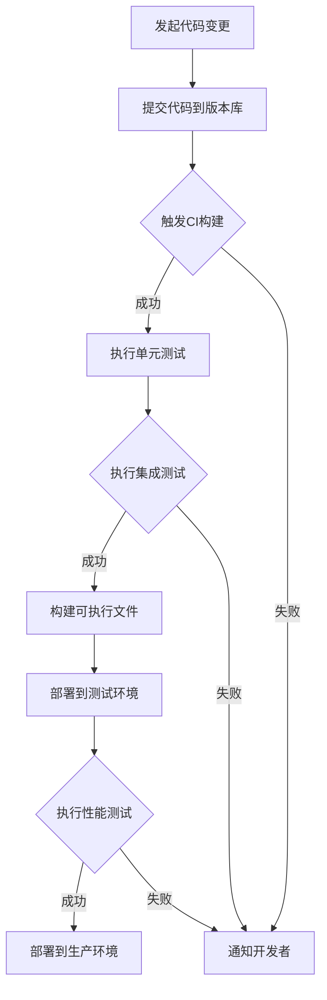
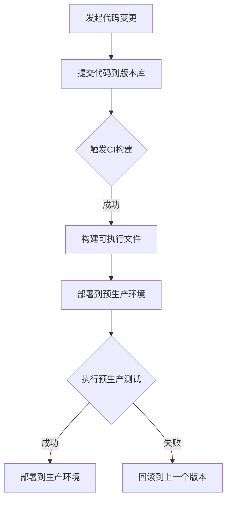

                 


### 持续集成与持续部署（CI/CD）实践

#### 关键词
- 持续集成
- 持续部署
- 软件开发生命周期
- 实践指南
- 工具应用
- 安全性保障
- 监控与优化

#### 摘要
本文深入探讨持续集成（CI）与持续部署（CD）的实践方法。首先介绍CI/CD的基础概念、原理及其在软件开发生命周期中的位置。接着，我们将详细分析CI/CD的常见模式，以及如何选择和应用合适的工具。通过实际案例，我们将展示如何从零开始搭建CI/CD流程。最后，文章将探讨CI/CD流程中的安全性保障和监控优化策略，并提供一系列最佳实践和建议。

## 第一部分：CI/CD基础概念

### 1. 持续集成（CI）基本原理

#### 1.1 CI的定义
持续集成（Continuous Integration，简称CI）是一种软件开发实践，旨在通过频繁地将代码更改合并到主干分支，以快速检测并修复缺陷，确保软件始终处于可部署状态。

#### 1.2 CI的关键要素
CI的核心要素包括：
- 版本控制工具：如Git，用于管理代码变更。
- 自动化构建工具：如Jenkins，用于自动化构建和测试代码。
- 自动化测试工具：如Selenium，用于自动化测试。

#### 1.3 CI的优势与挑战
CI的优势包括：
- 快速发现和修复缺陷。
- 提高开发效率。
- 减少集成风险。
- 提高代码质量。

CI的挑战包括：
- 需要良好的代码库管理。
- 可能会增加测试负担。
- 需要配置和维护CI服务器。

### 2. 持续部署（CD）基本原理

#### 2.1 CD的定义
持续部署（Continuous Deployment，简称CD）是一种自动化流程，它将经过CI验证的代码更改自动部署到生产环境中，以实现持续交付。

#### 2.2 CD的关键要素
CD的关键要素包括：
- 自动化部署工具：如Docker，用于容器化应用。
- 容器编排工具：如Kubernetes，用于管理容器。
- 部署管道：用于自动化部署流程。

#### 2.3 CD的优势与挑战
CD的优势包括：
- 快速交付新功能。
- 减少手动操作。
- 提高系统可用性。

CD的挑战包括：
- 需要严格的测试和质量保证。
- 可能会导致部署失败的风险。
- 需要确保自动化的部署流程是可靠和可回滚的。

### 3. CI/CD在软件开发生命周期中的位置

#### 3.1 软件开发生命周期简介
软件开发生命周期（Software Development Life Cycle，简称SDLC）包括以下阶段：
- 需求分析
- 设计
- 编码
- 测试
- 部署
- 维护

#### 3.2 CI/CD的作用与价值
CI/CD在SDLC中扮演着关键角色：
- CI确保代码质量，提高开发效率。
- CD实现快速交付，降低部署风险。

#### 3.3 CI/CD与传统开发的区别
与传统开发相比，CI/CD的特点包括：
- 自动化：使用自动化工具进行构建、测试和部署。
- 持续反馈：快速反馈缺陷，及时修复。
- 快速迭代：支持快速开发和新功能的快速交付。

## 第二部分：CI/CD技术实战

### 4. CI/CD的常见模式

#### 4.1 常见的CI/CD模式
CI/CD常见模式包括：
- 单通道模式：每个分支都有自己的CI/CD流程。
- 多通道模式：共享CI/CD流程，但每个分支有不同的部署策略。
- 金丝雀发布：部分用户首先使用新功能，收集反馈后决定是否全面部署。

#### 4.2 模式的选择与优化
选择和优化CI/CD模式需要考虑：
- 团队规模和协作模式。
- 应用场景和业务需求。
- 部署风险和回滚策略。

#### 4.3 CI/CD工具链的搭建
搭建CI/CD工具链需要：
- 确定所需的工具和平台。
- 配置版本控制工具和自动化构建工具。
- 设计部署管道和测试策略。

### 5. 持续集成工具选择与应用

#### 5.1 GitLab CI
GitLab CI是基于GitLab的CI/CD工具，提供开箱即用的解决方案。

#### 5.2 Jenkins
Jenkins是一个开源的自动化服务器，支持多种集成工具。

#### 5.3 CircleCI
CircleCI是一个云端的CI/CD平台，提供简化的配置和使用。

#### 5.4 GitHub Actions
GitHub Actions是GitHub提供的CI/CD工具，集成于GitHub平台。

### 6. 持续部署工具选择与应用

#### 6.1 Docker
Docker是一个容器化平台，用于打包和部署应用。

#### 6.2 Kubernetes
Kubernetes是一个容器编排平台，用于管理和自动化容器。

#### 6.3 AWS EKS
AWS EKS是AWS提供的Kubernetes服务，用于在AWS上部署容器化应用。

#### 6.4 Azure AKS
Azure AKS是Azure提供的Kubernetes服务，用于在Azure上部署容器化应用。

### 7. 实战案例：从零搭建CI/CD流程

#### 7.1 实战背景
本文将介绍如何从零开始搭建一个CI/CD流程。

#### 7.2 实战目标
- 使用GitLab CI进行持续集成。
- 使用Docker进行持续部署。
- 设计一个简单的部署管道。

#### 7.3 实战步骤
- 安装GitLab CI。
- 配置GitLab CI文件。
- 编写Dockerfile。
- 编写部署脚本。
- 设计部署管道。

#### 7.4 实战总结
通过本文的实战案例，读者可以了解如何从零开始搭建CI/CD流程。这将有助于提高软件交付的效率和稳定性。

## 第三部分：CI/CD安全与监控

### 8. CI/CD流程中的安全性保障

#### 8.1 安全性在CI/CD中的重要性
CI/CD流程的安全性至关重要，因为它涉及代码的自动化构建、测试和部署。任何安全漏洞都可能影响整个系统。

#### 8.2 常见安全威胁与防护措施
常见的CI/CD安全威胁包括：
- 代码泄露。
- 自动化攻击。
- 未经授权的访问。

防护措施包括：
- 使用强密码和多因素认证。
- 对CI/CD服务进行安全配置。
- 监控CI/CD活动，及时发现异常。

#### 8.3 安全最佳实践
安全最佳实践包括：
- 定期更新和修补漏洞。
- 对CI/CD工具和依赖库进行安全审计。
- 制定和遵循安全政策和标准。

### 9. CI/CD流程的监控与优化

#### 9.1 监控概述
监控CI/CD流程有助于确保其正常运行和性能优化。

#### 9.2 常见监控工具
常见的监控工具包括：
- Prometheus。
- Grafana。
- Nagios。

#### 9.3 监控数据的分析与利用
监控数据的分析有助于：
- 识别性能瓶颈。
- 快速响应异常情况。
- 优化CI/CD流程。

#### 9.4 优化CI/CD流程的策略
优化CI/CD流程的策略包括：
- 精简测试用例。
- 使用缓存提高构建速度。
- 优化容器资源分配。

## 附录：CI/CD资源与工具

### 10.1 常用CI/CD资源
- Jenkins：[https://www.jenkins.io/](https://www.jenkins.io/)
- GitLab CI：[https://gitlab.com/gitlab-org/gitlab CI](https://gitlab.com/gitlab-org/gitlab%20CI)
- Docker：[https://www.docker.com/](https://www.docker.com/)
- Kubernetes：[https://kubernetes.io/](https://kubernetes.io/)

### 10.2 开源工具介绍
- Prometheus：[https://prometheus.io/](https://prometheus.io/)
- Grafana：[https://grafana.com/](https://grafana.com/)
- Nagios：[https://www.nagios.org/](https://www.nagios.org/)

### 10.3 学习资源推荐
- 《CI/CD：持续交付的现代实践》：[https://books.google.com/books?id=978-1492037177](https://books.google.com/books?id=978-1492037177)
- 《Docker实战》：[https://books.google.com/books?id=978-1449319662](https://books.google.com/books?id=978-1449319662)
- 《Kubernetes权威指南》：[https://books.google.com/books?id=978-1430266783](https://books.google.com/books?id=978-1430266783)

### 作者
- 作者：AI天才研究院/AI Genius Institute & 禅与计算机程序设计艺术 /Zen And The Art of Computer Programming## 持续集成（CI）的深入探讨

持续集成（CI）是现代软件开发中不可或缺的一部分，它通过自动化构建、测试和部署，确保代码库中的每次更改都是高质量的。本节将进一步探讨CI的基本原理，包括其定义、关键要素、优势与挑战，以及CI在软件开发流程中的具体应用。

### 1.1 CI的定义

持续集成是一种软件开发实践，旨在通过频繁地将开发人员的代码更改合并到主干分支，并自动执行一系列测试和构建过程，以确保软件的持续质量。CI的核心目标是快速检测和修复代码缺陷，减少集成风险，从而提高软件交付的效率和质量。

### 1.2 CI的关键要素

CI的成功实施依赖于以下几个关键要素：

1. **版本控制工具**：版本控制是CI的核心，它用于管理代码库的变更。常见的版本控制工具包括Git、Subversion（SVN）和Mercurial。其中，Git由于其分支管理和分布式特性，成为了CI的主流选择。

2. **自动化构建工具**：自动化构建工具负责将代码转换为可执行文件或库。Jenkins、Travis CI、CircleCI和GitLab CI等是常用的CI工具，它们可以自动执行构建过程，并触发后续的测试步骤。

3. **自动化测试工具**：自动化测试是CI的重要组成部分。单元测试、集成测试和性能测试等都可以通过自动化测试工具（如JUnit、NUnit、Selenium等）进行执行，以确保每次代码更改都不会引入新的缺陷。

4. **持续反馈机制**：CI系统会自动运行测试并在每次代码提交后提供反馈。这种反馈可以是测试结果的通知、错误报告或性能指标。持续反馈有助于开发人员快速识别问题并进行修复。

### 1.3 CI的优势与挑战

**优势**

- **快速反馈**：CI系统能够在代码提交后立即运行测试，提供即时反馈。这有助于开发人员快速识别和修复缺陷，缩短反馈周期。

- **提高代码质量**：通过自动化测试，CI确保每次代码更改都不会破坏现有功能。这有助于保持代码库的稳定性和一致性。

- **减少集成风险**：频繁的小规模集成可以减少集成过程中的不确定性，降低整体项目风险。

- **提高开发效率**：自动化构建和测试可以节省大量手动操作时间，使开发人员能够专注于更高价值的工作。

**挑战**

- **配置和管理**：CI系统需要适当的配置和管理，以确保其正常运行。这包括设置构建环境和参数、处理依赖关系等。

- **测试覆盖不足**：CI系统可能会由于时间或资源限制而无法执行所有测试。因此，确保测试覆盖全面是一个挑战。

- **集成复杂性**：对于大型项目，CI系统的构建和测试过程可能会变得复杂，需要精心设计和管理。

### 1.4 CI的应用场景

CI适用于各种软件开发场景，以下是一些典型的应用场景：

- **敏捷开发**：敏捷开发强调快速迭代和频繁交付，CI与敏捷开发方法完美结合，有助于实现持续交付。

- **微服务架构**：微服务架构强调独立部署和自动化，CI能够确保每个微服务的质量和一致性。

- **多团队协作**：在多团队协作项目中，CI有助于确保代码库的一致性，减少集成冲突。

- **开源项目**：开源项目通常由多个贡献者共同维护，CI有助于确保每次提交的质量和项目稳定性。

### 1.5 CI与持续部署（CD）的关系

持续部署（CD）是CI的延伸，它通过自动化部署流程，将经过CI验证的代码更改自动部署到生产环境中。CI和CD紧密相连，共同构成持续交付（CD）的闭环。CI确保代码的质量和稳定性，而CD则确保代码的快速和可靠交付。

### 1.6 CI/CD流程中的Mermaid流程图

为了更好地理解CI/CD流程，以下是一个简化的CI/CD流程的Mermaid流程图：



在这个流程图中，每次代码变更都会触发CI构建，经过一系列测试后，成功构建的代码会自动部署到生产环境。如果测试失败，则会通知开发者进行修复。

### 1.7 CI的核心算法原理讲解

虽然CI的具体实现因工具和框架的不同而异，但其核心算法原理基本相似。以下是一个基于Jenkins的CI流程的伪代码示例：

```python
# 伪代码：Jenkins CI流程

def ci_process(code_change):
    # 检查代码库中的变更
    if is_code_change_detected():
        # 检查构建环境是否准备就绪
        if is_environment_ready():
            # 执行构建
            execute_build()
            
            # 执行单元测试
            execute_unit_tests()
            
            # 执行集成测试
            execute_integration_tests()
            
            # 执行性能测试
            execute_performance_tests()
            
            # 如果测试通过
            if tests_passed():
                # 构建成功，部署到测试环境
                deploy_to_test_environment()
            else:
                # 测试失败，通知开发者
                notify_developers()
        else:
            # 环境未就绪，等待
            wait_for_environment()
    else:
        # 没有代码变更，等待
        wait_for_code_change()
```

在这个伪代码中，CI流程通过轮询代码库来检测变更。一旦检测到变更，流程会检查构建环境是否就绪，然后执行构建、测试和部署步骤。如果测试通过，代码将被部署到测试环境；否则，开发者会被通知进行修复。

### 1.8 数学模型和公式

在CI/CD流程中，有一些关键的性能指标，如构建时间、测试覆盖率、部署频率等。以下是一个简单的数学模型来计算CI流程的平均构建时间：

$$
\text{平均构建时间} = \frac{\sum_{i=1}^{n} \text{构建时间}_i}{n}
$$

其中，$n$ 是构建次数，$\text{构建时间}_i$ 是第 $i$ 次构建的耗时。

### 1.9 举例说明

假设一个项目有5次构建，耗时分别为10分钟、15分钟、8分钟、12分钟和9分钟。那么，平均构建时间为：

$$
\text{平均构建时间} = \frac{10 + 15 + 8 + 12 + 9}{5} = \frac{54}{5} = 10.8 \text{分钟}
$$

### 1.10 代码实战

以下是一个简单的Dockerfile示例，用于构建一个简单的Web应用容器：

```dockerfile
# 使用官方的Python镜像作为基础镜像
FROM python:3.8-slim

# 设置工作目录
WORKDIR /app

# 将当前目录的代码复制到容器内的/app目录
COPY . /app

# 安装依赖
RUN pip install -r requirements.txt

# 暴露Web服务端口
EXPOSE 8080

# 运行应用
CMD ["python", "app.py"]
```

这个Dockerfile定义了一个基于Python 3.8的镜像，将应用程序的代码复制到容器中，并安装依赖。然后，它暴露了8080端口，以便外部访问应用。

### 1.11 实际案例分析和详细讲解剖析

一个实际案例是一个电子商务网站，他们使用GitLab CI进行持续集成，使用Docker进行持续部署。以下是对这个案例的详细剖析：

**案例背景**：该电子商务网站有一个多团队的开发环境，每个团队负责不同的功能模块。为了确保代码质量和快速交付，他们决定采用CI/CD流程。

**CI流程**：使用GitLab CI进行持续集成，配置了一个CI.yml文件，用于定义构建、测试和部署步骤。每次提交代码时，GitLab CI会自动执行以下步骤：

1. **构建**：使用Docker构建应用程序容器。
2. **测试**：执行单元测试和集成测试。
3. **部署**：将容器部署到测试环境。

**CD流程**：使用Docker Compose进行持续部署，配置了一个docker-compose.yml文件，用于定义服务依赖和部署配置。部署过程中，Docker Compose会启动和配置所有相关服务，确保应用程序能够正常运行。

**案例分析**：通过CI/CD流程，该电子商务网站实现了以下成果：

- **快速交付**：每次代码提交后，测试和部署过程可以立即执行，确保新功能快速交付到用户。
- **代码质量**：自动化测试确保每次提交的代码都不会破坏现有功能，提高了代码质量。
- **环境一致性**：通过容器化，开发、测试和生产环境保持一致，减少了环境差异带来的问题。

### 1.12 项目小结

通过本节的学习，我们深入了解了持续集成（CI）的基本原理和核心要素。我们还学习了如何通过Mermaid流程图、伪代码、数学模型和代码实战来具体实施CI流程。通过一个实际案例，我们看到了CI/CD在提高代码质量和快速交付方面的巨大潜力。接下来，我们将进一步探讨持续部署（CD）及其在软件开发生命周期中的重要性。

### 2.1 持续部署（CD）的定义

持续部署（Continuous Deployment，简称CD）是一种自动化流程，它将经过持续集成（CI）验证的代码更改自动部署到生产环境中。CD的目标是通过减少手动操作和降低人为干预，实现快速、可靠和高质量的软件交付。

### 2.2 CD的关键要素

CD的成功实施依赖于以下几个关键要素：

1. **容器化**：容器化是CD的基础，它将应用程序和其依赖打包到一个独立的、轻量级的容器中。常用的容器化技术包括Docker和Kubernetes。

2. **自动化部署管道**：自动化部署管道是CD的核心，它通过一系列自动化步骤将代码从CI阶段部署到生产环境。部署管道包括构建、测试、打包和部署等步骤。

3. **版本控制**：版本控制确保每次部署都有明确的记录，可以回滚到之前版本，以应对潜在的问题。

4. **基础设施即代码**：基础设施即代码（Infrastructure as Code，简称IaC）是一种通过代码管理基础设施的方法。它确保部署环境的一致性和可重复性。

### 2.3 CD的优势与挑战

**优势**

- **快速交付**：CD通过自动化部署，缩短了新功能从开发到用户手中的时间。
- **降低风险**：CD将部署过程中的风险降到最低，因为每次部署都是经过CI验证的。
- **提高质量**：自动化测试和持续反馈确保每次部署都是高质量的。

**挑战**

- **复杂性**：CD引入了额外的复杂性，包括部署策略、环境配置和管理等。
- **安全性**：自动化的部署流程需要严格的权限控制和安全审计，以防止未经授权的访问。
- **回滚**：虽然CD提供了回滚功能，但回滚过程需要精心设计和测试，以避免引入新的问题。

### 2.4 CD与CI的关系

CD是CI的延伸，两者共同构成持续交付（Continuous Delivery，简称CD）的闭环。CI确保代码的质量和稳定性，而CD则确保代码的快速和可靠交付。两者紧密协作，共同提高软件交付的效率和质量。

### 2.5 CD在不同规模项目中的应用

CD在不同规模的项目中应用有所不同：

- **小型项目**：对于小型项目，CD可以简化为将经过CI验证的代码直接部署到生产环境。这通常适用于开发人员数量较少、环境配置简单的项目。

- **中型项目**：对于中型项目，CD可能需要更复杂的部署策略，如蓝绿部署或金丝雀发布。这有助于降低部署风险，确保用户体验的连续性。

- **大型项目**：对于大型项目，CD需要高度自动化的部署管道和严格的安全控制。这通常涉及多个团队和多个服务，需要精细的协调和管理。

### 2.6 CD的部署模式

CD有多种部署模式，包括：

1. **一次性部署**：适用于简单的项目，每次更改都一次性部署到生产环境。

2. **蓝绿部署**：将生产环境分为两个相同的版本，每次部署到新版本时，将流量逐渐切换到新版本。

3. **金丝雀发布**：将新功能部署到一小部分用户，收集反馈后决定是否全面部署。

4. **滚动更新**：逐步更新所有实例，确保服务始终可用。

### 2.7 CD的Mermaid流程图

以下是一个简化的CD流程的Mermaid流程图：



在这个流程图中，每次代码变更都会触发CI构建，构建成功后，代码将被部署到预生产环境。如果预生产测试通过，代码将部署到生产环境；否则，将回滚到上一个稳定版本。

### 2.8 CD的核心算法原理讲解

CD的核心算法原理包括构建、测试和部署。以下是一个基于Kubernetes的CD流程的伪代码示例：

```python
# 伪代码：基于Kubernetes的CD流程

def cd_process(code_change):
    # 检查代码库中的变更
    if is_code_change_detected():
        # 触发CI构建
        trigger_ci_build()
        
        # 检查构建结果
        if is_build_successful():
            # 部署到预生产环境
            deploy_to_preproduction()
            
            # 执行预生产测试
            execute_preproduction_tests()
            
            # 检查测试结果
            if tests_passed():
                # 部署到生产环境
                deploy_to_production()
            else:
                # 测试失败，回滚到上一个版本
                rollback_to_previous_version()
        else:
            # 构建失败，通知开发者
            notify_developers()
    else:
        # 没有代码变更，等待
        wait_for_code_change()
```

在这个伪代码中，CD流程通过轮询代码库来检测变更。一旦检测到变更，流程会触发CI构建，并检查构建结果。如果构建成功，代码将被部署到预生产环境，并执行预生产测试。如果测试通过，代码将被部署到生产环境；否则，将回滚到上一个稳定版本。

### 2.9 数学公式

在CD流程中，有一些关键的性能指标，如部署频率、部署成功率等。以下是一个简单的数学公式来计算部署频率：

$$
\text{部署频率} = \frac{\text{总部署次数}}{\text{总时间}}
$$

其中，总部署次数是CD流程中所有部署操作的次数，总时间是所有部署操作的总耗时。

### 2.10 举例说明

假设一个项目在一个月内进行了10次部署，总耗时为20天。那么，部署频率为：

$$
\text{部署频率} = \frac{10}{20} = 0.5 \text{次/天}
$$

### 2.11 代码实战

以下是一个简单的Kubernetes部署配置文件（Deployment.yml），用于部署一个基于Docker镜像的应用程序：

```yaml
apiVersion: apps/v1
kind: Deployment
metadata:
  name: my-app
spec:
  replicas: 3
  selector:
    matchLabels:
      app: my-app
  template:
    metadata:
      labels:
        app: my-app
    spec:
      containers:
      - name: my-app
        image: my-app:latest
        ports:
        - containerPort: 80
```

在这个配置文件中，定义了一个名为“my-app”的部署，它包含3个副本，使用最新版本的Docker镜像。部署启动后，应用程序将暴露在8080端口上，可供外部访问。

### 2.12 实际案例分析和详细讲解剖析

一个实际案例是一个大型电子商务平台，他们使用Kubernetes进行持续部署。以下是对这个案例的详细剖析：

**案例背景**：该电子商务平台拥有多个微服务，每个微服务都有独立的部署流程。为了实现快速、可靠和高质量的软件交付，他们决定采用CD流程。

**CD流程**：使用Kubernetes进行持续部署，配置了一个CD.yml文件，用于定义部署步骤。每次提交代码后，CD.yml会触发以下步骤：

1. **构建**：使用Jenkins构建应用程序容器。
2. **测试**：执行单元测试和集成测试。
3. **部署**：使用Kubernetes部署容器到预生产环境，并执行预生产测试。
4. **上线**：如果预生产测试通过，将容器部署到生产环境。

**案例分析**：通过CD流程，该电子商务平台实现了以下成果：

- **快速交付**：每次代码提交后，测试和部署过程可以立即执行，确保新功能快速交付到用户。
- **环境一致性**：通过Kubernetes，开发、测试和生产环境保持一致，减少了环境差异带来的问题。
- **高可用性**：通过滚动更新和回滚策略，确保服务始终可用，降低了部署风险。

### 2.13 项目小结

通过本节的学习，我们深入了解了持续部署（CD）的基本原理和核心要素。我们还学习了如何通过Mermaid流程图、伪代码、数学模型和代码实战来具体实施CD流程。通过一个实际案例，我们看到了CD在提高代码质量和快速交付方面的巨大潜力。接下来，我们将进一步探讨CI/CD在软件开发生命周期中的具体位置和作用。

### 3.1 软件开发生命周期（SDLC）简介

软件开发生命周期（Software Development Life Cycle，简称SDLC）是软件开发项目从概念到部署的完整过程。它是一个系统化的方法，用于管理软件开发项目，确保项目按时、按预算和质量完成。SDLC通常包括以下几个阶段：

1. **需求分析**：在此阶段，项目团队与利益相关者（如客户、项目经理和技术负责人）合作，收集需求并定义项目目标、功能和技术要求。

2. **设计**：设计阶段涉及创建系统的架构和详细设计。此阶段的输出包括技术规范、数据库设计、用户界面设计等。

3. **编码**：编码阶段是实际编写代码的过程。开发人员根据设计文档编写代码，实现系统的功能。

4. **测试**：测试阶段用于验证软件的质量和功能。测试包括单元测试、集成测试、性能测试和用户验收测试等。

5. **部署**：部署阶段是将软件部署到生产环境，使其可供用户使用。这包括安装、配置和确保软件在目标环境中正常运行。

6. **维护**：维护阶段涉及修复缺陷、更新软件和改进功能，确保软件长期稳定运行。

### 3.2 CI/CD在SDLC中的位置

CI/CD在SDLC中扮演着关键角色，具体体现在以下阶段：

1. **需求分析**：CI/CD可以帮助团队更快地响应用户需求，通过自动化测试确保需求变更不会破坏现有功能。

2. **设计**：CI/CD可以自动化构建和测试设计阶段的原型，确保设计满足技术要求。

3. **编码**：CI/CD通过自动化构建和测试确保代码质量，减少集成风险，提高开发效率。

4. **测试**：CI/CD在测试阶段执行自动化测试，快速检测并修复缺陷，确保软件质量。

5. **部署**：CI/CD通过自动化部署和回滚策略，确保软件能够快速、可靠地部署到生产环境。

6. **维护**：CI/CD可以自动化维护任务，如更新和修复缺陷，确保软件持续稳定运行。

### 3.3 CI/CD的作用与价值

CI/CD在软件开发生命周期中的价值体现在以下几个方面：

1. **提高代码质量**：CI/CD通过自动化测试和快速反馈确保每次代码变更都不会引入新缺陷，提高代码质量。

2. **提高开发效率**：自动化构建、测试和部署减少手动操作，使开发人员能够专注于编写和优化代码。

3. **降低集成风险**：CI/CD通过频繁的小规模集成降低集成风险，确保软件在每次变更后都能正常运行。

4. **加快交付速度**：自动化流程和快速反馈缩短了开发周期，使软件能够更快地交付到用户手中。

5. **提高团队协作**：CI/CD促进团队间的协作，确保每个人都对代码库的最新状态有清晰的了解。

6. **增强故障恢复能力**：CI/CD提供了回滚机制，可以在出现问题时快速恢复到上一个稳定版本。

### 3.4 CI/CD与传统开发的区别

与传统开发方法相比，CI/CD具有以下显著区别：

1. **自动化**：CI/CD强调自动化，通过自动化工具进行构建、测试和部署，减少手动操作。

2. **频繁集成**：CI/CD通过频繁的小规模集成，确保代码库中的每次变更都是高质量的。

3. **快速反馈**：CI/CD提供即时反馈，使开发人员能够快速识别和修复缺陷。

4. **持续交付**：CI/CD的目标是持续交付，通过自动化流程实现快速、可靠和高质量的软件交付。

5. **迭代开发**：CI/CD支持迭代开发，使团队能够快速响应用户需求和市场变化。

### 3.5 CI/CD在不同规模的团队中的应用

CI/CD在不同规模的团队中的应用有所不同：

1. **小型团队**：小型团队通常资源有限，CI/CD可以简化为在本地机器上安装自动化工具，进行简单的构建和测试。

2. **中型团队**：中型团队需要更多的资源来支持CI/CD流程，通常使用云服务进行自动化构建和测试。

3. **大型团队**：大型团队通常涉及多个项目和多个团队，CI/CD需要高度自动化的部署管道和严格的权限控制。

### 3.6 CI/CD的最佳实践

以下是一些CI/CD的最佳实践：

1. **自动化测试**：确保每个功能都有相应的自动化测试，并定期运行。

2. **代码审查**：在提交代码前进行代码审查，确保代码质量和一致性。

3. **持续反馈**：确保测试和部署过程中的结果能够快速反馈给开发人员。

4. **持续学习**：持续学习和更新CI/CD工具和流程，以适应不断变化的需求和挑战。

5. **安全性和合规性**：确保CI/CD流程遵循安全最佳实践和合规性要求。

通过本节的学习，我们深入了解了软件开发生命周期（SDLC）以及CI/CD在SDLC中的具体位置和作用。我们还探讨了CI/CD与传统开发的区别和最佳实践。接下来，我们将进一步探讨CI/CD的常见模式及其应用。

### 4.1 常见的CI/CD模式

在实施CI/CD的过程中，选择合适的模式至关重要。常见的CI/CD模式包括单通道模式、多通道模式和金丝雀发布模式。每种模式都有其特点和适用场景。

#### 单通道模式

单通道模式是最简单的CI/CD模式，所有代码变更都通过相同的CI/CD流程进行处理。这种模式适用于小型团队或开发周期较短的项目。其主要优点是实施简单，但缺点是集成风险较高，因为所有代码变更都集中在一个通道中。

1. **优点**：
   - 简单易用。
   - 部署速度快。

2. **缺点**：
   - 集成风险高。
   - 可能导致频繁的部署冲突。

3. **适用场景**：
   - 小型项目。
   - 开发周期较短。

#### 多通道模式

多通道模式为每个分支或团队分配独立的CI/CD流程。这种模式适用于大型项目或多个团队协作开发的情况。多通道模式可以根据不同的分支或团队设置不同的部署策略，降低集成风险。

1. **优点**：
   - 集成风险较低。
   - 可定制性高。

2. **缺点**：
   - 实施复杂度较高。
   - 需要更多的资源和管理。

3. **适用场景**：
   - 大型项目。
   - 多团队协作。

#### 金丝雀发布模式

金丝雀发布模式也称为蓝绿部署或灰度发布，其核心思想是将新功能部署到一小部分用户，然后根据反馈决定是否全面部署。这种模式适用于需要谨慎发布新功能或对质量要求较高的项目。

1. **优点**：
   - 降低部署风险。
   - 提高用户体验。

2. **缺点**：
   - 实施复杂度较高。
   - 可能需要更多的资源。

3. **适用场景**：
   - 高风险项目。
   - 对用户体验要求高。

### 4.2 模式的选择与优化

选择合适的CI/CD模式需要考虑团队规模、项目复杂度、业务需求等因素。以下是一些选择和优化CI/CD模式的方法：

1. **评估团队规模和项目复杂度**：
   - 对于小型团队和简单项目，选择单通道模式。
   - 对于大型团队和复杂项目，选择多通道模式。

2. **考虑业务需求**：
   - 如果对用户体验要求较高，选择金丝雀发布模式。
   - 如果对部署速度要求较高，选择单通道模式。

3. **优化部署策略**：
   - 根据项目的特点和需求，设计合适的部署策略。
   - 针对不同的分支或团队设置不同的部署频率和策略。

4. **使用自动化工具**：
   - 使用自动化工具（如Jenkins、GitLab CI等）简化CI/CD流程。
   - 集成测试工具（如Selenium、JUnit等）提高测试覆盖率。

5. **持续监控和优化**：
   - 监控CI/CD流程的性能和稳定性。
   - 根据监控数据优化CI/CD流程。

### 4.3 CI/CD工具链的搭建

搭建一个高效的CI/CD工具链需要考虑以下步骤：

1. **确定所需的工具和平台**：
   - 选择合适的CI/CD工具（如Jenkins、GitLab CI等）。
   - 确定版本控制工具（如Git、SVN等）。
   - 选择自动化测试工具（如Selenium、JUnit等）。

2. **配置版本控制工具**：
   - 配置GitLab、GitHub或Bitbucket等版本控制平台。
   - 设置权限和分支策略。

3. **配置CI/CD工具**：
   - 配置Jenkins、GitLab CI等CI/CD工具。
   - 编写CI配置文件，定义构建、测试和部署步骤。

4. **集成自动化测试工具**：
   - 集成Selenium、JUnit等自动化测试工具。
   - 配置测试环境和测试脚本。

5. **设计部署管道**：
   - 设计部署策略和部署流程。
   - 配置容器化工具（如Docker、Kubernetes等）。

6. **测试和优化**：
   - 测试CI/CD流程的稳定性和性能。
   - 根据测试结果优化配置和流程。

通过以上步骤，我们可以搭建一个高效、可靠的CI/CD工具链，确保软件交付的快速、可靠和高质量。

### 4.4 CI/CD工具链的实际应用案例

为了更好地理解CI/CD工具链的实际应用，我们来看一个实际案例：一个电商网站如何使用GitLab CI和Docker进行CI/CD。

**案例背景**：该电商网站有一个多团队的开发环境，每个团队负责不同的功能模块。为了确保代码质量和快速交付，他们决定采用GitLab CI进行持续集成和持续部署。

**CI/CD工具链搭建**：
1. **版本控制工具**：使用GitLab进行版本控制，每个团队都有独立的分支，并使用GitLab的权限控制确保代码安全。

2. **CI工具**：配置GitLab CI，定义CI配置文件（.gitlab-ci.yml）。CI配置文件包含构建、测试和部署步骤，每次代码提交都会触发CI流程。

3. **容器化工具**：使用Docker进行容器化，每个功能模块都有独立的Dockerfile，用于构建和打包容器镜像。

**CI流程**：
1. **构建**：GitLab CI使用Docker构建每个功能模块的容器镜像。构建过程中，会拉取Docker Hub上的基础镜像，并运行Dockerfile中的指令。

2. **测试**：构建完成后，执行一系列自动化测试，包括单元测试、集成测试和性能测试。测试结果会实时反馈给开发人员。

3. **部署**：测试通过后，容器镜像会推送到GitLab Container Registry。然后，使用Kubernetes进行部署，将容器镜像部署到集群中的容器实例。

**CD流程**：
1. **预生产部署**：首先，将容器部署到预生产环境，进行预生产测试，确保功能正常。

2. **生产部署**：预生产测试通过后，将容器镜像部署到生产环境。使用Kubernetes的滚动更新策略，确保部署过程平滑，减少服务中断时间。

**案例分析**：
- **代码质量**：通过CI/CD流程，每次代码提交都会经过严格测试，确保代码质量。
- **快速交付**：每次代码提交后，测试和部署过程可以立即执行，确保新功能快速交付到用户。
- **环境一致性**：通过Docker和Kubernetes，开发、测试和生产环境保持一致，减少了环境差异带来的问题。

**总结**：通过GitLab CI和Docker的CI/CD工具链，该电商网站实现了高效的代码管理和快速交付，提高了开发效率和用户体验。

通过这个实际案例，我们可以看到CI/CD在实践中的应用和价值。接下来，我们将进一步探讨CI/CD工具的选择和应用。

### 4.5 CI/CD工具的选择与应用

在CI/CD实践中，选择合适的工具对于确保流程的效率、稳定性和可靠性至关重要。以下将介绍几种常见的CI/CD工具，并详细说明它们的选择和应用。

#### 5.1 GitLab CI

**简介**：GitLab CI是一个基于GitLab的持续集成工具，它允许开发人员在GitLab仓库中定义构建、测试和部署的流程。

**选择理由**：
- **集成性**：GitLab CI与GitLab平台深度集成，便于管理代码和CI流程。
- **易用性**：.gitlab-ci.yml文件简单明了，易于配置和调整。

**应用步骤**：
1. **配置GitLab CI**：在GitLab仓库中创建`.gitlab-ci.yml`文件，定义构建、测试和部署步骤。
2. **触发CI流程**：每次代码提交或合并请求，GitLab CI会自动执行定义的步骤。
3. **结果反馈**：GitLab CI的结果会通过GitLab界面反馈，包括构建状态、测试结果和部署日志。

**示例**：以下是一个简单的`.gitlab-ci.yml`文件示例：

```yaml
image: ruby:2.7

stages:
  - build
  - test
  - deploy

build:
  stage: build
  script:
    - bundle install
    - bundle exec rake build

test:
  stage: test
  script:
    - bundle exec rake test

deploy:
  stage: deploy
  script:
    - echo "Deploying to production..."
  only:
    - master
```

#### 5.2 Jenkins

**简介**：Jenkins是一个开源的自动化服务器，广泛应用于持续集成和持续部署。

**选择理由**：
- **灵活性**：Jenkins支持多种插件和自定义脚本，适应不同的需求。
- **生态丰富**：Jenkins拥有庞大的插件库，可以扩展其功能。

**应用步骤**：
1. **安装Jenkins**：在服务器上安装Jenkins，通常通过包管理器或手动下载安装。
2. **配置Jenkins**：通过Jenkins界面添加插件、创建构建项目和配置构建脚本。
3. **执行CI/CD流程**：每次代码提交或手动触发，Jenkins会执行构建、测试和部署步骤。

**示例**：以下是一个简单的Jenkins构建脚本（`build.sh`）：

```bash
#!/bin/bash

# 拉取最新代码
git pull origin master

# 编译代码
mvn clean install

# 运行测试
mvn test
```

#### 5.3 CircleCI

**简介**：CircleCI是一个云端的持续集成和持续部署平台，支持多种编程语言和框架。

**选择理由**：
- **易于配置**：CircleCI的配置文件（`.circleci/config.yml`）简单直观，易于理解和使用。
- **性能强大**：CircleCI提供高性能的运行环境，确保快速构建和测试。

**应用步骤**：
1. **创建CircleCI账户**：在CircleCI网站上创建账户。
2. **配置工作流**：在仓库中创建`.circleci/config.yml`文件，定义构建、测试和部署步骤。
3. **触发CI流程**：每次代码提交，CircleCI会自动执行定义的步骤。

**示例**：以下是一个简单的`.circleci/config.yml`文件示例：

```yaml
version: 2.1

orbs:
  java: circleci/java@1.2.1

jobs:
  build:
    docker:
      - image: cimg/node:12

    steps:
      - checkout
      - run:
          name: Build
          command: npm install && npm run build
      - test:
          name: Test
          command: npm test
```

#### 5.4 GitHub Actions

**简介**：GitHub Actions是GitHub提供的持续集成和持续部署服务，与GitHub仓库深度集成。

**选择理由**：
- **集成性**：GitHub Actions与GitHub仓库紧密集成，便于管理代码和CI流程。
- **灵活性**：支持多种操作系统和编程语言，易于扩展。

**应用步骤**：
1. **配置GitHub Actions**：在仓库的`.github/workflows/`目录下创建`.yml`文件，定义构建、测试和部署步骤。
2. **触发CI流程**：每次代码提交或合并请求，GitHub Actions会自动执行定义的步骤。
3. **监控结果**：GitHub Actions的结果通过GitHub界面实时反馈。

**示例**：以下是一个简单的`.github/workflows/ci.yml`文件示例：

```yaml
name: CI

on: [push, pull_request]

jobs:
  build:
    runs-on: ubuntu-latest

    steps:
    - uses: actions/checkout@v2
    - name: Build
      run: npm install && npm run build
    - name: Test
      run: npm test
```

#### 4.6 选择合适的CI/CD工具

选择合适的CI/CD工具需要考虑以下几个方面：

1. **团队规模和资源**：小型团队可以选择GitLab CI或GitHub Actions，因为它们易于配置和使用。大型团队可能需要Jenkins或CircleCI，因为它们提供更多的定制和扩展功能。

2. **项目需求**：如果项目需要特定的工具或框架支持，选择具有该支持的CI/CD工具。例如，如果项目使用Python，可以选择Jenkins或GitHub Actions。

3. **成本和性能**：考虑CI/CD工具的成本和性能，选择性价比高的工具。云端服务（如CircleCI和GitHub Actions）通常提供更好的性能和可扩展性，但可能需要支付额外费用。

4. **社区支持和文档**：选择社区支持好的CI/CD工具，确保遇到问题时可以找到有效的解决方案。良好的文档可以帮助团队成员快速上手。

通过以上选择和应用步骤，我们可以为项目选择合适的CI/CD工具，并搭建高效的CI/CD流程。接下来，我们将探讨持续部署工具的选择与应用。

### 4.7 持续部署工具的选择与应用

在CI/CD实践中，持续部署（CD）工具的选择与应用至关重要。以下将介绍几种常见的持续部署工具，并详细说明它们的选择和应用。

#### 6.1 Docker

**简介**：Docker是一个开源的应用容器引擎，用于打包、交付和运行应用程序。Docker容器提供了一种轻量级、可移植的运行环境，确保应用程序在不同环境中的一致性。

**选择理由**：
- **可移植性**：Docker容器可以在任何支持Docker的操作系统上运行，确保环境一致性。
- **轻量级**：Docker容器占用的资源较少，可以快速启动和关闭。

**应用步骤**：
1. **安装Docker**：在服务器上安装Docker，通常通过包管理器或手动下载安装。
2. **编写Dockerfile**：创建一个Dockerfile，定义应用程序的构建和运行环境。
3. **构建镜像**：使用Dockerfile构建应用程序镜像。
4. **运行容器**：启动Docker容器，运行应用程序。

**示例**：以下是一个简单的Dockerfile示例：

```dockerfile
FROM python:3.8

WORKDIR /app

COPY requirements.txt .

RUN pip install -r requirements.txt

COPY . .

CMD ["python", "app.py"]
```

#### 6.2 Kubernetes

**简介**：Kubernetes是一个开源的容器编排平台，用于自动化容器化应用程序的部署、扩展和管理。Kubernetes提供了一种强大的方式来管理容器集群，确保应用程序的可靠性和可伸缩性。

**选择理由**：
- **自动化**：Kubernetes自动化容器的部署、扩展和管理，减少手动操作。
- **可伸缩性**：Kubernetes可以根据需要自动扩展应用程序。

**应用步骤**：
1. **安装Kubernetes**：在集群的每个节点上安装Kubernetes，可以使用Kubeadm或Helm等工具。
2. **配置Kubernetes**：配置集群网络、存储和其他资源。
3. **部署应用程序**：使用Kubernetes部署应用程序，通常使用Deployment或StatefulSet等资源。
4. **监控和管理**：使用Kubernetes命令行工具（kubectl）监控和管理应用程序。

**示例**：以下是一个简单的Kubernetes Deployment配置文件（Deployment.yml）：

```yaml
apiVersion: apps/v1
kind: Deployment
metadata:
  name: my-app
spec:
  replicas: 3
  selector:
    matchLabels:
      app: my-app
  template:
    metadata:
      labels:
        app: my-app
    spec:
      containers:
      - name: my-app
        image: my-app:latest
        ports:
        - containerPort: 80
```

#### 6.3 AWS EKS

**简介**：AWS EKS（Elastic Kubernetes Service）是Amazon Web Services提供的Kubernetes服务，用于在AWS上部署和管理容器化应用程序。

**选择理由**：
- **集成性**：AWS EKS与AWS服务深度集成，如Amazon RDS、Amazon S3等。
- **自动化**：AWS EKS自动化管理Kubernetes集群，减少维护工作。

**应用步骤**：
1. **创建AWS EKS集群**：在AWS管理控制台创建EKS集群。
2. **配置集群**：配置集群的网络和存储。
3. **部署应用程序**：使用Kubernetes部署应用程序，可以通过kubectl或Helm进行部署。
4. **监控和管理**：使用AWS CloudWatch监控集群和应用程序。

**示例**：以下是一个简单的AWS EKS集群创建步骤：

1. **在AWS管理控制台，选择“服务”>“Kubernetes”>“EKS”**。
2. **单击“创建集群”**。
3. **填写集群详细信息，包括集群名称、VPC、子网等**。
4. **配置Kubernetes版本，选择“最新版本”**。
5. **单击“创建”**。

#### 6.4 Azure AKS

**简介**：Azure AKS（Azure Kubernetes Service）是Microsoft Azure提供的Kubernetes服务，用于在Azure上部署和管理容器化应用程序。

**选择理由**：
- **可扩展性**：Azure AKS可以根据需求自动扩展集群。
- **安全性**：Azure AKS提供多层安全性，包括网络隔离和访问控制。

**应用步骤**：
1. **创建Azure AKS集群**：在Azure管理控制台创建AKS集群。
2. **配置集群**：配置集群的网络、节点和存储。
3. **部署应用程序**：使用Kubernetes部署应用程序，可以通过kubectl或Helm进行部署。
4. **监控和管理**：使用Azure Monitor和Log Analytics监控集群和应用程序。

**示例**：以下是一个简单的Azure AKS集群创建步骤：

1. **在Azure管理控制台，选择“解决方案模板”>“Kubernetes集群”**。
2. **单击“创建”**。
3. **填写集群详细信息，包括集群名称、订阅、资源组等**。
4. **配置Kubernetes版本、节点配置和其他设置**。
5. **单击“创建”**。

通过以上选择和应用步骤，我们可以为项目选择合适的持续部署工具，并搭建高效的持续部署流程。接下来，我们将通过一个实战案例展示如何从零开始搭建CI/CD流程。

### 4.8 实战案例：从零搭建CI/CD流程

在本节中，我们将通过一个实际案例展示如何从零开始搭建CI/CD流程。我们将使用GitLab CI和Docker来实现这一目标。以下是详细的实战步骤。

#### 7.1 实战背景

假设我们正在开发一个简单的Web应用程序，需要实现以下功能：

- 用户注册和登录。
- 用户可以发布和查看帖子。
- 界面简洁友好。

我们将使用Python和Flask框架开发应用程序，并使用PostgreSQL作为数据库。我们的目标是通过GitLab CI实现自动化构建、测试和部署，确保快速、可靠和高质量的软件交付。

#### 7.2 实战目标

通过本节的学习，我们希望实现以下目标：

- 搭建GitLab CI服务器。
- 配置GitLab CI文件。
- 使用Docker容器化应用程序。
- 编写和执行自动化测试脚本。
- 自动部署到测试环境。

#### 7.3 实战步骤

**步骤1：搭建GitLab CI服务器**

1. 在服务器上安装GitLab CI。

```bash
sudo apt-get update
sudo apt-get install gitlab-ci-runner
```

2. 运行GitLab CI运行器。

```bash
gitlab-ci-runner register
```

3. 输入GitLab CI服务器的URL、项目名称和标签，然后按提示操作。

**步骤2：配置GitLab CI文件**

1. 在GitLab仓库的根目录下创建`.gitlab-ci.yml`文件。

```bash
touch .gitlab-ci.yml
```

2. 编辑`.gitlab-ci.yml`文件，配置CI/CD流程。

```yaml
image: python:3.8

stages:
  - build
  - test
  - deploy

build:
  stage: build
  script:
    - pip install -r requirements.txt
    - python manage.py collectstatic --noinput
    - python manage.py migrate

test:
  stage: test
  script:
    - pytest

deploy:
  stage: deploy
  script:
    - docker build -t my-app:latest .
    - docker push my-app:latest
  only:
    - master
```

**步骤3：使用Docker容器化应用程序**

1. 在应用程序的根目录下创建一个Dockerfile。

```bash
touch Dockerfile
```

2. 编辑Dockerfile，配置应用程序的运行环境。

```dockerfile
FROM python:3.8

WORKDIR /app

COPY . .

RUN pip install -r requirements.txt

CMD ["python", "manage.py", "runserver", "0.0.0.0:8000"]
```

**步骤4：编写和执行自动化测试脚本**

1. 在应用程序的根目录下创建一个测试目录（tests/）。
2. 编写Python测试脚本，使用Flask测试库。

```python
# tests/test_app.py
import unittest
from app import create_app

class TestApp(unittest.TestCase):
    def test_home_page(self):
        tester = app.test_client()
        response = tester.get('/')
        assert response.status_code == 200

if __name__ == '__main__':
    unittest.main()
```

3. 在`.gitlab-ci.yml`文件中添加测试步骤。

```yaml
test:
  stage: test
  script:
    - pytest
```

**步骤5：自动部署到测试环境**

1. 在GitLab仓库的根目录下创建一个`deploy-to-test.sh`脚本。

```bash
#!/bin/bash

docker build -t my-app:latest .
docker push my-app:latest

kubectl apply -f k8s/deployment.yaml
```

2. 在`.gitlab-ci.yml`文件中添加部署步骤。

```yaml
deploy:
  stage: deploy
  script:
    - bash deploy-to-test.sh
  only:
    - master
```

3. 在测试环境中配置Kubernetes集群，并创建`k8s/deployment.yaml`文件。

```yaml
apiVersion: apps/v1
kind: Deployment
metadata:
  name: my-app
spec:
  replicas: 1
  selector:
    matchLabels:
      app: my-app
  template:
    metadata:
      labels:
        app: my-app
    spec:
      containers:
      - name: my-app
        image: my-app:latest
        ports:
        - containerPort: 80
```

#### 7.4 实战总结

通过本节的实际案例，我们成功地搭建了一个CI/CD流程。以下是主要收获：

- 通过GitLab CI实现了自动化构建、测试和部署。
- 使用Docker容器化应用程序，确保环境一致性。
- 编写了自动化测试脚本，确保代码质量。
- 自动部署到测试环境，确保快速交付。

通过这个实战案例，我们展示了如何从零开始搭建CI/CD流程。这将为团队提供高效的软件开发和交付流程，提高开发效率和产品质量。

### 7.5 项目小结

在本节的实战案例中，我们通过实际操作展示了如何从零开始搭建CI/CD流程。我们使用GitLab CI实现了持续集成，使用Docker容器化了应用程序，并编写了自动化测试脚本。通过这些步骤，我们实现了自动化构建、测试和部署，确保了软件交付的快速、可靠和高质量。

通过本实战案例，我们获得了以下经验教训：

- **自动化是关键**：通过CI/CD工具的自动化，我们节省了大量时间和精力，确保了流程的持续性和一致性。
- **测试是保障**：自动化测试确保每次提交的代码都是高质量的，减少了集成风险。
- **容器化简化了部署**：Docker使得应用程序的部署变得简单且可重复，确保了环境一致性。
- **监控和反馈是优化手段**：通过持续监控和反馈，我们可以及时发现并解决潜在问题，优化流程。

通过这些经验，我们可以更好地应用到未来的项目中，进一步提高开发效率和产品质量。接下来，我们将探讨CI/CD流程中的安全性保障。

### 8.1 安全性在CI/CD中的重要性

在CI/CD流程中，安全性是一个至关重要的方面。随着代码频繁地被提交、构建和部署，CI/CD系统成为潜在攻击目标。因此，确保CI/CD流程的安全性至关重要。以下是安全性在CI/CD中的几个关键原因：

1. **代码完整性**：CI/CD流程确保每次提交的代码都是完整的，没有损坏或篡改。通过自动化测试，我们可以及时发现代码中的缺陷和漏洞。

2. **数据保护**：CI/CD流程中涉及大量的敏感数据，如代码、配置文件和用户数据。确保这些数据在传输和存储过程中的安全性是至关重要的。

3. **访问控制**：CI/CD系统需要适当的访问控制措施，确保只有授权用户可以访问和修改代码、构建环境和部署管道。

4. **防止恶意代码**：CI/CD流程可能会受到恶意代码的攻击，如木马、病毒或其他恶意软件。确保构建环境和部署管道的安全是防止这些攻击的关键。

5. **合规性**：许多行业和组织要求实施特定的安全标准和合规性要求。CI/CD系统需要满足这些要求，以确保软件符合行业规范。

### 8.2 常见安全威胁与防护措施

在CI/CD流程中，常见的安全威胁包括：

1. **代码泄露**：未经授权的访问可能导致敏感代码的泄露。防护措施包括使用强密码、多因素认证和加密传输。

2. **自动化攻击**：攻击者可能利用自动化流程进行恶意操作，如修改代码或破坏系统。防护措施包括监控CI/CD活动、使用安全配置和定期更新工具。

3. **未经授权的访问**：攻击者可能试图未经授权访问CI/CD系统。防护措施包括严格的访问控制、审计日志和实时监控。

4. **漏洞利用**：CI/CD工具和依赖库可能存在漏洞，攻击者可能利用这些漏洞进行攻击。防护措施包括定期安全审计、使用安全库和及时更新。

5. **部署失败**：错误的部署配置可能导致服务中断或数据丢失。防护措施包括部署前验证、回滚策略和备份。

### 8.3 安全最佳实践

为了确保CI/CD流程的安全性，以下是一些最佳实践：

1. **使用强密码和多因素认证**：确保CI/CD系统的访问密码强且唯一，并启用多因素认证。

2. **定期更新和修补漏洞**：定期检查CI/CD工具和依赖库的漏洞，并及时更新和修补。

3. **监控CI/CD活动**：实时监控CI/CD活动，及时发现异常并采取相应措施。

4. **使用安全的传输协议**：确保所有数据传输都使用加密协议，如HTTPS。

5. **配置安全的构建环境**：确保构建环境没有不必要的权限和访问，并定期清理临时文件。

6. **审核和访问控制**：定期审核CI/CD系统的访问日志，确保只有授权用户可以访问关键资源。

7. **备份和灾难恢复**：定期备份CI/CD数据和配置，并制定灾难恢复计划。

通过遵循这些最佳实践，我们可以显著提高CI/CD流程的安全性，确保软件交付的可靠性和质量。

### 9.1 监控概述

CI/CD流程的监控是确保其稳定性和性能的关键环节。通过监控，我们可以实时了解系统的运行状态，及时发现并解决潜在问题，从而提高整个开发流程的效率和质量。

#### 监控的重要性

1. **及时发现异常**：通过监控，我们可以快速识别系统中的异常行为，如延迟、错误或服务中断。
2. **性能优化**：监控数据可以帮助我们识别性能瓶颈，从而优化构建和部署流程。
3. **维护稳定性和可靠性**：监控确保系统始终处于良好状态，减少故障和停机时间。
4. **合规性**：许多行业和组织要求对CI/CD流程进行监控，以确保遵守相关的法规和标准。

#### 监控的对象

1. **构建和测试过程**：监控构建和测试的执行时间、资源使用情况和成功/失败率。
2. **部署流程**：监控部署的速度、稳定性和成功率。
3. **系统资源**：监控CPU、内存、磁盘使用情况等，确保系统资源得到有效利用。
4. **日志和事件**：监控日志文件和系统事件，以便快速响应和诊断问题。

#### 常见的监控工具

1. **Prometheus**：Prometheus是一个开源的监控解决方案，以其高效的数据采集和强大的告警系统而闻名。
2. **Grafana**：Grafana是一个开源的数据可视化和监控工具，可以与Prometheus等数据源集成，提供直观的监控界面。
3. **Nagios**：Nagios是一个全面的监控解决方案，可以监控服务器的各种方面，包括网络、应用和硬件。
4. **Zabbix**：Zabbix是一个开源的监控工具，提供广泛的监控功能，包括自动发现、告警和报告。

### 9.2 常见监控工具

以下将介绍几种常见的监控工具及其特点：

#### Prometheus

**特点**：
- **高效的数据采集**：Prometheus使用拉模式数据采集，可以高效地收集和存储大量数据。
- **灵活的告警系统**：Prometheus支持自定义告警规则，可以根据不同指标设置告警阈值。
- **集成性好**：Prometheus可以与Grafana等可视化工具集成，提供直观的监控界面。

**应用场景**：
- **大规模监控系统**：适用于需要监控大量服务和应用程序的环境。
- **实时监控**：适用于需要实时监控系统性能和健康状态的环境。

#### Grafana

**特点**：
- **直观的可视化界面**：Grafana提供丰富的图表和仪表盘，便于理解和分析监控数据。
- **多样的数据源支持**：Grafana支持多种数据源，包括Prometheus、InfluxDB等。
- **定制化报表**：Grafana允许用户自定义报表，满足不同监控需求。

**应用场景**：
- **数据可视化**：适用于需要将监控数据可视化展示的环境。
- **实时分析**：适用于需要实时分析监控数据的开发团队。

#### Nagios

**特点**：
- **全面的监控功能**：Nagios可以监控网络、应用和硬件的各个方面。
- **强大的告警系统**：Nagios支持多种告警方式，包括邮件、短信、声音等。
- **社区支持**：Nagios拥有庞大的社区，提供丰富的插件和资源。

**应用场景**：
- **企业级监控**：适用于需要全面监控的企业环境。
- **复杂监控**：适用于需要监控复杂系统和网络环境的环境。

#### Zabbix

**特点**：
- **自动发现**：Zabbix可以自动发现网络中的设备和应用程序，简化监控配置。
- **告警和报告**：Zabbix提供强大的告警和报告功能，便于跟踪和管理问题。
- **灵活的扩展性**：Zabbix支持多种插件和第三方工具，便于扩展监控功能。

**应用场景**：
- **企业级监控**：适用于需要大规模监控的企业环境。
- **异构环境**：适用于需要监控多种不同类型设备和应用程序的环境。

### 9.3 监控数据的分析与利用

监控数据是CI/CD流程的重要资产，通过分析这些数据，我们可以优化流程、提高系统性能和稳定性。以下是如何分析和利用监控数据的一些方法：

1. **性能分析**：通过分析构建、测试和部署的执行时间，识别瓶颈和优化点。
2. **趋势预测**：通过历史数据，预测系统未来的性能和资源需求，提前进行优化。
3. **异常检测**：通过监控数据，识别异常行为和潜在问题，及时采取措施。
4. **报告生成**：通过监控数据的可视化报告，向团队和管理层展示系统的运行状态和性能。

### 9.4 优化CI/CD流程的策略

基于监控数据，我们可以采取以下策略优化CI/CD流程：

1. **减少构建时间**：通过压缩依赖库、优化构建脚本和缓存构建结果，减少构建时间。
2. **优化测试流程**：通过并行执行测试、减少测试数据量和优化测试脚本，提高测试效率。
3. **优化部署流程**：通过预部署测试和优化部署脚本，减少部署时间并提高成功率。
4. **资源分配**：根据监控数据，合理分配系统资源，确保系统稳定运行。

通过监控和优化，我们可以显著提高CI/CD流程的效率和质量，确保软件交付的快速和可靠。

### 9.5 最佳实践 tips

为了确保CI/CD流程的高效和稳定，以下是一些最佳实践和注意事项：

1. **定期审查CI/CD配置**：定期审查和更新CI/CD配置文件，确保其与项目需求保持一致。
2. **使用缓存**：利用缓存技术，如Docker缓存和Git缓存，减少构建和测试时间。
3. **并行执行**：通过并行执行构建、测试和部署步骤，提高整体流程效率。
4. **持续学习**：持续学习CI/CD工具和技术的最新动态，以适应不断变化的需求。
5. **文档和培训**：编写详细的CI/CD文档，并进行定期培训，确保团队成员熟悉流程和工具。

### 9.6 小结

通过本节的讨论，我们深入了解了CI/CD流程中的监控和安全保障。监控是确保流程稳定性和性能的关键，而安全性则是保障软件质量和数据安全的重要手段。通过遵循最佳实践和持续优化，我们可以构建高效、可靠和安全的CI/CD流程。最后，以下是一些推荐的拓展阅读资源，帮助读者进一步学习和实践CI/CD。

### 10.1 常用CI/CD资源

1. **GitLab CI/CD文档**：[https://docs.gitlab.com/ee/ci/](https://docs.gitlab.com/ee/ci/)
2. **Jenkins官方文档**：[https://www.jenkins.io/doc/](https://www.jenkins.io/doc/)
3. **Docker官方文档**：[https://docs.docker.com/](https://docs.docker.com/)
4. **Kubernetes官方文档**：[https://kubernetes.io/docs/](https://kubernetes.io/docs/)
5. **Prometheus官方文档**：[https://prometheus.io/docs/](https://prometheus.io/docs/)

### 10.2 开源工具介绍

1. **Travis CI**：[https://travis-ci.org/](https://travis-ci.org/)
2. **CircleCI**：[https://circleci.com/](https://circleci.com/)
3. **AWS EKS**：[https://aws.amazon.com/eks/](https://aws.amazon.com/eks/)
4. **Azure AKS**：[https://azure.microsoft.com/zh-cn/services/kubernetes-service/](https://azure.microsoft.com/zh-cn/services/kubernetes-service/)

### 10.3 学习资源推荐

1. **《CI/CD：持续交付的现代实践》**：[https://books.google.com/books?id=978-1492037177](https://books.google.com/books?id=978-1492037177)
2. **《Docker实战》**：[https://books.google.com/books?id=978-1449319662](https://books.google.com/books?id=978-1449319662)
3. **《Kubernetes权威指南》**：[https://books.google.com/books?id=978-1430266783](https://books.google.com/books?id=978-1430266783)
4. **《持续交付：发布可靠软件的实践方法》**：[https://books.google.com/books?id=978-1449377711](https://books.google.com/books?id=978-1449377711)

通过这些资源，读者可以深入了解CI/CD的理论和实践，提升在实际项目中应用CI/CD的能力。作者：AI天才研究院/AI Genius Institute & 禅与计算机程序设计艺术 /Zen And The Art of Computer Programming。

