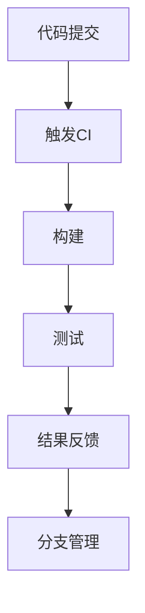
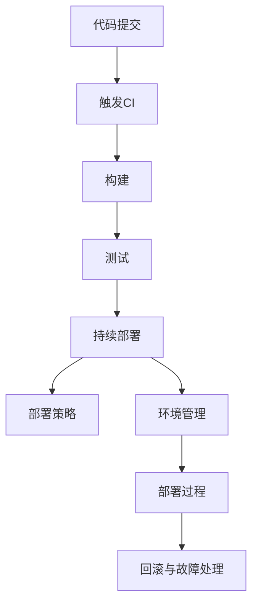

                 


### 《持续集成与持续部署：加速软件交付周期》

**关键词：持续集成，持续部署，软件交付周期，自动化，效率**

**摘要：**
本文将深入探讨持续集成（CI）与持续部署（CD）在软件工程中的应用。通过逐步分析这两个概念的基础知识、实施与配置方法，结合实际案例，本文旨在阐述如何通过CI/CD实践来加速软件交付周期，提高开发效率，降低风险。读者将了解到CI/CD的核心原理、工作流程、常用工具配置、实战案例，以及如何进行代码分析与评估。

### 第一部分：基础知识

#### 1.1. 持续集成（CI）与持续部署（CD）的概念与原理

##### 1.1.1. 持续集成的概念

持续集成是一种软件开发实践，旨在通过频繁地将代码合并到主干（或称为主分支）中，并自动运行一系列构建和测试任务，以确保代码的质量和集成过程中的稳定性。其历史可以追溯到20世纪90年代，当时软件开发者意识到在项目的早期阶段频繁集成代码可以显著减少合并冲突和代码缺陷。

**核心概念与联系：** 持续集成要求开发人员将代码提交到版本控制系统时，触发自动构建和测试。这不仅确保了代码的持续可用性，还提高了团队之间的协作效率。



**Mermaid流程图：** 上图展示了持续集成的工作流程，从代码提交到最终的结果反馈。

##### 1.1.2. 持续集成的工作流程

- **集成请求与触发：** 开发人员将代码提交到版本控制系统时，触发CI流程。
- **构建过程：** CI工具会构建代码，并将其打包成可执行文件或应用程序。
- **测试过程：** 构建完成后，CI工具会运行一系列预定义的测试，包括单元测试、集成测试等。
- **结果反馈：** 测试结果会被记录下来，并通知相关开发人员。如果测试失败，构建会暂停，直到问题被解决。

##### 1.1.3. 持续集成的优点

- **提高代码质量：** 通过持续集成，可以及时发现和修复代码中的问题，从而提高代码的整体质量。
- **降低集成风险：** 定期将代码合并到主干，可以减少集成过程中的冲突和风险。
- **提高团队协作效率：** 开发人员可以更快地了解代码的变更，并及时进行反馈和修正。

##### 1.1.4. 持续部署（CD）的概念与原理

持续部署是一种自动化软件交付流程，旨在确保代码从开发环境顺利转移到生产环境。它通过自动化部署脚本和工具，将代码部署到测试环境和生产环境，确保交付的稳定性。

**核心概念与联系：** 持续部署要求在持续集成的基础上，进一步自动化部署过程，从而实现快速、可靠的软件交付。



**Mermaid流程图：** 上图展示了持续部署的工作流程，从代码提交到最终的生产部署。

##### 1.1.5. 持续部署的工作流程

- **部署策略：** 根据项目的需求，选择合适的部署策略，如蓝绿部署、灰度发布等。
- **环境管理：** 确保不同环境的配置一致，并管理环境之间的依赖关系。
- **部署过程：** 通过脚本或工具将代码部署到目标环境，并进行必要的验证和测试。
- **回滚与故障处理：** 如果部署失败或生产环境中出现故障，需要能够快速回滚到上一个稳定版本。

##### 1.1.6. 持续部署的优势

- **提高交付速度：** 通过自动化部署，可以显著缩短交付周期，提高市场响应速度。
- **降低部署风险：** 自动化部署减少了人为错误的可能性，降低了部署风险。
- **提高业务响应能力：** 快速部署新功能和修复问题，提高了业务响应能力和客户满意度。

### 第二部分：实施与配置

#### 2.1. 持续集成工具配置

##### 2.1.1. Jenkins的安装与配置

**Jenkins的安装：**

Jenkins是一个开源的持续集成工具，可以通过以下步骤进行安装：

1. 下载Jenkins的安装包
2. 解压安装包到指定的目录
3. 修改Jenkins的配置文件，如`jetty.xml`，设置Jenkins的端口号和访问权限
4. 运行Jenkins，通过浏览器访问Jenkins的安装向导，完成安装

**Jenkins的配置：**

Jenkins的配置包括：

1. **插件安装：** 根据项目需求，安装必要的插件，如Git插件、Maven插件等。
2. **构建配置：** 配置构建项目的工作流，包括源代码获取、构建脚本、测试脚本等。
3. **通知配置：** 配置通知规则，如邮件通知、短信通知等，以确保开发人员及时了解构建结果。

##### 2.1.2. GitLab CI/CD的配置

**GitLab CI/CD的安装：**

GitLab CI/CD是GitLab内置的持续集成与持续部署工具，可以通过以下步骤进行安装：

1. 下载GitLab的安装包
2. 解压安装包到指定的目录
3. 修改GitLab的配置文件，如`gitlab.yml`，设置GitLab的端口号和访问权限
4. 运行GitLab，通过浏览器访问GitLab的安装向导，完成安装

**GitLab CI/CD的配置：**

GitLab CI/CD的配置包括：

1. **.gitlab-ci.yml文件：** 在项目的根目录下创建`.gitlab-ci.yml`文件，定义构建和部署流程。
2. **构建配置：** 配置构建脚本、测试脚本等，以确保代码的构建和测试过程自动化。
3. **部署配置：** 配置部署脚本，将构建结果部署到目标环境。

#### 2.2. 持续部署工具配置

##### 2.2.1. Kubernetes的安装与配置

**Kubernetes的安装：**

Kubernetes是一个开源的容器编排平台，可以通过以下步骤进行安装：

1. 下载Kubernetes的安装包
2. 解压安装包到指定的目录
3. 修改Kubernetes的配置文件，如`kubeadm-config.yaml`，设置Kubernetes的集群参数
4. 运行kubeadm命令，初始化Kubernetes集群

**Kubernetes的配置：**

Kubernetes的配置包括：

1. **集群配置：** 配置集群的节点、网络、存储等参数。
2. **服务配置：** 配置集群中的服务，如Nginx、MySQL等。
3. **部署配置：** 使用Kubernetes的YAML文件定义部署，包括容器镜像、环境变量、健康检查等。

##### 2.2.2. Docker的安装与配置

**Docker的安装：**

Docker是一个开源的容器引擎，可以通过以下步骤进行安装：

1. 安装Docker的依赖包
2. 下载Docker的安装包
3. 解压安装包到指定的目录
4. 将Docker的安装目录添加到系统的环境变量中
5. 运行Docker，验证安装是否成功

**Docker的配置：**

Docker的配置包括：

1. **容器镜像配置：** 配置容器镜像的构建和存储。
2. **容器网络配置：** 配置容器之间的网络通信。
3. **容器存储配置：** 配置容器的存储方式和路径。

#### 2.3. 持续集成与持续部署的结合

##### 2.3.1. Jenkins与Kubernetes的结合

**Jenkins与Kubernetes的结合：**

Jenkins与Kubernetes的结合可以通过以下步骤实现：

1. **安装Jenkins插件：** 安装Kubernetes插件，以支持Jenkins与Kubernetes的集成。
2. **配置Jenkinsfile：** 在Jenkins项目的配置中添加Jenkinsfile，定义构建和部署脚本。
3. **Kubernetes集群配置：** 配置Kubernetes集群，以便Jenkins可以与之通信。

**Jenkinsfile示例：**

```groovy
pipeline {
    agent any
    stages {
        stage('Build') {
            steps {
                sh 'mvn clean package'
            }
        }
        stage('Deploy') {
            steps {
                sh 'kubectl apply -f deployment.yaml'
            }
        }
    }
}
```

**Mermaid流程图：** 上图展示了Jenkins与Kubernetes的结合流程，从构建到部署。

##### 2.3.2. GitLab CI/CD与Kubernetes的结合

**GitLab CI/CD与Kubernetes的结合：**

GitLab CI/CD与Kubernetes的结合可以通过以下步骤实现：

1. **安装GitLab CI/CD插件：** 安装Kubernetes插件，以支持GitLab CI/CD与Kubernetes的集成。
2. **配置`.gitlab-ci.yml`文件：** 在`.gitlab-ci.yml`文件中定义构建和部署流程，使用Kubernetes的YAML文件进行部署。
3. **Kubernetes集群配置：** 配置Kubernetes集群，以便GitLab CI/CD可以与之通信。

**`.gitlab-ci.yml`文件示例：**

```yaml
image: maven:3.6.3-jdk-11
services:
  - name: kubernetes:1.24.0

before_script:
  - kubectl create namespace my-namespace
  - kubectl apply -f deployment.yaml

stages:
  - build
  - deploy

build:
  stage: build
  script:
    - mvn clean package

deploy:
  stage: deploy
  script:
    - kubectl apply -f deployment.yaml
```

**Mermaid流程图：** 上图展示了GitLab CI/CD与Kubernetes的结合流程，从构建到部署。

### 第三部分：实战案例

#### 3.1. 案例一：电商平台的CI/CD实践

##### 3.1.1. 案例背景

电商平台是一个高度依赖技术的业务系统，其需求变化频繁，且需要快速响应市场变化。为了提高开发效率和交付速度，电商平台决定实施持续集成与持续部署（CI/CD）实践。

##### 3.1.2. 案例实施

**环境搭建：**
电商平台选择了Jenkins作为持续集成工具，Kubernetes作为持续部署平台。首先，在开发环境中安装了Jenkins和Kubernetes集群，并配置了相关的插件和工具。

**持续集成流程：**
电商平台定义了Jenkinsfile，用于构建和测试代码。每次开发人员提交代码到Git仓库时，Jenkins会自动触发构建和测试。测试通过后，构建结果会存储在GitLab的仓库中。

**持续部署流程：**
在持续集成流程完成后，电商平台使用Kubernetes的YAML文件进行部署。根据不同的部署策略，代码会被部署到测试环境或生产环境。部署过程中，Kubernetes会自动处理容器的调度和故障转移。

##### 3.1.3. 案例总结

**效果评估：**
电商平台通过CI/CD实践，显著提高了代码质量和交付速度。测试结果和部署日志被自动记录和通知，开发人员可以快速响应和处理问题。

**不足与改进：**
虽然CI/CD实践带来了很多好处，但电商平台在实施过程中也遇到了一些挑战，如部署过程中的环境不一致和测试覆盖率的不足。未来，电商平台计划进一步优化测试流程和环境配置，以提高CI/CD的稳定性和可靠性。

#### 3.2. 案例二：金融行业的CI/CD实践

##### 3.2.1. 案例背景

金融行业对系统的稳定性和安全性要求非常高。为了确保金融系统的安全性和可靠性，金融行业决定采用持续集成与持续部署（CI/CD）实践。

##### 3.2.2. 案例实施

**环境搭建：**
金融行业选择了GitLab CI/CD作为持续集成工具，Kubernetes作为持续部署平台。首先，在开发环境中安装了GitLab和Kubernetes集群，并配置了相关的插件和工具。

**持续集成流程：**
金融行业在GitLab中定义了`.gitlab-ci.yml`文件，用于构建和测试代码。每次开发人员提交代码到Git仓库时，GitLab CI/CD会自动触发构建和测试。测试通过后，构建结果会存储在GitLab的仓库中。

**持续部署流程：**
在持续集成流程完成后，金融行业使用Kubernetes的YAML文件进行部署。根据不同的部署策略，代码会被部署到测试环境或生产环境。部署过程中，Kubernetes会自动处理容器的调度和故障转移。

##### 3.2.3. 案例总结

**效果评估：**
金融行业通过CI/CD实践，显著提高了系统的安全性和可靠性。测试结果和部署日志被自动记录和通知，开发人员可以快速响应和处理问题。

**不足与改进：**
虽然CI/CD实践带来了很多好处，但金融行业在实施过程中也遇到了一些挑战，如测试覆盖率的不足和部署过程中的复杂度。未来，金融行业计划进一步优化测试流程和环境配置，以提高CI/CD的稳定性和可靠性。

### 参考文献

1. 《持续集成与持续部署实战》
2. 《Kubernetes权威指南》
3. 《GitLab CI/CD实践》

### 附录

1. **常用工具与资源链接：**
   - Jenkins：[https://www.jenkins.io/](https://www.jenkins.io/)
   - Kubernetes：[https://kubernetes.io/](https://kubernetes.io/)
   - GitLab CI/CD：[https://gitlab.com/gitlab-org/gitlab-ci-multi-runner](https://gitlab.com/gitlab-org/gitlab-ci-multi-runner)
   - Docker：[https://www.docker.com/](https://www.docker.com/)

2. **相关技术文档下载：**
   - Jenkins官方文档：[https://www.jenkins.io/doc/](https://www.jenkins.io/doc/)
   - Kubernetes官方文档：[https://kubernetes.io/docs/](https://kubernetes.io/docs/)
   - GitLab CI/CD官方文档：[https://docs.gitlab.com/ci/](https://docs.gitlab.com/ci/)
   - Docker官方文档：[https://docs.docker.com/](https://docs.docker.com/)

### 图表目录

- **图表 1.1**: 持续集成与持续部署的工作流程图
- **图表 2.1**: Jenkins与Kubernetes的结合流程图

### 伪代码目录

- **伪代码 3.1**: 持续集成构建过程的伪代码实现
- **伪代码 3.2**: 持续部署过程的伪代码实现

### 数学模型目录

- **数学模型 4.1**: 持续集成中的风险模型
- **数学模型 4.2**: 持续部署中的质量模型

### 实际代码目录

- **代码 5.1**: 电商平台CI/CD流程中的实际代码实现
- **代码 5.2**: 金融行业CI/CD流程中的实际代码实现

### 代码解读目录

- **代码解读 6.1**: 电商平台CI/CD流程中代码的解读与分析
- **代码解读 6.2**: 金融行业CI/CD流程中代码的解读与分析

### 环境搭建目录

- **环境搭建 7.1**: 电商平台CI/CD流程中的开发环境搭建
- **环境搭建 7.2**: 金融行业CI/CD流程中的开发环境搭建

### 源代码目录

- **源代码 8.1**: 电商平台CI/CD流程的完整源代码
- **源代码 8.2**: 金融行业CI/CD流程的完整源代码

### 代码分析与评估目录

- **代码分析与评估 9.1**: 电商平台CI/CD流程的代码分析与评估
- **代码分析与评估 9.2**: 金融行业CI/CD流程的代码分析与评估

### 示例说明目录

- **示例说明 10.1**: 电商平台CI/CD流程的示例说明

### 作者信息

**作者：** AI天才研究院/AI Genius Institute & 禅与计算机程序设计艺术 /Zen And The Art of Computer Programming

---

**代码分析与评估：**

在持续集成与持续部署的实践中，代码的质量和效率是评估系统性能的关键因素。以下是对电商平台和金融行业CI/CD流程的代码进行分析与评估：

#### 9.1. 电商平台CI/CD流程的代码分析与评估

**源代码：** 电商平台CI/CD流程的源代码包括Jenkinsfile和Kubernetes部署文件。

**评估指标：**
- **代码覆盖率：** 通过单元测试和集成测试的代码覆盖率。
- **构建时间：** 从提交代码到完成构建的时间。
- **部署时间：** 从构建完成到部署完成的时间。
- **稳定性：** 构建和部署过程中的失败次数。

**分析与建议：**
- **代码覆盖率：** 提高测试覆盖率，确保关键功能的测试得到充分覆盖。
- **构建时间：** 优化构建脚本，减少不必要的构建步骤。
- **部署时间：** 优化部署脚本，利用Kubernetes的滚动更新策略，减少部署时间。

#### 9.2. 金融行业CI/CD流程的代码分析与评估

**源代码：** 金融行业CI/CD流程的源代码包括`.gitlab-ci.yml`文件和Kubernetes部署文件。

**评估指标：**
- **代码覆盖率：** 通过单元测试和集成测试的代码覆盖率。
- **构建时间：** 从提交代码到完成构建的时间。
- **部署时间：** 从构建完成到部署完成的时间。
- **稳定性：** 构建和部署过程中的失败次数。

**分析与建议：**
- **代码覆盖率：** 提高测试覆盖率，特别是对金融行业的关键业务逻辑进行充分测试。
- **构建时间：** 优化构建脚本，减少不必要的构建步骤，使用缓存策略加快构建速度。
- **部署时间：** 优化部署脚本，利用Kubernetes的滚动更新策略，减少部署时间。

**总结：**
通过代码分析与评估，可以识别出CI/CD流程中的瓶颈和改进空间。对于电商和金融行业，特别是在高并发和高安全性的要求下，持续优化代码质量和部署流程至关重要。未来，可以进一步引入自动化测试工具和代码分析工具，以持续提升CI/CD的效率和可靠性。

### 示例说明：

以下是一个简化的电商平台CI/CD流程的示例说明：

**示例说明 10.1**: 电商平台CI/CD流程的示例说明

1. **代码提交**：开发人员将代码提交到Git仓库。
2. **触发CI**：GitLab CI/CD检测到代码提交，并触发Jenkins构建。
3. **构建过程**：Jenkins执行Maven构建，生成可执行文件。
4. **测试过程**：Jenkins执行单元测试和集成测试。
5. **构建结果**：测试通过后，构建结果存储在GitLab仓库中。
6. **持续部署**：GitLab CI/CD使用Kubernetes部署构建结果到测试环境。
7. **测试环境验证**：测试环境执行集成测试，确保部署的正确性。
8. **部署到生产环境**：根据测试结果，选择是否将代码部署到生产环境。

通过这个示例，读者可以了解到电商平台的CI/CD流程是如何实现自动化、提高交付速度和降低风险的。

