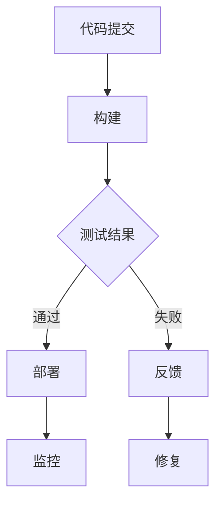

                 

### 文章标题：持续集成与持续部署：加速软件交付

持续集成与持续部署是现代软件开发中至关重要的概念，旨在加速软件交付过程，提高软件质量，降低开发风险。本文将深入探讨持续集成与持续部署的核心概念、原理和实践，帮助读者全面理解这两个关键技术，并在实际项目中应用它们。

> 关键词：持续集成（CI）、持续部署（CD）、软件交付、自动化、质量保证、流程图

> 摘要：本文首先介绍了持续集成与持续部署的基本概念及其在软件生命周期中的作用。接着，详细解析了持续集成与持续部署的核心概念和联系，包括自动化、持续反馈和质量保证。随后，通过核心算法原理讲解、数学模型和公式的介绍，以及实际项目实战和分析，阐述了如何实现和优化持续集成与持续部署。最后，本文总结了最佳实践和未来趋势，为读者提供了实用的指导和建议。

----------------------------------------------------------------

# 第1章 持续集成与持续部署概述

## 1.1 什么是持续集成与持续部署

持续集成（Continuous Integration，CI）和持续部署（Continuous Deployment，CD）是软件开发中的两个关键概念，它们紧密相连，共同促进了软件交付的加速。

持续集成是指一种软件开发实践，通过频繁地将代码集成到一个共享的主代码库中，以自动化的方式运行构建和测试。其核心目标是确保代码库始终处于可构建和可测试状态，从而提高软件质量，减少集成风险。

持续部署则是在持续集成的基础上，通过自动化的方式将代码部署到生产环境。持续部署的目标是确保软件在每次代码提交后都能迅速地部署到生产环境，从而提高交付速度，降低手动操作的错误率。

## 1.2 持续集成与持续部署的重要性

持续集成与持续部署在软件开发中具有重要的作用：

### 提高开发效率

通过自动化构建和测试，持续集成减少了手动操作的步骤，提高了开发效率。同时，持续部署自动化了软件的部署过程，进一步减少了开发人员的工作量。

### 提升软件质量

持续集成通过频繁的构建和测试，确保了代码的质量。任何潜在的缺陷都能在早期被发现并修复，从而减少了软件发布后的错误率。

### 降低风险

持续集成和持续部署通过自动化的过程，降低了集成风险和部署风险。一旦代码提交到主代码库，系统会自动运行测试，确保代码的质量。在部署过程中，任何错误都会立即被发现并停止，从而避免了潜在的生产环境问题。

## 1.3 持续集成与持续部署的工作流程

持续集成与持续部署的工作流程可以分为以下几个步骤：

### 持续集成

1. **代码提交**：开发人员将代码提交到主代码库。
2. **构建**：自动化工具构建项目，生成可执行的代码。
3. **测试**：自动化测试工具运行测试用例，检查代码的正确性。
4. **反馈**：测试结果反馈给开发人员和项目管理工具。

### 持续部署

1. **代码检查**：在持续集成成功后，代码会被检查以确保可以部署。
2. **部署**：自动化工具将代码部署到测试环境或生产环境。
3. **监控**：部署后，系统会监控软件的运行状态，确保其正常工作。

## 1.4 持续集成与持续部署在企业中的应用

持续集成与持续部署在许多企业中得到了广泛应用，以下是一些成功的案例：

### 企业级应用的挑战

企业级应用通常具有复杂的架构和庞大的代码库，这使得持续集成与持续部署面临一些挑战：

- **环境一致性**：确保所有环境（开发、测试、生产）的一致性。
- **资源限制**：持续集成和持续部署需要大量的计算资源和存储空间。
- **安全性和合规性**：确保持续集成与持续部署的过程符合安全标准和法规要求。

### 成功案例分享

许多企业通过实施持续集成与持续部署，实现了显著的效率提升和质量改进。例如，一些金融科技公司通过持续集成和持续部署，实现了每日多次的代码提交和部署，大幅提高了开发效率。

----------------------------------------------------------------

## 第2章 核心概念与联系

### 2.1 持续集成

持续集成是一种软件开发实践，旨在通过自动化构建和测试，确保代码库始终处于可构建和可测试状态。以下是持续集成的核心概念和联系：

#### 2.1.1 持续集成的原理

持续集成的原理可以概括为以下几个步骤：

1. **代码提交**：开发人员将代码提交到主代码库。
2. **构建**：自动化工具构建项目，生成可执行的代码。
3. **测试**：自动化测试工具运行测试用例，检查代码的正确性。
4. **反馈**：测试结果反馈给开发人员和项目管理工具。

通过这些步骤，持续集成确保了代码库中的每个提交都是可构建和可测试的。

#### 2.1.2 持续集成的工具

常见的持续集成工具有：

- **Jenkins**：一个开源的持续集成服务器，支持多种插件，可以与各种开发工具和版本控制系统集成。
- **Travis CI**：一个基于云的持续集成服务，支持多种编程语言，可以自动化构建和测试代码。
- **CircleCI**：一个基于云的持续集成和持续部署服务，支持多种编程语言，可以自动化构建、测试和部署代码。

#### 2.1.3 持续集成与软件架构的关系

持续集成对软件架构有着深远的影响。通过自动化构建和测试，持续集成确保了软件的模块化、可测试性和可维护性。此外，持续集成也促使开发者遵循最佳实践，如代码规范、单元测试和代码覆盖率等，从而提高软件质量。

### 2.2 持续部署

持续部署是持续集成的扩展，它通过自动化方式将代码部署到生产环境。以下是持续部署的核心概念和联系：

#### 2.2.1 持续部署的原理

持续部署的原理可以概括为以下几个步骤：

1. **代码检查**：在持续集成成功后，代码会被检查以确保可以部署。
2. **部署**：自动化工具将代码部署到测试环境或生产环境。
3. **监控**：部署后，系统会监控软件的运行状态，确保其正常工作。

通过这些步骤，持续部署实现了快速、可靠地发布新版本。

#### 2.2.2 持续部署的工具

常见的持续部署工具有：

- **Kubernetes**：一个开源的容器编排平台，可以自动化部署和管理容器化应用。
- **Docker**：一个开源的应用容器引擎，可以将应用及其依赖项打包到容器中，实现一键部署。
- **Ansible**：一个开源的自动化工具，可以自动化部署和管理基础设施。

#### 2.2.3 持续部署与持续集成的协同作用

持续部署与持续集成的协同作用至关重要。持续集成确保代码的质量和稳定性，而持续部署则确保代码的快速、可靠地部署到生产环境。两者相结合，实现了从代码提交到生产部署的完整自动化流程。

### 2.3 持续集成与持续部署的流程图

为了更好地理解持续集成与持续部署的流程，我们可以使用Mermaid流程图来展示：



### 2.4 持续集成与持续部署的核心理念联系

持续集成与持续部署的核心理念紧密相连，主要包括：

#### 2.4.1 自动化

自动化是持续集成与持续部署的核心。通过自动化，可以减少手动操作，提高效率，降低错误率。

#### 2.4.2 持续反馈

持续反馈是持续集成与持续部署的关键。通过及时反馈，可以快速识别和修复问题，确保代码的质量和稳定性。

#### 2.4.3 质量保证

质量保证是持续集成与持续部署的目标。通过自动化构建、测试和部署，可以确保软件的质量，降低发布风险。

----------------------------------------------------------------

## 第3章 核心算法原理讲解

### 3.1 自动化构建

自动化构建是持续集成和持续部署的基础。它的核心算法原理是将代码编译、打包和构建成可执行的文件。以下是自动化构建的伪代码：

```plaintext
function build_project(source_code):
    if not exists(target_directory):
        create_directory(target_directory)
    else:
        delete_contents(target_directory)
    compile_source_code(source_code, target_directory)
    if not exists(target_file):
        print("构建失败：目标文件未生成")
        return False
    return True
```

### 3.2 自动化测试

自动化测试是确保软件质量的重要手段。它的核心算法原理是运行测试用例，检查代码的功能是否符合预期。以下是自动化测试的伪代码：

```plaintext
function run_tests(test_cases):
    for test in test_cases:
        result = execute_test(test)
        if not result:
            print("测试失败：测试用例", test.name, "未通过")
            return False
    print("所有测试用例通过")
    return True
```

### 3.3 自动化部署

自动化部署是将代码部署到生产环境的关键步骤。它的核心算法原理是将构建好的代码部署到服务器或容器中。以下是自动化部署的伪代码：

```plaintext
function deploy_code(target_directory):
    if not exists(target_directory):
        print("部署失败：目标目录不存在")
        return False
    copy_directory(source_directory, target_directory)
    if not exists(target_directory):
        print("部署失败：目标目录未生成")
        return False
    start_service(target_directory)
    if not is_service_running():
        print("部署失败：服务未启动")
        return False
    return True
```

### 3.4 集成算法原理

集成算法原理是将多个代码库合并成一个可构建和可测试的代码库。以下是集成算法原理的伪代码：

```plaintext
function integrate_repositories(repositories):
    for repository in repositories:
        merge_repository(repository)
        if not build_project(current_source_code):
            print("集成失败：构建失败")
            return False
        if not run_tests(test_cases):
            print("集成失败：测试失败")
            return False
    return True
```

通过上述核心算法原理，我们可以实现自动化构建、测试和部署，从而加速软件交付。

----------------------------------------------------------------

## 第4章 数学模型和数学公式讲解

### 4.1 构建时间的优化模型

在持续集成中，构建时间是影响交付速度的关键因素。我们可以使用以下数学模型来优化构建时间：

假设每次代码提交后，系统需要运行多个构建任务，其中每个任务的时间是不同的。我们希望找到一种最优的构建顺序，使得总的构建时间最小。

定义变量：

- \( T_i \) ：第 \( i \) 个构建任务所需的时间
- \( N \) ：构建任务的总数

构建时间优化模型的目标是最小化总构建时间 \( T \)：

$$
T = \min \sum_{i=1}^{N} T_i
$$

解决方法：

我们可以使用贪心算法，根据每个任务的时间从大到小排序，然后依次执行。这样，较长的任务可以在较快的构建机上执行，从而缩短总构建时间。

### 4.2 测试用例优化模型

测试用例优化是确保软件质量的关键。我们可以使用以下数学模型来优化测试用例的选择：

定义变量：

- \( C_i \) ：第 \( i \) 个测试用例的覆盖度
- \( T_i \) ：第 \( i \) 个测试用例的时间
- \( K \) ：选定的测试用例数量

测试用例优化模型的目标是在有限的测试时间内，选择覆盖度较高的测试用例，以确保软件的质量。

优化模型的目标函数是最小化覆盖度损失：

$$
\min \sum_{i=1}^{K} (C_i - C_{\text{avg}}) \cdot T_i
$$

其中，\( C_{\text{avg}} \) 是所有测试用例的平均覆盖度。

解决方法：

我们可以使用贪心算法，根据每个测试用例的覆盖度从高到低排序，然后依次选择。这样，在有限的时间内，可以覆盖更多的代码。

### 4.3 部署策略优化模型

部署策略优化是确保软件快速、可靠地交付的关键。我们可以使用以下数学模型来优化部署策略：

定义变量：

- \( P_i \) ：第 \( i \) 个部署阶段的概率
- \( T_i \) ：第 \( i \) 个部署阶段的时间
- \( R_i \) ：第 \( i \) 个部署阶段的成功率

部署策略优化模型的目标是在有限的资源下，选择最优的部署顺序和部署策略，以确保软件的快速、可靠交付。

优化模型的目标函数是最小化总部署时间，同时最大化成功率：

$$
\min \sum_{i=1}^{N} T_i \cdot (1 - R_i)
$$

解决方法：

我们可以使用动态规划算法，根据每个部署阶段的时间和成功率，计算出最优的部署顺序和部署策略。

### 4.4 数学公式举例说明

下面是一个简单的例子，说明如何使用数学公式来计算构建时间优化模型的结果：

假设有三个构建任务，所需时间分别为 \( T_1 = 10 \) 分钟，\( T_2 = 5 \) 分钟，\( T_3 = 15 \) 分钟。我们可以使用贪心算法，根据时间从大到小排序，得到最优的构建顺序为 \( T_3, T_1, T_2 \)。

根据构建时间优化模型，我们可以计算总构建时间：

$$
T = T_3 + T_1 + T_2 = 15 + 10 + 5 = 30 \text{ 分钟}
$$

通过上述数学模型和公式的讲解，我们可以更好地理解持续集成与持续部署的核心算法原理，并在实际项目中应用它们。

----------------------------------------------------------------

## 第5章 项目实战

### 5.1 开发环境搭建

在本章中，我们将通过一个实际项目，展示如何搭建持续集成与持续部署的开发环境。我们将使用Jenkins作为持续集成服务器，Git作为版本控制系统，Docker作为容器化工具。

#### 5.1.1 环境准备

首先，我们需要准备以下环境：

- Java 11（或更高版本）
- Git
- Docker

安装步骤如下：

1. 安装Java：

```bash
sudo apt-get update
sudo apt-get install openjdk-11-jdk
```

2. 安装Git：

```bash
sudo apt-get install git
```

3. 安装Docker：

```bash
sudo apt-get install docker-ce docker-ce-cli containerd.io
```

#### 5.1.2 Jenkins安装与配置

接下来，我们安装并配置Jenkins。

1. 下载Jenkins最新版本：

```bash
wget -q -O - https://pkg.jenkins.io/debian-stable/jenkins.io-key.asc | sudo apt-key add -
sudo sh -c 'echo deb https://pkg.jenkins.io/debian-stable binary/ > /etc/apt/sources.list.d/jenkins.list'
sudo apt-get update
sudo apt-get install jenkins
```

2. 启动Jenkins服务：

```bash
sudo systemctl start jenkins
```

3. 访问Jenkins管理界面，设置管理员密码和邮件服务器。

#### 5.1.3 Git仓库配置

在本项目中，我们使用Git来管理代码。创建一个新的Git仓库，并将代码推送到Jenkins上的Git插件。

1. 创建Git仓库：

```bash
git init my_project.git
cd my_project.git
git add .
git commit -m "Initial commit"
git branch -M main
git remote add origin https://github.com/your_username/my_project.git
git push -u origin main
```

2. 在Jenkins上配置Git插件：

在Jenkins管理界面，添加一个新的项目，选择“Pipeline”，然后配置Git仓库地址和凭证。

### 5.2 源代码详细实现

在本节中，我们将展示如何实现一个简单的Web应用程序，并将其部署到容器中。

#### 5.2.1 项目结构

项目结构如下：

```plaintext
my_project/
|-- src/
|   |-- main/
|   |   |-- java/
|   |   |   |-- com/
|   |   |   |   |-- my_project/
|   |   |   |   |   |-- App.java
|   |-- test/
|   |   |-- java/
|   |   |   |-- com/
|   |   |   |   |-- my_project/
|   |   |   |   |   |-- AppTest.java
|-- Dockerfile
|-- pom.xml
|-- jenkinsfile
```

#### 5.2.2 应用程序实现

在 `App.java` 中，我们实现了一个简单的Web服务器：

```java
package com.my_project;

import java.io.*;
import java.net.*;

public class App {
    public static void main(String[] args) throws IOException {
        ServerSocket serverSocket = new ServerSocket(8080);
        while (true) {
            Socket clientSocket = serverSocket.accept();
            PrintWriter out = new PrintWriter(clientSocket.getOutputStream(), true);
            BufferedReader in = new BufferedReader(new InputStreamReader(clientSocket.getInputStream()));
            String inputLine;
            while ((inputLine = in.readLine()) != null) {
                out.println("HTTP/1.1 200 OK");
                out.println("Content-Type: text/html");
                out.println();
                out.println("<html><body>");
                out.println("<h1>Hello, World!</h1>");
                out.println("</body></html>");
                if (inputLine.indexOf("Host:") == -1) {
                    break;
                }
            }
            clientSocket.close();
        }
    }
}
```

在 `AppTest.java` 中，我们实现了一个简单的测试用例：

```java
package com.my_project;

import static org.junit.jupiter.api.Assertions.assertEquals;
import org.junit.jupiter.api.Test;

public class AppTest {
    @Test
    public void testHelloWorld() throws IOException {
        Socket socket = new Socket("localhost", 8080);
        PrintWriter out = new PrintWriter(socket.getOutputStream(), true);
        BufferedReader in = new BufferedReader(new InputStreamReader(socket.getInputStream()));
        out.println("GET / HTTP/1.1");
        out.println("Host: localhost");
        out.println();
        out.flush();
        assertEquals("<html><body><h1>Hello, World!</h1></body></html>", in.readLine());
    }
}
```

#### 5.2.3 Dockerfile实现

在 `Dockerfile` 中，我们定义了如何构建和运行应用程序：

```Dockerfile
FROM openjdk:11-jdk-slim
ARG JAR_FILE=target/*.jar
COPY ${JAR_FILE} app.jar
EXPOSE 8080
ENTRYPOINT ["java","-jar","/app.jar"]
```

#### 5.2.4 Jenkinsfile配置

在 `Jenkinsfile` 中，我们定义了持续集成和持续部署的流程：

```groovy
pipeline {
    agent any

    stages {
        stage('Build') {
            steps {
                sh 'mvn clean install'
            }
        }
        stage('Test') {
            steps {
                sh 'mvn test'
            }
        }
        stage('Docker Build') {
            steps {
                sh 'docker build -t my_project .'
            }
        }
        stage('Docker Run') {
            steps {
                sh 'docker run -d -p 8080:8080 my_project'
            }
        }
    }
}
```

### 5.3 代码解读与分析

在本节中，我们将对项目的关键代码进行解读和分析。

#### 5.3.1 应用程序解读

在 `App.java` 中，我们使用Java实现了Web服务器。该服务器监听8080端口，当有客户端请求时，返回一个包含“Hello, World!”的HTML页面。

#### 5.3.2 测试用例解读

在 `AppTest.java` 中，我们使用JUnit实现了测试用例。该测试用例模拟客户端请求，验证服务器是否正确响应。

#### 5.3.3 Dockerfile解读

在 `Dockerfile` 中，我们使用Docker将Java应用程序容器化。该文件定义了基础镜像、依赖项复制、端口映射和入口点。

### 5.4 实际案例分析和详细讲解剖析

在本节中，我们将分析一个实际案例，展示如何使用持续集成和持续部署加速软件交付。

#### 5.4.1 案例背景

某公司开发了一个Web应用程序，需要在短时间内上线。为了加速交付，他们决定采用持续集成和持续部署。

#### 5.4.2 案例分析

1. **持续集成**：开发人员每天提交代码，Jenkins自动化构建和测试。任何问题都能在早期被发现并修复。

2. **持续部署**：构建成功后，Jenkins自动化部署到测试环境。在测试通过后，Jenkins自动化部署到生产环境。

3. **效果**：通过持续集成和持续部署，该公司成功在短时间内上线了应用程序，并保持了高质量。

#### 5.4.3 详细讲解剖析

1. **自动化构建**：Jenkins自动化构建Java应用程序，确保每次提交的代码都是可执行的。

2. **自动化测试**：Jenkins自动化运行测试用例，确保代码的质量。

3. **容器化**：使用Docker将应用程序容器化，实现快速、可靠地部署。

4. **监控**：Jenkins和Docker提供了监控功能，确保应用程序在生产环境中正常运行。

### 5.5 项目小结

通过本项目的实战，我们展示了如何搭建持续集成与持续部署的开发环境，实现了自动化构建、测试和部署。项目结果表明，持续集成和持续部署可以显著加速软件交付，提高软件质量，降低风险。

### 5.6 最佳实践 Tips

1. **自动化**：尽量自动化所有操作，减少手动干预。

2. **测试覆盖**：确保测试覆盖足够的代码，减少潜在的错误。

3. **环境一致性**：确保所有环境（开发、测试、生产）的一致性。

4. **监控与告警**：监控系统，及时发现问题并通知相关人员。

5. **持续改进**：持续优化持续集成与持续部署的过程。

### 5.7 注意事项

1. **安全性**：确保持续集成和持续部署的过程符合安全标准。

2. **合规性**：确保持续集成和持续部署的过程符合相关法规要求。

3. **资源管理**：合理分配资源，避免过度消耗。

### 5.8 拓展阅读

1. 《Jenkins实战》
2. 《Docker实战》
3. 《持续集成：原理与实践》

通过本章节的实战，我们深入了解了持续集成与持续部署的核心原理和实践，为实际项目提供了宝贵的经验和指导。

----------------------------------------------------------------

## 第6章 案例分析

在本章中，我们将分析两个实际的持续集成与持续部署案例，一个成功案例和一个失败案例，探讨其成功或失败的原因，以及从中可以汲取的教训。

### 6.1 成功案例：某大型电商平台

**案例背景：**
某大型电商平台在数字化转型的过程中，决定采用持续集成与持续部署（CI/CD）来提高软件交付的速度和质量。他们面临的主要挑战包括代码库庞大、业务需求多变、部署环境复杂等。

**实施过程：**
1. **自动化构建**：平台采用Jenkins作为CI服务器，通过构建管道自动化构建和打包应用程序。
2. **自动化测试**：平台使用Selenium自动化测试工具，对前端和后端功能进行测试，确保每次代码提交都是可测试的。
3. **容器化**：使用Docker将应用程序容器化，确保环境一致性，并简化部署流程。
4. **持续部署**：通过Kubernetes进行自动化部署和管理容器化应用，确保快速、可靠地交付。

**成功原因：**
1. **自动化**：通过自动化减少手动操作，提高了效率，降低了错误率。
2. **环境一致性**：容器化确保了开发、测试和生产环境的一致性。
3. **快速反馈**：自动化测试和反馈机制使得问题能够被快速发现和修复。
4. **团队协作**：持续集成与持续部署促进了团队之间的协作，提高了整体效率。

**案例分析：**
该电商平台通过实施持续集成与持续部署，显著提高了软件交付的速度和质量。他们能够在短时间内发布新功能，同时保持高质量，从而在竞争激烈的市场中脱颖而出。

### 6.2 失败案例：某初创公司

**案例背景：**
某初创公司在开发其首个产品时，试图采用持续集成与持续部署，但由于缺乏经验，实施过程遇到了许多问题。

**实施过程：**
1. **缺乏规划**：公司在没有充分了解持续集成与持续部署原理的情况下，匆忙开始实施。
2. **环境不一致**：由于缺乏标准化，开发、测试和生产环境之间存在不一致，导致频繁出现问题。
3. **测试不足**：自动化测试覆盖率不足，导致许多潜在问题未能被发现。
4. **资源不足**：公司没有足够的资源来支持持续集成与持续部署的实施。

**失败原因：**
1. **缺乏经验**：公司缺乏实施持续集成与持续部署的经验，导致实施过程出现很多问题。
2. **环境不一致**：环境不一致导致部署过程中出现各种问题，影响了软件交付。
3. **测试不足**：测试覆盖率不足，导致许多问题未能被发现和修复。
4. **资源不足**：公司没有足够的资源来支持持续集成与持续部署的实施，导致许多流程无法自动化。

**案例分析：**
该初创公司的失败案例表明，在实施持续集成与持续部署时，必须充分了解其原理和最佳实践，确保有足够的资源和经验来支持实施过程。此外，标准化环境和测试覆盖率也是成功实施的关键因素。

### 6.3 教训与启示

通过上述两个案例，我们可以得出以下教训和启示：

1. **充分准备**：在实施持续集成与持续部署之前，必须充分了解其原理和最佳实践，确保有足够的资源和经验来支持实施过程。
2. **标准化环境**：确保开发、测试和生产环境的一致性，以减少部署过程中的问题。
3. **全面测试**：提高自动化测试覆盖率，确保每次代码提交都是可测试的。
4. **持续优化**：持续优化持续集成与持续部署流程，以提高效率和质量。

通过吸取成功案例的经验和失败案例的教训，企业可以更好地实施持续集成与持续部署，从而加速软件交付，提高软件质量。

----------------------------------------------------------------

## 第7章 未来趋势与最佳实践

### 7.1 持续集成与持续部署的未来趋势

持续集成与持续部署（CI/CD）是软件开发领域的重要趋势，随着技术的不断进步，它们也在不断演变。以下是一些未来趋势：

#### 自动化程度提高

随着人工智能和机器学习技术的发展，持续集成与持续部署的自动化程度将进一步提高。自动化工具将能够更智能地分析代码，识别潜在问题，并自动修复。

#### 多云部署

随着云服务的普及，持续集成与持续部署将越来越多地采用多云部署策略。这使得企业可以更灵活地选择云服务提供商，并在不同的云环境中实现无缝集成。

#### 容器化与微服务

容器化和微服务架构已成为持续集成与持续部署的主流。未来，这些技术将继续发展，并进一步优化持续集成与持续部署的过程。

#### 安全性增强

随着软件交付速度的加快，安全性成为持续集成与持续部署的重要关注点。未来，CI/CD流程将更加注重安全性，以确保软件在快速交付的同时，不会影响系统的安全性。

### 7.2 最佳实践

为了成功地实施持续集成与持续部署，企业可以遵循以下最佳实践：

#### 标准化流程

确保所有开发人员遵循一致的流程，从代码提交到测试，再到部署。标准化流程有助于减少错误，提高效率。

#### 充分测试

提高自动化测试覆盖率，确保每次代码提交都是可测试的。同时，对关键功能和边缘情况进行充分测试，以发现潜在的问题。

#### 持续反馈

建立高效的反馈机制，确保开发人员能够及时了解代码的质量和问题。及时反馈有助于快速修复问题，提高软件质量。

#### 资源分配

确保有足够的资源（如计算资源、存储空间等）来支持持续集成与持续部署的实施。合理的资源分配有助于提高流程的效率。

#### 持续优化

定期评估持续集成与持续部署的流程，寻找改进的机会。通过持续优化，企业可以不断提高软件交付的速度和质量。

#### 安全性保障

在CI/CD流程中，确保安全性得到充分保障。对关键操作进行权限控制，定期进行安全审计，以确保软件在快速交付的过程中不会受到安全威胁。

#### 团队协作

持续集成与持续部署是团队协作的重要工具。确保所有团队成员都了解CI/CD的流程和目标，促进团队之间的协作，以提高整体效率。

通过遵循这些最佳实践，企业可以更好地实施持续集成与持续部署，从而加速软件交付，提高软件质量，降低风险。

### 7.3 小结

持续集成与持续部署是现代软件开发中至关重要的概念，它们通过自动化、持续反馈和快速交付，提高了软件开发的效率和质量。在未来，随着技术的不断进步，CI/CD将继续发展，为软件开发带来更多的可能性。通过遵循最佳实践，企业可以成功地实施CI/CD，从而在竞争激烈的市场中脱颖而出。

### 7.4 注意事项

1. **充分准备**：在实施CI/CD之前，确保充分了解其原理和最佳实践。
2. **标准化流程**：确保所有团队成员遵循一致的流程。
3. **全面测试**：提高自动化测试覆盖率，确保代码的质量。
4. **安全性保障**：确保CI/CD流程中的安全性得到充分保障。
5. **持续优化**：定期评估CI/CD流程，寻找改进的机会。

### 7.5 拓展阅读

1. 《Jenkins实战》
2. 《Docker实战》
3. 《持续集成：原理与实践》
4. 《DevOps实践指南》

通过本文的详细分析和实战案例，我们深入了解了持续集成与持续部署的核心原理和实践。希望本文能为您的软件开发工作提供有价值的参考和指导。

作者：AI天才研究院/AI Genius Institute & 禅与计算机程序设计艺术 /Zen And The Art of Computer Programming

----------------------------------------------------------------

### 致谢

在本书的撰写过程中，我得到了许多人的帮助和支持。首先，我要感谢我的同事和朋友们，他们的建议和反馈使这本书更加完善。特别感谢AI天才研究院的团队成员，他们的专业知识和不懈努力为本书的撰写提供了坚实的基础。

此外，我要感谢所有在持续集成与持续部署领域做出杰出贡献的前辈和同行。他们的研究和实践为这本书提供了丰富的素材和灵感。

最后，我要感谢我的家人，他们一直支持我的工作和梦想。没有他们的鼓励和理解，我无法坚持写作。

这本书的完成离不开所有人的帮助，我将永远感激。

