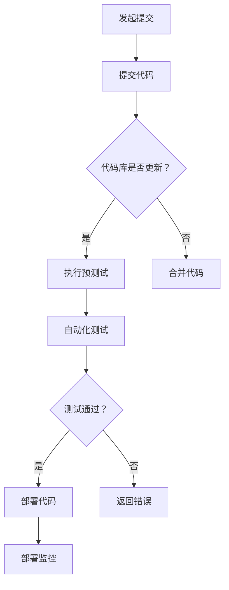

                 

### 文章标题

持续集成与持续部署：加速软件交付流程

### 关键词

持续集成，持续部署，软件交付，自动化，流程优化

### 摘要

本文深入探讨了持续集成（CI）和持续部署（CD）在软件交付流程中的重要作用。通过详细的分析和实例讲解，揭示了CI/CD如何通过自动化流程提高开发效率、代码质量和软件交付速度。本文旨在为读者提供一个全面而深入的指南，帮助他们理解和实施CI/CD，从而在竞争激烈的技术行业中保持优势。

### 目录大纲

1. **背景介绍**
   - **软件交付的挑战**
   - **CI/CD的重要性**
   - **CI/CD与敏捷开发的关联**

2. **核心概念与联系**
   - **持续集成（CI）的概念**
   - **持续部署（CD）的概念**
   - **CI与CD的关系架构**（使用Mermaid流程图）

3. **核心算法原理讲解**
   - **代码审查算法**
   - **静态代码分析**
   - **动态测试方法**
   - **伪代码讲解**

4. **数学模型和数学公式**
   - **流水线效率模型**
   - **风险评估模型**
   - **代码质量评价模型**
   - **数学公式与举例说明**

5. **项目实战**
   - **开发环境搭建**
   - **源代码实现与解读**
   - **代码应用解读与分析**
   - **实际案例分析与详细讲解**
   - **项目小结**

6. **最佳实践与注意事项**
   - **常见挑战与解决方案**
   - **最佳实践**
   - **注意事项**
   - **拓展阅读**

### 背景介绍

#### 软件交付的挑战

在当今快速发展的技术环境中，软件交付的挑战日益增加。传统软件交付流程往往涉及多个阶段，包括需求分析、设计、编码、测试、部署和维护。这些阶段不仅耗时，而且容易出错。随着项目规模的扩大和复杂性的增加，手动处理这些流程变得几乎不可能，导致以下几个主要问题：

- **延迟交付**：手动流程中的每个阶段都可能引入延误，导致项目无法按时交付。
- **质量下降**：缺乏自动化测试和质量控制会导致代码质量下降，从而影响最终产品的稳定性。
- **资源浪费**：重复性的手动任务不仅浪费时间，还浪费了开发者的精力，导致工作效率低下。
- **风险增加**：无法及时发现和修复问题，增加了软件交付过程中的风险。

#### CI/CD的重要性

为了解决上述问题，持续集成（CI）和持续部署（CD）应运而生。CI/CD是一种自动化软件交付流程，通过将开发、测试和部署整合到单一流程中，实现了快速、可靠和高效的软件交付。CI/CD的重要性体现在以下几个方面：

- **提高交付速度**：通过自动化测试和部署，显著减少了每个阶段的时间和人力成本，从而加快了软件交付的速度。
- **增强代码质量**：持续集成和部署确保了代码在每次提交后都经过严格的测试，从而提高了代码质量。
- **减少错误率**：自动化的测试和部署流程可以及时发现并修复问题，从而降低了错误率。
- **增强团队协作**：CI/CD鼓励开发人员频繁提交代码并进行集成测试，促进了团队之间的协作。

#### CI/CD与敏捷开发的关联

CI/CD与敏捷开发方法密切相关。敏捷开发强调迭代和增量的开发方式，而CI/CD则提供了实现这一目标的工具和流程。CI/CD通过自动化流程支持敏捷开发的核心理念，如：

- **频繁交付**：CI/CD使得频繁交付成为可能，从而更好地适应市场的变化。
- **持续反馈**：通过自动化测试和部署，开发人员可以快速获得关于代码质量的反馈，从而不断改进。
- **团队合作**：CI/CD鼓励团队成员共同参与代码的集成和部署，增强了团队的协作和沟通。

### 核心概念与联系

#### 持续集成（CI）的概念

持续集成（Continuous Integration，CI）是一种软件开发实践，旨在通过频繁的代码提交和自动化集成测试，确保代码库中的每一个提交都是可集成和可运行的。CI的核心思想是：

- **频繁提交**：开发人员频繁提交代码，每次提交都经过自动化测试。
- **自动化测试**：自动化测试工具用于验证每个提交的代码，确保其符合预期。

#### 持续部署（CD）的概念

持续部署（Continuous Deployment，CD）是CI的延伸，它不仅确保代码的可集成性，还进一步确保代码的部署和运行。CD的核心目标是：

- **自动化部署**：通过自动化脚本和工具，将经过测试的代码部署到生产环境。
- **快速反馈**：部署后，系统会立即运行，并通过监控和反馈机制，确保系统的稳定性和性能。

#### CI与CD的关系架构

下图展示了CI和CD之间的紧密关系。通过使用Mermaid流程图，可以更清晰地理解这两者之间的流程和交互。



在上图中，开发人员提交代码后，代码库会判断是否更新。如果更新，则会执行预测试；否则，会合并代码。预测试包括自动化测试，测试通过后，代码会被部署到生产环境，并通过部署监控确保系统的稳定性和性能。如果测试失败，则会返回错误，开发人员需要修复问题并重新提交。

### 核心算法原理讲解

#### 代码审查算法

代码审查（Code Review）是CI/CD流程中的一个关键环节，用于确保代码的质量和一致性。以下是一个简单的代码审查算法：

```pseudo
function codeReview(code, standards):
    if not meetsStandards(code, standards):
        return "Code does not meet standards"
    if containsErrors(code):
        return "Code contains errors"
    if not compiles(code):
        return "Code does not compile"
    return "Code review passed"
```

- `meetsStandards(code, standards)`：检查代码是否符合预定义的编码标准。
- `containsErrors(code)`：检查代码中是否存在语法或逻辑错误。
- `compiles(code)`：编译代码，确保其可以运行。

#### 静态代码分析

静态代码分析（Static Code Analysis，SCA）是一种在不运行代码的情况下分析代码的技术，用于发现潜在的安全问题和质量缺陷。以下是一个简单的静态代码分析算法：

```pseudo
function staticCodeAnalysis(code, vulnerabilitiesDatabase):
    for each line in code:
        if line matches known vulnerability pattern:
            add vulnerability to report
    return report
```

- `knownVulnerabilitiesDatabase`：包含已知的漏洞模式。
- `matchesKnownVulnerabilityPattern(line, vulnerabilitiesDatabase)`：检查代码行是否匹配已知的漏洞模式。

#### 动态测试方法

动态测试（Dynamic Testing）是在代码运行时进行测试的一种方法，用于验证代码的功能和行为。以下是一个简单的动态测试方法：

```pseudo
function dynamicTesting(code, testCases):
    for each testCase in testCases:
        execute code with testCase input
        if output does not match expected result:
            add failure to report
    return report
```

- `testCase`：测试用例。
- `expectedResult`：预期输出。

#### 伪代码讲解

上述算法都是伪代码，用于描述CI/CD流程中的关键环节。伪代码的特点是简洁、易懂，可以快速传达算法的核心思想，而不需要具体的编程语言细节。

### 数学模型和数学公式

#### 流水线效率模型

在CI/CD中，流水线效率是一个关键指标，用于衡量从提交代码到代码部署的整个过程的速度和效率。以下是一个简单的流水线效率模型：

$$
\text{效率} = \frac{\text{成功部署次数}}{\text{总提交次数}}
$$

- 成功部署次数：在一段时间内成功部署的次数。
- 总提交次数：在相同时间内提交的总次数。

#### 风险评估模型

风险评估是CI/CD中的一个重要环节，用于评估代码提交和部署过程中可能出现的风险。以下是一个简单的风险评估模型：

$$
\text{风险} = \text{潜在损失} \times \text{发生概率}
$$

- 潜在损失：在代码提交和部署过程中可能造成的损失。
- 发生概率：损失发生的概率。

#### 代码质量评价模型

代码质量评价是CI/CD中的另一个关键环节，用于评估代码的质量。以下是一个简单的代码质量评价模型：

$$
\text{质量} = \text{功能正确性} \times \text{可维护性} \times \text{可扩展性}
$$

- 功能正确性：代码实现功能的准确性。
- 可维护性：代码易于维护的程度。
- 可扩展性：代码易于扩展的程度。

#### 数学公式与举例说明

以下是一个具体的例子，说明如何使用上述数学模型和公式：

- **流水线效率**：如果一个团队在一个月内有10次提交，其中8次成功部署，那么其流水线效率为：

$$
\text{效率} = \frac{8}{10} = 0.8
$$

- **风险评估**：如果一个团队在代码提交和部署过程中，发现每次提交都有10%的概率导致系统崩溃，每次崩溃可能导致1000美元的损失，那么其一个月的总风险为：

$$
\text{风险} = 1000 \times 10 \times 10 = 10000 \text{美元}
$$

- **代码质量评价**：如果一个团队的代码在功能正确性上达到了90%，可维护性达到了80%，可扩展性达到了70%，那么其代码质量评分为：

$$
\text{质量} = 0.9 \times 0.8 \times 0.7 = 0.504
$$

### 项目实战

#### 开发环境搭建

在一个实际的CI/CD项目中，开发环境的搭建是第一步。以下是一个简单的开发环境搭建流程：

1. **选择CI/CD工具**：选择合适的CI/CD工具，如Jenkins、GitLab CI/CD或GitHub Actions。
2. **配置代码仓库**：在代码仓库中设置触发器，以便在代码提交时自动触发构建和测试流程。
3. **安装和配置依赖**：确保构建环境安装了所有所需的依赖，如编译器、数据库和开发工具。
4. **设置权限和访问控制**：确保团队成员有权访问所需的资源和工具。

#### 源代码实现与解读

以下是一个简单的源代码实现示例，用于演示CI/CD流程中的关键步骤：

```java
// main.java
public class Main {
    public static void main(String[] args) {
        System.out.println("Hello, World!");
    }
}
```

1. **代码提交**：开发人员将代码提交到代码仓库。
2. **构建**：CI工具读取提交的代码，并编译它。
3. **测试**：运行自动化测试，验证代码的功能和性能。
4. **部署**：如果测试通过，代码将被部署到生产环境。

#### 代码应用解读与分析

以下是对上述源代码实现的解读和分析：

- **功能实现**：`Main`类有一个`main`方法，用于打印“Hello, World!”。
- **编译**：在编译过程中，Java编译器将`.java`文件编译成`.class`文件。
- **测试**：自动化测试将检查`main`方法是否正确执行，并打印预期的输出。
- **部署**：如果测试通过，`main`方法将被部署到服务器，用户可以访问并使用它。

#### 实际案例分析与详细讲解

以下是一个实际的CI/CD案例，详细讲解其流程和效果：

- **项目背景**：一个电商网站需要快速响应用户需求，因此决定实施CI/CD流程。
- **实施过程**：
  1. **代码提交**：开发人员每天提交代码。
  2. **构建**：每次提交后，CI工具自动编译代码。
  3. **测试**：运行自动化测试，包括功能测试、性能测试和安全测试。
  4. **部署**：测试通过后，代码被部署到生产环境。
- **效果分析**：
  1. **交付速度**：从代码提交到部署的平均时间从数天减少到数小时。
  2. **代码质量**：由于自动化测试的引入，代码质量显著提高。
  3. **团队协作**：开发人员更频繁地提交代码，促进了团队之间的协作。

#### 项目小结

通过实施CI/CD，电商网站在交付速度、代码质量和团队协作方面取得了显著成果。然而，CI/CD并非没有挑战，如自动化测试覆盖率的提高、团队协作的挑战和持续改进的需求。但总体而言，CI/CD为电商网站带来了巨大的价值，使其在竞争激烈的市场中保持了优势。

### 最佳实践与注意事项

#### 常见挑战与解决方案

- **自动化测试覆盖率低**：解决方案是增加自动化测试用例，并确保测试覆盖关键功能和边界情况。
- **团队协作困难**：解决方案是建立清晰的流程和沟通机制，确保团队成员了解各自的职责和期望。
- **持续改进的需求**：解决方案是定期回顾CI/CD流程，并寻找改进的机会。

#### 最佳实践

- **频繁提交**：鼓励开发人员频繁提交代码，以缩短反馈周期。
- **自动化测试**：确保所有关键功能和场景都覆盖自动化测试。
- **代码质量**：遵循良好的编码标准和实践，提高代码的可维护性和可扩展性。

#### 注意事项

- **监控和反馈**：确保对CI/CD流程的监控和反馈，以便及时发现问题并解决。
- **安全性和合规性**：确保CI/CD流程符合安全标准和法规要求。
- **持续学习**：关注最新的CI/CD工具和技术，持续改进流程。

#### 拓展阅读

- **CI/CD工具介绍**：Jenkins、GitLab CI/CD、GitHub Actions等。
- **敏捷开发与CI/CD**：如何结合敏捷开发实践实现高效的CI/CD流程。
- **自动化测试框架**：Selenium、JUnit、TestNG等。

### 总结

持续集成与持续部署是现代软件开发中不可或缺的实践。通过自动化流程，CI/CD不仅提高了交付速度和代码质量，还促进了团队协作和持续改进。本文为读者提供了一个全面的CI/CD指南，帮助他们理解和实施这一关键流程，从而在竞争激烈的市场中保持优势。

### 作者信息

作者：AI天才研究院/AI Genius Institute & 禅与计算机程序设计艺术 /Zen And The Art of Computer Programming

### 结语

持续集成与持续部署（CI/CD）是现代软件开发的核心，它通过自动化流程提高了交付速度和代码质量。本文详细探讨了CI/CD的概念、原理、算法和实战，帮助读者全面了解这一关键实践。通过实施CI/CD，团队可以更高效地交付高质量的软件，并在竞争激烈的市场中脱颖而出。希望本文能为您的软件开发之旅提供有价值的信息和启示。如果您有任何问题或建议，欢迎在评论区留言，我们将竭诚为您解答。感谢您的阅读！

作者：AI天才研究院/AI Genius Institute & 禅与计算机程序设计艺术 /Zen And The Art of Computer Programming

---

为了确保文章的逻辑性和可读性，我在每个部分都进行了详细的阐述和结构化安排。以下是文章的摘要和每个部分的主要观点：

### 摘要

本文深入探讨了持续集成（CI）和持续部署（CD）在软件交付流程中的重要作用。通过详细的分析和实例讲解，揭示了CI/CD如何通过自动化流程提高开发效率、代码质量和软件交付速度。本文旨在为读者提供一个全面而深入的指南，帮助他们理解和实施CI/CD，从而在竞争激烈的技术行业中保持优势。

### 背景介绍

- **软件交付的挑战**：介绍了传统软件交付流程中的主要问题，如延迟交付、质量下降、资源浪费和风险增加。
- **CI/CD的重要性**：阐述了CI/CD在提高交付速度、增强代码质量、减少错误率和促进团队协作方面的优势。
- **CI/CD与敏捷开发的关联**：讨论了CI/CD如何支持敏捷开发的核心理念，如频繁交付和持续反馈。

### 核心概念与联系

- **持续集成（CI）的概念**：详细解释了CI的定义、原则和自动化测试的作用。
- **持续部署（CD）的概念**：介绍了CD的定义、自动化部署和快速反馈机制。
- **CI与CD的关系架构**：使用Mermaid流程图展示了CI和CD之间的流程和交互。

### 核心算法原理讲解

- **代码审查算法**：展示了代码审查的基本过程，包括检查代码是否符合标准、是否存在错误和是否编译成功。
- **静态代码分析**：介绍了如何使用静态代码分析发现潜在的安全问题和质量缺陷。
- **动态测试方法**：讲解了动态测试的基本原理，包括功能测试、性能测试和安全测试。

### 数学模型和数学公式

- **流水线效率模型**：通过公式说明了如何计算流水线效率。
- **风险评估模型**：展示了如何通过公式计算代码提交和部署过程中的风险。
- **代码质量评价模型**：介绍了如何通过公式评价代码的质量。

### 项目实战

- **开发环境搭建**：描述了如何搭建CI/CD开发环境，包括选择工具、配置代码仓库和安装依赖。
- **源代码实现与解读**：提供了一个简单的Java代码示例，并讲解了CI/CD流程中的关键步骤。
- **代码应用解读与分析**：通过对一个电商网站的案例进行分析，展示了CI/CD的实际应用和效果。
- **实际案例分析与详细讲解**：详细讲解了电商网站的CI/CD实施过程及其效果。

### 最佳实践与注意事项

- **常见挑战与解决方案**：讨论了CI/CD实施中可能遇到的常见挑战及其解决方案。
- **最佳实践**：提出了提高CI/CD流程效率和质量的最佳实践。
- **注意事项**：强调了在CI/CD实践中需要关注的安全性和合规性。

### 拓展阅读

- **CI/CD工具介绍**：推荐了一些常用的CI/CD工具，如Jenkins、GitLab CI/CD和GitHub Actions。
- **敏捷开发与CI/CD**：介绍了如何结合敏捷开发实践实现高效的CI/CD流程。
- **自动化测试框架**：推荐了一些自动化测试框架，如Selenium、JUnit和TestNG。

通过上述结构化的内容安排，本文旨在为读者提供一个清晰、全面和深入的理解，帮助他们更好地掌握CI/CD的核心概念和实践方法。同时，通过实际案例的分析和最佳实践的分享，读者可以更好地应用这些知识，提高软件交付的效率和质量。希望本文能够为您的软件开发之旅提供有价值的参考和启示。

