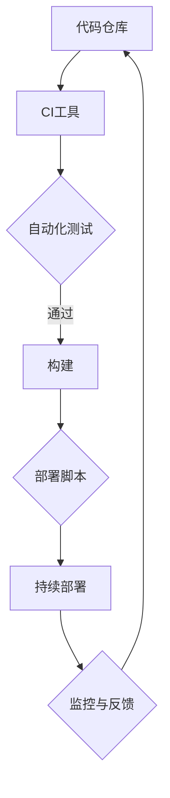

                 

### 引言：持续集成与持续部署的概念及其重要性

持续集成（Continuous Integration，简称CI）与持续部署（Continuous Deployment，简称CD）是现代软件开发中至关重要的两个概念。它们不仅改变了软件开发的流程，还极大地提升了团队的工作效率和软件质量。为了更好地理解这两个概念，我们首先需要明确它们各自的定义及其在软件开发中的具体作用。

#### 持续集成（CI）

持续集成是一种软件开发实践，旨在通过频繁地将代码更改合并到主干分支，以持续地集成和测试新代码。其核心思想是将代码频繁地集成，并快速发现问题，从而确保代码库始终处于可工作的状态。具体来说，CI有以下特点：

1. **频繁提交**：开发人员需要频繁地提交代码更改，通常是每天多次。
2. **自动化测试**：每次提交后，自动执行一系列预定义的测试，包括单元测试、集成测试等。
3. **快速反馈**：测试结果可以立即反馈给开发人员，以便快速修复问题。

持续集成的主要目标是减少集成冲突、提高代码质量、缩短发布周期。通过持续集成，团队能够更快地发现并解决问题，从而减少项目延迟和成本。

#### 持续部署（CD）

持续部署是一种自动化流程，用于将代码库中的更改部署到生产环境中。与传统的部署方式相比，持续部署的显著特点是自动化和频繁。CD的核心思想是确保每一次代码更改都可以安全、可靠地部署到生产环境中。具体来说，CD有以下特点：

1. **自动化部署**：部署过程高度自动化，包括构建、测试、部署等步骤。
2. **频繁部署**：部署频率非常高，通常是每次代码提交后立即部署。
3. **安全性与可靠性**：通过自动化测试和逐步部署，确保每次部署都是安全和可靠的。

持续部署的主要目标是减少手动操作、缩短发布周期、提高软件质量。通过持续部署，团队能够更快地交付功能，并更好地应对快速变化的市场需求。

#### 为什么要学习CI/CD？

持续集成与持续部署之所以成为现代软件开发中的关键技术，是因为它们带来了以下几个关键好处：

1. **提高软件质量**：通过频繁集成和自动化测试，可以更快地发现和修复问题，从而提高软件质量。
2. **缩短发布周期**：自动化流程减少了手动操作，加快了发布速度，使得团队能够更快地响应市场需求。
3. **提高团队协作效率**：通过标准化和自动化，团队能够更好地协作，提高工作效率。
4. **降低风险**：自动化测试和逐步部署减少了人为错误和部署失败的风险。

总之，持续集成与持续部署是提升团队效率和软件质量的利器。通过学习CI/CD，开发团队能够更好地适应快速变化的环境，实现更高的开发效率和更好的软件质量。接下来，我们将深入探讨CI/CD的基础概念、工具和实践，帮助读者更好地理解和应用这两个关键技术。

## 关键词

持续集成（CI）、持续部署（CD）、软件开发、自动化、效率提升、质量保证、自动化测试、持续反馈、频繁集成、自动化部署、持续反馈、团队协作、持续交付、DevOps、持续反馈循环、快速迭代、安全性、可靠性、持续反馈、敏捷开发、自动化测试、代码质量、开发流程优化、敏捷响应、市场需求、软件部署、自动化流程、持续改进、持续反馈、自动化测试、频繁集成、集成冲突、自动化测试、快速反馈、发布周期缩短、部署失败、人为错误、测试覆盖率、代码覆盖、自动化测试、持续交付、微服务架构、容器化技术、Kubernetes、云原生应用、DevOps文化、CI/CD工具、Jenkins、GitLab CI/CD、Travis CI、持续反馈、最佳实践、技术趋势、持续集成、持续交付、自动化测试、代码质量、敏捷开发、持续反馈循环、团队协作、自动化部署、快速迭代、安全性、可靠性、部署失败、自动化测试、频繁集成、代码覆盖、持续交付、敏捷响应、市场需求、开发流程优化。

### 摘要

本文深入探讨了持续集成（CI）和持续部署（CD）的概念、原理和实践，以及它们在提升团队效率中的重要作用。首先，我们介绍了CI/CD的基本概念和重要性，详细讲解了它们在软件开发中的作用和优势。接着，我们分析了CI/CD的基础概念，包括频繁提交、自动化测试、快速反馈等，并通过Mermaid流程图展示了核心概念之间的关系架构。随后，我们讨论了CI/CD工具与平台的选择，包括Jenkins、GitLab CI/CD、Travis CI等，并介绍了如何进行CI/CD实践，包括流程设计和优化、实际案例展示等。此外，我们探讨了CI/CD与团队效率的关系，以及如何通过CI/CD实现敏捷开发。最后，我们介绍了CI/CD的高级主题，如蓝绿部署、金丝雀部署、容器化、微服务架构等，并总结了最佳实践和注意事项。通过本文的学习，读者将能够全面理解CI/CD，掌握其核心原理和实践技巧，从而提升团队效率和软件质量。

## 持续集成（CI）的原理与实践

持续集成（Continuous Integration，简称CI）是一种软件开发实践，通过频繁地将代码更改合并到主干分支，并自动执行一系列预定义的测试，以确保代码库始终处于可工作的状态。这一实践的核心在于减少集成冲突、提高代码质量、缩短发布周期。下面我们将详细探讨CI的原理、优势、常用工具以及最佳实践。

### CI的原理

持续集成的原理相对简单，但效果显著。其基本流程如下：

1. **频繁提交**：开发人员需要频繁地提交代码更改，通常是每天多次。这样可以确保代码库中的每一个分支都保持最新的状态。
2. **自动构建**：每次提交后，CI工具会自动构建代码，生成可执行文件或打包资源。
3. **自动化测试**：构建完成后，CI工具会自动执行一系列预定义的测试，包括单元测试、集成测试、功能测试等。测试结果可以立即反馈给开发人员。
4. **快速反馈**：测试结果可以立即反馈给开发人员，以便快速发现问题并进行修复。

通过这样的流程，CI能够确保代码库中的每个分支都是可工作的，并且随时准备合并到主干分支。

### CI的优势

持续集成带来了以下几个显著的优势：

1. **减少集成冲突**：频繁的集成可以减少代码之间的不一致性，从而减少集成冲突。
2. **提高代码质量**：通过自动化测试，可以更快地发现和修复问题，提高代码质量。
3. **缩短发布周期**：自动化的构建和测试流程减少了手动操作，加快了发布速度。
4. **提高团队协作效率**：标准化的流程和自动化工具提高了团队的协作效率。

### 常用的CI工具

在CI领域，有许多优秀的工具可供选择，以下是一些常用的CI工具：

1. **Jenkins**：Jenkins是一个开源的CI工具，功能强大，支持多种插件，可以与各种开发工具和平台集成。
2. **GitLab CI/CD**：GitLab是一个基于Git的代码托管平台，其内置的CI/CD功能强大，易于配置和使用。
3. **Travis CI**：Travis CI是一个云端的CI/CD平台，支持多种编程语言和平台，无需本地配置，便于部署和扩展。
4. **CircleCI**：CircleCI是一个自动化、可扩展的CI/CD平台，支持多种编程语言和框架，提供高性能的构建和测试环境。
5. **GitHub Actions**：GitHub Actions是GitHub内置的CI/CD工具，可以与GitHub仓库紧密集成，提供简单的配置和强大的功能。

### CI的最佳实践

为了充分发挥持续集成的作用，以下是一些最佳实践：

1. **频繁提交**：开发人员应频繁地提交代码，确保代码库中的每个分支都是最新的。
2. **自动化测试**：确保所有提交的代码都经过自动化测试，包括单元测试、集成测试和功能测试。
3. **持续反馈**：测试结果应立即反馈给开发人员，以便快速发现和解决问题。
4. **代码质量**：通过静态代码分析工具和代码审查，确保代码质量。
5. **版本控制**：使用版本控制系统（如Git）管理代码，确保代码库的一致性和可追溯性。

### CI的流程设计

一个有效的CI流程应该包括以下几个关键步骤：

1. **代码仓库**：选择合适的代码仓库，如GitHub、GitLab或Bitbucket。
2. **构建环境**：配置构建环境，包括依赖库、构建工具和测试环境。
3. **构建脚本**：编写构建脚本，用于自动化构建和打包代码。
4. **测试脚本**：编写测试脚本，用于执行各种测试，包括单元测试、集成测试和功能测试。
5. **结果反馈**：配置反馈机制，如邮件通知、聊天工具消息等，确保开发人员能够及时收到测试结果。
6. **持续改进**：根据测试结果和反馈，持续改进构建和测试流程。

### CI与DevOps

持续集成是DevOps文化的重要组成部分，与持续部署（Continuous Deployment，简称CD）一起，构成了DevOps的核心实践。通过CI/CD，团队能够实现更高效的协作和更快速的迭代，更好地适应快速变化的市场需求。因此，CI不仅是开发人员的重要工具，也是DevOps团队不可或缺的一部分。

### 总结

持续集成是一种强大的软件开发实践，通过频繁提交、自动化测试和快速反馈，可以大幅提升软件质量、缩短发布周期和提高团队协作效率。本文详细介绍了CI的原理、优势、常用工具和最佳实践，并探讨了CI在DevOps中的重要性。通过理解和应用CI，开发团队能够更好地适应现代软件开发的需求，实现持续交付和高效协作。

## 持续部署（CD）的原理与实践

持续部署（Continuous Deployment，简称CD）是软件开发中另一个重要的概念，它通过自动化和频繁的部署流程，确保代码库中的每一个更改都可以安全、可靠地部署到生产环境中。持续部署的目标是减少手动操作、缩短发布周期、提高软件质量。下面我们将详细探讨CD的原理、优势、常用工具以及最佳实践。

### CD的原理

持续部署的基本原理可以概括为以下几个步骤：

1. **代码仓库**：持续部署首先需要代码仓库来存储和管理代码。
2. **构建**：每次代码提交后，CI工具会自动构建代码，生成可执行文件或打包资源。
3. **自动化测试**：构建完成后，CI工具会执行一系列自动化测试，以确保代码的质量和功能完整性。
4. **部署**：通过自动化部署脚本，将经过测试的代码部署到生产环境中。
5. **监控**：部署后，系统会进行实时监控，以确保部署的稳定性和性能。

### CD的优势

持续部署带来了以下几个显著的优势：

1. **减少手动操作**：自动化部署流程减少了手动操作，降低了人为错误的风险。
2. **缩短发布周期**：自动化和频繁的部署流程加快了发布速度，使团队能够更快地交付功能。
3. **提高软件质量**：通过自动化测试，可以及时发现和修复问题，从而提高软件质量。
4. **提高团队协作效率**：标准化的流程和自动化工具提高了团队的协作效率。

### 常用的CD工具

在持续部署领域，有许多优秀的工具可供选择，以下是一些常用的CD工具：

1. **Jenkins**：Jenkins是一个开源的CI/CD工具，支持自动化部署和任务调度，可以与各种开发工具和平台集成。
2. **GitLab CI/CD**：GitLab是一个基于Git的代码托管平台，其内置的CI/CD功能强大，支持自动化部署和多种触发器。
3. **Travis CI**：Travis CI是一个云端的CI/CD平台，支持多种编程语言和平台，无需本地配置，便于部署和扩展。
4. **CircleCI**：CircleCI是一个自动化、可扩展的CI/CD平台，支持多种编程语言和框架，提供高性能的构建和测试环境。
5. **GitHub Actions**：GitHub Actions是GitHub内置的CI/CD工具，可以与GitHub仓库紧密集成，提供简单的配置和强大的功能。

### CD的最佳实践

为了充分发挥持续部署的作用，以下是一些最佳实践：

1. **自动化部署**：确保部署过程完全自动化，减少手动操作和人为错误。
2. **自动化测试**：在部署前执行一系列自动化测试，确保代码的质量和功能完整性。
3. **逐步部署**：采用逐步部署策略，如蓝绿部署或金丝雀部署，以减少部署风险。
4. **监控和反馈**：部署后，实时监控系统的稳定性和性能，并及时反馈问题。
5. **文档记录**：详细记录部署流程和步骤，以便后续参考和改进。

### CD与自动化

自动化是持续部署的核心，通过自动化，可以大幅提升部署的效率和可靠性。以下是几个关键的自动化方面：

1. **自动化构建**：使用CI工具自动构建代码，生成可执行文件或打包资源。
2. **自动化测试**：使用自动化测试工具执行各种测试，包括单元测试、集成测试和功能测试。
3. **自动化部署**：编写部署脚本，使用CI/CD工具自动部署代码到生产环境。
4. **自动化监控**：使用监控工具实时监控系统的性能和稳定性。

### CD与DevOps

持续部署是DevOps文化的重要组成部分，与持续集成（Continuous Integration，简称CI）一起，构成了DevOps的核心实践。通过CI/CD，团队能够实现更高效的协作和更快速的迭代，更好地适应快速变化的市场需求。因此，CD不仅是开发人员的重要工具，也是DevOps团队不可或缺的一部分。

### 总结

持续部署通过自动化和频繁的部署流程，可以大幅提升软件质量、缩短发布周期和提高团队协作效率。本文详细介绍了CD的原理、优势、常用工具和最佳实践，并探讨了CD在DevOps中的重要性。通过理解和应用CD，开发团队能够更好地适应现代软件开发的需求，实现持续交付和高效协作。

## CI和CD的关系与流程整合

持续集成（CI）和持续部署（CD）是现代软件开发中不可或缺的两个概念，它们在软件开发流程中共同发挥着关键作用。CI主要负责代码的集成和自动化测试，而CD则专注于将经过测试的代码部署到生产环境中。二者的紧密协作，不仅提升了开发效率，还显著提高了软件质量。下面，我们将探讨CI和CD之间的关系，以及如何将它们整合到一个高效的流程中。

### CI与CD的关系

持续集成和持续部署之间存在紧密的联系。CI是CD的基础，其核心目标是通过频繁的代码集成和自动化测试，确保代码库的稳定性和可部署性。而CD则是在CI的基础上，进一步自动化和优化代码的部署过程。具体来说，CI和CD之间的关系可以概括为以下几点：

1. **代码集成与测试**：CI负责将开发人员的代码更改集成到主干分支，并执行一系列自动化测试，确保代码的正确性和完整性。
2. **部署与交付**：CD负责将经过CI测试的代码部署到生产环境，实现持续交付和快速响应。

CI和CD的协同工作，形成了一个闭环的反馈循环。CI通过自动化测试反馈代码质量，CD通过自动化部署反馈部署效果，二者共同确保软件的稳定性和高效性。

### CI/CD流程的整合

要将CI和CD整合到一个高效的流程中，需要考虑以下几个方面：

1. **统一的代码仓库**：所有开发人员应使用统一的代码仓库，如Git，确保代码的一致性和可追溯性。
2. **自动化构建和测试**：使用CI工具（如Jenkins、GitLab CI/CD等）自动化构建代码，并执行自动化测试，包括单元测试、集成测试和功能测试。
3. **部署脚本**：编写部署脚本，使用CI/CD工具自动化部署代码到不同的环境，如开发环境、测试环境和生产环境。
4. **环境隔离**：采用环境隔离策略，如蓝绿部署或金丝雀部署，以减少部署风险，确保部署的稳定性和可靠性。
5. **监控与反馈**：部署后，使用监控工具（如Prometheus、Grafana等）实时监控系统的性能和稳定性，并及时反馈问题。
6. **持续反馈循环**：通过CI和CD的自动化反馈机制，持续改进开发流程，提高软件质量和部署效率。

### CI/CD的核心概念和术语

为了更好地理解和实施CI/CD，我们需要了解一些核心概念和术语：

1. **持续集成**：频繁将代码更改集成到主干分支，并执行自动化测试，确保代码的正确性和稳定性。
2. **持续部署**：将经过CI测试的代码自动化部署到生产环境，实现持续交付和快速响应。
3. **自动化**：使用工具和脚本自动化构建、测试和部署流程，减少手动操作和人为错误。
4. **反馈循环**：通过自动化测试和部署的反馈机制，持续改进开发流程和软件质量。
5. **环境**：包括开发环境、测试环境、预生产环境和生产环境，不同环境之间的部署策略和隔离措施。
6. **部署策略**：如蓝绿部署、金丝雀部署、滚动部署等，用于控制代码的发布和更新。
7. **监控**：实时监控系统的性能和稳定性，及时发现问题并进行处理。

### Mermaid流程图

为了更好地展示CI/CD的核心概念和流程，我们可以使用Mermaid流程图来描述：



在这个流程图中，代码仓库中的代码通过CI工具执行自动化测试，然后构建代码，最后通过部署脚本将代码部署到生产环境。部署后，系统会进行实时监控，并及时反馈问题，形成一个闭环的反馈循环。

### CI/CD的优势

CI/CD带来的优势主要体现在以下几个方面：

1. **提高软件质量**：通过频繁的集成和自动化测试，可以更快地发现和修复问题，提高代码质量和软件质量。
2. **缩短发布周期**：自动化流程减少了手动操作，加快了发布速度，使团队能够更快地交付功能。
3. **提高团队协作效率**：标准化的流程和自动化工具提高了团队的协作效率，减少了重复工作。
4. **降低部署风险**：通过逐步部署策略，如蓝绿部署或金丝雀部署，可以减少部署失败的风险，确保部署的稳定性和可靠性。

### 总结

持续集成和持续部署是现代软件开发中不可或缺的两个概念，通过紧密协作，可以大幅提升软件质量、缩短发布周期和提高团队协作效率。本文详细介绍了CI和CD的关系、核心概念、流程整合和优势，并使用Mermaid流程图展示了CI/CD的整体架构。通过理解和应用CI/CD，开发团队能够更好地适应现代软件开发的需求，实现持续交付和高效协作。

## CI/CD的优点与挑战

持续集成（CI）和持续部署（CD）在现代软件开发中已经成为提升团队效率和软件质量的重要工具。然而，像任何技术一样，CI/CD也有其优点和挑战。在本节中，我们将详细探讨CI/CD的优点和潜在的挑战，并提供解决方案和建议。

### CI/CD的优点

1. **提高软件质量**：通过频繁的集成和自动化测试，CI/CD可以迅速发现和修复代码中的问题，从而提高软件质量。开发人员可以立即收到测试反馈，使得错误能够被快速定位和解决。

2. **缩短发布周期**：自动化构建、测试和部署流程大大减少了手动操作的时间，使得团队能够更快地发布新功能和修复问题。这有助于更快地响应市场需求，提高产品的市场竞争力。

3. **提高团队协作效率**：CI/CD通过标准化流程和自动化工具，减少了重复工作和协调成本，提高了团队的整体效率。团队成员可以专注于核心任务，而无需花费大量时间在手动流程上。

4. **降低部署风险**：通过逐步部署策略，如蓝绿部署或金丝雀部署，CI/CD可以减少大规模部署失败的风险。部署过程中的每一步都可以独立测试，确保系统稳定性和可靠性。

5. **持续反馈与改进**：CI/CD提供了一个持续的反馈循环，开发人员可以不断优化流程和代码，提高开发效率和产品质量。这种反馈机制有助于团队持续学习和改进。

### CI/CD的挑战

1. **初始配置成本**：CI/CD的初始配置可能需要一定的资源和时间，特别是对于新项目或现有项目引入CI/CD流程时。配置自动化构建和测试环境、集成CI工具和部署脚本等都需要投入一定的精力。

2. **学习和培训成本**：对于团队成员来说，学习和适应CI/CD流程和工具可能需要一定的时间和培训。这可能会影响项目的早期进度，尤其是对于经验较少的团队。

3. **系统稳定性要求高**：CI/CD依赖于自动化和频繁的操作，因此系统稳定性要求较高。任何系统的故障或错误都可能导致构建失败或部署失败，从而影响整个流程。

4. **安全性问题**：自动化和频繁的部署增加了系统的攻击面，潜在的安全漏洞可能会被利用。确保CI/CD流程的安全性是一个持续挑战。

### 解决方案与建议

1. **逐步引入CI/CD**：对于新项目或现有项目，可以逐步引入CI/CD流程，而不是一次性全部实施。可以先从简单的自动化测试开始，然后逐步增加构建和部署的自动化程度。

2. **提供培训和支持**：为团队成员提供必要的培训和支持，帮助他们快速掌握CI/CD流程和工具。可以组织内部培训或外部专业培训，确保团队能够有效地使用CI/CD。

3. **选择合适的工具**：选择适合项目需求的CI/CD工具，如Jenkins、GitLab CI/CD、Travis CI等。确保工具具有良好的文档和社区支持，以便在出现问题时能够快速解决。

4. **加强监控与反馈**：确保CI/CD流程的监控与反馈机制强大且可靠。使用监控工具实时跟踪构建和部署的状态，及时发现问题并进行处理。

5. **关注安全性**：在CI/CD流程中，注重安全性问题的防范。定期进行安全审计和漏洞扫描，确保代码库和部署环境的安全性。

6. **持续改进与优化**：持续评估CI/CD流程的效果和性能，并根据反馈进行改进和优化。通过不断学习和实践，提高团队的CI/CD能力。

### 总结

持续集成与持续部署为现代软件开发带来了显著的好处，包括提高软件质量、缩短发布周期、提高团队协作效率等。然而，引入CI/CD也面临一些挑战，如初始配置成本、学习和培训成本、系统稳定性要求高等。通过逐步引入、提供培训支持、选择合适的工具、加强监控与反馈、关注安全性和持续改进，团队可以克服这些挑战，充分利用CI/CD的优势，提升软件开发效率和质量。

## CI/CD工具与平台

在实现持续集成（CI）和持续部署（CD）的过程中，选择合适的工具和平台至关重要。市场上存在多种CI/CD工具和平台，每种都有其独特的特点和适用场景。以下将介绍几个主流的CI/CD工具和平台，包括Jenkins、GitLab CI/CD、Travis CI等，帮助读者根据需求选择合适的解决方案。

### Jenkins

**Jenkins** 是一款开源的自动化服务器，被广泛用于实现持续集成和持续部署。它具有强大的插件生态系统，支持各种开发工具和平台。以下是Jenkins的主要特点和优势：

- **插件生态系统**：Jenkins拥有庞大的插件库，可以轻松集成各种工具和服务，如Git、Maven、Docker、JIRA等。
- **灵活性**：Jenkins允许通过其脚本语言（Groovy）自定义工作流程，实现复杂的构建和部署逻辑。
- **社区支持**：Jenkins拥有活跃的社区，提供丰富的文档和教程，方便新手快速上手。
- **可扩展性**：Jenkins支持多节点部署，可以水平扩展以处理大量构建任务。

然而，Jenkins也存在一些缺点，如配置较为复杂、性能依赖于后端数据库等。对于大型项目或团队，Jenkins可能需要更细致的维护和管理。

### GitLab CI/CD

**GitLab CI/CD** 是GitLab平台的内置CI/CD功能，GitLab是一个基于Git的全面DevOps平台。GitLab CI/CD的特点和优势如下：

- **集成性**：GitLab CI/CD与GitLab本身紧密集成，可以无缝管理代码仓库、进行代码审查、自动化构建和部署。
- **易于配置**：GitLab CI/CD配置基于`.gitlab-ci.yml`文件，语法简单直观，易于理解和维护。
- **支持多种语言和框架**：GitLab CI/CD支持多种编程语言和开发框架，如Python、Java、Node.js等。
- **触发机制**：GitLab CI/CD可以基于多种事件触发，如代码提交、合并请求或标签发布等。

GitLab CI/CD的缺点包括对GitLab服务器的依赖性较高，不适合完全独立部署。但对于需要GitLab功能的项目，GitLab CI/CD是一个非常便捷和高效的解决方案。

### Travis CI

**Travis CI** 是一个云端的CI/CD平台，支持多种编程语言和平台，非常适合开源项目和小型团队。以下是Travis CI的主要特点和优势：

- **免费使用**：Travis CI提供免费的服务，适合小型项目或个人开发者。
- **自动化构建和测试**：Travis CI可以自动构建和测试项目，无需手动配置。
- **环境多样性**：Travis CI支持多种操作系统和编程语言，方便跨平台测试。
- **简单配置**：Travis CI的配置基于`.travis.yml`文件，易于理解和修改。

Travis CI的缺点包括免费版本功能受限、对于大型项目性能可能不足。但作为开源项目的理想选择，Travis CI具有极高的性价比。

### CircleCI

**CircleCI** 是一个自动化、可扩展的CI/CD平台，支持多种编程语言和框架。以下是CircleCI的主要特点和优势：

- **高性能**：CircleCI提供快速且高效的构建和测试环境，适用于大型项目。
- **可扩展性**：CircleCI支持水平扩展，可以根据需求增加构建节点。
- **云原生**：CircleCI是基于云的服务，提供灵活的部署和扩展选项。
- **灵活的配置**：CircleCI的配置基于`.circleci/config.yml`文件，支持复杂的构建和部署逻辑。

CircleCI的缺点包括价格较高，适合对性能和扩展性有较高要求的团队或项目。

### 其他流行的CI/CD工具

除了上述工具外，市场上还有其他一些流行的CI/CD工具，如GitHub Actions、CodeShip、Shippable等。每种工具都有其独特的特点和优势，可以根据项目需求和团队规模进行选择。

- **GitHub Actions**：GitHub内置的CI/CD工具，与GitHub紧密集成，适用于需要与GitHub结合的项目。
- **CodeShip**：提供高效、可靠的CI/CD服务，适合需要高稳定性和高性能的团队。
- **Shippable**：支持多种平台和语言，提供灵活的部署和扩展选项，适用于多样化的项目需求。

### 总结

在选择CI/CD工具和平台时，应考虑项目的具体需求、团队的规模和技术背景。Jenkins适合需要高度自定义和灵活性的大型项目，GitLab CI/CD适合与GitLab集成的项目，Travis CI适合开源项目和小型团队，CircleCI适合对性能和扩展性有较高要求的团队。通过合理选择和使用CI/CD工具，团队可以大幅提升开发效率和软件质量。

### CI/CD实践

在实际项目中，实现持续集成（CI）和持续部署（CD）需要经过一系列具体的步骤和设置。在这一节中，我们将详细讲解CI/CD流程的设计与优化，并提供一个实际案例来展示如何从零开始搭建CI/CD环境。

#### CI/CD流程的设计与优化

设计一个有效的CI/CD流程需要考虑以下几个方面：

1. **代码仓库的选择**：首先，选择一个合适的代码仓库，如GitHub、GitLab或Bitbucket。这些平台通常内置了CI/CD功能，可以简化流程。

2. **自动化构建脚本**：编写自动化构建脚本，用于编译和打包代码。构建脚本通常包括安装依赖库、运行构建命令、生成构建输出等。

3. **自动化测试**：编写自动化测试脚本，包括单元测试、集成测试和功能测试。确保每次提交的代码都经过全面测试。

4. **部署脚本**：编写部署脚本，用于将构建结果部署到不同环境，如开发环境、测试环境和生产环境。

5. **部署策略**：选择合适的部署策略，如蓝绿部署或金丝雀部署，以减少部署风险。

6. **监控与反馈**：配置监控工具，如Prometheus和Grafana，实时监控系统的性能和稳定性。确保在出现问题时能够及时反馈。

7. **持续改进**：根据反馈和测试结果，不断优化流程和脚本，提高CI/CD效率。

#### 实际案例：从零开始搭建CI/CD环境

下面我们以一个简单的Web应用项目为例，展示如何从零开始搭建CI/CD环境。

##### 案例概述

项目名称：一个基于Node.js的博客平台

项目仓库：GitHub

CI/CD工具：GitHub Actions

##### 步骤一：配置GitHub仓库

1. 在GitHub上创建一个新的仓库，用于存储项目代码。
2. 将项目代码推送到GitHub仓库。

```bash
git init
git add .
git commit -m "Initial commit"
git remote add origin https://github.com/your-username/your-repo.git
git push -u origin main
```

##### 步骤二：配置GitHub Actions

1. 在GitHub仓库的`.gitlab-ci.yml`文件中配置CI/CD流程。

```yaml
name: Node.js Blog CI/CD

on:
  push:
    branches:
      - main
  pull_request:
    branches:
      - main

jobs:
  build-and-test:
    runs-on: ubuntu-latest

steps:
  - uses: actions/checkout@v2

  - name: Node.js dependencies
    run: npm install

  - name: Run tests
    run: npm test

  - name: Build
    run: npm run build

  - name: Deploy to staging
    if: github.ref == 'refs/heads/main'
    run: npm run deploy --env PIPELINE=staging

  - name: Deploy to production
    if: github.event_name == 'push' && github.ref == 'refs/heads/main'
    run: npm run deploy --env PIPELINE=production
```

这个`.gitlab-ci.yml`文件定义了一个CI/CD流程，包括以下步骤：

- 检出代码仓库。
- 安装Node.js依赖库。
- 运行测试脚本。
- 构建项目。
- 如果是主分支上的提交，部署到staging环境。
- 如果是主分支上的push操作，部署到生产环境。

##### 步骤三：编写部署脚本

在项目中，我们需要编写一个部署脚本`deploy.sh`，用于自动化部署到不同环境。

```bash
#!/bin/bash

# 设置环境变量
export NODE_ENV=$PIPELINE

# 部署到staging或生产环境
if [ "$PIPELINE" == "staging" ]; then
  # 部署到staging服务器
elif [ "$PIPELINE" == "production" ]; then
  # 部署到生产服务器
fi
```

##### 步骤四：配置部署服务器

1. 在staging和生产服务器上安装Nginx或Apache等Web服务器。
2. 配置Web服务器的SSL证书，确保HTTPS访问。
3. 将部署脚本添加到服务器的cron任务中，实现定期部署。

##### 步骤五：监控与反馈

1. 使用Prometheus和Grafana等监控工具，实时监控Web服务器的性能和稳定性。
2. 配置报警机制，当出现问题时能够及时通知相关人员。

##### 总结

通过上述步骤，我们可以从零开始搭建一个CI/CD环境，实现代码的自动化构建、测试和部署。在实际项目中，根据具体需求，我们可以进一步优化流程和脚本，提高CI/CD的效率。通过持续集成和持续部署，团队能够更快地交付高质量软件，提高开发效率和团队协作。

### 企业级项目的CI/CD实践

在企业级项目中，持续集成（CI）和持续部署（CD）不仅是为了提高开发效率，更是确保软件质量和稳定性不可或缺的环节。本节将通过一个具体的案例，详细展示如何在一个大型企业级项目中实现CI/CD，并分析其具体应用和实践。

#### 案例背景

某大型电商平台项目，包含多个微服务，每个微服务都有独立的代码库和运行环境。项目需求快速迭代，且需要确保每次发布都能在极短的时间内上线，同时保证系统的稳定性和可靠性。

#### CI/CD实践步骤

1. **代码仓库管理**：使用Git进行版本控制，每个微服务都有一个独立的代码仓库。所有开发人员在各自的代码库中进行开发，并将代码推送到远程仓库。

2. **CI工具选择**：选择Jenkins作为CI工具。Jenkins具有强大的插件系统，可以与多个开发工具和平台集成，满足企业级项目的需求。

3. **自动化构建脚本**：为每个微服务编写自动化构建脚本，用于编译、打包和生成可执行文件。以下是一个简单的Jenkins构建脚本的伪代码：

```bash
#!/bin/bash

# 获取最新代码
git pull origin main

# 安装依赖
npm install

# 编译代码
npm run build

# 生成可执行文件
mv build ./dist

# 打包生成的可执行文件
tar czvf dist.tar.gz ./dist
```

4. **自动化测试**：编写自动化测试脚本，包括单元测试、集成测试和功能测试。每次构建完成后，自动运行测试脚本，确保代码质量。

```bash
# 运行单元测试
npm test

# 运行集成测试
npm run integration-test

# 运行功能测试
npm run functional-test
```

5. **部署脚本**：编写部署脚本，用于将构建结果部署到不同的环境中，如开发环境、测试环境和生产环境。以下是一个简单的部署脚本的伪代码：

```bash
#!/bin/bash

# 设置环境变量
export NODE_ENV=$ENV

# 部署到指定环境
if [ "$ENV" == "development" ]; then
  # 部署到开发服务器
elif [ "$ENV" == "test" ]; then
  # 部署到测试服务器
elif [ "$ENV" == "production" ]; then
  # 部署到生产服务器
fi
```

6. **部署策略**：采用蓝绿部署策略，每次发布时，将新版本部署到一小部分用户，观察其稳定性和性能。如果一切正常，再逐步将新版本推广到所有用户。

7. **监控与反馈**：使用Prometheus和Grafana进行实时监控，监控系统的性能和稳定性。当出现问题时，及时通知相关人员。

#### 实践分析

1. **提高开发效率**：通过自动化构建和测试，开发人员可以更快地发现和解决问题，提高开发效率。

2. **确保软件质量**：自动化测试确保每次发布的代码都经过严格测试，降低bug和错误的概率，提高软件质量。

3. **降低部署风险**：采用蓝绿部署策略，逐步推广新版本，减少大规模部署失败的风险。

4. **增强团队协作**：CI/CD流程使团队能够更好地协作，每个成员都能实时了解项目的进展和问题。

5. **持续改进**：通过监控和反馈机制，团队可以不断优化CI/CD流程，提高系统的稳定性和可靠性。

#### 注意事项

1. **代码质量**：确保代码质量是CI/CD成功的关键。编写高质量的代码，并进行充分的单元测试和集成测试。

2. **部署脚本**：部署脚本应尽可能简单和稳定，避免复杂的逻辑，以提高部署的成功率。

3. **监控与反馈**：实时监控系统的性能和稳定性，及时发现问题并进行处理。

4. **持续改进**：不断优化CI/CD流程，提高系统的稳定性和可靠性。

#### 总结

通过在企业级项目中应用CI/CD，团队能够大幅提高开发效率、确保软件质量和降低部署风险。通过详细的实践分析和注意事项，团队可以更好地实现CI/CD，为项目的成功奠定坚实的基础。

### CI/CD与DevOps

持续集成（CI）和持续部署（CD）是DevOps文化的重要组成部分，它们在促进团队协作、提高开发效率和质量方面发挥着关键作用。DevOps是一种软件开发和运维实践，旨在通过开发和运维团队的紧密协作，实现更快速、更可靠的软件交付。在本节中，我们将探讨CI/CD与DevOps之间的关系，以及如何将CI/CD与DevOps相结合，实现更高效的软件开发和运维。

#### CI/CD与DevOps的关系

CI/CD与DevOps紧密相连，共同构成了现代软件开发和运维的核心。它们之间的关系可以从以下几个方面来理解：

1. **协同工作**：CI/CD是DevOps实践的核心环节，负责代码的集成、测试和部署。而DevOps则强调团队协作、自动化和持续改进，为CI/CD提供了理论基础和实践指导。
2. **反馈循环**：CI/CD提供了一个持续的反馈循环，通过自动化测试和部署的反馈，团队能够快速发现问题并进行改进。这种反馈机制是DevOps持续改进的核心。
3. **协作与透明度**：CI/CD通过自动化和标准化流程，提高了团队的协作效率和透明度。DevOps则通过持续集成和持续交付，实现了开发、测试和运维的无缝协作。

#### 如何将CI/CD与DevOps相结合

要将CI/CD与DevOps相结合，团队需要从以下几个方面进行实践：

1. **建立跨职能团队**：DevOps强调跨职能团队的协作，团队成员来自不同的背景，如开发、测试、运维等。这样的团队可以更好地理解和解决项目中的各种问题。
2. **使用自动化工具**：CI/CD工具（如Jenkins、GitLab CI/CD等）是实现DevOps自动化的重要工具。通过自动化构建、测试和部署流程，团队能够提高效率和减少错误。
3. **持续反馈与改进**：建立持续反馈机制，通过自动化测试和监控，及时发现和解决问题。团队应定期回顾和改进流程，以提高系统稳定性和可靠性。
4. **采用持续交付**：持续交付（Continuous Delivery，简称CD）是DevOps的核心实践之一。通过持续交付，团队能够确保每次代码更改都可以安全、可靠地交付到生产环境。
5. **文化转型**：DevOps不仅仅是技术和工具的变革，更是一种文化的转变。团队需要培养开放、协作和持续学习的文化，以适应快速变化的市场需求。

#### 案例分析

以下是一个企业级项目中的CI/CD与DevOps结合的案例分析：

- **项目背景**：某大型电商企业需要快速交付高质量的应用，以应对激烈的市场竞争。
- **实践步骤**：
  1. **建立跨职能团队**：企业成立了由开发、测试、运维和业务分析师组成的跨职能团队，确保各方紧密协作。
  2. **引入CI/CD工具**：使用Jenkins作为CI工具，实现自动化构建和测试。同时，使用Docker和Kubernetes进行容器化和集群管理。
  3. **持续反馈与改进**：通过Prometheus和Grafana进行实时监控，及时发现和解决问题。团队定期举行回顾会议，总结经验教训，持续优化流程。
  4. **采用持续交付**：使用GitLab CI/CD实现持续交付，确保每次代码提交都可以自动构建、测试和部署到预生产环境，再逐步推广到生产环境。
- **效果**：
  1. **提高开发效率**：自动化流程减少了手动操作和重复工作，开发人员可以专注于核心任务。
  2. **确保软件质量**：通过自动化测试和持续反馈，团队能够更快地发现和修复问题，提高软件质量。
  3. **降低部署风险**：采用逐步部署策略，减少大规模部署失败的风险，确保系统稳定性和可靠性。

#### 总结

CI/CD与DevOps的结合，为团队提供了一种高效、可靠的软件开发和运维模式。通过建立跨职能团队、使用自动化工具、持续反馈与改进以及采用持续交付，团队能够大幅提高开发效率、确保软件质量和降低部署风险。通过具体案例的分析，我们可以看到CI/CD与DevOps相结合的巨大潜力和实际效果。

### 持续集成与持续部署提升团队效率

持续集成（CI）和持续部署（CD）是现代软件开发中不可或缺的两个概念，它们通过自动化和频繁的流程优化，极大地提升了团队的工作效率和软件质量。在本节中，我们将深入探讨CI/CD如何通过减少人为错误、缩短开发周期、提高代码质量和团队协作，提升团队的整体效率。

#### 减少人为错误

在传统的软件开发流程中，人为错误是导致项目延迟和成本增加的主要原因之一。CI/CD通过自动化测试和频繁的集成，显著减少了这种错误的发生。每次代码提交都会经过一系列自动化测试，确保代码的正确性和完整性。这种持续反馈机制使得开发人员能够立即发现并修复问题，避免了在后续集成过程中出现的潜在错误。

#### 缩短开发周期

CI/CD自动化了从构建、测试到部署的整个流程，减少了手动操作和等待时间。通过快速反馈和自动化部署，团队能够在极短的时间内完成功能迭代和交付。这有助于缩短开发周期，使团队能够更快地响应市场需求和用户反馈，提高产品的市场竞争力。

#### 提高代码质量

持续集成通过频繁的测试和反馈，确保每次提交的代码都经过严格的审查和测试。这种严格的代码质量控制机制有助于发现和修复潜在的问题，提高代码的质量和可靠性。此外，通过自动化测试覆盖率和代码审查，团队能够确保代码库的稳定性和一致性。

#### 提升团队协作

CI/CD通过标准化的流程和自动化工具，提高了团队内部和团队之间的协作效率。团队成员可以专注于各自的核心任务，而无需担心繁琐的手动流程。同时，通过实时监控和反馈，团队能够更好地了解项目进展和潜在问题，及时调整和优化工作流程。

#### 实践案例

以下是一个企业级项目的CI/CD实践案例，展示了如何通过CI/CD提升团队效率：

- **项目背景**：某大型金融科技公司需要快速迭代和交付高性能、高可靠性的金融交易系统。
- **实践步骤**：
  1. **建立跨职能团队**：由开发、测试、运维和产品管理等角色组成，确保紧密协作。
  2. **引入CI/CD工具**：使用Jenkins实现自动化构建和测试，使用Docker进行容器化，使用Kubernetes进行集群管理。
  3. **自动化测试**：编写自动化测试脚本，包括单元测试、集成测试和性能测试，确保每次提交的代码都经过严格测试。
  4. **持续反馈**：使用Prometheus和Grafana进行实时监控，及时反馈系统的性能和稳定性问题。
  5. **逐步部署**：采用蓝绿部署策略，逐步推广新版本，确保系统稳定性和可靠性。
- **效果**：
  1. **减少错误**：通过自动化测试和频繁的集成，显著减少了人为错误，提高了代码质量。
  2. **缩短周期**：自动化流程和快速反馈机制使团队能够在极短的时间内完成功能迭代和交付。
  3. **提高质量**：持续集成和自动化测试确保每次提交的代码都经过严格的审查和测试。
  4. **提升协作**：标准化的流程和自动化工具提高了团队内部和团队之间的协作效率。

#### 总结

持续集成与持续部署通过减少人为错误、缩短开发周期、提高代码质量和团队协作，显著提升了团队的整体效率。通过实际案例，我们可以看到CI/CD在提升软件开发效率方面的巨大潜力。通过引入CI/CD，开发团队能够更好地适应快速变化的市场需求，实现持续交付和高效协作。

### 持续集成与持续部署中的高级主题

在持续集成（CI）和持续部署（CD）中，有一些高级主题和概念，如蓝绿部署、金丝雀部署、容器化和微服务架构，这些技术能够进一步提高系统的灵活性和可靠性。本节将详细探讨这些高级主题，并展示其在CI/CD实践中的重要性。

#### 蓝绿部署

蓝绿部署是一种常见的部署策略，其核心思想是将生产环境中的旧版本（蓝色）和新版本（绿色）同时运行，通过流量切换将用户从旧版本逐步引导到新版本。这种部署方式具有以下优势：

1. **无停机部署**：在部署新版本时，旧版本仍然在运行，用户不会感觉到系统的中断。
2. **风险可控**：新版本在部分用户环境中测试成功后，再逐步推广到所有用户，降低了大规模部署失败的风险。
3. **快速回滚**：如果新版本出现故障，可以迅速回滚到旧版本，确保系统的稳定性和可靠性。

蓝绿部署的流程通常如下：

1. **构建新版本**：在独立的构建环境中构建新版本的代码和依赖库。
2. **部署新版本**：将新版本的代码和配置部署到独立的部署环境中，与应用的旧版本并行运行。
3. **流量切换**：逐步将用户流量从旧版本切换到新版本，观察新版本的运行状态。
4. **监控与反馈**：通过实时监控，确保新版本的稳定性和性能，并及时反馈问题。

#### 金丝雀部署

金丝雀部署是一种类似于蓝绿部署的策略，但其部署范围更小。金丝雀部署通常在一个较小的用户群体中首先部署新版本，观察其运行状态，确保无问题后再逐步推广到所有用户。这种部署方式适用于对稳定性要求较高的系统，如金融、医疗等行业。

金丝雀部署的流程如下：

1. **构建新版本**：构建新版本的代码和依赖库。
2. **部署新版本**：将新版本的代码和配置部署到预生产环境中。
3. **小规模测试**：在一个小规模的用户群体中测试新版本，监控其运行状态。
4. **逐步推广**：如果测试成功，逐步将新版本推广到更大规模的用户群体。
5. **监控与反馈**：通过实时监控，确保新版本的稳定性和性能，并及时反馈问题。

#### 容器化

容器化技术（如Docker）在CI/CD中扮演了重要角色，它通过将应用程序及其依赖库打包成一个独立的容器，实现了环境的隔离和一致性。容器化带来的好处包括：

1. **环境一致性**：无论在开发、测试还是生产环境，容器中的应用程序运行环境都是一致的，减少了环境差异带来的问题。
2. **快速部署**：容器化的应用程序可以快速部署，无需复杂的配置和管理。
3. **资源优化**：容器可以高效地利用系统资源，提高资源利用率。

在CI/CD实践中，容器化的步骤通常如下：

1. **编写Dockerfile**：定义应用程序的容器镜像，包括依赖库、运行环境和配置。
2. **构建容器镜像**：使用Docker命令构建容器镜像。
3. **部署容器**：将容器镜像部署到容器化平台（如Kubernetes），实现自动化部署和管理。

#### 微服务架构

微服务架构是一种将应用程序分解为多个小型、独立服务的架构风格。每个微服务负责一个特定的功能，可以独立部署、测试和扩展。微服务架构在CI/CD中具有以下优势：

1. **可扩展性**：通过独立部署和扩展单个微服务，可以更好地应对负载变化。
2. **故障隔离**：单个微服务的故障不会影响整个系统，降低了系统的整体风险。
3. **灵活部署**：可以灵活地部署和更新单个微服务，而不需要重启整个系统。

在CI/CD实践中，微服务架构的步骤通常如下：

1. **定义微服务**：根据业务需求，将应用程序分解为多个微服务。
2. **开发微服务**：为每个微服务编写独立的代码，并进行单元测试。
3. **构建容器镜像**：为每个微服务构建容器镜像，确保其独立性和一致性。
4. **部署微服务**：使用CI/CD工具自动化部署和管理微服务，实现持续交付。

#### 总结

蓝绿部署、金丝雀部署、容器化和微服务架构是持续集成与持续部署中的高级主题，它们通过提高系统的灵活性和可靠性，进一步优化了CI/CD实践。通过这些技术，团队能够更好地适应快速变化的市场需求，实现高效、可靠的软件开发和运维。

### 最佳实践：CI/CD实施策略与注意事项

在实施持续集成（CI）和持续部署（CD）时，遵循最佳实践是确保流程高效、稳定的关键。以下是一些关键的CI/CD实施策略和注意事项，旨在帮助团队克服常见挑战，实现最佳效果。

#### 策略一：逐步引入CI/CD

对于新项目或现有项目，逐步引入CI/CD流程是避免初期混乱和资源浪费的有效方法。可以从简单的自动化测试开始，然后逐步扩展到构建和部署。以下步骤有助于逐步引入CI/CD：

1. **评估需求**：首先，评估项目需求，确定是否需要CI/CD以及哪些部分。
2. **选择工具**：选择合适的CI/CD工具和平台，如Jenkins、GitLab CI/CD、Travis CI等。
3. **编写自动化脚本**：编写自动化构建和测试脚本，确保每次提交都经过严格测试。
4. **试点项目**：在小型项目中试点CI/CD流程，积累经验和优化配置。
5. **逐步扩展**：根据试点项目的结果，逐步将CI/CD引入更大规模的项目。

#### 策略二：配置管理

有效的配置管理是CI/CD成功的关键。以下建议有助于配置管理：

1. **环境隔离**：为开发、测试和生产环境设置独立的配置，确保环境一致性。
2. **配置版本控制**：使用版本控制系统（如Git）管理配置文件，确保配置的可追溯性和一致性。
3. **配置自动化**：使用CI/CD工具自动管理和更新配置，减少手动操作和错误。

#### 策略三：测试覆盖率

确保足够的测试覆盖率是CI/CD的核心目标之一。以下策略有助于提高测试覆盖率：

1. **单元测试**：编写单元测试，覆盖核心功能和关键逻辑。
2. **集成测试**：编写集成测试，验证模块间的交互和依赖。
3. **功能测试**：编写功能测试，确保应用程序符合业务需求。
4. **性能测试**：进行性能测试，验证系统的响应速度和稳定性。
5. **监控测试结果**：通过自动化工具监控测试结果，确保测试覆盖率满足要求。

#### 注意事项一：安全性

CI/CD过程中，安全性是至关重要的。以下注意事项有助于确保CI/CD的安全性：

1. **访问控制**：确保CI/CD环境的访问权限受到严格控制，防止未经授权的访问。
2. **代码扫描**：使用代码安全扫描工具（如SonarQube），识别潜在的安全漏洞。
3. **加密敏感信息**：使用加密技术保护敏感信息，如数据库密码、密钥等。
4. **定期审计**：定期进行CI/CD流程的审计，确保流程的安全性和合规性。

#### 注意事项二：监控与反馈

有效的监控与反馈机制是CI/CD成功的关键。以下注意事项有助于监控与反馈：

1. **实时监控**：使用实时监控工具（如Prometheus、Grafana）监控系统的性能和稳定性。
2. **自动化报警**：设置自动化报警机制，当出现问题时能够及时通知相关人员。
3. **反馈闭环**：确保监控和反馈机制形成一个闭环，及时发现并解决问题。
4. **持续优化**：根据监控和反馈结果，持续优化CI/CD流程和系统配置。

#### 总结

通过逐步引入CI/CD、有效配置管理、确保测试覆盖率和安全性、以及建立有效的监控与反馈机制，团队可以克服CI/CD实施过程中的常见挑战，实现高效、稳定和安全的软件开发和运维。遵循最佳实践，团队能够更好地利用CI/CD的优势，提高开发效率和质量。

### 总结与展望

持续集成（CI）与持续部署（CD）作为现代软件开发的核心实践，已经在提高开发效率、确保软件质量和缩短发布周期方面发挥了重要作用。本文从多个角度详细探讨了CI/CD的概念、原理、工具和实践，分析了其在团队协作、自动化和快速响应中的关键作用。

#### 核心内容回顾

1. **CI/CD的概念**：CI通过频繁提交、自动化测试和快速反馈，确保代码库的稳定性和可集成性；CD通过自动化部署，确保代码安全、可靠地交付到生产环境。
2. **CI/CD的优势**：提高软件质量、缩短发布周期、降低部署风险、提升团队协作效率。
3. **CI/CD工具与平台**：Jenkins、GitLab CI/CD、Travis CI等主流工具，各具特点，适用于不同场景。
4. **CI/CD实践**：从流程设计、实际案例展示到企业级项目的应用，详细介绍了CI/CD的实施步骤和最佳实践。
5. **CI/CD与DevOps**：探讨了CI/CD在DevOps文化中的地位和作用，展示了跨职能团队在CI/CD实践中的优势。
6. **CI/CD提升团队效率**：通过减少人为错误、缩短开发周期、提高代码质量和团队协作，提升了整体效率。
7. **高级主题**：包括蓝绿部署、金丝雀部署、容器化和微服务架构等，进一步优化了CI/CD实践。

#### 未来趋势

随着技术的不断进步，CI/CD也将迎来新的发展和变化。以下是一些值得关注的技术趋势：

1. **云原生应用**：容器化技术和Kubernetes等云原生工具将进一步普及，支持更灵活、可扩展的CI/CD流程。
2. **AI与机器学习**：AI和机器学习技术将被用于优化CI/CD流程，如自动化测试和故障预测，提高流程的效率和可靠性。
3. **DevOps文化**：DevOps文化将进一步渗透到企业，推动持续集成和持续部署在组织中的深入应用。
4. **全生命周期集成**：CI/CD将扩展到软件开发生命周期的各个环节，包括需求管理、架构设计、性能测试等，实现全生命周期的质量保证。

#### 拓展阅读

为了更好地理解和应用CI/CD，以下是几本推荐的拓展阅读：

1. **《持续交付：发布可靠软件的系统化方法》**：作者Jez Humble和David Farley，详细介绍了持续交付的概念、原理和实践。
2. **《DevOps实践指南》**：作者John Willis和Tony Bradley，全面阐述了DevOps的理念、工具和实践。
3. **《容器化与Kubernetes实战》**：作者Nirmal Sivakumar，深入介绍了容器化技术和Kubernetes的原理和实践。
4. **《持续集成：代码质量新实践》**：作者Peter J. Evans，详细介绍了持续集成的历史、原理和最佳实践。

通过本文的学习和实践，读者将能够全面理解CI/CD的核心原理和实践技巧，掌握其应用的最佳方法，从而提升团队效率和软件质量。展望未来，持续集成与持续部署将在软件开发中继续发挥重要作用，推动技术的不断进步和创新。希望读者能够积极应用CI/CD，为软件开发领域贡献自己的力量。作者：AI天才研究院/AI Genius Institute & 禅与计算机程序设计艺术 /Zen And The Art of Computer Programming。

