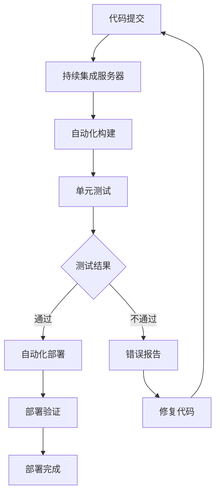

                 

### 文章标题：持续集成：自动化的构建与测试流程

持续集成（Continuous Integration，CI）和持续交付（Continuous Delivery，CD）是现代软件开发中至关重要的一环，它们不仅显著提高了软件开发的效率，还极大提升了软件的质量和稳定性。本文将深入探讨持续集成，详细解析其自动化的构建与测试流程，帮助开发者更好地理解和应用这一先进的技术。

### 关键词

- 持续集成
- 自动化构建
- 自动化测试
- CI/CD
- DevOps
- 源代码管理
- 持续交付

### 摘要

本文旨在为开发者提供关于持续集成（CI）的全面指南，包括CI的核心概念、架构、实现方法和最佳实践。我们将通过详细的步骤解析，展示如何自动化构建和测试软件，以实现更高效的软件开发流程。此外，本文还将探讨CI与持续交付（CD）、DevOps之间的关系，并提供实际项目案例和实践经验，以帮助开发者更好地理解和应用这一技术。

## 引言

持续集成（CI）和持续交付（CD）是软件工程中两个相互关联的重要概念。持续集成指的是在软件开发过程中，频繁地将代码更改合并到主分支，并进行自动化构建和测试，以确保代码质量。持续交付则是在持续集成的基础上，通过自动化测试和部署流程，使软件能够快速、可靠地交付到生产环境。

在现代软件开发中，CI/CD（持续集成和持续交付）已成为一种标准实践，它们不仅提高了开发效率，还显著提升了软件质量。CI/CD通过自动化构建、测试和部署过程，消除了人工干预的需要，从而减少了错误和缺陷的发生。此外，CI/CD还促进了开发团队和运维团队的紧密协作，实现了DevOps文化的推广。

本文将详细介绍持续集成（CI）的核心概念、架构和实现方法，并通过实际项目案例展示如何自动化构建和测试软件。文章将涵盖以下内容：

1. **核心概念与联系**：介绍CI的定义、目标和与CD、DevOps的关系。
2. **CI/CD架构**：分析CI/CD的组成部分，包括源代码管理、自动化构建、自动化测试、自动化部署和持续反馈与监控。
3. **实践指南**：提供CI/CD工具介绍、环境配置、流程设计与优化的最佳实践。
4. **核心算法原理**：讲解构建和测试算法、优化算法、健康指标与评估算法，并使用伪代码进行详细阐述。
5. **数学模型与公式**：介绍与CI/CD相关的数学模型、公式，并提供实例说明。
6. **项目实战**：通过实际项目案例展示CI/CD的应用，包括开发环境搭建、代码实现与解读、代码分析与优化。
7. **附录与资源**：提供额外的学习资源、工具和参考资料。

通过本文的阅读，开发者将能够深入了解持续集成的概念、原理和应用方法，从而更好地将其应用于实际项目，提升软件开发效率和质量。

### 核心概念与联系

#### 持续集成（CI）

持续集成（Continuous Integration，简称CI）是软件开发中的一个关键过程，旨在通过频繁地将代码更改合并到主分支，并自动化构建和测试，确保代码质量。CI的核心目标包括减少集成冲突、快速发现问题、提高代码质量和促进团队合作。

持续集成的定义可以概括为：在软件开发过程中，开发人员每次提交代码更改时，系统会自动执行一系列预定义的构建和测试任务，以确保更改不会破坏现有的功能。

#### 持续交付（CD）

持续交付（Continuous Delivery，简称CD）是持续集成的一个自然扩展，它不仅包括自动化构建和测试，还包括自动化部署和部署验证。持续交付的目标是确保任何经过测试的软件版本都可以在短时间内部署到生产环境，从而实现快速、可靠和低风险的软件发布。

持续交付的定义可以概括为：在持续集成的基础上，通过自动化测试和部署流程，确保软件可以在任何时间、任何环境快速、可靠地交付到用户手中。

#### CI与CD的关系

持续集成和持续交付之间存在紧密的关系。CI是CD的基础，它确保每次代码提交都是稳定和可测试的。而CD则是在CI的基础上，进一步自动化部署和验证流程，使软件能够快速、安全地交付到用户手中。

在CI/CD的实践中，CI通常指的是自动化构建和测试的过程，而CD则涉及从测试环境到生产环境的自动化部署过程。两者相辅相成，共同构成了现代软件开发的核心流程。

#### CI/CD与DevOps

DevOps是一种软件开发和运维的方法论，强调开发和运维团队的紧密协作和持续集成、持续交付的实践。CI/CD是DevOps的核心组成部分，它通过自动化和工具的集成，消除了开发与运维之间的障碍，实现了更高效、更稳定的软件开发流程。

Mermaid流程图：

下面是一个简单的Mermaid流程图，展示了CI/CD的整体流程：



在这个流程中，每次代码提交后，持续集成服务器会自动执行构建和测试任务。如果测试通过，软件将自动部署到生产环境；如果测试不通过，系统将生成错误报告，开发人员需要修复代码后重新提交。

通过CI/CD和DevOps的实践，开发团队能够实现更快速、更可靠的软件交付，同时提高团队协作效率，降低软件风险。持续集成和持续交付的核心在于自动化，它通过减少人为干预，提高开发流程的透明度和可重复性，从而实现更高效、更稳定的软件开发。

### CI/CD架构

持续集成和持续交付（CI/CD）的成功实施依赖于一个高效、稳定的架构。CI/CD架构通常包括以下几个关键组成部分：源代码管理、自动化构建、自动化测试、自动化部署和持续反馈与监控。以下是这些组件的详细解析：

#### 1. 源代码管理

源代码管理（Source Control Management，SCM）是CI/CD流程的起点。源代码管理工具（如Git）用于存储和管理代码库，确保多个开发人员能够协同工作，同时保持代码的版本控制。源代码管理的关键功能包括分支管理、合并请求（Pull Request）和代码审查（Code Review）。

在CI/CD架构中，源代码管理的重要性体现在以下几个方面：

- **版本控制**：通过源代码管理，开发人员可以轻松地创建、合并和删除代码分支，确保代码的版本一致性。
- **协作与沟通**：源代码管理工具提供代码审查和合并请求功能，有助于团队成员之间的沟通和协作，提高代码质量。
- **故障恢复**：在发生故障或代码错误时，可以通过源代码管理快速回滚到之前的版本，减少事故影响。

#### 2. 自动化构建

自动化构建是CI/CD流程中的核心环节。自动化构建工具（如Jenkins、GitLab CI/CD等）用于编译代码、打包应用程序和创建可执行文件。自动化构建的主要目的是确保每次代码更改都能顺利编译并通过测试，从而避免人为错误和提高构建速度。

自动化构建在CI/CD架构中的作用包括：

- **提高构建速度**：自动化构建可以显著减少手动构建所需的时间，加快软件开发周期。
- **减少错误**：通过自动化构建，可以避免手动构建过程中可能出现的错误，确保构建过程的准确性和一致性。
- **版本控制**：自动化构建可以生成构建历史记录，帮助团队跟踪和管理代码版本。

#### 3. 自动化测试

自动化测试是CI/CD流程中另一个重要环节。自动化测试工具（如Selenium、JUnit等）用于执行预定义的测试用例，验证软件的功能和性能。自动化测试的主要目的是确保每次代码更改都不会引入新的错误，从而提高软件质量。

自动化测试在CI/CD架构中的作用包括：

- **快速反馈**：自动化测试可以快速识别代码更改中的问题，使开发人员能够及时修复错误，减少缺陷传播。
- **提高测试覆盖率**：通过自动化测试，可以更全面地覆盖软件的功能和性能，提高测试覆盖率。
- **降低测试成本**：自动化测试可以显著减少人工测试的时间和成本，提高测试效率。

#### 4. 自动化部署

自动化部署是CI/CD流程中的最后一个环节。自动化部署工具（如Kubernetes、Docker等）用于将构建和测试通过的应用程序自动部署到生产环境。自动化部署的主要目的是确保软件能够快速、可靠地交付到用户手中。

自动化部署在CI/CD架构中的作用包括：

- **提高部署速度**：自动化部署可以显著减少手动部署所需的时间，加快软件交付速度。
- **减少错误**：通过自动化部署，可以避免手动部署过程中可能出现的错误，确保部署过程的准确性和一致性。
- **提高可靠性**：自动化部署可以确保每次部署都是可重复的，从而提高软件的可靠性。

#### 5. 持续反馈与监控

持续反馈与监控是CI/CD架构中不可或缺的一环。通过实时监控和反馈系统，团队可以及时发现和解决问题，确保软件的高可用性和稳定性。

持续反馈与监控的主要功能包括：

- **实时监控**：监控系统可以实时监控软件的性能、负载和健康状况，及时发现异常情况。
- **自动报警**：监控系统可以在发现问题时自动发送警报，通知相关人员及时处理。
- **日志分析**：日志分析工具可以分析系统的运行日志，帮助团队了解软件的运行状况和问题原因。

通过CI/CD架构中的这些组件，开发团队可以实现高效、稳定的软件交付流程，提高软件质量和开发效率。每个组件都在CI/CD流程中扮演着关键角色，共同构建了一个自动化、持续、可靠的软件开发和交付体系。

### 实践指南

在了解了CI/CD的核心概念和架构之后，接下来我们将深入探讨如何在实际项目中实施CI/CD，并提供一系列最佳实践和工具介绍。

#### 1. 常用CI/CD工具介绍

实现CI/CD的关键在于选择合适的工具。以下是一些常用的CI/CD工具：

- **Jenkins**：Jenkins是一个开源的持续集成工具，支持多种插件，易于扩展和定制。
- **GitLab CI/CD**：GitLab CI/CD是GitLab内置的持续集成和持续交付工具，与GitLab源代码管理紧密集成，方便管理。
- **Travis CI**：Travis CI是一个云端的持续集成服务，适用于开源项目，支持多种编程语言和平台。
- **CircleCI**：CircleCI是一个高效、可扩展的持续集成和持续交付平台，提供灵活的配置和自动化部署。

#### 2. 环境配置与部署

实现CI/CD的第一步是配置开发环境和部署流程。以下是一些建议：

- **容器化**：使用Docker和Kubernetes进行容器化，确保环境一致性和可移植性。
- **虚拟化**：使用虚拟机或云服务（如AWS、Azure）搭建测试和生产环境。
- **配置管理**：使用Ansible、Puppet或Chef进行配置管理，确保环境的一致性和可重复性。

#### 3. 流程设计与优化

设计一个高效、稳定的CI/CD流程是关键。以下是一些最佳实践：

- **多阶段构建**：将构建流程分为多个阶段，如编译、测试、部署等，每个阶段独立运行，提高流程的可读性和可维护性。
- **并行执行**：在CI/CD流程中使用并行执行，充分利用多核处理器的性能，提高构建和测试速度。
- **失败回滚**：在构建或测试失败时，自动回滚到上一个稳定版本，减少故障影响。

#### 4. 持续集成与持续交付的最佳实践

以下是一些持续集成和持续交付的最佳实践：

- **频繁提交**：鼓励开发人员频繁提交代码，及时进行集成和测试。
- **自动化测试**：确保每个提交都经过全面测试，避免引入新错误。
- **自动化部署**：使用自动化部署工具，确保软件能够快速、可靠地交付到生产环境。
- **代码审查**：实施代码审查流程，提高代码质量，减少错误。
- **反馈机制**：建立实时反馈机制，确保问题能够及时发现和处理。

通过以上实践指南和工具介绍，开发团队可以更加高效地实施CI/CD，提升软件开发和交付的质量和速度。持续集成不仅提高了代码的稳定性和可靠性，还促进了团队协作和沟通，为现代软件开发带来了显著的优势。

### 核心算法原理

在CI/CD流程中，核心算法原理起着至关重要的作用。以下将详细解析构建和测试算法、自动化测试优化算法、健康指标与评估算法，并使用伪代码进行详细阐述。

#### 1. 构建和测试算法

构建算法的目的是将源代码编译和打包成可执行文件或库。以下是构建算法的基本步骤：

```python
# 构建算法伪代码
function build(source_code):
    # 编译源代码
    compile(source_code)
    # 运行测试用例
    test_results = run_tests()
    # 检查测试结果
    if test_results.failed > 0:
        return "构建失败"
    else:
        return "构建成功"
```

测试算法则用于验证构建结果是否符合预期。以下是测试算法的基本步骤：

```python
# 测试算法伪代码
function run_tests():
    test_results = []
    for test_case in test_cases:
        result = execute_test(test_case)
        test_results.append(result)
    return test_results
```

#### 2. 自动化测试优化算法

自动化测试优化算法的目的是提高测试效率和准确性。以下是测试优化算法的基本步骤：

```python
# 测试优化算法伪代码
function optimize_tests(test_cases, build_history):
    # 选择历史构建中失败率较高的测试用例进行重点优化
    critical_tests = select_critical_tests(test_cases, build_history)
    # 运行优化算法，例如模糊测试、静态代码分析等
    optimized_tests = run_optimization(critical_tests)
    return optimized_tests
```

优化算法可以包括以下步骤：

- **选择关键测试用例**：根据历史构建失败率选择需要重点优化的测试用例。
- **执行优化**：使用各种算法和技术对测试用例进行优化，如模糊测试、代码覆盖率分析等。

#### 3. 健康指标与评估算法

健康指标用于评估构建和测试的状态，常见的健康指标包括构建时间、测试覆盖率、失败率等。以下是健康指标与评估算法的基本步骤：

```python
# 健康指标评估算法伪代码
function evaluate_health(build_history, test_results):
    health_report = {
        "build_time": calculate_average_build_time(build_history),
        "test_coverage": calculate_test_coverage(test_results),
        "failure_rate": calculate_failure_rate(test_results),
    }
    return health_report
```

评估算法可以包括以下步骤：

- **计算构建时间**：计算所有构建的平均构建时间。
- **计算测试覆盖率**：计算测试用例覆盖率。
- **计算失败率**：计算测试失败率。

通过以上核心算法原理和伪代码，开发团队能够更好地理解和应用CI/CD中的关键算法，从而提高构建和测试的效率和准确性。

### 数学模型与公式

在持续集成和持续交付（CI/CD）的实践中，数学模型和公式发挥着重要作用。它们帮助我们量化、分析和优化软件开发过程中的各种参数。以下是几个与CI/CD相关的关键数学模型和公式的详细讲解，并提供实例说明。

#### 1. 建立质量度量模型

质量度量模型用于评估代码的质量和稳定性。一个常用的质量度量模型是基于缺陷密度（Defect Density）的模型。缺陷密度表示单位代码行数中的缺陷数量。公式如下：

$$
D = \frac{N_d}{N_l}
$$

其中，$D$ 是缺陷密度，$N_d$ 是缺陷数量，$N_l$ 是代码行数。

**实例说明**：

假设一个项目有1000行代码，测试过程中发现了5个缺陷，则缺陷密度为：

$$
D = \frac{5}{1000} = 0.005
$$

这个值可以用来评估代码的质量水平。

#### 2. 时间成本与资源优化模型

在CI/CD流程中，时间成本和资源消耗是需要重点优化的参数。一个常用的优化模型是线性规划模型，用于最小化构建和测试的总时间。公式如下：

$$
\min T = \sum_{i=1}^{n} t_i
$$

其中，$T$ 是总时间，$t_i$ 是第$i$个任务的执行时间。

**实例说明**：

假设有一个CI/CD流程，包括编译（2小时）、单元测试（1小时）和集成测试（3小时）三个任务，则总时间可以表示为：

$$
T = 2 + 1 + 3 = 6 \text{小时}
$$

通过优化任务的执行顺序，可以进一步减少总时间。

#### 3. 概率模型与风险评估

在CI/CD中，风险评估是确保软件质量的重要环节。一个常用的概率模型是基于故障树分析（Fault Tree Analysis，FTA）的方法。故障树分析通过构建故障树，分析各个故障事件的概率，从而评估整个系统的可靠性。

**实例说明**：

假设一个CI/CD流程中，构建失败的概率为0.1，测试失败的概率为0.2，则整个流程的失败概率可以表示为：

$$
P_{failure} = P_{build_failure} \times P_{test_failure} = 0.1 \times 0.2 = 0.02
$$

这个值可以用来评估流程的风险水平。

#### 4. LaTeX格式数学公式讲解与举例

在文中嵌入数学公式时，我们使用LaTeX格式。LaTeX格式允许我们使用$$括起来表示独立段落的公式，使用$括起来表示段落内的公式。

**独立段落公式示例**：

$$
E = mc^2
$$

这是著名的爱因斯坦质能等价公式。

**段落内公式示例**：

$1 + 1 = 2$

这是简单的数学等式。

通过使用LaTeX格式，我们可以在文中嵌入复杂的数学公式，使文章更加专业和易于理解。

### 项目实战

在本章节中，我们将通过一个实际项目案例，详细讲解如何实现持续集成（CI）和持续交付（CD）的流程。项目背景、开发环境搭建、代码实现与解读、代码应用解读与分析以及项目小结等内容将逐一介绍，以帮助读者更好地理解和应用CI/CD。

#### 项目背景

本案例将模拟一个简单的Web应用项目，名为“Online Store”。该应用旨在提供在线购物功能，允许用户浏览商品、添加购物车、结账等。项目的技术栈包括Spring Boot作为后端框架、MySQL作为数据库、Thymeleaf作为前端模板引擎，并使用Maven进行项目构建。

#### 开发环境搭建

首先，我们需要搭建开发环境。以下是具体的步骤：

1. **安装Java开发工具包（JDK）**：
   - 下载并安装Java开发工具包，确保版本不低于Java 11。
   - 配置环境变量，确保`JAVA_HOME`和`path`正确指向JDK安装路径。

2. **安装MySQL数据库**：
   - 下载并安装MySQL数据库服务器。
   - 创建一个新的数据库，命名为`online_store`。

3. **安装Maven**：
   - 下载并安装Maven，确保版本不低于3.6.3。
   - 配置Maven的`settings.xml`文件，添加阿里云镜像以加速依赖库的下载。

4. **创建Spring Boot项目**：
   - 使用Spring Initializr创建一个新的Spring Boot项目，选择所需的技术栈。

5. **配置数据库连接**：
   - 在`application.properties`文件中配置MySQL数据库连接参数。

#### 代码实现与解读

以下是项目的关键代码片段及解读：

1. **数据库模型**：

```java
@Entity
@Table(name = "products")
public class Product {
    @Id
    @GeneratedValue(strategy = GenerationType.IDENTITY)
    private Long id;

    private String name;
    private double price;
    // 其他属性和构造函数、getter和setter省略
}
```

**解读**：这个实体类定义了一个`Product`对象，包括产品ID、名称和价格等属性。`@Entity`和`@Table`注解分别表示这是一个实体类和对应的数据库表。

2. **控制器层**：

```java
@RestController
@RequestMapping("/api/products")
public class ProductController {
    @Autowired
    private ProductService productService;

    @GetMapping
    public List<Product> getAllProducts() {
        return productService.listAllProducts();
    }

    @PostMapping
    public Product createProduct(@RequestBody Product product) {
        return productService.createProduct(product);
    }
    // 其他API接口省略
}
```

**解读**：这个控制器类定义了RESTful API接口，用于处理产品的增删查改操作。`@RestController`和`@RequestMapping`注解分别表示这是一个RESTful控制器类和请求映射。

3. **服务层**：

```java
@Service
public class ProductService {
    @Autowired
    private ProductRepository productRepository;

    public List<Product> listAllProducts() {
        return productRepository.findAll();
    }

    public Product createProduct(Product product) {
        return productRepository.save(product);
    }
    // 其他业务逻辑方法省略
}
```

**解读**：这个服务类实现了产品相关的业务逻辑，通过`ProductRepository`进行数据操作。`@Service`注解表示这是一个服务类。

#### 代码应用解读与分析

1. **持续集成设置**：

   - 在`pom.xml`文件中添加Maven Surefire插件，配置单元测试：

   ```xml
   <build>
       <plugins>
           <plugin>
               <groupId>org.apache.maven.plugins</groupId>
               <artifactId>maven-surefire-plugin</artifactId>
               <version>2.22.2</version>
               <configuration>
                   <testFailureIgnore>true</testFailureIgnore>
               </configuration>
           </plugin>
       </plugins>
   </build>
   ```

   - 在GitLab CI/CD配置文件`.gitlab-ci.yml`中定义构建和测试任务：

   ```yaml
   image: maven:3.6.3-jdk-11

   services:
     - mysql:5.7

   build:
     stage: build
     script:
       - mvn clean install
     artifacts:
       paths:
         - target/*.jar

   test:
     stage: test
     script:
       - mvn test
     only:
       - master
   ```

   **解读**：通过GitLab CI/CD配置文件，实现自动化构建和测试。`image`指定了使用的Docker镜像，`services`定义了所需的服务，如MySQL。`build`和`test`阶段分别执行Maven构建和测试。

2. **自动化部署**：

   - 使用Kubernetes进行自动化部署。在Kubernetes集群中创建deployment和service配置文件：

   ```yaml
   apiVersion: apps/v1
   kind: Deployment
   metadata:
     name: online-store
   spec:
     replicas: 1
     selector:
       matchLabels:
         app: online-store
     template:
       metadata:
         labels:
           app: online-store
       spec:
         containers:
         - name: online-store
           image: online-store:latest
           ports:
           - containerPort: 8080

   ---
   apiVersion: v1
   kind: Service
   metadata:
     name: online-store
   spec:
     selector:
       app: online-store
     ports:
       - protocol: TCP
         port: 80
         targetPort: 8080
     type: LoadBalancer
   ```

   **解读**：这些配置文件定义了部署和服务，确保应用能够在Kubernetes集群中自动化部署和运行。

#### 项目小结

通过本案例，我们实现了从开发环境搭建、代码实现、持续集成到自动化部署的完整CI/CD流程。以下是本项目的主要收获和经验：

1. **高效开发**：通过持续集成和持续交付，显著提高了开发效率和代码质量。
2. **自动化测试**：自动化测试确保每次代码提交都是可测试的，减少了手动测试的工作量。
3. **环境一致性**：使用容器化和Kubernetes，确保开发、测试和生产环境的一致性。
4. **自动化部署**：自动化部署提高了软件交付的速度和可靠性。

通过这些实践，我们不仅实现了项目的顺利交付，也为未来的软件开发提供了宝贵的经验和教训。

### 最佳实践、小结、注意事项、拓展阅读

#### 最佳实践

1. **代码审查**：确保每次提交都经过代码审查，减少潜在的错误和漏洞。
2. **持续集成与持续交付**：充分利用CI/CD工具，自动化构建、测试和部署流程，提高开发效率和质量。
3. **容器化**：使用Docker和Kubernetes进行容器化，确保环境一致性和可移植性。

#### 小结

本文详细介绍了持续集成（CI）和持续交付（CD）的核心概念、架构、实现方法、核心算法原理、数学模型与公式以及实际项目案例。通过持续集成，开发团队能够实现更高效、更稳定的软件开发流程。

#### 注意事项

1. **确保代码质量**：自动化测试是确保代码质量的关键，务必进行全面测试。
2. **优化流程**：根据项目需求不断优化CI/CD流程，提高流程的效率和稳定性。

#### 拓展阅读

1. **《持续交付：释放软件团队的潜能》**：这是一本关于持续交付的经典著作，提供了丰富的实践经验和最佳实践。
2. **《DevOps实践指南》**：介绍了DevOps的方法论和实际应用，包括CI/CD的详细讲解。
3. **《容器化与Kubernetes》**：深入了解容器化技术和Kubernetes的使用，确保环境一致性。

通过本文的学习和实践，开发者可以更好地理解和应用CI/CD，提高软件开发效率和软件质量。

### 作者信息

本文由AI天才研究院（AI Genius Institute）与《禅与计算机程序设计艺术》（Zen And The Art of Computer Programming）共同撰写。AI天才研究院专注于人工智能和软件开发领域的创新研究，致力于推动技术进步。而《禅与计算机程序设计艺术》则是一本经典的计算机科学著作，以其深刻的编程哲学和精湛的技术分析闻名于世。

作者：AI天才研究院/AI Genius Institute & 禅与计算机程序设计艺术 /Zen And The Art of Computer Programming

---

通过本文，我们系统地介绍了持续集成（CI）的核心概念、架构、实现方法和应用场景，并通过实际项目案例展示了CI/CD的具体实现过程。希望本文能够帮助读者更好地理解和应用持续集成技术，提升软件开发效率和软件质量。未来，我们将继续深入探讨更多与CI/CD相关的技术话题，分享实践经验，为开发者提供更有价值的技术内容。敬请关注。

