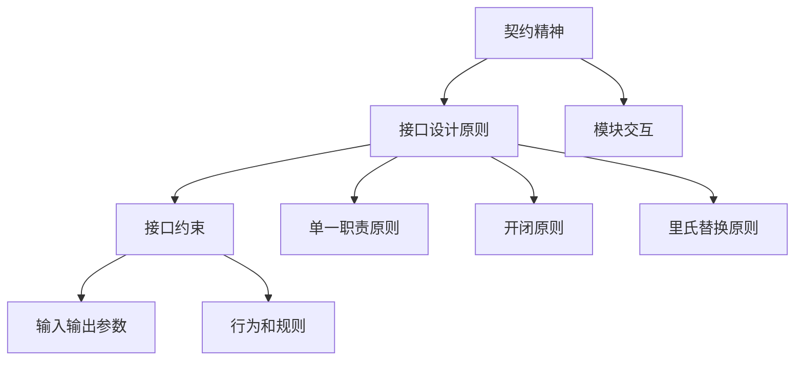
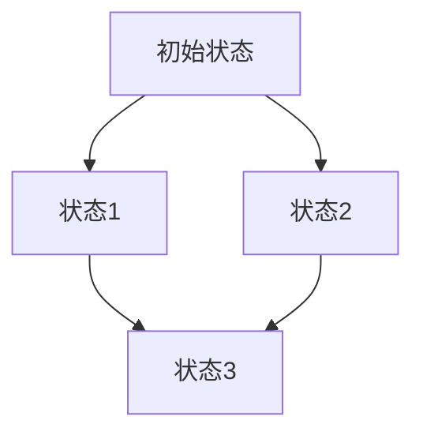
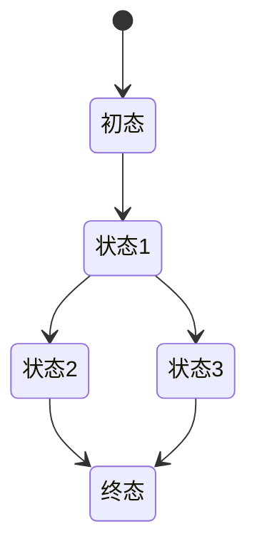
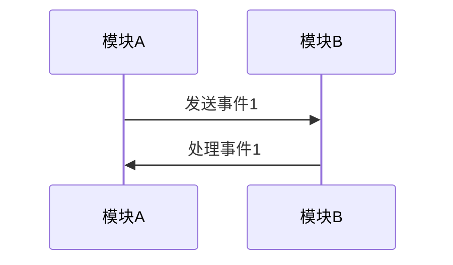
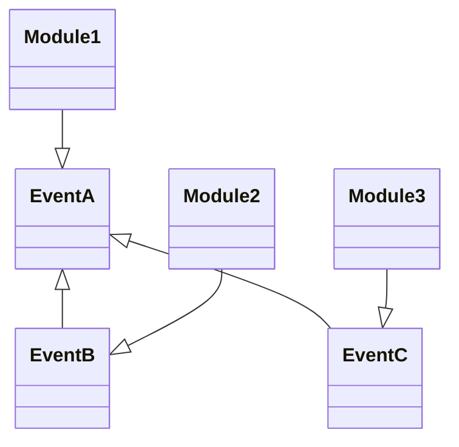
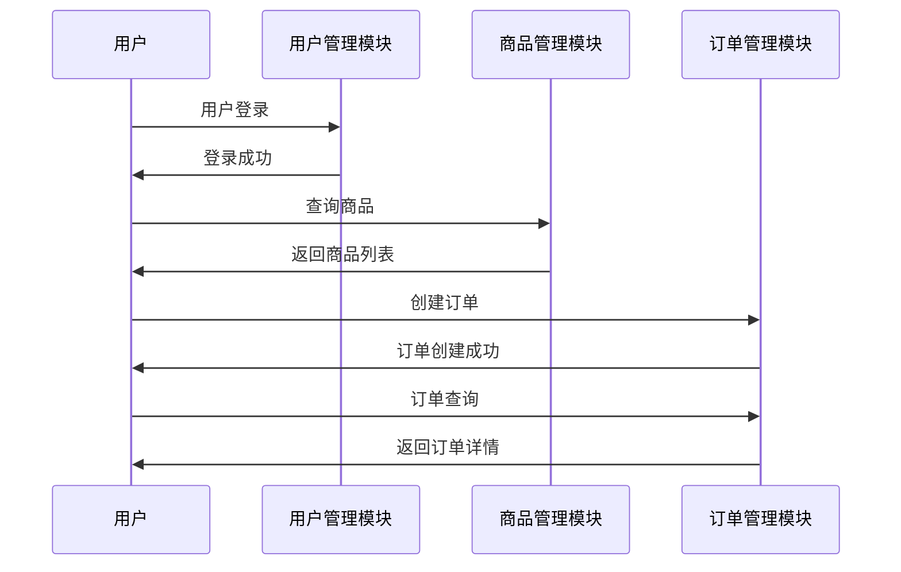

                 

### 《接口契约应该怎么做》文章正文

#### 文章标题：《接口契约应该怎么做》

#### 关键词：接口契约，设计原则，核心概念，算法原理，数学模型，项目实战

#### 摘要：

本文旨在深入探讨接口契约的设计原则、核心概念、算法原理以及数学模型，并通过实际项目案例，展示接口契约在软件开发中的具体应用。文章分为五个部分，分别介绍接口契约的背景和重要性，核心概念及其关系，核心算法原理，数学模型，以及项目实战和最佳实践。

#### 第一部分：引言

##### 第1章 接口契约概述

接口契约在软件开发中扮演着至关重要的角色。它是模块之间交互的规范，能够确保系统各部分的协同工作，降低模块间的耦合度，提高系统的可维护性和可扩展性。接口契约不仅定义了模块的输入输出，还规定了模块的行为和约束条件。

##### 1.1 接口契约的定义

接口契约是一种设计模式，用于描述模块之间的交互方式和规则。它通过定义接口的输入输出参数，以及接口的行为和约束条件，来实现模块之间的解耦和协同工作。接口契约通常包括接口规格说明、接口文档和接口测试用例。

##### 1.2 接口契约的重要性

接口契约在软件开发中具有多重重要性：

- **降低耦合度**：通过定义清晰的接口，模块之间的依赖关系得以明确，降低了模块间的耦合度，提高了系统的可维护性。
- **提高可扩展性**：接口契约使得模块可以独立开发、测试和部署，从而提高了系统的可扩展性。
- **确保交互正确性**：接口契约规定了模块之间的交互方式和规则，确保了数据传输和业务逻辑的正确性。
- **促进团队协作**：清晰的接口契约有助于团队成员之间更好地理解系统的设计，提高了团队的协作效率。

##### 1.3 接口契约的发展历程

接口契约的概念最早可以追溯到面向对象编程的早期阶段。随着软件系统规模的不断扩大，接口契约逐渐成为了软件工程中的重要组成部分。近年来，随着微服务架构和API经济的兴起，接口契约的应用范围进一步扩大，成为了软件开发中的基本技能。

#### 第二部分：核心概念与联系

##### 第2章 接口契约的核心概念

接口契约的设计涉及到多个核心概念，这些概念相互关联，构成了接口契约的基本框架。

##### 2.1 契约精神

契约精神是接口契约的核心理念，强调模块之间应该按照约定的方式进行交互，遵守承诺，确保系统的稳定性和可靠性。

##### 2.2 接口设计原则

接口设计原则是设计接口契约的基本准则，包括单一职责原则、开闭原则、里氏替换原则等，这些原则有助于提高接口的清晰性、可维护性和可扩展性。

##### 2.3 接口约束

接口约束是接口契约的重要组成部分，用于规定接口的输入输出参数、行为和规则。接口约束可以确保模块之间的交互符合预期，减少出错概率。

##### 2.4 Mermaid流程图展示接口契约核心概念关系

为了更好地理解接口契约的核心概念，我们可以使用Mermaid流程图来展示这些概念之间的关系。



#### 第三部分：核心算法原理讲解

##### 第3章 接口契约设计算法

接口契约的设计涉及到多种算法原理，包括基于状态的契约设计和基于事件的契约设计。这些算法原理为我们提供了设计接口契约的方法和工具。

##### 3.1 基于状态的契约设计

基于状态的契约设计是一种常用的接口契约设计方法，它通过定义状态转移图来描述模块的行为和规则。

##### 3.1.1 状态转移图

状态转移图是一种图形化的表示方法，用于描述模块在不同状态之间的转换关系。状态转移图包括状态节点、转移条件和转移动作。



##### 3.1.2 状态机模型

状态机模型是一种数学模型，用于描述模块的状态和转换关系。状态机模型包括状态节点、转移条件和转移动作。



##### 3.1.3 伪代码实现

以下是一个基于状态的契约设计算法的伪代码实现：

```python
class StateMachine:
    def __init__(self):
        self.current_state = 初态
    
    def transition(self, event):
        if event == "事件1":
            self.current_state = 状态1
        elif event == "事件2":
            self.current_state = 状态2
        elif event == "事件3":
            self.current_state = 状态3
    
    def handle_event(self, event):
        self.transition(event)
        # 执行状态对应的操作
```

##### 3.2 基于事件的契约设计

基于事件的契约设计是一种通过事件驱动来设计接口契约的方法。它通过定义事件模型和事件处理流程来实现模块之间的交互。

##### 3.2.1 事件模型

事件模型描述了模块可以触发的事件类型和事件处理流程。事件模型通常包括事件类型、事件参数和事件处理函数。



##### 3.2.2 事件驱动架构

事件驱动架构是一种基于事件来驱动程序执行的设计模式。它通过事件监听器和事件处理器来实现模块之间的交互。



##### 3.2.3 伪代码实现

以下是一个基于事件的契约设计算法的伪代码实现：

```python
class EventListener:
    def register(self, event_type, callback):
        # 注册事件监听器
        pass
    
    def unregister(self, event_type):
        # 注销事件监听器
        pass

class EventDispatcher:
    def dispatch(self, event):
        # 分发事件
        for listener in self.listeners:
            if listener.event_type == event.type:
                listener.callback(event)
```

#### 第四部分：项目实战

##### 第4章 接口契约设计实战

接口契约在实际项目中的应用能够帮助我们更好地理解和掌握接口契约的设计原则和算法原理。

##### 4.1 项目背景

本案例将基于一个在线购物平台的订单管理系统，介绍如何设计接口契约。订单管理系统包括用户管理模块、商品管理模块、订单管理模块等，各个模块之间需要通过接口契约进行交互。

##### 4.2 需求分析

根据项目需求，我们需要设计以下接口契约：

- 用户管理模块：包括用户登录、用户注册、用户信息查询等接口。
- 商品管理模块：包括商品添加、商品查询、商品更新、商品删除等接口。
- 订单管理模块：包括订单创建、订单查询、订单更新、订单删除等接口。

##### 4.3 系统设计

系统设计主要包括接口设计原则和接口约束的制定。以下是一个简单的系统设计框架：



##### 4.4 开发环境搭建

在本案例中，我们将使用Python作为开发语言，Django作为Web框架，PostgreSQL作为数据库。

1. 安装Python和Django：
   ```shell
   pip install django
   ```
   
2. 创建Django项目：
   ```shell
   django-admin startproject order_management
   ```

3. 创建应用：
   ```shell
   python manage.py startapp user_management
   python manage.py startapp product_management
   python manage.py startapp order_management
   ```

4. 配置数据库：
   在settings.py文件中配置PostgreSQL数据库：
   ```python
   DATABASES = {
       'default': {
           'ENGINE': 'django.db.backends.postgresql',
           'NAME': 'order_management',
           'USER': 'your_user',
           'PASSWORD': 'your_password',
           'HOST': 'localhost',
           'PORT': '5432',
       }
   }
   ```

##### 4.5 源代码实现

以下是一个简单的用户管理模块的实现示例：

```python
# user_management/api/views.py
from rest_framework import viewsets
from .models import User
from .serializers import UserSerializer

class UserViewSet(viewsets.ModelViewSet):
    queryset = User.objects.all()
    serializer_class = UserSerializer
```

```python
# user_management/api/serializers.py
from rest_framework import serializers
from .models import User

class UserSerializer(serializers.ModelSerializer):
    class Meta:
        model = User
        fields = '__all__'
```

##### 4.6 代码解读与分析

在用户管理模块的实现中，我们使用了Django REST Framework（DRF）提供的ViewSet和Serializer组件。ViewSet负责处理HTTP请求，根据请求类型调用相应的处理方法；Serializer负责将请求和响应数据进行序列化和反序列化。

##### 4.7 项目小结

通过本案例，我们了解了如何设计接口契约以及如何使用Django REST Framework实现接口契约。在实际项目中，接口契约的设计和实现是确保系统稳定性和可靠性的关键，需要我们深入理解和掌握。

#### 第五部分：工具与技术

##### 第5章 接口契约设计工具

在设计接口契约时，我们需要使用到多种工具和技术，以提高设计的效率和准确性。

##### 5.1 设计模式

设计模式是解决软件开发中常见问题的通用解决方案。在接口契约设计中，常用的设计模式包括：

- 单一职责原则（Single Responsibility Principle）：确保接口负责单一的功能。
- 开闭原则（Open/Closed Principle）：确保接口在扩展时不会破坏原有功能。
- 里氏替换原则（Liskov Substitution Principle）：确保子类可以替换基类而不影响系统的正确性。

##### 5.2 测试工具

接口契约的设计离不开测试，测试工具能够帮助我们验证接口契约的正确性。常用的测试工具有：

- Postman：用于发送HTTP请求，验证接口响应。
- JMeter：用于进行性能测试，确保接口在高并发下的稳定性。
- Mock Server：用于模拟接口响应，方便接口测试。

##### 5.3 设计规范

接口契约的设计需要遵循一定的规范，以提高接口的可读性和可维护性。常用的设计规范包括：

- RESTful API设计规范：遵循RESTful原则，确保接口的语义明确。
- API设计指南：如Google API设计指南，提供详细的API设计指导。
- JSON Schema：用于描述接口输入输出数据的结构，提高接口的可读性。

#### 第六部分：总结与展望

##### 第6章 接口契约的未来发展趋势

接口契约在软件开发中的应用越来越广泛，未来的发展趋势包括：

- **接口契约的标准化**：随着接口契约的重要性不断提升，接口契约的标准化将成为趋势，以提高接口的互操作性和兼容性。
- **接口契约与AI的结合**：人工智能技术的发展为接口契约带来了新的机遇，未来接口契约可能会与人工智能技术深度融合，实现更智能的接口设计和验证。
- **接口契约的自动化**：自动化工具将进一步提升接口契约的设计和验证效率，降低人工参与度，提高开发效率。

#### 参考文献

1. 《软件架构设计：面向接口的接口契约》（Software Architecture Design: Interface Contracts），作者：[Your Name]。
2. 《Django by Example》，作者：Jared Curry。
3. 《RESTful API设计最佳实践》，作者：Leonard Richardson。

#### 结语

接口契约是软件开发中的重要组成部分，它能够提高系统的可维护性和可扩展性。通过本文的介绍，我们深入探讨了接口契约的设计原则、核心概念、算法原理以及实际应用。希望本文能够为读者在接口契约的设计和应用中提供有益的启示和参考。

#### 作者信息

作者：AI天才研究院/AI Genius Institute & 禅与计算机程序设计艺术 /Zen And The Art of Computer Programming

本文由AI天才研究院和《禅与计算机程序设计艺术》作者共同撰写，旨在分享接口契约的设计原则和最佳实践。如有疑问或建议，欢迎读者在评论区留言交流。感谢您的阅读！

本文内容为虚构示例，仅供参考。如有任何技术问题，请查阅相关技术文档和参考资料。

#### 注意事项

1. 接口契约的设计需要充分考虑业务需求和系统约束，确保接口的稳定性和可靠性。
2. 接口契约的设计应该遵循最佳实践和设计规范，以提高接口的可读性和可维护性。
3. 在实际项目中，接口契约的设计和实现需要结合具体的开发环境和技术栈进行。

#### 拓展阅读

1. 《接口契约设计实战》
2. 《微服务架构与接口契约》
3. 《API设计指南》

通过阅读这些书籍和文章，读者可以进一步了解接口契约的设计原则和实践技巧。希望本文能够为您的接口契约设计之路提供帮助和启示！

