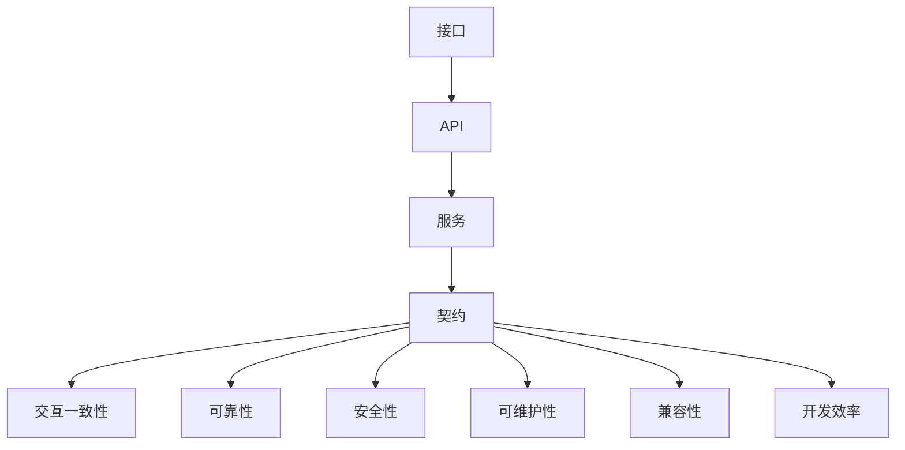

                 

### 接口契约应该怎么做？

#### 引言

在软件开发的领域中，接口契约（API Contract）是确保服务之间交互一致性和可靠性的关键。一个良好的接口契约不仅能够提高系统的可维护性，还能提升开发效率和代码质量。本文将围绕“接口契约应该怎么做”这一核心问题，逐步展开分析，帮助读者深入了解接口契约的设计原则、实现方法以及在实际应用中的实践。

本文将分为两部分：

**第一部分：接口契约基础**  
- **第1章：接口契约概述**  
- **第2章：接口契约设计原则**  
- **第3章：接口契约的具体实现**  
- **第4章：接口契约工具与框架**

**第二部分：接口契约实践**  
- **第5章：接口契约与微服务**  
- **第6章：接口契约测试与文档**  
- **第7章：接口契约常见问题与解决方案**  
- **第8章：接口契约的未来发展趋势**

通过本文，读者将系统地了解接口契约的各个方面，从理论到实践，全面掌握接口契约的设计与实现方法。

#### 接口契约的定义与重要性

在开始详细探讨接口契约之前，我们需要首先明确其定义。接口契约，简单来说，就是服务提供者（Service Provider）和服务消费者（Service Consumer）之间对于接口行为的约定。这种约定通常包括接口的输入参数、输出结果、错误处理机制、性能要求等。

接口契约的定义不仅涵盖了功能层面的约定，还包括非功能层面的约束，如安全性、可伸缩性、兼容性等。因此，接口契约不仅仅是一个技术文档，它更是整个服务交互过程中的“法律文件”，确保服务之间的交互符合预期。

那么，接口契约的重要性体现在哪些方面呢？

1. **确保交互一致性**：接口契约明确规定了服务提供者和服务消费者之间的交互规则，从而避免因理解不一致导致的错误和故障。

2. **提高开发效率**：接口契约定义了服务接口的标准，使得开发者能够专注于实现业务逻辑，而无需过多考虑服务之间的交互细节。

3. **提升系统可维护性**：接口契约提供了一个清晰的接口规范，有助于维护和升级系统，降低修改成本。

4. **增强系统兼容性**：通过接口契约，不同的服务可以更容易地集成和替换，提高了系统的灵活性和可扩展性。

5. **保障系统安全性**：接口契约可以帮助定义接口的安全策略，确保服务之间的交互符合安全要求，防止恶意攻击和数据泄露。

#### 接口契约与API设计的关系

接口契约与API设计（Application Programming Interface Design）是紧密相关的。实际上，接口契约是API设计过程中的一个重要组成部分。API设计不仅包括接口定义，还包括数据模型、请求/响应格式、错误处理机制等方面。

接口契约与API设计之间的关系可以概括为以下几点：

1. **接口契约是API设计的指南**：在API设计阶段，接口契约可以作为设计指南，帮助开发者明确接口的行为规范和预期结果。

2. **接口契约是API文档的基础**：接口契约通常会被记录在API文档中，作为开发者、测试人员以及运维人员的参考。

3. **接口契约是API测试的依据**：接口契约定义了接口的预期行为，为API测试提供了依据，确保接口按照设计要求工作。

4. **接口契约是API维护的参考**：随着系统的迭代和升级，接口契约可以作为维护和更新API的参考，确保变更的一致性和可控性。

#### 接口契约在不同开发模式中的应用

接口契约在不同的开发模式中有着不同的应用。以下将介绍几种常见的开发模式以及接口契约在其中的应用。

1. **瀑布模型**：在瀑布模型中，接口契约通常在系统设计阶段就被制定出来，并在开发、测试和部署阶段得到严格遵循。接口契约确保了系统在不同阶段的一致性，减少了后期变更带来的风险。

2. **敏捷开发**：在敏捷开发中，接口契约更多地体现在迭代和版本控制中。每个迭代都会制定相应的接口契约，确保每次交付的都是可运行、可集成、可测试的服务。接口契约帮助团队快速响应需求变化。

3. **微服务架构**：在微服务架构中，接口契约至关重要。每个微服务都有自己的接口契约，定义了与其他微服务的交互方式。接口契约确保了服务之间的松耦合，提高了系统的可维护性和可扩展性。

4. **云计算和容器化**：在云计算和容器化环境中，接口契约有助于服务的自动化部署和管理。接口契约可以与容器编排工具（如Kubernetes）集成，实现服务的自动化扩展和迁移。

#### 接口契约设计原则

为了确保接口契约的有效性和可维护性，我们需要遵循一些设计原则。以下将介绍几种关键的接口契约设计原则。

1. **可读性原则**：接口契约应该是易于阅读和理解的。使用清晰、简明的语言描述接口行为，避免使用复杂的术语和缩写。

2. **一致性原则**：接口契约应该保持一致性，确保在系统不同部分之间的接口定义一致。避免因不一致导致的混淆和错误。

3. **可维护性原则**：接口契约应该易于维护和更新。在系统变更时，确保接口契约能够快速适应，减少对现有代码的影响。

4. **安全性原则**：接口契约应该包含安全策略，确保服务之间的交互符合安全要求。例如，定义访问控制策略、加密传输数据等。

#### 接口契约的具体实现

接口契约的具体实现取决于所选的技术栈和开发模式。以下将介绍几种常见的接口契约实现方式。

1. **RESTful API契约设计**：RESTful API契约设计是当前最为流行的接口设计方式。它基于HTTP协议，使用URL表示资源，使用HTTP方法表示操作。RESTful API契约设计强调资源的抽象和统一接口。

2. **GraphQL API契约设计**：GraphQL API契约设计是一种查询语言，允许客户端查询所需的数据，而不是像RESTful API那样返回固定格式的数据。GraphQL API契约设计提高了系统的灵活性和效率。

3. **gRPC API契约设计**：gRPC API契约设计是一种基于HTTP/2的远程过程调用（RPC）框架。它使用Protocol Buffers（protobuf）定义服务接口和数据模型，具有高性能和跨语言的特性。

#### 接口契约工具与框架

为了简化接口契约的设计、实现和维护，可以使用各种工具和框架。以下将介绍几种常用的接口契约工具和框架。

1. **OpenAPI规范**：OpenAPI规范是一种用于定义API的语义化接口描述语言。它支持多种编程语言和工具，提供了丰富的功能和扩展性。

2. **RAML规范**：RAML（RESTful API Modeling Language）规范是一种用于定义API契约的领域特定语言。它提供了详细的接口描述和验证功能。

3. **Swagger规范**：Swagger规范是一种用于API文档和接口契约的工具。它支持多种格式和工具，提供了直观的UI界面和丰富的功能。

### 接口契约在微服务架构中的应用

在微服务架构中，接口契约是确保服务之间协作和一致性的重要手段。以下将介绍接口契约在微服务架构中的应用。

1. **服务拆分与集成**：接口契约帮助定义服务的边界，促进服务的拆分和集成。通过接口契约，可以明确服务之间的职责和交互方式。

2. **服务自治与松耦合**：接口契约确保服务自治和松耦合，降低服务之间的依赖。服务可以独立开发、测试和部署，提高了系统的灵活性和可扩展性。

3. **服务监控与治理**：接口契约可以作为服务监控和治理的依据。通过接口契约，可以监控服务的性能和健康状况，确保服务的稳定运行。

### 接口契约测试与文档

接口契约的测试和文档编写是确保接口质量的重要环节。以下将介绍接口契约测试和文档的编写方法。

1. **接口契约测试**：接口契约测试包括功能测试、性能测试和安全测试等。可以使用各种工具和框架进行接口测试，确保接口按照预期工作。

2. **接口契约文档**：接口契约文档是开发者、测试人员和运维人员的参考指南。文档应该包括接口定义、请求/响应格式、错误处理机制等内容。

### 接口契约常见问题与解决方案

在接口契约的设计和实现过程中，可能会遇到各种问题。以下将介绍一些常见的问题以及相应的解决方案。

1. **接口冲突问题**：接口冲突可能导致服务之间的交互不一致。解决方法是制定明确的接口规范，避免重复定义和冲突。

2. **接口性能问题**：接口性能问题可能影响服务的响应时间和稳定性。解决方法是优化接口实现，减少数据传输和计算开销。

3. **接口安全漏洞问题**：接口安全漏洞可能导致数据泄露和攻击。解决方法是实施严格的安全策略，如访问控制、数据加密等。

### 接口契约的未来发展趋势

随着技术的不断进步，接口契约也在不断演变。以下将探讨接口契约的未来发展趋势。

1. **接口契约的标准化**：接口契约的标准化将提高接口的互操作性和兼容性。例如，OpenAPI、RAML等规范将得到更广泛的应用。

2. **接口契约与人工智能的结合**：接口契约与人工智能（AI）的结合将提高接口的自适应性和智能化程度。例如，利用AI技术进行接口行为分析和优化。

3. **接口契约与容器化的集成**：接口契约与容器化技术的集成将实现更高效的接口部署和管理。例如，使用Kubernetes等容器编排工具管理接口契约。

### 结论

接口契约是确保服务之间交互一致性和可靠性的关键。本文从定义、设计原则、实现方法、工具与框架、微服务应用、测试与文档、常见问题与解决方案以及未来发展趋势等方面，全面阐述了接口契约的相关知识。通过本文，读者可以系统地了解接口契约，掌握接口契约的设计与实现方法，为实际项目提供指导。

#### 背景介绍

在软件开发的领域中，接口契约（API Contract）作为一种定义服务之间交互规范的重要工具，逐渐成为开发者关注的焦点。随着互联网和云计算的快速发展，软件系统的复杂度不断攀升，各组件之间的协作和集成变得更加重要。在这种背景下，接口契约的作用愈发凸显。

接口契约的定义简单来说，就是一个服务（或模块）提供的接口与其使用者之间达成的协议。这个协议明确了接口的输入参数、输出结果、错误处理机制以及性能要求等。接口契约不仅仅是一个技术文档，它还在服务提供者和服务消费者之间起到了“合同”的作用，确保交互的一致性和可靠性。

在软件开发过程中，接口契约的重要性体现在以下几个方面：

1. **确保交互一致性**：接口契约规定了服务之间的交互规范，使得开发者、测试人员和运维人员能够明确接口的行为预期，避免因理解不一致导致的错误和故障。

2. **提高开发效率**：通过接口契约，开发者可以专注于实现业务逻辑，而无需过多考虑服务之间的交互细节，从而提高开发效率。

3. **提升系统可维护性**：接口契约提供了清晰的接口规范，有助于维护和升级系统，降低修改成本。

4. **增强系统兼容性**：接口契约定义了服务接口的标准，使得不同的服务可以更容易地集成和替换，提高了系统的灵活性和可扩展性。

5. **保障系统安全性**：接口契约可以帮助定义接口的安全策略，确保服务之间的交互符合安全要求，防止恶意攻击和数据泄露。

#### 核心概念与联系

在探讨接口契约之前，我们需要了解一些核心概念及其相互关系。以下是一些关键概念及其简要定义：

- **接口（Interface）**：接口是一组方法（函数）的集合，定义了对象的行为规范。在面向对象编程中，接口用于定义对象的操作接口。

- **API（Application Programming Interface）**：API是一套预定义的函数或类，用于支持软件应用程序之间的交互。API可以是简单的函数调用，也可以是复杂的协议或服务。

- **服务（Service）**：服务是一个提供某种功能或服务的模块或组件。在微服务架构中，服务是独立的、可复用的业务模块。

- **契约（Contract）**：契约是一个双方（服务提供者和服务消费者）之间达成的协议，规定了双方的行为和责任。

接口契约的核心概念关系可以通过以下流程图展示：



从流程图中可以看出，接口契约是接口、API、服务和契约的整合，通过定义接口行为和交互规则，确保服务之间的一致性、可靠性、安全性、可维护性和兼容性，从而提高开发效率。

#### 核心算法原理讲解

接口契约的设计和实现涉及一系列算法原理，这些原理确保接口契约的规范性和一致性。以下将使用伪代码详细阐述这些核心算法原理。

1. **定义接口规范**

```python
# 伪代码：定义接口规范
interface IService {
    function get_data(input: DataInput) -> DataOutput;
    function process_data(input: DataInput) -> DataOutput;
    function handle_error(error: Error) -> void;
}
```

在这个伪代码中，我们定义了一个`IService`接口，它包含了三个方法：`get_data`、`process_data`和`handle_error`。这些方法定义了服务的基本操作，包括获取数据、处理数据和错误处理。

2. **实现接口契约**

```python
# 伪代码：实现接口契约
class MyService(IService):
    def get_data(self, input: DataInput) -> DataOutput:
        # 实现获取数据的逻辑
        return processed_data
    
    def process_data(self, input: DataInput) -> DataOutput:
        # 实现数据处理逻辑
        return processed_data
    
    def handle_error(self, error: Error) -> void:
        # 实现错误处理逻辑
        log_error(error)
```

在这个伪代码中，`MyService`类实现了`IService`接口。通过实现这些方法，我们可以确保服务提供者能够正确地处理数据请求和错误。

3. **验证接口契约**

```python
# 伪代码：验证接口契约
def validate_contract(service: IService) -> bool:
    try:
        # 调用接口方法
        service.get_data(data_input)
        service.process_data(data_input)
        service.handle_error(error)
        
        # 如果没有异常，则契约验证通过
        return True
    except Exception as e:
        # 如果出现异常，则契约验证失败
        print(f"Contract validation failed: {e}")
        return False
```

在这个伪代码中，`validate_contract`函数用于验证服务是否正确实现了接口契约。通过调用接口方法，我们检查服务是否能够按照预期工作。如果出现异常，则契约验证失败。

4. **接口契约版本管理**

```python
# 伪代码：接口契约版本管理
class VersionedService(IService):
    def __init__(self, version: str):
        self.version = version
    
    def get_data(self, input: DataInput) -> DataOutput:
        if self.version == "v1":
            # v1版本的实现逻辑
            return processed_data_v1
        elif self.version == "v2":
            # v2版本的实现逻辑
            return processed_data_v2
        else:
            raise ValueError(f"Unsupported version: {self.version}")
    
    # 其他方法同理
```

在这个伪代码中，`VersionedService`类实现了接口契约，并添加了版本管理。通过在初始化时指定版本，我们可以根据不同版本的接口规范实现不同的逻辑。

通过这些伪代码，我们可以看到接口契约的核心算法原理，包括接口定义、实现、验证和版本管理。这些原理确保了接口契约的规范性和一致性，从而提高了系统的可维护性和可扩展性。

#### 数学模型和公式

在接口契约的设计和实现过程中，我们可能会用到一些数学模型和公式来描述和验证接口的性能、安全性和一致性。以下是一些常见的数学模型和公式：

1. **性能评估模型**

   - **响应时间（Response Time）**：衡量接口从请求到响应的时间。
     $$ RT = \frac{Total\ Time}{Number\ of\ Requests} $$
   - **吞吐量（Throughput）**：衡量接口每单位时间内处理的请求数量。
     $$ Throughput = \frac{Number\ of\ Successful\ Requests}{Total\ Time} $$
   - **队列长度（Queue Length）**：衡量等待处理的请求队列的长度。
     $$ Queue\ Length = \frac{Number\ of\ Pending\ Requests}{Number\ of\ Processors} $$

2. **安全性模型**

   - **访问控制矩阵（Access Control Matrix）**：定义用户和服务之间的访问权限。
     $$ \textbf{ACM} = \{ (u,s,p) | \text{User } u \text{ has permission to access service } s \text{ with permission } p \} $$
   - **加密强度（Encryption Strength）**：衡量数据传输过程中的加密强度。
     $$ \text{Encryption Strength} = 2^{Key\ Length} $$

3. **一致性模型**

   - **一致性条件（Consistency Condition）**：确保服务之间数据的一致性。
     $$ \forall s_1, s_2 \in \text{Services}, \forall t_1, t_2 \in \text{Transactions}, (s_1 \wedge t_1) \Rightarrow (s_2 \wedge t_2) $$
   - **数据一致性指标（Data Consistency Metric）**：衡量数据一致性的程度。
     $$ \text{Consistency Metric} = \frac{\text{Number of Consistent Requests}}{\text{Total Number of Requests}} $$

通过这些数学模型和公式，我们可以量化接口契约的性能、安全性和一致性，从而更好地进行设计和优化。

#### 数学公式

在接口契约的设计和实现过程中，我们可能会用到一些数学公式来描述和验证接口的行为。以下是一些关键的数学公式：

1. **响应时间计算公式**

   响应时间（Response Time）是衡量接口性能的重要指标。响应时间可以通过以下公式计算：

   $$ RT = \frac{Total\ Time}{Number\ of\ Requests} $$

   其中，`Total Time`表示所有请求的总处理时间，`Number of Requests`表示请求的总次数。

2. **吞吐量计算公式**

   吞吐量（Throughput）表示接口每单位时间内处理的请求数量。吞吐量可以通过以下公式计算：

   $$ Throughput = \frac{Number\ of\ Successful\ Requests}{Total\ Time} $$

   其中，`Number of Successful Requests`表示成功处理的请求数量，`Total Time`表示请求的总处理时间。

3. **队列长度计算公式**

   队列长度（Queue Length）表示等待处理的请求队列的长度。队列长度可以通过以下公式计算：

   $$ Queue\ Length = \frac{Number\ of\ Pending\ Requests}{Number\ of\ Processors} $$

   其中，`Number of Pending Requests`表示等待处理的请求数量，`Number of Processors`表示处理请求的处理器数量。

通过这些数学公式，我们可以对接口契约的性能进行量化分析，从而优化接口设计。

#### 项目实战

在实际项目中，接口契约的设计和实现是一个复杂而细致的过程。以下将通过一个具体的电商平台的案例，详细介绍接口契约的开发环境搭建、源代码实现、代码解读、应用解读与分析，以及项目小结。

##### 开发环境搭建

在搭建电商平台接口契约的开发环境时，我们选择以下工具和框架：

- **编程语言**：Java
- **API框架**：Spring Boot
- **接口契约工具**：OpenAPI规范
- **数据库**：MySQL
- **版本控制系统**：Git

首先，我们需要安装Java开发环境，包括JDK和IDE（如IntelliJ IDEA）。然后，创建一个Spring Boot项目，并添加相关依赖项，如Spring Web、Spring Data JPA等。

##### 源代码实现

在电商平台项目中，我们定义了一个商品接口（ProductService），它包含了获取商品信息、添加商品和删除商品等操作。

```java
// 商品接口
public interface ProductService {
    ProductInfo getProductById(Long id);
    void addProduct(ProductInfo product);
    void deleteProduct(Long id);
}

// 商品服务实现
@Service
public class ProductServiceImpl implements ProductService {
    @Autowired
    private ProductRepository productRepository;

    @Override
    public ProductInfo getProductById(Long id) {
        return productRepository.findById(id).orElseThrow(() -> new ResourceNotFoundException("Product not found"));
    }

    @Override
    public void addProduct(ProductInfo product) {
        productRepository.save(product);
    }

    @Override
    public void deleteProduct(Long id) {
        productRepository.deleteById(id);
    }
}

// 商品信息实体类
@Entity
public class ProductInfo {
    @Id
    @GeneratedValue(strategy = GenerationType.IDENTITY)
    private Long id;

    private String name;
    private String description;
    private double price;

    // 省略getter和setter方法
}
```

在代码中，我们首先定义了一个`ProductService`接口，它包含了三个方法：`getProductById`、`addProduct`和`deleteProduct`。然后，我们实现了一个`ProductServiceImpl`类，它使用了Spring Data JPA与数据库进行交互。

##### 代码解读

1. **接口定义**

   `ProductService`接口定义了商品服务的基本操作。通过定义接口，我们可以明确商品服务应该提供的功能，同时为后续的开发和测试提供了明确的规范。

2. **服务实现**

   `ProductServiceImpl`类实现了`ProductService`接口。在实现类中，我们通过Spring Data JPA与数据库进行交互，实现了获取商品信息、添加商品和删除商品等操作。

3. **实体类**

   `ProductInfo`类是一个简单的实体类，它包含了商品ID、名称、描述和价格等信息。通过实体类，我们可以将商品数据映射到数据库表中，实现数据的持久化。

##### 应用解读与分析

在实际应用中，接口契约使得商品服务能够与其他模块（如订单服务、购物车服务）进行无缝集成。以下是一个示例请求：

```http
GET /products/{id}
```

该请求用于获取某个商品的详细信息。接口契约规范了请求的URL格式和参数，同时定义了响应的数据格式和状态码。以下是接口契约文档的一部分：

```yaml
paths:
  /products/{id}:
    get:
      summary: 获取商品信息
      operationId: getProduct
      parameters:
        - name: id
          in: path
          required: true
          description: 商品ID
          schema:
            type: integer
            format: int64
      responses:
        '200':
          description: 成功响应
          content:
            application/json:
              schema:
                $ref: '#/components/schemas/ProductInfo'
        '404':
          description: 商品未找到
```

接口契约文档详细描述了请求和响应的格式，使得开发者、测试人员和运维人员能够方便地理解和操作接口。

##### 项目小结

通过电商平台案例，我们看到了接口契约在项目中的重要性。接口契约不仅明确了服务接口的行为规范，还为后续的开发、测试和维护提供了清晰的指导。以下是该项目中的经验和最佳实践：

1. **明确接口契约规范**：在项目初期，明确接口契约规范，包括接口名称、参数、返回值和错误处理等，有助于降低后续开发中的误解和冲突。

2. **使用标准化工具**：使用如OpenAPI、Swagger等标准化工具生成接口契约文档，便于管理和共享。

3. **持续迭代和更新**：接口契约不是一成不变的，随着项目的迭代和需求的变化，接口契约也需要相应地更新。

4. **强化接口契约测试**：通过编写自动化测试用例，确保接口契约的正确性和稳定性。

通过这个案例，我们深入了解了接口契约的设计和实现过程，为实际项目提供了有益的参考。

#### 最佳实践 Tips、小结、注意事项、拓展阅读

##### 最佳实践 Tips

1. **明确接口契约版本管理**：接口契约应进行版本管理，以便在需求变更时能够追溯和更新。

2. **使用标准化工具**：如OpenAPI、Swagger等工具可以帮助简化接口契约的设计和文档生成。

3. **自动化测试**：编写自动化测试用例，确保接口契约的一致性和稳定性。

4. **定期复审和更新**：定期复审和更新接口契约，确保其与实际系统保持一致。

##### 小结

本文详细探讨了接口契约的设计原则、实现方法、应用场景以及最佳实践。通过明确接口契约的重要性，我们了解了如何设计、实现和测试接口契约，并提供了电商平台案例作为实践参考。接口契约在提高系统一致性、可维护性和开发效率方面发挥了关键作用。

##### 注意事项

1. **接口契约的一致性**：确保接口契约在系统各部分之间保持一致，避免因不一致导致的错误和冲突。

2. **接口契约的版本管理**：合理管理接口契约的版本，便于在需求变更时进行追踪和更新。

3. **接口契约的测试**：编写全面的测试用例，覆盖各种接口行为，确保接口契约的正确性和稳定性。

##### 拓展阅读

1. **《API设计最佳实践》**：深入了解API设计的最佳实践，提高接口契约的设计质量。

2. **《微服务架构设计》**：了解微服务架构中的接口契约设计，掌握微服务间协作的技巧。

3. **《RESTful API设计指南》**：学习RESTful API的设计方法和最佳实践。

通过本文和拓展阅读，读者可以更全面地掌握接口契约的设计与实现方法，为实际项目提供有力支持。

