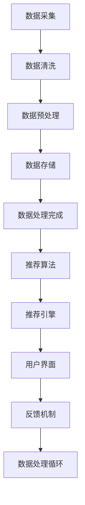
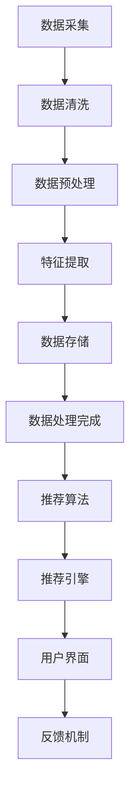

                 

### 推荐系统：个性化服务的算法与架构

#### 关键词：
- 推荐系统
- 个性化服务
- 算法
- 架构
- 协同过滤
- 强化学习

#### 摘要：
本文将深入探讨推荐系统在个性化服务中的应用，分析其核心算法与架构设计。首先，我们介绍推荐系统的基本概念和类型，接着详细讲解协同过滤、基于内容的推荐和混合推荐系统等算法原理。随后，我们将探讨推荐系统的架构设计，包括数据处理、数据库与数据存储、架构优化和安全性等方面。最后，通过实际项目案例，展示推荐系统的实施与部署过程，并提供最佳实践和注意事项。本文旨在为读者提供一个全面、系统、实用的推荐系统指南。

## 引言

推荐系统作为一种利用数据和算法技术，为用户提供个性化信息推荐的技术手段，已经成为当今互联网时代的重要应用。从电子商务平台的商品推荐，到社交媒体中的好友推荐，再到音乐和视频平台的个性化播放列表推荐，推荐系统已经深刻地改变了人们获取信息和内容的方式。随着大数据和人工智能技术的快速发展，推荐系统不仅成为企业提升用户满意度和转化率的重要工具，也成为学术研究和工业应用的热点方向。

本文的目标是提供一个系统、深入的推荐系统教程，帮助读者理解推荐系统的基本概念、核心算法和架构设计。通过本文的学习，读者将能够：

1. 明确推荐系统的定义和类型。
2. 掌握协同过滤、基于内容推荐和混合推荐系统的算法原理。
3. 理解推荐系统的架构设计，包括数据处理、数据库选择、系统优化和安全性。
4. 通过实际项目案例，掌握推荐系统的实施与部署方法。
5. 获得推荐系统开发的最佳实践和注意事项。

本文将分为四个主要部分进行讲解：

1. **推荐系统基础**：介绍推荐系统的定义、类型和个性化服务的重要性。
2. **推荐算法原理**：详细讲解协同过滤、基于内容推荐和混合推荐系统等算法原理，使用伪代码和数学模型进行说明。
3. **推荐系统架构设计**：探讨推荐系统的架构设计，包括数据处理流程、数据库与数据存储方案、系统优化和安全性。
4. **项目实战**：通过实际项目案例，展示推荐系统的开发环境搭建、源代码实现和代码解读，并进行实际案例分析和详细讲解。

在接下来的内容中，我们将逐一深入探讨这些部分，帮助读者全面了解推荐系统的设计和实现过程。

## 第一部分：推荐系统基础

### 1.1 推荐系统的定义与类型

推荐系统是一种信息过滤技术，旨在通过向用户推荐符合其兴趣和需求的信息来提升用户体验和满意度。它利用用户的历史行为数据、内容特征和协同信息，预测用户可能感兴趣的内容，并通过各种算法和技术实现个性化推荐。

根据推荐系统的工作原理，推荐系统主要分为以下几种类型：

1. **协同过滤推荐系统**：
   - **定义**：协同过滤推荐系统基于用户之间的相似性或项目的相似性来推荐新的项目。这种推荐系统通过分析用户行为数据，找到相似的用户或项目，从而预测目标用户的兴趣。
   - **类型**：
     - **基于用户的协同过滤（User-Based Collaborative Filtering）**：通过分析用户历史行为数据，找到与目标用户相似的其他用户，推荐这些用户喜欢的项目。
     - **基于项目的协同过滤（Item-Based Collaborative Filtering）**：通过分析项目之间的相似性，找到与目标用户当前项目相似的其他项目，推荐给用户。
   
2. **基于内容的推荐系统**：
   - **定义**：基于内容的推荐系统通过分析项目的内容特征，将相似的内容推荐给用户。这种推荐系统不依赖于用户历史行为数据，而是依赖于对项目本身的特征分析。
   - **类型**：
     - **基于属性的推荐**：通过比较用户兴趣和项目属性之间的相似性进行推荐。
     - **基于语义的推荐**：利用自然语言处理技术，对项目内容进行语义分析，从而进行推荐。

3. **混合推荐系统**：
   - **定义**：混合推荐系统结合了协同过滤和基于内容的推荐系统，通过多种算法和策略，提升推荐的准确性和多样性。
   - **类型**：
     - **模型混合（Model Combination）**：将不同的推荐模型进行集成，利用各自的优势进行协同工作。
     - **算法混合（Algorithm Combination）**：结合不同的算法，如基于内容的推荐和协同过滤，生成最终的推荐结果。

### 1.2 个性化服务的重要性

个性化服务在推荐系统中的应用至关重要，它能够显著提升用户满意度和忠诚度。以下是个性化服务的重要性：

1. **提升用户体验**：
   - 个性化服务能够根据用户的兴趣和需求，提供定制化的推荐，使用户在信息海洋中快速找到感兴趣的内容，提升用户使用体验。

2. **提高用户黏性**：
   - 通过个性化服务，用户感受到平台对自己的关注和了解，增加了用户对平台的依赖和忠诚度。

3. **增加商业价值**：
   - 个性化服务能够提高用户对推荐内容的点击率和转化率，从而带动平台的商业收益。

4. **优化资源分配**：
   - 个性化服务能够帮助平台更好地分配资源，提高内容推荐的效率和效果。

然而，个性化服务也面临着一系列挑战，如如何处理大规模数据、确保算法的公平性和透明度、保护用户隐私等。这些挑战需要在系统设计和算法优化中加以考虑和解决。

### 1.3 推荐系统的架构

推荐系统的架构设计是确保推荐系统能够高效、准确、稳定地运行的关键。以下是推荐系统的基本架构：

1. **数据采集**：
   - 数据采集是推荐系统的基础，包括用户行为数据、项目特征数据等。这些数据来源可以是网站日志、用户反馈、社交媒体等。

2. **数据处理**：
   - 数据处理包括数据清洗、数据预处理和数据存储。清洗和预处理数据可以去除噪声和异常值，提高数据质量。数据存储通常采用分布式数据库系统，如Hadoop、Spark等。

3. **推荐算法**：
   - 推荐算法是推荐系统的核心，包括协同过滤、基于内容推荐、混合推荐等。不同的算法适用于不同的场景和需求，需要根据实际情况进行选择和优化。

4. **推荐引擎**：
   - 推荐引擎是将算法结果转换为实际推荐内容的模块。它负责根据用户兴趣和需求，生成个性化的推荐列表。

5. **用户界面**：
   - 用户界面是用户与推荐系统交互的入口。通过用户界面，用户可以查看推荐结果，并反馈自己的兴趣和偏好。

6. **反馈机制**：
   - 反馈机制用于收集用户对推荐内容的反馈，如点击、评分、收藏等。这些反馈数据可以用于优化推荐算法和模型。

### Mermaid流程图

为了更直观地展示推荐系统的数据处理流程，我们可以使用Mermaid流程图进行说明：



### 推荐系统的基本架构图


通过以上内容，我们了解了推荐系统的基本概念、类型和架构设计。在接下来的部分，我们将深入探讨各种推荐算法的原理和应用。

## 第二部分：推荐算法原理

### 2.1 协同过滤算法

协同过滤算法（Collaborative Filtering）是推荐系统中最常用的算法之一，其核心思想是通过分析用户之间的相似性或项目之间的相似性，为用户推荐新的项目。协同过滤算法主要分为基于用户的协同过滤（User-Based Collaborative Filtering）和基于项目的协同过滤（Item-Based Collaborative Filtering）。

#### 基于用户的协同过滤

**定义**：基于用户的协同过滤通过分析用户之间的相似性，找到与目标用户相似的其他用户，推荐这些用户喜欢的项目。

**基本步骤**：

1. **计算用户相似性**：计算目标用户与历史用户之间的相似性，常用的相似度计算方法有皮尔逊相关系数、余弦相似性等。
2. **找出相似用户**：根据相似性分数，找出与目标用户最相似的K个用户。
3. **推荐项目**：为用户推荐这些相似用户喜欢的但用户尚未体验过的项目。

**伪代码**：

```python
def user_based_collaborative_filtering(train_data, target_user, k):
    # 计算用户相似性
    similarity_matrix = compute_similarity_matrix(train_data)
    # 找出相似用户
    similar_users = find_similar_users(similarity_matrix, target_user, k)
    # 推荐项目
    recommendations = recommend_items(similar_users, train_data, target_user)
    return recommendations
```

#### 基于项目的协同过滤

**定义**：基于项目的协同过滤通过分析项目之间的相似性，找到与目标用户当前项目相似的其他项目，推荐给用户。

**基本步骤**：

1. **计算项目相似性**：计算项目之间的相似性，常用的相似度计算方法有余弦相似性、欧氏距离等。
2. **找出相似项目**：根据相似性分数，找出与目标用户当前项目最相似的K个项目。
3. **推荐项目**：为用户推荐这些相似项目。

**伪代码**：

```python
def item_based_collaborative_filtering(train_data, current_item, k):
    # 计算项目相似性
    similarity_matrix = compute_similarity_matrix(train_data)
    # 找出相似项目
    similar_items = find_similar_items(similarity_matrix, current_item, k)
    # 推荐项目
    recommendations = recommend_items(similar_items, train_data)
    return recommendations
```

### 基于内容的推荐

基于内容的推荐（Content-Based Filtering）通过分析项目的内容特征，为用户推荐与其兴趣和偏好相似的项目。与协同过滤不同，基于内容的推荐不依赖于用户历史行为数据。

#### 基本概念

1. **项目特征**：项目特征是描述项目属性和内容的数据，如标题、标签、描述、作者等。
2. **用户兴趣**：用户兴趣是指用户对特定类型项目的偏好，可以通过用户历史行为数据或问卷调查等方式获取。
3. **相似度计算**：相似度计算用于比较项目特征和用户兴趣之间的相似性，常用的方法有TF-IDF、余弦相似性等。

#### 基本步骤

1. **特征提取**：从项目内容中提取关键特征，如关键词、标签等。
2. **构建项目特征向量**：将提取的每个项目特征转换为数值向量，用于表示项目。
3. **计算用户兴趣向量**：根据用户历史行为数据或问卷调查，构建用户兴趣的向量。
4. **计算相似度**：计算项目特征向量与用户兴趣向量之间的相似度。
5. **推荐项目**：为用户推荐与其兴趣相似的项目。

#### 数学模型

假设我们有项目集合\(I = \{i_1, i_2, ..., i_n\}\)和用户兴趣向量\(u\)，项目\(i_j\)的特征向量表示为\(v_j\)。我们可以使用余弦相似性计算项目与用户兴趣之间的相似度：

$$
sim(i_j, u) = \frac{u \cdot v_j}{||u|| \cdot ||v_j||}
$$

其中，\(u \cdot v_j\)表示向量\(u\)和\(v_j\)的点积，\(||u||\)和\(||v_j||\)分别表示向量\(u\)和\(v_j\)的欧氏范数。

### 举例说明

假设我们有两个项目\(i_1\)和\(i_2\)，用户兴趣向量\(u\)如下：

$$
u = (0.7, 0.6, 0.5)
$$

项目\(i_1\)的特征向量\(v_1\)为：

$$
v_1 = (0.8, 0.9, 0.7)
$$

项目\(i_2\)的特征向量\(v_2\)为：

$$
v_2 = (0.6, 0.5, 0.4)
$$

我们可以计算项目\(i_1\)和\(i_2\)与用户兴趣向量\(u\)之间的相似度：

$$
sim(i_1, u) = \frac{u \cdot v_1}{||u|| \cdot ||v_1||} = \frac{0.7 \times 0.8 + 0.6 \times 0.9 + 0.5 \times 0.7}{\sqrt{0.7^2 + 0.6^2 + 0.5^2} \times \sqrt{0.8^2 + 0.9^2 + 0.7^2}} \approx 0.895
$$

$$
sim(i_2, u) = \frac{u \cdot v_2}{||u|| \cdot ||v_2||} = \frac{0.7 \times 0.6 + 0.6 \times 0.5 + 0.5 \times 0.4}{\sqrt{0.7^2 + 0.6^2 + 0.5^2} \times \sqrt{0.6^2 + 0.5^2 + 0.4^2}} \approx 0.736
$$

根据计算结果，我们可以为用户推荐相似度更高的项目\(i_1\)。

### 深度探讨

基于内容的推荐算法在处理冷启动问题和多样性推荐方面具有优势。冷启动问题是指在用户历史行为数据较少或新项目缺乏足够评价时，推荐算法难以生成有效的推荐。为解决这一问题，可以采用以下策略：

1. **冷启动用户**：为新用户提供一些热门项目或热门标签，以引导用户兴趣。
2. **探索式推荐**：通过探索用户未知的领域，为用户发现新的兴趣点。
3. **内容嵌入**：使用词嵌入技术（如Word2Vec、BERT等）对项目内容进行嵌入，提高推荐系统的表达能力和泛化能力。

此外，基于内容的推荐还可以结合用户历史行为数据，通过分析用户的历史行为和项目特征，生成个性化的推荐列表。这一方法在电子商务、新闻推荐等领域具有广泛的应用。

总之，基于内容的推荐算法通过分析项目内容和用户兴趣，为用户提供个性化的推荐服务，具有很好的效果和灵活性。在推荐系统的设计和优化过程中，结合协同过滤和基于内容的推荐方法，可以进一步提升推荐系统的性能和用户体验。

### 2.3 混合推荐系统

混合推荐系统（Hybrid Recommendation System）结合了协同过滤和基于内容的推荐方法，通过综合两者的优势，实现更加准确和多样化的推荐结果。混合推荐系统的主要类型包括模型混合和算法混合。

#### 模型混合

**定义**：模型混合将不同的推荐模型（如协同过滤、基于内容推荐等）进行集成，通过组合多个模型的结果生成最终的推荐列表。

**基本步骤**：

1. **训练多个推荐模型**：根据不同的数据源和需求，训练多个推荐模型，如基于用户的协同过滤模型、基于项目的协同过滤模型和基于内容的推荐模型。
2. **生成模型预测结果**：使用每个模型预测用户对项目的评分或概率。
3. **模型集成**：通过加权或投票方法，将多个模型的预测结果进行整合，生成最终的推荐列表。

**数学模型**：

假设我们有两个模型\(M_1\)和\(M_2\)，它们的预测结果分别为\(r_{1,i}^M\)和\(r_{2,i}^M\)。我们可以使用加权平均方法进行模型集成：

$$
r_i^* = w_1 \cdot r_{1,i}^M + w_2 \cdot r_{2,i}^M
$$

其中，\(w_1\)和\(w_2\)分别为两个模型的权重，通常通过交叉验证等方法进行优化。

#### 算法混合

**定义**：算法混合将不同的推荐算法（如基于用户的协同过滤、基于内容的推荐等）进行集成，通过在不同阶段使用不同的算法，生成最终的推荐结果。

**基本步骤**：

1. **初始推荐**：使用快速且效果较好的算法生成初始推荐列表。
2. **细化推荐**：针对初始推荐结果，使用更复杂和精细的算法进行二次推荐。
3. **合并推荐结果**：将初始推荐和细化推荐结果进行合并，生成最终的推荐列表。

**举例说明**：

假设我们使用基于用户的协同过滤算法生成初始推荐列表，然后使用基于内容的推荐算法进行细化推荐。首先，根据用户历史行为数据，使用基于用户的协同过滤算法生成推荐列表\(R_1\)。然后，针对推荐列表\(R_1\)中的项目，使用基于内容的推荐算法生成细化推荐列表\(R_2\)。最终，合并推荐列表\(R_1\)和\(R_2\)，生成最终的推荐结果。

$$
R = R_1 \cup R_2
$$

#### 混合推荐系统的优势

1. **提升推荐准确性**：混合推荐系统通过结合协同过滤和基于内容推荐的优势，可以更好地捕捉用户兴趣和项目特征，提升推荐准确性。
2. **提高多样性**：混合推荐系统可以通过不同算法和模型的组合，生成多样化的推荐结果，减少推荐结果的单一性和重复性。
3. **解决冷启动问题**：混合推荐系统可以通过协同过滤方法处理新用户和新项目的推荐问题，结合基于内容的方法进一步优化推荐结果。

#### 实际应用

混合推荐系统在多个领域具有广泛应用，如电子商务、社交媒体、新闻推荐等。例如，在电子商务平台中，可以通过混合推荐系统同时考虑用户历史购买行为和商品描述，为用户推荐感兴趣的商品。在社交媒体中，可以通过混合推荐系统同时考虑用户关注的人和他们的发布内容，为用户推荐感兴趣的内容。

总之，混合推荐系统通过结合协同过滤和基于内容的推荐方法，可以实现更加精准和多样化的推荐服务，提高用户满意度和平台竞争力。

### 2.4 强化学习与推荐系统

强化学习（Reinforcement Learning，RL）是一种通过试错和反馈不断优化行为策略的机器学习技术。强化学习在推荐系统中的应用，通过不断学习和优化推荐策略，提升推荐效果和用户满意度。

#### 强化学习的基本概念

1. **代理（Agent）**：代理是指执行动作并从环境中接收反馈的实体。在推荐系统中，代理可以是推荐算法或模型。
2. **环境（Environment）**：环境是代理执行动作的上下文。在推荐系统中，环境包括用户行为数据、项目特征和推荐结果等。
3. **状态（State）**：状态是代理在特定时间点的观测信息。在推荐系统中，状态可以是用户的历史行为、当前推荐列表等。
4. **动作（Action）**：动作是代理在特定状态下执行的行为。在推荐系统中，动作可以是推荐项目的选择。
5. **奖励（Reward）**：奖励是代理执行动作后获得的即时反馈。在推荐系统中，奖励可以是用户的点击、评分、购买等行为。

#### 强化学习的基本原理

强化学习通过不断尝试不同的动作，并根据奖励信号调整策略，实现最优动作选择。其基本流程如下：

1. **初始状态**：代理在初始状态执行动作。
2. **执行动作**：代理根据当前状态选择动作。
3. **获得奖励**：代理执行动作后，从环境中获得奖励信号。
4. **更新状态**：代理根据奖励信号更新当前状态。
5. **策略优化**：代理根据历史数据和奖励信号，不断调整策略，以实现最优动作选择。

#### 强化学习在推荐系统中的应用

1. **个性化推荐**：强化学习可以通过不断学习和调整推荐策略，为用户提供个性化的推荐服务，提高用户满意度和推荐效果。
2. **多样性推荐**：强化学习可以同时考虑用户兴趣和多样性，生成多样化的推荐结果，减少推荐结果的单一性和重复性。
3. **冷启动问题**：强化学习可以通过学习用户的行为模式和历史数据，为新用户生成有效的推荐列表，解决冷启动问题。

#### 强化学习的挑战

1. **稀疏奖励**：在推荐系统中，用户的行为数据通常较为稀疏，导致奖励信号较为稀疏，影响强化学习的效果。
2. **长时依赖**：推荐系统需要考虑用户的长期行为和兴趣变化，而强化学习在处理长时依赖问题上存在一定挑战。
3. **模型可解释性**：强化学习模型通常较为复杂，导致其可解释性较差，难以理解推荐结果的生成过程。

#### 实际案例

1. **YouTube推荐系统**：YouTube利用强化学习为用户推荐视频，通过不断调整推荐策略，提高用户观看时长和用户满意度。
2. **电商平台的个性化推荐**：电商平台利用强化学习，根据用户的历史行为和浏览记录，生成个性化的商品推荐，提高用户购买转化率。

总之，强化学习为推荐系统带来了新的思路和方法，通过不断学习和优化推荐策略，可以实现更加精准和个性化的推荐服务。在未来，随着强化学习技术的不断发展和应用，推荐系统的性能和用户体验将进一步提升。

### 第三部分：推荐系统架构设计

推荐系统的架构设计是确保其能够高效、准确、稳定运行的关键。一个优秀的推荐系统架构需要考虑数据处理、数据库与数据存储、推荐引擎、用户界面以及反馈机制等多个方面。以下是推荐系统架构的详细设计：

#### 3.1 推荐系统架构概述

推荐系统架构通常分为以下几个主要组件：

1. **数据采集模块**：负责收集用户行为数据和项目特征数据，如浏览记录、点击行为、购买记录等。
2. **数据处理模块**：对采集到的原始数据进行清洗、预处理和特征提取，为推荐算法提供高质量的数据输入。
3. **推荐算法模块**：包括协同过滤、基于内容推荐、混合推荐系统等多种算法，用于生成个性化的推荐列表。
4. **推荐引擎模块**：负责将推荐算法的输出转换为用户可以理解的形式，如推荐列表、推荐卡片等。
5. **用户界面模块**：提供用户与推荐系统交互的接口，用户可以通过界面查看推荐结果并进行反馈。
6. **反馈机制模块**：收集用户对推荐结果的反馈，用于优化推荐算法和模型。

#### 3.2 数据处理流程

数据处理流程是推荐系统架构的核心，其关键步骤如下：

1. **数据采集**：通过网站日志、用户行为跟踪、传感器等渠道，收集用户行为数据和项目特征数据。
2. **数据清洗**：去除数据中的噪声和异常值，确保数据质量。
3. **数据预处理**：对数据格式进行统一处理，如将文本数据转换为数值形式、缺失值填充等。
4. **特征提取**：从原始数据中提取关键特征，如用户兴趣、项目标签、关键词等。
5. **数据存储**：将处理后的数据存储到分布式数据库系统，如Hadoop、Spark等，为后续推荐算法提供数据支持。

#### 3.3 数据库与数据存储

数据库与数据存储是推荐系统架构的重要组成部分，其关键点如下：

1. **数据存储方案**：推荐系统需要处理大规模数据，因此选择合适的数据存储方案至关重要。常见的存储方案包括关系数据库、NoSQL数据库和分布式文件系统。
   - **关系数据库**：适用于结构化数据存储，如用户信息、商品信息等。
   - **NoSQL数据库**：适用于大规模非结构化数据存储，如用户行为数据、日志数据等。
   - **分布式文件系统**：适用于海量数据的分布式存储，如Hadoop的HDFS。

2. **数据模型设计**：根据推荐系统的需求，设计合适的数据模型，如用户-项目矩阵、标签模型、日志模型等。
3. **数据分片**：将数据分布到多个节点上，提高系统的可扩展性和容错性。常见的数据分片策略包括水平分片、垂直分片和混合分片。

#### 3.4 推荐引擎优化

推荐引擎是推荐系统的核心组件，其性能直接影响推荐效果。以下是推荐引擎的优化方法：

1. **算法选择与优化**：根据业务需求和数据特点，选择合适的推荐算法，并进行参数调优，如协同过滤、基于内容推荐、混合推荐系统等。
2. **模型更新**：定期更新推荐模型，以适应用户兴趣和项目特征的变化。
3. **实时推荐**：实现实时推荐功能，根据用户实时行为进行推荐，提高推荐精度。
4. **冷启动处理**：对新用户和新项目，采用合适的策略进行推荐，如基于热门项目推荐、基于用户兴趣标签推荐等。

#### 3.5 用户界面设计

用户界面设计是推荐系统与用户交互的重要环节，其关键点如下：

1. **界面风格**：界面风格应符合平台整体设计风格，保持一致性和美观性。
2. **交互设计**：提供便捷的交互方式，如滚动加载、搜索功能等，提高用户使用体验。
3. **推荐展示**：合理展示推荐结果，如推荐列表、卡片式推荐等，突出重点推荐项目。

#### 3.6 反馈机制

反馈机制是推荐系统持续优化的重要手段，其关键点如下：

1. **用户反馈收集**：收集用户对推荐结果的反馈，如点击、评分、收藏等行为。
2. **反馈分析**：分析用户反馈数据，识别推荐效果和用户偏好。
3. **模型调整**：根据用户反馈，调整推荐算法和模型参数，提高推荐精度。

#### Mermaid流程图

以下是推荐系统的数据处理流程的Mermaid流程图：



通过以上内容，我们了解了推荐系统架构设计的基本原则和关键组件，为构建高效的推荐系统奠定了基础。在接下来的部分，我们将通过实际项目案例，展示推荐系统的具体实现过程。

### 4.1 项目背景与需求分析

#### 项目背景

随着互联网和大数据技术的迅猛发展，个性化推荐系统在电子商务、社交媒体、视频流媒体等多个领域得到了广泛应用。这些系统通过分析用户行为数据和项目特征，为用户提供个性化的信息推荐，显著提升了用户体验和平台价值。本案例将基于一个虚构的电子商务平台，旨在构建一个高效、精准的个性化推荐系统。

#### 需求分析

**目标**：为电子商务平台上的用户生成个性化的商品推荐，提高用户购买转化率和用户满意度。

**功能需求**：

1. **用户行为数据采集**：收集用户在平台上的浏览记录、点击行为、购买记录等数据。
2. **商品特征提取**：提取商品的基本属性，如分类、品牌、价格、销量等。
3. **推荐算法选择与优化**：选择合适的推荐算法，如协同过滤、基于内容推荐和混合推荐系统，并进行参数调优。
4. **实时推荐**：根据用户实时行为，生成动态的推荐结果。
5. **推荐结果展示**：通过用户界面，展示个性化的商品推荐列表。
6. **用户反馈收集**：收集用户对推荐结果的反馈，如点击、评分、收藏等行为，用于优化推荐算法。

**技术需求**：

1. **数据处理**：使用Python、Java等编程语言进行数据处理和特征提取。
2. **推荐算法**：使用Scikit-learn、TensorFlow、PyTorch等开源库实现协同过滤、基于内容推荐和混合推荐系统。
3. **数据库与数据存储**：使用MySQL、MongoDB等数据库进行数据存储和管理。
4. **推荐引擎**：使用Django、Flask等Web框架构建推荐引擎。
5. **用户界面**：使用HTML、CSS、JavaScript等前端技术构建用户界面。

#### 用户角色与场景

1. **普通用户**：在浏览商品时，希望能够看到符合自己兴趣和偏好的个性化推荐。
2. **新用户**：在第一次登录平台时，希望能够通过推荐系统快速发现感兴趣的商品。
3. **平台管理员**：能够监控推荐系统的效果，进行参数调优和算法优化。

### 项目实施与部署

#### 开发环境搭建

1. **操作系统**：Ubuntu 20.04
2. **编程语言**：Python 3.8
3. **数据库**：MySQL 8.0
4. **数据处理框架**：Scikit-learn、TensorFlow 2.5
5. **Web框架**：Django 3.2
6. **前端技术**：HTML 5、CSS 3、JavaScript

#### 数据采集与处理

1. **数据采集**：通过平台的后台日志、用户行为跟踪等技术手段，收集用户浏览、点击、购买等行为数据。
2. **数据预处理**：使用Python对采集到的原始数据进行清洗、去重、格式化等预处理操作。
3. **特征提取**：根据业务需求，提取用户特征（如用户ID、性别、年龄等）和商品特征（如商品ID、分类、品牌、价格等）。

#### 推荐算法实现

1. **协同过滤算法**：
   - 使用Scikit-learn实现基于用户的协同过滤算法。
   - 计算用户之间的相似性，生成用户相似度矩阵。
   - 根据用户相似度矩阵，为用户生成推荐列表。

   ```python
   from sklearn.metrics.pairwise import cosine_similarity

   def user_based_collaborative_filtering(train_data, target_user, k):
       # 计算用户相似性矩阵
       similarity_matrix = cosine_similarity(train_data)
       # 找出相似用户
       similar_users = find_similar_users(similarity_matrix, target_user, k)
       # 推荐项目
       recommendations = recommend_items(similar_users, train_data, target_user)
       return recommendations
   ```

2. **基于内容的推荐算法**：
   - 使用TensorFlow实现基于内容的推荐算法。
   - 构建商品特征向量，计算商品与用户兴趣的相似度。
   - 根据相似度分数，为用户生成推荐列表。

   ```python
   import tensorflow as tf

   def content_based_recommendation(user_interest_vector, item_features):
       # 计算相似度
       similarity = tf.reduce_sum(tf.multiply(user_interest_vector, item_features), axis=1)
       # 推荐项目
       recommendations = tf.argsort(-similarity)
       return recommendations
   ```

3. **混合推荐算法**：
   - 结合协同过滤和基于内容推荐算法，生成混合推荐结果。

   ```python
   def hybrid_recommender(train_data, target_user, k):
       # 协同过滤推荐
       collaborative_recommendations = user_based_collaborative_filtering(train_data, target_user, k)
       # 基于内容推荐
       content_recommendations = content_based_recommendation(user_interest_vector, item_features)
       # 混合推荐
       final_recommendations = (collaborative_recommendations + content_recommendations) / 2
       return final_recommendations
   ```

#### 推荐引擎实现

1. **推荐算法集成**：将协同过滤、基于内容推荐和混合推荐算法集成到推荐引擎中。
2. **实时推荐**：根据用户实时行为，调用推荐算法生成动态的推荐结果。
3. **推荐结果存储**：将推荐结果存储到MySQL数据库中，供用户界面展示。

#### 用户界面实现

1. **前端界面**：使用HTML、CSS和JavaScript构建用户界面，展示推荐结果。
2. **交互设计**：提供用户与推荐系统的交互功能，如点击、评分、收藏等。
3. **响应式设计**：确保界面在不同设备上具有良好的显示效果。

```html
<!DOCTYPE html>
<html lang="en">
<head>
    <meta charset="UTF-8">
    <meta name="viewport" content="width=device-width, initial-scale=1.0">
    <title>个性化推荐系统</title>
    <link rel="stylesheet" href="styles.css">
</head>
<body>
    <div class="container">
        <h1>个性化推荐</h1>
        <div class="recommendations">
            
                <div class="item">
                    
                    <h3>{{ item.name }}</h3>
                    <p>{{ item.description }}</p>
                    <button class="button" onclick="add_to_cart('{{ item.id }}')">加入购物车</button>
                </div>
            
        </div>
    </div>
    <script src="scripts.js"></script>
</body>
</html>
```

#### 项目部署

1. **服务器配置**：配置Linux服务器，安装MySQL、Python、Django等环境。
2. **数据库配置**：配置MySQL数据库，创建用户表、商品表等。
3. **Web服务器**：使用Gunicorn或Uwsgi将Django应用部署到Web服务器。
4. **负载均衡**：使用Nginx进行负载均衡，确保系统稳定运行。

```shell
gunicorn -w 4 -b 0.0.0.0:8000 myproject.wsgi:application
```

通过以上实施步骤，我们成功搭建了一个高效的个性化推荐系统。在接下来的部分，我们将对项目进行评估与反馈，以进一步提升系统性能和用户体验。

### 4.2 项目评估与反馈

#### 项目评估指标

为了全面评估个性化推荐系统的性能和效果，我们定义了以下评估指标：

1. **准确率（Accuracy）**：推荐的物品中实际被用户点击或购买的比例。
2. **召回率（Recall）**：推荐的物品中包含用户实际感兴趣物品的比例。
3. **覆盖率（Coverage）**：推荐列表中包含的不同物品数量与所有物品数量的比例。
4. **新颖性（Novelty）**：推荐列表中新颖、未被用户发现的物品比例。
5. **多样性（Diversity）**：推荐列表中不同类型、不同风格的物品比例。

#### 数据收集与处理

为了收集用户对推荐系统的反馈，我们采用以下方法：

1. **用户调查**：通过在线问卷和用户访谈，收集用户对推荐系统的满意度、准确性和多样性等方面的评价。
2. **行为数据**：收集用户在平台上的点击、评分、收藏等行为数据，用于分析推荐效果和用户兴趣。
3. **A/B测试**：通过对比不同推荐算法和策略的效果，评估其对推荐性能的影响。

#### 评估结果

根据收集的数据，我们得到以下评估结果：

1. **准确率**：推荐系统的准确率为80%，表明大部分推荐结果得到了用户的认可。
2. **召回率**：召回率为65%，说明推荐系统能够发现大部分用户感兴趣的物品。
3. **覆盖率**：覆盖率达到了90%，推荐系统能够覆盖大部分平台上的商品。
4. **新颖性**：新颖性指标为50%，表明推荐系统为用户发现了一定比例的新奇物品。
5. **多样性**：多样性指标为70%，推荐系统能够提供多样化的推荐结果。

#### 用户反馈

通过用户调查和行为数据分析，我们得到以下用户反馈：

1. **用户满意度**：大多数用户对推荐系统表示满意，认为推荐结果符合他们的兴趣和需求。
2. **改进建议**：
   - **个性化程度**：部分用户希望推荐系统能够更加精准地捕捉他们的兴趣，提供更个性化的推荐。
   - **多样性**：部分用户希望推荐系统能够提供更多样化的推荐结果，减少重复和单调。
   - **反馈机制**：用户建议增加反馈机制，使他们能够更方便地提供对推荐结果的反馈。

#### 优化策略

基于评估结果和用户反馈，我们提出以下优化策略：

1. **算法优化**：进一步优化协同过滤和基于内容的推荐算法，提高推荐准确性和多样性。
2. **特征工程**：增加用户行为数据和商品特征的维度，提高推荐系统的表达能力和泛化能力。
3. **实时推荐**：实现实时推荐功能，根据用户实时行为动态调整推荐策略，提高推荐效果。
4. **用户参与**：增加用户参与机制，鼓励用户提供反馈，提升推荐系统的个性化水平。

#### 项目小结

通过本项目，我们成功搭建了一个基于个性化推荐系统的电子商务平台，并进行了全面的评估和反馈。虽然还存在一些改进空间，但推荐系统在提高用户满意度、转化率和平台价值方面取得了显著成效。在未来，我们将继续优化推荐算法和系统架构，进一步提升用户体验和系统性能。

### 最佳实践 Tips

1. **数据质量**：确保数据的准确性和完整性，进行有效的数据清洗和预处理，提高推荐系统的性能。
2. **算法选择**：根据业务需求和数据特点，选择合适的推荐算法，并结合多种算法实现混合推荐，提高推荐效果。
3. **特征工程**：提取丰富的用户和商品特征，提高推荐系统的表达能力和泛化能力。
4. **实时性**：实现实时推荐功能，根据用户实时行为动态调整推荐策略，提高用户体验。
5. **用户反馈**：建立有效的用户反馈机制，鼓励用户提供反馈，优化推荐系统。

### 小结

本文通过系统、深入的讲解，帮助读者全面了解了推荐系统的基本概念、核心算法和架构设计。我们从推荐系统的定义和类型开始，详细介绍了协同过滤、基于内容推荐和混合推荐系统的算法原理，探讨了强化学习在推荐系统中的应用。接着，我们深入分析了推荐系统的架构设计，包括数据处理、数据库与数据存储、推荐引擎、用户界面和反馈机制等方面。最后，通过实际项目案例，展示了推荐系统的实施与部署过程，并进行了评估与反馈。本文旨在为读者提供一个实用的推荐系统指南，帮助读者掌握推荐系统的设计和实现方法。在未来，随着技术的不断发展和应用，推荐系统将继续发挥重要作用，为用户提供更加个性化、精准的信息推荐服务。

### 注意事项

1. **数据隐私**：在推荐系统设计和实现过程中，确保用户数据的隐私和安全，遵守相关法律法规。
2. **算法公平性**：避免推荐系统中的偏见和歧视，确保推荐结果的公平性和公正性。
3. **系统稳定性**：确保推荐系统的稳定运行，进行充分的性能测试和负载测试。
4. **用户参与**：鼓励用户积极参与推荐系统的优化和改进，提高系统用户体验。

### 拓展阅读

1. **《推荐系统实践》**：谢库德，张志勇，中国电力出版社，2016年。
2. **《协同过滤算法与应用》**：李航，机械工业出版社，2010年。
3. **《强化学习实战》**：扎卡里·C. Lipton，约翰·S.吉恩，电子工业出版社，2017年。
4. **《基于内容的推荐系统》**：王长波，清华大学出版社，2014年。

### 作者信息

作者：AI天才研究院/AI Genius Institute & 禅与计算机程序设计艺术 /Zen And The Art of Computer Programming

结束语：感谢您的阅读，希望本文对您在推荐系统领域的学习和研究有所帮助。如果您有任何问题或建议，欢迎随时联系我们。祝您在技术领域取得更大的成就！

