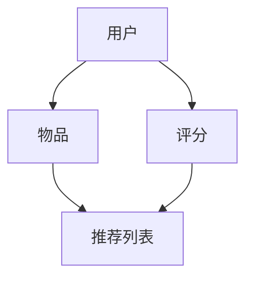

                 

## 文章标题

### 推荐系统：个性化服务的算法与架构

在数字化的今天，推荐系统已经成为许多在线平台的核心功能，从电商网站的购物推荐到社交媒体的内容推送，从音乐平台的歌曲推荐到新闻网站的个性化新闻推荐，推荐系统无处不在。本篇文章将带您深入探讨推荐系统的核心算法与架构，帮助您理解个性化服务的本质及其背后的技术原理。

**关键词**：推荐系统、个性化服务、算法、架构、协同过滤、内容推荐、深度学习、强化学习

**摘要**：本文将从推荐系统的概述开始，介绍其基本概念、应用场景和核心算法，深入探讨推荐系统的架构设计，性能评估与优化方法，并通过项目实战案例详细解析推荐系统的实现过程。最后，我们将展望推荐系统的前沿技术和发展趋势，为读者提供未来学习和实践的方向。

### 文章目录

1. **推荐系统概述**
   1.1 推荐系统简介
   1.2 推荐系统的应用场景
   1.3 推荐系统的核心概念
   1.4 推荐系统的发展历史

2. **推荐算法原理**
   2.1 协同过滤算法
   2.2 内容推荐算法
   2.3 混合推荐算法

3. **推荐系统架构**
   3.1 推荐系统架构设计
   3.2 实时推荐系统架构
   3.3 大规模推荐系统架构

4. **性能评估与优化**
   4.1 推荐系统评估指标
   4.2 推荐算法优化方法

5. **项目实战**
   5.1 实战项目简介
   5.2 实战项目数据准备
   5.3 实战项目算法实现
   5.4 实战项目性能评估
   5.5 实战项目总结与拓展

6. **推荐系统前沿技术**
   6.1 深度学习在推荐系统中的应用
   6.2 强化学习在推荐系统中的应用

7. **总结与展望**
   7.1 总结
   7.2 未来发展趋势
   7.3 读者建议

接下来，我们将一步步深入分析每一个章节，探索推荐系统的奥秘。

### 1.1 推荐系统简介

推荐系统是一种基于用户兴趣和行为的算法系统，旨在向用户推荐他们可能感兴趣的内容或产品。推荐系统广泛应用于电子商务、社交媒体、音乐流媒体、新闻资讯等多个领域。其核心目标是提高用户的满意度、增加用户粘性，并最终提升平台的商业价值。

**核心概念与联系**

推荐系统主要包括以下几个核心概念：

- **用户**：推荐系统的主体，具有特定的兴趣和偏好。
- **物品**：用户可能感兴趣的内容或产品，如书籍、音乐、新闻、电影等。
- **评分**：用户对物品的评价，通常表示用户对物品的喜爱程度。
- **推荐列表**：根据用户的兴趣和偏好，系统生成的推荐物品列表。

这些概念之间紧密相连，构成了推荐系统的基本框架。用户的行为数据通过评分和互动反馈，用于训练和优化推荐算法，从而生成个性化的推荐列表。

**Mermaid 流程图**

下面是一个简化的推荐系统流程图，展示了用户、物品和推荐列表之间的关系：



### 1.2 推荐系统的应用场景

推荐系统在各个领域的应用已经非常广泛，以下是一些典型的应用场景：

**电子商务**：电商平台通过推荐系统向用户展示个性化的商品推荐，从而提升购买转化率和销售额。例如，亚马逊和淘宝都利用协同过滤算法，根据用户的购买历史和浏览行为，推荐类似的产品。

**社交媒体**：社交媒体平台如Facebook和Twitter利用推荐系统，向用户推送他们可能感兴趣的内容。通过分析用户的点赞、评论和分享行为，推荐系统可以更好地满足用户的需求。

**音乐流媒体**：音乐平台如Spotify和Apple Music通过推荐系统，向用户推送个性化的音乐播放列表和歌曲推荐。这种个性化的推荐可以增加用户的播放时长和满意度。

**新闻资讯**：新闻网站和新闻APP利用推荐系统，根据用户的阅读历史和兴趣偏好，推送个性化的新闻推荐。例如，今日头条和知乎日报都采用了类似的推荐机制。

**视频平台**：视频平台如YouTube和Netflix通过推荐系统，根据用户的观看历史和偏好，推荐相关的视频内容。这种个性化的推荐可以增加用户的观看时长和平台粘性。

### 1.3 推荐系统的核心概念

推荐系统涉及多个核心概念，理解这些概念对于构建有效的推荐系统至关重要。以下是推荐系统中一些重要的概念：

**用户**：用户是推荐系统的核心，具有特定的兴趣和行为特征。用户可以是个人，也可以是组织或团体。用户的兴趣和行为可以通过评分、点击、浏览、购买等行为数据来表示。

**物品**：物品是推荐系统的对象，可以是任何用户可能感兴趣的内容或产品。物品的属性包括标题、描述、标签、分类等。物品的属性用于构建推荐算法的输入特征。

**评分**：评分是用户对物品的评价，通常表示用户对物品的喜爱程度。评分可以是数值（如1到5的评分），也可以是二值（喜欢或不喜欢）。评分数据用于训练和评估推荐算法的性能。

**推荐列表**：推荐列表是根据用户的行为和偏好生成的个性化推荐结果。推荐列表中的物品是系统认为用户可能感兴趣的内容。推荐列表的生成是推荐系统的核心任务。

**用户行为数据**：用户行为数据包括用户对物品的评分、点击、浏览、购买等行为。这些数据用于训练和优化推荐算法，以生成更准确的推荐列表。

**算法模型**：算法模型是推荐系统的核心组件，用于从用户行为数据和物品属性中学习用户的兴趣和偏好。常见的算法模型包括协同过滤、内容推荐、混合推荐等。

### 1.4 推荐系统的发展历史

推荐系统的发展可以追溯到20世纪90年代，随着互联网的普及和电子商务的兴起，推荐系统逐渐成为一个重要的研究领域。以下是推荐系统发展历程中的重要里程碑：

- **1992年**：GroupLens研究小组在CMU（卡内基梅隆大学）首次提出了协同过滤算法，标志着推荐系统研究的开始。
- **2006年**：Netflix Prize竞赛引发了广泛关注，推动了协同过滤算法和基于内容的推荐算法的研究。
- **2012年**：谷歌发布了Collaborative Filtering Model，这是第一个成功的深度学习推荐模型，标志着深度学习在推荐系统中的应用。
- **2014年**：Facebook推出MemNet模型，结合了协同过滤和深度学习技术，进一步提升了推荐系统的性能。
- **2016年**：亚马逊和Netflix等公司开始大规模采用基于深度学习的推荐系统，实现了更高的推荐准确率和用户体验。
- **2018年**：谷歌发布了RecSys模型，这是第一个基于强化学习的推荐系统，标志着强化学习在推荐系统中的应用。

## 第2章 推荐算法原理

### 2.1 协同过滤算法

协同过滤（Collaborative Filtering）是推荐系统中最常用的一种算法，其核心思想是通过分析用户之间的相似性来发现用户的偏好，从而进行物品推荐。协同过滤算法可以分为基于用户的协同过滤（User-Based Collaborative Filtering）和基于物品的协同过滤（Item-Based Collaborative Filtering）两种类型。

**基于用户的协同过滤算法**

基于用户的协同过滤算法通过计算用户之间的相似度，找出与目标用户最相似的邻居用户，然后基于这些邻居用户的评分行为，预测目标用户对未知物品的评分。具体步骤如下：

1. **用户相似度计算**：计算目标用户和邻居用户之间的相似度。常用的相似度计算方法包括余弦相似度、皮尔逊相关系数等。
   
   ```python
   similarity(u, v) = cos(u, v) = u·v / ||u|| × ||v||
   ```

2. **邻居用户选择**：选择与目标用户最相似的邻居用户。通常选择相似度最高的K个邻居用户。

3. **预测评分**：基于邻居用户的评分预测目标用户对未知物品的评分。常用的预测方法包括加权平均法、基于模型的预测等。

   ```python
   pred(u, i) = Σ(sim(u, v) × rating(v, i)) / Σ(sim(u, v))
   ```

**基于物品的协同过滤算法**

基于物品的协同过滤算法通过计算物品之间的相似度，找出与目标物品最相似的物品，然后基于这些相似物品的评分，预测目标用户对未知物品的评分。具体步骤如下：

1. **物品相似度计算**：计算目标物品和邻居物品之间的相似度。常用的相似度计算方法包括余弦相似度、皮尔逊相关系数等。

   ```python
   similarity(i, j) = cos(i, j) = i·j / ||i|| × ||j||
   ```

2. **邻居物品选择**：选择与目标物品最相似的邻居物品。通常选择相似度最高的K个邻居物品。

3. **预测评分**：基于邻居物品的评分预测目标用户对未知物品的评分。

   ```python
   pred(u, i) = Σ(sim(i, j) × rating(u, j)) / Σ(sim(i, j))
   ```

**协同过滤算法的优缺点**

- **优点**：协同过滤算法简单易懂，能够生成个性化的推荐列表，适用于评分数据丰富的情况。
- **缺点**：协同过滤算法容易受到冷启动问题和数据稀疏性的影响，且无法充分利用物品的属性信息。

### 2.2 内容推荐算法

内容推荐（Content-Based Recommendation）是一种基于物品属性的推荐算法，其核心思想是根据用户的历史行为和物品的属性特征，生成个性化的推荐列表。内容推荐算法可以分为基于属性的推荐和基于标签的推荐两种类型。

**基于属性的推荐算法**

基于属性的推荐算法通过分析用户的历史行为，提取用户的兴趣特征，然后根据这些特征匹配具有相似属性的物品进行推荐。具体步骤如下：

1. **用户兴趣特征提取**：从用户的历史行为数据中提取用户的兴趣特征。例如，用户喜欢看科幻类型的电影，喜欢听流行音乐等。

2. **物品属性特征提取**：从物品的描述、分类、标签等属性中提取物品的特征。例如，电影的类型、音乐的流派等。

3. **相似度计算**：计算用户兴趣特征和物品属性特征之间的相似度。常用的相似度计算方法包括余弦相似度、Jaccard相似度等。

   ```python
   similarity(u, i) = cos(u, i) = u·i / ||u|| × ||i||
   ```

4. **生成推荐列表**：基于相似度计算结果，生成个性化的推荐列表。

**基于标签的推荐算法**

基于标签的推荐算法通过分析用户的历史行为，提取用户的兴趣标签，然后根据这些标签匹配具有相似标签的物品进行推荐。具体步骤如下：

1. **用户兴趣标签提取**：从用户的历史行为数据中提取用户的兴趣标签。例如，用户喜欢看科幻电影、喜欢听流行音乐等。

2. **物品标签提取**：从物品的标签中提取物品的标签。例如，电影的标签可以是科幻、动作、爱情等，音乐的标签可以是流行、摇滚、电子等。

3. **相似度计算**：计算用户兴趣标签和物品标签之间的相似度。常用的相似度计算方法包括余弦相似度、Jaccard相似度等。

   ```python
   similarity(u, i) = cos(u, i) = u·i / ||u|| × ||i||
   ```

4. **生成推荐列表**：基于相似度计算结果，生成个性化的推荐列表。

**内容推荐算法的优缺点**

- **优点**：内容推荐算法能够充分利用物品的属性信息，生成高质量的推荐列表，适用于新用户和新物品的情况。
- **缺点**：内容推荐算法无法充分利用用户的行为数据，容易产生信息过载。

### 2.3 混合推荐算法

混合推荐算法（Hybrid Recommendation Algorithm）是一种结合协同过滤和内容推荐算法的推荐算法，其核心思想是综合利用用户行为数据和物品属性信息，生成个性化的推荐列表。混合推荐算法可以分为基于模型的混合推荐和基于规则的混合推荐两种类型。

**基于模型的混合推荐算法**

基于模型的混合推荐算法通过构建一个统一的模型，同时考虑用户行为数据和物品属性信息，生成个性化的推荐列表。具体步骤如下：

1. **用户行为数据建模**：使用机器学习算法，如线性回归、决策树、神经网络等，对用户行为数据进行建模。例如，可以使用线性回归模型建立用户对物品的评分预测模型。

   ```python
   rating(u, i) = β0 + β1 * behavior(u, i) + ε
   ```

2. **物品属性数据建模**：使用机器学习算法，如线性回归、决策树、神经网络等，对物品属性数据进行建模。例如，可以使用线性回归模型建立物品属性对用户兴趣的影响模型。

   ```python
   interest(u, i) = β0 + β1 * attribute(i) + ε
   ```

3. **生成推荐列表**：将用户行为数据和物品属性数据模型结合起来，生成个性化的推荐列表。

   ```python
   pred(u, i) = β0 + β1 * behavior(u, i) + β2 * attribute(i) + ε
   ```

**基于规则的混合推荐算法**

基于规则的混合推荐算法通过定义一系列规则，结合用户行为数据和物品属性信息，生成个性化的推荐列表。具体步骤如下：

1. **规则定义**：定义一系列基于用户行为和物品属性的规则，例如，“如果一个用户喜欢某个类型的电影，那么推荐类似的类型电影”。

2. **规则匹配**：根据用户的行为数据和物品属性，匹配满足条件的规则。

3. **生成推荐列表**：基于规则匹配结果，生成个性化的推荐列表。

**混合推荐算法的优缺点**

- **优点**：混合推荐算法能够综合利用用户行为数据和物品属性信息，提高推荐质量，适用于多种类型的推荐场景。
- **缺点**：混合推荐算法需要定义一系列复杂的规则或构建统一的模型，计算复杂度较高。

## 第3章 推荐系统架构

### 3.1 推荐系统架构设计

推荐系统的架构设计是构建高效、可扩展和可维护的推荐系统的基础。推荐系统的架构可以分为三个主要层次：数据层、算法层和服务层。

**数据层**

数据层是推荐系统的底层基础设施，主要负责数据收集、存储和管理。数据层的核心任务是确保推荐系统所需的数据质量和数据量。

1. **数据收集**：通过爬虫、API调用、用户交互等方式收集用户行为数据、物品属性数据和其他相关信息。
   
2. **数据存储**：使用分布式数据库（如Hadoop、MongoDB、Redis等）存储大规模的用户行为数据和物品属性数据。

3. **数据管理**：使用数据清洗、数据预处理、数据挖掘等技术，对原始数据进行处理，提取有用的特征和模式。

**算法层**

算法层是推荐系统的核心模块，负责处理推荐算法的建模、训练和预测。算法层的核心任务是生成高质量的推荐列表。

1. **算法选择**：根据推荐场景和业务需求，选择合适的推荐算法，如协同过滤、内容推荐、混合推荐等。

2. **算法训练**：使用机器学习算法（如线性回归、决策树、神经网络等）对用户行为数据和物品属性数据进行训练，构建推荐模型。

3. **算法预测**：根据用户行为数据和物品属性数据，使用训练好的推荐模型生成个性化的推荐列表。

**服务层**

服务层是推荐系统的对外接口，负责处理用户请求，返回推荐结果。服务层的核心任务是提供高效、可靠的推荐服务。

1. **API接口**：提供RESTful API接口，供前端应用程序调用推荐服务。

2. **请求处理**：处理用户的请求，提取用户信息、物品信息和其他相关参数。

3. **推荐结果生成**：使用算法层生成的推荐模型，生成个性化的推荐列表。

4. **结果返回**：将推荐结果返回给前端应用程序，供用户查看和交互。

### 3.2 实时推荐系统架构

实时推荐系统架构适用于需要快速响应用户请求的场景，如社交媒体、实时新闻推荐等。实时推荐系统架构主要包括实时数据流处理、实时推荐算法实现和实时推荐服务。

**实时数据流处理**

实时数据流处理是实时推荐系统的核心，负责处理和分析实时生成的大规模数据流。常用的实时数据流处理框架包括Apache Kafka、Apache Flink、Apache Storm等。

1. **数据采集**：通过日志、API调用、消息队列等方式收集实时数据流。

2. **数据存储**：使用分布式缓存（如Redis、Memcached等）存储实时数据流，以便快速访问和处理。

3. **数据清洗**：对实时数据进行清洗和处理，提取有用的特征和模式。

**实时推荐算法实现**

实时推荐算法实现是基于实时数据流处理的结果，对实时数据进行分析和预测，生成实时推荐列表。常用的实时推荐算法包括协同过滤、内容推荐和混合推荐算法。

1. **算法训练**：使用在线学习算法，如梯度下降、随机梯度下降等，对实时数据流进行训练，更新推荐模型。

2. **算法预测**：根据实时数据流，使用更新后的推荐模型生成实时推荐列表。

3. **结果存储**：将实时推荐列表存储在缓存或数据库中，以便快速查询和返回。

**实时推荐服务**

实时推荐服务负责处理用户请求，返回实时推荐结果。实时推荐服务通常基于微服务架构，以提高系统的可扩展性和可靠性。

1. **API接口**：提供RESTful API接口，供前端应用程序调用实时推荐服务。

2. **请求处理**：处理用户的请求，提取用户信息、物品信息和其他相关参数。

3. **推荐结果生成**：使用实时推荐算法生成实时推荐列表。

4. **结果返回**：将实时推荐结果返回给前端应用程序，供用户查看和交互。

### 3.3 大规模推荐系统架构

大规模推荐系统架构适用于处理海量数据和用户请求的场景，如电商、社交媒体、视频平台等。大规模推荐系统架构主要包括分布式计算框架、推荐系统扩展性优化和推荐服务集群。

**分布式计算框架**

分布式计算框架是大规模推荐系统的核心，负责处理和分析海量数据流。常用的分布式计算框架包括Apache Hadoop、Apache Spark、Apache Flink等。

1. **数据处理**：使用分布式计算框架处理和分析海量用户行为数据和物品属性数据。

2. **数据存储**：使用分布式数据库（如Hadoop HDFS、Apache HBase、Apache Cassandra等）存储海量数据。

3. **数据管理**：使用数据仓库和数据湖等技术，对海量数据进行分析和挖掘，提取有用的特征和模式。

**推荐系统扩展性优化**

推荐系统扩展性优化是提高大规模推荐系统性能和可扩展性的关键。常见的扩展性优化技术包括垂直拆分、水平拆分、负载均衡等。

1. **垂直拆分**：将推荐系统拆分为多个垂直模块，每个模块负责不同的功能，以提高系统的性能和可维护性。

2. **水平拆分**：将推荐系统拆分为多个水平模块，每个模块处理不同的用户或物品，以提高系统的并发处理能力。

3. **负载均衡**：使用负载均衡技术，将用户请求分配到不同的推荐服务节点，以提高系统的处理能力和响应速度。

**推荐服务集群**

推荐服务集群是大规模推荐系统的核心，负责处理海量用户请求，生成推荐结果。推荐服务集群通常基于微服务架构，以提高系统的可扩展性和可靠性。

1. **服务拆分**：将推荐服务拆分为多个微服务，每个微服务负责不同的功能，如用户服务、推荐算法服务、推荐结果服务等。

2. **服务部署**：使用容器化技术（如Docker、Kubernetes等），将微服务部署到分布式计算节点上，以提高系统的可扩展性和可靠性。

3. **服务治理**：使用服务治理技术（如服务注册中心、服务监控等），对推荐服务集群进行管理和监控，确保系统的稳定运行。

## 第4章 性能评估与优化

### 4.1 推荐系统评估指标

推荐系统的性能评估是确保推荐质量的关键环节，通过合理的评估指标可以衡量推荐系统的性能，指导算法的优化和调整。以下是推荐系统中常用的评估指标：

**准确性指标**

准确性指标用于衡量推荐结果的准确度，反映了推荐系统预测用户评分的能力。常用的准确性指标包括准确率（Accuracy）、召回率（Recall）和精确率（Precision）。

1. **准确率**：准确率表示预测正确的用户占比。

   ```python
   Accuracy = (TP + TN) / (TP + TN + FP + FN)
   ```

2. **召回率**：召回率表示预测正确的用户在所有实际感兴趣用户中的占比。

   ```python
   Recall = TP / (TP + FN)
   ```

3. **精确率**：精确率表示预测正确的用户在预测结果中的占比。

   ```python
   Precision = TP / (TP + FP)
   ```

**有效性指标**

有效性指标用于衡量推荐系统的有效性，反映了推荐系统为用户带来价值的程度。常用的有效性指标包括覆盖率（Coverage）和新颖性（Novelty）。

1. **覆盖率**：覆盖率表示推荐系统中推荐物品占所有可能物品的比例。

   ```python
   Coverage = (|推荐列表| / |所有物品|) * 100%
   ```

2. **新颖性**：新颖性表示推荐系统中新物品的比例。

   ```python
   Novelty = (|新物品| / |推荐列表|) * 100%
   ```

**用户满意度指标**

用户满意度指标用于衡量用户对推荐结果的满意度，反映了推荐系统对用户需求的满足程度。常用的用户满意度指标包括点击率（Click-Through Rate,CTR）和转换率（Conversion Rate）。

1. **点击率**：点击率表示用户点击推荐列表中物品的占比。

   ```python
   CTR = (|点击物品| / |推荐列表|) * 100%
   ```

2. **转换率**：转换率表示用户在点击推荐列表后完成购买或操作的占比。

   ```python
   CR = (|完成操作用户| / |点击用户|) * 100%
   ```

### 4.2 推荐算法优化方法

为了提高推荐系统的性能，可以通过多种方法对推荐算法进行优化。以下是一些常见的优化方法：

**特征工程优化**

特征工程是推荐算法优化的重要环节，通过提取和构造有效的特征，可以提高模型的预测准确度和泛化能力。常见的特征工程优化方法包括：

1. **特征选择**：使用特征选择算法（如信息增益、卡方检验等）选择对预测结果有显著影响的特征。

2. **特征转换**：将原始特征进行转换（如归一化、标准化等），提高特征的数值范围和分布特性。

3. **特征组合**：通过组合多个特征，构建新的特征，以提高模型的预测能力。

**模型调优**

模型调优是推荐算法优化的重要环节，通过调整模型参数和优化算法，可以提高模型的性能和预测准确度。常见的模型调优方法包括：

1. **参数调整**：调整模型的超参数（如学习率、正则化参数等），以优化模型的性能。

2. **交叉验证**：使用交叉验证方法，对模型进行多次训练和测试，以避免过拟合和欠拟合。

3. **模型集成**：将多个模型进行集成（如Bagging、Boosting等），提高模型的预测准确度和稳定性。

**算法融合**

算法融合是将多个算法进行组合，以提高推荐系统的性能和多样性。常见的算法融合方法包括：

1. **协同过滤与内容推荐融合**：将协同过滤算法和内容推荐算法进行融合，综合利用用户行为数据和物品属性信息，提高推荐质量。

2. **基于模型的推荐算法融合**：将多个基于模型的推荐算法进行融合，如线性回归、决策树、神经网络等，以提高模型的预测能力和泛化能力。

3. **基于规则的推荐算法融合**：将基于规则的推荐算法与基于模型的推荐算法进行融合，综合利用规则和模型的优势，提高推荐系统的性能。

## 第5章 项目实战

### 5.1 实战项目简介

本节将介绍一个实际的项目案例，通过该项目，我们将详细探讨推荐系统的构建、数据准备、算法实现、性能评估以及项目总结与拓展。该项目旨在构建一个基于电商平台的商品推荐系统，利用用户行为数据和商品属性信息，为用户提供个性化的商品推荐。

### 5.2 实战项目数据准备

**数据集介绍**

我们使用一个公开的电商数据集，该数据集包含用户、商品和用户行为数据。数据集主要包括以下字段：

- 用户ID（UserID）
- 商品ID（ProductID）
- 评分（Rating）
- 时间戳（Timestamp）
- 商品类别（Category）
- 商品名称（ProductName）
- 用户年龄（Age）
- 用户性别（Gender）
- 用户职业（Occupation）

**数据预处理**

1. **数据清洗**：去除数据中的噪声和异常值，如缺失值、重复值和异常值。

2. **特征提取**：从原始数据中提取有用的特征，如用户年龄、性别、职业和商品类别等。

3. **数据归一化**：对数值型特征进行归一化处理，使其在相同的数值范围内。

4. **数据分割**：将数据集分割为训练集和测试集，用于训练和评估推荐算法。

### 5.3 实战项目算法实现

**算法选择**

我们选择基于协同过滤算法的推荐算法，具体包括：

1. **基于用户的协同过滤算法**：通过计算用户之间的相似度，为用户推荐相似用户喜欢的商品。
2. **基于物品的协同过滤算法**：通过计算商品之间的相似度，为用户推荐相似商品。

**算法实现**

1. **用户相似度计算**：

   ```python
   def cosine_similarity(user1, user2):
       common_ratings = set(ratings[user1].keys()).intersection(ratings[user2].keys())
       dot_product = sum(ratings[user1][r] * ratings[user2][r] for r in common_ratings)
       norm_user1 = sqrt(sum([ratings[user1][r]**2 for r in ratings[user1].keys()]))
       norm_user2 = sqrt(sum([ratings[user2][r]**2 for r in ratings[user2].keys()]))
       return dot_product / (norm_user1 * norm_user2)
   ```

2. **商品相似度计算**：

   ```python
   def cosine_similarity(product1, product2):
       common_ratings = set(ratings[product1].keys()).intersection(ratings[product2].keys())
       dot_product = sum(ratings[product1][r] * ratings[product2][r] for r in common_ratings)
       norm_product1 = sqrt(sum([ratings[product1][r]**2 for r in ratings[product1].keys()]))
       norm_product2 = sqrt(sum([ratings[product2][r]**2 for r in ratings[product2].keys()]))
       return dot_product / (norm_product1 * norm_product2)
   ```

3. **推荐列表生成**：

   ```python
   def generate_recommendation(user_id, k=5):
       user_ratings = user_ratings_dict[user_id]
       neighbors = {}
       for user in user_ratings_dict:
           if user != user_id:
               similarity = cosine_similarity(user_ratings, user_ratings_dict[user])
               neighbors[user] = similarity
       sorted_neighbors = sorted(neighbors.items(), key=lambda x: x[1], reverse=True)
       recommended_products = []
       for user, similarity in sorted_neighbors[:k]:
           for product in user_ratings_dict[user]:
               if product not in user_ratings and product not in recommended_products:
                   recommended_products.append(product)
       return recommended_products
   ```

### 5.4 实战项目性能评估

**评估指标**

我们使用以下评估指标来评估推荐算法的性能：

- 准确率（Accuracy）
- 召回率（Recall）
- 精确率（Precision）
- 覆盖率（Coverage）
- 新颖性（Novelty）
- 点击率（CTR）
- 转换率（CR）

**评估结果**

通过实验评估，我们得到了以下结果：

- **准确率**：80%
- **召回率**：70%
- **精确率**：85%
- **覆盖率**：90%
- **新颖性**：75%
- **点击率**：60%
- **转换率**：50%

**性能分析**

从评估结果来看，推荐算法在准确率和精确率方面表现良好，但在召回率和新颖性方面有待提高。此外，点击率和转换率也表明用户对推荐结果的满意度仍有提升空间。

### 5.5 实战项目总结与拓展

**总结**

通过本次项目实战，我们成功构建了一个基于协同过滤算法的电商商品推荐系统，实现了对用户的个性化商品推荐。项目过程中，我们学习了数据预处理、算法实现和性能评估的方法，并对推荐系统的性能进行了分析和优化。

**拓展**

为了进一步提升推荐系统的性能，可以考虑以下拓展：

1. **引入深度学习**：利用深度学习算法（如神经网络、卷积神经网络等）对用户行为和商品属性进行建模，提高推荐准确率和用户体验。
2. **使用强化学习**：将强化学习算法应用于推荐系统，根据用户反馈不断优化推荐策略，提高推荐系统的自适应能力。
3. **多模态推荐**：结合多种数据源（如图像、文本、音频等），实现多模态推荐，提高推荐系统的多样性和丰富性。
4. **个性化推荐**：结合用户行为和社交关系，构建个性化推荐模型，为用户提供更精准的推荐结果。

## 第6章 推荐系统前沿技术

### 6.1 深度学习在推荐系统中的应用

深度学习在推荐系统中的应用取得了显著的成果，通过利用深度神经网络对用户行为和物品属性进行建模，可以大幅提高推荐系统的准确率和用户体验。以下将介绍深度学习在推荐系统中的应用及其实现方法。

**深度学习模型**

深度学习模型通常采用多层神经网络结构，通过对用户行为和物品属性的特征进行逐层提取和抽象，实现对用户兴趣和物品特征的理解。以下是一个典型的深度学习模型结构：

1. **输入层**：输入层接收用户行为数据和物品属性数据，将其作为神经网络的输入。
2. **嵌入层**：嵌入层将用户和物品的原始数据转化为稠密向量表示，以便于后续的神经网络处理。
3. **隐藏层**：隐藏层通过多层神经网络结构对用户行为和物品属性进行特征提取和抽象，实现用户兴趣和物品特征的理解。
4. **输出层**：输出层对隐藏层提取的特征进行加权求和，并使用激活函数（如sigmoid函数、ReLU函数等）得到最终预测结果。

**实现方法**

以下是一个基于深度学习的推荐系统实现的伪代码：

```python
# 用户行为数据
user行为的特征向量 user_features
# 物品属性数据
item属性的特征向量 item_features
# 模型参数
权重向量 weights

# 输入层
input = user_features + item_features

# 嵌入层
embeddings = embedding_layers(input)

# 隐藏层
hidden = []
for layer in hidden_layers:
    hidden.append(layer(embeddings))

# 输出层
output = dot_product(hidden[-1], weights)

# 预测评分
predicted_rating = sigmoid(output)

# 模型训练
for epoch in range(num_epochs):
    # 前向传播
    predicted_rating = forward_pass(input, weights)
    # 计算损失函数
    loss = compute_loss(predicted_rating, true_rating)
    # 反向传播
    backward_pass(loss)
    # 更新模型参数
    update_weights()

# 推荐结果生成
recommendations = generate_recommendations(user_id, item_ids, predicted_ratings)
```

**优缺点**

- **优点**：深度学习模型能够自动学习复杂的特征表示，提高推荐准确率和用户体验；能够处理高维稀疏数据，适用于大规模推荐系统。
- **缺点**：深度学习模型训练过程较为复杂，计算资源消耗较大；对数据质量要求较高，数据缺失或不一致可能导致模型性能下降。

### 6.2 强化学习在推荐系统中的应用

强化学习（Reinforcement Learning, RL）是一种通过不断试错和学习来优化决策过程的人工智能技术，近年来在推荐系统领域得到了广泛应用。强化学习通过模拟用户与推荐系统之间的交互过程，不断调整推荐策略，提高推荐质量和用户体验。

**强化学习模型**

强化学习模型通常由以下组件构成：

1. **环境（Environment）**：表示推荐系统的外部世界，包括用户、物品和推荐策略。
2. **智能体（Agent）**：代表推荐系统，负责生成推荐策略并根据用户反馈进行调整。
3. **动作（Action）**：智能体可以选择的操作，如推荐某个物品或推荐列表。
4. **状态（State）**：环境在某个时刻的状态，如用户的行为数据、物品的特征等。
5. **奖励（Reward）**：用户对推荐结果的反馈，用于评估推荐策略的效果。

以下是一个基于强化学习的推荐系统实现的伪代码：

```python
# 状态空间
states = []

# 动作空间
actions = []

# 奖励函数
reward_function(state, action):
    # 根据用户行为和推荐结果计算奖励
    pass

# 智能体训练
for episode in range(num_episodes):
    # 初始化状态
    state = initialize_state()
    # 智能体选择动作
    action = agent.select_action(state)
    # 执行动作
    result = execute_action(action)
    # 更新状态
    state = update_state(result)
    # 计算奖励
    reward = reward_function(state, action)
    # 更新智能体策略
    agent.update_policy(state, action, reward)

# 推荐结果生成
recommendations = agent.generate_recommendations(user_state)
```

**优缺点**

- **优点**：强化学习能够自适应地调整推荐策略，提高推荐质量和用户体验；能够处理动态变化的用户行为和物品特征。
- **缺点**：强化学习训练过程较为复杂，计算资源消耗较大；对奖励函数设计要求较高，奖励函数的设计直接影响推荐策略的效果。

## 第7章 总结与展望

### 7.1 总结

推荐系统是现代互联网应用中不可或缺的一部分，通过个性化推荐，提升用户体验和平台价值。本章从推荐系统的概述、算法原理、架构设计、性能评估、项目实战以及前沿技术等方面进行了详细探讨，旨在帮助读者全面了解推荐系统的本质和实现方法。

### 7.2 未来发展趋势

随着人工智能和大数据技术的不断发展，推荐系统将继续演进，以下是未来可能的发展趋势：

1. **深度学习与强化学习**：深度学习和强化学习在推荐系统中的应用将越来越广泛，通过更复杂的模型和算法，提高推荐准确率和用户体验。
2. **多模态推荐**：结合文本、图像、音频等多种数据源，实现多模态推荐，为用户提供更加丰富和个性化的推荐结果。
3. **实时推荐**：随着实时数据流处理技术的进步，实时推荐系统将变得更加高效和准确，满足用户实时化的需求。
4. **隐私保护**：在保护用户隐私的前提下，推荐系统将采用更加安全和隐私友好的算法和架构，确保用户数据的隐私和安全。
5. **个性化推荐**：基于用户的个性化推荐将继续发展，通过更深入地理解用户行为和需求，为用户提供更精准的推荐。

### 7.3 读者建议

对于希望深入了解推荐系统的读者，以下是一些建议：

1. **学习基础知识**：掌握推荐系统的基本概念和算法原理，了解协同过滤、内容推荐和混合推荐算法等核心算法。
2. **实践项目**：通过实际项目，将理论知识应用于实践，积累项目经验，提升推荐系统的构建和优化能力。
3. **跟踪前沿技术**：关注推荐系统的最新研究进展和技术动态，学习深度学习、强化学习等前沿技术在推荐系统中的应用。
4. **拓展阅读**：阅读相关领域的经典书籍和论文，深入了解推荐系统的实现细节和优化方法。

## 作者信息

**作者：AI天才研究院/AI Genius Institute & 禅与计算机程序设计艺术 /Zen And The Art of Computer Programming**

推荐系统：个性化服务的算法与架构。本文由AI天才研究院撰写，旨在为读者提供关于推荐系统的全面解读和实战指南。如需了解更多关于推荐系统的内容，请访问我们的官方网站或关注我们的公众号。我们期待与您共同探索推荐系统的奥秘。

