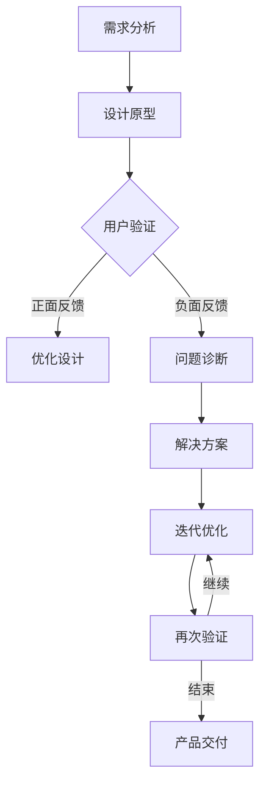
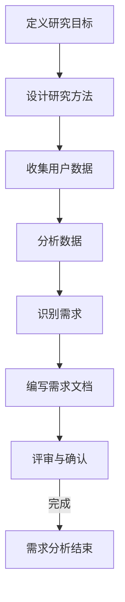
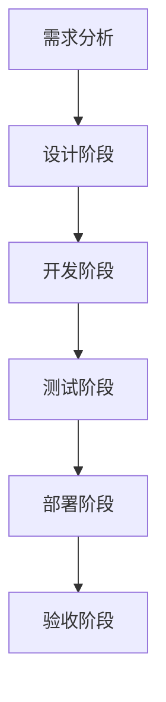
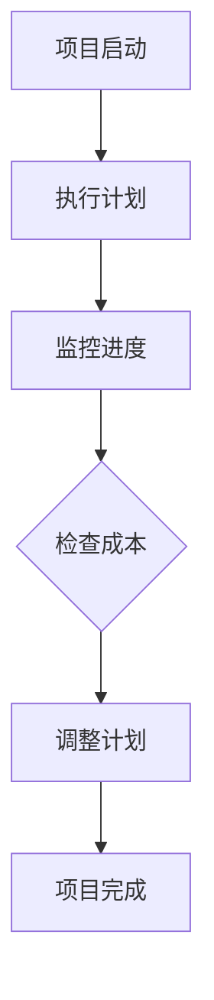
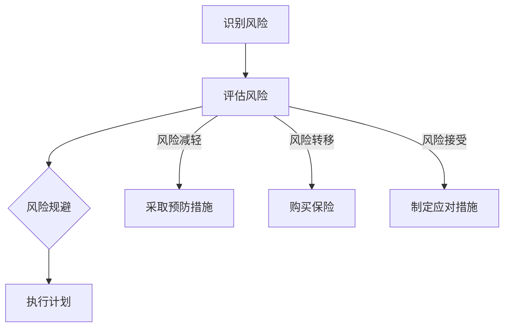
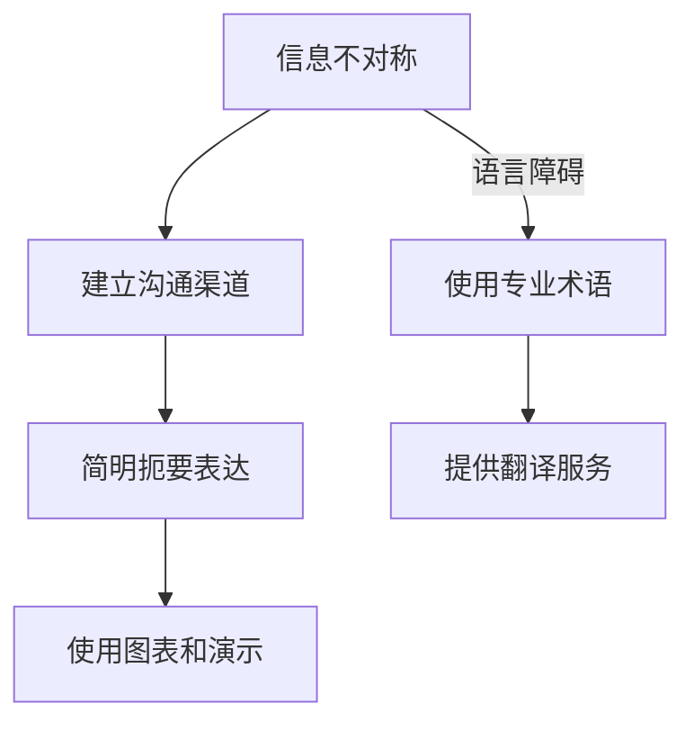
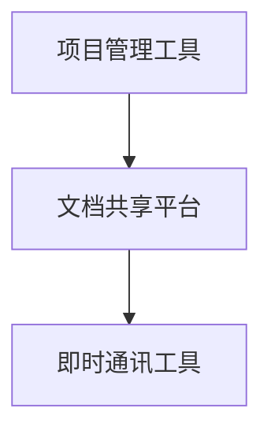

                 

### 文章标题：提升团队技术创新力的方法

#### 关键词：技术创新、团队建设、项目管理、设计思维、实践案例、提升策略

> 摘要：本文旨在探讨如何提升团队的技术创新能力，通过分析技术创新的重要性、团队技术能力构建、创新方法论、技术创新项目管理以及技术创新实践案例等多个方面，为读者提供一套系统的、可操作的提升团队技术创新力的方法。本文适用于企业技术团队管理者、研发人员以及对技术创新感兴趣的专业人士。

---

## 第1章：团队技术创新概述

### 1.1 技术创新的重要性

技术创新是企业持续发展的动力，它不仅能够提升企业的竞争力，还能带来可观的经济效益。在当今快速变化的市场环境中，技术创新已成为企业应对挑战、抓住机遇的关键因素。以下是技术创新对企业和社会的几个重要影响：

#### 1.1.1 技术创新对企业的意义

1. **提高产品竞争力**：通过技术创新，企业可以开发出更具竞争力的产品，满足市场需求，从而占据更大的市场份额。
2. **降低生产成本**：技术创新有助于提高生产效率，降低生产成本，提升企业的盈利能力。
3. **提升品牌形象**：成功的技术创新能够提升企业的品牌形象，增强消费者对企业的信任和忠诚度。

#### 1.1.2 技术创新对社会的影响

1. **推动经济增长**：技术创新是经济增长的重要驱动力，可以促进产业升级和结构调整。
2. **改善生活质量**：技术创新带来新的产品和服务，提高人们的生活质量，满足多样化的消费需求。
3. **促进可持续发展**：技术创新有助于解决资源短缺、环境污染等问题，推动社会可持续发展。

#### 1.1.3 技术创新的驱动力

1. **市场需求**：市场需求是推动技术创新的主要动力，企业需要不断满足用户需求，才能在激烈的市场竞争中立于不败之地。
2. **政策支持**：政府政策支持、科研经费投入等也是推动技术创新的重要因素。
3. **技术创新文化**：企业内部创新文化的培养，能够激发员工的创新热情，形成持续创新的能力。

### 1.2 团队技术创新的挑战

尽管技术创新对企业和社会具有重要意义，但在实际操作中，团队面临许多挑战。以下是团队在技术创新过程中可能遇到的一些主要挑战：

#### 1.2.1 技术复杂性

随着科技的快速发展，技术复杂性日益增加，这给团队的技术创新带来了巨大挑战。团队需要不断学习新知识，掌握新技术，以应对技术复杂性带来的挑战。

#### 1.2.2 团队协作困难

技术创新通常需要多个部门的协同合作，但跨部门沟通和协作往往存在困难，如信息不对称、利益分配不均等问题，这些都可能影响团队的创新能力。

#### 1.2.3 创新风险

技术创新伴随着高风险，包括技术风险、市场风险、资金风险等。这些风险可能导致项目失败，影响团队的士气和创新能力。

### 1.3 技术创新的文化和环境

#### 1.3.1 创新文化的培养

创新文化是推动团队技术创新的核心要素。企业需要建立鼓励创新、包容失败的企业文化，激发员工的创新潜能。以下是一些培养创新文化的措施：

1. **鼓励分享和交流**：鼓励员工分享知识和经验，建立开放的沟通渠道。
2. **认可和激励创新**：对有创新成果的员工给予认可和激励，激发员工的创新热情。
3. **提供学习机会**：为员工提供学习新技术、新方法的机会，提升团队整体的技术水平。

#### 1.3.2 创新环境的营造

创新环境的营造对团队技术创新至关重要。以下是一些营造创新环境的措施：

1. **提供资源支持**：为团队提供充足的资源，包括资金、设备、技术支持等。
2. **建立试验平台**：建立试验平台，为团队提供试错和实验的机会。
3. **建立风险管理体系**：建立完善的风险管理体系，降低创新过程中的风险。

#### 1.3.3 创新资源的配置

创新资源的合理配置是团队技术创新的重要保障。以下是一些创新资源配置的措施：

1. **人力资源配置**：根据团队需求，合理配置人力资源，确保团队有足够的技术人才。
2. **技术资源投入**：加大对技术资源的投入，包括研发经费、技术培训等。
3. **信息资源整合**：整合内外部信息资源，为团队提供全面的信息支持。

---

在接下来的章节中，我们将进一步探讨如何构建团队技术能力、运用创新方法论、进行技术创新项目管理，以及分析实践案例和制定提升策略。通过这些内容，希望能够为团队提升技术创新力提供有益的指导。

### 第2章：团队技术能力构建

技术创新不仅依赖于个人的智慧和能力，更需要整个团队的技术能力作为支撑。构建一支技术过硬、协作默契的团队是提升技术创新力的关键。本章将详细探讨如何选拔和培养技术人才、管理技术知识、促进技术合作与协作，从而构建一个强大的技术团队。

#### 2.1 技术人才选拔与培养

技术人才是团队技术创新的核心，因此，选拔和培养技术人才至关重要。以下是一些具体措施：

##### 2.1.1 技术人才的识别与选拔

1. **技能评估**：通过技能测试、项目实战等方式，评估候选人的技术能力和实际操作水平。
2. **背景调查**：了解候选人的教育背景、工作经历、项目成果等，确保其具备扎实的技术基础。
3. **综合素质**：除了技术能力，还需要关注候选人的团队协作能力、沟通能力、学习能力等综合素质。

##### 2.1.2 技术人才的专业发展

1. **持续培训**：定期为员工提供技术培训，包括新技术、新方法的学习，帮助员工跟上技术发展的步伐。
2. **职业规划**：为员工制定清晰的职业发展规划，鼓励他们不断提升自己，实现个人与团队的共同成长。
3. **激励机制**：建立激励机制，鼓励员工积极参与技术创新项目，对有突出贡献的员工给予奖励。

##### 2.1.3 技术人才的激励机制

1. **绩效考核**：建立科学的绩效考核体系，将技术创新成果纳入考核指标，激发员工的工作积极性。
2. **薪酬福利**：提高技术人才的薪酬待遇，确保其生活无忧，专注于技术创新。
3. **荣誉表彰**：对在技术创新方面有突出贡献的员工给予荣誉表彰，提升其社会地位和自我价值感。

#### 2.2 技术知识管理

技术知识是团队技术创新的重要资源，有效的技术知识管理能够提高团队的创新效率。以下是一些技术知识管理的具体措施：

##### 2.2.1 技术知识的获取与整理

1. **内部培训**：通过内部培训，将团队内部的技术知识进行传递和分享。
2. **外部学习**：鼓励员工参加行业会议、研讨会等，获取前沿的技术知识。
3. **文献整理**：建立技术知识库，对内部和外部获取的技术知识进行整理和归档。

##### 2.2.2 技术知识的共享与传播

1. **内部交流**：定期组织技术交流活动，如技术分享会、技术研讨会等，促进知识的交流与共享。
2. **线上平台**：利用线上平台，如知识管理系统、团队协作工具等，方便团队成员随时获取和共享技术知识。
3. **技术文档**：编写详细的技术文档，包括设计文档、开发文档、测试文档等，确保知识得到有效传播。

##### 2.2.3 技术知识的创新利用

1. **知识创新**：通过技术知识的碰撞和融合，激发新的创意和思路。
2. **知识应用**：将技术知识应用于实际项目中，解决实际问题，提升项目质量和效率。
3. **知识沉淀**：将技术创新过程中的经验和教训进行总结和沉淀，形成可传承的知识财富。

#### 2.3 技术合作与协作

技术合作与协作是提升团队技术创新力的关键环节。以下是一些技术合作与协作的具体措施：

##### 2.3.1 内部合作机制的建立

1. **明确责任**：为每个项目团队明确责任，确保团队成员职责清晰，权责分明。
2. **沟通渠道**：建立有效的沟通渠道，确保团队成员之间的信息传递畅通无阻。
3. **协作工具**：采用高效的协作工具，如项目管理软件、代码管理工具、团队沟通工具等，提升协作效率。

##### 2.3.2 外部合作渠道的拓展

1. **合作伙伴**：寻找并建立与外部合作伙伴的关系，共同开展技术创新项目。
2. **技术交流**：参加行业交流活动，与同行进行技术交流，学习借鉴先进经验。
3. **开放创新**：鼓励员工参与开源项目，与全球开发者共同合作，提高团队的技术水平。

##### 2.3.3 跨部门协作的最佳实践

1. **跨部门会议**：定期召开跨部门会议，协调各部门的工作，确保项目顺利进行。
2. **共同目标**：明确跨部门协作的共同目标，确保团队成员朝着同一个方向努力。
3. **协作流程**：建立跨部门协作的标准化流程，确保协作的高效和有序。

通过以上措施，团队可以构建一支技术过硬、协作默契的技术团队，为技术创新提供强有力的支持。在接下来的章节中，我们将进一步探讨创新方法论、技术创新项目管理和实践案例，帮助团队更有效地提升技术创新力。

### 2.3 技术合作与协作

技术合作与协作是团队技术创新过程中的关键环节，它不仅影响项目的进展速度和效果，还关系到团队成员之间的信任和团队文化的形成。在这一部分，我们将详细探讨如何建立内部合作机制、拓展外部合作渠道，以及实现跨部门协作的最佳实践。

#### 2.3.1 内部合作机制的建立

建立有效的内部合作机制是确保团队协作顺畅的基础。以下是一些具体的措施：

1. **明确责任分工**：在项目启动时，明确每个团队成员的职责和任务，确保团队成员了解自己的工作内容和期望成果。这有助于避免工作重叠和责任模糊，提高团队的工作效率。

   ```mermaid
   graph TD
   A[项目经理] --> B[技术主管];
   B --> C[开发人员];
   C --> D[测试人员];
   D --> E[产品经理];
   E --> F[运营团队];
   ```

2. **沟通渠道**：建立多样化的沟通渠道，如日常站会、周报、邮件、即时通讯工具等，确保团队成员之间的信息传递畅通无阻。良好的沟通能够减少误解，提高团队协作效率。

   ```mermaid
   graph TD
   A[项目经理] --> B{站会};
   B --> C{周报};
   C --> D{邮件};
   D --> E{IM};
   ```

3. **协作工具**：采用合适的协作工具，如项目管理软件（如JIRA）、代码管理工具（如Git）、文档共享平台（如Confluence）等，以提高团队协作的效率。这些工具可以帮助团队成员更好地协同工作，确保项目进展透明、可控。

   ```mermaid
   graph TD
   A[项目管理软件] --> B[代码管理工具];
   B --> C[文档共享平台];
   C --> D[即时通讯工具];
   ```

#### 2.3.2 外部合作渠道的拓展

外部合作对于团队技术创新具有重要意义，它不仅能够带来新的思路和资源，还能提升团队的技术视野和竞争力。以下是一些拓展外部合作渠道的措施：

1. **合作伙伴**：寻找并建立与外部合作伙伴的关系，如供应商、客户、行业协会等。这些合作伙伴可以提供技术支持、市场信息、资金资源等，有助于团队更好地开展技术创新项目。

2. **技术交流**：参加行业会议、研讨会、技术沙龙等活动，与同行进行技术交流，学习借鉴先进经验。这些活动不仅可以扩展团队的技术视野，还能建立行业内的合作关系。

3. **开放创新**：积极参与开源项目，与全球开发者共同合作。开源项目提供了一个共享创新成果、共同解决问题的平台，有助于团队吸收前沿技术，提升自身技术水平。

#### 2.3.3 跨部门协作的最佳实践

跨部门协作在技术创新项目中尤为常见，但往往也面临诸多挑战。以下是一些跨部门协作的最佳实践：

1. **跨部门会议**：定期召开跨部门会议，协调各部门的工作，确保项目顺利进行。这些会议可以帮助各部门了解项目的整体进展和关键节点，避免信息不对称和资源浪费。

2. **共同目标**：明确跨部门协作的共同目标，确保团队成员朝着同一个方向努力。共同目标有助于凝聚团队力量，提升协作效率。

3. **协作流程**：建立跨部门协作的标准化流程，确保协作的高效和有序。这些流程应包括项目启动、任务分配、进度汇报、问题解决等各个环节，确保跨部门协作有条不紊。

   ```mermaid
   graph TD
   A[项目启动] --> B[任务分配];
   B --> C[进度汇报];
   C --> D[问题解决];
   D --> E[总结反馈];
   ```

通过建立有效的内部合作机制、拓展外部合作渠道，以及实施跨部门协作的最佳实践，团队可以更有效地进行技术创新。在下一章中，我们将探讨创新方法论，进一步探讨如何运用设计思维、快速原型与迭代，以及用户研究与需求分析，以提升团队的技术创新能力。

### 第3章：创新方法论

创新方法论是指导团队进行技术创新的重要工具，它包括设计思维、快速原型与迭代、用户研究与需求分析等多个方面。本章将详细探讨这些方法论的具体内容，以帮助团队更好地进行技术创新。

#### 3.1 设计思维

设计思维是一种以人为本的创新方法，它强调从用户的角度出发，通过迭代和实验来解决问题。以下是设计思维的几个关键步骤：

##### 3.1.1 设计思维的基本理念

1. **以用户为中心**：设计思维的核心是以用户需求为中心，确保创新成果能够真正满足用户的需求。
2. **迭代与实验**：设计思维鼓励不断试错和迭代，通过实验找到最佳解决方案。
3. **跨学科合作**：设计思维强调多学科团队的协作，不同领域的专家共同探讨问题，带来多样化的视角和解决方案。

##### 3.1.2 设计思维的应用场景

设计思维适用于多种场景，包括新产品开发、服务设计、用户体验优化等。以下是一些应用场景的例子：

1. **新产品开发**：在设计新产品时，使用设计思维可以帮助团队深入了解用户需求，快速迭代原型，优化产品设计。
2. **服务设计**：在设计新服务时，设计思维可以帮助团队理解用户的使用场景，提供更加人性化的服务体验。
3. **用户体验优化**：在优化现有产品或服务时，设计思维可以帮助团队识别用户痛点，提供创新的解决方案。

##### 3.1.3 设计思维的实践步骤

1. **理解用户**：通过用户调研、用户访谈等方式，深入了解用户的需求和痛点。
2. **构建原型**：基于用户需求，快速构建原型，可以是草图、线框图或高保真模型。
3. **测试与反馈**：将原型展示给用户，收集反馈，根据反馈进行迭代优化。
4. **实施与推广**：将最终方案实施到产品或服务中，并持续收集用户反馈，不断优化。

#### 3.2 快速原型与迭代

快速原型与迭代是设计思维的重要组成部分，它通过快速构建和测试原型，快速发现并解决问题，从而提升产品的质量和用户满意度。以下是快速原型与迭代的几个关键步骤：

##### 3.2.1 原型设计的原则

1. **简单性**：原型应尽量简单，专注于核心功能和用户需求。
2. **可操作性**：原型应具备一定的可操作性，以便用户能够实际体验和测试。
3. **易修改性**：原型应易于修改和调整，以适应不断变化的需求和反馈。

##### 3.2.2 快速原型制作工具

1. **Sketch**：一款流行的界面设计工具，适用于创建高保真原型。
2. **Figma**：一款基于网页的协作设计工具，支持多人实时协作。
3. **Axure**：一款功能强大的原型设计工具，适用于创建复杂交互原型。

##### 3.2.3 迭代优化与反馈

1. **用户反馈**：将原型展示给用户，收集用户反馈，识别潜在问题和优化点。
2. **迭代优化**：根据用户反馈，对原型进行迭代优化，改进用户体验。
3. **测试验证**：在每次迭代后进行测试验证，确保优化效果，并进一步收集用户反馈。

#### 3.3 用户研究与需求分析

用户研究与需求分析是技术创新的重要基础，它通过深入了解用户需求和行为，为产品或服务的设计提供有力支持。以下是用户研究与需求分析的几个关键步骤：

##### 3.3.1 用户研究的意义

1. **发现需求**：通过用户研究，发现用户未被满足的需求，为产品创新提供方向。
2. **优化设计**：通过用户研究，了解用户对现有产品或服务的反馈，指导设计优化。
3. **降低风险**：通过用户研究，识别潜在的风险和问题，降低项目失败的风险。

##### 3.3.2 用户研究的方法

1. **用户访谈**：通过面对面或在线访谈，深入了解用户的需求、行为和痛点。
2. **问卷调查**：通过设计问卷，收集大量用户数据，进行分析和总结。
3. **可用性测试**：将产品或服务展示给用户，观察用户的使用行为和反馈，评估产品的易用性。

##### 3.3.3 需求分析的工具与技术

1. **用户画像**：通过用户画像，了解用户的特征、需求和偏好。
2. **SWOT分析**：通过SWOT分析，评估产品的优势、劣势、机会和威胁。
3. **需求文档**：编写详细的需求文档，明确产品的功能、性能和用户体验要求。

通过设计思维、快速原型与迭代以及用户研究与需求分析，团队可以更有效地进行技术创新。在下一章中，我们将探讨技术创新项目管理，包括项目规划与评估、风险管理、团队协作与沟通等方面的内容，帮助团队更好地管理技术创新项目。

### 3.2 快速原型与迭代

快速原型与迭代是创新过程中至关重要的一环，它通过构建可操作的原型，快速验证和改进设计方案，从而降低创新风险，提高产品的市场适应性。以下是快速原型与迭代的具体方法和步骤。

#### 3.2.1 原型设计的原则

在进行原型设计时，需要遵循以下几个原则：

1. **最小可行性产品（MVP）**：设计最小可行性产品，即包含核心功能的最简版本，以便快速验证市场需求。
2. **用户导向**：设计原型时，始终以用户为中心，确保原型能够满足用户的核心需求。
3. **灵活性**：原型应具备足够的灵活性，以便根据用户反馈进行调整和优化。
4. **可迭代性**：设计原型时，考虑到未来的迭代和扩展，为后续功能添加预留空间。

#### 3.2.2 快速原型制作工具

为了高效地构建原型，可以采用以下几种工具：

1. **Sketch**：一款用户界面设计工具，支持矢量绘图和交互设计，适用于创建高质量的原型。
2. **Figma**：一款基于网页的协作设计工具，支持多人实时协作，便于团队成员共同设计和讨论。
3. **Axure**：一款功能强大的原型设计工具，支持丰富的交互设计和数据分析功能。

#### 3.2.3 迭代优化与反馈

迭代优化与反馈是快速原型与迭代的核心，以下是一些关键步骤：

1. **原型验证**：构建原型后，将其展示给目标用户，观察用户的使用行为和反馈，评估原型的可用性和用户体验。
2. **用户访谈**：通过用户访谈，深入了解用户对原型的看法，识别潜在的问题和改进点。
3. **数据分析**：收集和分析用户数据，如点击热图、用户路径等，了解用户在使用原型时的行为模式。
4. **反馈闭环**：根据用户反馈，对原型进行迭代优化，并再次进行验证和测试，形成反馈闭环。

以下是一个简化的迭代优化流程：



通过上述步骤，团队可以持续优化产品原型，逐步接近最终目标。每次迭代都是对前一次设计的改进，通过反复迭代，产品会逐渐变得更加完善和符合用户需求。

#### 3.2.4 用户反馈与调整

用户反馈是迭代过程中的关键因素，以下是一些用户反馈与调整的方法：

1. **定量反馈**：通过问卷调查、评分系统等方式，收集用户对原型的定量反馈，了解用户满意度。
2. **定性反馈**：通过用户访谈、焦点小组讨论等方式，收集用户对原型的定性反馈，深入了解用户的真实感受和需求。
3. **反馈分类**：将用户反馈分类整理，识别出高频问题、共性需求和个性化需求，为后续迭代提供具体改进方向。
4. **快速响应**：对用户反馈进行快速响应，及时调整和优化原型，提高用户满意度。

通过快速原型与迭代，团队可以在较短的时间内验证和优化产品方案，减少项目风险，提高创新成功率。在下一章中，我们将探讨如何进行技术创新项目管理和风险控制，以确保项目的顺利推进。

### 3.3 用户研究与需求分析

用户研究与需求分析是技术创新过程中至关重要的一环，它帮助团队深入了解用户需求和行为，从而设计出更符合用户期望的产品或服务。以下是用户研究与需求分析的具体步骤和方法。

#### 3.3.1 用户研究的意义

用户研究在技术创新中具有以下几个重要意义：

1. **发现需求**：通过用户研究，团队可以识别出用户未被满足的需求，从而为产品创新提供方向。
2. **优化设计**：了解用户的需求和痛点，有助于团队在产品设计中做出更合适的决策，提升用户体验。
3. **降低风险**：通过用户研究，团队可以提前识别潜在的风险和问题，降低项目失败的风险。

#### 3.3.2 用户研究的方法

用户研究的方法多种多样，以下是一些常见的方法：

1. **用户访谈**：通过面对面的深度访谈，与用户进行深入的交流，了解他们的需求、行为和态度。这是一种较为直接和深入的研究方法，适用于了解用户的具体细节。
2. **问卷调查**：通过设计问卷，收集大量用户数据，进行分析和总结。问卷调查适用于大规模的用户群体，能够快速获取广泛的数据。
3. **可用性测试**：将产品或服务展示给用户，观察他们的使用行为和反馈，评估产品的易用性和用户体验。可用性测试通常在产品的不同阶段进行，以验证设计方案的可行性和优化方向。
4. **用户画像**：通过用户数据和行为分析，构建出典型的用户画像，帮助团队更好地理解用户群体的特征和需求。

#### 3.3.3 需求分析的工具与技术

进行需求分析时，可以采用以下工具和技术：

1. **SWOT分析**：通过SWOT分析，评估产品的优势、劣势、机会和威胁，从而为需求分析提供全面的视角。
2. **用户画像**：通过用户画像，详细描述用户的特征、需求和偏好，帮助团队设计更个性化的产品。
3. **用户故事**：通过编写用户故事，将用户的需求和行为转化为具体的描述，为产品设计和开发提供详细的指导。
4. **需求文档**：编写详细的需求文档，明确产品的功能、性能和用户体验要求，确保团队成员对需求有统一的理解。

以下是一个用户研究与需求分析的流程：



通过上述步骤，团队可以系统地开展用户研究与需求分析，确保产品的设计符合用户需求，从而提升产品的市场竞争力。

### 第4章：技术创新项目管理

技术创新项目管理的目标是通过科学的管理方法，确保项目在预算、时间和质量等方面达到预期目标。在这一章中，我们将详细探讨技术创新项目管理的关键方面，包括项目规划与评估、风险管理、团队协作与沟通。

#### 4.1 项目规划与评估

项目规划与评估是技术创新项目管理的基础，它包括以下几个方面：

##### 4.1.1 项目规划的关键要素

1. **项目目标**：明确项目要达成的目标和期望成果，确保项目方向正确。
2. **项目范围**：定义项目的范围，包括项目要实现的功能和排除的内容，避免范围蔓延。
3. **项目任务**：列出项目的主要任务和工作内容，确保任务明确、可执行。
4. **项目资源**：规划项目所需的资源，包括人力资源、设备、资金等，确保资源充足。
5. **项目时间表**：制定详细的项目时间表，明确每个任务的开始和结束时间，确保项目按时完成。

以下是一个简单的项目时间表示例：



##### 4.1.2 项目风险评估

项目风险评估是项目规划的重要组成部分，它包括以下几个方面：

1. **识别风险**：识别项目可能面临的风险，包括技术风险、市场风险、资源风险等。
2. **评估风险**：对识别出的风险进行评估，确定其发生概率和可能造成的影响。
3. **制定应对策略**：根据风险评估结果，制定相应的应对策略，包括风险规避、减轻、转移等。

以下是一个简单的风险评估表格：

| 风险名称 | 发生概率 | 影响程度 | 应对策略 |
| :------: | :------: | :------: | :------: |
| 技术问题 | 高       | 中       | 技术储备，快速原型测试 |
| 资金不足 | 中       | 高       | 资金调度，临时融资 |
| 市场变化 | 低       | 中       | 市场调研，灵活调整策略 |

##### 4.1.3 项目进度与成本控制

1. **项目进度控制**：通过定期检查项目进度，确保项目按计划进行，及时发现和解决问题。
2. **成本控制**：监控项目成本，确保项目在预算范围内完成，采取必要的节约措施。

以下是一个项目进度与成本控制流程：



#### 4.2 风险管理

风险管理是技术创新项目管理的重要环节，它包括风险识别、评估、应对和监控。以下是风险管理的具体措施：

##### 4.2.1 创新项目风险类型

1. **技术风险**：包括技术难度、技术可行性等。
2. **市场风险**：包括市场接受度、竞争对手反应等。
3. **资源风险**：包括人力资源、设备资源等。
4. **时间风险**：包括项目延期、时间紧迫等。

##### 4.2.2 风险识别与评估

1. **定期评估**：定期对项目进行风险评估，及时发现潜在风险。
2. **专家评审**：邀请相关领域的专家对项目风险进行评审，提供专业的意见和建议。
3. **历史数据分析**：分析历史项目数据，识别类似项目的风险，为当前项目提供参考。

##### 4.2.3 风险应对策略

1. **风险规避**：通过调整项目计划，避免风险的发生。
2. **风险减轻**：通过采取预防措施，降低风险发生的概率或影响程度。
3. **风险转移**：通过保险、外包等方式，将风险转移给第三方。
4. **风险接受**：对于无法规避或减轻的风险，制定应对措施，确保项目能够继续推进。

以下是一个风险应对策略示例：



#### 4.3 团队协作与沟通

有效的团队协作与沟通是技术创新项目成功的关键。以下是一些团队协作与沟通的具体措施：

##### 4.3.1 团队协作的重要性

1. **资源共享**：通过团队协作，实现资源的共享和优化，提高工作效率。
2. **知识传承**：团队成员之间的协作可以促进知识的传递和积累，提升整体技术水平。
3. **协同创新**：团队协作可以激发创新思维，共同应对项目挑战。

##### 4.3.2 沟通障碍与解决方法

1. **沟通障碍**：包括信息不对称、沟通方式不当、语言障碍等。
2. **解决方法**：
   - **明确沟通目标**：确保每次沟通都有明确的目标和预期结果。
   - **选择合适的方式**：根据沟通内容选择合适的沟通方式，如会议、邮件、即时通讯等。
   - **提高沟通效率**：通过简明扼要的表达、清晰的图表和演示，提高沟通效率。

以下是一个沟通障碍与解决方法的示例：



##### 4.3.3 团队协作工具与平台

为了提高团队协作效率，可以采用以下工具与平台：

1. **项目管理工具**：如JIRA、Trello等，用于任务管理、进度跟踪和团队协作。
2. **文档共享平台**：如Google Drive、Confluence等，用于文档共享和版本控制。
3. **即时通讯工具**：如Slack、微信等，用于实时沟通和协作。

以下是一个团队协作工具与平台示例：



通过项目规划与评估、风险管理和团队协作与沟通，团队可以更好地管理技术创新项目，确保项目按计划顺利推进，实现预期的创新目标。在下一章中，我们将通过实践案例，进一步探讨提升团队技术创新力的具体方法和策略。

### 第5章：技术创新实践案例

在探讨提升团队技术创新力之前，了解国内外一些成功的技术创新实践案例是至关重要的。这些案例不仅展示了技术创新的巨大潜力，也为其他团队提供了宝贵的经验和启示。本章将介绍几则技术创新实践案例，并对其进行分析，探讨其成功的原因和可借鉴之处。

#### 5.1 国内外成功案例介绍

##### 案例一：特斯拉（Tesla）

特斯拉作为电动汽车和清洁能源领域的领军企业，其技术创新实践具有代表性。特斯拉通过自主研发和创新，推出了多款高性能、环保的电动汽车，并在电池技术、自动驾驶等领域取得了重要突破。

**成功原因**：
1. **持续投资研发**：特斯拉在研发上的投入巨大，每年投入巨额资金进行技术创新。
2. **开放创新文化**：特斯拉鼓励内部创新，倡导开放式合作，吸引了大量顶尖人才。
3. **用户参与**：特斯拉通过与用户互动，不断优化产品和服务，提升用户体验。

##### 案例二：谷歌（Google）

谷歌作为全球领先的技术公司，其技术创新实践涵盖了搜索引擎、云计算、人工智能等多个领域。谷歌通过不断的创新，推动了整个科技行业的发展。

**成功原因**：
1. **强大的人才储备**：谷歌拥有大量顶尖的技术人才，能够持续推动技术创新。
2. **开源生态**：谷歌积极参与开源项目，推动了技术的普及和进步。
3. **持续迭代**：谷歌的产品和服务不断迭代更新，始终保持领先地位。

##### 案例三：阿里巴巴（Alibaba）

阿里巴巴作为中国最大的电子商务平台，其技术创新实践在电子商务、云计算、金融科技等领域取得了显著成果。

**成功原因**：
1. **生态系统建设**：阿里巴巴建立了庞大的生态系统，包括电商平台、金融、物流等，为技术创新提供了广阔的应用场景。
2. **大数据驱动**：阿里巴巴通过大数据分析，洞察用户需求，指导产品创新。
3. **全球化战略**：阿里巴巴通过全球化布局，不断拓展市场，推动技术创新。

#### 5.2 案例分析

通过以上案例，我们可以总结出一些成功的关键因素：

1. **持续投资研发**：所有案例中的企业都重视研发投入，持续推动技术创新。
2. **开放创新文化**：企业内部鼓励创新，倡导开放式合作，吸引顶尖人才。
3. **用户参与**：企业通过与用户互动，了解用户需求，不断优化产品和服务。
4. **人才储备**：拥有强大的技术人才队伍，是企业持续创新的重要保障。
5. **开源生态**：参与开源项目，不仅有助于技术推广，还能吸引全球开发者共同创新。
6. **大数据驱动**：通过大数据分析，洞察用户需求，指导产品创新。
7. **全球化战略**：全球化布局为企业提供了广阔的应用场景和市场需求。

#### 5.3 启示与借鉴

以上案例为我们提供了以下启示和借鉴：

1. **重视研发投入**：企业应加大对研发的投入，确保技术创新的持续动力。
2. **建立创新文化**：鼓励创新，倡导开放式合作，激发员工的创新潜能。
3. **用户参与**：通过用户调研和反馈，了解用户需求，提升产品竞争力。
4. **人才战略**：吸引和培养顶尖人才，建立强大的技术团队。
5. **开源合作**：积极参与开源项目，推动技术普及和进步。
6. **大数据分析**：利用大数据，指导产品创新，提升用户体验。
7. **全球化布局**：拓展国际市场，利用全球资源，推动技术创新。

通过学习和借鉴这些成功案例，企业可以制定适合自己的技术创新策略，提升团队的技术创新能力，实现持续发展和竞争优势。

### 第6章：技术创新力提升策略

要提升团队的技术创新力，企业需要在组织架构、创新激励政策和技术创新生态系统建设等方面采取系统性的措施。本章将详细探讨这些策略，并提供一些实用的建议。

#### 6.1 组织架构调整

组织架构对团队的技术创新力具有重要影响。以下是一些组织架构调整的建议：

##### 6.1.1 创新型组织架构的特点

1. **扁平化**：减少管理层级，缩短决策链条，提高决策效率。
2. **跨部门协作**：打破部门壁垒，建立跨部门团队，促进资源共享和协同创新。
3. **敏捷性**：采用敏捷开发模式，快速响应市场需求，提高产品迭代速度。
4. **去中心化**：鼓励员工自主提出创新想法，并给予足够的支持，形成全员创新的氛围。

##### 6.1.2 组织架构调整的方法

1. **扁平化**：通过减少管理层级，缩短决策链条，提高决策效率。例如，将多个中层管理岗位合并，直接由高层领导管理关键团队。
2. **矩阵式组织**：建立矩阵式组织，将职能部门和项目团队相结合，促进跨部门协作。例如，在研发部门中设立项目经理，负责跨部门项目的协调和管理。
3. **敏捷团队**：采用敏捷开发模式，建立敏捷团队，提高项目执行效率和创新能力。例如，通过每日站会、迭代评审等方式，确保团队成员之间的沟通和协作。
4. **去中心化**：鼓励员工自主提出创新想法，并给予足够的支持。例如，设立内部创新基金，支持员工自主项目的研究和开发。

#### 6.2 创新激励政策

创新激励政策是激发团队创新活力的重要手段。以下是一些创新激励政策的建议：

##### 6.2.1 激励政策的设计原则

1. **公平性**：确保激励政策的公平性，避免偏袒和利益冲突。
2. **可持续性**：激励政策应具备可持续性，能够长期激励员工的创新热情。
3. **灵活性**：激励政策应具备灵活性，能够根据实际情况进行调整。

##### 6.2.2 激励政策的具体措施

1. **薪酬激励**：通过提高基本薪酬和项目奖金，激励员工的创新积极性。例如，设立技术创新奖，对有突出贡献的员工给予奖励。
2. **股权激励**：通过股权激励，让员工分享企业发展的红利，增强员工的归属感和责任感。例如，设立员工持股计划，让员工持有公司股票。
3. **晋升激励**：通过设立职业晋升通道，激励员工不断提升自己的能力和业绩。例如，设立创新型人才晋升通道，对有创新成果的员工优先晋升。
4. **培训激励**：提供培训和成长机会，激励员工不断学习和提升。例如，设立创新培训计划，为员工提供新技术、新方法的学习机会。

#### 6.3 技术创新生态系统建设

技术创新生态系统建设是企业提升技术创新力的重要保障。以下是一些生态系统建设的建议：

##### 6.3.1 生态系统建设的目标

1. **资源整合**：通过整合内外部资源，形成创新资源池，提高资源利用效率。
2. **协同创新**：通过建立协同创新机制，促进不同团队、不同行业之间的合作，推动技术创新。
3. **持续创新**：通过不断优化和创新，保持企业的技术领先地位。

##### 6.3.2 生态系统建设的方法

1. **开放创新平台**：建立开放创新平台，吸引外部创新资源和人才，促进内外部资源的整合和协同创新。例如，设立创新实验室，为外部创新者和企业内部团队提供合作机会。
2. **产学研合作**：加强与高校、科研院所的合作，推动产学研一体化，促进技术创新。例如，与高校合作设立联合实验室，共同开展研究项目。
3. **技术联盟**：加入或组建技术联盟，与其他企业、研究机构共同推动技术创新。例如，成立行业技术联盟，共同研究行业关键技术问题。
4. **创业孵化**：建立创业孵化平台，支持内部创业者和创新项目，推动技术商业化。例如，设立内部创业基金，为创新项目提供资金支持。

通过组织架构调整、创新激励政策和技术创新生态系统建设，企业可以构建一个有利于技术创新的环境，激发团队的创新潜能，提升整体的技术创新能力。在下一章中，我们将探讨技术创新的未来发展趋势，以及技术创新力提升的可持续性。

### 第7章：未来展望与趋势

随着科技的快速发展，技术创新正成为推动社会进步和经济发展的关键力量。在这一章中，我们将探讨技术创新的未来发展趋势，分析技术创新对社会的影响，并探讨如何确保技术创新力的可持续提升。

#### 7.1 技术创新的发展趋势

未来，技术创新将继续呈现出以下几个主要趋势：

##### 7.1.1 人工智能与大数据

人工智能（AI）和大数据技术的快速发展，将使数据处理和分析能力大幅提升。未来，AI技术将在更多领域得到应用，如自动驾驶、智能家居、医疗健康等。大数据技术将帮助企业和组织更好地理解用户需求，优化产品设计和服务。

##### 7.1.2 5G与物联网

5G技术的普及和物联网（IoT）的快速发展，将推动万物互联。5G的高速率、低延迟特性，将提升网络通信的效率，为物联网应用提供更强有力的支持。未来，智能家居、智能城市、智能制造等领域将因5G和物联网技术的应用而变得更加智能和高效。

##### 7.1.3 区块链与加密货币

区块链技术的应用将越来越广泛，特别是在金融、供应链管理等领域。加密货币和数字货币的发展，将改变传统金融体系，提高金融交易的安全性和透明度。未来，区块链技术将继续推动金融创新，为经济和社会发展提供新动力。

##### 7.1.4 生物技术与新材料

生物技术将继续推动医疗健康领域的创新，如基因编辑、精准医疗等。新材料技术的突破，将为航空航天、新能源等领域提供更轻、更强、更耐用的材料，推动技术创新和产业升级。

#### 7.2 技术创新对社会的影响

技术创新对社会产生了深远的影响，主要体现在以下几个方面：

##### 7.2.1 提高生产效率

技术创新有助于提高生产效率，降低生产成本，推动经济发展。通过引入新技术，企业可以优化生产流程，提高产品品质，提升市场竞争力。

##### 7.2.2 改善生活质量

技术创新带来了新的产品和服务，提高了人们的生活质量。例如，智能家居设备、医疗健康技术等，使人们的生活更加便捷、舒适和健康。

##### 7.2.3 促进可持续发展

技术创新有助于解决资源短缺、环境污染等问题，推动社会可持续发展。例如，新能源技术、环保材料等，为减少碳排放、保护生态环境提供了有力支持。

##### 7.2.4 推动社会变革

技术创新推动了社会变革，改变了人们的生活方式和社会结构。例如，互联网和移动通信技术的发展，使人们的生活和工作方式发生了翻天覆地的变化。

#### 7.3 技术创新力的可持续性

确保技术创新力的可持续性，是企业长期发展的重要任务。以下是一些建议：

##### 7.3.1 持续投资研发

企业应持续加大对研发的投入，确保技术创新的持续动力。只有不断推动技术创新，企业才能在激烈的市场竞争中保持领先地位。

##### 7.3.2 培养创新文化

企业应建立鼓励创新、包容失败的企业文化，激发员工的创新热情。创新文化是企业技术创新的重要保障，有助于培养员工的创新意识和能力。

##### 7.3.3 加强人才培养

企业应加强人才培养，提升员工的技术水平和创新能力。通过内部培训和外部引进，企业可以打造一支技术过硬、创新活力强的团队。

##### 7.3.4 优化创新生态

企业应优化创新生态，建立开放、合作、共享的创新环境。通过建立创新实验室、技术联盟、产学研合作等机制，企业可以吸引外部创新资源和人才，促进内外部资源的整合和协同创新。

##### 7.3.5 长期战略规划

企业应制定长期战略规划，确保技术创新与企业发展方向相一致。通过长期规划，企业可以明确技术创新的重点领域和方向，确保技术创新力的可持续提升。

通过持续投资研发、培养创新文化、加强人才培养、优化创新生态和制定长期战略规划，企业可以确保技术创新力的可持续性，实现长期稳定发展。

### 总结与展望

本文从多个角度探讨了提升团队技术创新力的方法，包括团队技术创新概述、团队技术能力构建、创新方法论、技术创新项目管理、实践案例和提升策略等方面。通过分析技术创新的重要性、团队技术能力构建、创新方法论、技术创新项目管理和实践案例，我们提出了一系列提升团队技术创新力的策略。未来，随着科技的快速发展，技术创新将继续成为企业和社会发展的重要驱动力。为了确保技术创新力的可持续性，企业需要持续投资研发、培养创新文化、加强人才培养、优化创新生态和制定长期战略规划。通过这些措施，企业可以不断提升技术创新力，实现长期稳定发展。

---

**作者：AI天才研究院/AI Genius Institute & 禅与计算机程序设计艺术 /Zen And The Art of Computer Programming**

---

在未来的技术创新道路上，让我们携手并进，共同探索新的技术和解决方案，推动社会进步，实现可持续发展。希望本文能为您在提升团队技术创新力方面提供有益的启示和借鉴。如果您有任何问题或建议，欢迎随时与我们交流。谢谢您的阅读！

