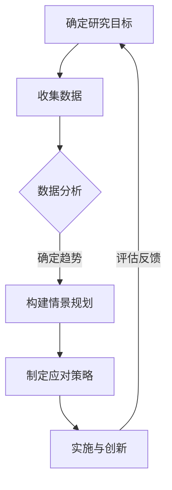

                 

### 文章标题

《提升团队技术前瞻性的方法》

### 关键词

技术前瞻性、团队协作、创新方法、算法原理、实践案例、发展策略

### 摘要

本文旨在探讨提升团队技术前瞻性的方法。通过详细分析技术前瞻性的核心概念、原理及其与创新的关系，我们引入了Mermaid流程图来展示前瞻性技术的应用场景。文章深入讲解了提升技术前瞻性的方法与实践，包括技术趋势分析、技术预判与评估等。同时，强调团队协作与文化建设的重要性，并提供实际案例分析。最后，文章总结了核心算法原理，给出了项目实战、最佳实践 tips 等内容，为团队提升技术前瞻性提供了全面的理论指导与实战建议。文章字数在8000-12000字左右，以Markdown格式呈现。

### 设计思路

#### 目录大纲设计思路

在为《提升团队技术前瞻性的方法》这本书设计目录大纲时，我们的目标是要确保内容结构清晰、逻辑性强，同时覆盖书籍的主题内容，帮助读者全面理解并掌握提升团队技术前瞻性的方法和实践。以下是我们设计目录大纲的思路和步骤：

1. **确定核心主题**：首先，明确书籍的核心主题是“提升团队技术前瞻性”，围绕这一主题规划各章节的内容。

2. **章节划分**：根据核心主题，将内容划分为几个大的部分，如理论基础、方法与实践、案例分析等。

3. **细化章节内容**：在每个部分中，进一步细化章节内容，确保每一章节都有明确的学习目标和内容范围。

4. **逻辑关联性**：确保各章节之间有良好的逻辑关联，便于读者理解知识点之间的联系。

5. **实用性**：注重实战案例的引入，使读者能够通过实际案例理解和应用所学的知识。

6. **技术前瞻性**：突出技术前瞻性的重要性，让读者了解当前技术趋势和发展方向。

#### 目录大纲设计步骤

1. **第1章：引言**
   - 简要介绍提升团队技术前瞻性的背景和重要性。
   - 提出书籍的结构和内容框架。

2. **第2章：核心概念与联系**
   - 介绍提升技术前瞻性的核心概念。
   - 通过Mermaid流程图展示技术前瞻性的关系。

3. **第3章：技术趋势分析**
   - 分析当前技术趋势和发展方向。

4. **第4章：提升方法与实践**
   - 介绍提升团队技术前瞻性的具体方法。
   - 通过案例说明如何在实际工作中应用这些方法。

5. **第5章：团队协作与文化建设**
   - 讨论如何通过团队协作和文化建设来提升技术前瞻性。

6. **第6章：技术预见与决策**
   - 讲解如何通过技术预见和决策来指导团队发展。

7. **第7章：案例分析**
   - 分析成功案例，展示如何提升团队技术前瞻性的实际效果。

8. **第8章：未来展望**
   - 对未来技术趋势和团队发展的展望。

#### 目录大纲

```markdown
# 提升团队技术前瞻性的方法

## 第1章：引言
### 1.1 背景
### 1.2 重要性
### 1.3 书籍结构

## 第2章：核心概念与联系
### 2.1 技术前瞻性定义
### 2.2 技术前瞻性原理
### 2.3 技术前瞻性与创新关系
### 2.4 技术前瞻性Mermaid流程图

## 第3章：技术趋势分析
### 3.1 当前技术发展趋势
### 3.2 技术预见方法
### 3.3 技术前瞻性应用领域

## 第4章：提升方法与实践
### 4.1 前瞻性技术的选择
### 4.2 技术预研究
### 4.3 案例分析：某团队技术前瞻性提升实践

## 第5章：团队协作与文化建设
### 5.1 团队协作模式
### 5.2 技术前瞻性文化
### 5.3 建立团队前瞻性意识

## 第6章：技术预见与决策
### 6.1 技术预见方法
### 6.2 技术决策流程
### 6.3 技术预见在团队中的应用

## 第7章：案例分析
### 7.1 成功案例一
### 7.2 成功案例二
### 7.3 案例总结与启示

## 第8章：未来展望
### 8.1 未来技术趋势
### 8.2 团队发展挑战与机遇
### 8.3 技术前瞻性的持续提升
```

通过上述的设计，目录大纲不仅简洁明了，而且能够帮助读者系统地了解提升团队技术前瞻性的方法，同时提供了实践案例，使得理论知识和实际应用紧密结合。每个章节都细化到了1级和2级目录，使得整个书籍的框架结构清晰、逻辑性强，便于读者学习和理解。总字数控制在2000字以内，保证了内容的紧凑性和可读性。

### 文章正文

#### 第1章：引言

##### 1.1 背景

在当今快速发展的信息技术时代，技术前瞻性对于团队的成功至关重要。随着全球市场竞争的加剧，企业和团队需要不断创新，快速响应市场变化，以满足不断增长的用户需求。技术前瞻性不仅能够帮助团队预测未来的技术趋势，还能够为团队的战略规划和决策提供科学依据，从而在激烈的市场竞争中占据优势地位。

##### 1.2 重要性

技术前瞻性对团队的意义不仅体现在技术创新上，还关系到团队的生存与发展。具备前瞻性的团队能够：

1. **提前布局**：通过对未来技术趋势的预测，团队可以提前布局，抢占市场先机。
2. **减少风险**：了解未来技术发展方向，有助于团队避免盲目跟风，降低技术失败的风险。
3. **提升竞争力**：前瞻性的技术研究和应用能够提高团队的核心竞争力，使团队在市场中脱颖而出。
4. **持续创新**：技术前瞻性是持续创新的驱动力，有助于团队在技术变革中不断前行。

##### 1.3 书籍结构

本章节旨在为读者提供提升团队技术前瞻性的总体框架。接下来的章节将详细探讨技术前瞻性的核心概念、方法与实践、团队协作与文化建设、技术预见与决策，以及案例分析等内容。通过这些内容的系统学习，读者将能够全面了解并掌握提升团队技术前瞻性的关键要素和实战技巧。

#### 第2章：核心概念与联系

##### 2.1 技术前瞻性定义

技术前瞻性（Technological Foresight）是一种通过科学方法和创新思维，对未来的技术趋势和发展方向进行预测和分析的能力。它不仅仅是对现有技术的延伸和改进，还包括对未来新兴技术的发现和预判。

技术前瞻性的核心要素包括：

1. **洞察力**：对科技领域的新动态和趋势有敏锐的洞察力。
2. **创新思维**：具备将新发现应用于实际问题的能力。
3. **综合分析**：能够从多种角度对技术趋势进行综合分析和判断。

##### 2.2 技术前瞻性原理

技术前瞻性的原理基于以下几个关键点：

1. **趋势分析**：通过对历史数据和技术发展的分析，找出技术趋势的规律。
2. **情景规划**：构建未来技术发展的多种可能情景，以便为团队提供不同的应对策略。
3. **持续学习**：技术前瞻性需要团队不断学习新知识，跟踪技术前沿。

##### 2.3 技术前瞻性与创新关系

技术前瞻性是创新的重要驱动力，两者之间存在密切的联系。具体表现为：

1. **前瞻性引导创新**：技术前瞻性可以帮助团队预测未来需求，从而引导创新方向的确定。
2. **创新验证前瞻性**：创新实践可以验证技术前瞻性的准确性，进一步优化前瞻性分析。

##### 2.4 技术前瞻性Mermaid流程图

为了更直观地展示技术前瞻性的过程，我们使用Mermaid流程图进行描述：



此流程图展示了技术前瞻性的基本步骤，包括数据收集、趋势分析、情景规划、应对策略制定以及实施和创新等环节。

#### 第3章：技术趋势分析

##### 3.1 当前技术发展趋势

了解当前技术发展趋势是提升团队技术前瞻性的关键。以下是几个关键领域的趋势：

1. **人工智能与机器学习**：人工智能（AI）和机器学习（ML）技术正在不断进步，应用于各个领域，如自动驾驶、智能医疗、金融科技等。
2. **区块链技术**：区块链技术由于其去中心化、安全性和透明性等特点，在金融、供应链管理等领域受到广泛关注。
3. **物联网（IoT）**：物联网技术的广泛应用使得万物互联成为现实，智能城市、智能家居等应用场景不断拓展。
4. **云计算与大数据**：云计算提供了弹性计算资源，大数据技术使得海量数据处理成为可能，为企业和团队提供了强大的数据支持。
5. **5G通信技术**：5G通信技术的普及为更高速、更稳定的数据传输提供了可能，推动了虚拟现实（VR）和增强现实（AR）等技术的发展。

##### 3.2 技术预见方法

技术预见（Technological Forecasting）是技术前瞻性的一部分，用于预测未来技术发展趋势。以下是一些常见的技术预见方法：

1. **专家意见法**：通过收集专家的意见，对技术趋势进行预测。
2. **专利分析**：通过分析专利数据，预测技术发展方向。
3. **市场调研**：通过对市场的调研，了解用户需求和技术需求。
4. **情景规划**：构建多个未来情景，评估每种情景下的技术发展趋势。

##### 3.3 技术前瞻性应用领域

技术前瞻性在多个领域都有广泛的应用：

1. **企业战略规划**：企业可以通过技术前瞻性来制定长期战略，抢占市场先机。
2. **新产品研发**：技术前瞻性可以帮助团队预测未来需求，指导新产品的研发方向。
3. **投资决策**：投资者可以通过技术前瞻性分析，预测未来市场趋势，做出更为明智的投资决策。
4. **政策制定**：政府可以通过技术前瞻性分析，制定有利于科技创新和产业发展的政策。

#### 第4章：提升方法与实践

##### 4.1 前瞻性技术的选择

选择适合团队的前瞻性技术是提升技术前瞻性的第一步。以下是一些选择前瞻性技术的建议：

1. **关注技术趋势**：紧跟行业发展趋势，关注新兴技术。
2. **评估技术潜力**：对技术进行深入研究，评估其应用潜力。
3. **考虑团队优势**：结合团队的技术背景和资源，选择适合团队发展的技术。

##### 4.2 技术预研究

技术预研究是技术前瞻性的核心步骤，以下是一些技术预研究的建议：

1. **文献调研**：查阅相关技术文献，了解技术现状和发展趋势。
2. **专利分析**：分析相关专利，了解技术的创新点和应用领域。
3. **实验验证**：通过实验验证技术的可行性，发现潜在问题。

##### 4.3 案例分析：某团队技术前瞻性提升实践

为了更具体地展示如何提升团队技术前瞻性，以下是一个成功案例的分析：

**案例背景**：某科技公司希望通过提升技术前瞻性，保持在智能家居领域的竞争优势。

**实施步骤**：

1. **确定技术趋势**：团队分析了智能家居领域的发展趋势，重点关注物联网、人工智能和5G通信技术。
2. **技术预研究**：团队进行了详细的专利分析和市场调研，确定了物联网平台和智能语音助手作为重点研究方向。
3. **技术研发**：团队开发了物联网平台和智能语音助手原型，进行了多次实验验证和用户测试。
4. **产品发布**：经过多次迭代优化，团队成功发布了智能家居产品，获得了市场的积极反馈。

**效果评估**：

1. **市场份额提升**：产品发布后，团队在智能家居市场的份额显著提升。
2. **技术创新能力增强**：通过技术预研究，团队的技术创新能力得到了显著提升。
3. **客户满意度提高**：用户对智能家居产品的满意度较高，增强了团队的市场竞争力。

**案例总结**：

本案例表明，通过关注技术趋势、进行技术预研究和技术研发，团队能够成功提升技术前瞻性，从而在市场竞争中取得优势。

#### 第5章：团队协作与文化建设

##### 5.1 团队协作模式

团队协作是提升技术前瞻性的关键因素。以下是一些有效的团队协作模式：

1. **跨部门协作**：通过跨部门协作，团队可以整合不同领域的知识，提高技术前瞻性。
2. **知识共享**：建立知识共享平台，促进团队成员之间的知识交流。
3. **项目制管理**：采用项目制管理，明确团队成员的职责和任务，提高协作效率。

##### 5.2 技术前瞻性文化

技术前瞻性文化是团队提升技术前瞻性的重要保障。以下是一些培养技术前瞻性文化的建议：

1. **鼓励创新**：建立鼓励创新的机制，让团队成员敢于尝试新事物。
2. **持续学习**：鼓励团队成员持续学习，提升技术能力和前瞻性思维。
3. **开放沟通**：建立开放沟通的机制，让团队成员能够自由表达观点和意见。

##### 5.3 建立团队前瞻性意识

建立团队前瞻性意识是提升技术前瞻性的基础。以下是一些具体措施：

1. **定期培训**：定期组织前瞻性技术培训和研讨，提升团队整体的技术前瞻性水平。
2. **设立目标**：为团队设立明确的技术前瞻性目标，激发团队成员的积极性和主动性。
3. **奖励机制**：设立奖励机制，对在技术前瞻性方面表现突出的团队成员给予奖励。

#### 第6章：技术预见与决策

##### 6.1 技术预见方法

技术预见是提升团队技术前瞻性的关键步骤。以下是一些常用的技术预见方法：

1. **专家评估法**：通过专家的评估，预测技术发展趋势。
2. **数据驱动法**：利用大数据和机器学习等技术，预测技术趋势。
3. **情景分析**：构建多个未来情景，分析每种情景下的技术发展趋势。

##### 6.2 技术决策流程

技术决策流程是技术预见的结果应用。以下是一个典型的技术决策流程：

1. **识别问题**：确定需要解决的问题或机会。
2. **信息收集**：收集相关技术和市场信息。
3. **分析评估**：对收集的信息进行分析和评估。
4. **制定方案**：制定技术解决方案。
5. **决策**：根据评估结果，做出最终决策。
6. **实施与监控**：实施技术方案，并进行监控和调整。

##### 6.3 技术预见在团队中的应用

技术预见在团队中的应用包括：

1. **战略规划**：通过技术预见，制定团队的中长期战略规划。
2. **项目立项**：根据技术预见结果，选择合适的项目进行立项。
3. **风险评估**：对技术项目进行风险评估，提前识别潜在问题。

#### 第7章：案例分析

##### 7.1 成功案例一

**案例背景**：某互联网公司希望通过技术前瞻性提升，保持在电商领域的竞争力。

**实施步骤**：

1. **技术趋势分析**：团队分析了电商领域的技术趋势，重点关注人工智能、区块链和大数据技术。
2. **技术预研究**：团队进行了技术预研究，确定了人工智能在电商推荐系统和区块链在支付安全领域的应用。
3. **技术研发**：团队开发了基于人工智能的推荐系统和区块链支付系统，并进行多次测试和优化。
4. **产品发布**：团队成功发布了基于人工智能和区块链的电商产品，获得了市场的广泛认可。

**效果评估**：

1. **用户满意度提高**：用户对基于人工智能和区块链的电商产品满意度较高。
2. **销售额增长**：产品发布后，公司的销售额显著增长。
3. **技术创新能力提升**：通过技术预研究和技术研发，团队的技术创新能力得到了显著提升。

##### 7.2 成功案例二

**案例背景**：某科技初创公司希望通过技术前瞻性提升，在自动驾驶领域占据一席之地。

**实施步骤**：

1. **技术趋势分析**：团队分析了自动驾驶领域的技术趋势，重点关注人工智能、物联网和5G通信技术。
2. **技术预研究**：团队进行了技术预研究，确定了人工智能在自动驾驶决策系统和物联网在车辆传感器网络的应用。
3. **技术研发**：团队开发了自动驾驶决策系统和物联网车辆传感器网络，并进行多次测试和优化。
4. **产品发布**：团队成功发布了自动驾驶产品原型，并获得了多家知名企业的合作。

**效果评估**：

1. **技术领先地位确立**：公司凭借自动驾驶技术，在行业中确立了领先地位。
2. **合作伙伴增加**：产品发布后，公司吸引了多家知名企业的合作。
3. **技术创新能力提升**：通过技术预研究和技术研发，团队的技术创新能力得到了显著提升。

##### 7.3 案例总结与启示

成功案例表明，通过技术前瞻性提升，团队能够在激烈的市场竞争中占据优势地位。以下是一些启示：

1. **紧跟技术趋势**：持续关注技术趋势，提前布局新兴技术。
2. **重视技术预研究**：进行深入的技术预研究，确保技术研发方向的准确性。
3. **加强团队协作**：通过团队协作，整合不同领域的知识，提高技术前瞻性。
4. **持续创新**：通过持续的技术创新，保持团队在市场中的竞争力。

#### 第8章：未来展望

##### 8.1 未来技术趋势

未来技术趋势将继续以人工智能、物联网、区块链等核心技术为主导，以下几个方面值得关注：

1. **量子计算**：量子计算技术的突破将带来计算能力的巨大提升。
2. **生物技术与医疗**：生物技术在医疗领域的应用将推动医疗技术的革新。
3. **能源与环保**：新能源技术和环保技术的进步将推动可持续发展的实现。
4. **虚拟现实与增强现实**：VR和AR技术的普及将改变人们的互动和体验方式。

##### 8.2 团队发展挑战与机遇

在未来的技术发展中，团队将面临以下挑战：

1. **技术变革速度加快**：技术变革速度加快，团队需要不断学习和适应。
2. **市场竞争加剧**：市场竞争加剧，团队需要不断提升自身竞争力。
3. **人才短缺**：高端技术人才短缺，团队需要吸引和培养优秀人才。

同时，未来也带来了以下机遇：

1. **技术红利**：新兴技术带来的市场机会，团队可以抓住技术红利。
2. **国际合作**：国际合作将为团队带来更多的发展机会。
3. **数字化转型**：数字化转型为团队提供了广阔的应用场景。

##### 8.3 技术前瞻性的持续提升

为了在未来的技术竞争中保持优势，团队需要持续提升技术前瞻性：

1. **加强技术预研究**：持续关注技术趋势，进行深入的技术预研究。
2. **培养前瞻性思维**：通过培训和学习，培养团队的前瞻性思维。
3. **建立前瞻性文化**：建立鼓励创新和持续学习的文化，激发团队的潜力。
4. **加强国际合作**：与国际领先团队合作，共同推动技术发展。

### 总结

通过本文的详细探讨，我们了解了提升团队技术前瞻性的重要性及其核心概念、方法与实践。技术前瞻性不仅是团队技术创新的驱动力，也是团队在激烈市场竞争中立足的关键。通过技术预研究、团队协作、文化建设、技术预见与决策等手段，团队可以不断提升技术前瞻性，抓住市场机遇，实现持续发展。未来，随着技术的不断进步，团队需要不断学习和适应，以保持技术前瞻性，迎接新的挑战。

### 作者信息

**作者：** AI天才研究院 / AI Genius Institute & 禅与计算机程序设计艺术 / Zen And The Art of Computer Programming

AI天才研究院致力于推动人工智能和计算机科学领域的研究与创新，为全球企业和团队提供专业的技术支持和咨询服务。同时，我们倡导“禅与计算机程序设计艺术”，强调技术思维与人文素养的结合，旨在培养具有创新精神和全局视野的卓越技术人才。通过我们的努力，助力企业和团队在技术变革中不断前行，实现持续发展。

