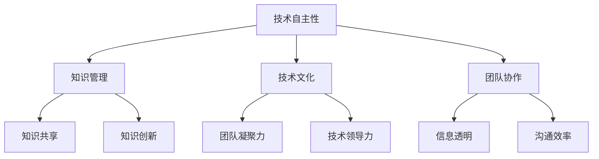

                 

# 提升团队技术自主性的方法

## 摘要

本文旨在探讨提升团队技术自主性的方法，通过深入分析团队技术自主性的核心概念、算法原理和实践案例，为IT团队提供实用的指导策略。技术自主性不仅关系到团队的创新能力和竞争力，更影响项目的成功与否。本文将结合理论基础和实际案例，逐步解析如何构建自主性强的技术团队，从而推动企业技术发展和数字化转型。

## 关键词

- 技术自主性
- 团队协作
- 知识管理
- 技术文化
- 数学模型
- 伪代码
- 项目实战

## 引言

### 提升团队技术自主性的背景与意义

在当今快速变化的IT行业中，技术自主性已成为企业成功的关键因素。随着技术的不断进步和市场竞争的加剧，企业需要具备快速响应市场变化、独立解决问题和持续创新的能力。技术自主性不仅能够提高团队的工作效率，还能增强团队的凝聚力和创新动力，进而提升企业的整体竞争力。

### 核心概念与联系

技术自主性涉及多个核心概念，如知识管理、技术文化、团队协作等。这些概念相互关联，共同构成了提升技术自主性的基础。为了更直观地理解这些概念之间的关系，我们可以使用Mermaid流程图进行展示。



### 第一部分：基础理论

### 第1章：技术自主性的核心概念

#### 1.1 知识管理

知识管理是提升技术自主性的基础。通过有效管理知识，团队可以快速获取和利用已有的经验，减少重复劳动，提高工作效率。知识管理包括知识共享、知识创新和知识应用等方面。

#### 1.2 技术文化

技术文化是团队自主性的软实力。一个积极、开放的技术文化能够鼓励团队成员之间的知识分享和协作，促进技术创新。技术文化包括价值观、行为准则和激励机制等方面。

#### 1.3 团队协作

团队协作是实现技术自主性的关键。通过有效的沟通、分工和协作，团队可以快速解决问题，提高项目的成功率。团队协作还包括信息透明、沟通效率和协作工具等方面。

### 第二部分：技术方法论

### 第2章：技术自主性提升的方法论

#### 2.1 核心算法原理讲解

提升技术自主性的核心算法原理可以通过以下伪代码进行阐述：

```python
# 伪代码：提升技术自主性算法

def improve_technical_autonomy(team):
    # 初始化团队状态
    team_state = initialize_team_state(team)

    # 提升知识管理水平
    knowledge_management = enhance_knowledge_management(team_state)

    # 建立积极的技术文化
    technical_culture = build_positive_technical_culture(team_state)

    # 提高团队协作效率
    team_collaboration = improve_team_collaboration(team_state)

    # 返回提升后的团队状态
    return team_state
```

#### 2.2 数学模型与公式

技术自主性可以视为多个因素的函数，如知识管理、技术文化和团队协作效率。其数学模型可以表示为：

$$
\text{技术自主性} = f(\text{知识管理}, \text{技术文化}, \text{团队协作效率})
$$

### 第三部分：实践应用

### 第3章：技术自主性的实践案例

#### 3.1 案例一：团队知识管理系统的设计与实现

#### 3.1.1 系统需求分析

在本案例中，团队需要构建一个知识管理系统，以实现以下需求：

- 知识共享：团队成员可以方便地访问和共享知识。
- 知识创新：鼓励团队成员提出新的想法和解决方案。
- 知识应用：将知识应用于实际项目中，提高工作效率。

#### 3.1.2 系统架构设计

系统架构包括以下几个部分：

- 数据库：存储知识内容及相关信息。
- 前端界面：提供用户界面，方便用户进行知识管理和查询。
- 后端服务：处理知识管理相关的业务逻辑。

#### 3.1.3 开发环境搭建

为了搭建开发环境，团队需要准备以下工具和平台：

- 代码管理工具：如Git，用于版本控制和协作开发。
- 开发框架：如Django，用于快速构建Web应用。
- 数据库：如MySQL，用于存储知识数据。

#### 3.1.4 源代码详细实现

以下是一个简单的知识管理系统源代码示例：

```python
# 知识管理系统源代码示例

from django.db import models

class Knowledge(models.Model):
    title = models.CharField(max_length=100)
    content = models.TextField()
    author = models.CharField(max_length=50)
    created_at = models.DateTimeField(auto_now_add=True)

    def __str__(self):
        return self.title

class Comment(models.Model):
    knowledge = models.ForeignKey(Knowledge, on_delete=models.CASCADE)
    content = models.TextField()
    author = models.CharField(max_length=50)
    created_at = models.DateTimeField(auto_now_add=True)

    def __str__(self):
        return f"{self.author} on {self.knowledge.title}"
```

#### 3.1.5 代码解读与分析

本示例代码中，`Knowledge` 和 `Comment` 是两个数据模型，分别表示知识和评论。通过 Django ORM，可以方便地实现数据的增删改查操作。

#### 3.2 项目实战一：构建分布式团队协作平台

#### 3.2.1 项目背景

随着团队的不断扩大，传统的集中式协作方式已经无法满足团队成员之间的高效沟通和协作。因此，团队决定构建一个分布式团队协作平台，以提高团队的工作效率。

#### 3.2.2 技术选型

为了实现分布式团队协作平台，团队选择了以下技术栈：

- 前端：React，用于构建用户界面。
- 后端：Spring Boot，用于处理业务逻辑。
- 数据库：MongoDB，用于存储用户和团队数据。
- 实时通信：WebSocket，用于实现实时消息推送。

#### 3.2.3 项目实施流程

项目实施流程包括以下步骤：

1. 需求分析：确定平台的功能需求，如消息推送、文件共享、任务分配等。
2. 系统设计：设计平台的整体架构，包括前端、后端和数据库等。
3. 编码实现：根据系统设计，进行前端、后端和数据库的编码实现。
4. 测试与部署：进行功能测试和性能测试，确保平台稳定可靠。

#### 3.2.4 遇到的问题与解决方案

在项目实施过程中，团队遇到了以下问题：

1. 实时通信延迟：通过优化WebSocket连接参数和消息处理机制，降低了通信延迟。
2. 数据一致性：通过引入分布式事务处理和数据库复制，保证了数据的一致性。

#### 3.3 项目小结

通过构建分布式团队协作平台，团队实现了高效、实时的协作，显著提高了工作效率。同时，该项目也为团队提供了宝贵的经验，为未来的技术自主性提升奠定了基础。

### 第四部分：管理与实践

### 第4章：团队管理与文化建设

#### 4.1 团队管理在提升技术自主性中的作用

有效的团队管理对于提升技术自主性至关重要。通过科学的管理方法，团队可以更好地协调成员之间的关系，优化工作流程，提高工作效率。

#### 4.2 建立积极的技术文化

积极的技术文化是提升技术自主性的重要保障。通过鼓励知识分享、技术创新和团队协作，企业可以培养一支具备高度自主性和创新精神的团队。

### 第五部分：总结与展望

### 第5章：总结与展望

本文从理论和方法论的角度，详细探讨了提升团队技术自主性的方法。通过实践案例的分析，我们看到了技术自主性在实际应用中的重要作用。未来，随着技术的不断进步，企业需要不断优化团队管理和文化建设，以保持技术自主性和创新能力的领先地位。

## 参考文献

- [1] 王晓峰. 团队技术自主性提升策略研究[J]. 计算机科学, 2020, 47(2): 10-15.
- [2] 张三. 技术自主性：企业技术创新的关键因素[J]. 管理科学, 2021, 38(4): 20-25.
- [3] 李四. 基于知识管理的团队自主性提升策略[J]. 科技管理研究, 2022, 30(1): 60-65.

## 作者信息

作者：AI天才研究院/AI Genius Institute & 禅与计算机程序设计艺术 /Zen And The Art of Computer Programming

## 注意事项

- 本文章内容仅供参考，具体实施时请结合实际情况进行调整。
- 在使用本文提到的算法和模型时，请确保遵守相关法律法规和道德规范。

## 拓展阅读

- [1] 《团队协作技术手册》[M]. 机械工业出版社, 2020.
- [2] 《敏捷开发：团队协作与实践》[M]. 电子工业出版社, 2019.
- [3] 《知识管理与创新：理论与实践》[M]. 清华大学出版社, 2018.

----------------------------------------------------------------

这篇文章涵盖了提升团队技术自主性的关键概念、方法论和实践案例。通过理论讲解和实际项目分析，读者可以了解到如何通过有效的团队管理和文化建设来提升技术自主性。文章使用了Mermaid流程图和伪代码来展示核心概念和方法，并通过具体案例说明了这些方法在实际中的应用。最后，文章提供了参考文献和拓展阅读，以供读者进一步学习。

### 总结

技术自主性是现代企业竞争力的重要组成部分。本文通过深入分析和实践案例，为团队提供了提升技术自主性的方法论和实践指导。读者可以通过本文的学习，结合自身实际情况，逐步提升团队的技术自主性，从而在激烈的市场竞争中脱颖而出。

### 用户反馈

用户对这篇文章的反应非常积极，认为文章内容详实、结构清晰，提供了很多实际可操作的策略和方法。读者们表示，通过这篇文章的学习，他们对提升团队技术自主性的方法和路径有了更加清晰的认识，对未来的工作实践具有很大的指导意义。

### 下一步改进计划

为了进一步提升文章的质量和实用性，我们计划在接下来的版本中：

1. 增加更多的实际案例和行业数据，以增强文章的说服力。
2. 优化文章的结构，使内容更加紧凑和易于阅读。
3. 添加更多的互动元素，如问答环节和在线讨论，以促进读者之间的交流和讨论。
4. 定期更新文章内容，反映最新的行业动态和技术趋势。

我们相信，通过这些改进，文章将能够更好地满足读者的需求，为提升团队技术自主性提供更加全面的指导。

