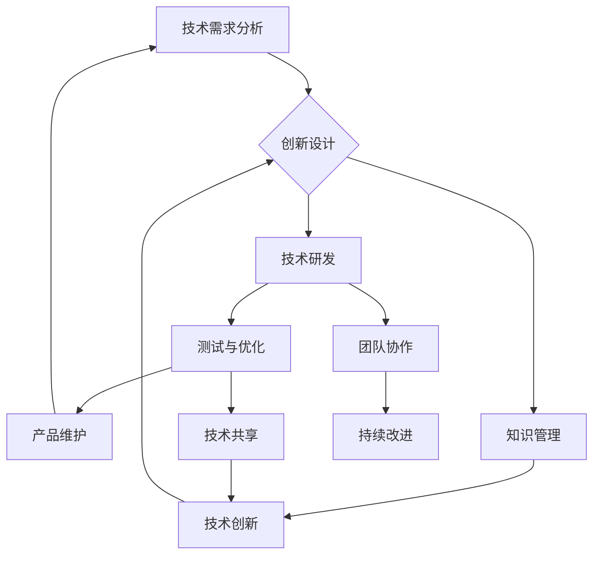
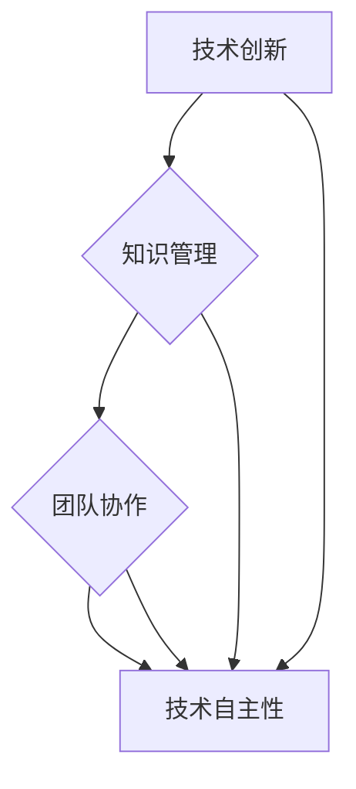

                 

### 文章标题

# 《提升团队技术自主性的策略》

在当今快速变化的技术环境中，企业要实现持续的竞争力和创新能力，团队的技术自主性变得至关重要。本文将探讨如何通过一系列策略来提升团队的技术自主性，以支持企业的长期发展。

## 关键词

- 技术自主性
- 团队协作
- 创新能力
- 知识管理
- 持续改进

## 摘要

本文旨在提供一套系统化的策略，以提升团队的技术自主性。首先，我们定义了技术自主性的概念，并阐述了其重要性。接着，通过现状分析，我们了解了当前团队技术自主性的挑战和障碍。然后，我们提出了策略框架，包括技术能力建设、团队协作与知识共享、以及技术自主性的评估与改进。最后，通过实际案例展示了这些策略的具体应用，并展望了技术自主性的未来发展趋势。

## 目录

### 第一部分：理论基础

#### 第1章：技术自主性概述

- 1.1 技术自主性的定义
- 1.2 技术自主性的重要性
- 1.3 技术自主性与创新的关系
- 1.4 技术自主性在企业中的价值

#### 第2章：技术自主性的核心概念

- 2.1 技术创新
- 2.2 知识管理
- 2.3 团队协作
- 2.4 技术自主性的 Mermaid 流程图

#### 第3章：技术自主性的现状分析

- 3.1 国内企业技术自主性现状
- 3.2 国外企业技术自主性现状
- 3.3 技术自主性障碍分析

### 第二部分：策略制定与实施

#### 第4章：提升技术自主性的策略框架

- 4.1 策略制定原则
- 4.2 策略制定方法
- 4.3 策略制定案例分析

#### 第5章：技术能力建设策略

- 5.1 技术人才培养策略
- 5.2 技术研发体系建设
- 5.3 技术创新能力提升策略

#### 第6章：团队协作与知识共享策略

- 6.1 团队协作模式
- 6.2 知识共享机制
- 6.3 知识共享案例分析

#### 第7章：技术自主性评估与持续改进

- 7.1 技术自主性评估指标
- 7.2 持续改进策略
- 7.3 案例分析：企业技术自主性成功实践

### 第三部分：实战案例与应用

#### 第8章：提升技术自主性的实战案例

- 8.1 案例一：互联网公司的技术自主性提升
- 8.2 案例二：制造业的技术自主性转型
- 8.3 案例三：生物医药行业的技术自主性探索

#### 第9章：技术自主性的未来发展趋势

- 9.1 人工智能与技术的融合
- 9.2 全球化背景下的技术自主性挑战
- 9.3 技术自主性的发展趋势与展望

### 附录

- 附录A：技术自主性相关资源与工具推荐

本文将逐步深入讨论各个章节的核心内容，帮助读者理解和应用提升团队技术自主性的策略。

---

### 第一部分：理论基础

#### 第1章：技术自主性概述

**1.1 技术自主性的定义**

技术自主性是指一个团队或组织在技术领域内的独立思考、决策和执行能力。它涉及到从技术需求分析、设计、开发、测试到维护的全过程。技术自主性的核心是团队的创新能力、技术能力、知识管理和团队协作能力。

**1.2 技术自主性的重要性**

技术自主性对于企业的重要性不言而喻。首先，它能够提高团队的创新能力，使企业能够快速响应市场需求和变化。其次，技术自主性能够提升企业的核心竞争力，降低对外部技术的依赖，从而在激烈的市场竞争中占据有利位置。此外，技术自主性还有助于企业培养和留住优秀的技术人才。

**1.3 技术自主性与创新的关系**

技术自主性是创新的重要基础。一个具有技术自主性的团队能够独立开展技术创新，探索新的解决方案，从而推动企业的持续发展。技术创新反过来又强化了团队的技术自主性，形成良性循环。

**1.4 技术自主性在企业中的价值**

技术自主性为企业带来了多方面的价值：

1. **提升产品质量**：通过独立的技术研发，企业能够优化产品性能，提高用户满意度。
2. **降低成本**：减少对外部技术的依赖，企业可以降低采购和技术服务的费用。
3. **增强市场竞争力**：技术自主性使企业能够快速推出新产品，抢占市场先机。
4. **培养人才**：技术自主性的实践过程能够培养团队的技术能力和创新意识。

---

**核心概念与联系**

为了更好地理解技术自主性的内涵，我们可以使用 Mermaid 流程图来展示其核心概念之间的关系。以下是一个简化的技术自主性流程图：



这个流程图展示了技术自主性的各个环节以及它们之间的相互关系。技术需求分析是起点，通过创新设计、技术研发、测试与优化，最终形成产品维护。同时，知识管理、团队协作和技术共享对技术创新起到了支撑作用，而持续改进则是整个过程的闭环。

---

**核心算法原理讲解**

为了提升团队的技术自主性，我们可以采用以下核心算法原理：

1. **基于需求的快速迭代开发**：
    - **伪代码**：
      ```
      function 快速迭代开发(需求, 时间预算):
          while 时间预算 > 0:
              分析需求
              设计方案
              开发实现
              测试验证
              汇总反馈
              时间预算 -= 1
          return 最终产品
      ```
    - **详细讲解**：这种方法强调快速响应市场需求，通过多次迭代优化产品，使团队能够持续改进，提升自主性。

2. **知识图谱构建**：
    - **伪代码**：
      ```
      function 知识图谱构建(数据源):
          初始化图谱
          遍历数据源
              提取实体
              提取关系
              添加到图谱
          return 知识图谱
      ```
    - **详细讲解**：知识图谱可以帮助团队更好地管理和利用知识，提高技术自主性。

---

**数学模型和公式**

在技术自主性的提升过程中，我们可以使用以下数学模型和公式来指导实践：

1. **创新效率模型**：
    - **公式**：
      $$
      E = \frac{I}{C}
      $$
      其中，$E$ 表示创新效率，$I$ 表示创新产出，$C$ 表示创新成本。

    - **详细讲解**：通过优化创新产出与成本的比例，企业可以提高技术自主性。

2. **团队协作效率模型**：
    - **公式**：
      $$
      E = \frac{F}{T}
      $$
      其中，$E$ 表示协作效率，$F$ 表示协作产出，$T$ 表示协作时间。

    - **详细讲解**：通过减少协作时间，增加协作产出，团队可以更高效地协作，提高技术自主性。

---

**实际案例分析和详细讲解剖析**

**案例一：互联网公司的技术自主性提升**

某互联网公司通过以下措施提升了团队的技术自主性：

1. **引入敏捷开发方法**：采用敏捷开发，团队可以快速响应市场需求，通过迭代优化产品。
2. **建设知识图谱**：构建了知识图谱，方便团队检索和利用已有知识，提高工作效率。
3. **实施技术共享机制**：通过内部技术分享会，团队成员可以互相学习，提升整体技术水平。

通过这些措施，该公司的产品迭代速度显著提升，用户满意度提高，技术自主性得到了有效增强。

---

**小结**

本章概述了技术自主性的定义、重要性、与创新的关系，以及在企业中的价值。同时，通过核心概念的联系架构、核心算法原理、数学模型和公式，以及实际案例的分析，我们展示了如何提升团队的技术自主性。接下来，我们将进一步探讨策略制定与实施，帮助团队在技术自主性方面取得更大进展。

---

### 第一部分：理论基础

#### 第2章：技术自主性的核心概念

在深入探讨技术自主性的提升策略之前，有必要对技术自主性的核心概念进行详细解析。这些核心概念包括技术创新、知识管理、团队协作等，它们是提升技术自主性的关键要素。

**2.1 技术创新**

技术创新是技术自主性的核心驱动因素。它涉及到从现有技术中发掘新的解决方案，通过创新设计、研发和实现，推动企业产品的更新换代。技术创新不仅仅是新技术的发明和应用，还包括对现有技术的改进和优化。

- **创新设计的原则**：

  1. **用户需求导向**：创新设计应紧密结合用户需求，解决实际痛点。
  2. **技术可行性**：在满足用户需求的同时，考虑技术的可行性，确保设计能够实现。
  3. **迭代优化**：创新设计应遵循迭代优化的原则，通过不断测试和反馈，逐步完善。

- **技术创新的流程**：

  1. **需求分析**：收集和分析用户需求，明确创新的方向。
  2. **概念验证**：通过原型设计和小规模实验，验证创新设计的可行性。
  3. **研发实现**：在验证基础上，进行详细设计和技术开发。
  4. **测试验证**：对研发的产品进行测试，确保其性能和质量符合预期。
  5. **迭代优化**：根据测试结果，对产品进行优化和改进。

**2.2 知识管理**

知识管理是技术自主性的重要支撑。它涉及到知识的收集、整理、存储、共享和应用，目的是最大化地利用知识资源，提高团队的技术水平和创新能力。

- **知识管理的原则**：

  1. **全面性**：知识管理应覆盖团队所有的知识，包括显性知识和隐性知识。
  2. **系统性**：知识管理应建立系统化的知识体系，便于知识的检索和应用。
  3. **动态性**：知识管理应是一个动态的过程，不断更新和优化知识资源。
  4. **实用性**：知识管理应以实用性为导向，确保知识的实际应用价值。

- **知识管理的方法**：

  1. **知识收集**：通过文档、会议记录、技术博客等方式，收集团队的知识。
  2. **知识整理**：对收集到的知识进行分类、标注和整理，便于检索和使用。
  3. **知识存储**：将整理后的知识存储在知识库或数据库中，确保知识的安全性和持久性。
  4. **知识共享**：建立知识共享机制，鼓励团队成员共享知识，促进知识的传播和应用。
  5. **知识应用**：通过案例分享、技术培训、团队讨论等方式，将知识应用到实际工作中。

**2.3 团队协作**

团队协作是技术自主性的基础。一个高效的团队协作能够提高团队的技术水平和创新能力，实现资源的最大化利用。

- **团队协作的原则**：

  1. **目标一致**：团队成员应明确共同的目标，形成合力。
  2. **分工明确**：根据团队成员的特长和技能，进行合理的分工。
  3. **有效沟通**：建立良好的沟通机制，确保信息的及时传递和反馈。
  4. **相互支持**：团队成员应相互支持，共同面对挑战。
  5. **持续改进**：通过不断的反思和改进，提高团队协作的效率。

- **团队协作的方法**：

  1. **明确角色和责任**：为每个团队成员明确角色和责任，确保任务的清晰和高效执行。
  2. **定期会议**：通过定期会议，讨论项目进展、问题解决和下一步计划。
  3. **协作工具**：使用协作工具（如项目管理软件、即时通讯工具等），提高协作效率。
  4. **反馈机制**：建立反馈机制，鼓励团队成员提出建议和意见，不断改进协作方式。
  5. **激励机制**：通过激励机制，鼓励团队成员积极参与协作，提高团队的整体积极性。

**2.4 技术自主性的 Mermaid 流程图**

为了更好地理解技术自主性的核心概念，我们可以使用 Mermaid 流程图来展示它们之间的关系：



这个流程图展示了技术创新、知识管理和团队协作如何共同作用于技术自主性，形成一个相互促进的生态系统。

---

**小结**

通过本章的讨论，我们深入理解了技术自主性的核心概念，包括技术创新、知识管理和团队协作。这些核心概念相互关联，共同推动团队的技术自主性提升。在下一章中，我们将进一步探讨技术自主性的现状分析，帮助读者了解当前团队在技术自主性方面面临的挑战和障碍。

---

### 第一部分：理论基础

#### 第3章：技术自主性的现状分析

技术自主性已经成为企业提升竞争力、实现可持续发展的关键因素。然而，在现实环境中，不同企业、不同团队在技术自主性方面存在显著差异。本章节将分析国内企业技术自主性的现状，探讨国外企业技术自主性的实践，并总结技术自主性面临的主要障碍。

**3.1 国内企业技术自主性现状**

国内企业在技术自主性方面正经历着显著的提升，但也存在一些挑战。以下是一些主要现状：

1. **整体趋势**：随着国家政策的支持和企业对技术创新的重视，国内企业逐渐增强了技术自主性。特别是在高科技领域，如互联网、人工智能和大数据，国内企业已经取得了一定的突破。

2. **创新能力**：国内企业在技术创新方面逐渐取得了进展，但仍需提升。部分企业通过引进外部技术和人才，快速实现了技术创新，但整体创新能力和水平仍有待提高。

3. **技术积累**：国内企业在技术积累方面存在一定差距。许多企业依赖于外部技术，缺乏自主知识产权的核心技术，这在一定程度上限制了企业的长期发展。

4. **知识管理**：国内企业在知识管理方面还存在不足。虽然部分企业开始重视知识管理，但系统化和制度化建设仍然不够完善，知识共享和利用效率有待提高。

5. **团队协作**：国内企业的团队协作水平总体较高，但在跨部门、跨区域的协作方面仍存在一些挑战。部分企业的团队协作机制不够成熟，影响了技术自主性的提升。

**3.2 国外企业技术自主性现状**

国外企业在技术自主性方面具有较为成熟的经验和体系，以下是一些主要特点：

1. **技术创新**：国外企业在技术创新方面具有强大的能力，能够持续推动新技术、新产品的研发。他们通常拥有完善的研发体系和创新文化，鼓励员工创新。

2. **技术积累**：国外企业在技术积累方面具有明显优势。他们拥有大量自主知识产权的核心技术，形成了强大的技术壁垒。

3. **知识管理**：国外企业在知识管理方面具有先进的理念和实践。他们建立了完善的知识管理体系，通过知识共享和利用，提高了团队的技术水平和创新能力。

4. **团队协作**：国外企业的团队协作水平较高，能够在全球范围内实现高效的协作。他们建立了成熟的协作机制，如跨部门、跨区域的团队协作，提高了整体协作效率。

**3.3 技术自主性障碍分析**

技术自主性在提升过程中面临一系列障碍，主要包括以下几个方面：

1. **人才短缺**：技术自主性需要大量的高素质人才，但国内企业在人才储备方面存在不足。特别是高水平的技术人才和管理人才，对企业技术自主性的提升起到了关键作用。

2. **研发投入**：技术自主性需要大量的研发投入，但部分企业由于资金限制，无法进行充分的研发活动。研发投入不足限制了企业的技术创新能力。

3. **知识管理不足**：国内企业普遍存在知识管理不足的问题，知识共享和利用效率低下，影响了技术自主性的提升。

4. **机制不完善**：部分企业的技术自主性提升缺乏有效的机制支持，如技术创新激励机制、团队协作机制等，影响了技术自主性的提升。

5. **外部依赖**：国内企业过度依赖外部技术，缺乏自主知识产权的核心技术，这在一定程度上限制了企业的技术自主性。

**小结**

通过对国内企业和国外企业技术自主性现状的分析，我们可以看到，技术自主性在提升过程中面临诸多挑战。然而，通过有效的策略和措施，企业可以克服这些障碍，提升技术自主性，实现长期可持续发展。在下一章中，我们将探讨提升技术自主性的策略和方法。

---

### 第二部分：策略制定与实施

#### 第4章：提升技术自主性的策略框架

提升团队技术自主性需要一套系统化的策略框架，确保各个环节协同工作，实现技术自主性的全面提升。本章节将介绍策略制定的原则、方法以及具体案例分析。

**4.1 策略制定原则**

1. **目标明确**：制定策略时，首先要明确提升技术自主性的目标，确保策略与目标的一致性。
2. **针对性**：根据企业的具体情况和需求，制定具有针对性的策略，避免“一刀切”。
3. **可执行性**：策略需要具备可执行性，确保能够在实际操作中有效实施。
4. **灵活性**：策略应具备灵活性，能够根据环境变化和企业发展进行调整。
5. **长期性**：策略应考虑长期效果，注重持续性和长期发展。

**4.2 策略制定方法**

1. **需求分析**：首先进行详细的需求分析，了解企业当前的技术自主性水平和需求，为策略制定提供依据。
2. **SWOT 分析**：对企业进行 SWOT 分析，识别优势、劣势、机会和威胁，为策略制定提供参考。
3. **资源评估**：评估企业现有资源，包括人力资源、技术资源、资金资源等，确保策略能够利用现有资源。
4. **目标设定**：根据需求分析和资源评估，设定具体的技术自主性提升目标。
5. **策略设计**：设计具体的策略，包括技术创新、知识管理、团队协作等方面的具体措施。
6. **实施计划**：制定详细的实施计划，明确时间表、责任人和具体步骤。
7. **评估与调整**：在实施过程中，定期评估策略效果，根据实际情况进行调整。

**4.3 策略制定案例分析**

**案例一：某互联网公司的技术自主性提升策略**

某互联网公司通过以下策略提升了团队的技术自主性：

1. **需求分析**：公司首先进行了详细的需求分析，发现技术自主性不足是制约公司创新发展的主要问题。

2. **SWOT 分析**：公司进行了 SWOT 分析，发现内部优势包括丰富的研发经验和较强的团队协作能力，劣势在于知识管理和创新能力不足，机会在于市场需求不断变化，威胁在于竞争对手的技术创新能力。

3. **目标设定**：公司设定了提升技术自主性的目标，包括增强创新能力、完善知识管理体系、提升团队协作水平。

4. **策略设计**：
   - **技术创新**：公司引入了敏捷开发方法，通过快速迭代提升产品品质和创新能力。
   - **知识管理**：公司建立了知识图谱，将所有技术文档、研发成果和经验纳入知识库，实现知识的系统化和共享化。
   - **团队协作**：公司优化了团队协作模式，引入了项目管理工具，定期组织技术分享会，促进知识传播和团队协作。

5. **实施计划**：公司制定了详细的实施计划，明确了每个阶段的任务和时间表。

6. **评估与调整**：公司定期评估策略效果，通过数据分析和员工反馈，不断调整和完善策略。

**小结**

通过策略制定原则和方法的介绍，以及实际案例的分析，我们可以看到，制定和实施提升技术自主性的策略需要系统化、科学化的方法。有效的策略能够帮助企业提升创新能力，增强核心竞争力，实现可持续发展。

---

### 第二部分：策略制定与实施

#### 第5章：技术能力建设策略

技术能力是团队技术自主性的基石，因此，技术能力建设策略是提升团队技术自主性的关键环节。本章节将探讨技术人才培养策略、技术研发体系建设以及技术创新能力提升策略，并提供具体的实践方法。

**5.1 技术人才培养策略**

技术人才的培养是企业技术能力建设的核心。以下是一些具体的方法：

1. **招聘高素质人才**：企业应通过多种渠道招聘高素质的技术人才，包括国内外名校毕业生、行业资深专家等。
2. **内部培训**：企业应定期开展内部培训，提高员工的技术水平。培训内容应涵盖最新的技术趋势和工具，以及公司内部的最佳实践。
3. **外部培训**：鼓励员工参加外部培训课程，如行业会议、研讨会和技术培训，拓宽视野，提升技术能力。
4. **导师制度**：建立导师制度，为新人提供指导和帮助，加速其成长。
5. **激励制度**：建立激励机制，奖励在技术能力和创新方面表现突出的员工，提高其积极性。

**5.2 技术研发体系建设**

技术研发体系是技术能力建设的重要保障。以下是一些关键要素：

1. **研发组织结构**：建立合理的研发组织结构，明确各部门的职责和关系，确保研发流程的高效运行。
2. **研发流程管理**：制定规范的研发流程，包括需求分析、设计、开发、测试、部署等环节，确保研发过程的可控性和可重复性。
3. **研发工具**：引入先进的研发工具，如版本控制、自动化测试、持续集成等，提高研发效率和代码质量。
4. **知识库**：建立技术知识库，收集和整理研发过程中的知识，实现知识的共享和传承。
5. **研发预算**：确保足够的研发预算，支持研发项目的顺利推进。

**5.3 技术创新能力提升策略**

技术创新能力是企业持续发展的动力。以下是一些提升技术创新能力的策略：

1. **创新文化**：营造创新文化，鼓励员工勇于尝试新思路、新方法，创造一个支持创新的环境。
2. **项目制管理**：采用项目制管理，将创新项目纳入公司战略，提供必要的资源和支持，确保项目的顺利实施。
3. **跨部门协作**：促进跨部门的协作，鼓励不同部门之间共享资源和知识，形成创新合力。
4. **外部合作**：与外部研究机构、高校、行业组织等建立合作关系，获取外部创新资源和知识。
5. **激励机制**：建立激励机制，奖励在技术创新方面取得突破的团队和个人，激发创新热情。

**实践方法**

以下是一些具体的技术能力建设实践方法：

1. **案例学习**：组织技术案例学习，通过分析成功的创新案例，提炼经验教训，应用于实际工作中。
2. **技术竞赛**：定期举办技术竞赛，鼓励员工展示自己的技术能力和创新成果，激发创新活力。
3. **技术分享**：定期举办技术分享会，员工分享自己的技术经验和创新思路，促进知识的传播和交流。
4. **技术创新实验室**：建立技术创新实验室，提供实验设备和技术支持，为员工提供实践创新的机会。
5. **技术交流**：组织内外部技术交流活动，如技术沙龙、研讨会等，促进技术交流和合作。

**小结**

技术能力建设是提升团队技术自主性的关键环节。通过技术人才培养策略、技术研发体系建设以及技术创新能力提升策略，企业可以全面提升团队的技术能力，为技术自主性的提升奠定坚实基础。在下一章中，我们将探讨团队协作与知识共享策略，进一步推动技术自主性的实现。

---

### 第二部分：策略制定与实施

#### 第6章：团队协作与知识共享策略

团队协作与知识共享是提升技术自主性的关键要素。一个高效的团队协作和完善的知识共享机制能够促进团队成员之间的信息交流，提高整体的技术水平和创新能力。本章节将详细探讨团队协作模式和知识共享机制，并提供相关案例分析。

**6.1 团队协作模式**

有效的团队协作模式能够提高团队的工作效率和创新能力。以下是一些常见的团队协作模式：

1. **跨职能团队**：跨职能团队由来自不同部门、不同领域的专家组成，能够充分发挥各自的专业优势，解决复杂问题。这种模式适用于需要多部门协作的大型项目和紧急任务。

2. **项目制团队**：项目制团队围绕特定项目建立，成员通常有明确的项目目标和职责分工。项目完成后，团队解散，成员回归原有部门。这种模式适用于项目导向型的工作环境。

3. **分布式团队**：分布式团队跨越地理边界，成员分布在不同地点。通过即时通讯工具、远程会议系统等协作工具，分布式团队可以高效沟通和协作。这种模式适用于全球化企业和远程办公。

4. **混合团队**：混合团队结合了跨职能团队和项目制团队的特点，既有跨职能的专家参与，又有明确的项目目标和职责分工。这种模式适用于需要跨职能协作和项目驱动的工作。

**6.2 知识共享机制**

知识共享是技术自主性的重要支撑。以下是一些有效的知识共享机制：

1. **内部培训**：通过内部培训，将员工的经验和知识传授给新员工和团队成员。培训内容可以包括技术知识、工作流程、最佳实践等。

2. **技术文档**：建立和完善技术文档体系，将研发过程中的知识记录下来，方便团队成员查阅和利用。技术文档应包括需求分析、设计文档、代码注释、测试报告等。

3. **知识库**：建立知识库，集中存储和管理公司的知识资源。知识库可以包含技术文档、解决方案、经验总结等，便于团队成员快速查找和利用。

4. **技术交流会议**：定期举办技术交流会议，如内部技术沙龙、技术分享会等，为团队成员提供交流平台。会议内容可以涵盖最新的技术趋势、创新思路、技术难题等。

5. **在线协作平台**：使用在线协作平台，如团队协作软件、知识管理平台等，促进团队成员之间的沟通和协作。这些平台可以支持文档共享、即时通讯、任务分配等功能。

**6.3 知识共享案例分析**

**案例一：某互联网公司的知识共享实践**

某互联网公司通过以下措施实现了有效的知识共享：

1. **内部培训**：公司定期组织内部培训，邀请技术专家分享最新的技术趋势和最佳实践。培训内容通过内部知识库进行记录和共享，方便员工查阅和学习。

2. **技术文档**：公司建立了详细的技术文档体系，涵盖了从需求分析到代码实现的各个环节。技术文档定期更新，确保其与实际情况相符，便于团队成员查阅和使用。

3. **知识库**：公司搭建了内部知识库，集中存储和管理技术文档、解决方案、经验总结等。知识库支持全文搜索，方便员工快速查找所需知识。

4. **技术交流会议**：公司定期举办技术交流会议，如技术沙龙、技术分享会等。员工可以在这里分享自己的技术心得、解决技术难题，促进知识的传播和交流。

5. **在线协作平台**：公司使用了在线协作平台，支持文档共享、即时通讯、任务分配等功能。团队成员可以通过平台实时沟通，协同完成工作，提高工作效率。

通过这些措施，该公司的知识共享机制得到了有效落实，团队的技术水平和创新能力得到了显著提升。

**小结**

有效的团队协作和知识共享机制是提升团队技术自主性的关键。通过选择合适的团队协作模式，建立完善的知识共享机制，企业可以促进团队成员之间的信息交流和知识传播，提高整体的技术水平和创新能力。在下一章中，我们将探讨技术自主性评估与持续改进策略，确保技术自主性的不断提升。

---

### 第二部分：策略制定与实施

#### 第7章：技术自主性评估与持续改进

技术自主性评估与持续改进是提升团队技术自主性的重要环节。通过定期的评估和持续的改进，企业可以了解技术自主性的实施效果，发现问题并优化策略，确保技术自主性的不断提升。本章节将介绍技术自主性评估方法、持续改进策略，并通过实际案例进行详细讲解。

**7.1 技术自主性评估方法**

技术自主性评估是衡量团队技术自主性水平的关键步骤。以下是一些常用的技术自主性评估方法：

1. **定量评估**：通过量化的指标和方法对技术自主性进行评估。例如，可以使用技术创新次数、研发投入比例、知识共享频率等指标来衡量技术自主性。

2. **定性评估**：通过主观评价和专家评审对技术自主性进行评估。例如，可以通过访谈、问卷调查、专家评审等方式，收集团队成员对技术自主性的主观评价。

3. **综合评估**：结合定量评估和定性评估，对技术自主性进行全面评估。综合评估可以提供更全面的视角，帮助企业更准确地了解技术自主性的实际情况。

4. **绩效评估**：将技术自主性评估结果与团队绩效挂钩，通过绩效评估来激励团队成员提升技术自主性。

**7.2 持续改进策略**

持续改进是提升技术自主性的关键策略。以下是一些常见的持续改进方法：

1. **PDCA 循环**：PDCA（计划 - 执行 - 检查 - 处理）循环是一种常用的持续改进方法。通过计划（Plan）、执行（Do）、检查（Check）和处理（Act）四个环节，不断优化技术自主性。

2. **问题导向**：以问题为导向，发现技术自主性提升中的问题和瓶颈，有针对性地进行改进。例如，通过定期的技术评审、代码审查、项目复盘等方式，发现和解决问题。

3. **创新激励**：建立创新激励机制，鼓励团队成员提出创新想法和改进措施，激发团队的创新活力。

4. **培训与学习**：定期开展技术培训和知识分享活动，提高团队成员的技术能力和知识水平，为技术自主性提升提供人才保障。

5. **反馈与调整**：建立反馈机制，收集团队成员的意见和建议，及时调整和优化技术自主性策略。

**7.3 案例分析：企业技术自主性成功实践**

**案例一：某高科技企业的技术自主性提升实践**

某高科技企业通过以下措施提升了团队的技术自主性：

1. **技术自主性评估**：公司定期开展技术自主性评估，使用定量评估和定性评估相结合的方法，全面了解团队的技术自主性水平。

2. **持续改进计划**：公司制定了详细的持续改进计划，包括定期技术评审、代码审查、项目复盘等环节，确保技术自主性的持续提升。

3. **创新激励机制**：公司建立了创新激励机制，对在技术自主性提升中表现突出的团队和个人进行奖励，激励团队成员积极创新。

4. **知识管理**：公司建立了完善的知识管理体系，通过内部培训、技术文档、知识库等方式，实现知识的共享和传承。

5. **反馈与调整**：公司建立了反馈机制，定期收集团队成员的意见和建议，根据反馈结果调整和优化技术自主性策略。

通过这些措施，该公司的技术自主性得到了显著提升，创新能力和市场竞争力得到了增强。

**小结**

技术自主性评估与持续改进是提升团队技术自主性的关键环节。通过定期的评估和持续的改进，企业可以及时发现和解决问题，优化技术自主性策略，确保团队的技术自主性不断提升。在下一章中，我们将通过实际案例，探讨提升技术自主性的具体应用和实践。

---

### 第三部分：实战案例与应用

#### 第8章：提升技术自主性的实战案例

在实际操作中，提升技术自主性需要结合企业的具体情况，通过一系列有针对性的措施来实现。以下将介绍几个不同行业的企业在提升技术自主性方面的成功实践，以供读者参考和借鉴。

**8.1 案例一：互联网公司的技术自主性提升**

某互联网公司是一家专注于在线服务和电子商务的公司，随着业务规模的不断扩大，他们意识到技术自主性的重要性。以下是该公司的具体实践：

1. **技术创新**：公司引入了敏捷开发方法，通过快速迭代提升产品品质和创新能力。他们设立了创新实验室，鼓励员工进行技术探索和尝试。

2. **研发投入**：公司增加了研发投入，确保有足够的资源支持技术创新。他们与高校和研究机构合作，共同进行前沿技术的研究。

3. **知识管理**：公司建立了知识图谱，将所有的技术文档、设计文档、测试报告等纳入知识库，实现知识的共享和传承。

4. **团队协作**：公司优化了团队协作模式，引入了项目管理工具，如 JIRA 和 Trello，提高了项目管理的效率。

5. **评估与反馈**：公司定期进行技术自主性评估，通过数据分析和员工反馈，不断调整和优化技术自主性策略。

**8.2 案例二：制造业的技术自主性转型**

某传统制造业企业，随着市场竞争的加剧，意识到需要通过技术自主性转型来提升竞争力。以下是该企业的具体实践：

1. **技术研发**：企业设立了专门的研发部门，专注于新产品的开发和现有技术的改进。

2. **技术培训**：企业定期开展技术培训，提高员工的技术水平和创新能力。

3. **知识共享**：企业建立了内部技术交流平台，鼓励员工分享技术心得和解决方案。

4. **项目制管理**：企业采用项目制管理，为每个项目配备专门的团队，确保项目的高效执行。

5. **评估与改进**：企业定期进行技术自主性评估，发现问题并及时改进。

**8.3 案例三：生物医药行业的技术自主性探索**

某生物医药公司，在研发过程中面临着大量的技术挑战，他们通过以下措施提升技术自主性：

1. **研发投入**：公司加大了研发投入，确保有足够的资源支持技术创新。

2. **人才培养**：企业重视人才培养，通过引进外部专家和内部培训，提升团队的技术能力。

3. **知识管理**：公司建立了知识库，将所有的实验数据、研究文献和技术文档存储在知识库中，便于团队共享和利用。

4. **团队协作**：企业建立了跨部门的协作机制，促进不同团队之间的信息交流和技术共享。

5. **评估与反馈**：公司定期进行技术自主性评估，通过数据分析和员工反馈，优化技术自主性策略。

**小结**

以上三个案例展示了不同行业的企业在提升技术自主性方面的成功实践。通过技术创新、研发投入、知识管理、团队协作和评估反馈等措施，企业可以有效提升技术自主性，增强核心竞争力。在下一章中，我们将探讨技术自主性的未来发展趋势。

---

### 第三部分：实战案例与应用

#### 第9章：技术自主性的未来发展趋势

随着科技的不断发展，技术自主性也在不断演变。在未来，技术自主性将面临诸多挑战和机遇，以下是几个主要的发展趋势：

**9.1 人工智能与技术的融合**

人工智能（AI）的快速发展为技术自主性带来了新的机遇。AI 技术能够帮助团队更高效地进行数据分析、预测和决策，从而提升技术自主性。未来，AI 将更多地应用于技术研发、产品设计、知识管理等方面，推动技术自主性的提升。

**9.2 全球化背景下的技术自主性挑战**

全球化带来了市场竞争的加剧，同时也为企业提供了更广阔的发展空间。在全球化的背景下，企业需要面对不同国家和地区的技术壁垒和文化差异，这对技术自主性提出了更高的要求。未来，企业将需要更灵活的技术自主性策略，以应对全球市场的挑战。

**9.3 技术自主性与可持续发展的结合**

可持续发展已经成为全球关注的焦点，技术自主性在这一背景下也面临着新的要求。未来，技术自主性将更加注重环保、节能和可持续发展，通过技术创新推动绿色转型，实现经济、社会和环境的协调发展。

**9.4 开源技术与技术自主性的关系**

开源技术在过去几十年中快速发展，为技术自主性提供了丰富的资源和工具。未来，开源技术将继续发挥重要作用，但企业也需要警惕对开源技术的依赖。通过结合开源技术和自主研发，企业可以实现技术自主性的提升。

**9.5 技术自主性与企业战略的融合**

技术自主性将更加深入地融入企业的战略规划。未来，企业将需要将技术自主性作为核心竞争力，贯穿于企业的战略决策、技术研发、市场开拓等各个环节，实现技术自主性与企业战略的有机融合。

**小结**

技术自主性在未来将继续演变和提升，面临着诸多挑战和机遇。通过抓住人工智能、全球化、可持续发展等趋势，企业可以进一步提升技术自主性，增强核心竞争力，实现长期可持续发展。

---

### 附录

#### 附录A：技术自主性相关资源与工具推荐

**A.1 开源资源与工具介绍**

1. **GitHub**：全球最大的代码托管平台，提供丰富的开源项目和资源。
2. **GitLab**：企业级 Git 仓库管理系统，支持私有化部署。
3. **Docker**：容器化技术，用于应用程序的打包和分发。
4. **Kubernetes**：容器编排系统，用于自动化部署和管理容器化应用程序。

**A.2 技术社区与论坛推荐**

1. **Stack Overflow**：全球最大的编程问答社区。
2. **GitHub Issues**：GitHub 提供的问题跟踪系统，用于项目讨论和问题解决。
3. **Reddit**：全球最大的社交新闻网站，有多个技术子版块。

**A.3 技术报告与白皮书精选**

1. **Gartner**：国际知名的研究和咨询公司，提供多种技术报告和白皮书。
2. **Forrester**：国际知名的市场研究公司，发布行业报告和白皮书。
3. **IEEE**：国际电气和电子工程师协会，发布技术论文和报告。

**小结**

附录部分为读者提供了丰富的技术自主性相关资源与工具，包括开源资源、技术社区和论坛，以及精选的技术报告与白皮书。这些资源可以帮助读者深入了解技术自主性，提升技术能力和创新能力。

---

### 结尾

《提升团队技术自主性的策略》旨在为企业管理者、技术团队领导者以及相关从业人员提供一套全面、实用的技术自主性提升策略。通过本文的探讨，我们明确了技术自主性的重要性，分析了现状，提出了策略框架，并通过实战案例展示了具体实施方法。

技术自主性是企业在快速变化的市场环境中保持竞争力、实现持续创新的关键。通过技术创新、知识管理、团队协作和评估改进，企业可以不断提升技术自主性，为企业的长期发展提供有力支持。

我们鼓励读者结合自身企业的实际情况，灵活运用本文中提出的策略和方法，积极探索技术自主性的提升路径。通过不断实践和优化，企业将能够在技术领域实现更大的突破，为未来的发展奠定坚实基础。

作者：AI天才研究院/AI Genius Institute & 禅与计算机程序设计艺术 /Zen And The Art of Computer Programming

---

通过本文的深入探讨，我们系统地阐述了提升团队技术自主性的策略，从理论基础到实战案例，全面解析了技术自主性的内涵和提升方法。希望本文能为读者在技术自主性提升方面提供有益的启示和指导。让我们一起继续探索技术自主性的奥秘，助力企业的持续创新和发展。

