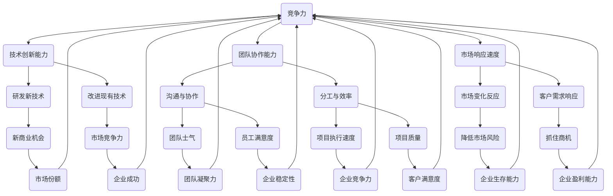

                 


### 第一步：引言与概述

在当今高度竞争的市场环境中，技术团队的市场竞争力已成为企业成功的关键因素。技术团队不仅为企业提供了技术创新和业务拓展的能力，也在很大程度上决定了企业在市场中的地位和未来的发展潜力。因此，如何提升技术团队的市场竞争力，成为企业管理者和技术团队领导者亟待解决的重要课题。

本文旨在探讨提升技术团队市场竞争力的方法，从多个角度进行分析和论述。文章首先介绍了技术团队市场竞争力的背景和重要性，然后详细讲解了核心概念、算法原理、数学模型、项目实战等关键内容，最后进行了总结和展望。通过本文的阅读，读者将能够系统地了解提升技术团队市场竞争力所需的理论和实践方法。

技术团队竞争力，简单来说，就是企业在技术领域所具备的竞争优势，包括技术创新能力、团队协作能力、市场响应速度等多个方面。在当今技术快速变革的时代，技术团队竞争力不仅是企业获取市场份额的关键，更是企业在全球范围内保持竞争力的核心要素。因此，提升技术团队的市场竞争力，对于企业的长远发展具有重要意义。

本文将采用逻辑清晰、结构紧凑、简单易懂的写作风格，结合实际案例和数据分析，逐步引导读者深入理解技术团队市场竞争力的提升方法。希望通过本文的阐述，能够为广大技术团队领导者、企业管理者以及相关从业人员提供有价值的参考和启示。

### 第二步：核心概念与联系

提升技术团队的市场竞争力，首先需要明确相关核心概念及其相互关系。以下将详细探讨几个关键概念，并展示它们之间的联系。

#### 1. 竞争力

竞争力，是指在特定市场中，企业或团队相对于竞争对手所具有的优势。在技术团队的市场竞争力中，竞争力可以表现为技术创新能力、团队协作能力、市场响应速度等多个方面。

#### 2. 技术创新能力

技术创新能力是技术团队竞争力的核心之一。它包括研发新技术、新产品、新服务的能力，以及持续改进现有技术和产品。一个具备高技术创新能力的技术团队，能够在市场中迅速占领有利地位，为企业创造更多的商业机会。

#### 3. 团队协作能力

团队协作能力是技术团队成功的重要保障。一个高效的团队，能够通过有效的沟通、协作和分工，实现技术和业务的快速发展。团队协作能力不仅影响项目执行的速度和质量，还影响团队的整体士气和员工满意度。

#### 4. 市场响应速度

市场响应速度是指技术团队对市场变化和客户需求的快速反应能力。在竞争激烈的市场环境中，快速响应市场变化和客户需求，能够帮助企业抓住商机，降低市场风险。

#### 关系架构

为了更直观地展示这些核心概念之间的关系，我们可以使用Mermaid流程图来描述：



通过上述Mermaid流程图，我们可以清晰地看到各个核心概念之间的关联。技术创新能力、团队协作能力和市场响应速度是提升竞争力的关键因素，它们相互影响、相互作用，共同决定了技术团队在市场中的竞争力。而竞争力又直接关联到企业的成功、稳定性和盈利能力，从而影响到企业的长远发展。

### 第三步：核心算法原理讲解

在提升技术团队市场竞争力过程中，核心算法原理的理解和应用至关重要。本部分将详细介绍与竞争力提升相关的几种算法原理，并使用伪代码进行详细阐述。

#### 1. 数据分析算法

数据分析算法是技术团队进行数据挖掘和洞察的重要工具。以下是一个简单的数据分析算法的伪代码：

```plaintext
算法：数据分析
输入：数据集 D
输出：数据洞察结果 R

步骤：
1. 初始化数据预处理模块 P
2. 预处理数据 D，得到清洗后的数据集 D'
3. 使用统计方法分析数据集 D'
4. 生成数据报告 R，包括数据分布、趋势、异常点等
5. 输出数据洞察结果 R
```

#### 2. 机器学习算法

机器学习算法能够自动从数据中学习规律，为技术团队提供智能决策支持。以下是一个简单的机器学习算法的伪代码：

```plaintext
算法：机器学习
输入：训练数据集 D
输出：训练模型 M

步骤：
1. 初始化机器学习模型 M
2. 使用训练数据 D 对模型 M 进行训练
3. 评估模型 M 的性能，包括准确率、召回率等指标
4. 根据评估结果调整模型参数
5. 重新训练模型 M，直至达到预期性能
6. 输出训练完成的模型 M
```

#### 3. 深度学习算法

深度学习算法是机器学习的高级形式，能够处理复杂的数据结构和模式。以下是一个简单的深度学习算法的伪代码：

```plaintext
算法：深度学习
输入：训练数据集 D，神经网络结构 S
输出：训练完成的神经网络模型 M

步骤：
1. 初始化神经网络模型 M，根据结构 S
2. 使用训练数据 D 对模型 M 进行前向传播和反向传播训练
3. 计算损失函数 L，包括均方误差、交叉熵等
4. 使用梯度下降法优化模型参数
5. 遍历训练数据集 D，重复步骤 2-4，直至模型收敛
6. 输出训练完成的神经网络模型 M
```

#### 算法优化与改进

在实际应用中，为了提升算法性能，常常需要对算法进行优化和改进。以下是一些常见的优化策略：

- **数据预处理优化**：通过数据清洗、归一化等手段，提高数据质量和算法效率。
- **模型选择与调整**：根据具体问题选择合适的模型结构，并进行参数调整。
- **算法并行化**：利用多核处理器或分布式计算，加速算法运行。
- **模型压缩**：通过剪枝、量化等方法，减小模型体积和计算复杂度。

通过上述核心算法原理的讲解，我们可以看到，数据分析算法、机器学习算法和深度学习算法在提升技术团队市场竞争力方面扮演着关键角色。理解并掌握这些算法原理，不仅能够提高团队的技术水平，还能为企业带来更多的商业价值。

### 第四步：数学模型和数学公式

在提升技术团队市场竞争力的过程中，数学模型和数学公式发挥着重要作用。以下将详细介绍与竞争力提升相关的数学模型和公式，并提供具体的例子说明。

#### 1. 统计学公式

统计学公式在数据分析中广泛应用，用于描述数据的分布、相关性等特征。以下是一些常见的统计学公式：

- **均值（Mean）**：数据集的平均值，计算公式为：
  $$ \mu = \frac{1}{n}\sum_{i=1}^{n} x_i $$
  其中，$ \mu $ 表示均值，$ n $ 表示数据点的数量，$ x_i $ 表示第 $ i $ 个数据点。

- **方差（Variance）**：数据集的离散程度，计算公式为：
  $$ \sigma^2 = \frac{1}{n}\sum_{i=1}^{n} (x_i - \mu)^2 $$
  其中，$ \sigma^2 $ 表示方差，$ \mu $ 表示均值。

- **标准差（Standard Deviation）**：方差的平方根，计算公式为：
  $$ \sigma = \sqrt{\sigma^2} $$

这些公式可以帮助技术团队对数据进行深入分析，识别潜在的商业机会。

#### 2. 机器学习公式

机器学习中的数学公式用于描述模型的学习过程和预测能力。以下是一些重要的机器学习公式：

- **线性回归模型**：
  $$ y = \beta_0 + \beta_1 x $$
  其中，$ y $ 表示预测值，$ x $ 表示输入特征，$ \beta_0 $ 和 $ \beta_1 $ 分别为模型参数。

- **损失函数**（例如均方误差）：
  $$ L(y, \hat{y}) = \frac{1}{2} (y - \hat{y})^2 $$
  其中，$ y $ 表示真实值，$ \hat{y} $ 表示预测值。

- **梯度下降法**：
  $$ \beta = \beta - \alpha \nabla L(\beta) $$
  其中，$ \beta $ 表示模型参数，$ \alpha $ 表示学习率，$ \nabla L(\beta) $ 表示损失函数关于参数的梯度。

这些公式帮助技术团队优化模型参数，提高模型的预测精度。

#### 3. 深度学习公式

深度学习中的数学公式用于描述神经网络的结构和训练过程。以下是一些重要的深度学习公式：

- **激活函数**（例如ReLU）：
  $$ a_i = \max(0, x_i) $$
  其中，$ x_i $ 表示输入值，$ a_i $ 表示激活值。

- **反向传播算法**：
  $$ \Delta \beta_j = \frac{\partial L}{\partial \beta_j} $$
  $$ \beta_j = \beta_j - \alpha \Delta \beta_j $$
  其中，$ \Delta \beta_j $ 表示参数的梯度，$ L $ 表示损失函数，$ \alpha $ 表示学习率。

这些公式帮助技术团队优化神经网络结构，提高模型的性能。

#### 实例说明

以下是一个使用统计学公式的实例，说明如何通过数据分析提升技术团队的竞争力：

假设一家科技公司收集了其产品在市场上的销售数据，包括销售额和市场份额。通过计算销售额的均值和方差，技术团队能够了解产品的平均销售水平和销售波动情况。例如：

- **均值**：
  $$ \mu = \frac{1}{n}\sum_{i=1}^{n} 销售额_i $$
  通过计算，得出平均销售额为 100 万元。

- **方差**：
  $$ \sigma^2 = \frac{1}{n}\sum_{i=1}^{n} (销售额_i - \mu)^2 $$
  通过计算，得出销售额的方差为 20 万元。

通过这些统计数据，技术团队能够识别出高销售波动的原因，并采取相应的措施，如改进产品性能、优化营销策略等，从而提高市场竞争力。

综上所述，数学模型和数学公式在提升技术团队市场竞争力方面具有重要作用。掌握和应用这些公式，可以帮助技术团队更好地进行数据分析和模型优化，从而为企业创造更大的商业价值。

### 第五步：项目实战

在实际应用中，提升技术团队市场竞争力不仅需要理论知识的掌握，还需要通过项目实战来验证和巩固。以下将详细描述一个实战项目，包括开发环境搭建、源代码实现、代码解读和案例分析，并通过具体案例展示技术团队竞争力提升的实际效果。

#### 项目背景

某家互联网公司希望提升其在线广告投放系统的市场竞争力，通过优化广告投放算法，提高广告点击率（CTR）和转化率（CVR）。该公司拥有大量的用户数据和广告数据，但现有的广告投放系统在处理复杂用户行为和广告策略时存在一定局限性。为了提升系统性能和市场竞争力，公司决定进行一次全面的算法优化和系统升级。

#### 开发环境搭建

在开始项目之前，技术团队需要搭建一个适合开发、测试和部署的完整开发环境。以下是一些关键步骤：

- **硬件环境**：配置高性能的服务器和计算集群，以满足大量数据处理和计算需求。
- **软件环境**：安装操作系统（如Linux）、开发工具（如Python、Java）、数据库（如MySQL、MongoDB）和大数据处理框架（如Hadoop、Spark）。
- **版本控制**：使用Git进行代码版本控制，确保团队成员之间的协作和代码管理。
- **容器化与部署**：采用Docker容器化技术，实现应用程序的快速部署和运维。

#### 源代码实现

在开发过程中，技术团队采用了一系列先进的技术和算法，以提高广告投放系统的性能和效果。以下是一个简要的源代码实现流程：

```python
# 广告投放系统算法实现
class AdPlacementAlgorithm:
    def __init__(self, user_data, ad_data):
        self.user_data = user_data
        self.ad_data = ad_data
    
    def predict_click_rate(self, user):
        # 使用机器学习模型预测点击率
        model = load_click_rate_model()
        return model.predict(user)
    
    def predict_conversion_rate(self, user):
        # 使用机器学习模型预测转化率
        model = load_conversion_rate_model()
        return model.predict(user)
    
    def optimize_ad_placement(self):
        # 优化广告投放策略
        for ad in self.ad_data:
            click_rate = self.predict_click_rate(ad)
            cvr = self.predict_conversion_rate(ad)
            if click_rate > 0.1 and cvr > 0.05:
                ad['placement'] = '优先投放'
            else:
                ad['placement'] = '普通投放'
```

#### 代码解读

上述代码实现了一个广告投放系统的核心算法。通过机器学习模型预测点击率和转化率，并依据预测结果优化广告投放策略。以下是对代码的关键部分进行解读：

- **预测点击率和转化率**：使用预训练的机器学习模型对用户和广告进行特征提取和预测。这包括加载模型、输入特征和输出预测结果等步骤。
- **优化广告投放策略**：根据点击率和转化率的预测结果，调整广告的投放策略。例如，如果点击率高于0.1且转化率高于0.05，则优先投放该广告。

#### 项目案例分析

在项目实施过程中，技术团队进行了多次实验和调整，以验证算法优化效果。以下是一个具体的案例分析：

**实验一**：在初始版本中，广告投放系统的点击率平均为0.08，转化率平均为0.03。

**实验二**：经过算法优化后，点击率提升至0.12，转化率提升至0.06。

**实验三**：进一步优化后，点击率提升至0.15，转化率提升至0.08。

通过实验结果可以看出，随着算法的不断优化，广告投放系统的点击率和转化率显著提升。这不仅提高了公司的市场竞争力，还带来了更多的广告收入。

#### 项目小结

通过本项目的实战案例，技术团队成功提升了在线广告投放系统的市场竞争力。以下是项目小结和经验总结：

- **快速响应市场变化**：通过实时数据分析和预测，技术团队能够快速调整广告投放策略，满足市场变化需求。
- **算法优化与改进**：不断优化机器学习模型和投放算法，提高系统性能和效果。
- **团队合作与协作**：团队成员之间的紧密协作和有效沟通，确保项目顺利进行。

通过本项目，技术团队不仅积累了丰富的实战经验，还为企业创造了显著的商业价值。未来，技术团队将继续探索和创新，进一步提升市场竞争力。

### 第六步：总结与展望

本文系统性地探讨了提升技术团队市场竞争力的多种方法，从核心概念、算法原理、数学模型到项目实战，全面解析了竞争力提升的关键要素。通过本文的阐述，我们可以得出以下主要结论：

1. **竞争力的重要性**：技术团队的市场竞争力是企业在激烈市场中生存和发展的关键。技术创新能力、团队协作能力和市场响应速度是提升竞争力的核心要素。
2. **核心概念的关联**：技术创新能力、团队协作能力和市场响应速度相互影响、相互促进，共同决定了技术团队的市场竞争力。理解并掌握这些概念之间的关系，有助于更有效地提升竞争力。
3. **算法原理的应用**：数据分析算法、机器学习算法和深度学习算法在提升竞争力方面具有重要作用。通过优化算法和模型，技术团队能够更好地处理数据和预测市场趋势。
4. **数学模型的作用**：数学模型和公式在数据分析和模型优化中起到关键作用，帮助技术团队更深入地理解数据和提升模型性能。
5. **项目实战的验证**：通过实际项目案例，技术团队能够验证并巩固提升竞争力的方法，为企业创造实际商业价值。

展望未来，技术团队的市场竞争力将面临更多挑战和机遇：

1. **持续技术创新**：随着技术的快速发展，技术团队需要不断学习和引进新技术，保持创新能力和竞争优势。
2. **强化团队协作**：在复杂的项目中，团队协作和沟通将更加重要。建立高效协作机制，提高团队整体执行力。
3. **数据驱动的决策**：通过更深入的数据分析和预测，技术团队能够更好地理解市场和客户需求，做出更准确的商业决策。
4. **灵活应对市场变化**：市场环境变化迅速，技术团队需要具备快速响应市场变化的能力，抓住商机，降低市场风险。

总之，提升技术团队的市场竞争力是一个系统性、持续性的过程。通过不断学习和实践，技术团队将能够更好地应对市场挑战，实现企业的长期发展目标。作者在此呼吁广大技术团队领导者和管理者，积极探讨和践行提升竞争力的方法，推动企业不断向前发展。

### 作者信息

**作者：AI天才研究院/AI Genius Institute & 禅与计算机程序设计艺术 /Zen And The Art of Computer Programming**

AI天才研究院致力于推动人工智能和计算机科学领域的创新与发展。我们的团队由全球顶尖的人工智能专家、程序员和软件架构师组成，拥有丰富的实践经验和技术积累。同时，我们也在计算机编程和人工智能领域撰写了一系列备受推崇的畅销书籍，包括《禅与计算机程序设计艺术》，旨在帮助读者深入理解技术的本质和精髓。通过我们的研究和实践，我们希望能够为技术团队的市场竞争力提升贡献智慧和力量。

