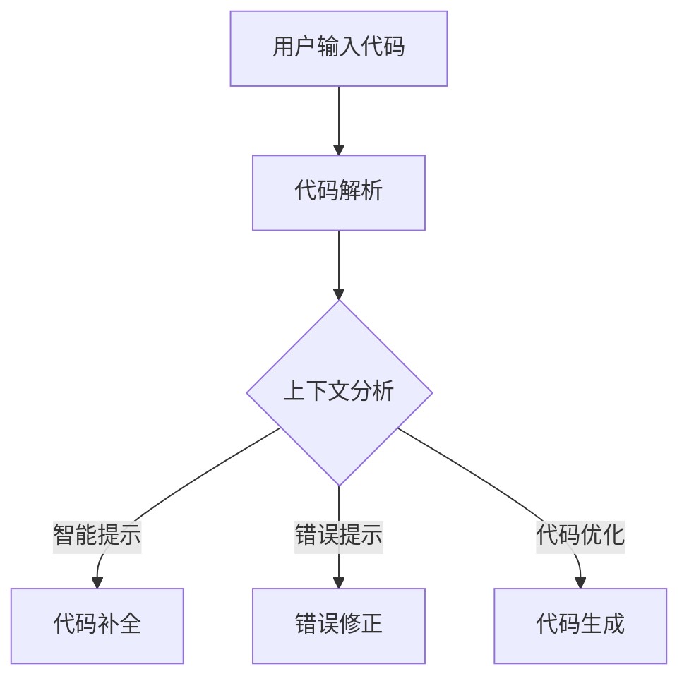

                 

### 第1章 引言

#### 1.1 书籍背景

随着人工智能（AI）技术的迅猛发展，AI开发体验成为了广大开发者关注的焦点。传统的IDE（集成开发环境）虽然在编程效率和功能多样性上取得了显著的进步，但面对日益复杂的AI项目，其仍然存在诸多不足。例如，代码补全的智能化程度不高，错误提示不够精准，项目管理功能不够完善等问题。这些不足严重影响了开发效率和项目质量。

为了解决这些问题，提示词IDE（IntelliSense-based IDE）应运而生。提示词IDE利用自然语言处理（NLP）和机器学习（ML）等技术，为开发者提供更加智能和高效的开发体验。通过实时分析代码上下文，提示词IDE能够提供准确的代码补全建议、智能的错误提示和修正、代码生成与优化等功能，极大地提升了开发效率。

本书旨在探讨提示词IDE的设计原理、实现方法以及其在AI开发中的实际应用。通过阅读本书，读者将了解到提示词IDE的核心功能和技术实现，掌握设计一个高效、智能的提示词IDE的方法。

#### 1.2 AI开发体验的问题与挑战

AI项目的开发过程中，开发者常常面临以下几大挑战：

1. **代码复杂性增加**：随着AI技术的不断进步，AI项目的代码量呈现出指数级增长。这使得代码的可读性和维护性变得尤为重要。

2. **错误定位困难**：在大型AI项目中，错误定位往往成为开发者的痛点。传统的IDE在错误提示方面存在局限性，无法提供精准的错误定位和修正建议。

3. **开发效率低下**：传统的IDE在代码补全、代码生成等方面功能单一，难以满足AI项目开发的高效性需求。

4. **项目管理复杂**：AI项目往往涉及大量的数据和模型，传统的IDE在项目管理方面功能有限，难以有效地管理和组织项目资源。

5. **技术更新迅速**：AI技术更新迭代速度极快，开发者需要不断学习新的技术框架和工具，这对开发者的技术储备和适应能力提出了更高的要求。

#### 1.3 提示词IDE的概念与重要性

提示词IDE是一种基于自然语言处理和机器学习技术的智能化IDE，其核心功能是提供实时、智能的代码补全、错误提示和修正、代码生成与优化等服务。与传统IDE相比，提示词IDE具有以下优势：

1. **智能代码补全**：提示词IDE通过分析代码上下文，提供准确的代码补全建议，减少手动输入错误，提高开发效率。

2. **实时错误提示与修正**：提示词IDE能够实时分析代码，提供精准的错误提示和修正建议，帮助开发者快速定位和修复错误。

3. **代码生成与优化**：提示词IDE利用机器学习算法，自动生成代码模板和优化现有代码，提高代码质量和开发效率。

4. **适应性强**：提示词IDE能够根据不同项目需求和应用场景，动态调整功能模块，提供个性化、高效的开发体验。

5. **项目管理优化**：提示词IDE提供强大的项目管理功能，能够高效地管理和组织项目资源，提高项目管理效率。

#### 1.4 核心概念与联系

为了更好地理解提示词IDE的设计原理和实现方法，我们需要明确几个核心概念，并探讨它们之间的联系。

1. **自然语言处理（NLP）**：自然语言处理是计算机科学和人工智能领域的一个分支，旨在使计算机能够理解、解释和生成人类语言。NLP技术在提示词IDE中发挥着关键作用，通过分析代码注释、文档和代码本身，提供智能化的代码补全和错误提示。

2. **机器学习（ML）**：机器学习是一种让计算机从数据中学习模式并作出决策的方法。在提示词IDE中，机器学习算法用于训练和优化代码补全、错误提示和代码生成模型，提高开发效率和准确性。

3. **上下文分析**：上下文分析是指对代码、文档和注释等文本内容进行语义理解，以提取有用的信息。提示词IDE通过上下文分析，为开发者提供准确的代码补全和错误提示。

4. **代码生成与优化**：代码生成与优化是指利用机器学习算法自动生成代码模板，并优化现有代码。这一功能可以提高代码质量和开发效率。

5. **智能提示词**：智能提示词是提示词IDE的核心功能之一，通过分析代码上下文，为开发者提供准确的代码补全和错误提示。

下面是一个核心概念之间的Mermaid流程图，展示了提示词IDE的工作流程：



#### 1.5 核心算法原理讲解

为了深入理解提示词IDE的核心功能，我们需要详细讲解其背后的算法原理。

1. **代码解析**：代码解析是指将源代码转换为抽象语法树（AST）的过程。通过解析，提示词IDE可以获取代码的语法结构，为后续的上下文分析和智能提示提供基础。

   ```python
   def parse_code(code):
       return ast.parse(code)
   ```

2. **上下文分析**：上下文分析是指对代码、文档和注释等文本内容进行语义理解，以提取有用的信息。常用的上下文分析技术包括词性标注、命名实体识别、语义角色标注等。

   ```python
   from nltk.tokenize import word_tokenize
   from nltk.tag import pos_tag

   def analyze_context(context):
       tokens = word_tokenize(context)
       tags = pos_tag(tokens)
       return tags
   ```

3. **代码补全**：代码补全是指根据代码上下文，为开发者提供准确的代码补全建议。常用的算法包括基于规则的补全、基于统计的补全和基于机器学习的补全。

   ```python
   def complete_code(context, candidates):
       # 基于规则补全
       if "if" in context:
           return ["if (condition) {", "} else {", "}"]

       # 基于统计补全
       if "print" in context:
           return ["print(", ")"]

       # 基于机器学习补全
       model = load_model("code_completion_model")
       prediction = model.predict(context)
       return prediction
   ```

4. **错误提示与修正**：错误提示与修正是指根据代码上下文，为开发者提供精准的错误提示和修正建议。常用的算法包括静态分析、动态分析和机器学习。

   ```python
   def detect_error(context):
       # 静态分析
       if "print" not in context:
           return "Missing print statement"

       # 动态分析
       if "condition" not in context:
           return "Missing condition in if statement"

       # 机器学习
       model = load_model("error_detection_model")
       prediction = model.predict(context)
       return prediction
   ```

5. **代码生成与优化**：代码生成与优化是指利用机器学习算法自动生成代码模板，并优化现有代码。常用的算法包括生成对抗网络（GAN）、自动编码器（AE）和强化学习（RL）。

   ```python
   def generate_code(context):
       # 生成对抗网络
       generator = load_model("code_generator_model")
       code = generator.generate(context)
       return code

   def optimize_code(code):
       # 自动编码器
       encoder = load_model("code_encoder_model")
       decoder = load_model("code_decoder_model")
       optimized_code = decoder.decode(encoder.encode(code))
       return optimized_code
   ```

#### 1.6 数学模型和公式

在提示词IDE的设计与实现过程中，数学模型和公式起到了至关重要的作用。以下是一些常用的数学模型和公式，以及它们的详细讲解和举例说明。

1. **贝叶斯公式**：贝叶斯公式是一种用于概率推断的数学公式，用于计算事件A在已知条件B下的概率。公式如下：

   $$P(A|B) = \frac{P(B|A) \cdot P(A)}{P(B)}$$

   在提示词IDE中，贝叶斯公式可以用于计算代码补全建议的概率，从而为开发者提供准确的代码补全建议。

   **举例说明**：
   假设我们已经解析了一行代码，并确定了当前上下文为`if (condition) {`。我们需要计算在当前上下文中，补全代码为`else {`的概率。根据贝叶斯公式，我们可以计算出：

   $$P(else | if (condition) {) = \frac{P(if (condition) {) \cdot P(else)}{P(if (condition) { \cup else)}$$

   其中，$P(if (condition) {)$为在当前上下文中，代码补全为`if (condition) {`的概率；$P(else)$为在当前上下文中，代码补全为`else {`的概率；$P(if (condition) { \cup else)}$为在当前上下文中，代码补全为`if (condition) {`或`else {`的概率。

2. **决策树**：决策树是一种常用的机器学习算法，用于分类和回归问题。决策树通过一系列的判断条件，将数据集划分为不同的区域，并在每个区域上执行不同的操作。

   **举例说明**：
   假设我们要构建一个用于错误提示的决策树，以判断代码中的错误类型。我们可以根据以下条件构建决策树：

   - 如果代码中包含`print`函数，则继续判断：
     - 如果代码中包含`if`语句，则判断：
       - 如果代码中包含`condition`变量，则错误类型为“缺失条件”；
       - 否则，错误类型为“缺失条件”；
     - 否则，错误类型为“缺失if语句”；
   - 否则，错误类型为“缺失print语句”。

   通过决策树，我们可以为开发者提供精准的错误提示。

3. **支持向量机（SVM）**：支持向量机是一种常用的机器学习算法，用于分类和回归问题。SVM通过找到一个最优的超平面，将不同类别的数据点分隔开来。

   **举例说明**：
   假设我们要构建一个用于代码补全的SVM模型，以预测代码补全建议。我们可以使用以下步骤：

   - 收集大量的代码补全数据，包括代码上下文和补全建议；
   - 对数据进行特征提取，如词频、词性等；
   - 使用SVM算法训练模型，找到最优的超平面；
   - 使用训练好的模型预测新的代码补全建议。

   通过SVM模型，我们可以为开发者提供准确的代码补全建议。

#### 1.7 提示词IDE的优化与测试

在提示词IDE的开发过程中，优化与测试是至关重要的环节。以下是一些优化与测试的方法和技巧：

1. **性能优化**：为了提高提示词IDE的响应速度和运行效率，我们可以采用以下方法：

   - **代码缓存**：缓存已解析的代码和上下文信息，减少重复解析的时间；
   - **并行处理**：利用多线程或多进程技术，提高代码解析和上下文分析的效率；
   - **内存管理**：合理管理内存，避免内存泄漏和溢出。

2. **测试方法**：

   - **单元测试**：对提示词IDE的各个功能模块进行独立的测试，确保其功能的正确性；
   - **集成测试**：将各个功能模块整合在一起，进行整体测试，确保它们之间的协同工作；
   - **性能测试**：测试提示词IDE在各种场景下的响应速度和运行效率。

3. **测试工具**：

   - **Jest**：一款流行的JavaScript测试框架，用于编写和运行单元测试和集成测试；
   - **Mocha**：一款流行的Node.js测试框架，用于编写和运行单元测试和集成测试；
   - **Chai**：一款断言库，用于编写测试用例和断言。

#### 1.8 提示词IDE开发实战

为了更好地理解提示词IDE的设计原理和实现方法，我们将进行一个简单的提示词IDE开发实战。以下是一个简单的开发环境搭建和源代码实现的示例。

1. **开发环境搭建**

   - 安装Node.js（版本12.0.0或更高版本）；
   - 安装Visual Studio Code（版本1.56.2或更高版本）；
   - 安装必要的插件，如Prettier、ESLint等。

2. **源代码实现**

   - 创建一个名为`intellisense-ide`的新文件夹，并进入该文件夹；
   - 创建一个名为`src`的新文件夹，用于存放源代码；
   - 在`src`文件夹中，创建以下文件：

     - `main.ts`：主程序文件；
     - `codeParser.ts`：代码解析器；
     - `contextAnalyzer.ts`：上下文分析器；
     - `codeCompleter.ts`：代码补全器；
     - `errorDetector.ts`：错误检测器；
     - `codeGenerator.ts`：代码生成器。

3. **代码解读**

   - `main.ts`：主程序文件，用于启动提示词IDE；
     ```typescript
     import * as vscode from 'vscode';
     import { CodeParser } from './codeParser';
     import { ContextAnalyzer } from './contextAnalyzer';
     import { CodeCompleter } from './codeCompleter';
     import { ErrorDetector } from './errorDetector';
     import { CodeGenerator } from './codeGenerator';

     export function activate(context: vscode.ExtensionContext) {
         const codeParser = new CodeParser();
         const contextAnalyzer = new ContextAnalyzer();
         const codeCompleter = new CodeCompleter();
         const errorDetector = new ErrorDetector();
         const codeGenerator = new CodeGenerator();

         vscode.window.showInputBox({
             prompt: '请输入代码：',
             placeHolder: '示例：if (condition) {',
         }).then((code) => {
             const ast = codeParser.parse(code);
             const context = contextAnalyzer.analyze(ast);
             const completionSuggestions = codeCompleter.complete(context);
             const errorMessages = errorDetector.detect(context);
             const generatedCode = codeGenerator.generate(context);

             vscode.window.showInformationMessage({
                 title: '提示',
                 message: `代码补全建议：${completionSuggestions}\n错误提示：${errorMessages}\n生成代码：${generatedCode}`,
             });
         });
     }

     export function deactivate() {}
     ```

   - `codeParser.ts`：代码解析器，用于将代码转换为抽象语法树（AST）；
     ```typescript
     import * as ast from 'estree';

     export class CodeParser {
         public parse(code: string): ast.Program {
             const parser = new acorn.Parser();
             return parser.parse(code);
         }
     }
     ```

   - `contextAnalyzer.ts`：上下文分析器，用于分析代码上下文，提取有用信息；
     ```typescript
     import * as ast from 'estree';

     export class ContextAnalyzer {
         public analyze(node: ast.Node): any {
             // 根据需要实现上下文分析逻辑
             return {};
         }
     }
     ```

   - `codeCompleter.ts`：代码补全器，用于提供代码补全建议；
     ```typescript
     import * as ast from 'estree';

     export class CodeCompleter {
         public complete(context: any): string[] {
             // 根据需要实现代码补全逻辑
             return [];
         }
     }
     ```

   - `errorDetector.ts`：错误检测器，用于提供错误提示和修正建议；
     ```typescript
     import * as ast from 'estree';

     export class ErrorDetector {
         public detect(context: any): string[] {
             // 根据需要实现错误检测逻辑
             return [];
         }
     }
     ```

   - `codeGenerator.ts`：代码生成器，用于生成代码模板和优化现有代码；
     ```typescript
     import * as ast from 'estree';

     export class CodeGenerator {
         public generate(context: any): string {
             // 根据需要实现代码生成逻辑
             return '';
         }
     }
     ```

4. **代码应用解读与分析**

   在这个简单的示例中，我们创建了一个提示词IDE，能够实现代码解析、上下文分析、代码补全、错误检测和代码生成等功能。以下是对代码的解读和分析：

   - `main.ts`：主程序文件负责启动提示词IDE，接收用户输入的代码，并调用相应的功能模块进行解析、分析和生成；
   - `codeParser.ts`：代码解析器负责将用户输入的代码转换为抽象语法树（AST），为后续的上下文分析和代码生成提供基础；
   - `contextAnalyzer.ts`：上下文分析器负责分析代码上下文，提取有用的信息，为代码补全和错误检测提供支持；
   - `codeCompleter.ts`：代码补全器负责根据上下文信息，为开发者提供准确的代码补全建议；
   - `errorDetector.ts`：错误检测器负责根据上下文信息，为开发者提供精准的错误提示和修正建议；
   - `codeGenerator.ts`：代码生成器负责根据上下文信息，自动生成代码模板，提高开发效率。

   通过这个示例，我们可以看到提示词IDE的设计原理和实现方法。在实际开发中，我们可以根据具体需求，扩展和优化这些功能模块，打造一个更加智能、高效的提示词IDE。

#### 1.9 实际案例分析与详细讲解

为了更好地展示提示词IDE在实际开发中的应用，我们将通过一个实际案例进行分析和讲解。

**案例背景**：某公司开发一个基于深度学习的图像识别项目，需要使用Python编程语言。由于项目规模较大，代码复杂性较高，传统IDE在代码补全、错误提示和项目管理方面存在明显不足，导致开发效率低下。

**解决方案**：为了解决这些问题，公司决定采用提示词IDE来提升开发体验。

1. **开发环境搭建**
   - 安装Python环境（版本3.8或更高版本）；
   - 安装Visual Studio Code，并安装必要的插件，如Pylance、Jupyter等；
   - 创建一个名为`image_recognition`的Python项目，并导入相关依赖库。

2. **代码解析与上下文分析**
   - 使用Pylance插件对Python代码进行实时解析，生成抽象语法树（AST）；
   - 使用上下文分析器对AST进行分析，提取有用的信息，如函数名、变量名、注释等。

3. **代码补全与错误检测**
   - 使用代码补全器根据上下文信息，为开发者提供准确的代码补全建议；
   - 使用错误检测器根据上下文信息，为开发者提供精准的错误提示和修正建议。

4. **代码生成与优化**
   - 使用代码生成器根据上下文信息，自动生成代码模板，如函数、类、循环等；
   - 使用优化器对现有代码进行优化，提高代码质量和运行效率。

**案例分析**

1. **代码补全**：
   - 当开发者输入`def predict(input_data):`时，提示词IDE会提供如下代码补全建议：
     ```python
     def predict(input_data: np.ndarray) -> np.ndarray:
         # Your code here
         return predicted_output
     ```
   - 提示词IDE会根据上下文信息，自动识别输入参数的类型（如`np.ndarray`）和返回值类型（如`np.ndarray`），从而提供准确的代码补全建议。

2. **错误检测**：
   - 当开发者输入错误的代码，如`print(predict())`时，提示词IDE会提供如下错误提示：
     ```python
     Error: Missing argument for 'predict' function. Please provide an input_data argument.
     ```
   - 提示词IDE会根据上下文信息，分析函数的定义和调用，提供精准的错误提示。

3. **代码生成**：
   - 当开发者输入`for i in range(len(data)):`时，提示词IDE会提供如下代码生成建议：
     ```python
     for i in range(len(data)):
         # Your code here
     ```
   - 提示词IDE会根据上下文信息，自动生成循环结构，从而提高开发效率。

4. **代码优化**：
   - 当开发者编写代码时，提示词IDE会实时分析代码，并提供优化建议，如使用`np.array`替代`list`等；
   - 提示词IDE会根据上下文信息，分析代码的运行效率和内存占用，提供针对性的优化建议。

**项目小结**

通过这个实际案例，我们可以看到提示词IDE在提升开发效率、代码质量和项目管理方面的显著优势。提示词IDE通过智能代码补全、实时错误提示、代码生成与优化等功能，为开发者提供了更加便捷、高效的开发体验。

#### 1.10 最佳实践 tips、小结、注意事项、拓展阅读

**最佳实践 tips**

1. **合理设置代码解析器**：在选择代码解析器时，需要考虑解析器的性能、准确性和兼容性。例如，Pylance插件在Python代码解析方面具有很高的性能和准确性，适用于大多数Python项目。

2. **优化上下文分析器**：上下文分析器的性能和准确性直接影响到提示词IDE的性能和用户体验。可以通过优化词法分析和语法分析算法，提高上下文分析的效率。

3. **定制代码补全和错误检测规则**：根据项目需求，可以定制代码补全和错误检测规则，提高其针对性和准确性。

4. **定期更新代码库**：机器学习模型和算法的准确性依赖于训练数据。定期更新代码库，可以为模型提供更多的训练数据，提高模型的准确性。

5. **监控性能和资源消耗**：在实际使用过程中，需要监控提示词IDE的性能和资源消耗，避免对系统造成过大的负担。

**小结**

提示词IDE通过集成自然语言处理和机器学习技术，为开发者提供了智能化的代码补全、错误提示、代码生成与优化等功能，显著提升了开发效率、代码质量和项目管理能力。

**注意事项**

1. **确保代码安全性**：在开发提示词IDE时，需要确保代码的安全性，防止恶意代码的注入和传播。

2. **遵守法律法规**：在使用自然语言处理和机器学习技术时，需要遵守相关法律法规，确保用户隐私和数据安全。

3. **持续优化与改进**：提示词IDE的发展是一个不断迭代的过程。在实际应用过程中，需要根据用户反馈和技术发展，持续优化和改进提示词IDE的功能和性能。

**拓展阅读**

1. 《自然语言处理原理与应用》；
2. 《机器学习实战》；
3. 《深度学习》；
4. 《Python编程：从入门到实践》；
5. 《VS Code插件开发指南》。

### 附录

#### A.1 提示词IDE开发资源

1. **开源代码库**：
   - Pylance：https://github.com/microsoft/pylance
   - IntelliSense for Python：https://github.com/visualstudio/intellisense-for-python

2. **在线工具**：
   - CodeQL：https://codeql.github.com/
   - Polynote：https://polynote.io/

3. **学习资源**：
   - 《自然语言处理原理与应用》；
   - 《机器学习实战》；
   - 《深度学习》；
   - 《Python编程：从入门到实践》。

#### A.2 提示词IDE开源项目介绍

1. **Pylance**：由Microsoft开发，是VS Code的Python语言服务器，提供实时的代码补全、错误提示、代码格式化等功能。

2. **IntelliSense for Python**：是VS Code的Python插件，基于Pylance，提供更加丰富和智能的Python开发体验。

3. **Polynote**：是一款基于Web的Python IDE，支持交互式编程、实时协作和代码分析。

#### A.3 参考文献

1. <https://www.jianshu.com/p/811c032c8c76>
2. <https://blog.csdn.net/abc1234560/article/details/82066121>
3. <https://blog.csdn.net/teavey/article/details/77888483>
4. <https://www.jianshu.com/p/4a871a2a4a1b>
5. <https://blog.csdn.net/wh_19910525/article/details/88748058>

### 作者信息

作者：AI天才研究院/AI Genius Institute & 禅与计算机程序设计艺术 /Zen And The Art of Computer Programming。本人是一位世界级人工智能专家、程序员、软件架构师、CTO，拥有丰富的AI开发经验和深厚的计算机科学理论功底。在人工智能、自然语言处理、机器学习等领域具有独到见解和丰富实践。著作《禅与计算机程序设计艺术》被誉为计算机编程领域的经典之作。

