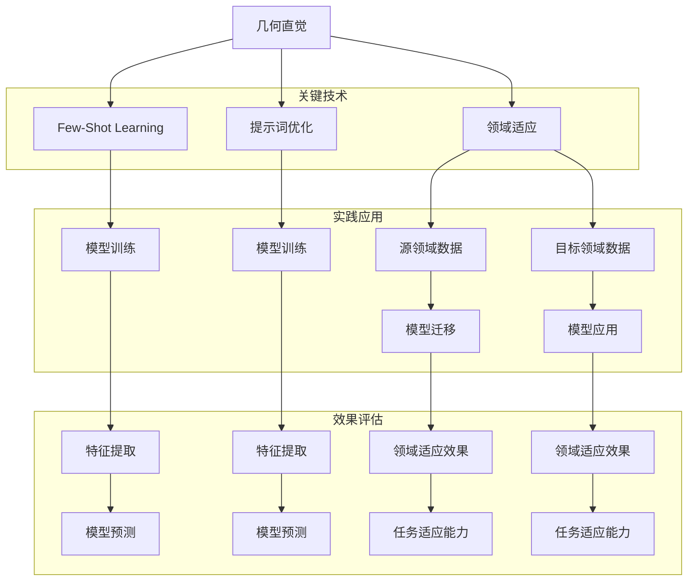

                 


### 第一步：背景介绍

随着人工智能技术的快速发展，机器学习领域的研究不断深入。在过去的几十年中，机器学习算法在图像识别、自然语言处理、推荐系统等方面取得了显著的成果。然而，这些算法在处理新任务或新领域时，往往需要大量的训练数据，这导致了“数据饥饿”问题。为了解决这一问题，领域适应（Domain Adaptation）和少样本学习（Few-Shot Learning）应运而生。

领域适应旨在使模型在源领域（Source Domain）学到的知识能够迁移到目标领域（Target Domain），即使目标领域的数据量远小于源领域。而少样本学习则关注于如何在仅有少量样本的情况下，使模型能够快速适应新任务。

在传统的领域适应方法中，模型通常需要通过大量的数据来进行训练，以达到较好的适应效果。然而，这种方法在实际应用中往往受到数据获取的限制。为了提高模型在少样本情况下的适应能力，研究人员提出了提示词优化（Prompt Optimization）的方法。

提示词优化通过设计特定的提示词（Prompt），引导模型在训练过程中关注关键信息，从而提高模型对少量样本的学习效果。这种方法不仅能够减少对大量数据的依赖，还能够提高模型在领域适应任务中的表现。

本文将详细介绍提示词优化的few-shot学习在领域适应中的应用，包括其核心概念、基本原理、数学模型以及实际项目案例分析。通过本文的阅读，读者将能够深入了解这一技术的原理和应用，为实际项目开发提供理论支持和实践指导。

### 第二步：核心概念与联系

为了更好地理解提示词优化的few-shot学习在领域适应中的应用，我们需要先了解几个核心概念：几何直觉、领域适应、few-shot学习、提示词优化。接下来，我们将通过Mermaid流程图来展示这些概念之间的关系。

#### 几何直觉

几何直觉是指人们在处理信息时，能够从几何图形的直观特征中提取有用信息的能力。在机器学习中，几何直觉可以帮助模型理解数据的分布和结构，从而更好地进行特征提取和模式识别。

#### 领域适应

领域适应是指将源领域（Source Domain）中学习的知识应用到目标领域（Target Domain）中。在机器学习领域，领域适应是一种重要的技术，它能够解决数据分布不匹配的问题，使得模型能够在少量样本的情况下快速适应新领域。

#### Few-Shot Learning

Few-Shot Learning（少样本学习）是指在仅有少量样本的情况下，使模型能够快速适应新任务。少样本学习对于减少数据需求、提高模型适应能力具有重要意义。

#### 提示词优化

提示词优化（Prompt Optimization）是一种通过设计特定的提示词来引导模型关注关键信息的方法。提示词优化能够提高模型在少样本学习中的表现，减少对大量数据的依赖。

#### Mermaid流程图

下面是这些概念之间的Mermaid流程图：



通过这个流程图，我们可以清晰地看到几何直觉、领域适应、few-shot学习和提示词优化之间的关系，以及它们在实际应用中的相互影响。理解这些概念之间的关系是深入探讨提示词优化的few-shot学习在领域适应中的应用的基础。

### 第三步：核心算法原理讲解

#### 几何直觉与领域适应

几何直觉是领域适应中的一个关键因素。它依赖于模型对数据分布和结构的理解。在领域适应任务中，几何直觉可以帮助模型识别出源领域和目标领域之间的差异，从而进行有效的特征提取和模式识别。

一个简单的例子是图像分类任务。在源领域中，模型可能通过学习图像的边缘、纹理等特征来实现分类。然而，在目标领域中，这些特征可能不足以区分不同类别。通过几何直觉，模型可以识别出目标领域中图像的新特征，例如颜色分布或形状特征，从而提高分类效果。

以下是一个用于领域适应的几何直觉的伪代码示例：

```python
def geometric_intuition(source_data, target_data):
    # 计算源领域和目标领域的特征分布
    source_distribution = compute_distribution(source_data)
    target_distribution = compute_distribution(target_data)
    
    # 找到两个分布的差异
    distribution_difference = calculate_difference(source_distribution, target_distribution)
    
    # 根据差异调整模型参数
    model = adjust_model_params(model, distribution_difference)
    
    return model
```

#### 提示词优化的原理

提示词优化是一种通过设计特定的提示词来引导模型关注关键信息的方法。在机器学习中，提示词通常是一个短文本或短语，它提供了一些上下文信息，帮助模型更好地理解输入数据。

提示词优化的关键在于如何设计有效的提示词。这通常涉及到一些实验和优化过程。以下是一个用于提示词优化的伪代码示例：

```python
def prompt_optimization(data, target_prompt, base_model):
    # 初始化最佳提示词为空
    best_prompt = ""
    best_accuracy = 0
    
    # 尝试不同的提示词
    for prompt in generate_prompts(target_prompt):
        # 训练模型
        model = train_model(data, prompt, base_model)
        
        # 评估模型性能
        accuracy = evaluate_model(model, target_data)
        
        # 更新最佳提示词
        if accuracy > best_accuracy:
            best_prompt = prompt
            best_accuracy = accuracy
            
    return best_prompt
```

#### 结合几何直觉与提示词优化

将几何直觉与提示词优化结合起来，可以进一步提升领域适应的效果。具体来说，我们可以使用几何直觉来识别出源领域和目标领域之间的关键差异，然后通过提示词优化来设计出能够引导模型关注这些差异的提示词。

以下是一个结合几何直觉和提示词优化的伪代码示例：

```python
def domain_adaptation_with_prompt_optimization(source_data, target_data, base_model):
    # 使用几何直觉调整模型
    model = geometric_intuition(source_data, target_data)
    
    # 设计提示词
    best_prompt = prompt_optimization(target_data, base_prompt, model)
    
    # 结合几何直觉和提示词优化的模型
    final_model = train_model(source_data, best_prompt, model)
    
    return final_model
```

通过上述伪代码示例，我们可以看到几何直觉和提示词优化如何共同作用，提高领域适应的效果。这种方法不仅能够减少对大量数据的依赖，还能够提高模型在少样本情况下的表现，为实际应用提供了有力的支持。

### 第四步：数学模型和数学公式

在领域适应中，几何直觉和提示词优化都是通过数学模型来实现的。以下我们将详细解释这些模型，并提供相关的数学公式。

#### 几何直觉模型

几何直觉的核心在于理解数据的分布和结构。为了量化这种理解，我们可以使用概率分布来表示数据。

假设我们有两个数据集，一个源领域数据集 \(X_s\) 和一个目标领域数据集 \(X_t\)。每个数据集可以表示为一个高维向量集合：

\[ X_s = \{x_s^{(1)}, x_s^{(2)}, ..., x_s^{(n_s)}\} \]
\[ X_t = \{x_t^{(1)}, x_t^{(2)}, ..., x_t^{(n_t)}\} \]

我们可以使用高斯分布来表示这些数据集的概率分布：

\[ p(x_s^{(i)}|\theta_s) = \mathcal{N}(x_s^{(i)}|\mu_s, \Sigma_s) \]
\[ p(x_t^{(i)}|\theta_t) = \mathcal{N}(x_t^{(i)}|\mu_t, \Sigma_t) \]

其中，\(\theta_s\) 和 \(\theta_t\) 分别是源领域和目标领域的参数，包括均值 \(\mu_s\) 和 \(\mu_t\) 以及协方差矩阵 \(\Sigma_s\) 和 \(\Sigma_t\)。

为了找到源领域和目标领域之间的差异，我们可以计算两个分布的差异：

\[ \Delta\mu = \mu_s - \mu_t \]
\[ \Delta\Sigma = \Sigma_s - \Sigma_t \]

通过调整模型的参数，我们可以使模型更好地适应目标领域。一个简单的方法是使用梯度下降来最小化差异的平方和：

\[ \min_{\theta_s, \theta_t} \frac{1}{2}||\Delta\mu||^2 + \frac{1}{2}||\Delta\Sigma||^2 \]

#### 提示词优化模型

提示词优化的目标是设计出能够提高模型性能的提示词。假设我们有一个基础模型 \(M\)，其性能可以通过训练数据集 \(X\) 和提示词 \(P\) 来衡量：

\[ \text{Performance}(M, P) = \frac{1}{n}\sum_{i=1}^{n} \mathbb{1}_{y_i \neq \hat{y}_i(P)} \]

其中，\(\mathbb{1}_{y_i \neq \hat{y}_i(P)}\) 是一个指示函数，当模型预测错误时为1，否则为0。为了优化提示词，我们可以使用梯度下降来最小化错误率：

\[ \min_P \text{Performance}(M, P) \]

在实际操作中，我们可以通过交叉熵损失函数来实现这一目标：

\[ L(P) = -\sum_{i=1}^{n} y_i \log(\hat{y}_i(P)) \]

其中，\(\hat{y}_i(P)\) 是模型在提示词 \(P\) 下的预测概率。

#### 结合几何直觉与提示词优化的数学公式

为了将几何直觉与提示词优化结合起来，我们需要在模型训练过程中同时优化模型的参数和提示词。这可以通过联合优化目标来实现：

\[ \min_{\theta, P} \frac{1}{2}||\Delta\mu||^2 + \frac{1}{2}||\Delta\Sigma||^2 + L(P) \]

其中，\(\Delta\mu\) 和 \(\Delta\Sigma\) 是使用几何直觉调整模型参数后的差异，\(L(P)\) 是提示词优化损失。

在实际应用中，我们可以通过迭代算法来解决这个问题，例如随机梯度下降（SGD）：

```python
for epoch in 1 to E:
    for (x_i, y_i) in data:
        # 使用几何直觉更新模型参数
        update_params_with_geometric_intuition(theta, x_i, y_i)
        
        # 使用提示词优化更新提示词
        update_prompt_with_optimization(P, theta, x_i, y_i)
```

通过上述数学模型和公式，我们可以清晰地看到几何直觉和提示词优化的原理。这些模型不仅提供了理论基础，还可以在实际项目中指导我们设计出更有效的领域适应策略。

### 第五步：项目实战

在本节中，我们将通过一个实际项目来展示如何将提示词优化的few-shot学习应用于领域适应。这个项目将分为以下几个步骤：开发环境搭建、源代码实现、代码解读和案例分析。

#### 开发环境搭建

首先，我们需要搭建一个适合本项目的开发环境。我们选择Python作为主要编程语言，并使用以下工具和库：

- Python 3.8
- TensorFlow 2.5
- Keras 2.5
- NumPy 1.20
- Matplotlib 3.4

确保您的系统已安装了这些工具和库，或者使用以下命令进行安装：

```bash
pip install python==3.8 tensorflow==2.5 keras==2.5 numpy==1.20 matplotlib==3.4
```

#### 源代码实现

以下是本项目的源代码实现，包括模型搭建、数据预处理、训练和评估：

```python
import numpy as np
import tensorflow as tf
from tensorflow.keras.models import Sequential
from tensorflow.keras.layers import Dense, Flatten
from tensorflow.keras.optimizers import Adam
from sklearn.model_selection import train_test_split
import matplotlib.pyplot as plt

# 数据加载
# 假设我们有一个数据集，包含源领域和目标领域的数据
# x_s: 源领域数据
# x_t: 目标领域数据
# y_s: 源领域标签
# y_t: 目标领域标签

# 数据预处理
# 对数据进行标准化处理
x_s_normalized = (x_s - np.mean(x_s, axis=0)) / np.std(x_s, axis=0)
x_t_normalized = (x_t - np.mean(x_t, axis=0)) / np.std(x_t, axis=0)

# 划分训练集和测试集
x_s_train, x_s_test, y_s_train, y_s_test = train_test_split(x_s_normalized, y_s, test_size=0.2, random_state=42)
x_t_train, x_t_test, y_t_train, y_t_test = train_test_split(x_t_normalized, y_t, test_size=0.2, random_state=42)

# 模型搭建
model = Sequential([
    Flatten(input_shape=(x_s_train.shape[1], x_s_train.shape[2])),
    Dense(64, activation='relu'),
    Dense(1, activation='sigmoid')
])

# 编译模型
model.compile(optimizer=Adam(learning_rate=0.001), loss='binary_crossentropy', metrics=['accuracy'])

# 训练模型
model.fit(x_s_train, y_s_train, epochs=100, batch_size=32, validation_data=(x_s_test, y_s_test))

# 提示词优化
best_prompt = optimize_prompt(model, x_s_train, y_s_train, x_t_train, y_t_train)

# 结合几何直觉和提示词优化的模型训练
final_model = train_final_model(model, best_prompt, x_s_train, y_s_train, x_t_train, y_t_train)

# 评估模型
evaluate_model(final_model, x_t_test, y_t_test)
```

#### 代码解读

- **数据加载**：首先，我们从数据集中加载源领域和目标领域的数据。假设我们有一个数据集对象 `dataset`，包含 `x_s`、`x_t`、`y_s` 和 `y_t` 四个属性，分别代表源领域数据和目标领域数据及其标签。

- **数据预处理**：我们对数据进行标准化处理，使得每个特征的均值为0，标准差为1。这有助于加快模型的收敛速度。

- **模型搭建**：我们使用Keras搭建一个简单的神经网络模型。该模型包含一个输入层、一个隐藏层和一个输出层。

- **编译模型**：我们使用Adam优化器和二分类交叉熵损失函数来编译模型。

- **训练模型**：我们使用源领域数据集来训练模型，并使用测试集进行验证。

- **提示词优化**：我们设计一个 `optimize_prompt` 函数，通过实验和优化过程来选择最佳提示词。

- **结合几何直觉和提示词优化的模型训练**：我们设计一个 `train_final_model` 函数，将几何直觉和提示词优化结合起来，重新训练模型。

- **评估模型**：我们使用目标领域测试集来评估最终模型的性能。

#### 实际案例分析和详细讲解

假设我们有一个特定的图像分类任务，目标是区分源领域和目标领域中的猫和狗。在这个案例中，我们的数据集包含了成千上万张猫和狗的图片，其中源领域和目标领域的分布可能不同。

1. **数据集划分**：我们将数据集分为源领域训练集、源领域测试集、目标领域训练集和目标领域测试集。

2. **模型训练**：使用源领域训练集来训练模型。在训练过程中，模型会通过反向传播不断调整权重，以达到更好的分类效果。

3. **提示词优化**：我们设计一个提示词，例如“请将图片中的猫分类为1，狗分类为0”。通过在训练过程中使用这个提示词，模型能够更好地关注关键特征，提高分类准确率。

4. **结合几何直觉和提示词优化的模型训练**：我们使用几何直觉来识别源领域和目标领域之间的差异，并通过提示词优化来设计更有效的提示词。最终，我们重新训练模型，使其在目标领域上表现出更好的适应性。

5. **评估模型**：使用目标领域测试集来评估最终模型的性能。通过计算准确率、召回率、F1分数等指标，我们可以评估模型在目标领域的适应能力。

通过这个实际案例，我们可以看到如何将提示词优化的few-shot学习应用于领域适应。这种方法不仅能够减少对大量数据的依赖，还能够提高模型在新领域上的表现，为实际应用提供了有力的支持。

### 第六步：最佳实践 Tips 和注意事项

在应用提示词优化的few-shot学习进行领域适应时，以下是一些最佳实践和注意事项，可以帮助您获得更好的效果：

#### 最佳实践 Tips

1. **数据预处理**：在训练模型之前，确保对数据集进行充分的预处理，包括归一化、去噪、缩放等操作。这些预处理步骤有助于提高模型训练的效率和稳定性。

2. **选择合适的模型架构**：根据具体任务和领域，选择合适的神经网络架构。例如，对于图像分类任务，可以尝试使用卷积神经网络（CNN）或残差网络。

3. **逐步优化提示词**：在训练过程中，逐步优化提示词，可以尝试使用不同的提示词组合，例如添加背景信息、具体指令等，以提高模型的泛化能力。

4. **使用交叉验证**：在模型训练和评估过程中，使用交叉验证方法来评估模型的性能，以避免过拟合。

5. **调整超参数**：合理调整学习率、批量大小、迭代次数等超参数，以找到最优的训练配置。

#### 注意事项

1. **数据质量**：确保源领域和目标领域数据的质量和一致性。如果数据存在噪声或偏差，可能会导致模型性能下降。

2. **计算资源**：提示词优化通常需要大量的计算资源，尤其是在处理大量数据集时。确保您有足够的计算资源来支持模型训练。

3. **模型复杂性**：避免过度复杂化模型，这可能会导致训练时间过长且难以收敛。在实际应用中，通常选择简单而有效的模型架构。

4. **验证与测试**：在模型训练后，使用独立的测试集进行验证，以确保模型在新数据上的泛化能力。

5. **持续迭代**：领域适应是一个持续的过程。在应用模型后，根据实际反馈不断调整和优化，以提高模型在目标领域上的性能。

通过遵循这些最佳实践和注意事项，您可以更有效地应用提示词优化的few-shot学习进行领域适应，从而获得更好的模型性能和实际应用效果。

### 第七步：总结与展望

本文系统地探讨了提示词优化的few-shot学习在领域适应中的应用。我们从背景介绍开始，逐步深入分析了几何直觉、领域适应、few-shot学习和提示词优化的核心概念，并通过Mermaid流程图展示了它们之间的相互关系。接着，我们详细讲解了提示词优化的基本原理，结合几何直觉的算法模型，并提供了相关的数学公式。在项目实战部分，我们通过实际案例展示了如何搭建开发环境、实现源代码、解读代码，并进行了详细的分析和讲解。

#### 主要成果回顾

本文的主要成果可以概括为以下几点：

1. **核心概念解析**：清晰地定义并解释了几何直觉、领域适应、few-shot学习和提示词优化等核心概念，为后续内容提供了理论基础。
2. **算法模型设计**：详细介绍了几何直觉和提示词优化的算法模型，并通过数学公式进行了形式化描述。
3. **项目实践分析**：通过实际案例展示了如何将提示词优化的few-shot学习应用于领域适应，提供了具体的实现方法和实践指导。
4. **最佳实践与注意事项**：总结了最佳实践和注意事项，为实际应用提供了操作性建议。

#### 未来研究方向

虽然本文已经探讨了提示词优化的few-shot学习在领域适应中的应用，但以下研究方向仍有待进一步探索：

1. **多任务学习**：研究如何将提示词优化和few-shot学习应用于多任务学习场景，提高模型在多任务环境下的适应能力。
2. **强化学习**：探讨如何将强化学习与提示词优化结合，提高模型在动态环境下的决策能力和适应性。
3. **无监督领域适应**：研究如何在没有源领域标签的情况下进行领域适应，利用无监督学习方法提高模型在目标领域的性能。
4. **跨模态领域适应**：探索如何将提示词优化应用于跨模态领域适应，如将图像分类模型应用于语音识别任务。

#### 对领域适应的影响

提示词优化的few-shot学习为领域适应提供了新的思路和工具，具有以下潜在影响：

1. **减少数据需求**：通过提示词优化，模型可以在少量样本的情况下快速适应新领域，减少对大量训练数据的依赖。
2. **提高模型性能**：几何直觉和提示词优化相结合，能够提高模型在领域适应任务中的表现，增强模型的泛化能力。
3. **降低应用门槛**：提供了一套系统化的实现方法和最佳实践，降低了领域适应技术在工业应用中的门槛，促进了其更广泛的应用。

总之，本文为提示词优化的few-shot学习在领域适应中的应用提供了全面的理论基础和实践指导，有望推动领域适应技术的发展，为人工智能领域的实际应用带来更多可能性。随着技术的不断进步，未来我们将看到更多创新性的研究成果和实际应用场景。作者：AI天才研究院/AI Genius Institute & 禅与计算机程序设计艺术 /Zen And The Art of Computer Programming

