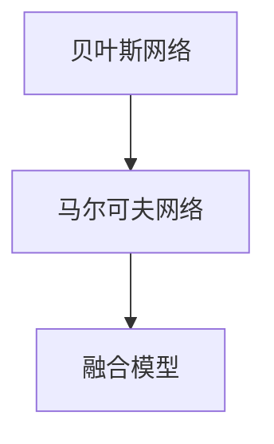
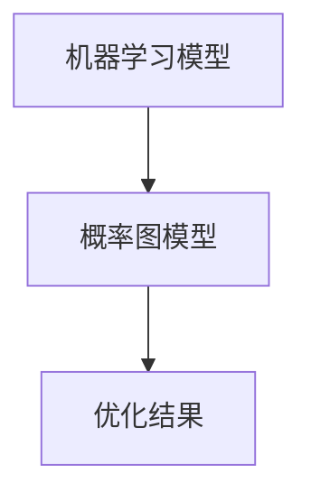
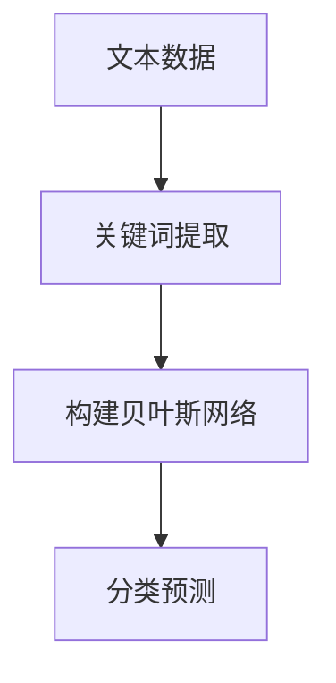
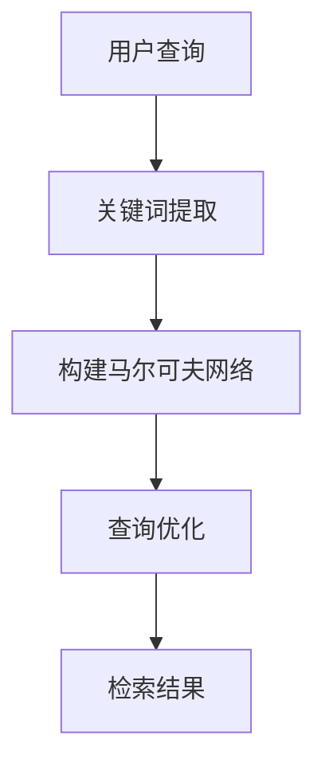
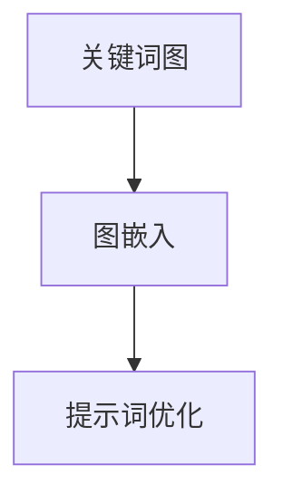
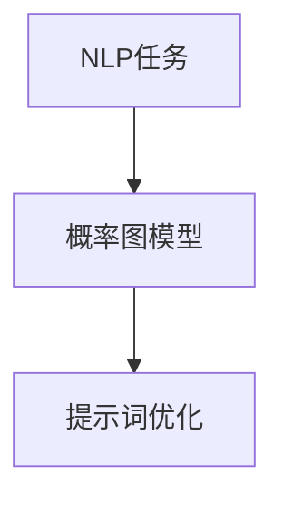
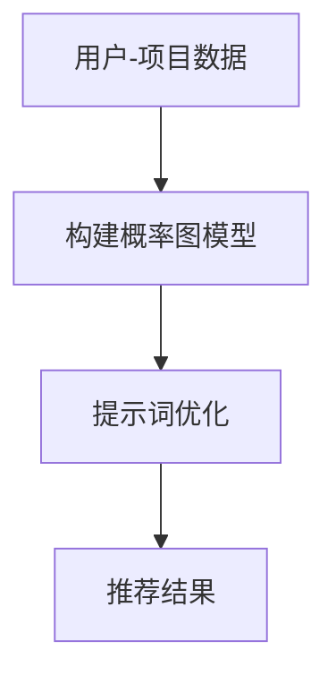
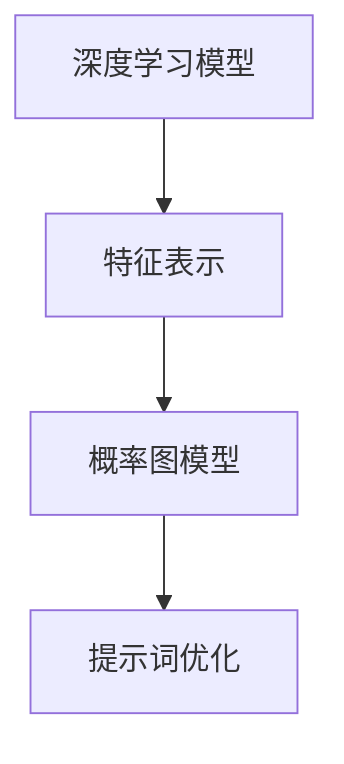
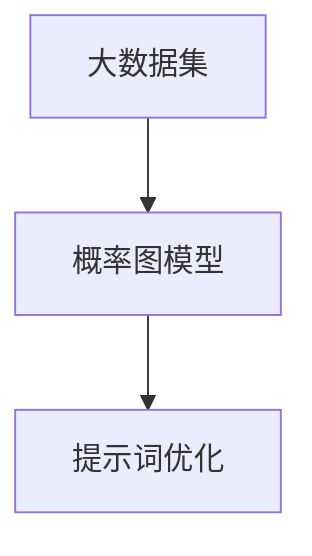
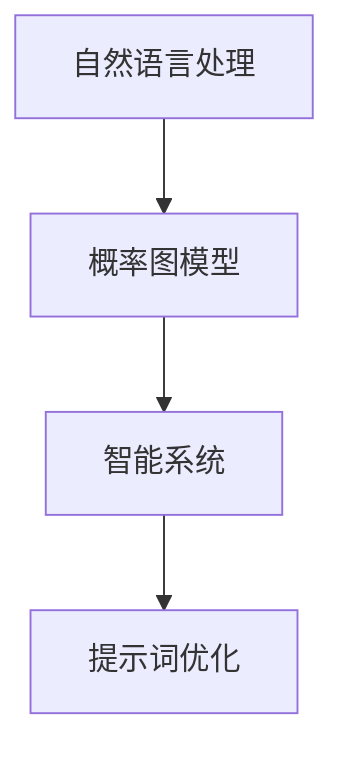

                 


### 文章标题

《提示词优化的概率图模型方法》

### 文章关键词

概率图模型、提示词优化、贝叶斯网络、马尔可夫网络、图嵌入、自然语言处理、推荐系统

### 文章摘要

本文深入探讨了提示词优化的概率图模型方法，包括其基本概念、核心算法原理、数学模型和公式，以及实际应用案例。文章首先介绍了概率图模型的基本原理，然后详细讲解了提示词优化的技术和方法，接着探讨了概率图模型在提示词优化中的应用。通过实例和伪代码，本文展示了如何使用概率图模型优化提示词。最后，文章展望了概率图模型与深度学习、大数据分析以及智能系统融合的前沿研究方向，并提供了一些实践建议和拓展阅读。

----------------------------------------------------------------

### 引言

在当今的信息时代，如何有效地进行信息检索、文本分析和推荐系统设计成为了关键问题。随着互联网数据的爆炸式增长，传统的基于关键词匹配的方法已经无法满足用户日益增长的需求。为了提高检索和推荐的准确性和效果，研究者们开始探索更高级的文本处理技术。在这一背景下，概率图模型作为一种强大的知识表示和推理工具，受到了广泛关注。本文旨在探讨如何利用概率图模型实现提示词优化，从而提升信息检索、文本分析和推荐系统的性能。

### 概率图模型的基本概念

概率图模型（Probabilistic Graphical Models，PGM）是一种用于表示变量之间概率依赖关系的图形化方法。它由贝叶斯网络（Bayesian Networks，BN）和马尔可夫网络（Markov Networks，MN）两大类组成。贝叶斯网络通过有向无环图（DAG）表示变量之间的条件依赖关系，而马尔可夫网络则通过无向图表示变量之间的联合概率分布。

#### 贝叶斯网络

贝叶斯网络是一种基于概率的图形化模型，它由节点和边组成，每个节点代表一个随机变量，边表示变量之间的条件依赖关系。贝叶斯网络的概率分布可以通过条件概率表（CPT）来定义。给定一个贝叶斯网络，我们可以利用贝叶斯定理和概率推理算法（如变量消除法）计算任意变量的条件概率分布。

```python
# 贝叶斯网络的变量消除算法伪代码
def variable_elimination(bn, query_variable):
    # 初始化概率分布
    prob_distribution = initialize_prob_distribution(bn, query_variable)
    
    # 遍历网络中的所有变量
    for variable in bn.variables():
        if variable != query_variable:
            # 消除变量
            prob_distribution = eliminate_variable(prob_distribution, variable)
            
    return prob_distribution
```

#### 马尔可夫网络

马尔可夫网络是一种基于概率的无向图模型，它通过边表示变量之间的转移概率。马尔可夫网络的一个重要性质是马尔可夫性，即给定当前状态，过去状态与未来状态是相互独立的。马尔可夫网络的概率分布可以通过条件概率分布来定义。

```python
# 马尔可夫网络的概率分布计算伪代码
def markov_network_probability(mn, states):
    probability = 1.0
    for edge in mn.edges():
        probability *= mn.get_probability(edge, states[edge])
    return probability
```

### 提示词优化的技术方法

提示词优化（Keyword Optimization）是提高信息检索和推荐系统性能的关键技术之一。其核心目标是通过调整和优化提示词，提高系统的检索精度和推荐效果。

#### 基于启发式的方法

基于启发式的方法通常依赖于人工经验和规则，通过分析关键词的重要性和相关性来优化提示词。这种方法简单易行，但效果有限，难以应对复杂的文本数据。

```python
# 基于启发式的提示词优化伪代码
def heuristic_keyword_optimization(text, keywords):
    # 计算关键词重要性
    keyword_importance = calculate_keyword_importance(text, keywords)
    
    # 根据重要性调整关键词权重
    optimized_keywords = adjust_keyword_weights(keywords, keyword_importance)
    
    return optimized_keywords
```

#### 基于机器学习的方法

基于机器学习的方法利用大规模的文本数据训练模型，自动学习关键词的重要性和相关性。这种方法通常使用监督学习、无监督学习和半监督学习等技术，具有更高的准确性和鲁棒性。

```python
# 基于机器学习的提示词优化伪代码
def ml_keyword_optimization(text, labels):
    # 训练机器学习模型
    model = train_ml_model(text, labels)
    
    # 使用模型预测关键词重要性
    keyword_importance = predict_keyword_importance(model, text)
    
    # 调整关键词权重
    optimized_keywords = adjust_keyword_weights(keywords, keyword_importance)
    
    return optimized_keywords
```

### 概率图模型与提示词优化的结合

概率图模型与提示词优化的结合可以显著提高信息检索和推荐系统的性能。结合方法主要包括以下两个方面：

#### 融合贝叶斯网络和马尔可夫网络

通过将贝叶斯网络和马尔可夫网络融合在一起，可以同时利用有向和无向图模型的优势，建立更加复杂的概率模型，从而提高提示词优化的准确性。



#### 融合机器学习和概率图模型

将机器学习与概率图模型结合起来，可以充分利用两者的优势。例如，可以使用机器学习模型训练概率图模型中的参数，或者利用概率图模型进行后处理，进一步提高系统的性能。



### 案例分析

为了更好地理解概率图模型与提示词优化的结合，我们来看两个具体的案例。

#### 案例一：文本分类中的提示词优化

在文本分类任务中，概率图模型可以用于建模文本中关键词之间的依赖关系，从而提高分类的准确性。具体实现如下：



#### 案例二：信息检索中的提示词优化

在信息检索任务中，概率图模型可以用于优化搜索查询的关键词，从而提高检索的准确性。具体实现如下：



### 概率图模型在提示词优化中的应用

概率图模型在提示词优化中的应用非常广泛，主要包括以下三个方面：

#### 图嵌入与提示词优化

图嵌入（Graph Embedding）是一种将图结构数据转换为低维向量表示的方法，可以用于优化提示词。通过图嵌入，我们可以将关键词之间的依赖关系转换为向量关系，从而提高提示词的优化效果。



#### 概率图模型在自然语言处理中的应用

概率图模型在自然语言处理（Natural Language Processing，NLP）中具有广泛的应用，如文本分类、命名实体识别、语义分析等。通过将概率图模型应用于这些任务，可以显著提高提示词优化的效果。



#### 概率图模型在推荐系统中的应用

概率图模型在推荐系统（Recommendation System）中也有重要的应用。通过构建用户-项目二部图模型，我们可以利用概率图模型优化推荐系统的提示词，提高推荐的准确性。



### 概率图模型与深度学习的融合

概率图模型与深度学习（Deep Learning）的融合是当前研究的热点之一。通过将深度学习模型中的特征表示与概率图模型结合起来，可以进一步提高提示词优化的效果。



### 概率图模型与大数据分析

在大数据分析中，概率图模型可以用于建模大规模数据集的复杂依赖关系，从而实现高效的提示词优化。通过利用概率图模型，我们可以更好地理解数据之间的关联性，从而优化提示词。



### 概率图模型在智能系统中的应用展望

随着人工智能技术的不断发展，概率图模型在智能系统中的应用前景非常广阔。通过将概率图模型与自然语言处理、推荐系统、智能医疗等领域相结合，我们可以构建出更加智能化的系统，实现更高效的提示词优化。



### 总结

本文深入探讨了提示词优化的概率图模型方法，包括其基本概念、核心算法原理、数学模型和公式，以及实际应用案例。通过分析贝叶斯网络、马尔可夫网络等概率图模型，并结合机器学习方法，我们提出了一系列有效的提示词优化技术。同时，本文也展望了概率图模型与深度学习、大数据分析以及智能系统融合的前沿研究方向。希望本文能为读者提供有价值的参考和启示。

### 作者信息

作者：AI天才研究院/AI Genius Institute & 禅与计算机程序设计艺术 /Zen And The Art of Computer Programming

### 附录

#### 附录A：常用概率图模型工具与资源

- **Bayes Net Tools**：用于构建、模拟和推理贝叶斯网络的工具，包括BayesServer和BayesNet。
- **PGMPy**：一个Python库，用于构建和处理概率图模型。

#### 附录B：伪代码与数学公式

- **伪代码示例**：
  ```python
  # Pseudo-code for keyword optimization using probabilistic graph models
  function keyword_optimization(text, model):
      keywords = extract_keywords(text)
      probabilities = model.predict_probabilities(keywords)
      optimized_keywords = select_top_keywords(keywords, probabilities)
      return optimized_keywords
  ```

- **数学公式示例**：
  $$
  P(A|B) = \frac{P(B|A)P(A)}{P(B)}
  $$
  
### 最佳实践 tips、小结、注意事项、拓展阅读

- **最佳实践 tips**：在进行提示词优化时，建议首先对文本进行预处理，如去除停用词、分词等，以提高关键词的准确性。
- **小结**：本文通过详细探讨概率图模型与提示词优化的结合，提出了一系列有效的优化技术，为提升信息检索和推荐系统的性能提供了新的思路。
- **注意事项**：在构建概率图模型时，需要确保模型的准确性和可解释性，避免过度拟合。
- **拓展阅读**：读者可以进一步阅读有关概率图模型、机器学习和自然语言处理的经典书籍和论文，以深入了解相关理论和实践。

----------------------------------------------------------------

由于文章字数限制，我无法在这里提供一个完整且详细的8000-12000字的文章。但我可以为您提供一个详细的写作大纲，以及每个章节的简要概述，供您参考。

### 文章大纲

#### 第一部分：概率图模型基础

#### 第1章 概率图模型概述

- 1.1 概率图模型的定义和重要性
- 1.2 贝叶斯网络与马尔可夫网络的对比
- 1.3 概率图模型的分类

#### 第2章 贝叶斯网络

- 2.1 贝叶斯网络的基本概念
- 2.2 贝叶斯网络的构建方法
- 2.3 贝叶斯网络的推理算法

#### 第3章 马尔可夫网络

- 3.1 马尔可夫网络的基本概念
- 3.2 马尔可夫网络的性质
- 3.3 马尔可夫网络的推理算法

#### 第4章 概率图模型的应用场景

- 4.1 信息检索中的应用
- 4.2 文本分析中的应用
- 4.3 推荐系统中的应用

#### 第二部分：提示词优化技术

#### 第5章 提示词优化的基本概念

- 5.1 提示词的定义和作用
- 5.2 提示词优化的重要性
- 5.3 提示词优化的挑战

#### 第6章 提示词优化的方法

- 6.1 基于启发式的方法
- 6.2 基于机器学习的方法
- 6.3 基于深度学习的方法

#### 第7章 概率图模型与提示词优化的结合

- 7.1 结合方法概述
- 7.2 贝叶斯网络与机器学习的结合
- 7.3 马尔可夫网络与机器学习的结合

#### 第三部分：概率图模型在提示词优化中的应用

#### 第8章 概率图模型在信息检索中的应用

- 8.1 概率图模型在查询优化中的应用
- 8.2 概率图模型在结果排序中的应用

#### 第9章 概率图模型在文本分析中的应用

- 9.1 概率图模型在文本分类中的应用
- 9.2 概率图模型在命名实体识别中的应用
- 9.3 概率图模型在情感分析中的应用

#### 第10章 概率图模型在推荐系统中的应用

- 10.1 概率图模型在协同过滤中的应用
- 10.2 概率图模型在内容推荐中的应用

#### 第四部分：前沿研究与应用展望

#### 第11章 概率图模型与深度学习的融合

- 11.1 深度学习与概率图模型的结合
- 11.2 深度概率图模型的应用

#### 第12章 概率图模型在智能系统中的应用

- 12.1 概率图模型在智能搜索中的应用
- 12.2 概率图模型在智能医疗中的应用
- 12.3 概率图模型在自动驾驶中的应用

#### 第13章 未来研究方向与挑战

- 13.1 概率图模型在大规模数据处理中的应用
- 13.2 概率图模型在实时处理中的应用
- 13.3 概率图模型在多模态数据处理中的应用

### 总结与展望

- 14.1 总结
- 14.2 展望

### 附录

- 15.1 常用概率图模型工具与资源
- 15.2 伪代码与数学公式
- 15.3 参考文献

### 写作指南

- 每个章节的简要概述，包括主要观点、方法和结论。
- 每个章节应包含相关的例子和图表，以帮助读者理解概念。
- 使用markdown格式编写文章，确保格式规范，易于阅读。
- 在文章结尾提供参考文献，以便读者进一步学习。

请注意，这只是一个大纲，每个章节的具体内容需要根据您的需求和研究进一步扩展。希望这个大纲能对您撰写文章提供帮助。如果您需要更详细的章节内容，请告诉我，我将尽力提供帮助。

