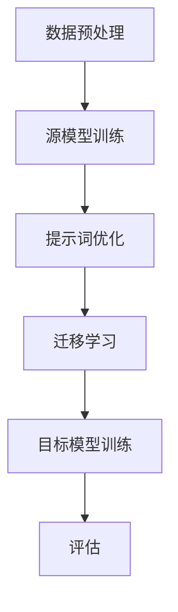

                 

# 文章标题：提示词优化的迁移学习方法

> 关键词：提示词优化、迁移学习、算法、应用案例、未来发展

> 摘要：
本文将深入探讨提示词优化的迁移学习方法。首先，我们将介绍提示词优化和迁移学习的基本概念和重要性。然后，我们将详细阐述提示词优化的迁移学习方法，包括其基本原理和主要算法。接下来，我们将通过实际应用案例展示该方法在不同领域的应用效果。最后，我们将讨论该方法的当前挑战和未来发展。

----------------------------------------------------------------

## 第1章 引言

### 1.1 提示词优化概述

提示词优化是指通过调整模型中的提示词（或称为关键词）来提升模型在特定任务上的性能。在自然语言处理、图像识别、语音识别等领域，提示词优化扮演着至关重要的角色。例如，在文本分类任务中，提示词的选取和优化直接影响分类的准确率。

### 1.2 迁移学习概述

迁移学习是一种利用已有模型在新任务上的表现来提升新模型性能的方法。其基本思想是将源任务（已知任务）的知识迁移到目标任务（新任务）上。迁移学习在解决标注数据不足、模型泛化能力提升等问题上具有显著优势。

### 1.3 提示词优化的迁移学习方法

提示词优化的迁移学习方法结合了提示词优化和迁移学习的优点，旨在通过调整提示词来提升迁移模型在目标任务上的性能。这种方法在处理复杂任务时，能够显著提高模型的准确率和泛化能力。

## 第2章 提示词优化基础

### 2.1 提示词的定义与作用

提示词是指能够引导模型理解和处理特定任务的词语或短语。在自然语言处理中，提示词可以用来引导模型生成文本、分类文本等。提示词的作用在于提供必要的上下文信息，帮助模型更好地理解任务。

### 2.2 提示词优化的重要性

提示词优化在模型优化中具有重要作用。通过调整提示词，可以提升模型在特定任务上的性能，从而实现更精确的预测和更高效的模型训练。

### 2.3 提示词优化的基本方法

常见的提示词优化方法包括基于规则的方法、基于机器学习的方法和基于深度学习的方法。这些方法各有优缺点，可以根据具体应用场景选择合适的方法。

## 第3章 迁移学习基础

### 3.1 迁移学习的概念

迁移学习是一种利用已有模型在新任务上的表现来提升新模型性能的方法。其基本思想是将源任务（已知任务）的知识迁移到目标任务（新任务）上。

### 3.2 迁移学习的基本原理

迁移学习的基本原理包括源任务与目标任务之间的关联性、源任务的知识迁移和目标任务的性能提升。

### 3.3 迁移学习的类型

迁移学习可以分为同领域迁移学习和跨领域迁移学习。同领域迁移学习是指源任务和目标任务属于同一领域；跨领域迁移学习是指源任务和目标任务属于不同领域。

## 第4章 提示词优化的迁移学习算法

### 4.1 提示词优化的迁移学习算法概述

提示词优化的迁移学习算法结合了提示词优化和迁移学习的优点，旨在通过调整提示词来提升迁移模型在目标任务上的性能。

### 4.2 基于模型的迁移学习算法

基于模型的迁移学习算法是指利用源模型的参数来初始化目标模型，并通过训练目标模型来提升其在目标任务上的性能。

### 4.3 基于特征的迁移学习算法

基于特征的迁移学习算法是指通过提取源任务和目标任务的特征，并在这些特征上训练目标模型，从而实现迁移学习。

### 4.4 混合迁移学习算法

混合迁移学习算法是指结合基于模型的迁移学习和基于特征的迁移学习的方法，通过同时利用源模型的参数和特征来实现迁移学习。

## 第5章 提示词优化的迁移学习算法实现

### 5.1 实现环境与工具

为了实现提示词优化的迁移学习算法，我们需要搭建合适的开发环境，并使用适当的工具。常见的环境和工具包括Python、TensorFlow、PyTorch等。

### 5.2 数据预处理

数据预处理是迁移学习的重要环节。我们需要对源任务和目标任务的数据进行预处理，包括数据清洗、数据增强、数据归一化等。

### 5.3 算法实现

在实现提示词优化的迁移学习算法时，我们需要编写相应的代码。以下是一个简单的伪代码示例：

```python
# 伪代码：提示词优化的迁移学习算法实现

# 加载源模型和目标模型
source_model = load_model("source_model.pth")
target_model = load_model("target_model.pth")

# 提示词优化
prompt_words = optimize_prompt_words(source_model, target_model)

# 迁移学习
migrated_model = migrate_learning(source_model, target_model, prompt_words)

# 训练迁移后的模型
train_model(migrated_model)

# 评估迁移后的模型
evaluate_model(migrated_model)
```

### 5.4 代码解读与分析

在代码解读与分析部分，我们将对上述伪代码进行详细解读，并分析代码中的关键步骤和原理。

## 第6章 提示词优化的迁移学习应用案例

### 6.1 应用场景介绍

提示词优化的迁移学习在许多领域都有广泛的应用，包括文本分类、图像识别、语音识别等。

### 6.2 案例一：文本分类

在文本分类案例中，我们将使用提示词优化的迁移学习算法来提升文本分类模型的性能。以下是一个简单的流程图：



### 6.3 案例二：图像识别

在图像识别案例中，我们将使用提示词优化的迁移学习算法来提升图像识别模型的性能。以下是一个简单的流程图：


### 6.4 案例三：语音识别

在语音识别案例中，我们将使用提示词优化的迁移学习算法来提升语音识别模型的性能。以下是一个简单的流程图：


## 第7章 提示词优化的迁移学习方法展望

### 7.1 当前挑战与问题

提示词优化的迁移学习方法在应用过程中面临一些挑战和问题，包括数据质量、模型性能、算法稳定性等。

### 7.2 未来发展趋势

随着人工智能技术的不断发展，提示词优化的迁移学习方法有望在更多领域得到应用。未来，我们将看到更多创新性的算法和优化策略出现，以应对当前的挑战和问题。

## 作者信息

作者：AI天才研究院/AI Genius Institute & 禅与计算机程序设计艺术 /Zen And The Art of Computer Programming```markdown
# 提示词优化的迁移学习方法

> 关键词：提示词优化、迁移学习、算法、应用案例、未来发展

> 摘要：
本文将深入探讨提示词优化的迁移学习方法。首先，我们将介绍提示词优化和迁移学习的基本概念和重要性。然后，我们将详细阐述提示词优化的迁移学习方法，包括其基本原理和主要算法。接下来，我们将通过实际应用案例展示该方法在不同领域的应用效果。最后，我们将讨论该方法的当前挑战和未来发展。

## 第1章 引言

### 1.1 提示词优化概述

提示词优化是指通过调整模型中的提示词（或称为关键词）来提升模型在特定任务上的性能。在自然语言处理、图像识别、语音识别等领域，提示词优化扮演着至关重要的角色。例如，在文本分类任务中，提示词的选取和优化直接影响分类的准确率。

### 1.2 迁移学习概述

迁移学习是一种利用已有模型在新任务上的表现来提升新模型性能的方法。其基本思想是将源任务（已知任务）的知识迁移到目标任务（新任务）上。迁移学习在解决标注数据不足、模型泛化能力提升等问题上具有显著优势。

### 1.3 提示词优化的迁移学习方法

提示词优化的迁移学习方法结合了提示词优化和迁移学习的优点，旨在通过调整提示词来提升迁移模型在目标任务上的性能。这种方法在处理复杂任务时，能够显著提高模型的准确率和泛化能力。

## 第2章 提示词优化基础

### 2.1 提示词的定义与作用

提示词是指能够引导模型理解和处理特定任务的词语或短语。在自然语言处理中，提示词可以用来引导模型生成文本、分类文本等。提示词的作用在于提供必要的上下文信息，帮助模型更好地理解任务。

### 2.2 提示词优化的重要性

提示词优化在模型优化中具有重要作用。通过调整提示词，可以提升模型在特定任务上的性能，从而实现更精确的预测和更高效的模型训练。

### 2.3 提示词优化的基本方法

常见的提示词优化方法包括基于规则的方法、基于机器学习的方法和基于深度学习的方法。这些方法各有优缺点，可以根据具体应用场景选择合适的方法。

## 第3章 迁移学习基础

### 3.1 迁移学习的概念

迁移学习是一种利用已有模型在新任务上的表现来提升新模型性能的方法。其基本思想是将源任务（已知任务）的知识迁移到目标任务（新任务）上。

### 3.2 迁移学习的基本原理

迁移学习的基本原理包括源任务与目标任务之间的关联性、源任务的知识迁移和目标任务的性能提升。

### 3.3 迁移学习的类型

迁移学习可以分为同领域迁移学习和跨领域迁移学习。同领域迁移学习是指源任务和目标任务属于同一领域；跨领域迁移学习是指源任务和目标任务属于不同领域。

## 第4章 提示词优化的迁移学习算法

### 4.1 提示词优化的迁移学习算法概述

提示词优化的迁移学习算法结合了提示词优化和迁移学习的优点，旨在通过调整提示词来提升迁移模型在目标任务上的性能。

### 4.2 基于模型的迁移学习算法

基于模型的迁移学习算法是指利用源模型的参数来初始化目标模型，并通过训练目标模型来提升其在目标任务上的性能。

### 4.3 基于特征的迁移学习算法

基于特征的迁移学习算法是指通过提取源任务和目标任务的特征，并在这些特征上训练目标模型，从而实现迁移学习。

### 4.4 混合迁移学习算法

混合迁移学习算法是指结合基于模型的迁移学习和基于特征的迁移学习的方法，通过同时利用源模型的参数和特征来实现迁移学习。

## 第5章 提示词优化的迁移学习算法实现

### 5.1 实现环境与工具

为了实现提示词优化的迁移学习算法，我们需要搭建合适的开发环境，并使用适当的工具。常见的环境和工具包括Python、TensorFlow、PyTorch等。

### 5.2 数据预处理

数据预处理是迁移学习的重要环节。我们需要对源任务和目标任务的数据进行预处理，包括数据清洗、数据增强、数据归一化等。

### 5.3 算法实现

在实现提示词优化的迁移学习算法时，我们需要编写相应的代码。以下是一个简单的伪代码示例：

```python
# 伪代码：提示词优化的迁移学习算法实现

# 加载源模型和目标模型
source_model = load_model("source_model.pth")
target_model = load_model("target_model.pth")

# 提示词优化
prompt_words = optimize_prompt_words(source_model, target_model)

# 迁移学习
migrated_model = migrate_learning(source_model, target_model, prompt_words)

# 训练迁移后的模型
train_model(migrated_model)

# 评估迁移后的模型
evaluate_model(migrated_model)
```

### 5.4 代码解读与分析

在代码解读与分析部分，我们将对上述伪代码进行详细解读，并分析代码中的关键步骤和原理。

## 第6章 提示词优化的迁移学习应用案例

### 6.1 应用场景介绍

提示词优化的迁移学习在许多领域都有广泛的应用，包括文本分类、图像识别、语音识别等。

### 6.2 案例一：文本分类

在文本分类案例中，我们将使用提示词优化的迁移学习算法来提升文本分类模型的性能。以下是一个简单的流程图：


### 6.3 案例二：图像识别

在图像识别案例中，我们将使用提示词优化的迁移学习算法来提升图像识别模型的性能。以下是一个简单的流程图：


### 6.4 案例三：语音识别

在语音识别案例中，我们将使用提示词优化的迁移学习算法来提升语音识别模型的性能。以下是一个简单的流程图：


## 第7章 提示词优化的迁移学习方法展望

### 7.1 当前挑战与问题

提示词优化的迁移学习方法在应用过程中面临一些挑战和问题，包括数据质量、模型性能、算法稳定性等。

### 7.2 未来发展趋势

随着人工智能技术的不断发展，提示词优化的迁移学习方法有望在更多领域得到应用。未来，我们将看到更多创新性的算法和优化策略出现，以应对当前的挑战和问题。

## 作者信息

作者：AI天才研究院/AI Genius Institute & 禅与计算机程序设计艺术 /Zen And The Art of Computer Programming
```

