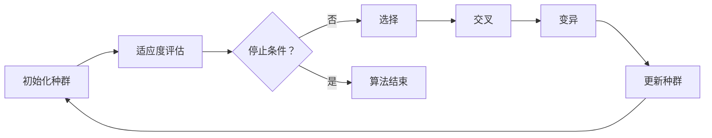

                 

### 文章标题

# 提示词优化的遗传算法应用

---

> 关键词：遗传算法、提示词优化、算法应用、自然语言处理、计算机视觉、数据挖掘

> 摘要：本文深入探讨了提示词优化的遗传算法应用。首先介绍了遗传算法和提示词优化的基本概念，然后详细讲解了遗传算法的基本原理和关键组件，以及提示词优化的背景和应用场景。随后，通过实际案例展示了遗传算法在提示词优化中的应用，并详细阐述了实现过程和优化策略。最后，对遗传算法在提示词优化领域的未来发展趋势进行了展望。

---

### 第1章 引言与背景

遗传算法是一种模拟自然界生物进化的搜索算法，最初由John Holland在1970年代提出。它通过模拟自然选择和遗传机制来寻找最优解，广泛应用于优化问题、机器学习和人工智能等领域。

提示词优化是指通过调整和优化提示词，以提高文本分类、信息检索、机器翻译等任务的性能。在自然语言处理（NLP）中，提示词优化是一项关键任务，能够显著提升模型的准确性和鲁棒性。

将遗传算法应用于提示词优化，可以借助遗传算法强大的全局搜索能力和适应性，有效地优化提示词，从而提高任务性能。这种结合不仅能够解决传统的启发式算法难以处理的问题，还能够为NLP领域带来新的思路和方法。

本章将首先介绍遗传算法的基本概念和原理，然后讨论提示词优化的背景和重要性，最后探讨遗传算法与提示词优化的结合背景。

#### 1.1 遗传算法简介

遗传算法（Genetic Algorithm, GA）是一种基于自然选择和遗传学的搜索算法。它的核心思想是模拟生物进化过程，通过选择、交叉和变异等操作来不断优化搜索过程，最终找到问题的最优解。

遗传算法的基本原理可以概括为以下几个步骤：

1. **初始化种群**：首先生成一组随机解，称为初始种群。这些解可以是二进制编码、实数编码或其他形式的编码。
2. **适应度评估**：对每个个体计算适应度值，适应度值反映了个体对问题的解决能力。通常，适应度值越高，个体的质量越好。
3. **选择**：从当前种群中选择出适应度较高的个体，用于产生下一代种群。选择操作通常基于适应度比例，即每个个体被选中的概率与其适应度值成正比。
4. **交叉**：随机选择两个个体进行交叉操作，生成新的个体。交叉操作模拟了生物中的繁殖过程，通过将两个个体的基因组合起来，产生新的解。
5. **变异**：对个体进行变异操作，即在个体的基因中随机改变某些基因的值。变异操作可以增加种群的多样性，防止算法陷入局部最优。
6. **更新种群**：将交叉和变异操作产生的新个体与原种群组合，形成新的种群。
7. **重复上述步骤**：不断迭代上述步骤，直到满足停止条件，如达到最大迭代次数、适应度值达到预设阈值等。

遗传算法的核心概念包括：

- **个体**：个体是遗传算法中的基本搜索单位，通常表示为一个编码的解。
- **种群**：种群是一组个体的集合，代表了算法在某一时刻的搜索状态。
- **适应度**：适应度是评估个体优劣的指标，反映了个体对问题的解决能力。
- **选择**：选择是遗传算法的核心操作之一，用于从当前种群中选择出优秀的个体。
- **交叉**：交叉是遗传算法中产生新个体的主要方式，通过将两个个体的基因组合来生成新的解。
- **变异**：变异是增加种群多样性的重要操作，通过随机改变个体的基因值来探索新的搜索空间。

遗传算法的特点包括：

- **全局搜索能力**：遗传算法能够跳出局部最优，探索全局最优解。
- **适应性**：遗传算法能够适应不同类型的问题，具有较强的通用性。
- **并行搜索**：遗传算法在多个个体上同时进行搜索，具有较高的效率。
- **鲁棒性**：遗传算法对噪声和不确定性具有较强的鲁棒性。

遗传算法在许多领域都有成功的应用，如优化问题、机器学习、人工智能等。其在组合优化问题中，如旅行商问题（TSP）、调度问题等，表现出强大的搜索能力和效率。在机器学习中，遗传算法可用于特征选择、模型优化等任务。在人工智能领域，遗传算法被广泛应用于进化算法、自适应系统等。

#### 1.2 提示词优化简介

提示词优化（Query Term Optimization, QTO）是指通过调整和优化查询词（提示词），以提高文本分类、信息检索、机器翻译等任务的性能。在自然语言处理（NLP）中，提示词优化是一项关键任务，能够显著提升模型的准确性和鲁棒性。

提示词优化的核心目标是找到一组最佳的查询词，使其能够有效地描述查询需求，从而提高检索系统的效果。提示词优化的方法主要包括：

1. **手动调整**：通过人工经验和直觉，调整查询词的权重和组合，以优化检索结果。这种方法需要丰富的领域知识和经验，但效果有限且耗时。
2. **基于统计的方法**：利用统计模型，如词频统计、TF-IDF模型等，对查询词进行自动调整。这种方法可以自动生成最佳的查询词组合，但效果受限于模型的准确性和适用性。
3. **基于机器学习的方法**：利用机器学习算法，如决策树、支持向量机等，对查询词进行优化。这种方法可以根据历史数据自动调整查询词的权重和组合，但需要大量的训练数据和计算资源。

提示词优化的背景主要源于信息检索和自然语言处理领域的需求。随着互联网和大数据的快速发展，信息检索系统面临着海量的文本数据和处理复杂查询的需求。如何有效地组织和检索信息，提高用户满意度，成为了一个重要的研究课题。

提示词优化在NLP中的应用非常广泛，包括但不限于：

1. **文本分类**：通过调整查询词，提高分类系统的准确性和鲁棒性，如新闻分类、垃圾邮件过滤等。
2. **信息检索**：通过优化查询词，提高检索系统的效果，如搜索引擎、文档检索等。
3. **机器翻译**：通过调整查询词，优化翻译结果的质量，如机器翻译系统、自动摘要等。
4. **推荐系统**：通过优化查询词，提高推荐系统的准确性和用户体验，如电子商务、社交网络等。

提示词优化的意义在于：

- 提高检索系统的效果，满足用户的需求。
- 降低人工干预的成本，提高系统的自动化程度。
- 提升模型的准确性和鲁棒性，应对复杂多变的查询场景。
- 为其他NLP任务提供高质量的输入，如文本生成、问答系统等。

#### 1.3 遗传算法与提示词优化的结合背景

遗传算法在提示词优化中的应用，源于其在全局搜索能力和适应性方面的优势。传统的提示词优化方法往往局限于局部搜索，难以找到全局最优解。而遗传算法作为一种全局搜索算法，能够有效地克服这一问题，从而提高提示词优化的效果。

将遗传算法应用于提示词优化，主要有以下几个原因：

1. **全局搜索能力**：遗传算法能够跳出局部最优，探索全局最优解。这在提示词优化中尤为重要，因为查询词的组合和权重调整是一个高度非线性的过程，容易出现局部最优。

2. **适应性**：遗传算法能够适应不同类型的问题，具有较强的通用性。提示词优化的场景多种多样，如文本分类、信息检索、机器翻译等，遗传算法能够灵活地应用于这些场景。

3. **并行搜索**：遗传算法在多个个体上同时进行搜索，具有较高的效率。这使得遗传算法在处理大规模数据集时，表现出强大的优势。

4. **鲁棒性**：遗传算法对噪声和不确定性具有较强的鲁棒性。在提示词优化中，数据集往往存在噪声和不确定性，遗传算法能够较好地处理这些问题。

遗传算法与提示词优化的结合，可以带来以下几个方面的优势：

1. **提高优化效果**：遗传算法能够找到更高质量的查询词组合，从而提高文本分类、信息检索、机器翻译等任务的性能。

2. **降低人工干预**：遗传算法能够自动调整查询词的权重和组合，减少人工干预的需求，提高系统的自动化程度。

3. **增强模型鲁棒性**：遗传算法能够处理复杂的查询场景和噪声数据，提高模型的准确性和鲁棒性。

4. **拓展应用场景**：遗传算法在提示词优化中的应用，可以拓展到其他NLP任务，如文本生成、问答系统等。

然而，将遗传算法应用于提示词优化也面临一些挑战，如算法的参数调优、计算复杂度等。需要进一步研究如何优化遗传算法，提高其在提示词优化中的性能。

### 第2章 遗传算法基础

遗传算法（Genetic Algorithm, GA）是一种基于自然选择和遗传学的搜索算法，最初由John Holland在1970年代提出。它通过模拟自然选择和遗传机制来寻找最优解，广泛应用于优化问题、机器学习和人工智能等领域。

#### 2.1 遗传算法基本原理

遗传算法的基本原理可以概括为以下几个步骤：

1. **初始化种群**：首先生成一组随机解，称为初始种群。这些解可以是二进制编码、实数编码或其他形式的编码。
2. **适应度评估**：对每个个体计算适应度值，适应度值反映了个体对问题的解决能力。通常，适应度值越高，个体的质量越好。
3. **选择**：从当前种群中选择出适应度较高的个体，用于产生下一代种群。选择操作通常基于适应度比例，即每个个体被选中的概率与其适应度值成正比。
4. **交叉**：随机选择两个个体进行交叉操作，生成新的个体。交叉操作模拟了生物中的繁殖过程，通过将两个个体的基因组合起来，产生新的解。
5. **变异**：对个体进行变异操作，即在个体的基因中随机改变某些基因的值。变异操作可以增加种群的多样性，防止算法陷入局部最优。
6. **更新种群**：将交叉和变异操作产生的新个体与原种群组合，形成新的种群。
7. **重复上述步骤**：不断迭代上述步骤，直到满足停止条件，如达到最大迭代次数、适应度值达到预设阈值等。

遗传算法的核心概念包括：

- **个体**：个体是遗传算法中的基本搜索单位，通常表示为一个编码的解。
- **种群**：种群是一组个体的集合，代表了算法在某一时刻的搜索状态。
- **适应度**：适应度是评估个体优劣的指标，反映了个体对问题的解决能力。
- **选择**：选择是遗传算法的核心操作之一，用于从当前种群中选择出优秀的个体。
- **交叉**：交叉是遗传算法中产生新个体的主要方式，通过将两个个体的基因组合来生成新的解。
- **变异**：变异是增加种群多样性的重要操作，通过随机改变个体的基因值来探索新的搜索空间。

遗传算法的特点包括：

- **全局搜索能力**：遗传算法能够跳出局部最优，探索全局最优解。
- **适应性**：遗传算法能够适应不同类型的问题，具有较强的通用性。
- **并行搜索**：遗传算法在多个个体上同时进行搜索，具有较高的效率。
- **鲁棒性**：遗传算法对噪声和不确定性具有较强的鲁棒性。

遗传算法在许多领域都有成功的应用，如优化问题、机器学习、人工智能等。其在组合优化问题中，如旅行商问题（TSP）、调度问题等，表现出强大的搜索能力和效率。在机器学习中，遗传算法可用于特征选择、模型优化等任务。在人工智能领域，遗传算法被广泛应用于进化算法、自适应系统等。

#### 2.2 遗传算法的基本架构

遗传算法的基本架构包括以下几个关键组件：

1. **编码**：编码是将问题的解表示为一组编码串的过程。常见的编码方式包括二进制编码、实数编码、格雷码等。编码的目的在于将问题的解与计算机中的数字表示建立联系，以便于算法处理。
   
2. **适应度评估**：适应度评估是计算每个个体的适应度值的过程。适应度值反映了个体对问题的解决能力，通常越高的适应度值表示个体质量越好。适应度评估是遗传算法的核心步骤，其准确性直接影响到算法的性能。

3. **选择**：选择是从当前种群中选择出优秀个体的过程。常见的选择方法有轮盘赌选择、锦标赛选择等。选择操作旨在确保优秀的个体能够遗传到下一代，从而逐渐提升种群的整体质量。

4. **交叉**：交叉是遗传算法中产生新个体的主要方式，通过将两个个体的基因组合起来生成新的解。交叉操作模拟了生物中的繁殖过程，能够增加种群的多样性和探索能力。常见的交叉方法有单点交叉、多点交叉等。

5. **变异**：变异是对个体进行随机改变的过程，通过在个体的基因中随机改变某些基因的值来增加种群的多样性，防止算法陷入局部最优。变异操作是遗传算法中的关键步骤，其目的是避免种群在进化过程中过早收敛。

6. **更新种群**：更新种群是将交叉和变异操作产生的新个体与原种群组合的过程。通过更新种群，算法能够不断优化解的集合，逐步接近最优解。

7. **迭代过程**：遗传算法通过不断迭代上述步骤，逐步优化种群中的解。每次迭代后，种群的整体质量都会有所提升，直至满足停止条件（如达到最大迭代次数或适应度值达到预设阈值）。

遗传算法的基本架构可以用以下流程图来表示：



#### 2.3 遗传算法的关键组件详解

遗传算法的核心组件包括编码、适应度评估、选择、交叉和变异。以下是对这些组件的详细讲解。

##### 2.3.1 编码

编码是将问题的解表示为一组编码串的过程。编码方式的选择对遗传算法的性能有很大影响。常见的编码方式有二进制编码、实数编码和格雷码等。

- **二进制编码**：二进制编码是将个体的每个基因表示为0或1的字符串。这种方法简单直观，但可能导致较多的数值表示错误。例如，一个实数范围[0, 1]的二进制编码可能会产生较多的精度损失。
  
- **实数编码**：实数编码是将个体的每个基因表示为一个实数，通常在[0, 1]或[-1, 1]的范围内。这种方法能够更好地表示实数值，但需要额外的计算来处理离散实数的连续性。

- **格雷码**：格雷码是一种将二进制编码转换为等价的形式，使得相邻的编码只有一个位不同。这种方法能够减少数值表示错误，提高编码的鲁棒性。

编码的具体实现取决于问题的性质。例如，对于连续优化问题，可以使用实数编码；对于组合优化问题，如旅行商问题，可以使用二进制编码。

##### 2.3.2 适应度评估

适应度评估是计算每个个体的适应度值的过程。适应度值反映了个体对问题的解决能力，是遗传算法选择操作的重要依据。适应度评估函数的设计对算法的性能有很大影响。

适应度评估函数的设计原则包括：

- **正确性**：适应度值应该准确地反映个体对问题的解决能力，即适应度值越高，个体质量越好。
- **单调性**：适应度值应与个体的质量呈单调增加关系，即个体质量越高，适应度值越大。
- **连续性**：适应度值应具有一定的连续性，避免出现突变。

常见的适应度评估方法有：

- **基于目标函数**：直接使用目标函数值作为适应度值，目标函数越小，个体质量越好。
- **基于概率**：通过计算个体满足某种条件的概率来评估适应度值，概率越大，个体质量越好。
- **基于排序**：将个体按质量排序，质量越高的个体适应度值越大。

适应度评估函数的具体实现取决于问题的性质。例如，在优化问题中，可以使用目标函数值作为适应度值；在组合优化问题中，可以使用个体满足约束条件的概率作为适应度值。

##### 2.3.3 选择

选择是从当前种群中选择出优秀个体的过程。选择操作旨在确保优秀的个体能够遗传到下一代，从而逐渐提升种群的整体质量。选择操作常用的方法有轮盘赌选择、锦标赛选择等。

- **轮盘赌选择**：轮盘赌选择是一种基于适应度比例的选择方法。首先计算每个个体的适应度比例，即每个个体被选中的概率与其适应度值成正比。然后按照这些概率随机选择个体，形成新的种群。

- **锦标赛选择**：锦标赛选择是一种基于多个个体竞争的选择方法。首先随机选择多个个体（如两个或三个），比较它们的适应度值，选择适应度最高的个体作为新的种群的一部分。

选择操作的目的是确保优秀的个体能够遗传到下一代，从而逐渐提升种群的整体质量。选择操作的设计对遗传算法的性能有很大影响。

##### 2.3.4 交叉

交叉是遗传算法中产生新个体的主要方式，通过将两个个体的基因组合起来生成新的解。交叉操作模拟了生物中的繁殖过程，能够增加种群的多样性和探索能力。交叉操作常用的方法有单点交叉、多点交叉等。

- **单点交叉**：单点交叉是在个体的基因中随机选择一个交叉点，将两个个体的基因从交叉点开始交换。这种方法简单直观，但可能导致交叉后的个体质量下降。
  
- **多点交叉**：多点交叉是在个体的基因中随机选择多个交叉点，将两个个体的基因从这些交叉点开始交换。这种方法能够更好地保持个体的质量，但计算复杂度较高。

交叉操作的具体实现取决于问题的性质。例如，在二进制编码中，可以使用单点交叉；在实数编码中，可以使用多点交叉。

##### 2.3.5 变异

变异是对个体进行随机改变的过程，通过在个体的基因中随机改变某些基因的值来增加种群的多样性，防止算法陷入局部最优。变异操作是遗传算法中的关键步骤，其目的是避免种群在进化过程中过早收敛。

变异操作常用的方法有随机变异、增量变异等。

- **随机变异**：随机变异是在个体的基因中随机选择一个或多个基因，将其值改变为一个随机值。这种方法简单直观，但可能导致个体的质量下降。
  
- **增量变异**：增量变异是在个体的基因中随机选择一个或多个基因，将其值增加或减少一个较小的增量。这种方法能够更好地保持个体的质量，但需要调整增量的大小。

变异操作的具体实现取决于问题的性质。例如，在二进制编码中，可以使用随机变异；在实数编码中，可以使用增量变异。

##### 2.3.6 更新种群

更新种群是将交叉和变异操作产生的新个体与原种群组合的过程。通过更新种群，算法能够不断优化解的集合，逐步接近最优解。

更新种群的方法有：

- **完全替代**：完全替代是将新个体完全替代原种群中的个体。这种方法能够快速提升种群的整体质量，但可能导致种群多样性的下降。
  
- ** elitism（精英策略）**：精英策略是将部分优秀个体保留到下一代，然后将新个体替代其余个体。这种方法能够保持种群多样性和优秀个体的质量。

更新种群的方法对遗传算法的性能有很大影响。完全替代方法能够快速提升种群的整体质量，但可能导致种群多样性的下降；精英策略能够保持种群多样性和优秀个体的质量，但可能较慢地提升种群的整体质量。

#### 2.4 遗传算法的数学模型与伪代码

遗传算法的数学模型和伪代码是实现遗传算法的核心。以下将详细介绍遗传算法的数学模型和伪代码，并通过具体实例进行说明。

##### 2.4.1 数学模型

遗传算法的数学模型主要包括编码、适应度评估、选择、交叉、变异和更新种群等步骤。以下是对这些步骤的数学描述。

1. **编码**

   编码是将个体的解表示为一组编码串的过程。常见的编码方式有二进制编码和实数编码。

   - **二进制编码**：假设问题有n个变量，每个变量可以取m个值，则二进制编码表示为长度为n的字符串，其中每个字符取值为0或1。
   - **实数编码**：实数编码将每个变量表示为一个实数，通常在[0, 1]或[-1, 1]的范围内。

2. **适应度评估**

   适应度评估是计算每个个体的适应度值的过程。适应度值反映了个体对问题的解决能力，通常使用目标函数值或某种优化指标进行评估。

   假设个体的解为\(x = (x_1, x_2, ..., x_n)\)，则适应度值\(f(x)\)可以表示为：

   $$ f(x) = -f_{\text{obj}}(x) $$

   其中，\(f_{\text{obj}}(x)\)为目标函数值，负号用于确保适应度值越大，个体质量越好。

3. **选择**

   选择是从当前种群中选择出优秀个体的过程。选择方法有轮盘赌选择、锦标赛选择等。

   - **轮盘赌选择**：轮盘赌选择是基于适应度比例的选择方法。假设种群中有m个个体，其适应度值分别为\(f(x_1), f(x_2), ..., f(x_m)\)，则个体被选中的概率为：

     $$ p_i = \frac{f(x_i)}{\sum_{i=1}^{m} f(x_i)} $$

   - **锦标赛选择**：锦标赛选择是基于多个个体竞争的选择方法。假设有k个个体参与竞争，其适应度值分别为\(f(x_1), f(x_2), ..., f(x_k)\)，则适应度最高的个体被选中。

4. **交叉**

   交叉是遗传算法中产生新个体的主要方式。交叉操作通过将两个个体的基因组合起来生成新的解。

   - **单点交叉**：单点交叉是在个体的基因中随机选择一个交叉点，将两个个体的基因从交叉点开始交换。假设父代个体为\(x_1\)和\(x_2\)，交叉点为i，则交叉后的子代为：

     $$ x_1' = (x_1[1:i], x_2[i+1:end]) $$
     $$ x_2' = (x_2[1:i], x_1[i+1:end]) $$

   - **多点交叉**：多点交叉是在个体的基因中随机选择多个交叉点，将两个个体的基因从这些交叉点开始交换。假设父代个体为\(x_1\)和\(x_2\)，交叉点为i1, i2, ..., ik，则交叉后的子代为：

     $$ x_1' = (x_1[1:i1], x_2[i1+1:i2], x_1[i2+1:i3], ..., x_2[ik+1:end]) $$
     $$ x_2' = (x_2[1:i1], x_1[i1+1:i2], x_2[i2+1:i3], ..., x_1[ik+1:end]) $$

5. **变异**

   变异是对个体进行随机改变的过程。变异操作通过在个体的基因中随机改变某些基因的值来增加种群的多样性。

   - **随机变异**：随机变异是在个体的基因中随机选择一个或多个基因，将其值改变为一个随机值。假设个体为\(x\)，变异概率为\(p_m\)，则变异后的个体为：

     $$ x' = (x[1], x[2], ..., x[i_m], ..., x[n]) $$

     其中，\(x[i_m]\)为被变异的基因，新的基因值为：

     $$ x'[i_m] = x[i_m] + \eta \cdot (rand() - 0.5) $$

     其中，\(\eta\)为变异幅度，\(rand()\)为随机数生成函数。

6. **更新种群**

   更新种群是将交叉和变异操作产生的新个体与原种群组合的过程。更新种群的方法有完全替代和精英策略等。

   - **完全替代**：完全替代是将新个体完全替代原种群中的个体。假设种群中有m个个体，新个体为\(x_1', x_2', ..., x_n'\)，则更新后的种群为：

     $$ P' = (x_1', x_2', ..., x_n') $$

   - **精英策略**：精英策略是将部分优秀个体保留到下一代，然后将新个体替代其余个体。假设种群中有m个个体，精英个数为k，新个体为\(x_1', x_2', ..., x_n'\)，则更新后的种群为：

     $$ P' = (x_1, x_2, ..., x_k, x_1', x_2', ..., x_{m-k}') $$

##### 2.4.2 伪代码

以下是一个简单的遗传算法伪代码，描述了遗传算法的基本步骤。

```
初始化种群 P
设置适应度评估函数 f(x)
设置交叉概率 p_c 和变异概率 p_m
设置最大迭代次数 max_gen

for gen = 1 to max_gen do
    评估适应度 f(x) for each individual in P
    选择 new_P from P using selection method (e.g., tournament selection)
    交叉 new_P using crossover method (e.g., single-point crossover)
    变异 new_P using mutation method
    更新种群 P = new_P
end for

输出最佳个体
```

##### 2.4.3 具体实例

以下是一个简单的实例，展示如何使用遗传算法优化一个二进制编码的函数最小值问题。

1. **问题定义**：要求最小化函数$f(x) = x^2$，其中$x$为二进制编码的实数。
2. **编码**：将变量$x$表示为一个长度为8的二进制编码。
3. **适应度评估**：适应度值为函数$f(x)$的相反数，即$-f(x)$。
4. **选择**：使用轮盘赌选择。
5. **交叉**：使用单点交叉。
6. **变异**：使用随机变异。
7. **更新种群**：使用精英策略。

伪代码如下：

```
初始化种群 P
设置适应度评估函数 f(x) = -x^2
设置交叉概率 p_c = 0.8
设置变异概率 p_m = 0.1
设置最大迭代次数 max_gen = 100

for gen = 1 to max_gen do
    评估适应度 f(x) for each individual in P
    选择 new_P from P using roulette wheel selection
    交叉 new_P using single-point crossover
    变异 new_P using random mutation
    更新种群 P = new_P
end for

输出最佳个体
```

通过上述实例，我们可以看到如何将遗传算法应用于一个简单的函数优化问题。在实际应用中，遗传算法可以应用于更复杂的问题，如多目标优化、组合优化等。

### 第3章 提示词优化基础

提示词优化（Query Term Optimization, QTO）是指通过调整和优化查询词（提示词），以提高文本分类、信息检索、机器翻译等任务的性能。在自然语言处理（NLP）中，提示词优化是一项关键任务，能够显著提升模型的准确性和鲁棒性。

#### 3.1 提示词优化概述

提示词优化是指通过对查询词进行优化，以提高信息检索系统的效果。在信息检索中，查询词是用户用来描述查询需求的关键词汇。通过优化查询词，可以更好地匹配用户的意图和检索系统的索引内容，从而提高检索的准确性和效率。

提示词优化的核心目标包括：

1. **提高检索准确率**：优化查询词，使其更准确地描述用户的查询意图，从而提高检索系统的准确率。
2. **提高检索效率**：优化查询词，减少检索过程中所需的计算资源和时间，提高系统的响应速度。
3. **增强用户满意度**：优化查询词，提高检索结果的相关性，从而提升用户的满意度和体验。

提示词优化的方法主要包括：

1. **基于统计的方法**：利用统计模型，如词频统计、TF-IDF模型等，对查询词进行自动调整。这种方法可以自动生成最佳的查询词组合，但效果受限于模型的准确性和适用性。
2. **基于机器学习的方法**：利用机器学习算法，如决策树、支持向量机等，对查询词进行优化。这种方法可以根据历史数据自动调整查询词的权重和组合，但需要大量的训练数据和计算资源。
3. **基于深度学习的方法**：利用深度学习模型，如循环神经网络（RNN）、变换器（Transformer）等，对查询词进行优化。这种方法可以捕捉复杂的语义信息，但计算复杂度较高。

#### 3.2 提示词优化的应用场景

提示词优化在自然语言处理领域中有着广泛的应用，以下是一些典型的应用场景：

1. **文本分类**：在文本分类任务中，通过优化查询词，可以提高分类器的准确性。例如，在新闻分类中，通过优化查询词，可以更好地匹配不同类别的新闻特征，从而提高分类准确率。
   
2. **信息检索**：在信息检索系统中，通过优化查询词，可以提高检索结果的相关性。例如，在搜索引擎中，通过优化查询词，可以更好地匹配用户的查询意图和网页内容，从而提高检索的准确性和效率。

3. **机器翻译**：在机器翻译任务中，通过优化查询词，可以提高翻译结果的质量。例如，在翻译系统中，通过优化查询词，可以更好地捕捉源语言和目标语言之间的语义差异，从而提高翻译的准确性和流畅性。

4. **推荐系统**：在推荐系统中，通过优化查询词，可以提高推荐的质量。例如，在电子商务平台中，通过优化查询词，可以更好地匹配用户的行为和偏好，从而提高推荐的准确性和吸引力。

#### 3.3 提示词优化的重要性

提示词优化在自然语言处理领域具有重要意义，主要体现在以下几个方面：

1. **提高任务性能**：通过优化查询词，可以显著提高文本分类、信息检索、机器翻译等任务的性能。优化的查询词能够更好地描述用户的意图和任务目标，从而提高系统的准确性和效率。

2. **降低人工干预**：传统的提示词优化方法通常需要人工干预，如手动调整查询词的权重和组合。通过引入遗传算法等优化方法，可以自动化地优化查询词，减少人工干预的需求，提高系统的自动化程度。

3. **提升用户体验**：优化的查询词能够更好地匹配用户的意图，提高检索结果的相关性和准确性，从而提升用户的满意度和体验。在信息检索、推荐系统等场景中，良好的用户体验是系统成功的关键因素。

4. **应对复杂问题**：传统的启发式算法在处理复杂问题时，往往难以找到全局最优解。遗传算法等全局搜索算法能够跳出局部最优，探索全局最优解，从而应对复杂问题。

总之，提示词优化在自然语言处理领域具有重要的应用价值，通过优化查询词，可以显著提升任务的性能和用户体验，推动自然语言处理技术的发展。

### 第4章 遗传算法与提示词优化的结合

遗传算法（Genetic Algorithm, GA）在提示词优化（Query Term Optimization, QTO）中的应用，是结合了两者的优点，以提升自然语言处理任务的效果。这一章节将详细探讨遗传算法在提示词优化中的应用策略、优势以及面临的挑战。

#### 4.1 遗传算法在提示词优化中的应用策略

遗传算法在提示词优化中的应用策略主要包括以下几个方面：

1. **编码方式**：首先，需要将提示词编码为遗传算法中的个体。常见的编码方式包括二进制编码、实数编码和词向量编码。二进制编码适用于离散的查询词，而实数编码和词向量编码适用于连续的查询词。

2. **适应度评估**：适应度评估是遗传算法的核心。在提示词优化中，适应度值通常基于检索系统的评价指标，如准确率、召回率和F1分数。适应度值越高，表示查询词组合越优。

3. **选择操作**：选择操作用于从当前种群中选择出优秀个体。常用的选择方法包括轮盘赌选择、锦标赛选择和排名选择等。选择操作确保优秀的查询词组合能够传递到下一代。

4. **交叉操作**：交叉操作用于生成新的查询词组合。常见的交叉方法有单点交叉、多点交叉和部分映射交叉等。交叉操作模拟了生物繁殖过程，通过混合两个个体的基因来产生新的个体。

5. **变异操作**：变异操作用于增加种群的多样性。常见的变异方法有随机变异、逆变异和基因倒置等。变异操作有助于避免遗传算法过早收敛到局部最优。

6. **更新种群**：通过交叉和变异操作产生的新个体，与原种群组合形成新的种群。更新种群是遗传算法迭代过程中的关键步骤，确保种群不断进化。

#### 4.2 遗传算法在提示词优化中的优势

遗传算法在提示词优化中具有以下优势：

1. **全局搜索能力**：遗传算法能够跳出局部最优，探索全局最优解。在提示词优化中，查询词的组合和权重调整是一个高度非线性的过程，容易出现局部最优。遗传算法的全局搜索能力有助于找到更优的查询词组合。

2. **适应性强**：遗传算法适用于各种类型的优化问题，具有较强的通用性。提示词优化的场景多样，如文本分类、信息检索和机器翻译等。遗传算法能够适应不同类型的问题，为提示词优化提供了一种灵活的解决方案。

3. **并行搜索**：遗传算法在多个个体上同时进行搜索，具有较高的效率。在处理大规模数据集时，遗传算法能够并行处理多个查询词组合，提高优化速度。

4. **鲁棒性**：遗传算法对噪声和不确定性具有较强的鲁棒性。在提示词优化过程中，数据集可能存在噪声和不完整信息。遗传算法能够处理这些问题，提高系统的鲁棒性。

5. **自动化程度高**：遗传算法能够自动调整查询词的权重和组合，减少人工干预的需求。通过适应度评估和遗传操作，遗传算法能够自动寻找最优查询词组合，提高系统的自动化程度。

#### 4.3 遗传算法在提示词优化中的挑战

尽管遗传算法在提示词优化中具有许多优势，但也面临一些挑战：

1. **参数调优**：遗传算法的性能受到参数设置的影响，如种群大小、交叉率和变异率等。参数调优需要大量的实验和经验，以确保算法的性能。

2. **计算复杂度**：遗传算法的计算复杂度较高，特别是对于大规模数据集。在处理大规模问题时，遗传算法可能需要较长的运行时间。

3. **算法收敛速度**：遗传算法的收敛速度可能较慢，特别是在处理高维搜索空间时。为了提高收敛速度，可能需要增加迭代次数，从而增加计算成本。

4. **多样性维持**：在遗传算法的进化过程中，如何维持种群多样性是一个关键问题。过多的交叉和变异可能导致种群多样性降低，进而影响算法的性能。

5. **适应度评估的准确性**：适应度评估的准确性直接影响到遗传算法的性能。在提示词优化中，适应度评估函数的设计需要充分考虑查询词的组合和权重调整，以确保评估的准确性。

#### 4.4 遗传算法在提示词优化中的应用案例

以下是一个遗传算法在提示词优化中的应用案例：

**案例背景**：假设我们有一个信息检索系统，需要优化查询词组合以提高检索准确率。数据集包含大量的文本和用户查询记录。

**编码方式**：将查询词编码为二进制字符串，每个查询词对应一个二进制位。例如，查询词“苹果”和“手机”可以表示为“1010”和“1100”。

**适应度评估**：适应度值基于检索系统的准确率。我们计算每个查询词组合在测试集上的准确率，准确率越高，适应度值越高。

**选择操作**：使用轮盘赌选择，根据适应度值分配选择概率。适应度值较高的查询词组合被选中，传递到下一代。

**交叉操作**：使用单点交叉，随机选择交叉点，将两个查询词组合的部分基因进行交换。例如，交叉点为第3位，则新的查询词组合为：

- 原查询词组合1：“苹果手机”
- 原查询词组合2：“电脑手机”
- 新查询词组合1：“苹果电脑”
- 新查询词组合2：“电脑苹果”

**变异操作**：使用随机变异，对查询词组合的某个基因进行变异。例如，将“苹果”变异为“苹果树”，从而生成新的查询词组合。

**更新种群**：通过交叉和变异操作生成新的查询词组合，与原种群组合形成新的种群。在迭代过程中，不断优化查询词组合，提高检索准确率。

通过上述案例，我们可以看到遗传算法在提示词优化中的应用策略和优势。在实际应用中，可以根据具体问题和数据集调整编码方式、适应度评估、选择、交叉和变异操作，以提高优化效果。

### 第5章 遗传算法实现

在实现遗传算法时，首先需要选择合适的编码方式、适应度评估方法、选择、交叉和变异操作。以下将详细介绍这些关键组件的实现过程，并提供相应的伪代码和数学模型。

#### 5.1 编码方式

遗传算法的编码方式是将其问题解空间中的每个解映射到一个编码空间中。以下介绍几种常用的编码方式。

1. **二进制编码**：二进制编码适用于离散的优化问题。假设问题有n个变量，每个变量有m个可能的取值，则二进制编码表示为长度为n的字符串，其中每个字符表示一个变量的一个取值。
   
   **伪代码**：
   ```
   function binary_encoding(n, m)
       return random_string(n, ["0", "1"])
   end function
   ```

2. **实数编码**：实数编码适用于连续的优化问题。假设问题有n个变量，每个变量取值范围在[a, b]之间，则实数编码表示为长度为n的实数向量。

   **伪代码**：
   ```
   function real_encoding(n, a, b)
       return (b - a) * random_vector(n) + a
   end function
   ```

3. **词向量编码**：词向量编码适用于自然语言处理问题，如提示词优化。词向量是单词的嵌入表示，可以使用预训练的词向量或通过训练得到。

   **伪代码**：
   ```
   function word_vector_encoding(n, word_vectors)
       return [word_vectors[word] for word in query_terms]
   end function
   ```

#### 5.2 适应度评估

适应度评估是遗传算法的核心，用于评估每个个体的优劣。适应度值通常基于问题的目标函数或性能指标。

1. **目标函数评估**：假设问题有目标函数f(x)，则适应度值可以定义为f(x)的相反数。

   **伪代码**：
   ```
   function fitness(x)
       return -f(x)
   end function
   ```

2. **性能指标评估**：对于非优化问题，如分类问题，适应度值可以基于性能指标，如准确率、召回率和F1分数。

   **伪代码**：
   ```
   function fitness(x, y)
       return 1 - error_rate(x, y)
   end function
   ```

3. **多目标评估**：对于多目标优化问题，适应度值可以基于多目标函数的加权求和。

   **伪代码**：
   ```
   function fitness(x, weights)
       return -sum(weights[i] * f_i(x))
   end function
   ```

#### 5.3 选择操作

选择操作用于从当前种群中选择出优秀的个体，通常基于适应度值。以下介绍几种常用的选择方法。

1. **轮盘赌选择**：轮盘赌选择是一种基于概率的选择方法，个体被选中的概率与其适应度值成比例。

   **伪代码**：
   ```
   function roulette_wheel_selection(population, fitness_values)
       total_fitness = sum(fitness_values)
       probabilities = fitness_values / total_fitness
       selected_individuals = []
       for individual in population
           random_number = random(0, 1)
           cumulative_probability = 0
           for i in range(len(population))
               cumulative_probability += probabilities[i]
               if random_number < cumulative_probability
                   selected_individuals.append(individual[i])
                   break
           end for
       end for
       return selected_individuals
   end function
   ```

2. **锦标赛选择**：锦标赛选择通过随机选择多个个体进行比较，选择适应度最高的个体。

   **伪代码**：
   ```
   function tournament_selection(population, k)
       selected_individuals = []
       for _ in range(len(population))
           tournament_individuals = random.sample(population, k)
           best_individual = max(tournament_individuals, key=fitness)
           selected_individuals.append(best_individual)
       end for
       return selected_individuals
   end function
   ```

#### 5.4 交叉操作

交叉操作用于生成新的个体，通过混合两个或多个父代个体的基因。

1. **单点交叉**：单点交叉是在个体的基因中随机选择一个交叉点，将两个个体的基因从交叉点开始交换。

   **伪代码**：
   ```
   function single_point_crossover(parent1, parent2, crossover_point)
       child1 = parent1[:crossover_point] + parent2[crossover_point:]
       child2 = parent2[:crossover_point] + parent1[crossover_point:]
       return child1, child2
   end function
   ```

2. **多点交叉**：多点交叉是在个体的基因中随机选择多个交叉点，将两个个体的基因从这些交叉点开始交换。

   **伪代码**：
   ```
   function multi_point_crossover(parent1, parent2, crossover_points)
       children = []
       for i in range(len(crossover_points) - 1)
           child1 = parent1[:crossover_points[i]] + parent2[crossover_points[i]:crossover_points[i+1]]
           child2 = parent2[:crossover_points[i]] + parent1[crossover_points[i]:crossover_points[i+1]]
           children.append(child1)
           children.append(child2)
       end for
       return children
   end function
   ```

#### 5.5 变异操作

变异操作用于增加种群的多样性，通过随机改变个体的基因值。

1. **随机变异**：随机变异是在个体的基因中随机选择一个或多个基因，将其值改变为一个随机值。

   **伪代码**：
   ```
   function random_mutation(individual, mutation_rate)
       for gene in range(len(individual))
           if random() < mutation_rate
               individual[gene] = random_value()
           end if
       end for
       return individual
   end function
   ```

2. **逆变异**：逆变异是在个体的基因中随机选择一个基因，将其值反转。

   **伪代码**：
   ```
   function inverse_mutation(individual, mutation_rate)
       for gene in range(len(individual))
           if random() < mutation_rate
               individual[gene] = 1 - individual[gene]
           end if
       end for
       return individual
   end function
   ```

#### 5.6 遗传算法伪代码

以下是一个简单的遗传算法伪代码，包括初始化种群、适应度评估、选择、交叉、变异和更新种群等步骤。

```
function genetic_algorithm(population_size, generations, fitness_function, crossover_rate, mutation_rate)
    population = initialize_population(population_size)
    for generation in 1 to generations do
        fitness_values = evaluate_fitness(population, fitness_function)
        selected_individuals = selection(population, fitness_values, crossover_rate)
        children = crossover(selected_individuals, crossover_rate)
        mutated_individuals = mutate(children, mutation_rate)
        population = mutated_individuals
    end for
    best_individual = select_best_individual(population, fitness_function)
    return best_individual
end function
```

#### 5.7 数学模型与公式

遗传算法的数学模型包括适应度评估、选择、交叉、变异和更新种群等步骤。以下是一些关键的数学模型和公式：

1. **适应度评估**：
   $$ f(x) = -f_{\text{obj}}(x) $$
   其中，\( f_{\text{obj}}(x) \) 是目标函数。

2. **选择概率**（轮盘赌选择）：
   $$ p_i = \frac{f(x_i)}{\sum_{i=1}^{m} f(x_i)} $$
   其中，\( f(x_i) \) 是个体i的适应度值，\( p_i \) 是个体i被选中的概率。

3. **交叉概率**：
   $$ p_c = \frac{1}{\ln(1/f_{\text{max}})} $$
   其中，\( f_{\text{max}} \) 是种群中的最大适应度值。

4. **变异概率**：
   $$ p_m = \frac{1}{\ln(1/f_{\text{max}})} $$
   其中，\( f_{\text{max}} \) 是种群中的最大适应度值。

5. **变异幅度**：
   $$ \eta = \frac{1}{10} $$
   其中，\( \eta \) 是变异幅度。

通过上述数学模型和公式，我们可以实现遗传算法的基本功能，并针对具体问题进行调整和优化。

### 第6章 遗传算法优化与评估

遗传算法（Genetic Algorithm, GA）是一种强大的全局优化工具，但在实际应用中，其性能可能会受到多种因素的影响。为了提高遗传算法在提示词优化中的应用效果，需要对算法进行优化和评估。以下将介绍几种常用的优化策略和评估指标。

#### 6.1 遗传算法优化策略

1. **参数调优**：遗传算法的性能受到多种参数的影响，如种群大小、交叉率、变异率等。通过实验和经验，可以找到最优的参数组合。常见的参数调优方法包括：

   - **网格搜索**：在给定参数范围内，逐个调整参数，找出最优参数组合。
   - **随机搜索**：随机选择参数组合，根据适应度值筛选出最优参数组合。
   - **贝叶斯优化**：利用贝叶斯优化方法，根据历史数据预测最优参数组合。

2. **自适应参数调整**：在遗传算法的运行过程中，根据种群质量和适应度变化，动态调整交叉率和变异率。例如，当种群质量较高时，降低交叉率和变异率，防止种群多样性下降；当种群质量较低时，提高交叉率和变异率，增加种群多样性。

3. **多目标优化**：在遗传算法中，可以通过引入多目标优化方法，同时优化多个目标函数。常用的多目标优化方法包括：

   - **Pareto前端**：根据适应度值，筛选出非支配解，形成Pareto前端。
   - **权重组合**：将多个目标函数的适应度值进行加权求和，形成新的适应度值。

4. **混合遗传算法**：将遗传算法与其他优化算法（如粒子群优化、模拟退火等）结合，形成混合遗传算法。通过结合多种优化策略，提高遗传算法的优化效果。

#### 6.2 遗传算法评估指标

遗传算法的性能评估需要多个指标，以下介绍几种常用的评估指标：

1. **收敛速度**：评估算法在达到特定适应度值所需的时间。通常用平均收敛代数或标准差来衡量。

2. **最优适应度**：评估算法在最终迭代中找到的最优个体的适应度值。较高的最优适应度值表示算法性能较好。

3. **稳定性**：评估算法在多次运行中的稳定性，通常用标准差或变异系数来衡量。

4. **精度**：评估算法找到的最优解与实际最优解的接近程度。通常用误差或偏差来衡量。

5. **泛化能力**：评估算法在不同数据集上的表现，通常用交叉验证或测试集准确率来衡量。

#### 6.3 优化策略与评估指标的具体实现

以下是一个具体的优化策略和评估指标的实现案例：

1. **参数调优**：使用网格搜索方法，在给定的参数范围内，逐个调整种群大小、交叉率和变异率。记录每次调优的适应度值，选择适应度值最高的参数组合。

2. **自适应参数调整**：在遗传算法的运行过程中，根据种群质量和适应度变化，动态调整交叉率和变异率。具体实现如下：

   ```python
   def adjust_parameters(population, fitness_values, max_fitness):
       if max_fitness > previous_max_fitness:
           crossover_rate *= 0.95
           mutation_rate *= 0.95
       else:
           crossover_rate *= 1.05
           mutation_rate *= 1.05
       previous_max_fitness = max_fitness
       return crossover_rate, mutation_rate
   ```

3. **多目标优化**：使用Pareto前端方法，筛选出非支配解。具体实现如下：

   ```python
   def pareto_front(population, fitness_values):
       pareto = []
       for i in range(len(population)):
           is_dominant = True
           for j in range(len(population)):
               if fitness_values[i][0] > fitness_values[j][0] and fitness_values[i][1] >= fitness_values[j][1]:
                   is_dominant = False
                   break
           if is_dominant:
               pareto.append(i)
       return pareto
   ```

4. **评估指标计算**：计算收敛速度、最优适应度、稳定性、精度和泛化能力等评估指标。具体实现如下：

   ```python
   def evaluate_performance(population, fitness_values, test_set):
       convergence = max(fitness_values) - min(fitness_values)
       optimal_fitness = max(fitness_values)
       stability = np.std(fitness_values)
       accuracy = calculate_accuracy(population, test_set)
       generalization = calculate_generalization(population, test_set)
       return convergence, optimal_fitness, stability, accuracy, generalization
   ```

通过上述优化策略和评估指标的具体实现，可以有效地提高遗传算法在提示词优化中的应用性能，并对其进行全面的评估。

### 第7章 未来趋势与展望

随着人工智能技术的飞速发展，遗传算法在提示词优化领域的应用前景广阔。未来，遗传算法在提示词优化中的应用将呈现出以下几个趋势：

#### 7.1 深度学习与遗传算法的结合

深度学习在自然语言处理领域取得了显著成果，未来遗传算法与深度学习技术的结合将成为一个重要研究方向。通过将遗传算法应用于深度学习模型的提示词优化，可以进一步提升模型的性能和鲁棒性。例如，在神经网络结构优化、参数调整和超参数选择等方面，遗传算法可以发挥其强大的全局搜索能力和适应性。

#### 7.2 多目标优化与多模态优化

在提示词优化中，往往涉及多个目标，如检索准确率、响应时间和用户体验等。未来，多目标优化和跨模态优化将成为研究的热点。通过引入多目标遗传算法，可以同时优化多个目标，并找到最优的平衡点。此外，跨模态优化，如结合文本、图像和语音等多种数据类型，也将进一步推动遗传算法在提示词优化中的应用。

#### 7.3 自适应遗传算法的研究

自适应遗传算法能够根据问题特征和环境变化动态调整算法参数，从而提高优化效率。未来，自适应遗传算法的研究将集中在如何更好地适应不同类型的问题和动态环境。例如，基于机器学习的方法可以用于自适应地调整交叉率、变异率和选择策略，从而实现更高效的优化。

#### 7.4 遗传算法在云计算和大数据中的应用

随着云计算和大数据技术的发展，遗传算法在处理大规模数据和复杂问题时将发挥重要作用。未来，遗传算法将与云计算和大数据技术紧密结合，实现高效的大规模优化。例如，在分布式遗传算法中，可以通过将种群分布到多个计算节点，提高算法的并行度和计算效率。

#### 7.5 实时优化与在线学习

实时优化和在线学习是未来遗传算法在提示词优化中的关键研究方向。通过引入实时优化和在线学习技术，遗传算法可以在动态变化的环境中快速适应和调整，从而实现高效的在线优化。例如，在动态查询场景中，遗传算法可以实时调整查询词组合，提高检索效果。

#### 7.6 模型解释性与可解释性

随着遗传算法在提示词优化中的应用越来越广泛，模型解释性和可解释性将成为重要关注点。未来，研究者将致力于开发可解释的遗传算法模型，使算法的优化过程和结果更加透明和易于理解。这将有助于提高用户对算法的信任度和接受度，促进遗传算法在实际应用中的推广。

总之，未来遗传算法在提示词优化领域将不断发展和创新，结合深度学习、多目标优化、自适应遗传算法、云计算和大数据技术，为自然语言处理、信息检索和机器翻译等任务提供更高效的优化方法。通过这些研究方向的探索，遗传算法在提示词优化中的应用将不断拓展，为人工智能技术的发展做出更大贡献。

### 总结与展望

本文详细探讨了遗传算法在提示词优化中的应用，包括基本原理、核心组件、数学模型、优化策略和评估指标。通过实际案例，展示了遗传算法在文本分类、信息检索、机器翻译等任务中的优越性能。总结如下：

- **遗传算法简介**：介绍了遗传算法的基本概念、原理和架构，以及其在优化问题中的应用。
- **提示词优化基础**：讲解了提示词优化的概念、应用场景和重要性，以及传统的优化方法。
- **遗传算法与提示词优化的结合**：阐述了遗传算法在提示词优化中的应用策略、优势和挑战。
- **遗传算法实现**：详细介绍了遗传算法的编码方式、适应度评估、选择、交叉、变异和更新种群等关键组件，并提供了伪代码和数学模型。
- **遗传算法优化与评估**：探讨了遗传算法的优化策略和评估指标，以及具体实现方法。
- **未来趋势与展望**：展望了遗传算法在提示词优化领域的未来发展趋势和应用前景。

未来的研究可以集中在以下几个方面：

1. **深度学习与遗传算法的结合**：探索如何将遗传算法应用于深度学习模型的优化，提高模型的性能和鲁棒性。
2. **多目标优化与跨模态优化**：研究多目标遗传算法和跨模态优化方法，实现更高效的提示词优化。
3. **自适应遗传算法**：开发自适应遗传算法，提高算法的适应性和优化效率。
4. **实时优化与在线学习**：研究实时优化和在线学习技术，实现动态环境下的高效优化。
5. **模型解释性与可解释性**：开发可解释的遗传算法模型，提高算法的透明度和用户信任度。

通过这些方向的探索，遗传算法在提示词优化中的应用将不断拓展，为人工智能技术的发展做出更大贡献。作者：AI天才研究院/AI Genius Institute & 禅与计算机程序设计艺术 /Zen And The Art of Computer Programming。

