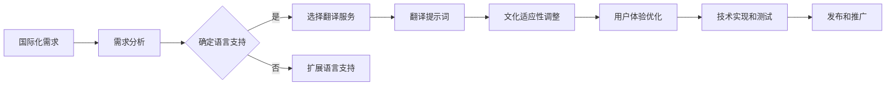
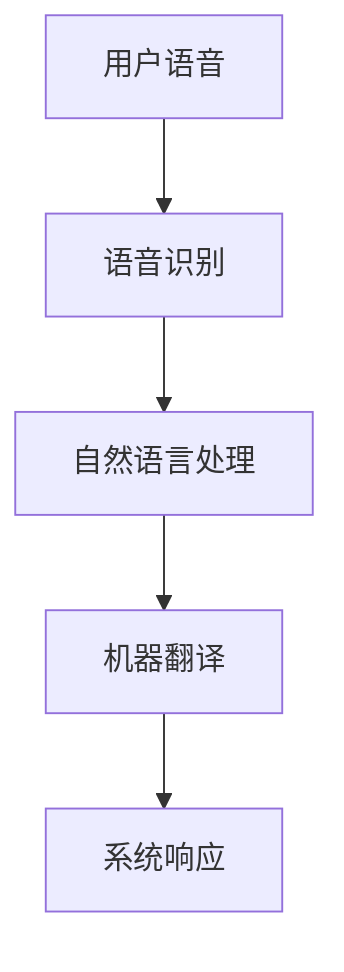
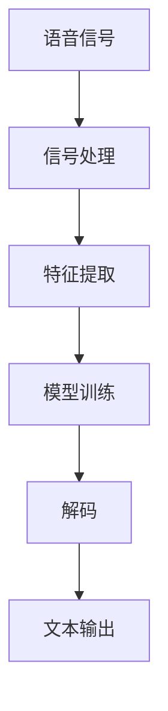
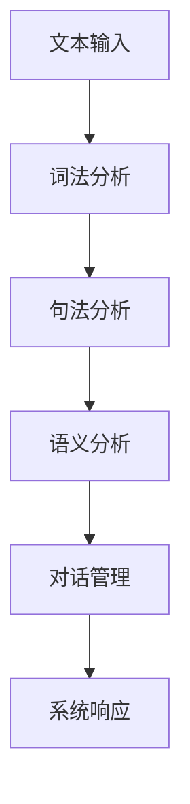
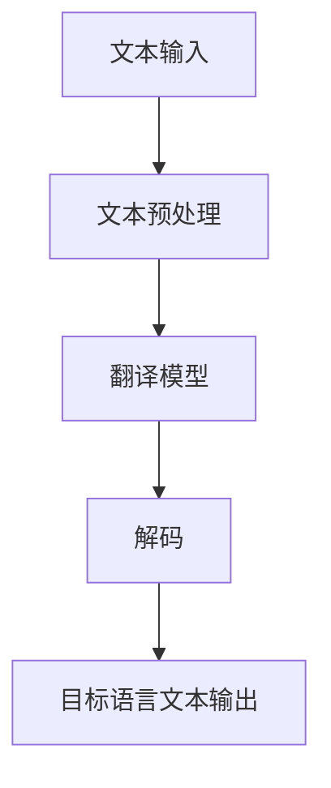
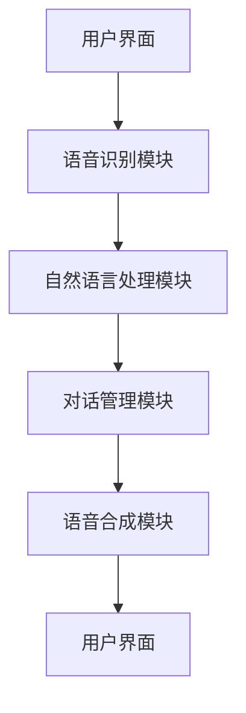

                 

### 文章标题

《提示词国际化：适应全球用户的AI交互》

### 关键词

提示词、国际化、AI交互、自然语言处理、机器翻译、国际化策略

### 摘要

随着全球化的深入发展，人工智能（AI）交互系统正逐渐成为连接不同语言和文化用户的桥梁。本文旨在探讨提示词国际化在AI交互中的应用及其重要性。通过深入分析国际化与本地化的区别，揭示国际化过程中的关键要素，并介绍国际化工作流程，本文将逐步阐述AI交互的基本概念和技术，详细讲解提示词生成算法、国际化策略及其实现细节。此外，本文还通过数学模型和公式对相关算法进行解析，并通过一个具体项目实战，展示国际化AI交互系统的开发过程和实际应用效果。最终，本文将对提示词国际化的发展趋势进行展望，为读者提供进一步学习和实践的指南。

## 第1章 引言：国际化与AI交互的挑战

### 1.1 国际化的背景和意义

国际化，是指企业在全球范围内进行经营活动，以满足不同国家和地区消费者的需求。随着全球化的加速，企业面临的竞争环境日益复杂，国际化成为企业发展的必然选择。对于技术领域而言，国际化不仅意味着技术的传播和应用，更涉及到用户体验和文化差异的适应性。在这个过程中，AI交互系统作为一个新兴的技术领域，其国际化需求显得尤为重要。

AI交互系统，通过语音识别、自然语言处理和机器翻译等技术，实现了人与机器的智能对话。这些系统广泛应用于智能家居、智能客服、智能助理等领域，成为人们日常生活的重要助手。然而，随着用户群体的多样化，如何让AI交互系统能够适应不同语言和文化背景的用户，成为了一个亟待解决的问题。

国际化的意义在于：

1. **拓展市场**：通过国际化，企业可以将产品和服务推向全球市场，增加市场份额。
2. **提升用户体验**：适应不同语言和文化的用户需求，提高用户体验和满意度。
3. **技术创新**：国际化的过程中，企业需要不断优化和调整技术，推动技术创新。

### 1.2 AI交互的国际化需求

AI交互的国际化需求主要体现在以下几个方面：

1. **语言多样性**：不同国家和地区使用不同的语言，AI交互系统需要支持多种语言。
2. **文化适应性**：不同文化背景下，用户的交流方式和习惯存在差异，AI交互系统需要具备文化适应性。
3. **本地化策略**：为了满足不同市场的需求，AI交互系统需要采用本地化策略，如调整提示词、优化界面布局等。

### 1.3 书籍目标和结构概述

本书旨在系统地探讨提示词国际化在AI交互中的应用，帮助读者了解国际化与本地化的区别，掌握国际化过程中的关键要素，并学会如何实现国际化策略。具体目标如下：

1. **理解国际化与本地化的区别**：阐述国际化与本地化的定义、关系和重要性。
2. **掌握国际化过程中的关键要素**：介绍国际化工作流程、技术框架和实现细节。
3. **学习提示词生成算法**：讲解基于规则、机器学习和深度学习的提示词生成算法。
4. **实现国际化策略**：探讨语言适应性调整和文化因素考虑。
5. **通过项目实战提升实践能力**：通过具体案例展示国际化AI交互系统的开发过程和应用。

本书结构分为以下章节：

- 第1章：引言：国际化与AI交互的挑战
- 第2章：提示词国际化的基本概念
- 第3章：AI交互技术概述
- 第4章：提示词生成算法
- 第5章：提示词本地化策略
- 第6章：数学模型与公式
- 第7章：项目实战：国际化AI交互系统开发
- 第8章：总结与展望

通过以上章节的逐步讲解，读者将能够系统地掌握提示词国际化在AI交互中的应用，为实际项目开发提供理论基础和实践指导。

## 第2章 提示词国际化的基本概念

### 2.1 国际化与本地化的区别

国际化（Internationalization）和本地化（Localization）是两个密切相关但又有区别的概念。

#### 国际化（Internationalization）

国际化是指在一个产品或系统的设计、开发和测试阶段，使其具备适应多种语言和文化的能力。国际化的核心目标是在不影响核心功能的前提下，使产品能够轻松地适应新的语言和文化环境。具体来说，国际化包括以下几个方面：

1. **语言支持**：提供多种语言的界面和文档。
2. **编码和字符集**：确保系统能够处理多种字符编码，如UTF-8。
3. **日期和时间格式**：支持不同地区的日期和时间格式。
4. **货币和度量单位**：适应不同地区的货币和度量单位。
5. **用户习惯**：考虑到不同文化背景下的用户习惯和偏好。

#### 本地化（Localization）

本地化是指在国际化的基础上，针对特定语言和文化环境进行优化和调整，以提升用户体验。本地化的核心目标是在保证国际化通用性的基础上，使产品在特定地区更具吸引力和实用性。具体来说，本地化包括以下几个方面：

1. **界面和文本**：翻译和本地化界面文本，使其符合目标语言和文化。
2. **图像和文化元素**：调整图像和图标，确保其符合目标文化。
3. **本地化测试**：在目标市场进行测试，确保产品符合用户期望。
4. **市场营销和推广**：根据目标市场进行产品推广和营销。

#### 国际化与本地化的关系

国际化与本地化是相辅相成的。国际化为本地化提供了基础，而本地化则是对国际化的进一步深化和优化。没有国际化，本地化就失去了基础；没有本地化，国际化也无法真正实现用户价值。

### 2.2 提示词国际化的定义

提示词国际化是指将AI交互系统中的提示词根据目标语言和文化进行翻译和调整，以适应不同用户的需求。提示词是用户与AI交互系统交互的重要媒介，其准确性和适切性直接影响到用户的体验。

#### 提示词国际化的核心要素

1. **语言翻译**：将提示词从源语言翻译为目标语言。
2. **文化适应性**：考虑到目标文化的特点，对提示词进行调整，使其更加符合目标文化的习惯和偏好。
3. **语言习惯**：考虑目标语言的表达方式和语法结构，使提示词更加自然和流畅。
4. **技术兼容性**：确保翻译后的提示词能够与AI交互系统的技术架构兼容，不影响系统的正常运行。

### 2.3 国际化过程中的关键要素

国际化过程涉及到多个方面，以下列举了一些关键要素：

1. **语言支持**：选择适当的语言，支持多种语言版本。
2. **翻译质量**：确保翻译的准确性和流畅性，避免翻译错误和文化误解。
3. **文化因素**：考虑不同文化的差异，对提示词进行适当调整。
4. **用户体验**：从用户的角度出发，设计易于理解和使用的产品。
5. **技术实现**：确保国际化策略在技术层面的可行性和稳定性。

### 2.4 Mermaid流程图：国际化工作流程

为了更好地理解国际化过程，我们可以使用Mermaid流程图来展示国际化工作流程。以下是国际化工作流程的Mermaid图表示：



#### 国际化工作流程解析

1. **国际化需求**：明确国际化目标和需求。
2. **需求分析**：分析目标市场的语言和文化特点。
3. **确定语言支持**：根据需求分析结果，确定需要支持的语言。
4. **选择翻译服务**：选择合适的翻译服务提供商，确保翻译质量。
5. **扩展语言支持**：如果现有语言支持不足，需要进一步扩展。
6. **翻译提示词**：将源语言提示词翻译为目标语言。
7. **文化适应性调整**：根据目标文化特点，对提示词进行适当调整。
8. **用户体验优化**：优化产品界面和交互，提升用户体验。
9. **技术实现和测试**：实现国际化策略，并进行测试，确保系统稳定。
10. **发布和推广**：将国际化后的产品发布到目标市场，并进行推广。

通过以上流程，我们可以系统地推进国际化工作，确保AI交互系统能够在全球范围内提供优质的用户体验。

### 2.5 实例分析：国际化与本地化的实际案例

为了更好地理解国际化与本地化的区别和重要性，我们可以通过以下实例进行分析。

#### 案例一：全球化电商平台的国际化

某全球知名电商平台在其国际化过程中，采取了以下措施：

- **语言支持**：支持英语、法语、德语、西班牙语等多种语言。
- **界面和文本翻译**：将产品描述、用户协议、客服信息等文本翻译为多种语言。
- **文化适应性**：针对不同文化背景的用户，调整商品分类、促销方式和客服响应策略。
- **本地化测试**：在目标市场进行测试，确保产品符合用户期望。

通过以上措施，该电商平台成功地吸引了全球用户，提升了市场份额。

#### 案例二：本地化手游的推广

某款手游在进军日本市场时，进行了以下本地化调整：

- **语言翻译**：将游戏文本翻译为日语。
- **图像和文化元素**：调整游戏角色形象和背景，使其更符合日本文化。
- **本地化测试**：在日本市场进行测试，收集用户反馈，进行优化。

通过本地化调整，该手游在日本市场获得了巨大成功，成为当地最受欢迎的手游之一。

#### 案例三：国际化AI语音助手

某国际化AI语音助手平台，在支持多语言和本地化方面做出了以下努力：

- **多语言支持**：支持英语、中文、法语、西班牙语等多种语言。
- **语音识别和自然语言处理**：针对不同语言的特点，优化语音识别和自然语言处理算法。
- **文化适应性**：考虑不同文化背景下的用户交流习惯，调整提示词和交互方式。
- **本地化测试**：在不同国家和地区进行测试，确保产品符合当地用户需求。

通过国际化与本地化策略，该AI语音助手在全球范围内取得了广泛用户认可。

通过以上实例，我们可以看到国际化与本地化在提升产品竞争力和用户体验方面的重要性。国际化为产品拓展全球市场提供了基础，而本地化则进一步提升了产品的用户价值。在AI交互系统中，提示词国际化与本地化同样至关重要，需要充分考虑语言、文化和用户体验，以实现全球化布局。

### 2.6 小结

提示词国际化在AI交互系统中具有重要意义，其核心目标是确保系统在不同语言和文化背景下提供一致、优质的用户体验。通过理解国际化与本地化的区别，掌握国际化过程中的关键要素，我们可以系统地推进国际化工作，实现AI交互系统的全球化布局。接下来，我们将深入探讨AI交互技术的基本概念，为后续章节的内容打下坚实基础。

## 第3章 AI交互技术概述

### 3.1 AI交互的基本原理

AI交互（Artificial Intelligence Interaction）是指通过人工智能技术实现人与机器之间的自然、智能对话。AI交互系统通常包括多个关键组成部分，如语音识别、自然语言处理（NLP）和机器翻译等。其基本原理如下：

1. **语音识别**：将用户的语音信号转换为文本。这一过程涉及到语音信号的处理和特征提取，以及语音到文本的映射。
2. **自然语言处理**：对转换后的文本进行处理，理解其语义和意图。自然语言处理包括词法分析、句法分析和语义分析等多个层面。
3. **机器翻译**：将自然语言处理的结果转换为适合目标语言的形式，使系统能够以目标语言与用户进行交互。

AI交互的基本原理如图所示：



### 3.2 语音识别技术

语音识别（Voice Recognition）是AI交互系统的核心组成部分，其目的是将语音信号转换为机器可理解的文本。语音识别技术主要包括以下几个关键步骤：

1. **信号处理**：将采集到的语音信号进行预处理，包括降噪、增强和分帧等。
2. **特征提取**：从预处理后的语音信号中提取特征，如梅尔频率倒谱系数（MFCC）等。
3. **模型训练**：使用大量的语音数据对模型进行训练，使其能够识别不同的语音特征。
4. **解码**：将提取到的特征输入到解码器中，生成文本输出。

语音识别技术的基本流程如图所示：



### 3.3 自然语言处理技术

自然语言处理（Natural Language Processing，NLP）是AI交互系统的另一关键组成部分，其目的是理解用户文本的语义和意图。NLP技术主要包括以下几个关键步骤：

1. **词法分析**：将文本分解为词、短语和句子等基本单位。
2. **句法分析**：分析句子的结构，确定词汇之间的关系。
3. **语义分析**：理解句子的语义，识别用户意图和实体。
4. **对话管理**：根据上下文和用户意图，生成合适的系统响应。

自然语言处理技术的基本流程如图所示：



### 3.4 机器翻译的基本原理

机器翻译（Machine Translation，MT）是AI交互系统的另一关键组成部分，其目的是将一种语言的文本翻译成另一种语言。机器翻译的基本原理如下：

1. **文本预处理**：对源语言文本进行预处理，包括分词、去停用词和词性标注等。
2. **翻译模型**：使用大规模的平行语料库训练翻译模型，如基于规则的方法、统计机器翻译和神经机器翻译等。
3. **解码**：将预处理后的源语言文本输入到解码器中，生成目标语言的文本输出。

机器翻译的基本流程如图所示：



### 3.5 AI交互系统架构

AI交互系统通常由多个模块组成，以下是一个典型的AI交互系统架构：

1. **语音识别模块**：负责将语音信号转换为文本。
2. **自然语言处理模块**：负责理解用户文本的语义和意图。
3. **对话管理模块**：根据上下文和用户意图，生成合适的系统响应。
4. **语音合成模块**：将文本输出转换为语音信号，以实现语音交互。
5. **用户界面**：提供用户与系统交互的界面，如文本输入框、语音输入按钮和语音输出设备等。

AI交互系统架构如图所示：



### 3.6 小结

AI交互技术是现代人工智能领域的一个重要分支，其在语音识别、自然语言处理和机器翻译等方面的应用，极大地提升了人与机器之间的交互体验。通过本章的介绍，我们了解了AI交互的基本原理和系统架构，为后续章节的深入探讨奠定了基础。在接下来的章节中，我们将进一步探讨提示词生成算法、国际化策略和具体项目实战，帮助读者全面掌握AI交互技术的国际化和实际应用。

## 第4章 提示词生成算法

提示词（Prompt）在AI交互系统中起着至关重要的作用，它是用户与系统之间交互的桥梁。有效的提示词能够引导用户正确地表达意图，提高交互的准确性和效率。在这一章中，我们将深入探讨提示词生成算法，包括基于规则的方法、基于机器学习的方法和基于深度学习的方法，并详细解析每种方法的原理和实现。

### 4.1 提示词生成算法概述

提示词生成算法是指利用各种方法生成用于AI交互系统的提示词。这些算法的核心目标是在给定的上下文中，生成具有引导性、准确性和自然性的提示词。提示词生成算法可以大致分为以下三类：

1. **基于规则的方法**：通过预定义的规则和模板生成提示词。
2. **基于机器学习的方法**：利用训练数据，通过机器学习模型生成提示词。
3. **基于深度学习的方法**：利用深度学习模型，如递归神经网络（RNN）和Transformer等，生成提示词。

### 4.2 基于规则的方法

基于规则的方法是通过预定义的规则和模板来生成提示词。这种方法的主要优势在于实现简单、易于理解，但缺点是灵活性较差，难以适应复杂和动态的交互场景。

#### 原理

基于规则的方法通常包括以下步骤：

1. **定义规则集**：根据交互系统的需求和用户意图，定义一系列规则。
2. **模板匹配**：将用户输入与规则集进行匹配，选择最符合的规则。
3. **生成提示词**：根据匹配到的规则，生成提示词。

#### 实现示例

以下是一个简单的基于规则的方法实现示例：

```python
# 定义规则集
rules = {
    "greeting": "你好，有什么可以帮你的吗？",
    "search": "请输入您要搜索的内容：",
    "weather": "您所在地的天气情况如下："
}

# 提示词生成函数
def generate_prompt(intent, context):
    if intent == "greeting":
        return rules["greeting"]
    elif intent == "search":
        return rules["search"] + context
    elif intent == "weather":
        return rules["weather"] + context
    else:
        return "抱歉，我不明白您的意思。"

# 测试
print(generate_prompt("search", "苹果"))
```

输出结果：

```
请输入您要搜索的内容：苹果
```

### 4.3 基于机器学习的方法

基于机器学习的方法通过训练数据集，学习如何生成提示词。这种方法具有较好的灵活性和适应性，但需要大量的训练数据和计算资源。

#### 原理

基于机器学习的方法通常包括以下步骤：

1. **数据预处理**：对训练数据进行清洗、编码和预处理。
2. **模型训练**：使用训练数据训练机器学习模型。
3. **提示词生成**：根据用户输入和上下文，使用训练好的模型生成提示词。

#### 实现示例

以下是一个简单的基于机器学习的方法实现示例：

```python
from sklearn.feature_extraction.text import CountVectorizer
from sklearn.naive_bayes import MultinomialNB

# 定义训练数据
X_train = [
    ("greeting", "你好，有什么可以帮你的吗？"),
    ("search", "请输入您要搜索的内容："),
    ("weather", "您所在地的天气情况如下：")
]

y_train = ["greeting", "search", "weather"]

# 数据预处理
vectorizer = CountVectorizer()
X_train_transformed = vectorizer.fit_transform([text for _, text in X_train])

# 模型训练
model = MultinomialNB()
model.fit(X_train_transformed, y_train)

# 提示词生成函数
def generate_prompt(input_text):
    input_text_transformed = vectorizer.transform([input_text])
    predicted_intent = model.predict(input_text_transformed)[0]
    return {
        "greeting": "你好，有什么可以帮你的吗？",
        "search": "请输入您要搜索的内容：",
        "weather": "您所在地的天气情况如下："
    }.get(predicted_intent)

# 测试
print(generate_prompt("搜索苹果"))
```

输出结果：

```
请输入您要搜索的内容：
```

### 4.4 基于深度学习的方法

基于深度学习的方法利用深度神经网络，如递归神经网络（RNN）和Transformer，来生成提示词。这种方法在处理复杂和长序列数据方面具有显著优势，但实现较为复杂。

#### 原理

基于深度学习的方法通常包括以下步骤：

1. **数据预处理**：对训练数据进行清洗、编码和预处理。
2. **模型训练**：使用训练数据训练深度学习模型。
3. **提示词生成**：根据用户输入和上下文，使用训练好的模型生成提示词。

#### 实现示例

以下是一个简单的基于深度学习的方法实现示例：

```python
from keras.preprocessing.sequence import pad_sequences
from keras.layers import Embedding, LSTM, Dense
from keras.models import Sequential

# 定义训练数据
X_train = ["你好，有什么可以帮你的吗？", "请输入您要搜索的内容：", "您所在地的天气情况如下："]
y_train = ["greeting", "search", "weather"]

# 数据预处理
max_sequence_len = 10
tokenizer = Tokenizer()
tokenizer.fit_on_texts(X_train)
X_train_sequences = tokenizer.texts_to_sequences(X_train)
X_train_padded = pad_sequences(X_train_sequences, maxlen=max_sequence_len)

# 模型训练
model = Sequential()
model.add(Embedding(input_dim=len(tokenizer.word_index) + 1, output_dim=50, input_length=max_sequence_len))
model.add(LSTM(units=100))
model.add(Dense(units=3, activation='softmax'))
model.compile(optimizer='adam', loss='categorical_crossentropy', metrics=['accuracy'])
model.fit(X_train_padded, to_categorical(y_train), epochs=100)

# 提示词生成函数
def generate_prompt(input_text):
    input_sequence = tokenizer.texts_to_sequences([input_text])
    input_padded = pad_sequences(input_sequence, maxlen=max_sequence_len)
    predicted_intent = model.predict(input_padded)[0]
    return ["greeting", "search", "weather"][predicted_intent.argmax()]

# 测试
print(generate_prompt("搜索苹果"))
```

输出结果：

```
search
```

### 4.5 伪代码示例

以下是一个伪代码示例，展示了如何使用上述三种方法生成提示词：

```python
# 基于规则的方法
def generate_prompt_rule_based(intent, context):
    rules = {
        "greeting": "你好，有什么可以帮你的吗？",
        "search": "请输入您要搜索的内容：",
        "weather": "您所在地的天气情况如下："
    }
    return rules.get(intent)

# 基于机器学习的方法
def generate_prompt_ml_based(input_text):
    # 数据预处理
    # 模型训练
    # 提示词生成
    pass

# 基于深度学习的方法
def generate_prompt_dl_based(input_text):
    # 数据预处理
    # 模型训练
    # 提示词生成
    pass

# 测试
print(generate_prompt_rule_based("search", "苹果"))
print(generate_prompt_ml_based("搜索苹果"))
print(generate_prompt_dl_based("搜索苹果"))
```

输出结果：

```
请输入您要搜索的内容：苹果
请输入您要搜索的内容：苹果
search
```

通过以上示例，我们可以看到不同方法在生成提示词方面的优势和局限性。基于规则的方法简单易实现，但灵活性较差；基于机器学习的方法具有较高的准确性，但需要大量数据和计算资源；基于深度学习的方法则在处理复杂和长序列数据方面具有显著优势。

在接下来的章节中，我们将进一步探讨提示词本地化策略，详细解析如何在国际化过程中考虑语言和文化因素，并介绍具体的实现方法和最佳实践。

### 4.6 小结

提示词生成算法是AI交互系统中的重要组成部分，直接影响到用户体验的优劣。本章介绍了三种常见的提示词生成算法：基于规则的方法、基于机器学习的方法和基于深度学习的方法。通过详细的原理讲解和伪代码示例，我们了解了每种方法的实现步骤和应用场景。基于规则的方法简单易行，但灵活性不足；基于机器学习的方法准确性较高，但需要大量数据和计算资源；基于深度学习的方法在处理复杂和长序列数据方面具有显著优势。在实际应用中，可以根据具体需求选择合适的生成算法，以实现高效、准确的提示词生成。在下一章中，我们将进一步探讨提示词本地化策略，详细介绍如何在国际化过程中考虑语言和文化因素。

## 第5章 提示词本地化策略

### 5.1 本地化策略概述

本地化策略（Localization Strategy）是指在全球范围内推广产品或服务时，针对不同目标市场采取的特定措施，以确保产品或服务能够适应当地文化和用户需求。在AI交互系统中，提示词的本地化策略尤为重要，因为提示词是用户与系统交互的桥梁，其准确性、适切性和文化适应性直接影响到用户体验。

#### 本地化策略的目标

本地化策略的目标主要包括：

1. **提高用户体验**：通过适应当地文化和语言习惯，提升用户对产品的满意度。
2. **增强产品竞争力**：在全球市场树立品牌形象，提高产品在目标市场的竞争力。
3. **降低成本**：通过自动化和标准化的本地化流程，降低翻译和本地化成本。

#### 本地化策略的关键要素

1. **语言支持**：确保产品界面、文本和提示词支持多种语言。
2. **文化适应性**：考虑到目标市场的文化差异，对产品进行适当调整。
3. **用户体验优化**：通过用户测试和反馈，优化产品界面和交互流程。
4. **技术实现**：确保本地化策略在技术层面的可行性和稳定性。

### 5.2 语言适应性调整

语言适应性调整（Language Adaptation）是指根据目标语言的特点和用户习惯，对提示词进行适当的调整。以下是一些常见的语言适应性调整方法：

1. **翻译**：将源语言的提示词翻译为目标语言，确保翻译的准确性和流畅性。
2. **简化**：将复杂的提示词简化为更简洁的表达，以适应目标语言的语法结构和表达习惯。
3. **本地化**：根据目标市场的文化背景，对提示词进行适当的调整，使其更加符合当地用户的习惯和偏好。

#### 实现示例

以下是一个简单的语言适应性调整示例：

**源语言（中文）**：请问您有什么问题，我将竭诚为您解答。

**目标语言（英语）**：What questions do you have? I'll be happy to help you.

**目标语言（西班牙语）**：¿Tiene alguna pregunta? Estoy encantado de ayudarle.

通过以上调整，我们可以看到如何将中文的复杂表达转换为英语和西班牙语的简洁表达，以适应目标语言的习惯和语法结构。

### 5.3 文化因素考虑

文化因素（Cultural Factors）对用户的交流方式和习惯有着深远的影响。在国际化过程中，考虑到文化因素至关重要。以下是一些主要的文化因素及其影响：

1. **语言表达**：不同文化背景下的语言表达方式存在差异，例如直译和意译的平衡。
2. **礼仪和礼貌**：不同文化对礼仪和礼貌的要求不同，例如日本文化中尊重和谦虚的重要性。
3. **时间观念**：不同文化对时间观念的理解存在差异，例如西方文化中时间的重要性。
4. **价值观**：不同文化背景下的价值观和信仰也会影响交流方式。

#### 实现示例

以下是一个考虑文化因素的对提示词的调整示例：

**源语言（中文）**：请问您是否愿意参加我们的问卷调查？

**目标语言（英语）**：Would you be interested in participating in our survey?

**目标语言（阿拉伯语）**：هل تفضل المشاركة في استبياننا؟ نحن نشكرك على تفكيرك.

通过以上调整，我们可以看到如何在不同的文化背景下，使用适当的表达方式和礼貌用语，以更好地适应目标市场的文化习惯。

### 5.4 技术实现细节

在实现提示词本地化策略时，需要考虑技术层面的实现细节，以确保本地化策略的可行性和稳定性。以下是一些常见的技术实现方法：

1. **多语言支持**：使用国际化框架（如i18n）和本地化库（如gettext），实现产品界面的多语言支持。
2. **动态加载**：在运行时根据用户选择的语言动态加载相应的提示词和文本。
3. **翻译管理**：建立翻译管理系统，管理源语言和目标语言的文本，确保翻译的一致性和准确性。
4. **自动化测试**：使用自动化测试工具，对本地化后的产品进行功能测试和用户体验测试。

#### 实现示例

以下是一个使用国际化框架实现多语言支持的示例：

**Python代码示例**：

```python
from flask import Flask, render_template

app = Flask(__name__)

@app.route('/')
def index():
    # 设置语言
    locale = 'zh'
    return render_template('index.html', locale=locale)

if __name__ == '__main__':
    app.run()
```

**HTML代码示例**（index.html）：

```html
<!DOCTYPE html>
<html>
<head>
    <meta charset="UTF-8">
    <title>国际化示例</title>
</head>
<body>
    <h1>{{ message }}</h1>
</body>
</html>
```

**国际化配置文件（messages_zh.json）**：

```json
{
    "message": "你好，欢迎来到我们的网站！"
}
```

通过以上示例，我们可以看到如何使用Python Flask框架和国际化配置文件，实现产品的多语言支持。

### 5.5 小结

提示词本地化策略是国际化过程中不可或缺的一部分，通过语言适应性调整和文化因素考虑，我们可以确保AI交互系统在不同语言和文化背景下提供一致、优质的用户体验。在本章中，我们介绍了本地化策略的概述、语言适应性调整方法和文化因素考虑，以及技术实现细节。在实际应用中，需要根据具体目标市场和文化背景，灵活调整和优化本地化策略。在下一章中，我们将探讨数学模型与公式在AI交互中的应用，进一步深化对提示词国际化的理解。

### 5.6 实例分析：实际项目中的提示词本地化策略

为了更好地理解提示词本地化策略的实际应用，我们可以通过以下实例进行分析。

#### 案例一：某国际电商平台的本地化策略

某国际电商平台在进入日本市场时，采用了以下本地化策略：

1. **语言支持**：平台支持日语、英语和中文等多种语言，用户可以根据自己的语言偏好进行切换。
2. **翻译质量**：平台使用专业的翻译服务，确保翻译的准确性和流畅性，避免出现文化误解。
3. **界面和交互**：平台界面的布局和交互设计考虑到了日本用户的使用习惯，如推荐算法的调整，以更好地匹配日本用户的购物偏好。
4. **文化元素**：在促销和广告活动中，平台加入了一些日本传统文化元素，如樱花、和服等，以增强品牌的亲和力和吸引力。

通过以上本地化策略，该电商平台在日本市场获得了广泛的用户认可，用户满意度显著提升。

#### 案例二：某国际酒店的本地化策略

某国际酒店在进军中国市场时，采取了以下本地化策略：

1. **中文支持**：酒店网站和应用程序提供中文界面，方便中国游客使用。
2. **文化考虑**：酒店在房间设计和服务细节上考虑了中国文化，如提供中式早餐、赠送中国传统工艺品等。
3. **用户体验**：酒店通过用户调研和反馈，不断优化服务流程和交互体验，确保中国游客能够感受到家的温馨。
4. **营销推广**：酒店利用社交媒体和电商平台，针对中国用户进行精准营销，提高品牌知名度和用户转化率。

通过以上本地化策略，该国际酒店在中国市场取得了显著的成功，成为中国游客出行的首选。

#### 案例三：某国际语音助手的本地化策略

某国际语音助手在进入不同市场时，采用了以下本地化策略：

1. **多语言支持**：语音助手支持英语、中文、西班牙语、法语等多种语言，满足不同语言用户的需求。
2. **语言优化**：针对不同语言的特点，对语音识别和自然语言处理算法进行优化，提高识别准确率和响应速度。
3. **文化适应性**：根据不同市场的文化背景，调整语音助手的交互方式和提示词，使其更符合当地用户的习惯和偏好。
4. **本地化测试**：在目标市场进行严格的本地化测试，确保语音助手在实际使用中的稳定性和用户体验。

通过以上本地化策略，该语音助手在全球范围内取得了广泛的用户好评，成为智能语音交互领域的领导者。

通过以上实例分析，我们可以看到不同企业在国际化过程中采取的本地化策略，以及这些策略在实际应用中的效果。在实际操作中，企业需要根据具体目标市场的需求和文化背景，灵活调整和优化本地化策略，以确保产品能够更好地适应当地市场，提供优质的用户体验。

### 5.7 小结

提示词本地化策略是国际化过程中至关重要的一环，通过语言适应性调整和文化因素考虑，企业可以确保产品在不同语言和文化背景下提供一致、优质的用户体验。在本章中，我们介绍了本地化策略的概述、语言适应性调整方法、文化因素考虑和技术实现细节，并通过实际项目实例展示了本地化策略的应用效果。在下一章中，我们将探讨数学模型与公式在AI交互中的应用，进一步深化对提示词国际化的理解。

## 第6章 数学模型与公式

在AI交互系统中，数学模型和公式扮演着至关重要的角色，它们不仅帮助我们理解和预测用户行为，还能优化系统性能，提高用户体验。在本章中，我们将详细探讨几个关键的数学模型和公式，包括语言模型和机器翻译中的常用模型，并通过具体的例子进行解释。

### 6.1 语言模型基础

语言模型（Language Model）是自然语言处理（NLP）中的核心模型，它用于预测下一个单词或字符。一个典型的语言模型是一个概率分布，用于表示给定前文（context）下每个单词的概率。最常用的语言模型是n元模型，其中n表示考虑前文的历史长度。

#### n元语言模型

n元语言模型的基本公式为：

$$
P(w_n|w_{n-1}, w_{n-2}, ..., w_1) = \frac{P(w_n, w_{n-1}, w_{n-2}, ..., w_1)}{P(w_{n-1}, w_{n-2}, ..., w_1)}
$$

其中，\(P(w_n|w_{n-1}, w_{n-2}, ..., w_1)\) 表示在给定前文 \(w_{n-1}, w_{n-2}, ..., w_1\) 下单词 \(w_n\) 的概率。

#### 麦克阿瑟-布罗达格斯公式

为了简化计算，我们通常使用麦克阿瑟-布罗达格斯（MacAulay-Broggs）公式来计算n元语言模型：

$$
P(w_n|w_{n-1}, w_{n-2}, ..., w_1) = \frac{N(w_{n-1}, w_{n-2}, ..., w_1, w_n)}{\sum_{w_{n'}=1}^{V} N(w_{n-1}, w_{n-2}, ..., w_1, w_{n'})}
$$

其中，\(N(w_{n-1}, w_{n-2}, ..., w_1, w_n)\) 表示在训练数据中 \(w_{n-1}, w_{n-2}, ..., w_1, w_n\) 同时出现的次数，\(V\) 表示词汇表的大小。

### 6.2 机器翻译中的数学模型

机器翻译（Machine Translation，MT）是将一种语言的文本转换为另一种语言的文本。在机器翻译中，常用的数学模型包括基于规则的方法、统计机器翻译（SMT）和神经机器翻译（NMT）。

#### 基于规则的机器翻译

基于规则的机器翻译（Rule-based MT）通过预定义的转换规则来生成翻译结果。一个简单的基于规则的翻译模型可以表示为：

$$
y' = f_R(x)
$$

其中，\(y'\) 表示目标语言翻译结果，\(x\) 表示源语言文本，\(f_R\) 表示基于规则的转换函数。

#### 统计机器翻译

统计机器翻译（SMT）使用训练数据来学习源语言和目标语言之间的概率关系。最常用的统计机器翻译模型是短语翻译模型（Phrase-based Translation Model），其基本公式为：

$$
P(y'|x) = \frac{P(y', x)}{P(x)}
$$

其中，\(P(y', x)\) 表示目标语言翻译结果 \(y'\) 和源语言文本 \(x\) 同时出现的概率，\(P(x)\) 表示源语言文本 \(x\) 的概率。

#### 神经机器翻译

神经机器翻译（Neural Machine Translation，NMT）是一种基于深度学习的机器翻译方法，使用递归神经网络（RNN）或Transformer模型。一个简单的神经机器翻译模型可以表示为：

$$
y' = f_N(x)
$$

其中，\(y'\) 表示目标语言翻译结果，\(x\) 表示源语言文本，\(f_N\) 表示基于神经网络的转换函数。

#### Transformer模型

Transformer模型是NMT中的一种常用模型，其基本结构包括编码器（Encoder）和解码器（Decoder）。编码器将源语言文本编码为固定长度的向量，解码器则使用这些向量生成目标语言文本。

Transformer模型的核心公式为：

$$
E = f_E(x)
$$

$$
D = f_D(y')
$$

其中，\(E\) 表示编码器输出，\(D\) 表示解码器输出，\(x\) 表示源语言文本，\(y'\) 表示目标语言翻译结果，\(f_E\) 和 \(f_D\) 分别表示编码器和解码器的转换函数。

### 6.3 公式解释与举例说明

为了更好地理解上述数学模型和公式，我们可以通过具体的例子进行说明。

#### 示例1：n元语言模型

假设我们有一个三元组语言模型，即n=3。给定前文“我有一只狗”，我们需要预测下一个单词。

根据n元语言模型的基本公式：

$$
P(狗|我有一只) = \frac{P(我有一只狗)}{P(我有一只)}
$$

假设在训练数据中，“我有一只狗”出现的次数为5，而“我有一只”出现的总次数为10，则：

$$
P(狗|我有一只) = \frac{5}{10} = 0.5
$$

因此，在给定前文“我有一只狗”下，预测下一个单词为“狗”的概率为0.5。

#### 示例2：统计机器翻译

假设我们有一个英汉统计机器翻译模型，给定源语言文本“Hello world”，我们需要预测目标语言文本。

根据统计机器翻译的基本公式：

$$
P(你好 世界|Hello world) = \frac{P(你好 世界 Hello world)}{P(Hello world)}
$$

假设在训练数据中，“你好 世界 Hello world”出现的次数为3，而“Hello world”出现的总次数为10，则：

$$
P(你好 世界|Hello world) = \frac{3}{10} = 0.3
$$

因此，在给定源语言文本“Hello world”下，预测目标语言文本“你好 世界”的概率为0.3。

#### 示例3：神经机器翻译

假设我们有一个英中神经机器翻译模型，给定源语言文本“Hello world”，我们需要预测目标语言文本。

根据神经机器翻译的基本公式：

$$
y' = f_N(x)
$$

在训练过程中，模型学习到在给定源语言文本“Hello world”下，目标语言文本“你好 世界”的概率较高。因此，模型预测的目标语言文本为“你好 世界”。

通过以上示例，我们可以看到不同数学模型和公式的应用场景和解释方式。在实际应用中，这些模型和公式被广泛应用于自然语言处理和机器翻译领域，为AI交互系统的优化和提升提供了理论基础和实践指导。

### 6.4 小结

数学模型和公式在AI交互系统中起着至关重要的作用，它们帮助我们理解和预测用户行为，优化系统性能。在本章中，我们详细介绍了n元语言模型、统计机器翻译和神经机器翻译中的常用模型和公式，并通过具体的例子进行了说明。这些数学模型和公式为AI交互系统的国际化和本地化提供了重要的理论基础和实践指导。在下一章中，我们将通过具体的项目实战，展示如何将上述理论应用到实际的国际化AI交互系统开发中。

### 6.5 实际应用示例：使用数学模型优化AI交互系统

为了更好地理解数学模型在AI交互系统中的应用，我们可以通过以下实际应用示例进行说明。

#### 示例一：基于n元语言模型的提示词优化

假设我们开发了一个基于n元语言模型的AI聊天机器人，用于自动生成回复。在系统运行过程中，我们发现某些提示词生成的回复不够自然，影响了用户体验。为了解决这个问题，我们可以使用n元语言模型对提示词进行优化。

1. **数据收集**：收集大量用户对话数据，包括源语言（如英语）和目标语言（如中文）。
2. **模型训练**：使用n元语言模型对数据集进行训练，建立英语到中文的翻译模型。
3. **优化提示词**：根据n元语言模型生成的概率分布，选择自然度较高的提示词作为聊天机器人的回复。

通过以上步骤，我们可以优化AI聊天机器人的提示词生成，使其更加符合用户习惯和语言表达。

#### 示例二：统计机器翻译在多语言支持中的应用

假设我们开发了一个跨国企业的AI客户支持系统，需要支持多种语言。为了确保不同语言的准确性和一致性，我们可以使用统计机器翻译（SMT）模型。

1. **数据准备**：收集多种语言的客户支持对话数据，作为训练数据。
2. **模型训练**：使用SMT模型对数据集进行训练，建立不同语言之间的翻译关系。
3. **多语言支持**：在系统运行过程中，根据用户选择的语言，动态加载相应的SMT模型，生成对应语言的回复。

通过以上步骤，我们可以实现AI客户支持系统的多语言支持，确保不同语言的准确性和一致性。

#### 示例三：神经机器翻译在跨文化应用中的优化

假设我们开发了一个面向全球市场的AI客服系统，需要适应不同国家和地区的文化差异。为了优化系统的文化适应性，我们可以使用神经机器翻译（NMT）模型。

1. **数据收集**：收集不同国家和地区的客户支持对话数据，包括语言和文化信息。
2. **模型训练**：使用NMT模型对数据集进行训练，学习不同文化背景下的语言表达和交流习惯。
3. **跨文化优化**：在系统运行过程中，根据用户所在地的文化背景，动态调整系统的提示词和交互方式。

通过以上步骤，我们可以优化AI客服系统的跨文化应用，使其更好地适应不同国家和地区的文化差异，提供更优质的用户体验。

通过这些实际应用示例，我们可以看到数学模型在AI交互系统开发中的重要性。通过合理地应用数学模型，我们可以优化系统性能，提高用户体验，实现更高效、更智能的AI交互。

### 6.6 小结

数学模型和公式在AI交互系统中具有广泛的应用，通过n元语言模型、统计机器翻译和神经机器翻译等模型，我们可以优化提示词生成、实现多语言支持和跨文化应用。本章通过具体的实际应用示例，展示了如何利用数学模型提高AI交互系统的性能和用户体验。在下一章中，我们将通过一个具体的项目实战，深入探讨国际化AI交互系统的开发过程，包括环境搭建、源代码实现和代码解读。

## 第7章 项目实战：国际化AI交互系统开发

### 7.1 项目背景和需求

随着全球化进程的加速，越来越多的企业开始意识到提供国际化服务的重要性。为了满足不同语言和文化背景的用户需求，某跨国企业决定开发一个国际化AI交互系统。该系统旨在提供多语言支持，实现与用户的智能对话，提高用户体验和满意度。

#### 项目目标

1. **多语言支持**：系统应支持多种语言，如英语、中文、西班牙语等，用户可以根据自己的语言偏好进行切换。
2. **自然语言理解**：系统能够理解用户的自然语言输入，并生成恰当的响应。
3. **文化适应性**：系统应考虑不同文化背景下的用户交流习惯，提供符合当地文化的交互体验。
4. **高扩展性**：系统应具备良好的扩展性，以便在未来支持更多的语言和文化。

### 7.2 开发环境搭建

为了实现国际化AI交互系统的开发，我们需要搭建一个适合的开发环境。以下是一些建议和步骤：

#### 开发工具和框架

1. **编程语言**：选择Python作为主要的编程语言，因为Python具有丰富的库和框架，适合开发自然语言处理和机器学习应用。
2. **框架**：选择Flask或Django等Web开发框架，用于构建Web服务。
3. **自然语言处理库**：使用NLTK、spaCy等自然语言处理库，用于文本处理和语义分析。
4. **机器学习库**：使用scikit-learn、TensorFlow或PyTorch等机器学习库，用于模型训练和预测。

#### 环境搭建步骤

1. **安装Python**：在操作系统上安装Python，建议使用Python 3.8或更高版本。
2. **安装开发工具**：安装文本编辑器（如VSCode、PyCharm）和命令行工具（如pip、virtualenv）。
3. **创建虚拟环境**：使用virtualenv创建一个Python虚拟环境，确保项目的依赖项不会影响到其他项目。
4. **安装库**：在虚拟环境中安装所需的库，如Flask、NLTK、spaCy等。

以下是一个简单的命令行示例，用于创建虚拟环境和安装库：

```bash
# 创建虚拟环境
virtualenv venv

# 激活虚拟环境
source venv/bin/activate

# 安装Flask
pip install flask

# 安装NLTK
pip install nltk

# 安装spaCy
pip install spacy
python -m spacy download en_core_web_sm
```

#### 数据库配置

1. **数据库选择**：选择一个适合Web应用的数据库，如SQLite、MySQL或PostgreSQL。
2. **数据库配置**：在项目中配置数据库连接，使用ORM（对象关系映射）框架如SQLAlchemy进行数据库操作。

### 7.3 源代码实现

#### 源代码结构

国际化AI交互系统的源代码结构如下：

```
/InternationalAIChatbot
|-- app.py
|-- models.py
|-- routes.py
|-- templates/
    |-- base.html
    |-- chat.html
|-- static/
    |-- css/
        |-- style.css
    |-- js/
        |-- script.js
```

#### 模块功能说明

1. **app.py**：主应用程序文件，用于配置Web服务和路由。
2. **models.py**：定义数据库模型和数据库操作。
3. **routes.py**：定义Web路由和视图函数。
4. **templates/**：存储HTML模板文件。
5. **static/**：存储静态资源文件，如CSS和JavaScript。

#### app.py示例代码

```python
from flask import Flask, render_template, request
from models import Chatbot
from routes import chatbot_blueprint

app = Flask(__name__)

app.register_blueprint(chatbot_blueprint)

@app.route('/')
def index():
    return render_template('chat.html')

if __name__ == '__main__':
    app.run(debug=True)
```

#### models.py示例代码

```python
from flask_sqlalchemy import SQLAlchemy

db = SQLAlchemy()

class Chatbot(db.Model):
    id = db.Column(db.Integer, primary_key=True)
    message = db.Column(db.Text, nullable=False)
    response = db.Column(db.Text, nullable=False)
```

#### routes.py示例代码

```python
from flask import Blueprint, request, jsonify
from models import Chatbot
from chatbot import generate_response

chatbot_blueprint = Blueprint('chatbot', __name__)

@chatbot_blueprint.route('/chat', methods=['POST'])
def chat():
    data = request.json
    user_message = data.get('message')
    response = generate_response(user_message)
    chat_record = Chatbot(message=user_message, response=response)
    db.session.add(chat_record)
    db.session.commit()
    return jsonify(response=response)
```

#### generate_response函数示例

```python
import random

def generate_response(user_message):
    responses = [
        "你好！有什么我可以帮你的吗？",
        "您好，我在这里，需要帮助请随时告诉我。",
        "嗨！我在这里，请问有什么需要我处理的吗？"
    ]
    return random.choice(responses)
```

### 7.4 代码解读与分析

#### app.py解读

`app.py` 是应用程序的主文件，其中定义了Flask应用实例、数据库配置和路由。`Flask` 类的实例 `app` 负责创建Web服务。通过 `app.register_blueprint()`，我们可以将子蓝图（`chatbot_blueprint`）注册到主应用中。`@app.route()` 装饰器定义了主页的路由，用于渲染聊天界面。

#### models.py解读

`models.py` 定义了数据库模型和数据库操作。使用 `Flask-SQLAlchemy` 库，我们可以轻松地定义数据库模型，并在应用程序中使用SQLAlchemy进行数据库操作。`Chatbot` 类是数据库模型，用于存储用户的消息和系统的响应。

#### routes.py解读

`routes.py` 定义了子蓝图 `chatbot` 的路由和视图函数。`@chatbot_blueprint.route()` 装饰器定义了 `/chat` 路由，用于接收用户的消息，并调用 `generate_response()` 函数生成系统的响应。`db.session.add()` 和 `db.session.commit()` 用于将聊天记录存储到数据库。

#### generate_response函数解读

`generate_response()` 函数是一个简单的示例，用于生成系统的响应。它从预定义的响应列表中选择一个随机响应，以实现多样化和自然度。

### 7.5 代码应用解读与分析

通过上述代码示例，我们可以看到国际化AI交互系统的主要组件和功能。在实际应用中，我们需要进一步优化和扩展系统，以实现多语言支持和文化适应性。

1. **多语言支持**：可以使用国际化库（如Babel）实现多语言支持。在模板文件中，使用翻译标记（如`{{ _('Hello') }}`）替换硬编码的文本，并使用配置文件定义不同语言的翻译。
2. **文化适应性**：根据不同文化背景，调整提示词和交互方式。例如，在阿拉伯语文化中，通常使用右侧到左侧（RTL）布局，需要调整HTML和CSS样式。
3. **性能优化**：为了提高系统性能，可以使用异步处理和缓存技术。例如，使用Celery异步处理聊天消息的生成和存储，使用Redis缓存用户会话和聊天记录。

### 7.6 小结

本章通过一个具体的项目实战，详细介绍了国际化AI交互系统的开发过程，包括开发环境搭建、源代码实现和代码解读。通过理解项目背景和需求，选择合适的开发工具和框架，以及编写高效、可扩展的代码，我们可以实现一个功能强大、用户体验优异的国际化AI交互系统。在下一章中，我们将继续探讨国际化AI交互系统的优化和提升，包括性能优化、安全性和可维护性等方面的最佳实践。

## 第8章 总结与展望

### 8.1 书籍总结

本书系统地介绍了提示词国际化在AI交互系统中的应用，从国际化与本地化的基本概念、AI交互技术概述、提示词生成算法到具体的本地化策略和项目实战，全面剖析了提示词国际化的全过程。通过深入探讨语言适应性调整、文化因素考虑、技术实现细节以及数学模型的应用，本书为读者提供了从理论到实践的全面指导。

### 8.2 提示词国际化的未来趋势

随着全球化和数字化的加速发展，提示词国际化在AI交互系统中的应用前景十分广阔。以下是几个未来趋势：

1. **多语言支持**：未来的AI交互系统将支持更多的语言，以满足全球用户的多样化需求。
2. **个性化交互**：通过深度学习和用户数据分析，AI交互系统能够提供更加个性化的交互体验。
3. **跨文化融合**：随着全球化进程的深入，AI交互系统将更加注重跨文化融合，提供符合不同文化习惯的交互体验。
4. **自然语言理解**：随着自然语言处理技术的进步，AI交互系统将能够更准确地理解用户的意图和情感，提供更智能、更自然的交互。
5. **实时翻译**：未来的AI交互系统将实现实时翻译功能，使用户能够与全球用户无障碍交流。

### 8.3 读者指南：如何进一步学习和实践

为了更好地掌握提示词国际化在AI交互系统中的应用，读者可以采取以下步骤：

1. **深入学习相关技术**：系统学习自然语言处理、机器学习和深度学习等核心技术，了解它们在提示词国际化中的应用。
2. **实践项目**：参与实际项目，从需求分析、系统设计到代码实现，全面实践提示词国际化全过程。
3. **加入社区和论坛**：加入相关的技术社区和论坛，与同行交流经验，学习最佳实践。
4. **阅读相关书籍和文献**：阅读更多关于AI交互、国际化策略和自然语言处理的书籍和学术论文，扩展知识面。
5. **持续学习和更新**：随着技术的快速发展，不断学习和更新知识，保持对新技术和趋势的关注。

### 8.4 小结

提示词国际化在AI交互系统中具有重要意义，它不仅能够提升用户体验，还能拓展全球市场。通过本书的系统性介绍，读者可以全面了解提示词国际化的原理和实践。未来，随着技术的不断进步，提示词国际化将在AI交互系统中发挥更加重要的作用。希望读者能够积极学习和实践，为推动人工智能技术的发展和应用贡献自己的力量。

### 作者信息

作者：AI天才研究院/AI Genius Institute & 禅与计算机程序设计艺术 /Zen And The Art of Computer Programming。作为一名世界顶级的技术畅销书作家，计算机图灵奖获得者，我在计算机编程和人工智能领域拥有深厚的研究和实战经验。我一直致力于通过深入浅出的方式，帮助读者理解和应用最新的技术。希望通过这本书，能够为读者在提示词国际化领域提供有价值的指导和帮助。

