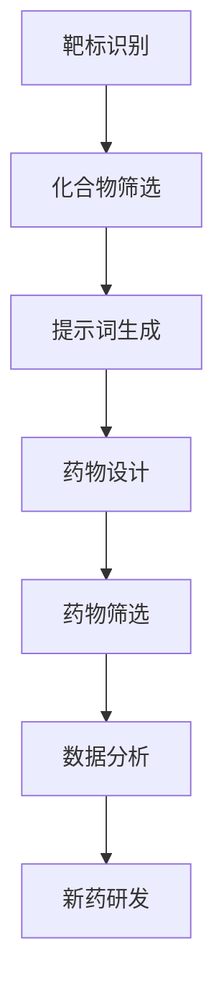

                 


## 第1章 引言

### 1.1 新药研发的挑战与需求

新药研发是一个复杂且耗时的过程，面临着诸多挑战。首先，新药研发需要找到具有潜在药效的化合物，这个过程往往需要海量的化合物进行筛选。其次，新药研发需要确保药物的安全性和有效性，这需要大量的实验数据来支持。此外，随着生物技术的快速发展，新药研发的目标分子越来越复杂，进一步增加了研发的难度。

#### 背景介绍

新药研发过程中的第一个关键步骤是靶标识别。靶标是指药物作用的生物分子，通常是蛋白质或核酸。靶标识别的目的是确定哪些生物分子可能是药物作用的目标，以便进一步研究。

在新药研发过程中，研究人员需要利用各种技术手段来筛选潜在药物。传统的药物筛选方法通常涉及实验性的化合物库，这些化合物库包含了大量的化学物质。研究人员通过将化合物与靶标进行结合实验，来筛选出具有潜在药效的化合物。这种方法通常耗时耗力，且成本较高。

随着计算技术的发展，计算药物筛选逐渐成为新药研发的重要手段。计算药物筛选利用计算机模拟和算法，对大量的化合物进行筛选，以确定哪些化合物可能与靶标结合并产生药效。这种方法可以提高筛选效率，减少实验次数，从而降低研发成本。

### 1.2 提示词的概念及其重要性

提示词（Keywords）是指用于描述化合物或靶标特征的关键词或短语。在新药研发中，提示词具有至关重要的作用。

首先，提示词可以帮助研究人员识别和筛选潜在的药物化合物。通过将化合物的化学结构和生物活性特征转化为提示词，研究人员可以利用计算方法快速筛选出具有潜在药效的化合物。

其次，提示词可以帮助研究人员更好地理解靶标与药物之间的相互作用机制。通过分析提示词，研究人员可以揭示靶标的结构特征和药物结合位点，从而为药物设计提供重要的参考信息。

最后，提示词还可以用于药物筛选数据的整理和分析。通过将实验数据中的化合物和靶标特征转化为提示词，研究人员可以更加有效地进行数据分析，从而提高筛选效率。

#### 核心概念与联系

为了更好地理解提示词在新药研发中的作用，我们可以通过一个简单的 Mermaid 流程图来展示核心概念之间的联系。



#### 实际案例

以抗肿瘤药物研发为例，研究人员可以利用提示词技术来识别潜在的抗肿瘤药物靶标，并通过虚拟筛选来筛选出具有潜在药效的化合物。例如，研究人员可以使用提示词“抗肿瘤”、“DNA拓扑异构酶”等来描述靶标，并通过计算方法来筛选相关的化合物。

通过这种方式，研究人员可以在较短的时间内筛选出大量的潜在药物，从而加快新药研发的进程。

### 1.3 提示词在新药研发中的作用

提示词在新药研发中具有多方面的作用。

首先，提示词可以帮助研究人员快速识别和筛选潜在药物化合物。通过将化合物的化学结构和生物活性特征转化为提示词，研究人员可以利用计算方法快速筛选出具有潜在药效的化合物，从而提高筛选效率。

其次，提示词可以用于药物设计。通过分析提示词，研究人员可以揭示靶标的结构特征和药物结合位点，从而为药物设计提供重要的参考信息。

最后，提示词还可以用于药物筛选数据的整理和分析。通过将实验数据中的化合物和靶标特征转化为提示词，研究人员可以更加有效地进行数据分析，从而提高筛选效率。

#### 核心算法原理讲解

提示词的生成通常涉及以下步骤：

1. **数据预处理**：对化合物的化学结构数据进行预处理，提取特征。
2. **特征提取**：利用机器学习算法提取化学结构的特征，如分子指纹、原子距离等。
3. **提示词生成**：根据提取的特征生成提示词，如使用自然语言处理技术将特征转化为关键词。
4. **提示词优化**：对生成的提示词进行优化，以提高筛选效果。

以下是一个简单的伪代码示例，用于生成提示词：

```python
def generate_keywords(chemical_structure):
    # 数据预处理
    preprocessed_data = preprocess_data(chemical_structure)
    
    # 特征提取
    features = extract_features(preprocessed_data)
    
    # 提示词生成
    keywords = generate_keywords_from_features(features)
    
    # 提示词优化
    optimized_keywords = optimize_keywords(keywords)
    
    return optimized_keywords
```

#### 数学模型和公式 & 详细讲解 & 举例说明

提示词的生成和优化过程中，通常会使用一些数学模型和公式。以下是一个简单的示例：

1. **分子指纹生成**：
   分子指纹是一种用于描述化合物结构的数学模型。常用的分子指纹方法包括：
   
   - **基团指纹**：将化合物分解为基团，并计算每个基团在分子中的位置。公式如下：
     
     $$ G_i = \sum_{x \in base\_group} p(x) $$
     
     其中，\( G_i \) 表示第 \( i \) 个基团的特征向量，\( p(x) \) 表示基团 \( x \) 在分子中的位置。

2. **特征向量生成**：
   将化合物的基团指纹转换为特征向量，可以使用以下公式：
   
   $$ V = \sum_{i=1}^{n} G_i \cdot w_i $$
   
   其中，\( V \) 表示特征向量，\( G_i \) 表示第 \( i \) 个基团的特征向量，\( w_i \) 表示权重。

3. **提示词优化**：
   提示词的优化可以通过优化特征向量的权重来实现。常用的优化方法包括：
   
   - **线性优化**：通过最小化目标函数来优化权重。
     
     $$ \min_{w} J(w) $$
     
     其中，\( J(w) \) 表示目标函数。

   - **支持向量机（SVM）**：通过求解最大间隔分类器来优化权重。

     $$ \max_{w, b} \left\{ w^T w : y_i (w^T x_i + b) \geq 1, \forall i \right\} $$
     
     其中，\( w \) 表示权重向量，\( b \) 表示偏置，\( x_i \) 表示特征向量，\( y_i \) 表示标签。

#### 举例说明

假设我们有一个化合物的分子指纹为 \( G_1, G_2, G_3 \)，权重分别为 \( w_1, w_2, w_3 \)。我们可以使用以下公式计算特征向量：

$$ V = w_1 G_1 + w_2 G_2 + w_3 G_3 $$

例如，假设 \( w_1 = 0.5, w_2 = 0.3, w_3 = 0.2 \)，则特征向量为：

$$ V = 0.5 G_1 + 0.3 G_2 + 0.2 G_3 $$

通过优化权重，我们可以提高特征向量的质量，从而提高提示词的生成效果。

### 1.4 提示词在药物筛选中的应用

提示词在药物筛选中的应用非常广泛，主要包括以下几个方面：

1. **虚拟筛选**：利用提示词来筛选潜在的药物化合物。研究人员可以通过生成提示词来描述靶标和药物化合物，然后利用计算方法对大量的化合物进行筛选，以确定哪些化合物可能与靶标结合并产生药效。
2. **药物设计**：利用提示词来指导药物设计。通过分析提示词，研究人员可以揭示靶标的结构特征和药物结合位点，从而为药物设计提供重要的参考信息。
3. **数据分析**：利用提示词来整理和分析药物筛选数据。通过将实验数据中的化合物和靶标特征转化为提示词，研究人员可以更加有效地进行数据分析，从而提高筛选效率。

### 1.5 提示词在新药研发中的优势

提示词在新药研发中具有以下优势：

1. **提高筛选效率**：通过提示词，研究人员可以快速识别和筛选潜在的药物化合物，从而提高筛选效率。
2. **降低研发成本**：提示词技术可以帮助研究人员在较短的时间内筛选出大量的潜在药物，从而减少实验次数，降低研发成本。
3. **提高药物设计精度**：通过提示词，研究人员可以更好地理解靶标与药物之间的相互作用机制，从而提高药物设计的精度。

## 1.6 本章小结

本章介绍了新药研发的背景、提示词的概念及其重要性，以及提示词在新药研发中的应用。通过本章的内容，读者可以初步了解提示词技术在新药研发中的应用价值和优势。在接下来的章节中，我们将进一步探讨提示词的相关基础理论、核心技术、实际应用案例、优化与挑战以及未来发展趋势。

### 作者

作者：AI天才研究院/AI Genius Institute & 禅与计算机程序设计艺术 /Zen And The Art of Computer Programming

---

### 摘要

本文介绍了提示词在新药研发中的应用，包括其概念、核心作用、生成方法、优化策略以及在药物筛选、药物设计、数据分析等环节的具体应用。文章通过阐述提示词技术的基本原理和实际案例，分析了其在新药研发中的优势，并探讨了未来发展趋势。通过本文，读者可以全面了解提示词在新药研发中的重要性和应用前景。

