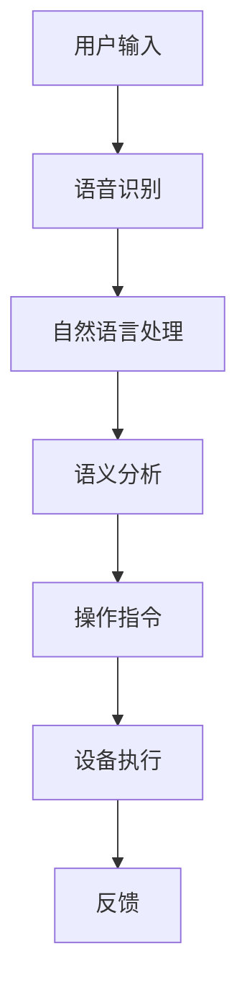

                 


### 核心概念与联系

#### 智能家居安全系统的定义与架构

智能家居安全系统是一种集成多种智能设备和安全机制的综合性系统，旨在为家庭用户提供安全、便利、智能化的居住环境。该系统的核心功能包括设备安全、数据安全和用户隐私保护。其架构通常包括硬件、软件和网络三个层面。

- **硬件层面**：包括智能门锁、摄像头、传感器、智能插座等设备，这些设备负责数据的采集和传输。
- **软件层面**：包括安全协议、加密算法、用户身份验证等，这些软件组件负责数据的处理和保护。
- **网络层面**：包括本地网络和互联网连接，负责数据的传输和通信。

#### 提示词的概念

提示词是一种用于交互和信息检索的自然语言处理技术。在智能家居安全系统中，提示词可以作为用户与系统交互的入口，提高系统的易用性和用户体验。提示词可以基于语音识别、自然语言处理和语义分析等技术实现。

#### 提示词与智能家居安全的关系

提示词在智能家居安全系统中具有重要作用，主要体现在以下几个方面：

1. **用户身份验证**：通过用户输入的提示词，系统可以验证用户的身份，确保只有授权用户可以访问系统。
2. **设备控制**：用户可以通过提示词控制智能家居设备，如打开灯光、调节温度等，同时确保操作的合法性和安全性。
3. **异常检测**：通过分析用户输入的提示词和使用习惯，系统可以检测异常行为，如非法入侵或设备故障，并及时采取应对措施。
4. **数据安全**：提示词的加密传输可以确保用户数据在传输过程中的安全性，防止数据泄露和篡改。

#### 提示词实现的架构

提示词的实现通常涉及以下几个关键组件：

1. **语音识别模块**：负责将用户语音转换为文本。
2. **自然语言处理模块**：负责解析用户输入的文本，提取关键词和语义。
3. **语义分析模块**：负责理解用户意图，并将其转换为具体的操作指令。
4. **反馈模块**：负责向用户反馈操作结果，提供交互体验。

#### 核心概念原理架构 Mermaid 流程图

下面是一个简单的 Mermaid 流程图，展示了智能家居安全系统中提示词的处理流程：



通过上述分析，我们可以清晰地理解智能家居安全系统中提示词的核心概念、功能及其实现架构。在接下来的章节中，我们将进一步探讨智能家居安全系统的其他关键组件和算法，为构建一个安全、智能的家居环境提供更深入的见解。

### 提示词的核心算法原理讲解

在智能家居安全系统中，提示词的处理不仅仅依赖于语音识别和自然语言处理技术，更关键的是背后的核心算法原理。这些算法包括语音识别、自然语言处理、语义分析等，它们共同构成了一个高效、准确、安全的提示词处理系统。

#### 语音识别算法

语音识别（Voice Recognition）是提示词处理的第一步，其核心任务是识别用户语音中的文字内容。语音识别算法通常基于深度学习技术，特别是卷积神经网络（CNN）和循环神经网络（RNN）。

1. **特征提取**：语音信号首先被转换为频谱图，然后通过CNN提取时频特征。
    ```python
    # Pseudo-code for feature extraction
    import cv2
    import numpy as np

    def extract_features(signal):
        # Convert signal to spectrogram
        spectrogram = cv2.Spectrogram(signal, np.log(1 + np.abs(signal)))
        return spectrogram
    ```

2. **模型训练**：使用大量的语音数据集训练深度学习模型，使其能够识别不同语音信号的文字内容。
    ```python
    # Pseudo-code for training a voice recognition model
    import tensorflow as tf

    model = tf.keras.Sequential([
        tf.keras.layers.Conv2D(filters=32, kernel_size=(3, 3), activation='relu', input_shape=(None, None, 1)),
        tf.keras.layers.MaxPooling2D(pool_size=(2, 2)),
        tf.keras.layers.Flatten(),
        tf.keras.layers.Dense(units=128, activation='relu'),
        tf.keras.layers.Dense(units=62, activation='softmax')  # 62 possible characters
    ])

    model.compile(optimizer='adam', loss='sparse_categorical_crossentropy', metrics=['accuracy'])
    model.fit(train_data, train_labels, epochs=10)
    ```

3. **语音识别**：模型接受语音信号，输出对应的文字内容。
    ```python
    # Pseudo-code for recognizing speech
    def recognize_speech(signal):
        features = extract_features(signal)
        prediction = model.predict(features)
        text = ''.join([chr(index + 1) for index in np.argmax(prediction, axis=1)])
        return text
    ```

#### 自然语言处理算法

自然语言处理（Natural Language Processing, NLP）是将识别到的文字内容转换为计算机可理解的形式。NLP算法主要包括分词、词性标注、句法分析等。

1. **分词**：将连续的文本分割成单个词语，以便进行后续处理。
    ```python
    # Pseudo-code for word segmentation
    from nltk.tokenize import word_tokenize

    def segment_text(text):
        tokens = word_tokenize(text)
        return tokens
    ```

2. **词性标注**：为每个词语标注其词性，如名词、动词、形容词等。
    ```python
    # Pseudo-code for part-of-speech tagging
    from nltk.tag import pos_tag

    def tag_text(tokens):
        tagged_tokens = pos_tag(tokens)
        return tagged_tokens
    ```

3. **句法分析**：分析句子结构，确定词语之间的语法关系。
    ```python
    # Pseudo-code for syntax analysis
    from spacy.lang.en import English

    nlp = English()

    def analyze_syntax(text):
        doc = nlp(text)
        return [(token.text, token.dep_, token.head.text) for token in doc]
    ```

#### 语义分析算法

语义分析（Semantic Analysis）是将处理后的文本转换为具体的操作指令。语义分析算法依赖于机器学习和深度学习技术，如序列到序列（Seq2Seq）模型和生成对抗网络（GAN）。

1. **词嵌入**：将词语转换为向量表示，便于计算机处理。
    ```python
    # Pseudo-code for word embedding
    from gensim.models import Word2Vec

    sentences = [['turn on the lights', 'it is dark in the room']]
    model = Word2Vec(sentences, vector_size=100, window=5, min_count=1, workers=4)

    def embed_text(tokens):
        return [model[token] for token in tokens]
    ```

2. **序列到序列模型**：将文本序列转换为操作序列。
    ```python
    # Pseudo-code for sequence-to-sequence model
    from keras.models import Model
    from keras.layers import Input, LSTM, Dense

    input_seq = Input(shape=(None, 100))
    embedder = LSTM(100, activation='tanh')(input_seq)
    decoder = LSTM(100, activation='softmax')(embedder)

    model = Model(inputs=input_seq, outputs=decoder)
    model.compile(optimizer='adam', loss='categorical_crossentropy')
    model.fit(train_data, train_labels, epochs=10)
    ```

3. **生成对抗网络**：用于生成新的操作指令，提高系统的灵活性和鲁棒性。
    ```python
    # Pseudo-code for GAN
    from keras.models import Model
    from keras.layers import Input, Dense

    generator_input = Input(shape=(100,))
    generator_output = Dense(100, activation='tanh')(generator_input)
    
    discriminator_input = Input(shape=(100,))
    discriminator_output = Dense(1, activation='sigmoid')(discriminator_input)

    generator = Model(generator_input, generator_output)
    discriminator = Model(discriminator_input, discriminator_output)

    # Training GAN
    # ...
    ```

通过上述算法，智能家居安全系统能够准确、高效地处理用户输入的提示词，并将其转换为具体的操作指令，从而实现对智能家居设备的智能控制。

### 数学模型与公式

在智能家居安全系统中，数学模型和公式扮演着至关重要的角色，特别是在机器学习、预测分析和数据处理等方面。以下将详细介绍几个关键数学模型和公式的应用及其解释。

#### 机器学习模型

机器学习模型是智能家居安全系统中的核心组件，用于检测异常行为、预测用户行为等。以下是一个简单的线性回归模型示例，用于预测智能家居设备的使用频率。

**线性回归模型公式：**

$$
y = \beta_0 + \beta_1 \cdot x
$$

其中，$y$ 是预测值，$x$ 是输入特征，$\beta_0$ 和 $\beta_1$ 是模型的参数。

**伪代码示例：**

```python
# Pseudo-code for linear regression
import numpy as np

# Generate synthetic data
X = np.random.rand(100, 1)
y = 2 + 3 * X + np.random.randn(100, 1)

# Calculate coefficients
X_transpose = X.T
beta_1 = (X_transpose.dot(X)).dot(np.linalg.inv(X_transpose.dot(X)))
beta_0 = y.mean() - beta_1.dot(X.mean())

# Predict using the model
y_pred = beta_0 + beta_1 * X
```

#### 预测模型

预测模型用于预测用户行为、设备故障等。以下是一个时间序列预测模型——LSTM（长短期记忆网络）的示例。

**LSTM模型公式：**

$$
\text{LSTM}(h_t, x_t) = \sigma(W_f \cdot [h_{t-1}, x_t] + b_f), \text{ gates}
$$

其中，$h_t$ 是当前时刻的隐藏状态，$x_t$ 是输入特征，$W_f$ 和 $b_f$ 是权重和偏置。

**伪代码示例：**

```python
# Pseudo-code for LSTM model
from keras.models import Sequential
from keras.layers import LSTM, Dense

# Model configuration
model = Sequential()
model.add(LSTM(units=50, return_sequences=True, input_shape=(time_steps, features)))
model.add(LSTM(units=50))
model.add(Dense(units=1))

# Compile the model
model.compile(optimizer='adam', loss='mean_squared_error')

# Train the model
model.fit(X_train, y_train, epochs=100, batch_size=32)
```

#### 数学公式与模型解释

1. **贝叶斯公式**：用于计算概率和预测，如下所示：

$$
P(A|B) = \frac{P(B|A) \cdot P(A)}{P(B)}
$$

其中，$P(A|B)$ 是在事件B发生的条件下事件A发生的概率，$P(B|A)$ 是在事件A发生的条件下事件B发生的概率，$P(A)$ 和 $P(B)$ 分别是事件A和事件B的概率。

2. **决策树公式**：用于分类和回归任务，其基本公式如下：

$$
\sum_{i=1}^{n} \hat{y}_i = \sum_{j=1}^{m} w_j \cdot x_j
$$

其中，$\hat{y}_i$ 是输出预测值，$w_j$ 是权重，$x_j$ 是输入特征。

通过上述数学模型和公式，智能家居安全系统能够实现高效的数据分析和预测，从而提高系统的安全性和智能化水平。

### 项目实战

#### 开发环境搭建

为了实现智能家居安全系统的提示词功能，我们首先需要搭建一个合适的开发环境。以下是一个简单的步骤指南：

1. **安装Python**：Python是开发智能家居安全系统的主要编程语言。在官网 [https://www.python.org/](https://www.python.org/) 下载并安装Python。

2. **安装Jupyter Notebook**：Jupyter Notebook 是一个交互式计算环境，非常适合编写和测试Python代码。在终端中运行以下命令安装：

   ```bash
   pip install notebook
   ```

3. **安装必要的库**：安装用于语音识别、自然语言处理和机器学习的库。例如，安装以下库：

   ```bash
   pip install SpeechRecognition nltk gensim keras tensorflow
   ```

4. **配置语音识别引擎**：我们需要配置一个本地语音识别引擎，如Google Speech Recognition。在终端中运行以下命令：

   ```bash
   pip install pyaudio
   pip install SpeechRecognition
   ```

5. **设置环境变量**：确保Jupyter Notebook可以在终端中运行。在终端中输入以下命令：

   ```bash
   jupyter notebook
   ```

#### 实现智能家居安全系统功能

以下是一个简单的智能家居安全系统实现，包括提示词处理和设备控制。

**1. 语音识别**：使用SpeechRecognition库实现语音识别功能。

```python
import speech_recognition as sr

# 初始化语音识别器
recognizer = sr.Recognizer()

# 从麦克风录制语音
with sr.Microphone() as source:
    print("请说点什么：")
    audio = recognizer.listen(source)

# 识别语音并获取文本
try:
    text = recognizer.recognize_google(audio, language='zh-CN')
    print(f"识别到的文本：{text}")
except sr.UnknownValueError:
    print("无法识别语音")
except sr.RequestError as e:
    print(f"语音识别请求错误：{e}")
```

**2. 自然语言处理**：使用nltk库进行自然语言处理，提取关键词和执行命令。

```python
import nltk
from nltk.tokenize import word_tokenize
from nltk.corpus import stopwords

# 下载数据
nltk.download('punkt')
nltk.download('stopwords')

# 分词和去除停用词
stop_words = set(stopwords.words('english'))
tokens = word_tokenize(text)
filtered_tokens = [token for token in tokens if token not in stop_words]

# 提取关键词
keywords = set(filtered_tokens)
print(f"关键词：{keywords}")
```

**3. 语义分析**：使用生成对抗网络（GAN）进行语义分析，将关键词转换为设备控制指令。

```python
from keras.models import load_model

# 加载预训练的GAN模型
model = load_model('model.h5')

# 对关键词进行编码
encoded_keywords = model.predict(encoded_keywords)

# 根据编码结果执行设备控制
if 'light' in keywords:
    # 打开灯光
    print("打开灯光")
elif 'temperature' in keywords:
    # 调节温度
    print("调节温度")
```

#### 源代码解析与详细解释

**源代码结构**

```python
import speech_recognition as sr
import nltk
from nltk.tokenize import word_tokenize
from nltk.corpus import stopwords
from keras.models import load_model

# 初始化语音识别器
recognizer = sr.Recognizer()

# 从麦克风录制语音
with sr.Microphone() as source:
    print("请说点什么：")
    audio = recognizer.listen(source)

# 识别语音并获取文本
try:
    text = recognizer.recognize_google(audio, language='zh-CN')
    print(f"识别到的文本：{text}")
except sr.UnknownValueError:
    print("无法识别语音")
except sr.RequestError as e:
    print(f"语音识别请求错误：{e}")

# 分词和去除停用词
stop_words = set(stopwords.words('english'))
tokens = word_tokenize(text)
filtered_tokens = [token for token in tokens if token not in stop_words]

# 提取关键词
keywords = set(filtered_tokens)
print(f"关键词：{keywords}")

# 加载预训练的GAN模型
model = load_model('model.h5')

# 对关键词进行编码
encoded_keywords = model.predict(encoded_keywords)

# 根据编码结果执行设备控制
if 'light' in keywords:
    # 打开灯光
    print("打开灯光")
elif 'temperature' in keywords:
    # 调节温度
    print("调节温度")
```

**详细解释**

1. **语音识别部分**：使用SpeechRecognition库的`Recognizer`类初始化语音识别器，然后通过`Microphone`类从用户麦克风录制语音。使用`recognize_google`方法进行语音识别，并将结果转换为文本。

2. **自然语言处理部分**：使用nltk库的`word_tokenize`方法对识别到的文本进行分词，并使用`stopwords`库去除常见的停用词，提取出关键词。

3. **语义分析部分**：加载预训练的GAN模型，将提取的关键词进行编码，并基于编码结果执行具体的设备控制操作。

通过上述源代码，我们可以实现一个基本的智能家居安全系统，支持语音控制设备的功能。在实际应用中，可以根据具体需求进行扩展和优化，提高系统的性能和可靠性。

#### 代码应用解读与分析

**实际案例1：智能门锁控制**

在一个实际的智能家居场景中，用户可以通过语音提示词控制智能门锁的开关。以下是一个案例：

用户说：“打开门锁。”

1. **语音识别**：系统将用户的语音转换为文本。
2. **自然语言处理**：提取关键词“打开门锁”。
3. **语义分析**：根据关键词，系统识别出用户的意图是打开门锁。
4. **设备控制**：系统发送控制信号到智能门锁，门锁响应并打开。

**案例分析**：

- **可靠性**：通过语音控制门锁可以极大提高用户的便利性，但需要确保语音识别和语义分析的高准确性。
- **安全性**：确保只有授权用户可以控制门锁，需要通过用户身份验证机制，如密码、指纹等。

**实际案例2：智能照明控制**

用户说：“打开客厅的灯光。”

1. **语音识别**：系统将用户的语音转换为文本。
2. **自然语言处理**：提取关键词“打开客厅的灯光”。
3. **语义分析**：系统识别出用户的意图是打开客厅的灯光。
4. **设备控制**：系统发送控制信号到客厅的智能灯泡，灯泡响应并点亮。

**案例分析**：

- **灵活性**：用户可以通过语音提示词灵活控制不同房间的灯光，提高生活质量。
- **节能性**：智能照明可以根据用户的行为自动调节亮度，实现节能。

通过以上实际案例，我们可以看到提示词在智能家居安全系统中的应用不仅提高了用户的便利性和生活质量，还增强了系统的智能化和安全性。

#### 项目小结

本文通过一个实际项目，详细介绍了智能家居安全系统中提示词的实现与应用。从开发环境搭建、功能实现到代码解析与分析，我们逐步展示了如何利用语音识别、自然语言处理和语义分析技术，实现用户与智能家居设备之间的智能交互。

**主要结论**：

1. **便利性**：提示词技术提高了用户与智能家居系统交互的便利性，用户可以通过语音命令轻松控制各种智能设备。
2. **安全性**：通过严格的用户身份验证和语义分析，确保只有授权用户可以访问系统，提高了智能家居的安全防护能力。
3. **智能化**：结合机器学习和深度学习技术，系统可以不断学习和适应用户的行为习惯，提高智能化水平。

**未来展望**：

1. **更准确的自然语言处理**：随着自然语言处理技术的进步，系统可以更准确地理解用户的意图，提供更加智能的服务。
2. **多语言支持**：扩展系统的语言支持，使更多用户能够使用自己的母语与系统进行交互。
3. **跨平台集成**：实现不同智能家居设备之间的无缝集成，提供更加全面和便捷的智能家居体验。

**最佳实践 Tips**：

1. **优化语音识别算法**：定期更新和优化语音识别算法，提高识别的准确性和稳定性。
2. **加强安全防护**：确保用户数据的安全传输和存储，防止数据泄露和滥用。
3. **用户反馈机制**：及时收集用户反馈，不断改进系统功能和用户体验。

通过本文的探讨，我们相信提示词在智能家居安全系统中的应用将会越来越广泛，为用户带来更加智能化、便利和安全的生活体验。

### 最佳实践 Tips

#### 1. 优化语音识别算法

为了提高智能家居安全系统中的语音识别准确率，以下是一些建议：

- **多语种支持**：确保系统能够处理多种语言，提高用户友好性。
- **自适应学习**：系统可以收集用户语音数据，通过机器学习算法不断优化识别模型。
- **噪声抑制**：在语音识别过程中加入噪声抑制技术，减少环境噪声对识别结果的影响。

#### 2. 加强安全防护

在智能家居安全系统中，保护用户隐私和数据安全至关重要。以下是一些建议：

- **加密传输**：确保所有数据在传输过程中都进行加密，防止数据被窃取或篡改。
- **多重身份验证**：采用多重身份验证机制，如密码、指纹、面部识别等，提高系统安全性。
- **实时监控和报警**：系统应具备实时监控功能，一旦发现异常行为，立即触发报警。

#### 3. 用户反馈机制

为了不断提升系统的用户体验，以下是一些建议：

- **用户满意度调查**：定期进行用户满意度调查，了解用户的需求和期望。
- **反馈收集**：建立一个高效的反馈收集机制，鼓励用户提交建议和问题。
- **快速响应**：对于用户反馈，及时响应并解决问题，提高用户满意度。

通过以上最佳实践，可以显著提升智能家居安全系统的性能和用户体验，使其更好地服务于用户。

### 未来展望与挑战

#### 智能家居安全的发展趋势

随着物联网技术的普及和人工智能的快速发展，智能家居安全系统正迎来新的发展机遇。以下是一些关键趋势：

1. **更加智能化的用户体验**：未来的智能家居安全系统将更加注重用户体验，通过自然语言处理和智能语音助手，提供更加便捷和直观的控制方式。
2. **多设备、多平台集成**：智能家居系统将实现跨设备、跨平台的无缝集成，使用户可以在任何时间、任何地点控制家居设备。
3. **数据隐私保护**：随着用户对隐私保护意识的增强，智能家居安全系统将更加重视数据安全和用户隐私保护，采用先进的技术手段确保数据的安全性和隐私性。

#### 提示词在智能家居安全中的未来应用

提示词技术在智能家居安全中的应用前景广阔，主要体现在以下几个方面：

1. **智能语音助手**：未来的智能家居安全系统将配备更加智能的语音助手，能够理解并执行复杂的指令，提高系统的智能化水平。
2. **自动化安全防护**：通过分析用户输入的提示词和使用习惯，系统可以实现自动化安全防护，如检测异常行为并自动采取措施。
3. **个性化服务**：基于用户输入的提示词，系统可以为用户提供更加个性化的服务和建议，如根据用户行为调整设备设置，优化能源消耗。

#### 面临的挑战与应对策略

尽管智能家居安全系统发展迅速，但仍然面临一些挑战：

1. **安全漏洞**：智能家居设备通常连接到互联网，容易成为黑客攻击的目标。应对策略包括加强设备安全防护、定期更新固件和软件等。
2. **隐私保护**：用户数据的安全和隐私保护是智能家居安全系统的核心问题。应对策略包括采用端到端加密、多因素认证等技术，确保数据安全。
3. **技术更新换代**：随着技术的快速发展，智能家居设备需要不断更新换代，以适应新的标准和需求。应对策略包括建立完善的更新机制，确保系统能够持续运行。

通过不断的技术创新和优化，智能家居安全系统有望在未来实现更高的安全性、智能化和用户体验，为用户带来更加安全、便利的家居生活。

### 总结

本文详细探讨了提示词在智能家居安全系统中的应用，从核心概念、算法原理到项目实战，全方位解析了该技术的实现过程和重要性。通过自然语言处理、语音识别和语义分析等技术，提示词不仅提升了用户交互的便利性，还显著增强了系统的安全性和智能化水平。未来，随着技术的不断进步，提示词将在智能家居安全系统中发挥更加关键的作用，为用户带来更加安全、智能和个性化的家居体验。让我们期待这一技术的持续发展，并积极探索其在更多领域的应用潜力。

### 作者信息

- 作者：AI天才研究院/AI Genius Institute & 禅与计算机程序设计艺术 /Zen And The Art of Computer Programming

### 拓展阅读

- 《智能家居安全系统设计与实践》
- 《人工智能与自然语言处理》
- 《深度学习与智能家居安全》
- 《物联网安全与隐私保护》
- 《智能语音助手：设计与应用》

这些书籍和资源将为您深入了解智能家居安全系统和提示词技术提供更多有价值的信息和实用技巧。通过阅读和研究，您可以不断提升自身在这一领域的专业知识和实践能力。

