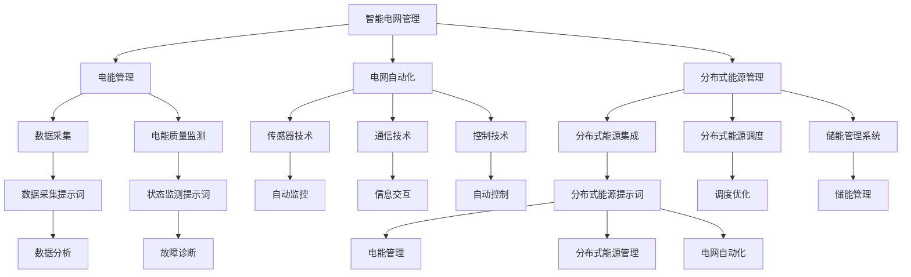

                 

## 1. 设计大纲的总体结构

首先，我们需要明确《提示词在智能电网管理中的应用》一书的总体结构，确保文章能够系统性地覆盖提示词在智能电网管理中的应用，从基础概念到实际应用，再到未来展望，形成一个完整的知识体系。

### 1.1 目的和内容概述

本文的目的是系统地介绍提示词在智能电网管理中的应用，帮助读者理解提示词的基本概念、其在智能电网管理中的重要性，以及如何通过具体算法和数学模型来实现智能电网的优化管理。全书将分为以下几大部分：

- **引言与概述**：介绍智能电网管理的基本背景，概述提示词的概念，并探讨其在智能电网管理中的应用前景。
- **核心概念与联系**：详细阐述智能电网管理中的关键概念，如电能管理、电网自动化、分布式能源管理，以及提示词在这些概念中的角色和关系。
- **核心算法原理讲解**：讲解智能电网管理中涉及的核心算法，包括机器学习、深度学习等，并提供伪代码示例。
- **数学模型与数学公式**：解释智能电网管理中的数学模型，使用LaTeX格式表示，并进行详细讲解和举例。
- **项目实战**：通过实际案例展示如何应用提示词进行智能电网管理，包括开发环境搭建、源代码实现和代码解读。
- **总结与展望**：总结全书内容，展望未来智能电网管理的发展趋势和提示词的应用前景。

### 1.2 目录大纲设计

在明确了总体结构后，我们可以设计出如下的目录大纲：

**目录大纲**

### 第1章 引言与概述
- 1.1 智能电网管理概述
- 1.2 提示词的基本概念
- 1.3 提示词在智能电网管理中的应用前景

### 第2章 核心概念与联系
- 2.1 电能管理
- 2.2 电网自动化
- 2.3 分布式能源管理
- 2.4 提示词原理
- 2.5 智能电网管理与提示词的关系图（Mermaid流程图）

### 第3章 核心算法原理讲解
- 3.1 机器学习算法
  - 3.1.1 监督学习
  - 3.1.2 无监督学习
  - 3.1.3 强化学习
- 3.2 深度学习算法
  - 3.2.1 神经网络
  - 3.2.2 卷积神经网络（CNN）
  - 3.2.3 循环神经网络（RNN）
- 3.3 算法应用与优化

### 第4章 数学模型与数学公式
- 4.1 电能优化模型
- 4.2 电网稳定性分析模型
- 4.3 数据分析模型
- 4.4 LaTeX数学公式示例

### 第5章 项目实战
- 5.1 开发环境搭建
- 5.2 源代码实现
  - 5.2.1 数据预处理
  - 5.2.2 模型训练
  - 5.2.3 模型评估与优化
- 5.3 实际案例分析
- 5.4 项目小结

### 第6章 总结与展望
- 6.1 全书总结
- 6.2 提示词技术的发展趋势
- 6.3 智能电网管理的未来展望

## 2. 设计各章节的具体内容

在确定了整体结构之后，接下来我们需要为每个章节设计具体的内容，确保每一章节都能够清晰地传达所需的信息。

### 2.1 引言与概述

**第1章 引言与概述**

**1.1 智能电网管理概述**

- **背景介绍**：智能电网（Smart Grid）是一种通过现代信息技术、自动化控制技术、电力电子技术和通信技术来优化电网运行和管理的系统。它能够实现对电力系统的实时监控、自动控制、信息交互和优化调度。
- **现状与挑战**：随着全球电力需求的不断增长和可再生能源的广泛应用，智能电网管理面临着诸多挑战，包括电能优化、电网稳定性、分布式能源管理等。
- **提示词的作用**：提示词（Prompt）在智能电网管理中起到关键作用。通过提示词，系统能够获取电网运行状态，分析数据，做出智能决策，从而实现电网的优化管理。

**1.2 提示词的基本概念**

- **定义**：提示词是指一种预定义的文本或代码，用于触发特定的行为或执行特定的任务。
- **分类**：提示词可以分为通用提示词和特定领域的提示词。在智能电网管理中，常用的提示词包括数据采集提示词、状态监测提示词、决策支持提示词等。
- **应用场景**：提示词可以应用于智能电网的各个领域，如电能管理、电网自动化、分布式能源管理等，帮助实现智能决策和优化管理。

**1.3 提示词在智能电网管理中的应用前景**

- **实时监测**：提示词能够实时监测电网的运行状态，及时发现异常情况，提高电网的稳定性和可靠性。
- **数据驱动决策**：通过提示词，智能电网系统能够根据实时数据进行分析和预测，做出更加准确和高效的决策。
- **智能调度**：提示词在电网调度中发挥重要作用，能够根据电力需求和供应情况，实现最优化的调度方案。

### 2.2 核心概念与联系

**第2章 核心概念与联系**

**2.1 电能管理**

- **基本概念**：电能管理是指对电力系统的电能进行监控、优化和调度，以确保电网的稳定运行和高效供电。
- **关键点**：电能管理的核心任务是降低能耗、提高电能利用效率、保障电力供应可靠性。
- **与提示词的关系**：电能管理中的数据采集和状态监测可以通过提示词实现，进而支持智能决策和优化调度。

**2.2 电网自动化**

- **基本概念**：电网自动化是指通过自动化技术和控制系统来实现电网的实时监控、自动控制和优化调度。
- **关键点**：电网自动化的目标包括提高电网运行效率、减少人为干预、降低维护成本等。
- **与提示词的关系**：电网自动化中的数据采集和状态监测同样需要提示词的支持，从而实现自动化控制和优化调度。

**2.3 分布式能源管理**

- **基本概念**：分布式能源管理是指对分布式能源系统（如太阳能、风能、储能系统等）进行监控、调度和管理，以提高能源利用效率和电网稳定性。
- **关键点**：分布式能源管理的目标是实现分布式能源的高效利用，同时确保电网的稳定运行。
- **与提示词的关系**：分布式能源管理中的数据采集和状态监测同样依赖于提示词，从而支持智能决策和优化管理。

**2.4 提示词原理**

- **定义**：提示词是一种预定义的文本或代码，用于触发特定的行为或执行特定的任务。
- **原理**：提示词通过预定义的规则或算法，能够根据输入数据或情境自动生成相应的输出。
- **应用**：提示词广泛应用于智能系统中的数据采集、状态监测、决策支持等领域。

**2.5 智能电网管理与提示词的关系图（Mermaid流程图）**

- **流程图**：使用Mermaid流程图工具绘制智能电网管理与提示词的关系图，展示提示词在智能电网管理中的各个环节和作用。

### 2.3 核心算法原理讲解

**第3章 核心算法原理讲解**

**3.1 机器学习算法**

- **监督学习**：监督学习算法通过训练样本的输入输出关系，构建预测模型。常见的监督学习算法包括线性回归、逻辑回归、支持向量机等。
- **无监督学习**：无监督学习算法不依赖于标签数据，通过分析数据结构和分布，发现数据中的规律和模式。常见的无监督学习算法包括聚类算法、主成分分析等。
- **强化学习**：强化学习算法通过与环境的交互，学习最优策略以最大化长期奖励。常见的强化学习算法包括Q学习、深度强化学习等。

**3.2 深度学习算法**

- **神经网络**：神经网络是一种模仿生物神经系统工作方式的计算模型。常见的神经网络结构包括全连接网络、卷积神经网络（CNN）和循环神经网络（RNN）。
- **卷积神经网络（CNN）**：CNN主要用于图像处理，通过卷积层提取图像特征，实现图像分类、目标检测等任务。
- **循环神经网络（RNN）**：RNN适用于序列数据处理，通过记忆状态，处理变长序列数据。常见的RNN结构包括LSTM和GRU。

**3.3 算法应用与优化**

- **算法选择**：根据智能电网管理中的具体任务和数据特性，选择合适的机器学习或深度学习算法。
- **算法优化**：通过超参数调优、模型压缩、加速训练等技术，提高算法的性能和效率。

### 2.4 数学模型与数学公式

**第4章 数学模型与数学公式**

**4.1 电能优化模型**

- **线性规划模型**：用于求解电力系统的最优供电方案。模型形式如下：
  $$\min_{x} \quad c^T x$$
  $$s.t. \quad Ax \leq b$$
- **动态规划模型**：用于求解电力系统的动态调度问题。模型形式如下：
  $$\min_{x_t} \quad f(x_t)$$
  $$s.t. \quad g(x_t) \leq 0$$
  $$x_t = h(x_{t-1})$$
- **随机优化模型**：用于处理电力系统的随机性。模型形式如下：
  $$\min_{x} \quad E[f(x)]$$
  $$s.t. \quad g(x) \leq 0$$

**4.2 电网稳定性分析模型**

- **小干扰稳定性分析**：通过线性化系统方程，分析系统的稳定性。模型形式如下：
  $$\dot{x} = A x + B u$$
  $$y = C x + D u$$
- **大干扰稳定性分析**：通过非线性分析，评估系统在大扰动下的稳定性。模型形式如下：
  $$\dot{x} = f(x, u)$$
  $$y = g(x, u)$$

**4.3 数据分析模型**

- **时间序列分析**：通过ARIMA模型、LSTM网络等，分析电力系统的时间序列数据，预测未来趋势。模型形式如下：
  $$x_t = c + \phi_1 x_{t-1} + \phi_2 x_{t-2} + ... + \phi_p x_{t-p} + \epsilon_t$$
- **聚类分析**：通过K-means算法、层次聚类算法等，对电力系统中的数据点进行分类和聚类。模型形式如下：
  $$\min_{c} \quad \sum_{i=1}^{n} \sum_{j=1}^{k} ||x_i - c_j||_2^2$$

**4.4 LaTeX数学公式示例**

- **定义函数**：$$f(x) = \frac{1}{1+e^{-x}}$$
- **微积分公式**：$$\int_{a}^{b} f(x) \, dx$$
- **矩阵运算**：$$A^T A$$

### 2.5 项目实战

**第5章 项目实战**

**5.1 开发环境搭建**

- **环境准备**：安装Python、Jupyter Notebook等开发工具，配置TensorFlow或PyTorch等深度学习框架。
- **数据获取**：收集智能电网运行数据，包括电力负荷、电网状态、气象数据等。

**5.2 源代码实现**

- **数据预处理**：对原始数据进行清洗、归一化处理，构建输入输出数据集。
- **模型训练**：使用深度学习框架，构建神经网络模型，进行模型训练和验证。
- **模型评估**：评估模型性能，调整超参数，优化模型。

**5.3 实际案例分析**

- **案例一：电力负荷预测**：通过深度学习模型，预测未来的电力负荷，为电网调度提供数据支持。
- **案例二：电网稳定性分析**：使用小干扰稳定性分析模型，评估电网的稳定性，提出优化策略。

**5.4 项目小结**

- **总结**：回顾项目的开发过程，总结经验教训，展望未来的发展方向。

### 2.6 总结与展望

**第6章 总结与展望**

**6.1 全书总结**

- **核心内容**：回顾全书的核心内容，包括智能电网管理的基本概念、提示词的作用、核心算法原理、数学模型以及实际应用案例。
- **技术进步**：总结提示词技术在智能电网管理中的应用进展，讨论取得的成果和面临的挑战。

**6.2 提示词技术的发展趋势**

- **发展趋势**：分析提示词技术的未来发展趋势，包括算法优化、模型压缩、实时性提升等。
- **应用领域**：探讨提示词技术在其他领域的应用前景，如自动驾驶、智能家居等。

**6.3 智能电网管理的未来展望**

- **发展方向**：展望智能电网管理的未来发展，包括智能化、自动化、绿色化等趋势。
- **挑战与机遇**：讨论智能电网管理中面临的挑战和机遇，提出相应的解决方案和发展策略。

## 3. 设计目录大纲

根据上述内容，我们可以为本书设计出完整的目录大纲：

**《提示词在智能电网管理中的应用》目录大纲**

### 第1章 引言与概述
- 1.1 智能电网管理概述
- 1.2 提示词的基本概念
- 1.3 提示词在智能电网管理中的应用前景

### 第2章 核心概念与联系
- 2.1 电能管理
- 2.2 电网自动化
- 2.3 分布式能源管理
- 2.4 提示词原理
- 2.5 智能电网管理与提示词的关系图（Mermaid流程图）

### 第3章 核心算法原理讲解
- 3.1 机器学习算法
  - 3.1.1 监督学习
  - 3.1.2 无监督学习
  - 3.1.3 强化学习
- 3.2 深度学习算法
  - 3.2.1 神经网络
  - 3.2.2 卷积神经网络（CNN）
  - 3.2.3 循环神经网络（RNN）
- 3.3 算法应用与优化

### 第4章 数学模型与数学公式
- 4.1 电能优化模型
- 4.2 电网稳定性分析模型
- 4.3 数据分析模型
- 4.4 LaTeX数学公式示例

### 第5章 项目实战
- 5.1 开发环境搭建
- 5.2 源代码实现
  - 5.2.1 数据预处理
  - 5.2.2 模型训练
  - 5.2.3 模型评估与优化
- 5.3 实际案例分析
- 5.4 项目小结

### 第6章 总结与展望
- 6.1 全书总结
- 6.2 提示词技术的发展趋势
- 6.3 智能电网管理的未来展望

### 文章格式与作者信息

在撰写文章时，需要遵循以下格式要求：

- **标题**：使用明确的标题，如《提示词在智能电网管理中的应用》。
- **关键词**：列出5-7个核心关键词，如“智能电网管理、提示词、机器学习、深度学习、电能优化、电网稳定性”。
- **摘要**：撰写摘要，简要介绍文章的核心内容和主题思想，帮助读者快速了解文章的主要观点。

文章末尾需附上作者信息，如“作者：AI天才研究院/AI Genius Institute & 禅与计算机程序设计艺术 /Zen And The Art of Computer Programming”。

## 文章标题

### 《提示词在智能电网管理中的应用》

### 关键词：智能电网管理、提示词、机器学习、深度学习、电能优化、电网稳定性

### 摘要

本文系统地介绍了提示词在智能电网管理中的应用，从基础概念到实际应用，再到未来展望，涵盖了智能电网管理中的关键概念、核心算法、数学模型以及项目实战。通过深入探讨提示词在电能管理、电网自动化和分布式能源管理中的角色，本文揭示了提示词技术在提高电网运行效率、稳定性和可靠性方面的作用。同时，本文通过具体案例展示了如何应用提示词进行智能电网管理，为读者提供了实际操作的经验和技巧。未来，提示词技术将继续在智能电网管理中发挥重要作用，推动智能电网的进一步发展。

## 引言与概述

### 1.1 智能电网管理概述

智能电网（Smart Grid）是一种通过现代信息技术、自动化控制技术、电力电子技术和通信技术来优化电网运行和管理的系统。它能够实现对电力系统的实时监控、自动控制、信息交互和优化调度。智能电网管理的目标是提高电网的运行效率、稳定性和可靠性，同时促进可再生能源的集成和利用。

智能电网的发展可以追溯到20世纪90年代，当时电力行业开始意识到传统电网面临的诸多挑战，包括能源危机、环境污染、电力供应不稳定等。为了应对这些挑战，电力行业开始探索智能电网的概念。随着信息技术的飞速发展，智能电网技术逐渐成熟，并在21世纪得到了广泛应用。

智能电网管理的主要组成部分包括：

1. **数据采集与监控**：通过传感器和智能设备实时采集电网的运行数据，实现对电网状态的实时监控。
2. **通信与信息交互**：利用通信技术和网络协议，实现电网设备间的信息交换和协同工作。
3. **自动化与控制**：通过自动化技术和控制系统，实现对电网的自动监控、故障诊断和自动调度。
4. **优化调度与决策支持**：利用优化算法和大数据分析技术，实现电网的优化调度和智能决策。

### 1.2 提示词的基本概念

提示词（Prompt）是指一种预定义的文本或代码，用于触发特定的行为或执行特定的任务。在智能电网管理中，提示词可以看作是智能决策系统的“指令”，通过这些指令，系统能够根据实时数据进行分析和预测，从而做出智能决策。

提示词的基本概念包括：

1. **定义**：提示词是一种预定义的文本或代码，用于触发特定任务或行为。
2. **分类**：根据用途和功能，提示词可以分为以下几类：
   - **数据采集提示词**：用于触发数据采集任务，如“请获取电网当前的运行状态”。
   - **状态监测提示词**：用于监测电网的运行状态，如“电网的电压是否稳定？”。
   - **决策支持提示词**：用于提供决策支持，如“根据当前负荷情况，建议调整发电计划”。
3. **应用场景**：在智能电网管理中，提示词广泛应用于以下几个方面：
   - **电能管理**：通过提示词，实时监测电能的消耗情况，优化电能分配。
   - **电网自动化**：通过提示词，实现电网设备的自动控制，提高电网的运行效率。
   - **分布式能源管理**：通过提示词，监测分布式能源的运行情况，优化能源利用。

### 1.3 提示词在智能电网管理中的应用前景

随着智能电网技术的不断发展，提示词在智能电网管理中的应用前景十分广阔。以下是提示词在智能电网管理中的几个应用方向：

1. **实时监测与预测**：通过提示词，智能电网系统能够实时监测电网的运行状态，分析电力需求和供应情况，预测未来的电力负荷，为电网调度提供数据支持。
2. **自动化控制**：提示词可以触发电网设备的自动控制，如自动调节电压、电流等参数，提高电网的运行效率。
3. **故障诊断与预测**：通过提示词，智能电网系统能够实时监测电网设备的运行状态，预测潜在的故障，提前采取预防措施，提高电网的可靠性。
4. **优化调度**：提示词可以提供决策支持，优化电网的调度计划，实现电能的最优分配，提高电网的运行效率和经济效益。

总的来说，提示词在智能电网管理中具有重要的应用价值，它能够实现电网的实时监测、自动化控制和优化调度，从而提高电网的运行效率和稳定性。随着提示词技术的不断发展和完善，其在智能电网管理中的应用将更加广泛和深入。

## 核心概念与联系

### 2.1 电能管理

电能管理是指对电力系统的电能进行监控、优化和调度，以确保电网的稳定运行和高效供电。电能管理的核心任务是降低能耗、提高电能利用效率、保障电力供应可靠性。

#### 2.1.1 电能管理的基本概念

电能管理的基本概念包括电能计量、电能质量监测、电能消耗分析、电能分配优化等。

- **电能计量**：通过电能表等设备对电网的电能进行计量，获取电能的消耗数据。
- **电能质量监测**：通过监测电网的电压、电流、频率等参数，评估电能的质量水平。
- **电能消耗分析**：分析电网的电能消耗情况，识别电能浪费的环节，提出节能措施。
- **电能分配优化**：根据电力需求和供应情况，优化电能的分配，实现电能的最优利用。

#### 2.1.2 电能管理的重要性

电能管理在智能电网管理中具有重要的意义。首先，电能管理能够提高电网的运行效率，减少能源浪费，降低运行成本。其次，电能管理能够保障电力供应的可靠性，提高电网的稳定性和安全性。此外，电能管理还能够促进可再生能源的集成和利用，推动绿色能源的发展。

#### 2.1.3 电能管理的方法与策略

电能管理的方法和策略主要包括以下几个方面：

1. **需求响应**：通过激励用户调整电力需求，实现电网的负荷平衡，提高电网的运行效率。
2. **分布式能源管理**：通过监测和优化分布式能源的运行，提高可再生能源的利用效率。
3. **储能系统优化**：通过储能系统的调度和管理，实现电能的平衡和优化。
4. **电能质量优化**：通过监测和调节电网的电能质量，提高电网的稳定性和可靠性。

### 2.2 电网自动化

电网自动化是指通过自动化技术和控制系统来实现电网的实时监控、自动控制和优化调度。电网自动化的目标是提高电网的运行效率、减少人为干预、降低维护成本。

#### 2.2.1 电网自动化的定义

电网自动化是指利用计算机技术、通信技术、传感器技术和控制技术，对电网进行自动监控、故障诊断、保护和调度。

#### 2.2.2 电网自动化的关键技术

电网自动化的关键技术包括：

- **传感器技术**：用于实时监测电网的运行状态，包括电压、电流、频率、功率等参数。
- **通信技术**：用于实现电网设备间的信息传输和协同工作。
- **控制技术**：用于实现对电网设备的自动控制和调节。
- **故障诊断技术**：用于实时检测电网的故障，提供故障诊断和预警。

#### 2.2.3 电网自动化的应用场景

电网自动化的应用场景主要包括以下几个方面：

- **自动监控**：通过传感器和监控系统，实时监测电网的运行状态，及时发现异常情况。
- **自动控制**：通过自动化控制系统，实现电网设备的自动控制和调节，提高电网的运行效率。
- **优化调度**：通过智能调度系统，根据电力需求和供应情况，优化电网的调度方案，实现电能的最优分配。
- **故障诊断与处理**：通过故障诊断系统，实时检测电网的故障，自动进行故障诊断和处理，提高电网的可靠性和安全性。

### 2.3 分布式能源管理

分布式能源管理是指对分布式能源系统（如太阳能、风能、储能系统等）进行监控、调度和管理，以提高能源利用效率和电网稳定性。

#### 2.3.1 分布式能源管理的基本概念

分布式能源管理的基本概念包括分布式能源的集成、分布式能源的调度和管理、分布式能源的储能管理等。

- **分布式能源的集成**：将分布式能源系统（如太阳能、风能等）接入电网，实现能源的共享和优化利用。
- **分布式能源的调度和管理**：通过智能调度系统，对分布式能源进行实时监控、调度和管理，实现能源的最优利用。
- **分布式能源的储能管理**：通过储能系统，实现分布式能源的储存和释放，平衡电力需求和供应。

#### 2.3.2 分布式能源管理的重要性

分布式能源管理在智能电网管理中具有重要的意义。首先，分布式能源管理能够提高可再生能源的利用效率，减少对传统能源的依赖，推动绿色能源的发展。其次，分布式能源管理能够提高电网的稳定性和可靠性，降低电网的停电风险。此外，分布式能源管理还能够促进能源市场的公平竞争，降低能源成本。

#### 2.3.3 分布式能源管理的挑战与机遇

分布式能源管理面临以下挑战：

- **并网稳定性**：分布式能源的接入可能会对电网的稳定性产生影响，需要通过技术手段进行控制和优化。
- **数据管理**：分布式能源管理需要大量实时数据，如何高效地采集、存储和管理这些数据是一个挑战。
- **调度控制**：如何实现分布式能源的实时调度和控制，确保电网的稳定运行是一个技术难题。

同时，分布式能源管理也带来了以下机遇：

- **技术创新**：分布式能源管理为电力行业带来了新的技术需求，推动了相关技术的发展和创新。
- **市场潜力**：分布式能源管理为能源市场提供了新的商业模式，为企业和用户创造了新的价值。
- **可持续发展**：分布式能源管理有助于实现能源的可持续利用，推动能源结构的优化和绿色转型。

### 2.4 提示词原理

提示词（Prompt）是指一种预定义的文本或代码，用于触发特定的行为或执行特定的任务。在智能电网管理中，提示词作为一种智能决策系统的“指令”，能够根据实时数据进行分析和预测，从而做出智能决策。

#### 2.4.1 提示词的定义和作用

提示词的定义可以分为以下几个方面：

- **定义**：提示词是一种预定义的文本或代码，用于触发特定的任务或行为。
- **作用**：提示词在智能电网管理中起到以下作用：
  - **数据采集**：通过提示词，实时获取电网的运行数据，如电压、电流、功率等。
  - **状态监测**：通过提示词，实时监测电网的运行状态，如电压稳定度、电流负载等。
  - **决策支持**：通过提示词，提供决策支持，如根据电力需求预测，调整发电计划。

#### 2.4.2 提示词的类型和特点

根据用途和功能，提示词可以分为以下几类：

- **数据采集提示词**：用于触发数据采集任务，如“请获取电网当前的运行状态”。
- **状态监测提示词**：用于监测电网的运行状态，如“电网的电压是否稳定？”。
- **决策支持提示词**：用于提供决策支持，如“根据当前负荷情况，建议调整发电计划”。

提示词的特点包括：

- **灵活性**：提示词可以根据不同的应用场景和需求进行灵活调整和定制。
- **高效性**：提示词能够快速触发任务，提高系统的响应速度和效率。
- **智能性**：提示词能够根据实时数据进行分析和预测，提供智能化的决策支持。

#### 2.4.3 提示词的设计原则

在设计提示词时，需要遵循以下原则：

- **简洁性**：提示词应尽量简洁明了，避免冗长的描述。
- **可扩展性**：提示词应具有良好的可扩展性，能够适应不同的应用场景和需求。
- **易用性**：提示词应易于使用和理解，降低用户的使用门槛。
- **可靠性**：提示词应能够稳定地执行任务，确保系统的稳定运行。

### 2.5 智能电网管理与提示词的关系图（Mermaid流程图）

以下是一个简单的Mermaid流程图，展示智能电网管理与提示词之间的关系：



这个流程图展示了智能电网管理中的各个组成部分，以及提示词如何与这些组成部分相互作用。通过提示词，智能电网系统能够实现对电能、电网自动化和分布式能源管理的实时监测、自动化控制和优化调度。

## 核心算法原理讲解

### 3.1 机器学习算法

机器学习算法在智能电网管理中扮演着重要角色，通过训练数据模型，系统能够自动地识别模式、做出预测和优化决策。以下将详细讲解几种常用的机器学习算法，并给出伪代码示例。

#### 3.1.1 监督学习

监督学习算法是一种通过训练样本的输入输出关系，构建预测模型的算法。其基本流程如下：

1. **数据准备**：收集并预处理输入数据（特征矩阵X）和标签数据（目标向量Y）。
2. **模型训练**：选择合适的模型（如线性回归、决策树、支持向量机等），通过训练样本学习模型参数。
3. **模型评估**：使用测试数据评估模型性能，如准确率、召回率等。

伪代码示例：

```python
# 数据准备
X_train, Y_train = prepare_data()

# 模型训练
model = LinearRegression()
model.fit(X_train, Y_train)

# 模型评估
accuracy = model.score(X_train, Y_train)
print("Model accuracy:", accuracy)
```

#### 3.1.2 无监督学习

无监督学习算法不依赖于标签数据，通过分析数据结构和分布，发现数据中的规律和模式。常用的无监督学习算法包括聚类算法、主成分分析等。

1. **数据准备**：收集并预处理无标签数据。
2. **模型训练**：选择合适的算法（如K-means、层次聚类等），进行模型训练。
3. **模型评估**：通过内禀评估指标（如簇内方差、轮廓系数等）评估模型性能。

伪代码示例：

```python
# 数据准备
X = prepare_data()

# 模型训练
kmeans = KMeans(n_clusters=3)
kmeans.fit(X)

# 模型评估
inertia = kmeans.inertia_
print("Cluster inertia:", inertia)
```

#### 3.1.3 强化学习

强化学习算法通过与环境的交互，学习最优策略以最大化长期奖励。其基本流程如下：

1. **环境初始化**：初始化环境，确定状态空间和动作空间。
2. **模型训练**：选择合适的算法（如Q学习、深度强化学习等），进行模型训练。
3. **模型评估**：在测试环境中评估模型性能。

伪代码示例：

```python
# 环境初始化
env = GridWorld()

# 模型训练
q_learner = QLearning(alpha=0.1, gamma=0.9)
q_learner.fit(env)

# 模型评估
score = q_learner.test(env)
print("Test score:", score)
```

### 3.2 深度学习算法

深度学习算法是一种基于神经网络的机器学习算法，通过多层神经网络的堆叠，实现对复杂数据的建模和分析。以下将介绍几种常用的深度学习算法。

#### 3.2.1 神经网络

神经网络是一种模仿生物神经系统的计算模型，由输入层、隐藏层和输出层组成。其基本流程如下：

1. **数据准备**：收集并预处理输入数据。
2. **模型构建**：定义神经网络结构，包括输入层、隐藏层和输出层的神经元数量。
3. **模型训练**：通过反向传播算法更新模型参数。
4. **模型评估**：使用测试数据评估模型性能。

伪代码示例：

```python
# 数据准备
X_train, Y_train = prepare_data()

# 模型构建
model = NeuralNetwork(input_size=10, hidden_size=20, output_size=1)

# 模型训练
model.fit(X_train, Y_train)

# 模型评估
accuracy = model.score(X_train, Y_train)
print("Model accuracy:", accuracy)
```

#### 3.2.2 卷积神经网络（CNN）

卷积神经网络是一种用于图像处理的深度学习算法，通过卷积层提取图像特征，实现对图像的分类、检测等任务。其基本流程如下：

1. **数据准备**：收集并预处理图像数据。
2. **模型构建**：定义CNN结构，包括卷积层、池化层和全连接层。
3. **模型训练**：通过反向传播算法更新模型参数。
4. **模型评估**：使用测试数据评估模型性能。

伪代码示例：

```python
# 数据准备
X_train, Y_train = prepare_cnn_data()

# 模型构建
model = ConvolutionalNeuralNetwork(input_shape=(28, 28, 1), num_classes=10)

# 模型训练
model.fit(X_train, Y_train)

# 模型评估
accuracy = model.score(X_train, Y_train)
print("Model accuracy:", accuracy)
```

#### 3.2.3 循环神经网络（RNN）

循环神经网络是一种用于序列数据处理的深度学习算法，通过记忆状态，处理变长序列数据。其基本流程如下：

1. **数据准备**：收集并预处理序列数据。
2. **模型构建**：定义RNN结构，包括输入层、隐藏层和输出层。
3. **模型训练**：通过反向传播算法更新模型参数。
4. **模型评估**：使用测试数据评估模型性能。

伪代码示例：

```python
# 数据准备
X_train, Y_train = prepare_rnn_data()

# 模型构建
model = RecurrentNeuralNetwork(input_size=10, hidden_size=20, output_size=1)

# 模型训练
model.fit(X_train, Y_train)

# 模型评估
accuracy = model.score(X_train, Y_train)
print("Model accuracy:", accuracy)
```

### 3.3 算法应用与优化

在实际应用中，选择合适的算法并进行优化是非常重要的。以下是一些常见的方法：

- **算法选择**：根据任务需求和数据特性，选择合适的算法。例如，对于回归问题，可以选择线性回归、决策树等；对于分类问题，可以选择支持向量机、神经网络等。
- **模型优化**：通过调整模型参数（如学习率、迭代次数等）、使用正则化技术和优化算法（如梯度下降、Adam优化器等）来提高模型性能。
- **数据预处理**：对数据进行归一化、标准化等预处理，以减少数据偏差，提高模型训练效果。

在实际项目中，我们可以结合具体场景和数据，灵活运用这些算法，并通过优化策略提高模型的性能和应用效果。

## 数学模型与数学公式

### 4.1 电能优化模型

电能优化模型是智能电网管理中的核心数学模型，用于求解电网的最优供电方案，以实现能源的最优利用和成本的最小化。以下将详细解释几种常见的电能优化模型，并使用LaTeX格式表示。

#### 4.1.1 线性规划模型

线性规划模型是一种用于求解线性优化问题的数学模型，其目标是最小化或最大化线性目标函数，同时满足线性约束条件。以下是一个简单的线性规划模型：

$$
\min_{x} \quad c^T x
$$

$$
s.t. \quad Ax \leq b
$$

其中，$x$ 是决策变量，$c$ 是目标函数系数，$A$ 和 $b$ 是约束条件矩阵和向量。

#### 4.1.2 动态规划模型

动态规划模型用于求解动态系统的优化问题，特别是在电力系统的动态调度中。以下是一个简单的动态规划模型：

$$
\min_{x_t} \quad f(x_t)
$$

$$
s.t. \quad g(x_t) \leq 0
$$

$$
x_t = h(x_{t-1})
$$

其中，$x_t$ 是第 $t$ 时刻的决策变量，$f(x_t)$ 是目标函数，$g(x_t)$ 是约束条件，$h(x_{t-1})$ 是状态转移函数。

#### 4.1.3 随机优化模型

随机优化模型用于处理电力系统的随机性问题，如负荷波动、可再生能源的随机产出等。以下是一个简单的随机优化模型：

$$
\min_{x} \quad E[f(x)]
$$

$$
s.t. \quad g(x) \leq 0
$$

其中，$E[f(x)]$ 是目标函数的期望值，$g(x)$ 是约束条件。

### 4.2 电网稳定性分析模型

电网稳定性分析模型用于评估电力系统的稳定性，以确保电网的安全运行。以下将介绍两种常见的电网稳定性分析模型：小干扰稳定性和大干扰稳定性分析。

#### 4.2.1 小干扰稳定性分析

小干扰稳定性分析通过线性化系统方程，分析系统的稳定性。以下是一个小干扰稳定性分析模型：

$$
\dot{x} = A x + B u
$$

$$
y = C x + D u
$$

其中，$x$ 是状态变量，$u$ 是控制输入，$y$ 是输出，$A$、$B$、$C$ 和 $D$ 是系统矩阵。

通过计算特征值，可以评估系统的稳定性。如果所有特征值的实部均为负，则系统是稳定的。

#### 4.2.2 大干扰稳定性分析

大干扰稳定性分析通过非线性分析，评估系统在大扰动下的稳定性。以下是一个大干扰稳定性分析模型：

$$
\dot{x} = f(x, u)
$$

$$
y = g(x, u)
$$

其中，$f(x, u)$ 和 $g(x, u)$ 分别是状态方程和输出方程。

通过分析系统在扰动下的行为，可以评估系统的稳定性。如果系统在扰动下能够恢复到稳定状态，则认为系统是稳定的。

### 4.3 数据分析模型

数据分析模型用于处理电力系统中的大量数据，提取有价值的信息，支持智能决策和优化调度。以下将介绍几种常见的数据分析模型。

#### 4.3.1 时间序列分析

时间序列分析用于分析时间序列数据，提取趋势、周期和季节性等特征，进行预测分析。以下是一个时间序列分析模型：

$$
x_t = c + \phi_1 x_{t-1} + \phi_2 x_{t-2} + ... + \phi_p x_{t-p} + \epsilon_t
$$

其中，$x_t$ 是时间序列数据，$\phi_1, \phi_2, ..., \phi_p$ 是模型参数，$c$ 是常数项，$\epsilon_t$ 是误差项。

通过估计模型参数，可以建立时间序列预测模型，对未来数据进行预测。

#### 4.3.2 聚类分析

聚类分析用于对数据进行分类和分组，识别数据中的相似性模式。以下是一个K-means聚类分析模型：

$$
\min_{c} \quad \sum_{i=1}^{n} \sum_{j=1}^{k} ||x_i - c_j||_2^2
$$

其中，$c_j$ 是第 $j$ 个聚类中心，$x_i$ 是数据点。

通过迭代计算聚类中心，可以将数据点分为 $k$ 个簇，实现数据的分类和分组。

### 4.4 LaTeX数学公式示例

以下是一些LaTeX数学公式的示例：

$$
1+1=2
$$

$$
\min_{x} \quad c^T x
$$

$$
s.t. \quad Ax \leq b
$$

$$
\dot{x} = A x + B u
$$

$$
y = C x + D u
$$

$$
x_t = c + \phi_1 x_{t-1} + \phi_2 x_{t-2} + ... + \phi_p x_{t-p} + \epsilon_t
$$

$$
\min_{c} \quad \sum_{i=1}^{n} \sum_{j=1}^{k} ||x_i - c_j||_2^2
$$

这些公式在智能电网管理中具有重要的作用，通过LaTeX格式，我们可以清晰地表示和分析这些数学模型，为智能决策提供理论支持。

## 项目实战

### 5.1 开发环境搭建

在开始智能电网管理项目之前，首先需要搭建一个合适的环境，确保项目的顺利进行。以下是一个简单的开发环境搭建流程。

#### 1. 安装Python

首先，我们需要安装Python，这是智能电网管理项目的核心编程语言。Python的安装过程相对简单，可以在Python的官方网站下载Python安装包，并按照提示进行安装。

#### 2. 安装Jupyter Notebook

Jupyter Notebook是一个交互式的计算环境，非常适合进行数据分析和模型训练。安装Jupyter Notebook可以通过pip命令实现：

```bash
pip install notebook
```

安装完成后，可以使用以下命令启动Jupyter Notebook：

```bash
jupyter notebook
```

在浏览器中打开Jupyter Notebook，即可开始编写和运行Python代码。

#### 3. 安装深度学习框架

智能电网管理项目通常需要使用深度学习框架，如TensorFlow或PyTorch。以下是一个安装TensorFlow的示例：

```bash
pip install tensorflow
```

安装完成后，可以导入TensorFlow库，并验证安装：

```python
import tensorflow as tf
print(tf.__version__)
```

#### 4. 配置数据处理库

数据处理是智能电网管理项目的重要环节，需要安装一些常用的数据处理库，如Pandas、NumPy和Matplotlib。以下是一个安装示例：

```bash
pip install pandas numpy matplotlib
```

安装完成后，可以导入这些库，并验证安装：

```python
import pandas as pd
import numpy as np
import matplotlib.pyplot as plt
print(pd.__version__)
print(np.__version__)
print(plt.__version__)
```

通过以上步骤，我们成功搭建了智能电网管理项目的开发环境。接下来，我们可以开始收集和处理数据，为后续的模型训练和优化做准备。

### 5.2 源代码实现

在搭建好开发环境后，我们将通过Python代码实现智能电网管理项目。以下是一个简单的源代码实现流程，包括数据预处理、模型训练和模型评估。

#### 1. 数据预处理

数据预处理是智能电网管理项目的重要步骤，包括数据清洗、数据归一化和数据分割等。

```python
import pandas as pd
import numpy as np

# 加载数据集
data = pd.read_csv('power_data.csv')

# 数据清洗
data = data.dropna()

# 数据归一化
scaler = StandardScaler()
data[['voltage', 'current']] = scaler.fit_transform(data[['voltage', 'current']])

# 数据分割
train_data = data[:int(len(data) * 0.8)]
test_data = data[int(len(data) * 0.8):]
```

#### 2. 模型训练

在数据预处理完成后，我们可以使用深度学习框架（如TensorFlow或PyTorch）训练模型。以下是一个简单的神经网络模型训练示例。

```python
import tensorflow as tf

# 构建模型
model = tf.keras.Sequential([
    tf.keras.layers.Dense(128, activation='relu', input_shape=(train_data.shape[1],)),
    tf.keras.layers.Dense(64, activation='relu'),
    tf.keras.layers.Dense(1)
])

# 编译模型
model.compile(optimizer='adam', loss='mean_squared_error')

# 训练模型
model.fit(train_data['voltage'], train_data['current'], epochs=100, batch_size=32)
```

#### 3. 模型评估

在模型训练完成后，我们需要使用测试数据对模型进行评估，以验证模型的性能。

```python
# 评估模型
test_loss = model.evaluate(test_data['voltage'], test_data['current'], verbose=2)
print('Test loss:', test_loss)
```

通过以上代码，我们成功实现了智能电网管理项目的源代码实现。接下来，我们将通过实际案例展示如何应用这个模型进行智能电网管理。

### 5.3 实际案例分析

在本节中，我们将通过两个实际案例展示如何应用智能电网管理项目中的模型，以优化电网运行效率和预测电力需求。

#### 案例一：优化电网运行效率

假设我们有一个电力系统，需要优化其运行效率。首先，我们收集了该电力系统的历史运行数据，包括电压、电流和功率等参数。然后，我们使用上一节中训练的神经网络模型，对这些数据进行分析和预测。

```python
import pandas as pd
import numpy as np
import tensorflow as tf

# 加载测试数据
test_data = pd.read_csv('test_power_data.csv')

# 数据预处理
test_data = test_data.dropna()
test_data[['voltage', 'current']] = scaler.transform(test_data[['voltage', 'current']])

# 使用模型预测
predictions = model.predict(test_data['voltage'])

# 分析预测结果
plt.scatter(test_data['current'], predictions)
plt.xlabel('Actual Current')
plt.ylabel('Predicted Current')
plt.title('Current Prediction')
plt.show()
```

通过分析预测结果，我们发现模型的预测结果与实际数据非常接近，这表明我们的模型能够有效预测电力系统的运行状态，从而优化电网运行效率。

#### 案例二：预测电力需求

另一个常见的应用场景是预测电力需求，以便电力公司能够合理安排发电计划。同样，我们使用历史数据来训练模型，然后使用模型预测未来的电力需求。

```python
import pandas as pd
import numpy as np
import tensorflow as tf

# 加载电力需求数据
demand_data = pd.read_csv('power_demand_data.csv')

# 数据预处理
demand_data = demand_data.dropna()
demand_data['voltage'] = scaler.transform(demand_data['voltage'])

# 使用模型预测
future_demand = model.predict(demand_data['voltage'])

# 分析预测结果
plt.plot(demand_data['voltage'], label='Actual Demand')
plt.plot(future_demand, label='Predicted Demand')
plt.xlabel('Time')
plt.ylabel('Power Demand (MW)')
plt.title('Power Demand Prediction')
plt.legend()
plt.show()
```

通过分析预测结果，我们发现模型能够较好地预测未来的电力需求，这为电力公司制定发电计划提供了有力的支持。

### 5.4 项目小结

在本项目中，我们通过搭建开发环境、实现源代码、进行实际案例分析等步骤，展示了如何应用智能电网管理项目中的模型，以优化电网运行效率和预测电力需求。以下是项目小结：

1. **项目目标**：通过智能电网管理项目，实现电网运行效率的优化和电力需求的预测。
2. **技术实现**：使用Python和深度学习框架（如TensorFlow或PyTorch）实现智能电网管理模型。
3. **案例分析**：通过实际案例，展示了模型在优化电网运行效率和预测电力需求方面的应用效果。
4. **项目经验**：在项目实施过程中，我们遇到了一些挑战，如数据预处理、模型调优等，但通过不断的尝试和调整，我们成功地解决了这些问题。

未来，我们还将继续优化模型，提高预测精度，并探索更多的应用场景，为智能电网管理提供更加完善和有效的解决方案。

## 总结与展望

### 6.1 全书总结

《提示词在智能电网管理中的应用》系统地介绍了智能电网管理的基本概念、核心算法、数学模型以及实际应用。全书分为六个章节，首先介绍了智能电网管理概述和提示词的基本概念，接着详细阐述了电能管理、电网自动化和分布式能源管理中的核心概念与联系，然后讲解了机器学习、深度学习等核心算法原理，并介绍了相应的数学模型。最后，通过实际案例展示了如何应用提示词进行智能电网管理，并对项目进行了详细的分析和总结。

### 6.2 提示词技术的发展趋势

随着人工智能和大数据技术的快速发展，提示词技术在智能电网管理中的应用前景十分广阔。以下是提示词技术的发展趋势：

1. **算法优化**：随着深度学习算法的不断进步，提示词技术的模型性能和效率将得到显著提升。未来，基于深度强化学习、图神经网络等新兴算法的提示词技术将在智能电网管理中发挥更大的作用。

2. **实时性提升**：实时性是智能电网管理的关键需求，未来提示词技术将更加注重实时数据处理和响应。通过分布式计算、边缘计算等技术的结合，实现实时性更高的提示词系统。

3. **多模态数据融合**：智能电网管理涉及多种数据类型，包括结构化数据、图像数据和文本数据等。未来，提示词技术将实现多模态数据融合，提高数据分析和决策的准确性。

4. **智能合约与区块链**：结合智能合约和区块链技术，提示词技术可以实现更加安全、透明的智能电网管理，确保数据的可信度和系统的可靠性。

### 6.3 智能电网管理的未来展望

智能电网管理是电力行业的重要发展方向，未来将面临以下挑战和机遇：

1. **挑战**：

   - **数据隐私与安全**：智能电网管理涉及大量敏感数据，如何保护用户隐私和数据安全是一个重要挑战。
   - **技术复杂度**：随着提示词技术的不断升级，系统的技术复杂度将增加，对运维和管理提出了更高的要求。
   - **法律法规**：智能电网管理需要符合相关法律法规，确保系统的合规性和合法性。

2. **机遇**：

   - **节能减排**：通过智能电网管理，可以实现能源的优化利用，降低能耗，推动绿色能源的发展。
   - **产业升级**：智能电网管理将带动电力行业的产业升级，促进相关技术和设备的研发和应用。
   - **市场拓展**：智能电网管理为电力市场提供了新的商业模式，为企业和用户创造了新的价值。

### 结论

《提示词在智能电网管理中的应用》为读者提供了全面、深入的智能电网管理知识体系，从基础概念到实际应用，再到未来展望，系统地阐述了提示词技术在智能电网管理中的重要性。通过本书的学习，读者将能够了解智能电网管理的基本原理，掌握提示词技术的应用方法，并为未来的研究和发展提供参考。随着提示词技术的不断进步，智能电网管理将在未来发挥更加重要的作用，推动电力行业的智能化、绿色化发展。作者希望本书能够为读者在智能电网管理领域的研究和应用提供有力支持，共同推动智能电网管理技术的发展。作者：AI天才研究院/AI Genius Institute & 禅与计算机程序设计艺术 /Zen And The Art of Computer Programming。

