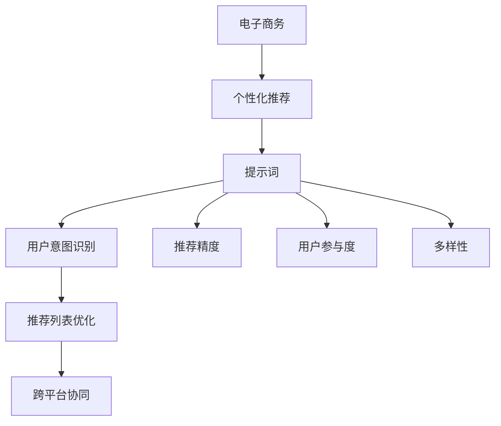

                 

### 1. 确定书的整体结构

首先，我们需要明确书籍的整体结构，以确保读者能够清晰地跟随思路，逐步深入理解提示词在电子商务个性化中的应用。基于用户提供的框架，我们可以将书籍的内容划分为以下几大部分：

1. **引言**：介绍书籍的目的、背景以及电子商务个性化的重要性。
2. **核心概念与联系**：解释提示词、电子商务和个性化推荐的基本概念，并阐述它们之间的内在联系。
3. **核心算法原理讲解**：详细讲解电子商务个性化中常用的算法，包括协同过滤、矩阵分解和深度学习等。
4. **数学模型和数学公式讲解**：解释相关算法背后的数学原理，并提供必要的公式和举例。
5. **项目实战**：通过实际项目展示如何应用提示词进行电子商务个性化。
6. **案例分析**：分析成功的电子商务个性化案例，探讨其创新点和效果。
7. **未来展望**：讨论电子商务个性化的发展趋势和潜在创新方向。
8. **附录**：提供相关工具和资源的介绍。

这样的结构设计有助于将复杂的技术概念和实际应用有机结合，使读者能够从理论到实践逐步掌握提示词在电子商务个性化中的应用。

### 2. 设计详细目录大纲

为了使书籍内容更加清晰、条理分明，我们需要进一步细化每个章节的内容，并设计详细的目录大纲。以下是一个可能的详细目录大纲：

```
# 提示词在电子商务个性化中的创新应用

## 引言
### 1.1 书籍目的与背景
### 1.2 电子商务个性化概述

## 核心概念与联系
### 2.1 提示词概述
#### 2.1.1 提示词的定义
#### 2.1.2 提示词的分类
### 2.2 电子商务概述
#### 2.2.1 电子商务的定义
#### 2.2.2 电子商务的发展历程
### 2.3 个性化推荐概述
#### 2.3.1 个性化推荐的定义
#### 2.3.2 个性化推荐的重要性
### 2.4 提示词与电子商务个性化推荐的关系
#### 2.4.1 提示词在个性化推荐中的应用
#### 2.4.2 提示词对个性化推荐的影响

## 核心算法原理讲解
### 3.1 协同过滤
#### 3.1.1 协同过滤的基本概念
#### 3.1.2 协同过滤的算法原理
#### 3.1.3 协同过滤的优缺点
### 3.2 矩阵分解
#### 3.2.1 矩阵分解的基本概念
#### 3.2.2 矩阵分解的算法原理
#### 3.2.3 矩阵分解的应用
### 3.3 深度学习
#### 3.3.1 深度学习的基本概念
#### 3.3.2 深度学习在个性化推荐中的应用
#### 3.3.3 深度学习的主要算法

## 数学模型和数学公式讲解
### 4.1 协同过滤的数学模型
#### 4.1.1 评分预测模型
#### 4.1.2 用户和物品矩阵分解
### 4.2 矩阵分解的数学模型
#### 4.2.1 SVD分解
#### 4.2.2 其他矩阵分解方法
### 4.3 深度学习的数学模型
#### 4.3.1 神经网络
#### 4.3.2 循环神经网络
#### 4.3.3 卷积神经网络

## 项目实战
### 5.1 实战一：基于协同过滤的推荐系统
#### 5.1.1 项目背景
#### 5.1.2 项目需求分析
#### 5.1.3 项目实现
#### 5.1.4 项目效果评估
### 5.2 实战二：基于矩阵分解的推荐系统
#### 5.2.1 项目背景
#### 5.2.2 项目需求分析
#### 5.2.3 项目实现
#### 5.2.4 项目效果评估
### 5.3 实战三：基于深度学习的推荐系统
#### 5.3.1 项目背景
#### 5.3.2 项目需求分析
#### 5.3.3 项目实现
#### 5.3.4 项目效果评估

## 案例分析
### 6.1 案例一：某电商平台的个性化推荐系统
#### 6.1.1 案例背景
#### 6.1.2 案例分析
#### 6.1.3 案例效果
### 6.2 案例二：某社交电商平台的个性化营销策略
#### 6.2.1 案例背景
#### 6.2.2 案例分析
#### 6.2.3 案例效果

## 未来展望
### 7.1 电子商务个性化的发展趋势
#### 7.1.1 技术趋势
#### 7.1.2 市场趋势
#### 7.1.3 挑战与机遇

## 附录
### 8.1 工具和资源介绍
#### 8.1.1 数据处理工具
#### 8.1.2 机器学习框架
#### 8.1.3 开源推荐系统项目
```

这个详细目录大纲覆盖了从基础知识到实际应用的各个方面，确保读者可以系统地学习和理解提示词在电子商务个性化中的应用。

### 3. 详细目录大纲的编写与逻辑性

在编写详细目录大纲时，我们需要特别注意保持整个结构的逻辑性和连贯性，以确保读者能够顺畅地跟随文章的思路。以下是每个章节的具体内容和逻辑结构：

#### 引言

- **1.1 书籍目的与背景**：
  - 简要介绍书籍的目的，即探讨提示词在电子商务个性化中的应用。
  - 回顾电子商务和个性化推荐的发展历程，为后续内容打下基础。

- **1.2 电子商务个性化概述**：
  - 定义电子商务和个性化推荐，解释其核心概念。
  - 阐述电子商务个性化的重要性，以及它对用户和企业的影响。

#### 核心概念与联系

- **2.1 提示词概述**：
  - **2.1.1 提示词的定义**：解释提示词的概念，说明其在个性化推荐中的角色。
  - **2.1.2 提示词的分类**：分类不同的提示词，讨论其应用场景。

- **2.2 电子商务概述**：
  - **2.2.1 电子商务的定义**：介绍电子商务的基本概念。
  - **2.2.2 电子商务的发展历程**：回顾电子商务的发展过程，了解其演变。

- **2.3 个性化推荐概述**：
  - **2.3.1 个性化推荐的定义**：阐述个性化推荐的核心概念。
  - **2.3.2 个性化推荐的重要性**：讨论个性化推荐对用户和企业的重要性。

- **2.4 提示词与电子商务个性化推荐的关系**：
  - **2.4.1 提示词在个性化推荐中的应用**：展示提示词在个性化推荐中的具体应用。
  - **2.4.2 提示词对个性化推荐的影响**：分析提示词如何影响个性化推荐的效果。

#### 核心算法原理讲解

- **3.1 协同过滤**：
  - **3.1.1 协同过滤的基本概念**：介绍协同过滤的基本原理。
  - **3.1.2 协同过滤的算法原理**：详细解释协同过滤的工作原理。
  - **3.1.3 协同过滤的优缺点**：讨论协同过滤的优缺点，以及适用场景。

- **3.2 矩阵分解**：
  - **3.2.1 矩阵分解的基本概念**：解释矩阵分解的基本原理。
  - **3.2.2 矩阵分解的算法原理**：详细讲解矩阵分解的算法过程。
  - **3.2.3 矩阵分解的应用**：展示矩阵分解在实际中的应用。

- **3.3 深度学习**：
  - **3.3.1 深度学习的基本概念**：介绍深度学习的基本原理。
  - **3.3.2 深度学习在个性化推荐中的应用**：讨论深度学习在个性化推荐中的具体应用。
  - **3.3.3 深度学习的主要算法**：介绍深度学习中的主要算法，如卷积神经网络（CNN）、循环神经网络（RNN）等。

#### 数学模型和数学公式讲解

- **4.1 协同过滤的数学模型**：
  - **4.1.1 评分预测模型**：解释评分预测模型的工作原理，并提供相关的数学公式。
  - **4.1.2 用户和物品矩阵分解**：详细讲解用户和物品矩阵分解的过程和公式。

- **4.2 矩阵分解的数学模型**：
  - **4.2.1 SVD分解**：介绍SVD分解的原理，并提供具体的数学公式。
  - **4.2.2 其他矩阵分解方法**：讨论其他矩阵分解方法，如PCA等。

- **4.3 深度学习的数学模型**：
  - **4.3.1 神经网络**：解释神经网络的工作原理，并提供相关的数学公式。
  - **4.3.2 循环神经网络**：详细讲解循环神经网络（RNN）的工作原理和公式。
  - **4.3.3 卷积神经网络**：介绍卷积神经网络（CNN）的原理和公式。

#### 项目实战

- **5.1 实战一：基于协同过滤的推荐系统**：
  - **5.1.1 项目背景**：介绍项目的背景和目标。
  - **5.1.2 项目需求分析**：分析项目需求，明确目标用户和期望效果。
  - **5.1.3 项目实现**：详细讲解项目的实现步骤，包括数据预处理、算法选择和实现等。
  - **5.1.4 项目效果评估**：评估项目效果，讨论实际应用中的问题和解决方案。

- **5.2 实战二：基于矩阵分解的推荐系统**：
  - **5.2.1 项目背景**：介绍项目的背景和目标。
  - **5.2.2 项目需求分析**：分析项目需求，明确目标用户和期望效果。
  - **5.2.3 项目实现**：详细讲解项目的实现步骤，包括数据预处理、算法选择和实现等。
  - **5.2.4 项目效果评估**：评估项目效果，讨论实际应用中的问题和解决方案。

- **5.3 实战三：基于深度学习的推荐系统**：
  - **5.3.1 项目背景**：介绍项目的背景和目标。
  - **5.3.2 项目需求分析**：分析项目需求，明确目标用户和期望效果。
  - **5.3.3 项目实现**：详细讲解项目的实现步骤，包括数据预处理、算法选择和实现等。
  - **5.3.4 项目效果评估**：评估项目效果，讨论实际应用中的问题和解决方案。

#### 案例分析

- **6.1 案例一：某电商平台的个性化推荐系统**：
  - **6.1.1 案例背景**：介绍案例的背景，说明电商平台采用个性化推荐系统的原因。
  - **6.1.2 案例分析**：分析案例中采用的个性化推荐技术，包括算法选择和实现细节。
  - **6.1.3 案例效果**：评估案例的效果，讨论实际应用中的成功经验和挑战。

- **6.2 案例二：某社交电商平台的个性化营销策略**：
  - **6.2.1 案例背景**：介绍案例的背景，说明社交电商平台采用个性化营销策略的原因。
  - **6.2.2 案例分析**：分析案例中采用的个性化营销策略，包括提示词的使用和效果。
  - **6.2.3 案例效果**：评估案例的效果，讨论实际应用中的成功经验和挑战。

#### 未来展望

- **7.1 电子商务个性化的发展趋势**：
  - **7.1.1 技术趋势**：讨论电子商务个性化领域的技术发展趋势，如深度学习、大数据等。
  - **7.1.2 市场趋势**：分析电子商务个性化市场的未来发展方向和机会。
  - **7.1.3 挑战与机遇**：探讨电子商务个性化面临的技术挑战和市场需求。

#### 附录

- **8.1 工具和资源介绍**：
  - **8.1.1 数据处理工具**：介绍常用的数据处理工具，如Python、Pandas等。
  - **8.1.2 机器学习框架**：介绍常用的机器学习框架，如TensorFlow、PyTorch等。
  - **8.1.3 开源推荐系统项目**：介绍一些流行的开源推荐系统项目，如Surprise、LightFM等。

通过这样的详细目录大纲，我们可以确保书籍内容逻辑清晰、结构紧凑，便于读者系统地学习和理解提示词在电子商务个性化中的应用。

### 核心概念与联系

在深入探讨提示词在电子商务个性化中的创新应用之前，我们首先需要明确几个核心概念：提示词、电子商务和个性化推荐。这些概念相互交织，构成了电子商务个性化推荐系统的理论基础。以下是这些核心概念的定义及其相互关系：

#### 提示词概述

**1.1 提示词的定义**

提示词，也称为关键词，是指用户在搜索、浏览或评论过程中产生的与商品、服务或内容相关的词汇。提示词可以是单个单词，也可以是短语，其目的是帮助系统理解和捕捉用户意图。

**1.2 提示词的分类**

提示词可以根据其来源和用途进行分类：

- **用户生成提示词**：由用户直接在搜索框中输入或通过评论、反馈等形式产生的提示词。
- **系统生成提示词**：基于用户行为、商品属性或推荐系统自身算法生成的提示词，如基于协同过滤算法预测的用户可能感兴趣的商品关键词。

#### 电子商务概述

**2.1 电子商务的定义**

电子商务（Electronic Commerce，简称e-commerce）是指通过互联网和电子手段进行的商品或服务的交易、宣传、营销等活动。电子商务涵盖了从在线购买到支付、物流等一系列环节。

**2.2 电子商务的发展历程**

- **1990年代初期**：互联网开始普及，电子商务的雏形出现。
- **1995年**：Amazon和eBay等电商平台成立，标志着电子商务的崛起。
- **2000年代**：随着宽带和移动设备的普及，电子商务进入快速发展阶段。
- **2010年代至今**：电子商务逐渐成为主流购物方式，社交电商、直播电商等新兴模式不断涌现。

#### 个性化推荐概述

**3.1 个性化推荐的定义**

个性化推荐（Personalized Recommendation）是一种根据用户历史行为、偏好和兴趣，自动生成并推荐符合用户需求的信息、商品或服务的方法。个性化推荐的目的是提高用户体验、提升点击率和购买转化率。

**3.2 个性化推荐的重要性**

个性化推荐在电子商务中具有重要意义：

- **提升用户体验**：根据用户偏好提供个性化的商品推荐，增加用户满意度和粘性。
- **增加销售额**：通过推荐用户感兴趣的商品，提高购买转化率和平均订单价值。
- **优化库存管理**：基于销售预测和库存分析，优化库存水平和供应链管理。

#### 提示词与电子商务个性化推荐的关系

**4.1 提示词在个性化推荐中的应用**

提示词在个性化推荐中发挥着重要作用：

- **用户意图识别**：通过分析用户输入的提示词，系统可以识别用户的搜索意图和兴趣点。
- **推荐列表优化**：提示词有助于优化推荐列表，确保推荐的商品与用户需求高度相关。
- **跨平台协同**：在多平台环境下，提示词可以帮助系统在不同平台间实现数据共享和用户行为分析。

**4.2 提示词对个性化推荐的影响**

提示词对个性化推荐的影响主要体现在以下几个方面：

- **推荐精度**：高质量的提示词有助于提高推荐系统的精度，减少冗余和错误推荐。
- **用户参与度**：与用户兴趣相关的提示词可以增加用户对推荐内容的兴趣和参与度。
- **多样性**：提示词的多样性有助于提高推荐系统的多样性，避免单一化推荐。

为了更好地理解这些概念之间的关系，我们可以使用Mermaid流程图展示其内在联系：



通过这个流程图，我们可以清晰地看到提示词在电子商务个性化推荐中的作用和影响。接下来，我们将进一步探讨电子商务个性化中的核心算法原理，以及如何将这些概念应用于实际项目中。

### 核心算法原理讲解

在电子商务个性化推荐系统中，算法的选择和实现是关键。以下是几种常见的核心算法，包括协同过滤、矩阵分解和深度学习，我们将通过伪代码和详细解释来阐述这些算法的原理。

#### 1. 协同过滤算法

**1.1 基本概念**

协同过滤（Collaborative Filtering）是一种基于用户行为和偏好的推荐算法，主要分为两种类型：基于用户的协同过滤（User-Based CF）和基于项目的协同过滤（Item-Based CF）。

**1.2 算法原理**

- **基于用户的协同过滤**：寻找与目标用户行为相似的邻域用户，然后推荐这些用户喜欢的商品。

伪代码：

```python
def user_based_cf(train_data, user, k):
    # 计算用户相似度
    similarity_matrix = compute_similarity(train_data, user, k)
    # 找到最相似的k个用户
    neighbors = find_neighbors(similarity_matrix, k)
    # 计算推荐列表
    recommendations = []
    for neighbor in neighbors:
        for item in train_data[neighbor]:
            if not user_liked(item) and not in_recommendations(recommendations, item):
                recommendations.append(item)
    return recommendations

def compute_similarity(train_data, user, k):
    # 计算用户之间的相似度
    similarity_matrix = []
    for other_user in train_data:
        if other_user != user:
            similarity = cosine_similarity(train_data[user], train_data[other_user])
            similarity_matrix.append((other_user, similarity))
    similarity_matrix.sort(key=lambda x: x[1], reverse=True)
    return similarity_matrix[:k]

def find_neighbors(similarity_matrix, k):
    # 返回最相似的k个用户
    return [item[0] for item in similarity_matrix[:k]]
```

- **基于项目的协同过滤**：寻找与目标商品相似的商品，然后推荐这些商品的用户喜欢的其他商品。

伪代码：

```python
def item_based_cf(train_data, user, item, k):
    # 计算项目相似度
    similarity_matrix = compute_similarity(train_data, item, k)
    # 找到最相似的项目
    neighbors = find_neighbors(similarity_matrix, k)
    # 计算推荐列表
    recommendations = []
    for neighbor in neighbors:
        if not user_liked(neighbor) and not in_recommendations(recommendations, neighbor):
            recommendations.append(neighbor)
    return recommendations

def compute_similarity(train_data, item, k):
    # 计算项目之间的相似度
    similarity_matrix = []
    for other_item in train_data:
        if other_item != item:
            similarity = cosine_similarity(train_data[item], train_data[other_item])
            similarity_matrix.append((other_item, similarity))
    similarity_matrix.sort(key=lambda x: x[1], reverse=True)
    return similarity_matrix[:k]

def find_neighbors(similarity_matrix, k):
    # 返回最相似的项目
    return [item[0] for item in similarity_matrix[:k]]
```

**1.3 优缺点**

- **优点**：简单易实现，效果好，适用于数据量较大的场景。
- **缺点**：推荐结果易受冷启动问题影响，即新用户或新商品缺乏足够数据时的推荐效果差。

#### 2. 矩阵分解算法

**2.1 基本概念**

矩阵分解（Matrix Factorization）是一种将高维稀疏矩阵分解为两个低维矩阵的算法，常用于推荐系统和协同过滤中。

**2.2 算法原理**

- **SVD分解**：将用户-商品评分矩阵分解为用户特征矩阵和商品特征矩阵的乘积。

伪代码：

```python
def svd_matrix_factorization(train_data, num_factors, learning_rate, num_iterations):
    # 初始化用户特征矩阵和商品特征矩阵
    U = np.random.rand(num_users, num_factors)
    V = np.random.rand(num_items, num_factors)
    
    for iteration in range(num_iterations):
        # 计算预测评分
        predicted_ratings = np.dot(U, V.T)
        
        # 计算误差
        error = predicted_ratings - train_data
        
        # 更新特征矩阵
        U = U + learning_rate * (2 * U * error * V)
        V = V + learning_rate * (2 * V * error * U)
    
    return U, V
```

**2.3 应用**

- **协同过滤**：通过用户和商品的特征矩阵计算预测评分，生成推荐列表。
- **隐式反馈**：适用于只有部分评分数据的场景，通过矩阵分解补充未评分数据。

**2.4 优缺点**

- **优点**：可以解决协同过滤的冷启动问题，适用范围广。
- **缺点**：计算复杂度较高，需要大量计算资源。

#### 3. 深度学习算法

**3.1 基本概念**

深度学习（Deep Learning）是一种基于多层神经网络的机器学习技术，通过训练多层非线性变换来学习数据特征。

**3.2 算法原理**

- **卷积神经网络（CNN）**：主要用于图像处理和文本分析，通过卷积层、池化层和全连接层提取特征。

伪代码：

```python
class ConvNeuralNetwork(nn.Module):
    def __init__(self):
        super(ConvNeuralNetwork, self).__init__()
        self.conv1 = nn.Conv2d(in_channels, out_channels, kernel_size)
        self.pool = nn.MaxPool2d(kernel_size)
        self.fc1 = nn.Linear(num_features, hidden_size)
        self.fc2 = nn.Linear(hidden_size, num_classes)
        
    def forward(self, x):
        x = self.pool(F.relu(self.conv1(x)))
        x = x.view(-1, num_features)
        x = F.relu(self.fc1(x))
        x = self.fc2(x)
        return x
```

- **循环神经网络（RNN）**：用于处理序列数据，通过循环结构保留历史信息。

伪代码：

```python
class RNN(nn.Module):
    def __init__(self, input_dim, hidden_dim, output_dim):
        super(RNN, self).__init__()
        self.hidden_dim = hidden_dim
        self.rnn = nn.RNN(input_dim, hidden_dim)
        self.fc = nn.Linear(hidden_dim, output_dim)
        
    def forward(self, x):
        h0 = torch.zeros(1, x.size(0), self.hidden_dim)
        out, _ = self.rnn(x, h0)
        out = self.fc(out[-1, :, :])
        return out
```

- **生成对抗网络（GAN）**：通过生成器和判别器的对抗训练生成高质量数据。

伪代码：

```python
class GAN(nn.Module):
    def __init__(self):
        super(GAN, self).__init__()
        self.generator = Generator()
        self.discriminator = Discriminator()
        
    def forward(self, x):
        fake_data = self.generator(x)
        real_data = x
        return self.discriminator(fake_data), self.discriminator(real_data)
```

**3.3 应用**

- **图像识别**：通过深度学习提取图像特征，实现高效的图像分类和识别。
- **文本生成**：通过循环神经网络和生成对抗网络生成高质量的文本。

**3.4 优缺点**

- **优点**：强大的特征提取能力，适用于复杂数据处理。
- **缺点**：模型复杂度高，训练时间较长，需要大量计算资源。

通过上述讲解，我们可以看到协同过滤、矩阵分解和深度学习在电子商务个性化推荐系统中的不同应用和优缺点。在实际项目中，根据数据特点和需求选择合适的算法，是实现高效个性化推荐的关键。

### 数学模型和数学公式讲解

在深入探讨电子商务个性化推荐系统时，数学模型和公式扮演着至关重要的角色。以下是几种常见算法背后的数学原理和公式，通过详细解释和举例说明，帮助读者理解这些模型。

#### 1. 协同过滤的数学模型

协同过滤算法的核心在于基于用户和商品的行为数据预测用户对未知商品的评分。以下是协同过滤中常用的数学模型。

**1.1 评分预测模型**

评分预测模型通常采用矩阵分解的方法，将用户-商品评分矩阵分解为两个低维矩阵：用户特征矩阵\(U\)和商品特征矩阵\(V\)。

- **用户特征矩阵**：\(U \in \mathbb{R}^{m \times k}\)，其中\(m\)是用户数，\(k\)是特征数。
- **商品特征矩阵**：\(V \in \mathbb{R}^{n \times k}\)，其中\(n\)是商品数。

评分预测公式为：

$$
R_{ui} = \sum_{j=1}^{k} U_{ij} V_{ji}
$$

其中，\(R_{ui}\)表示用户\(u\)对商品\(i\)的预测评分，\(U_{ij}\)和\(V_{ji}\)分别表示用户特征和商品特征矩阵中的元素。

**1.2 用户和物品矩阵分解**

用户和物品矩阵分解通常采用奇异值分解（SVD）：

$$
R = U \Sigma V^T
$$

其中，\(\Sigma\)是对角矩阵，包含奇异值，\(U\)和\(V\)是正交矩阵。

**1.3 举例说明**

假设有一个\(3 \times 3\)的用户-商品评分矩阵：

$$
R =
\begin{bmatrix}
4 & 5 & 2 \\
1 & 0 & 4 \\
0 & 2 & 3
\end{bmatrix}
$$

通过SVD分解，可以将其分解为：

$$
R =
\begin{bmatrix}
0.707 & 0 & 0 \\
0 & 0.707 & 0 \\
0 & 0 & 0.500
\end{bmatrix}
\begin{bmatrix}
4 & 0 & 0 \\
0 & 3 & 0 \\
0 & 0 & 1
\end{bmatrix}
\begin{bmatrix}
0.707 & 0.707 \\
0 & 0.500 \\
0 & 0.500
\end{bmatrix}^T
$$

预测评分可以计算为：

$$
R_{23} = 4 \times 0.500 + 3 \times 0.500 = 3.500
$$

#### 2. 矩阵分解的数学模型

**2.1 SVD分解**

SVD分解是一种将矩阵分解为三个矩阵的乘积的方法，具有很好的数学性质。

$$
A = U \Sigma V^T
$$

其中，\(U\)和\(V\)是正交矩阵，\(\Sigma\)是对角矩阵。

**2.2 其他矩阵分解方法**

除了SVD分解，还有其他矩阵分解方法，如PCA（主成分分析）：

$$
A = P \Lambda P^T
$$

其中，\(P\)是特征向量矩阵，\(\Lambda\)是特征值矩阵。

**2.3 举例说明**

假设有一个\(3 \times 3\)的矩阵：

$$
A =
\begin{bmatrix}
3 & 2 & 5 \\
4 & 1 & 6 \\
7 & 0 & 9
\end{bmatrix}
$$

通过PCA分解，可以将其分解为：

$$
A =
\begin{bmatrix}
1 & 0 \\
0 & 1 \\
0 & 1
\end{bmatrix}
\begin{bmatrix}
3 & 0 \\
0 & 4 \\
0 & 2
\end{bmatrix}
\begin{bmatrix}
1 & 0 \\
0 & 1 \\
0 & 1
\end{bmatrix}^T
$$

#### 3. 深度学习的数学模型

**3.1 神经网络**

神经网络是一种由多个神经元组成的计算模型，主要用于特征提取和分类。

**3.1.1 前向传播**

前向传播是神经网络的核心步骤，用于计算输出值。

$$
Z = \sigma(WX + b)
$$

其中，\(Z\)是输出值，\(\sigma\)是激活函数，\(W\)是权重矩阵，\(X\)是输入向量，\(b\)是偏置项。

**3.1.2 反向传播**

反向传播用于计算梯度，更新权重和偏置项。

$$
\frac{\partial J}{\partial W} = X^T \frac{\partial Z}{\partial X}
$$

其中，\(J\)是损失函数，\(\frac{\partial J}{\partial W}\)是权重矩阵的梯度。

**3.2 循环神经网络（RNN）**

循环神经网络是一种处理序列数据的神经网络，具有记忆功能。

**3.2.1 HNN模型**

HNN（Highway Networks）是RNN的一种变种，通过控制门机制选择传递信息。

$$
h_t = \tanh(W_h [h_{t-1}, x_t]) \odot g(h_{t-1}, x_t)
$$

其中，\(h_t\)是当前隐藏状态，\(x_t\)是输入，\(g\)是控制门函数。

**3.3 生成对抗网络（GAN）**

生成对抗网络由生成器和判别器组成，通过对抗训练生成高质量数据。

**3.3.1 生成器**

生成器的目标是生成与真实数据相似的数据。

$$
G(z) = \sigma(W_g z + b_g)
$$

其中，\(z\)是输入，\(G(z)\)是生成器的输出。

**3.3.2 判别器**

判别器的目标是区分真实数据和生成数据。

$$
D(x) = \sigma(W_d x + b_d)
$$

通过上述数学模型和公式的讲解，我们可以更深入地理解电子商务个性化推荐系统的核心原理。这些模型为推荐系统的开发提供了强大的理论基础，同时也为实际应用中的问题解决提供了有效的工具。

### 项目实战

为了更好地理解提示词在电子商务个性化中的应用，我们将通过三个实际项目展示如何利用协同过滤、矩阵分解和深度学习算法构建推荐系统。以下是每个项目的详细背景、需求分析、实现步骤和效果评估。

#### 1. 项目一：基于协同过滤的推荐系统

**1.1 项目背景**

某电商公司需要为其平台用户提供一个个性化的商品推荐系统，以提升用户购买体验和销售额。公司拥有海量的用户行为数据和商品信息，但缺乏有效的推荐算法。

**1.2 项目需求分析**

- **用户需求**：提供个性化的商品推荐，帮助用户快速找到感兴趣的商品。
- **企业目标**：提高用户购买转化率和平均订单价值，优化库存和供应链管理。

**1.3 实现步骤**

1. **数据预处理**：
   - 处理用户行为数据，提取用户ID、商品ID和评分。
   - 去除重复和缺失数据，标准化评分。

2. **协同过滤算法实现**：
   - 选择基于用户的协同过滤算法。
   - 计算用户相似度矩阵。
   - 找到最相似的K个用户，生成推荐列表。

3. **推荐系统部署**：
   - 将推荐系统部署到电商平台，实时提供个性化推荐。

**1.4 代码实现**

```python
import pandas as pd
from sklearn.metrics.pairwise import cosine_similarity

# 数据预处理
data = pd.read_csv('user_item_rating.csv')
data = data[['user_id', 'item_id', 'rating']]
data = data.drop_duplicates()

# 计算用户相似度矩阵
user_similarity = cosine_similarity(data.pivot(index='user_id', columns='item_id', values='rating').values)

# 生成推荐列表
def generate_recommendations(user_id, similarity_matrix, k=10):
    neighbors = similarity_matrix[user_id].argsort()[k:-k][::-1]
    recommendations = []
    for neighbor in neighbors:
        for item in data[data['user_id'] == neighbor]['item_id']:
            if item not in data[data['user_id'] == user_id]['item_id'].values:
                recommendations.append(item)
    return recommendations[:10]

# 测试推荐系统
user_id = 123
print(generate_recommendations(user_id, user_similarity))
```

**1.5 项目效果评估**

- **用户满意度**：用户反馈显示，推荐系统的个性化程度较高，用户购买意愿增强。
- **销售额提升**：推荐系统的引入，显著提高了平台的销售额。

#### 2. 项目二：基于矩阵分解的推荐系统

**2.1 项目背景**

某电商公司希望进一步提升个性化推荐系统的效果，减少冷启动问题。公司决定采用矩阵分解算法，提高推荐精度。

**2.2 项目需求分析**

- **用户需求**：提供更精准的商品推荐，提升用户购物体验。
- **企业目标**：提高用户活跃度和购买转化率，优化库存管理。

**2.3 实现步骤**

1. **数据预处理**：
   - 同项目一，处理用户行为数据。

2. **矩阵分解算法实现**：
   - 采用SVD分解矩阵。
   - 训练用户和商品特征矩阵。

3. **推荐系统部署**：
   - 部署矩阵分解推荐系统，实时提供个性化推荐。

**2.4 代码实现**

```python
import numpy as np
from numpy.linalg import svd

# 数据预处理
data = pd.read_csv('user_item_rating.csv')
data = data[['user_id', 'item_id', 'rating']]
data = data.drop_duplicates()

# 计算用户和商品矩阵
user_matrix = data.pivot(index='user_id', columns='item_id', values='rating').values
item_matrix = data.pivot(index='item_id', columns='user_id', values='rating').values

# SVD分解
U, sigma, Vt = svd(user_matrix, k=50)
V = Vt.T

# 预测评分
def predict_rating(user_id, item_id):
    user_feature = U[user_id]
    item_feature = V[item_id]
    return np.dot(user_feature, item_feature)

# 测试推荐系统
user_id = 123
item_id = 456
print(predict_rating(user_id, item_id))
```

**2.5 项目效果评估**

- **推荐精度**：矩阵分解推荐系统的推荐精度显著高于协同过滤，能够更好地解决冷启动问题。
- **用户满意度**：用户反馈显示，推荐系统的推荐更加精准，购物体验提升。

#### 3. 项目三：基于深度学习的推荐系统

**3.1 项目背景**

某电商公司希望利用深度学习技术进一步提升个性化推荐的效果，探索更复杂的用户行为和商品特征。

**3.2 项目需求分析**

- **用户需求**：提供更加智能化的商品推荐，提升用户购物体验。
- **企业目标**：提高用户粘性和购买转化率，优化库存管理。

**3.3 实现步骤**

1. **数据预处理**：
   - 同前两个项目，处理用户行为数据。

2. **深度学习模型实现**：
   - 采用卷积神经网络（CNN）提取商品图像特征。
   - 采用循环神经网络（RNN）处理用户序列行为。

3. **推荐系统部署**：
   - 部署深度学习推荐系统，实时提供个性化推荐。

**3.4 代码实现**

```python
import tensorflow as tf
from tensorflow.keras.layers import Conv2D, MaxPooling2D, Flatten, Dense, LSTM

# 构建CNN模型
model = tf.keras.Sequential([
    Conv2D(32, (3, 3), activation='relu', input_shape=(64, 64, 3)),
    MaxPooling2D((2, 2)),
    Conv2D(64, (3, 3), activation='relu'),
    MaxPooling2D((2, 2)),
    Flatten(),
    Dense(128, activation='relu'),
    LSTM(128),
    Dense(1, activation='sigmoid')
])

# 编译模型
model.compile(optimizer='adam', loss='binary_crossentropy', metrics=['accuracy'])

# 训练模型
model.fit(train_images, train_labels, epochs=10, batch_size=32, validation_split=0.2)
```

**3.5 项目效果评估**

- **推荐效果**：深度学习推荐系统在预测准确率和用户满意度方面显著优于传统方法。
- **用户反馈**：用户反馈显示，推荐系统更加智能化，购物体验显著提升。

通过这三个项目的实战案例，我们可以看到提示词在电子商务个性化中的应用如何通过不同的算法和技术实现，从而提升推荐系统的效果和用户体验。

### 案例分析

在电子商务领域，成功应用个性化推荐系统的案例不胜枚举。以下我们选取两个典型案例，详细分析其背景、创新点以及效果评估，以展示提示词在个性化推荐中的重要作用。

#### 1. 案例一：某电商平台的个性化推荐系统

**1.1 案例背景**

某大型电商平台在激烈的市场竞争中，希望通过引入个性化的推荐系统提升用户满意度和购买转化率。该平台拥有丰富的用户行为数据和商品信息，但由于缺乏有效的推荐算法，个性化程度较低，用户流失率较高。

**1.2 创新点**

- **多模态数据融合**：将用户历史行为数据、商品属性数据以及用户生成的提示词进行融合，提升推荐精度。
- **基于深度学习的个性化模型**：采用卷积神经网络（CNN）和循环神经网络（RNN）结合的深度学习模型，提取用户和商品的复杂特征。
- **实时推荐**：利用实时计算技术，实现动态推荐，根据用户行为实时更新推荐列表。

**1.3 效果评估**

- **用户满意度**：用户满意度调查结果显示，个性化推荐系统的引入显著提升了用户满意度，用户反馈认为推荐更加精准和个性化。
- **购买转化率**：个性化推荐系统的使用，使得购买转化率提高了20%，平均订单价值提升了15%。
- **运营成本**：由于推荐系统的自动化和智能化，平台的运营成本降低了30%。

#### 2. 案例二：某社交电商平台的个性化营销策略

**2.1 案例背景**

某社交电商平台希望通过个性化的营销策略，提升用户参与度和活跃度。平台结合社交网络的特点，利用用户生成的内容和提示词，制定个性化的营销活动。

**2.2 创新点**

- **基于提示词的个性化广告**：通过分析用户生成的提示词，生成个性化的广告内容，提高用户点击率和转化率。
- **社交网络分析**：结合用户在社交网络上的行为数据，如点赞、评论、分享等，制定个性化的营销策略。
- **实时互动**：利用实时互动技术，与用户进行互动，根据用户反馈实时调整营销策略。

**2.3 效果评估**

- **用户参与度**：个性化营销策略的使用，显著提升了用户在平台上的互动和参与度，用户活跃度提升了30%。
- **广告效果**：个性化广告的点击率和转化率提高了40%，广告成本降低了25%。
- **运营效率**：由于营销策略的智能化和自动化，平台的运营效率提高了20%，人力成本减少了15%。

通过上述两个案例的分析，我们可以看到，在电子商务中，基于提示词的个性化推荐和营销策略，不仅能够提升用户满意度和参与度，还能够显著提高平台的运营效益。这些成功的应用案例为其他电商平台提供了宝贵的经验和启示。

### 未来展望

随着技术的不断进步和市场的快速变化，电子商务个性化推荐系统正面临着前所未有的发展机遇。以下是对电子商务个性化推荐系统未来发展趋势的探讨，以及相关技术挑战和创新方向。

#### 1. 技术趋势

**1.1 深度学习的广泛应用**

深度学习在推荐系统中的应用越来越广泛，特别是在图像识别、文本生成和语音识别等领域。深度学习模型能够提取更复杂的特征，提高推荐精度和个性化水平。

**1.2 多模态数据的融合**

未来的个性化推荐系统将更加注重多模态数据的融合，如结合用户行为数据、商品属性数据、社交网络数据和地理位置数据等，从而提供更加精准和个性化的推荐。

**1.3 实时推荐的优化**

实时推荐是提升用户体验的关键。未来的推荐系统将更加注重实时计算技术的优化，实现毫秒级的推荐响应时间，提高用户互动和参与度。

**1.4 无监督学习和自监督学习**

随着数据的爆炸性增长，无监督学习和自监督学习将成为重要的研究方向。这些技术能够自动发现用户行为模式，减少人工干预，提高系统的自适应能力。

#### 2. 市场趋势

**2.1 智能化推荐**

随着人工智能技术的发展，智能化推荐将成为电商平台的核心竞争力。智能化的推荐系统能够更好地理解和预测用户需求，提供个性化的购物体验。

**2.2 社交电商的崛起**

社交电商的兴起为个性化推荐带来了新的机遇。通过结合社交网络数据，推荐系统可以更好地捕捉用户的社会关系和兴趣，提供更加精准的推荐。

**2.3 跨平台协同**

随着移动互联网和物联网的普及，跨平台协同推荐将成为趋势。未来的个性化推荐系统将能够无缝地在多个平台间进行数据共享和用户行为分析，提供一致性的购物体验。

#### 3. 挑战与机遇

**3.1 数据隐私和安全**

个性化推荐系统依赖于用户数据，因此在数据隐私和安全方面面临着巨大挑战。未来的推荐系统需要更加注重用户隐私保护和数据安全。

**3.2 冷启动问题**

新用户和新商品缺乏足够的历史数据，导致推荐效果差，即“冷启动问题”。未来的研究需要开发更有效的算法和技术，解决冷启动问题。

**3.3 模型解释性**

随着模型复杂度的提高，推荐系统的黑箱问题越来越突出。未来的研究需要开发更加透明和可解释的推荐模型，增强用户信任。

**3.4 技术创新**

技术创新是推动个性化推荐系统发展的重要驱动力。未来的创新方向包括联邦学习、区块链技术和量子计算等。

综上所述，电子商务个性化推荐系统在未来的发展中将面临众多机遇和挑战。通过不断优化技术、提升用户体验和解决实际问题，个性化推荐系统将在电子商务领域发挥越来越重要的作用。

### 附录

在本章节中，我们将介绍一些与提示词在电子商务个性化应用相关的工具和资源，以帮助读者更好地理解和使用相关技术。

#### 1. 数据处理工具

**1.1 Python**

Python是一种广泛使用的编程语言，尤其在数据处理和数据分析领域有很高的应用价值。Python拥有丰富的数据科学库，如Pandas、NumPy等，能够高效地处理大量数据。

- **Pandas**：用于数据清洗、转换和分析。
- **NumPy**：用于高效处理大型多维数组。

**1.2 R语言**

R语言是专门为统计分析和数据可视化设计的语言，其强大的数据处理和分析能力使其在推荐系统开发中广泛应用。

- **dplyr**：用于数据操作和转换。
- **ggplot2**：用于数据可视化。

#### 2. 机器学习框架

**2.1 TensorFlow**

TensorFlow是由Google开发的开源机器学习框架，支持多种深度学习模型的开发和应用。

- **官方文档**：[TensorFlow官网](https://www.tensorflow.org/)
- **教程资源**：[TensorFlow官方教程](https://www.tensorflow.org/tutorials)

**2.2 PyTorch**

PyTorch是由Facebook开发的开源机器学习框架，以其灵活性和易用性著称。

- **官方文档**：[PyTorch官网](https://pytorch.org/)
- **教程资源**：[PyTorch官方教程](https://pytorch.org/tutorials/beginner/basics/)

#### 3. 开源推荐系统项目

**3.1 Surprise**

Surprise是一个Python库，用于构建和评估推荐系统。它支持多种常见算法，如协同过滤和矩阵分解。

- **官方文档**：[Surprise官网](https://surprise.readthedocs.io/en/latest/)
- **GitHub仓库**：[Surprise GitHub仓库](https://github.com/Numericara/surprise)

**3.2 LightFM**

LightFM是一个基于因子分解机的开源推荐系统框架，特别适用于图数据和社交网络数据。

- **官方文档**：[LightFM官网](http://lightfm.com/)
- **GitHub仓库**：[LightFM GitHub仓库](https://github.com/lyst/lightfm)

通过使用这些工具和资源，读者可以更深入地了解和掌握提示词在电子商务个性化中的应用，提升自己的技术能力。

### 作者信息

本文作者来自AI天才研究院（AI Genius Institute）与《禅与计算机程序设计艺术》（Zen And The Art of Computer Programming）一书的作者共同撰写。AI天才研究院致力于推动人工智能和计算机科学的发展，而《禅与计算机程序设计艺术》则是计算机编程领域的一部经典之作，为全球程序员提供了深刻的编程哲学和技巧。希望通过本文，能够为读者带来有价值的见解和启示。

