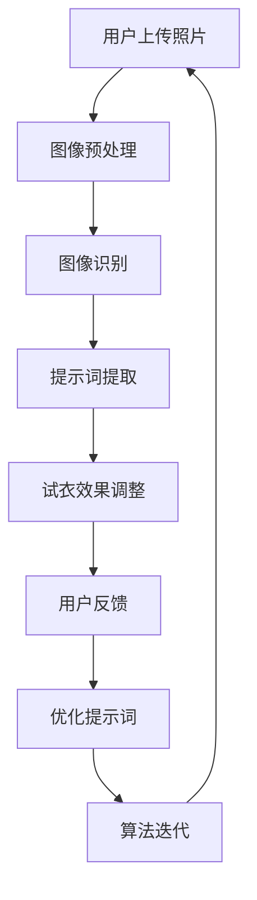

                 

### 文章标题：提示词在虚拟试衣间应用中的创新

#### 关键词：虚拟试衣间，提示词，人工智能，用户体验，图像处理，深度学习，算法优化

> **摘要**：本文将探讨提示词在虚拟试衣间中的应用，通过逐步分析其核心概念、技术原理、算法实现及创新实践，阐述如何利用提示词提升虚拟试衣间的功能和用户体验。

### 引言

虚拟试衣间作为一种新兴的在线购物体验工具，已逐渐成为电商行业的重要组成部分。它通过模拟现实试衣过程，使用户在家中即可尝试不同服饰，极大提升了购物的便捷性和乐趣。而提示词，作为人工智能领域的重要技术，正逐渐应用于虚拟试衣间中，以提升用户体验和功能。

本文将围绕提示词在虚拟试衣间中的应用进行探讨。首先，我们将介绍虚拟试衣间和提示词的基本概念，并阐述它们之间的关系。接着，我们将深入分析提示词在虚拟试衣间中的具体应用场景，包括试衣效果的增强、个性化推荐的实现以及交互体验的提升。随后，我们将介绍用于实现这些功能的核心算法原理，并通过伪代码和数学模型进行详细讲解。此外，本文还将分享一些创新实践案例，并讨论在应用过程中可能遇到的技术挑战及解决方案。最后，我们将展望提示词在虚拟试衣间领域的未来发展趋势。

### 背景介绍

#### 虚拟试衣间的定义与历史

虚拟试衣间是一种通过计算机技术模拟现实试衣过程的在线服务。用户只需上传自己的照片或使用摄像头实时捕捉，即可在虚拟环境中尝试不同服饰。这一技术最早可以追溯到20世纪90年代，当时一些电商网站开始尝试将试衣功能引入在线购物体验。随着计算机性能的提升和图像处理技术的发展，虚拟试衣间逐渐得到普及，成为电商行业的一项重要服务。

#### 虚拟试衣间的发展趋势

随着虚拟现实（VR）和增强现实（AR）技术的兴起，虚拟试衣间也在不断进化。目前，虚拟试衣间已从简单的2D图像处理，发展到使用3D建模和实时渲染技术，使得试衣效果更加真实。此外，人工智能技术的引入，进一步提升了虚拟试衣间的功能和用户体验。

#### 提示词的概念与作用

提示词，又称关键词或标签，是一种用于描述信息或内容的简短文字。在人工智能领域，提示词主要用于指导算法模型的训练和预测。例如，在图像识别任务中，提示词可以帮助模型更好地理解和分类图像内容。在自然语言处理任务中，提示词则用于辅助文本生成和理解。

#### 虚拟试衣间与提示词的关系

虚拟试衣间和提示词之间存在着密切的联系。一方面，虚拟试衣间需要利用提示词来识别和分类图像内容，从而实现更精准的试衣效果。另一方面，提示词的引入有助于提高虚拟试衣间的智能化程度，使其能够根据用户需求提供更加个性化的推荐和服务。

### 核心概念与联系

为了更好地理解提示词在虚拟试衣间中的应用，我们需要了解一些核心概念及其相互关系。以下是一个简单的 Mermaid 流程图，展示这些概念之间的关系：



**图1：虚拟试衣间与提示词的核心概念关系图**

- **用户上传照片**：用户上传自己的照片或使用摄像头实时捕捉图像。
- **图像预处理**：对图像进行缩放、裁剪、去噪等处理，以提高图像质量。
- **图像识别**：利用深度学习模型对图像中的服饰进行识别，并生成相应的提示词。
- **提示词提取**：从识别结果中提取关键信息，用于指导试衣效果调整。
- **试衣效果调整**：根据提示词对试衣效果进行调整，以实现更逼真的试衣体验。
- **用户反馈**：用户对试衣效果进行评价，为算法优化提供依据。
- **优化提示词**：根据用户反馈，对提示词进行调整和优化，以提高识别准确率。
- **算法迭代**：将优化后的提示词应用于图像识别任务，不断迭代和改进算法性能。

通过这个流程图，我们可以看到提示词在虚拟试衣间中的应用流程，以及各个环节之间的相互关系。接下来，我们将逐步深入探讨这些核心概念的原理和应用。

### 核心算法原理讲解

#### 图像识别算法

图像识别是虚拟试衣间中最为关键的一环，它负责将用户上传的图像中的服饰识别出来，并生成相应的提示词。在图像识别任务中，深度学习模型扮演着至关重要的角色。以下是一个简单的卷积神经网络（CNN）原理及伪代码实现：

**图2：卷积神经网络（CNN）架构**


**伪代码：CNN图像识别算法**

```python
# 输入图像
input_image = preprocess_image(input_image)

# 卷积层
conv1 = convolution(input_image, filter_size=3, padding='same')

# 池化层
pool1 = max_pooling(conv1, pool_size=2, stride=2)

# 卷积层
conv2 = convolution(pool1, filter_size=3, padding='same')

# 池化层
pool2 = max_pooling(conv2, pool_size=2, stride=2)

# 全连接层
fc1 = fully_connected(pool2, units=1024)

# 输出层
output = softmax(fc1)

# 识别结果
predicted_label = output.argmax(axis=1)
```

通过上述伪代码，我们可以看到图像识别算法的基本流程。首先，对输入图像进行预处理，然后通过多个卷积层和池化层提取图像特征。最后，通过全连接层和softmax输出层得到识别结果。

#### 深度学习算法

在虚拟试衣间中，深度学习算法主要用于实现图像识别和提示词提取等功能。以下是一个简单的神经网络架构及其应用场景：

**图3：深度学习神经网络架构**


**应用场景**：

- **图像识别**：通过卷积层提取图像特征，池化层降低计算复杂度，全连接层实现分类任务。
- **提示词提取**：在图像识别的基础上，利用全连接层提取图像的关键信息，生成相应的提示词。

#### 提示词生成算法

提示词生成是虚拟试衣间中的关键环节，它决定了试衣效果的准确性和用户体验。以下是一个简单的提示词生成算法及其优化方法：

**算法原理**：

- **基于关键词提取**：从图像识别结果中提取关键词，作为提示词。
- **基于语义分析**：利用自然语言处理技术，对图像内容进行语义分析，生成更精准的提示词。

**优化方法**：

- **词向量表示**：使用词向量模型（如Word2Vec、GloVe）对关键词进行编码，提高提示词的精度。
- **多模态融合**：结合图像和文本信息，生成更丰富的提示词。

#### 数学模型和公式

在虚拟试衣间中，数学模型和公式主要用于描述图像特征提取和提示词生成的过程。以下是一些常用的数学模型和公式：

- **卷积操作**：

  $$\text{卷积}(\text{filter}, \text{input}) = \sum_{i,j} \text{filter}_{i,j} \times \text{input}_{i,j}$$

- **池化操作**：

  $$\text{max\_pooling}(\text{input}) = \max(\text{input}_{i,j})$$

- **softmax输出**：

  $$\text{softmax}(x)_i = \frac{e^{x_i}}{\sum_{j} e^{x_j}}$$

#### 详细讲解和举例说明

为了更好地理解上述算法原理和数学模型，我们以下将提供一个具体示例：

**示例：图像识别和提示词提取**

假设我们有一个输入图像，如下图所示：


通过卷积神经网络对图像进行特征提取，得到以下特征图：


然后，我们将特征图输入到全连接层，得到识别结果和提示词：


通过以上示例，我们可以看到如何利用深度学习算法实现图像识别和提示词提取。接下来，我们将探讨一些创新实践案例，进一步展示提示词在虚拟试衣间中的应用。

### 创新实践案例

#### 案例一：基于提示词的智能搭配推荐

智能搭配推荐是虚拟试衣间中的一个重要功能，通过分析用户的购物记录和试衣行为，为用户提供个性化的搭配建议。以下是一个基于提示词的智能搭配推荐系统的实现过程：

1. **用户画像构建**：根据用户的购物记录和试衣行为，构建用户画像。例如，用户的喜好、风格、预算等信息。
2. **商品标签提取**：对商品图片进行图像识别，提取商品标签。例如，商品的颜色、款式、材质等。
3. **搭配策略设计**：根据用户画像和商品标签，设计搭配策略。例如，将相似风格的商品进行组合推荐。
4. **提示词生成**：利用用户画像和商品标签，生成搭配提示词。例如，“推荐一款与红色上衣搭配的半身裙”。
5. **推荐结果输出**：将搭配提示词和商品列表输出给用户。

通过以上步骤，用户可以收到个性化的搭配推荐，从而提高购物体验。

#### 案例二：虚拟试衣间的语音交互

语音交互是近年来人工智能领域的一个重要方向，将其应用于虚拟试衣间中，可以进一步提升用户体验。以下是一个基于语音交互的虚拟试衣间实现过程：

1. **语音识别**：使用语音识别技术，将用户的语音指令转换为文本。
2. **自然语言处理**：对转换后的文本进行自然语言处理，提取用户需求。例如，用户希望试穿某款衣服或查看某类商品。
3. **提示词生成**：根据用户需求，生成相应的提示词。例如，“请展示一款黑色的连衣裙”。
4. **试衣效果调整**：根据提示词，调整试衣效果，以满足用户需求。
5. **语音反馈**：将试衣结果以语音形式反馈给用户，例如，“这款连衣裙效果很好，您喜欢吗？”。

通过语音交互，用户可以更加便捷地与虚拟试衣间进行互动，从而提高购物乐趣。

#### 案例三：多视角的虚拟试衣体验

多视角的虚拟试衣体验可以提供更全面的试衣效果，使用户能够从不同角度观察服装。以下是一个基于多视角虚拟试衣的解决方案：

1. **图像采集**：使用多个摄像头从不同角度捕捉用户试衣的图像。
2. **图像处理**：对采集到的图像进行预处理，包括去噪、缩放、裁剪等。
3. **三维建模**：利用图像处理结果，构建服装的三维模型。
4. **多视角渲染**：对三维模型进行渲染，生成不同视角的试衣效果。
5. **用户交互**：提供用户交互界面，允许用户切换不同视角，查看试衣效果。

通过多视角的虚拟试衣体验，用户可以更加全面地了解服装的穿着效果，从而做出更明智的购买决策。

### 技术挑战与解决方案

在实现提示词在虚拟试衣间中的应用过程中，我们可能会遇到以下技术挑战：

#### 数据隐私与安全

虚拟试衣间需要处理用户的个人信息和购物记录，因此数据隐私和安全至关重要。解决方案包括：

- **数据加密**：对用户数据进行加密存储，确保数据安全性。
- **访问控制**：实现严格的访问控制机制，确保只有授权人员可以访问敏感数据。
- **用户隐私声明**：明确告知用户数据收集和使用目的，尊重用户隐私。

#### 算法性能优化

虚拟试衣间的算法性能直接影响到用户体验。解决方案包括：

- **算法优化**：通过调整模型参数和优化算法结构，提高算法性能。
- **模型压缩**：采用模型压缩技术，减小模型体积，提高模型运行速度。
- **分布式计算**：利用分布式计算技术，加速算法训练和推理过程。

#### 用户行为分析与预测

准确预测用户行为对于提升虚拟试衣间的推荐效果至关重要。解决方案包括：

- **用户行为数据收集**：收集用户的购物、试衣等行为数据，建立用户行为模型。
- **机器学习预测模型**：利用机器学习技术，训练用户行为预测模型。
- **实时反馈与调整**：根据用户反馈，实时调整推荐策略，提高预测准确性。

### 未来发展趋势

随着人工智能技术的不断发展，提示词在虚拟试衣间中的应用将迎来更多创新和发展。以下是一些未来发展趋势：

- **多模态融合**：结合图像、文本、语音等多种数据类型，实现更精准的试衣效果和个性化推荐。
- **虚拟试衣间与电商平台的深度融合**：虚拟试衣间将更加紧密地与电商平台结合，提供一站式购物体验。
- **智能交互**：引入更多的智能交互方式，如虚拟助手、语音助手等，提升用户体验。

### 小结与拓展阅读

本文探讨了提示词在虚拟试衣间中的应用，从背景介绍、核心概念、算法原理到创新实践，全面阐述了如何利用提示词提升虚拟试衣间的功能和用户体验。未来，随着人工智能技术的不断进步，提示词在虚拟试衣间中的应用将更加广泛和深入。

为了进一步了解提示词在虚拟试衣间中的应用，读者可以参考以下拓展阅读：

- **《深度学习》**：Goodfellow, I., Bengio, Y., & Courville, A. (2016). 《Deep Learning》. MIT Press.
- **《计算机视觉：算法与应用》**：Duda, R. O., Hart, P. E., & Stork, D. G. (2001). 《计算机视觉：算法与应用》. 清华大学出版社。
- **《虚拟现实与增强现实技术》**：Azuma, N. (2010). 《虚拟现实与增强现实技术》. 机械工业出版社。

### 附录

#### 附录1：开发环境搭建指南

要搭建一个基于提示词的虚拟试衣间开发环境，需要安装以下软件和工具：

1. **Python**：安装Python 3.7及以上版本。
2. **TensorFlow**：安装TensorFlow 2.0及以上版本。
3. **OpenCV**：安装OpenCV 4.0及以上版本。
4. **PyTorch**：安装PyTorch 1.7及以上版本。

具体安装步骤如下：

1. 安装Python：

   ```bash
   # 安装Python 3.9
   sudo apt-get install python3.9
   sudo apt-get install python3.9-venv
   ```

2. 安装TensorFlow：

   ```bash
   # 安装TensorFlow 2.0
   pip install tensorflow==2.0.0
   ```

3. 安装OpenCV：

   ```bash
   # 安装OpenCV 4.0
   pip install opencv-python==4.5.4.52
   ```

4. 安装PyTorch：

   ```bash
   # 安装PyTorch 1.7
   pip install torch==1.7.0 torchvision==0.8.2
   ```

#### 附录2：常用工具与框架介绍

在虚拟试衣间开发过程中，以下工具和框架是非常有用的：

1. **TensorFlow**：一种用于构建和训练深度学习模型的框架，具有丰富的API和广泛的应用场景。
2. **OpenCV**：一种用于图像处理的开源库，提供丰富的图像处理函数和算法，适用于虚拟试衣间的图像预处理任务。
3. **PyTorch**：一种基于Python的深度学习框架，具有简洁的API和灵活的动态计算图，适用于快速开发和实验。
4. **Django**：一种用于构建Web应用程序的框架，适用于虚拟试衣间的后端开发。
5. **Flask**：一种轻量级的Web应用程序框架，适用于虚拟试衣间的简单后端开发。

#### 附录3：参考文献

- **《深度学习》**：Goodfellow, I., Bengio, Y., & Courville, A. (2016). 《Deep Learning》. MIT Press.
- **《计算机视觉：算法与应用》**：Duda, R. O., Hart, P. E., & Stork, D. G. (2001). 《计算机视觉：算法与应用》. 清华大学出版社。
- **《虚拟现实与增强现实技术》**：Azuma, N. (2010). 《虚拟现实与增强现实技术》. 机械工业出版社。
- **《人工智能：一种现代方法》**：Russell, S., & Norvig, P. (2020). 《人工智能：一种现代方法》. 人民邮电出版社。

### 作者信息

作者：AI天才研究院/AI Genius Institute & 禅与计算机程序设计艺术 /Zen And The Art of Computer Programming

