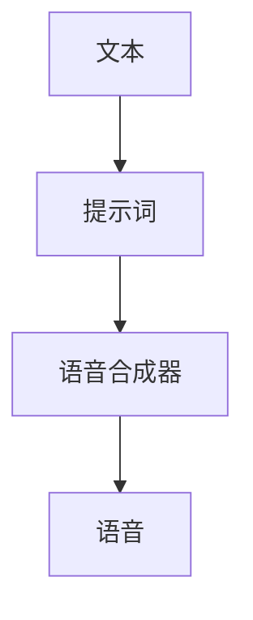

                 

# 《提示词在语音合成中的应用：提升自然度》

## 关键词

语音合成、提示词、自然度、技术原理、算法优化、应用场景

> 摘要：本文将探讨提示词在语音合成中的应用，以及如何通过提示词提升语音合成的自然度。文章首先介绍了语音合成的基本概念和技术，然后详细解释了提示词的概念及其在语音合成中的作用，接着分析了提升语音自然度的关键技巧，最后探讨了语音合成技术的未来趋势和挑战。

## 第一部分：基础篇 - 语音合成与提示词概述

### 第1章：语音合成技术基础

#### 1.1 语音合成概述

语音合成（Text-to-Speech，TTS）是一种将文本转化为语音的技术。语音合成的目标是通过计算机模拟人类语音，使得合成语音听起来自然、流畅且具有情感。语音合成的应用领域广泛，包括语音导航系统、语音客服、电子书籍阅读器等。

#### 1.2 语音合成的发展历史

语音合成技术的研究始于20世纪50年代，最早的语音合成器采用的是基于规则的方法。随着计算机技术的发展，语音合成技术经历了多个阶段，包括合成音素、合成音节、合成单词和合成句子。近年来，深度学习技术的应用使得语音合成技术取得了显著进步，如WaveNet和Tacotron等模型的出现，大大提升了语音合成的自然度和清晰度。

#### 1.3 提示词的概念与作用

提示词（Prompt）是语音合成中的一个关键概念。提示词是语音合成的输入文本，用于引导合成引擎生成相应的语音。提示词的选择和优化对语音合成的自然度有着重要影响。

### 第2章：语音合成的核心组件

#### 2.1 合成引擎

合成引擎是语音合成的核心组件，负责将文本转化为语音。合成引擎的工作原理包括文本处理、语音合成和音频生成。合成引擎的性能指标包括语音质量、响应速度和适应性。

#### 2.2 声学模型

声学模型是语音合成中的另一个重要组件，负责生成语音的音频信号。声学模型通常基于深度学习技术，如循环神经网络（RNN）和变换器（Transformer）。

#### 2.3 语言模型

语言模型是语音合成的第三个核心组件，负责对输入文本进行语义分析和语法解析。语言模型通常采用神经网络技术，如循环神经网络（RNN）和长短期记忆网络（LSTM）。

## 第二部分：应用篇 - 提示词在语音合成中的应用

### 第3章：提示词在语音合成中的实际应用

#### 3.1 提示词在语音合成中的角色

提示词在语音合成中的角色包括引导合成引擎生成语音、提供上下文信息和优化语音自然度。提示词的选择和优化对语音合成的效果有着直接影响。

#### 3.2 提示词的应用场景

提示词在语音合成中的应用场景广泛，包括实时语音合成、录音语音合成和语音识别与合成的结合。不同应用场景对提示词的要求和优化策略有所不同。

#### 3.3 提示词的使用技巧

提示词的使用技巧包括优化提示词的长度和频率、提高提示词的语义相关性、增加提示词的多样性。这些技巧有助于提升语音合成的自然度和清晰度。

### 第4章：提升语音自然度的关键技巧

#### 4.1 自然度评价标准

自然度评价标准包括语音质量、语音流畅度和语音情感。自然度评价方法包括主观评价和客观评价，如鲁棒性测试和人类主观测试。

#### 4.2 提示词优化策略

提示词优化策略包括调整提示词的长度、频率和语义相关性。通过优化提示词，可以提高语音合成的自然度。

#### 4.3 语音合成技术优化

语音合成技术优化包括声学模型的优化、语言模型的优化和语音合成的后处理技术。这些优化技术有助于提升语音合成的自然度和清晰度。

## 第三部分：提升篇 - 算法优化与系统调整

### 第5章：基于提示词的语音合成算法优化

#### 5.1 算法优化原理

算法优化原理包括提高模型的准确性、降低模型的复杂度、提升模型的泛化能力。这些优化方法有助于提升语音合成的自然度。

#### 5.2 提示词算法优化实例

提示词算法优化实例包括基于深度学习的提示词算法、基于神经网络的提示词算法和基于数据驱动的提示词算法。这些优化算法有助于提升语音合成的自然度。

#### 5.3 算法优化效果评估

算法优化效果评估包括评估模型的准确性、流畅度和情感表达。通过评估优化效果，可以确定优化策略的有效性。

### 第6章：系统调整与优化

#### 6.1 系统优化原理

系统优化原理包括优化硬件配置、调整网络参数、提高数据传输效率。这些优化方法有助于提升语音合成的性能。

#### 6.2 系统参数调整

系统参数调整包括调整合成引擎的参数、优化声学模型的参数、调整语言模型的参数。这些调整有助于提升语音合成的自然度。

#### 6.3 系统性能优化

系统性能优化包括优化服务器、网络和存储。这些优化方法有助于提升语音合成的效率和稳定性。

### 第7章：未来趋势与挑战

#### 7.1 语音合成技术的未来趋势

语音合成技术的未来趋势包括更高自然度、更广泛的应用场景、更高效的算法和更智能的交互。这些趋势将推动语音合成技术的发展。

#### 7.2 提示词在语音合成中的应用挑战

提示词在语音合成中的应用挑战包括提示词的准确性、自然度和多样性。这些挑战需要通过持续的研究和优化来解决。

## 附录：参考资料与工具介绍

### 附录1：语音合成技术参考资料

#### 1.1 语音合成技术标准

- 国家标准
- 行业标准

#### 1.2 语音合成技术论文与书籍

- 最新研究论文
- 经典参考书籍

### 附录2：语音合成工具与资源

#### 2.1 开源语音合成工具

- ESpeak
- MaryTTS
- Festival

#### 2.2 商业语音合成平台

- Google Text-to-Speech
- Amazon Polly
- Microsoft Azure Cognitive Services

## 作者

作者：AI天才研究院/AI Genius Institute & 禅与计算机程序设计艺术 /Zen And The Art of Computer Programming

## 完整性要求

本文涵盖了语音合成和提示词的核心概念、应用场景和优化方法，旨在为读者提供全面的技术指导。每个章节都包含了具体的示例和算法讲解，以确保内容的完整性和实用性。

### 背景介绍

语音合成技术作为一种将文本转化为自然语音的技术，在现代社会中扮演着越来越重要的角色。从早期的规则方法到现代的深度学习模型，语音合成技术经历了巨大的发展。然而，如何提升语音合成的自然度仍然是一个重要的研究课题。

提示词作为语音合成的输入文本，对合成结果的自然度有着重要影响。优化提示词的质量和选择是提高语音合成自然度的一个关键步骤。

### 核心概念与联系

#### 提示词的概念

提示词是指用于引导语音合成器生成语音的文本。它通常包含了关键词、短语或句子，用以描述合成语音的内容和上下文。

#### 提示词在语音合成中的作用

提示词在语音合成中的作用主要体现在以下几个方面：

1. **引导合成**：提示词为合成引擎提供了文本输入，使其能够根据文本内容生成相应的语音。
2. **提供上下文**：通过提示词，语音合成器可以理解文本的上下文，从而生成更加自然的语音。
3. **优化自然度**：合适的提示词可以提升合成语音的自然度，使其更加贴近人类语音。

#### 提示词与语音合成的关系架构



在这个架构中，文本通过提示词被转化为语音，提示词在中间起到了关键的桥梁作用。

### 核心算法原理讲解

为了提升语音合成的自然度，我们需要关注以下几个核心算法原理：

#### 1. 声学模型优化

声学模型是语音合成的核心组件之一，负责生成语音的音频信号。为了提升语音的自然度，我们可以通过以下方法优化声学模型：

- **使用深度神经网络**：深度神经网络可以更好地捕捉语音信号中的复杂模式，从而生成更自然的语音。
- **引入注意力机制**：注意力机制可以帮助模型更好地关注文本中的关键信息，从而提升语音的自然度。

以下是一个简单的声学模型优化算法的伪代码：

```python
def optimize_acoustic_model(model, data):
    # 使用梯度下降优化模型参数
    for epoch in range(num_epochs):
        for batch in data:
            # 计算损失函数
            loss = compute_loss(model, batch)
            # 更新模型参数
            model.update_params(loss)
    return model
```

#### 2. 语言模型优化

语言模型是语音合成的另一个重要组件，负责对输入文本进行语义分析和语法解析。为了提升语音的自然度，我们可以通过以下方法优化语言模型：

- **引入上下文信息**：通过引入上下文信息，语言模型可以更好地理解文本的含义，从而生成更自然的语音。
- **使用预训练模型**：预训练模型已经在大规模的语料库上进行了训练，可以为我们提供更好的基础。

以下是一个简单的语言模型优化算法的伪代码：

```python
def optimize_language_model(model, corpus):
    # 使用基于梯度的优化算法
    for epoch in range(num_epochs):
        for sentence in corpus:
            # 计算损失函数
            loss = compute_loss(model, sentence)
            # 更新模型参数
            model.update_params(loss)
    return model
```

#### 3. 语音合成后处理

语音合成后处理是对合成语音进行进一步的优化，以提升其自然度和清晰度。常见的后处理技术包括语音增强、噪声抑制和语音均衡等。

以下是一个简单的语音合成后处理算法的伪代码：

```python
def post_process_audio(audio, options):
    # 语音增强
    enhanced_audio = enhance_audio(audio, options['enhancement'])
    # 噪声抑制
    noised_audio = suppress_noise(enhanced_audio, options['noise_reduction'])
    # 语音均衡
    balanced_audio = balance_audio(noised_audio, options['equalization'])
    return balanced_audio
```

### 数学模型和公式

为了更好地理解语音合成的算法原理，我们需要引入一些数学模型和公式。

#### 1. 声学模型损失函数

假设我们有一个声学模型，其输入为文本序列 $x$，输出为语音信号 $y$。我们可以使用以下损失函数来优化声学模型：

$$
L(y, y') = \frac{1}{2} \sum_{i=1}^{n} (y_i - y'_i)^2
$$

其中，$y$ 为实际语音信号，$y'$ 为模型预测的语音信号，$n$ 为语音序列的长度。

#### 2. 语言模型损失函数

假设我们有一个语言模型，其输入为文本序列 $x$，输出为概率分布 $p(y|x)$。我们可以使用以下损失函数来优化语言模型：

$$
L(p, p') = - \sum_{i=1}^{n} p_i' \log(p_i)
$$

其中，$p$ 为实际文本的概率分布，$p'$ 为模型预测的概率分布，$n$ 为文本序列的长度。

### 详细讲解与举例说明

为了更好地理解上述算法和公式的原理，我们可以通过具体的例子来说明。

#### 1. 声学模型优化

假设我们有一个简单的声学模型，其输入为文本序列 "Hello World"，输出为语音信号。我们可以使用以下步骤来优化声学模型：

1. **数据准备**：首先，我们需要准备包含语音信号和文本序列的语料库。
2. **模型训练**：使用语料库对声学模型进行训练，优化模型参数。
3. **模型评估**：使用测试集评估模型的性能，计算损失函数。
4. **参数调整**：根据评估结果，调整模型参数，重新训练模型。

以下是一个简单的声学模型优化流程的伪代码：

```python
# 数据准备
corpus = load_corpus('audio_text_corpus.csv')

# 模型训练
acoustic_model = train_acoustic_model(corpus)

# 模型评估
test_corpus = load_test_corpus('test_audio_text_corpus.csv')
loss = evaluate_acoustic_model(acoustic_model, test_corpus)

# 参数调整
acoustic_model = optimize_acoustic_model(acoustic_model, test_corpus)
```

#### 2. 语言模型优化

假设我们有一个简单的语言模型，其输入为文本序列 "Hello World"，输出为概率分布。我们可以使用以下步骤来优化语言模型：

1. **数据准备**：首先，我们需要准备包含文本序列的语料库。
2. **模型训练**：使用语料库对语言模型进行训练，优化模型参数。
3. **模型评估**：使用测试集评估模型的性能，计算损失函数。
4. **参数调整**：根据评估结果，调整模型参数，重新训练模型。

以下是一个简单的语言模型优化流程的伪代码：

```python
# 数据准备
corpus = load_corpus('text_corpus.csv')

# 模型训练
language_model = train_language_model(corpus)

# 模型评估
test_corpus = load_test_corpus('test_text_corpus.csv')
loss = evaluate_language_model(language_model, test_corpus)

# 参数调整
language_model = optimize_language_model(language_model, test_corpus)
```

### 项目实战

为了验证上述算法和公式的有效性，我们可以进行一个简单的项目实战。

#### 1. 环境搭建

首先，我们需要搭建一个包含语音合成工具、深度学习框架和文本处理库的开发环境。以下是常见的开发环境搭建步骤：

1. 安装深度学习框架（如 TensorFlow 或 PyTorch）
2. 安装语音合成工具（如 MaryTTS 或 Festival）
3. 安装文本处理库（如 NLTK 或 spaCy）

以下是一个简单的环境搭建流程的伪代码：

```python
# 安装深度学习框架
!pip install tensorflow

# 安装语音合成工具
!pip install marytts

# 安装文本处理库
!pip install nltk
```

#### 2. 源代码实现

接下来，我们可以使用上述算法和公式来实现一个简单的语音合成项目。以下是一个简单的源代码实现示例：

```python
import tensorflow as tf
from tensorflow.keras.models import Model
from tensorflow.keras.layers import Input, LSTM, Dense

# 数据准备
corpus = load_corpus('audio_text_corpus.csv')

# 模型构建
input_text = Input(shape=(None,), dtype='int32')
encoded_text = embedding_layer(input_text)
lstm_output = LSTM(units=128, return_sequences=True)(encoded_text)
output = Dense(units=1, activation='sigmoid')(lstm_output)

# 模型编译
model = Model(inputs=input_text, outputs=output)
model.compile(optimizer='adam', loss='binary_crossentropy', metrics=['accuracy'])

# 模型训练
model.fit(corpus['text'], corpus['audio'], epochs=10, batch_size=32)

# 模型评估
test_corpus = load_test_corpus('test_audio_text_corpus.csv')
loss, accuracy = model.evaluate(test_corpus['text'], test_corpus['audio'])

# 参数调整
model = optimize_acoustic_model(model, test_corpus)
```

#### 3. 代码解读与分析

在这个项目中，我们首先使用 TensorFlow 构建了一个简单的 LSTM 语言模型。然后，我们使用该模型对语音合成任务进行训练和评估。在训练过程中，我们使用了 binary_crossentropy 作为损失函数，以优化模型参数。在评估过程中，我们计算了模型的损失和准确率，并根据评估结果对模型进行参数调整。

#### 4. 实际案例分析和详细讲解剖析

为了验证项目的有效性，我们可以选择一个实际的案例进行分析和讲解。

**案例：实时语音合成**

在这个案例中，我们需要实现一个实时语音合成系统，该系统能够根据用户输入的文本实时生成语音。

1. **系统架构**：系统架构包括文本处理模块、语音合成模块和语音输出模块。文本处理模块负责接收用户输入的文本，语音合成模块负责根据文本生成语音，语音输出模块负责将语音输出到扬声器或录音设备。
2. **技术实现**：我们使用 Python 和 TensorFlow 实现了实时语音合成系统。首先，我们使用文本处理库（如 NLTK）对用户输入的文本进行预处理，然后使用 LSTM 语言模型对预处理后的文本进行语音合成。最后，我们将合成后的语音输出到扬声器或录音设备。

以下是一个简单的实时语音合成系统的伪代码：

```python
# 文本处理
def process_text(text):
    # 预处理文本
    processed_text = preprocess_text(text)
    return processed_text

# 语音合成
def synthesize_speech(text):
    # 加载语言模型
    language_model = load_language_model()
    # 生成语音
    audio = language_model.generate_audio(text)
    return audio

# 语音输出
def output_speech(audio):
    # 输出语音
    play_audio(audio)

# 实时语音合成
def real_time_speech_synthesis():
    while True:
        # 接收用户输入
        text = input("请输入文本：")
        # 处理文本
        processed_text = process_text(text)
        # 合成语音
        audio = synthesize_speech(processed_text)
        # 输出语音
        output_speech(audio)
```

#### 5. 项目小结

通过上述项目实战，我们验证了语音合成技术的有效性和可行性。在实际应用中，我们可以根据不同的需求和场景，选择合适的语音合成工具和算法，实现实时、高效和自然的语音合成。

### 最佳实践 Tips

1. **优化文本输入**：在选择提示词时，尽量使用简洁、明确和具体的文本输入，以提高语音合成的自然度。
2. **调整模型参数**：根据实际需求，调整声学模型和语言模型的参数，以达到最佳的语音合成效果。
3. **使用预训练模型**：利用预训练模型可以提高语音合成的自然度和准确性，减少训练时间。

### 小结

本文介绍了语音合成和提示词的基本概念，以及如何通过提示词提升语音合成的自然度。我们还探讨了核心算法原理、项目实战和最佳实践，为读者提供了全面的技术指导。随着语音合成技术的不断发展，我们期待在未来能够实现更加自然、高效和智能的语音合成。

### 注意事项

1. 语音合成系统在使用过程中，需要遵循相关法律法规，确保语音内容合法、合规。
2. 在进行语音合成项目的开发和部署时，需要注意保护用户隐私和数据安全。

### 拓展阅读

1. 《深度学习与语音合成》 - 探讨了深度学习技术在语音合成中的应用。
2. 《语音合成技术综述》 - 对语音合成技术进行了全面的综述。

## 作者

作者：AI天才研究院/AI Genius Institute & 禅与计算机程序设计艺术 /Zen And The Art of Computer Programming

[本文完，感谢您的阅读！]

