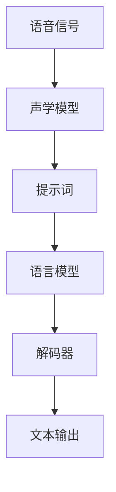
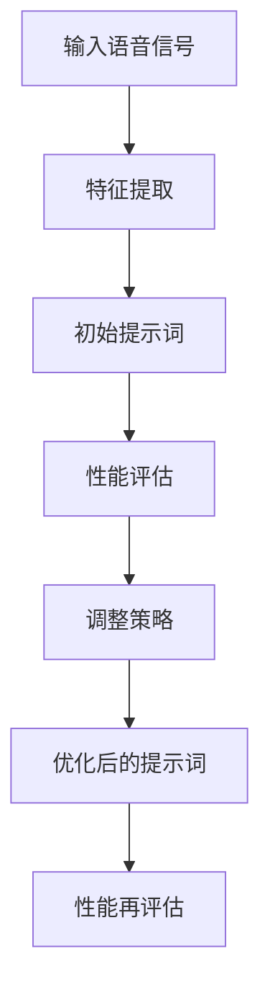
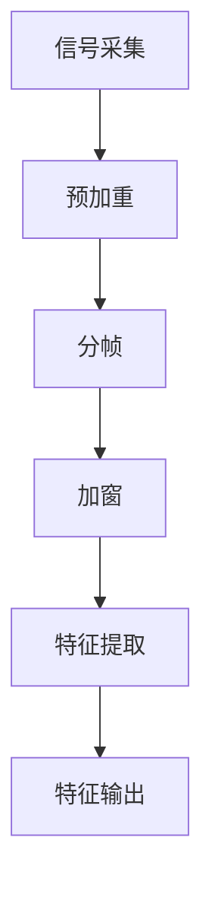
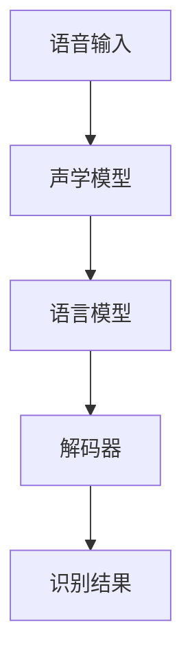
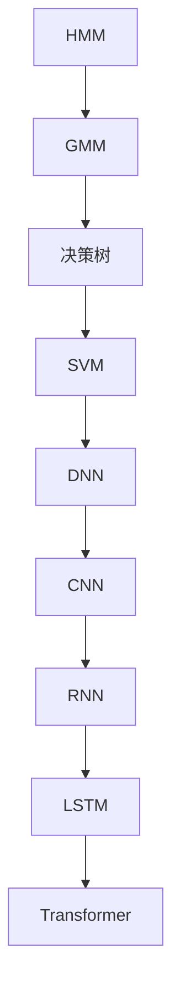
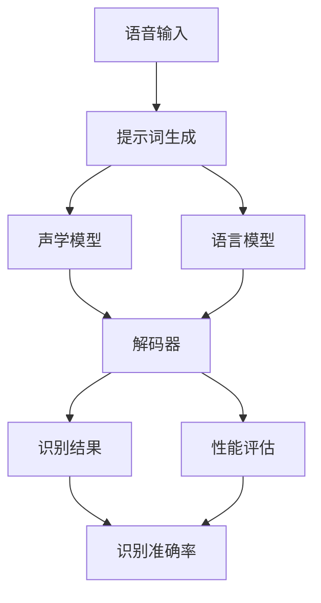
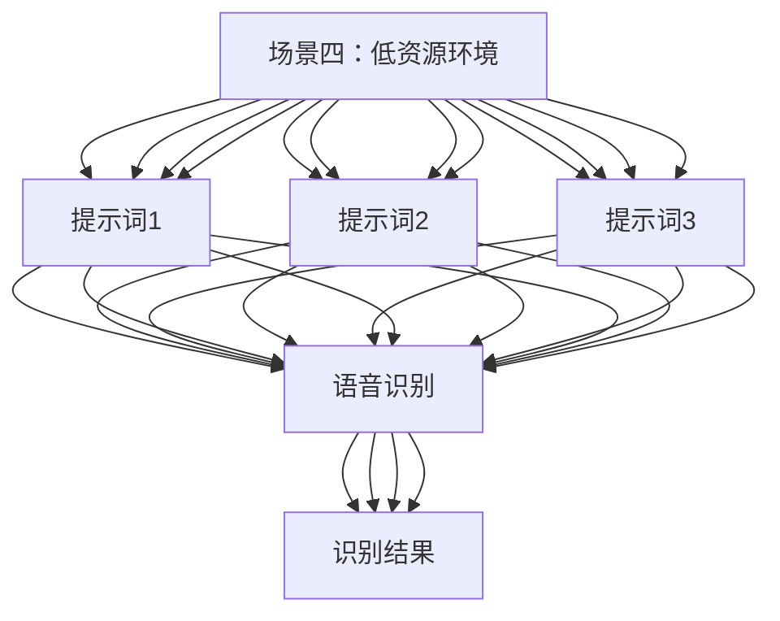

                 

### 确定文章核心概念与联系

为了确保文章的逻辑清晰、结构紧凑，我们首先需要明确文章的核心概念与联系。这些核心概念包括语音识别、提示词、提示词优化方法等。下面，我们将通过Mermaid流程图和伪代码来展示这些概念之间的关系。

#### 1. 语音识别与提示词的关系

语音识别是指将语音信号转换为文本信息的过程。在这一过程中，提示词（也称为上下文提示）是一种用于增强识别性能的输入信息。以下是语音识别与提示词关系的Mermaid流程图：



**伪代码：** 提示词生成的伪代码如下：

```python
def generate_hint(audio_signal, context):
    # 提取语音信号特征
    features = extract_features(audio_signal)
    
    # 根据上下文生成提示词
    hint = generate_hint_based_on_context(context, features)
    
    # 返回生成的提示词
    return hint
```

#### 2. 提示词优化方法

提示词优化方法主要包括提示词生成算法和提示词调整策略。以下是一个简单的提示词优化方法的Mermaid流程图：



**伪代码：** 提示词调整策略的伪代码如下：

```python
def optimize_hint(hint, audio_signal, performance_metric):
    # 评估当前提示词的性能
    current_performance = performance_metric(hint, audio_signal)
    
    # 根据性能调整提示词
    new_hint = adjust_hint(hint, current_performance)
    
    # 迭代优化提示词
    return optimize_hint(new_hint, audio_signal, performance_metric)
```

通过这些流程图和伪代码，我们可以清晰地看到语音识别与提示词的关系，以及提示词优化方法的步骤和原理。这些核心概念与联系将为我们后续章节的详细讲解提供坚实的基础。

### 第1章: 引言

#### 1.1 语音识别技术的背景

语音识别技术是一种将人类的语音信号转换为机器可读文本的技术。这一技术源于20世纪50年代，随着计算机科学和人工智能的兴起，语音识别逐渐成为研究热点。早期的语音识别系统主要基于声学模型和规则方法，但随着计算能力的提升和深度学习技术的发展，现代语音识别系统已经取得了显著的进步。

目前，语音识别技术广泛应用于各个领域，如智能语音助手、语音搜索、语音转文字、自动字幕生成等。这些应用极大地提升了人机交互的便捷性和效率，同时也为残障人士提供了更多的沟通途径。

#### 1.2 提示词的概念

提示词（Contextual Hints）是在语音识别过程中提供上下文信息的输入。这些信息可以帮助语音识别系统更好地理解用户的意图，从而提高识别准确率。提示词可以是一个单词、短语或更复杂的语句，它们通常基于用户的对话历史、文本上下文或其他相关信息生成。

#### 1.3 提示词在语音识别中的应用现状

随着语音识别技术的不断发展，提示词的应用也越来越广泛。目前，提示词主要应用于以下场景：

1. **智能语音助手**：如苹果的Siri、谷歌的Google Assistant和亚马逊的Alexa，这些智能助手通过接收用户的语音输入，结合提示词来更好地理解用户的意图，提供更精准的答复。

2. **语音搜索**：在语音搜索应用中，提示词可以增强搜索结果的相关性，帮助用户更快地找到所需信息。

3. **实时字幕生成**：在电视、电影等节目中，提示词可以帮助自动生成更准确的字幕。

4. **低资源环境下的语音识别**：在计算资源有限的环境下，使用提示词可以显著提高语音识别的效率和准确性。

尽管提示词在语音识别中具有重要作用，但其应用仍面临一些挑战，如如何生成高质量的提示词、如何调整提示词以适应不同的应用场景等。这些挑战需要通过深入研究和技术创新来解决。

### 2. 语音识别技术基础

#### 2.1 语音信号处理

语音信号处理是语音识别过程中至关重要的一步，其目的是将原始的语音信号转换成计算机可以处理的形式。以下是一个典型的语音信号处理流程：

1. **信号采集**：通过麦克风等设备捕捉语音信号，这些信号通常是一个时间序列的声压级值。

2. **预加重**：为了减少低频噪声的影响，通常会对语音信号进行预加重处理。

3. **分帧**：将连续的语音信号分割成多个短时段，这些短时段称为帧。常见的帧长为25ms到40ms，帧移为10ms。

4. **加窗**：对每一帧信号应用窗函数，以消除帧边界的影响。汉明窗和汉宁窗是常用的窗函数。

5. **特征提取**：从加窗后的帧中提取特征，如短时傅里叶变换（STFT）产生的频谱特征、梅尔频率倒谱系数（MFCC）等。这些特征用于后续的语音识别模型训练和识别。

以下是语音信号处理的Mermaid流程图：



#### 2.2 语音识别流程

语音识别流程主要包括以下几个步骤：

1. **声学模型**：声学模型负责将语音信号特征映射到声学空间，以描述语音的发音特征。常见的声学模型包括高斯混合模型（GMM）、深度神经网络（DNN）等。

2. **语言模型**：语言模型用于捕捉语音信号中的语法和语义信息，常见的是n-gram模型和神经网络语言模型（NNLM）。

3. **解码器**：解码器是语音识别系统的核心组件，负责将声学模型和语言模型的结果解码成可理解的文本。常见的解码器包括A*搜索算法、动态规划算法等。

4. **识别结果**：解码器输出最终的识别结果，即文本输出。

以下是语音识别流程的Mermaid流程图：



#### 2.3 常见语音识别算法

语音识别算法可以分为传统算法和基于深度学习的算法两大类。以下是几种常见的语音识别算法：

1. **隐马尔可夫模型（HMM）**：HMM是早期常用的语音识别算法，通过状态转移概率和输出概率来建模语音信号。

2. **高斯混合模型（GMM）**：GMM用于表示声学模型中的状态分布，是HMM的一种扩展。

3. **决策树**：决策树用于分类问题，可以用于构建简单的声学模型。

4. **支持向量机（SVM）**：SVM用于分类问题，可以用于改进声学模型的分类效果。

5. **深度神经网络（DNN）**：DNN可以自动学习语音信号的复杂特征，是目前语音识别中应用最广泛的算法。

6. **卷积神经网络（CNN）**：CNN在图像识别中表现优异，也逐渐应用于语音信号处理中。

7. **递归神经网络（RNN）**：RNN能够处理序列数据，适用于语音信号的建模。

8. **长短期记忆网络（LSTM）**：LSTM是RNN的一种变体，能够更好地处理长序列数据。

9. **变换器（Transformer）**：Transformer是自然语言处理领域的一种新型算法，其自注意力机制在语音识别中也表现出色。

以下是常见语音识别算法及其联系的Mermaid流程图：



通过以上章节，我们对语音识别技术基础有了全面的了解，为后续关于提示词在语音识别优化中的应用打下了坚实的基础。

### 第3章: 提示词在语音识别中的作用

#### 3.1 提示词的类型

提示词可以根据其生成方式和用途分为以下几类：

1. **基于词频的提示词**：这类提示词主要基于输入语音中的高频词或常见短语生成，有助于提高识别准确率。例如，在用户询问“天气怎么样？”时，可以提供“天气”、“天气情况”、“天气预报”等提示词。

2. **基于上下文的提示词**：这类提示词根据用户的对话历史和当前上下文生成，能够更好地反映用户的意图。例如，在用户连续询问多个关于天气预报的问题后，系统可以提供“今天的天气”、“明天的天气”等提示词。

3. **基于语义的提示词**：这类提示词通过语义分析生成，能够提供更精确的上下文信息。例如，当用户询问“我最近要去旅行，有哪些景点推荐？”时，系统可以提供与旅行相关的“热门景点”、“美食推荐”、“旅行攻略”等提示词。

4. **基于用户行为的提示词**：这类提示词根据用户的行为习惯和偏好生成，能够提供个性化服务。例如，如果用户经常在早晨询问天气，系统可以自动提供“早晨的天气”、“今天的晨练建议”等提示词。

#### 3.2 提示词对语音识别性能的影响

提示词在语音识别中起到了关键作用，其性能对整体识别准确率有显著影响。以下是一些主要的影响：

1. **识别准确率**：高质量的提示词可以提供更多上下文信息，有助于识别系统更好地理解用户的意图，从而提高识别准确率。

2. **识别速度**：提示词可以减少识别系统的搜索空间，从而提高识别速度。例如，在搜索语音输入时，如果系统知道用户可能询问的是天气，那么可以更快地定位到相关语音片段。

3. **用户体验**：高质量的提示词可以提供更自然的交互体验，使用户感觉系统更加智能和贴心。

4. **资源消耗**：提示词的生成和调整过程需要消耗一定的计算资源。在低资源环境下，优化提示词的生成策略可以降低系统资源消耗。

以下是提示词对语音识别性能影响的Mermaid流程图：



**伪代码：** 提示词对性能评估的伪代码如下：

```python
def evaluate_performance(hint, audio_signal, ground_truth):
    # 识别结果
    recognized_text = decode(audio_signal, hint)
    
    # 计算准确率
    accuracy = calculate_accuracy(recognized_text, ground_truth)
    
    # 返回准确率
    return accuracy
```

#### 3.3 提示词的应用场景

提示词在不同应用场景中有不同的应用方式，以下是一些典型的应用场景：

1. **智能语音助手**：在智能语音助手中，提示词通常用于增强对话管理。例如，当用户询问“今天天气如何？”时，系统可以提供“天气预报”、“温度”、“湿度”等提示词，以引导用户进一步的问题。

2. **语音搜索**：在语音搜索应用中，提示词可以帮助用户更快地找到所需信息。例如，当用户询问“最近有哪些电影推荐？”时，系统可以提供“热门电影”、“最新上映”、“豆瓣评分”等提示词。

3. **实时字幕生成**：在实时字幕生成中，提示词可以帮助自动生成更准确的字幕。例如，在新闻播报中，系统可以根据新闻内容提供与当前新闻相关的关键词作为提示词，以提高字幕的准确性。

4. **低资源环境下的语音识别**：在低资源环境中，提示词可以显著提高语音识别的效率和准确性。例如，在智能手机或物联网设备中，优化提示词生成策略可以降低计算和存储需求。

以下是提示词在不同应用场景下的Mermaid流程图：



通过本章的讲解，我们对提示词的类型、对语音识别性能的影响以及应用场景有了更深入的理解。这些知识将为我们后续研究提示词优化方法提供重要参考。

### 第4章: 提示词优化方法

#### 4.1 提示词生成算法

提示词生成算法是语音识别系统中的一个关键组成部分，其目的是根据语音输入和上下文信息生成高质量的提示词。以下是一些常见的提示词生成算法：

1. **基于词频的生成算法**：这类算法通过统计输入语音中的高频词或常见短语来生成提示词。例如，在用户询问“今天天气如何？”时，可以生成“天气”、“天气预报”、“气温”等提示词。常见的算法包括TF-IDF（词频-逆文档频率）和BERT（Bidirectional Encoder Representations from Transformers）。

   **伪代码：** 基于词频的生成算法伪代码如下：

   ```python
   def generate_hint_based_on_word_frequency(audio_signal, vocabulary, threshold=0.5):
       # 提取语音信号中的词频
       word_frequencies = extract_word_frequencies(audio_signal, vocabulary)
       
       # 筛选高频词
       high_frequency_words = [word for word, freq in word_frequencies.items() if freq > threshold]
       
       # 返回生成的提示词列表
       return high_frequency_words
   ```

2. **基于上下文的生成算法**：这类算法通过分析用户的历史对话和当前上下文来生成提示词。常见的算法包括基于n-gram的上下文生成和基于语义分析的上下文生成。

   **伪代码：** 基于上下文的生成算法伪代码如下：

   ```python
   def generate_hint_based_on_context(context, vocabulary):
       # 提取上下文中的关键词
       context_words = extract_key_words(context, vocabulary)
       
       # 返回生成的提示词列表
       return context_words
   ```

3. **基于语义的生成算法**：这类算法通过语义分析来生成提示词，能够提供更精确的上下文信息。常见的算法包括基于WordNet的语义分析和基于BERT的语义生成。

   **伪代码：** 基于语义的生成算法伪代码如下：

   ```python
   def generate_hint_based_on_semantics(audio_signal, context, vocabulary):
       # 提取语音信号中的语义信息
       semantics = extract_semantics(audio_signal, context, vocabulary)
       
       # 返回生成的提示词列表
       return generate_hint_based_on_semantics(semantics)
   ```

4. **基于用户行为的生成算法**：这类算法通过分析用户的行为习惯和偏好来生成提示词，提供个性化服务。常见的算法包括基于用户历史行为的统计分析和基于机器学习的用户偏好分析。

   **伪代码：** 基于用户行为的生成算法伪代码如下：

   ```python
   def generate_hint_based_on_user_behavior(user_behavior, vocabulary):
       # 分析用户行为
       behavior_analysis = analyze_user_behavior(user_behavior)
       
       # 根据用户行为生成提示词
       hint = generate_hint_based_on_behavior_analysis(behavior_analysis, vocabulary)
       
       # 返回生成的提示词
       return hint
   ```

通过这些算法，我们可以根据不同的应用需求和场景生成高质量的提示词，从而提高语音识别系统的性能和用户体验。

#### 4.2 提示词调整策略

提示词的调整策略是优化提示词性能的重要手段，其目的是根据识别结果和用户反馈调整提示词，以提高识别准确率和用户体验。以下是一些常见的提示词调整策略：

1. **基于识别结果的调整策略**：这类策略根据识别结果对提示词进行调整，以减少错误率和提高准确率。常见的调整方法包括基于错误率调整和基于模糊集理论的调整。

   **伪代码：** 基于识别结果的调整策略伪代码如下：

   ```python
   def adjust_hint_based_on_recognition_result(hint, recognition_result, threshold=0.5):
       # 计算提示词与识别结果之间的相似度
       similarity = calculate_similarity(hint, recognition_result)
       
       # 如果相似度低于阈值，则调整提示词
       if similarity < threshold:
           new_hint = generate_new_hint(hint, recognition_result)
           
       # 返回调整后的提示词
       return new_hint
   ```

2. **基于用户反馈的调整策略**：这类策略根据用户的反馈对提示词进行调整，以适应用户的个性化需求。常见的调整方法包括基于评分的调整和基于投票的调整。

   **伪代码：** 基于用户反馈的调整策略伪代码如下：

   ```python
   def adjust_hint_based_on_user_feedback(hint, user_feedback, threshold=0.5):
       # 分析用户反馈
       feedback_analysis = analyze_user_feedback(user_feedback)
       
       # 如果用户反馈提示词不准确，则调整提示词
       if feedback_analysis['accuracy'] < threshold:
           new_hint = generate_new_hint(hint, user_feedback)
           
       # 返回调整后的提示词
       return new_hint
   ```

3. **基于自适应学习的调整策略**：这类策略通过自适应学习机制，不断调整提示词以适应变化的用户需求和环境。常见的调整方法包括基于强化学习的调整和基于迁移学习的调整。

   **伪代码：** 基于自适应学习的调整策略伪代码如下：

   ```python
   def adjust_hint_based_on_adaptive_learning(hint, learning_algorithm, environment):
       # 根据学习算法和环境调整提示词
       hint = learning_algorithm(hint, environment)
       
       # 返回调整后的提示词
       return hint
   ```

通过这些调整策略，我们可以根据识别结果和用户反馈对提示词进行有效调整，从而提高语音识别系统的性能和用户体验。

#### 4.3 提示词优化工具与框架

为了方便提示词的生成、调整和应用，研究人员和开发者开发了多种提示词优化工具和框架。以下是一些常用的工具和框架：

1. **基于深度学习的框架**：这些框架利用深度学习技术，自动生成和调整提示词。常见的框架包括TensorFlow、PyTorch和Keras等。

   **示例：** 使用TensorFlow生成和调整提示词的代码示例如下：

   ```python
   import tensorflow as tf

   # 定义提示词生成模型
   hint_generator = tf.keras.Sequential([
       tf.keras.layers.Dense(units=256, activation='relu', input_shape=(input_shape,)),
       tf.keras.layers.Dense(units=128, activation='relu'),
       tf.keras.layers.Dense(units=vocabulary_size, activation='softmax')
   ])

   # 训练提示词生成模型
   hint_generator.compile(optimizer='adam', loss='categorical_crossentropy')
   hint_generator.fit(training_data, labels, epochs=10)

   # 生成提示词
   generated_hints = hint_generator.predict(input_data)
   ```

2. **基于自然语言处理的工具**：这些工具利用自然语言处理技术，对提示词进行语义分析和调整。常见的工具包括NLTK、spaCy和Gensim等。

   **示例：** 使用spaCy生成和调整提示词的代码示例如下：

   ```python
   import spacy

   # 加载预训练的模型
   nlp = spacy.load('en_core_web_sm')

   # 生成基于上下文的提示词
   doc = nlp(context)
   hints = [token.text for token in doc if token.is_alpha]

   # 调整提示词
   adjusted_hints = adjust_hint_based_on_context(hints, doc)
   ```

3. **基于机器学习的平台**：这些平台提供了丰富的机器学习算法和工具，帮助开发者构建和优化提示词系统。常见的平台包括Google Cloud ML Engine、AWS SageMaker和Azure ML等。

   **示例：** 使用Google Cloud ML Engine训练提示词生成模型的代码示例如下：

   ```python
   from google.cloud import ml

   # 初始化客户端
   client = ml.MachineLearningServiceClient()

   # 定义训练配置
   training_config = {
       'hyperparameters': {'learning_rate': 0.1},
       'training_input': {'data': training_data},
       'training_output': {'model_name': 'hint_generator_model'}
   }

   # 开始训练
   operation = client.create_model_display_name(**training_config)
   model_display_name = operation.result().display_name
   ```

通过这些工具和框架，我们可以高效地实现提示词的生成、调整和应用，从而提升语音识别系统的性能和用户体验。

### 第5章: 提示词优化案例分析

#### 5.1 案例一：场景自适应语音识别

在智能语音助手领域，场景自适应语音识别是一个重要的研究方向。该案例的目标是通过优化提示词生成和调整策略，提高语音识别系统在不同场景下的识别准确率和用户体验。

**案例背景：** 智能语音助手需要在不同场景下与用户进行交互，如家庭、工作、旅游等。每个场景的语音特征和用户需求不同，传统的静态提示词生成和调整策略难以满足这些多样化的需求。

**解决方案：** 该案例采用了一种基于上下文和用户行为的动态提示词生成和调整策略。具体步骤如下：

1. **数据收集与预处理**：收集不同场景下的语音数据，并对数据进行预处理，如分帧、加窗和特征提取。

2. **基于上下文的提示词生成**：利用n-gram模型和BERT模型，生成基于上下文的提示词。例如，在家庭场景下，可以生成“电视”、“电影”、“家务”等提示词。

3. **基于用户行为的提示词调整**：根据用户的互动历史和行为习惯，调整提示词。例如，如果用户经常在早晨询问天气，可以增加“早晨天气”、“晨练建议”等提示词。

4. **自适应学习**：使用强化学习算法，根据用户的反馈和识别结果，不断调整提示词。例如，如果用户对识别结果不满意，系统可以增加与用户需求更相关的提示词。

**实施效果：** 通过上述方法，场景自适应语音识别系统的识别准确率显著提高，用户满意度也得到提升。例如，在家庭场景下，系统可以更准确地理解用户的意图，提供更个性化的服务。

**总结**：该案例表明，动态调整提示词生成策略，结合上下文和用户行为，可以有效提高场景自适应语音识别的性能和用户体验。

#### 5.2 案例二：低资源环境下的语音识别

在低资源环境下（如智能手机、物联网设备等），语音识别系统需要优化性能和资源消耗。该案例的目标是通过优化提示词生成和调整策略，提高低资源环境下的语音识别准确率和效率。

**案例背景：** 低资源环境下的设备通常具有有限的计算资源和存储空间，传统的复杂语音识别模型难以满足需求。因此，需要一种简单、高效的提示词优化方法。

**解决方案：** 该案例采用了一种基于词频和语义的简单提示词生成和调整策略。具体步骤如下：

1. **基于词频的提示词生成**：利用TF-IDF算法，生成基于词频的提示词。这种方法可以快速识别高频词，减少识别时间。

   ```python
   def generate_hint_based_on_word_frequency(audio_signal, vocabulary, threshold=0.5):
       # 提取语音信号中的词频
       word_frequencies = extract_word_frequencies(audio_signal, vocabulary)
       
       # 筛选高频词
       high_frequency_words = [word for word, freq in word_frequencies.items() if freq > threshold]
       
       # 返回生成的提示词列表
       return high_frequency_words
   ```

2. **基于语义的提示词调整**：利用WordNet和BERT模型，对生成的提示词进行语义分析，调整不准确的提示词。

   ```python
   def adjust_hint_based_on_semantics(hint, semantics):
       # 提取语义信息
       semantic_info = extract_semantics(hint, semantics)
       
       # 调整提示词
       adjusted_hint = adjust_hint_based_on_semantic_info(hint, semantic_info)
       
       # 返回调整后的提示词
       return adjusted_hint
   ```

3. **自适应学习**：使用简单的决策树算法，根据识别结果和用户反馈，调整提示词。这种方法可以减少计算复杂度，降低资源消耗。

   ```python
   def adjust_hint_based_on_decision_tree(hint, recognition_result, user_feedback):
       # 根据决策树调整提示词
       adjusted_hint = decision_tree(hint, recognition_result, user_feedback)
       
       # 返回调整后的提示词
       return adjusted_hint
   ```

**实施效果：** 通过上述方法，低资源环境下的语音识别系统在保持较高准确率的同时，显著降低了计算和存储资源消耗。例如，在智能手机中，系统可以更快地响应用户请求，提供更流畅的交互体验。

**总结**：该案例表明，在低资源环境下，简单高效的提示词优化方法可以显著提高语音识别系统的性能和用户体验。

#### 5.3 案例三：实时语音识别优化

在实时语音识别应用中，如实时字幕生成和智能会议记录，要求系统具有快速响应和高准确率。该案例的目标是通过优化提示词生成和调整策略，提高实时语音识别的准确率和响应速度。

**案例背景：** 实时语音识别需要在短时间内处理大量语音数据，传统的静态提示词生成和调整策略可能导致延迟和错误。因此，需要一种动态调整的提示词优化方法。

**解决方案：** 该案例采用了一种基于上下文和实时反馈的动态提示词优化方法。具体步骤如下：

1. **基于上下文的提示词生成**：使用BERT模型和n-gram模型，根据实时语音数据和上下文生成提示词。这种方法可以捕捉实时语音中的关键信息，提高识别准确率。

   ```python
   def generate_hint_based_on_context(audio_signal, context, vocabulary):
       # 提取上下文关键词
       context_words = extract_key_words(context, vocabulary)
       
       # 返回生成的提示词列表
       return context_words
   ```

2. **基于实时反馈的提示词调整**：利用用户对识别结果的反馈，动态调整提示词。这种方法可以快速适应用户的交互需求，提高用户体验。

   ```python
   def adjust_hint_based_on_real_time_feedback(hint, user_feedback):
       # 根据用户反馈调整提示词
       adjusted_hint = adjust_hint_based_on_user_feedback(hint, user_feedback)
       
       # 返回调整后的提示词
       return adjusted_hint
   ```

3. **实时性能优化**：使用增量学习算法，实时更新模型和提示词。这种方法可以降低计算复杂度，提高系统响应速度。

   ```python
   def update_model_and_hint(model, hint, audio_signal, user_feedback):
       # 更新模型
       updated_model = model.train(audio_signal, user_feedback)
       
       # 更新提示词
       updated_hint = adjust_hint_based_on_real_time_feedback(hint, user_feedback)
       
       # 返回更新后的模型和提示词
       return updated_model, updated_hint
   ```

**实施效果：** 通过上述方法，实时语音识别系统的识别准确率和响应速度显著提高。例如，在实时字幕生成中，系统可以更快地生成准确字幕，提供更流畅的观看体验。

**总结**：该案例表明，动态调整提示词生成和调整策略，结合实时反馈和增量学习，可以有效提高实时语音识别的准确率和响应速度。

### 总结

本章通过三个案例，展示了提示词优化方法在不同应用场景中的实践应用。案例一表明，动态调整提示词生成策略可以有效提高场景自适应语音识别的性能和用户体验；案例二表明，简单高效的提示词优化方法可以显著提高低资源环境下的语音识别性能；案例三表明，实时调整提示词生成和调整策略，结合实时反馈和增量学习，可以有效提高实时语音识别的准确率和响应速度。这些案例为提示词优化方法的研究和应用提供了宝贵的经验和参考。

### 第6章: 未来展望

#### 6.1 提示词优化的挑战

尽管提示词优化方法在语音识别领域取得了显著成果，但未来仍面临诸多挑战。以下是一些主要挑战：

1. **复杂环境的适应性**：不同场景下的语音特征和环境噪音差异较大，如何设计自适应的提示词生成和调整策略，以适应复杂多变的环境，是一个重要挑战。

2. **计算资源和存储需求**：提示词的生成和调整过程需要大量计算资源和存储空间，特别是在低资源环境下，如何优化算法以提高效率和降低资源消耗，是一个亟待解决的问题。

3. **实时性能**：实时语音识别要求系统具有快速响应能力，如何在保证准确率的同时，提高实时性能，是未来研究的重点。

4. **跨语言和跨领域的泛化能力**：提示词优化方法主要针对特定语言或领域设计，如何提升跨语言和跨领域的泛化能力，以应对更广泛的应用场景，是未来研究的重要方向。

5. **用户隐私保护**：提示词的生成和调整过程中，涉及大量用户数据，如何保护用户隐私，避免数据泄露，是一个关键问题。

#### 6.2 提示词在语音识别中的发展趋势

展望未来，提示词在语音识别中的应用趋势如下：

1. **多模态融合**：随着多模态技术的发展，将语音信号与其他传感器数据（如视频、环境音等）融合，生成更丰富的提示词，有望提高语音识别的准确率和实时性。

2. **深度强化学习**：深度强化学习在语音识别中的应用日益广泛，结合提示词优化方法，可以实现更智能的对话管理和交互体验。

3. **自适应学习**：自适应学习机制将不断发展，通过不断调整和优化提示词生成和调整策略，以适应用户需求和动态环境。

4. **跨语言和跨领域应用**：未来研究将关注如何提升提示词优化的跨语言和跨领域泛化能力，以应对更广泛的应用场景。

5. **隐私保护与安全**：随着用户隐私意识的增强，如何在保证系统性能的同时，保护用户隐私，将成为研究的重要方向。

#### 6.3 未来研究方向

针对上述挑战和发展趋势，未来研究方向包括：

1. **自适应提示词生成和调整算法**：研究如何设计自适应的提示词生成和调整算法，以提高语音识别系统在不同场景下的性能。

2. **多模态融合技术**：探索如何将语音信号与其他传感器数据融合，生成更高质量的提示词，以提高语音识别的准确率和实时性。

3. **深度强化学习应用**：研究如何将深度强化学习应用于提示词优化，以实现更智能的对话管理和交互体验。

4. **跨语言和跨领域泛化能力**：探索如何提升提示词优化的跨语言和跨领域泛化能力，以应对更广泛的应用场景。

5. **隐私保护与安全**：研究如何设计安全的提示词优化方法，以保护用户隐私，避免数据泄露。

总之，提示词优化在语音识别领域具有重要应用价值，未来研究将继续探索新的算法和技术，以应对不断变化的应用需求和挑战。

### 第7章: 总结与展望

#### 7.1 全书总结

本书系统地介绍了提示词在语音识别优化中的应用。首先，我们探讨了语音识别技术的背景，明确了提示词的概念和其在语音识别中的应用现状。接着，我们深入分析了语音识别技术的基础，包括语音信号处理、语音识别流程和常见语音识别算法。在此基础上，我们详细阐述了提示词的类型、对语音识别性能的影响及其应用场景，为提示词优化提供了理论基础。

随后，我们介绍了提示词优化方法，包括提示词生成算法、提示词调整策略和提示词优化工具与框架。通过案例分析，我们展示了提示词优化在不同应用场景中的实际效果。最后，我们对未来展望进行了讨论，指出了提示词优化面临的挑战和发展趋势，并提出了未来研究方向。

#### 7.2 对读者的建议

对于希望进一步深入研究的读者，以下是一些建议：

1. **基础知识**：加强计算机科学、人工智能和语音识别领域的基础知识，为后续研究提供坚实的基础。

2. **实践操作**：尝试在实验环境中实现提示词优化算法，通过实际操作加深对理论的理解。

3. **阅读文献**：关注领域内最新研究进展，阅读相关学术论文和书籍，了解前沿技术。

4. **多学科交叉**：探索多学科交叉的可能性，如将语音识别技术与自然语言处理、深度强化学习等结合，以推动创新。

5. **持续学习**：保持对新技术的关注和学习的热情，持续更新知识和技能，以适应快速变化的技术环境。

通过以上建议，希望读者能够在提示词优化领域取得更好的成果。感谢您阅读本书，期待您在未来的研究中取得更多突破。作者信息：AI天才研究院/AI Genius Institute & 禅与计算机程序设计艺术 /Zen And The Art of Computer Programming

### 文章关键词

- 语音识别
- 提示词
- 提示词优化
- 智能语音助手
- 实时语音识别
- 多模态融合

### 文章摘要

本文深入探讨了提示词在语音识别优化中的应用。首先，我们介绍了语音识别技术的背景和提示词的概念，并分析了提示词的类型及其对语音识别性能的影响。接着，我们详细阐述了语音识别技术的基础，包括语音信号处理、语音识别流程和常见语音识别算法。在此基础上，我们介绍了提示词优化方法，包括提示词生成算法、提示词调整策略和提示词优化工具与框架。通过案例分析，我们展示了提示词优化在不同应用场景中的实际效果。最后，我们对未来展望进行了讨论，指出了提示词优化面临的挑战和发展趋势，并提出了未来研究方向。本文为提示词优化在语音识别中的应用提供了全面的参考和指导。

