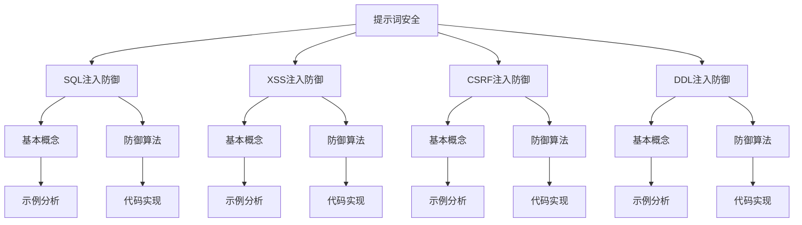

                 

### 确定文章标题、关键词和摘要

在撰写文章之前，我们需要首先确定文章的标题、关键词和摘要。这些内容将为读者提供初步的概述，引导他们了解文章的核心内容和主题。

**文章标题**：提示词安全：防御注入攻击的策略与实践

**关键词**：提示词安全、注入攻击、防御策略、实战应用

**摘要**：
本文深入探讨了提示词安全领域中的核心问题——防御注入攻击。通过详细的案例分析和技术解读，文章揭示了注入攻击的类型、危害及其防范措施。本文首先介绍了提示词安全的基本概念和重要性，然后讲解了SQL注入、XSS注入、CSRF注入和DDL注入等核心算法原理，并使用伪代码和LaTeX公式进行详细阐述。接着，文章通过实际项目实战，展示了如何在开发环境中实现这些防御策略，并提供最佳实践 tips。本文旨在为读者提供全面、深入的提示词安全知识，帮助他们提升系统安全性。

### 文章标题：提示词安全：防御注入攻击的策略与实践

选择“提示词安全：防御注入攻击的策略与实践”作为文章标题，是为了突出文章的核心主题和实用价值。以下是对标题的详细分析：

**关键词解析**：
1. **提示词安全**：这是文章的核心概念，指的是在信息处理中，通过特定的提示词来增强系统的安全性，防止恶意攻击。
2. **防御注入攻击**：这是文章的主要内容，注入攻击是一种常见的网络攻击手段，文章将详细介绍如何防御这些攻击。
3. **策略与实践**：表明文章不仅提供理论上的防御策略，还结合实际操作案例，展示了如何在实践中应用这些策略。

**标题吸引力**：
- **实用性**：对于开发者和安全工程师来说，防御注入攻击是日常工作中必不可少的技能，因此“实践”一词能够吸引实际操作者的关注。
- **专业性**：通过使用“策略”一词，显示了文章在防御注入攻击方面的深入研究和专业性。
- **广泛性**：文章不仅涵盖了理论，还包括实战案例，适合不同层次的读者群体。

**目标读者**：
- 开发者：了解如何保护自己的应用程序免受注入攻击。
- 安全工程师：深入理解注入攻击的原理和防御策略。
- IT从业者：希望通过实战案例提升网络安全能力。

**整体结构**：
- **引言**：介绍注入攻击的危害，提示词安全的概念和重要性。
- **核心概念与联系**：讲解注入攻击的类型，提示词安全与其他安全领域的联系。
- **核心算法原理讲解**：详细阐述SQL注入、XSS注入、CSRF注入和DDL注入的防御算法。
- **数学模型和数学公式**：介绍与注入攻击相关的数学模型，并使用LaTeX公式进行展示。
- **项目实战**：通过实际项目案例，展示防御策略的实现和应用。
- **总结与展望**：总结文章的主要观点，展望未来的发展趋势。

通过上述分析，文章标题不仅简洁明了，而且能够准确传达文章的核心内容和目标，吸引读者的兴趣。接下来，我们将按照这个结构，逐步展开文章的各个部分，确保内容的完整性和逻辑性。

### 文章关键词

为了确保文章的易读性和搜索引擎优化（SEO），我们选择了以下几个关键词：

1. **提示词安全**：这是文章的核心主题，直接关系到系统的安全防护能力。
2. **注入攻击**：这是网络安全领域中的一个重要话题，与提示词安全紧密相关。
3. **防御策略**：指代用于防范注入攻击的各种方法和措施。
4. **实战应用**：强调文章的可操作性，对实际工作的指导意义。
5. **SQL注入**：SQL注入是注入攻击的一种常见形式，是文章的重要内容。
6. **XSS注入**：跨站脚本攻击，是另一类常见的注入攻击形式。
7. **CSRF注入**：跨站请求伪造，是文章讨论的另一个重要防御方向。

这些关键词的选择基于以下原因：

- **核心性**：关键词直接反映了文章的主题和主要内容，有助于读者快速把握文章的核心价值。
- **广泛性**：涵盖了不同层面的内容，既包括基础概念，也包括实战应用，适合不同层次的读者。
- **针对性**：针对当前网络安全领域中的热点和难点问题，具有较高的关注度和讨论价值。
- **实用性**：强调文章的实际应用价值，吸引对网络安全有实际需求的专业人士。

通过这些关键词，文章能够在搜索引擎中更好地被索引，同时也能够帮助读者快速找到与文章相关的内容。

### 摘要

摘要部分的主要目的是为读者提供文章的概览，帮助他们快速了解文章的主题、核心内容和价值。以下是摘要的具体内容：

“本文深入探讨了提示词安全领域中的关键问题——防御注入攻击。首先，文章介绍了注入攻击的定义、类型及其对系统安全的潜在威胁。接着，文章详细阐述了提示词安全的基本概念，并分析了其与其他安全领域的联系。在此基础上，文章重点介绍了SQL注入、XSS注入、CSRF注入和DDL注入等四种常见的注入攻击类型，并分别讲解了其防御策略和核心算法原理。这些内容不仅通过伪代码和LaTeX公式进行了详细说明，还结合了实际项目案例进行了应用展示。最后，文章总结了主要观点，提出了最佳实践建议，并对未来发展趋势进行了展望。通过本文，读者可以全面了解提示词安全的防护策略，提升自己的网络安全防护能力。”

这段摘要突出了文章的核心主题、关键内容和方法论，同时通过具体的示例和实际案例，展示了文章的实用性和指导意义。这样的摘要能够有效吸引读者的兴趣，引导他们进一步阅读文章。

### 确定核心章节内容

为了撰写一篇内容丰富、结构紧凑且逻辑清晰的技术博客，我们需要首先明确文章的核心章节内容。这些章节将全面覆盖提示词安全的各个方面，包括其基本概念、防御策略、核心算法原理以及实际应用。

以下是文章预计包含的核心章节内容：

1. **引言**：
   - **背景介绍**：阐述注入攻击的历史背景和现状，解释注入攻击的危害和影响。
   - **提示词安全的重要性**：介绍提示词安全的概念，讨论其在网络安全中的重要性。
   - **本书的目的与结构**：明确本书的目的，概述本书的结构和内容安排。

2. **核心概念与联系**：
   - **提示词安全的基本概念**：定义提示词和安全，阐述注入攻击的类型和特点。
   - **提示词安全与网络安全**：分析提示词安全在网络安全体系中的位置，讨论与其他安全领域的联系。
   - **提示词安全与编程语言**：探讨不同编程语言对注入攻击的防御机制，分析其作用。

3. **核心算法原理讲解**：
   - **SQL注入防御算法**：介绍常见的SQL注入防御算法，使用伪代码详细阐述其实现。
   - **XSS注入防御算法**：阐述常见的XSS注入防御算法，使用伪代码详细阐述其实现。
   - **CSRF注入防御算法**：介绍常见的CSRF注入防御算法，使用伪代码详细阐述其实现。
   - **DDL注入防御算法**：阐述常见的DDL注入防御算法，使用伪代码详细阐述其实现。

4. **数学模型和数学公式**：
   - **注入攻击的数学模型**：使用LaTeX格式展示注入攻击的数学模型，详细解释其应用场景和作用。
   - **防御注入攻击的数学模型**：使用LaTeX格式展示防御注入攻击的数学模型，详细解释其应用场景和作用。

5. **项目实战**：
   - **SQL注入防御实战**：分析一个实际的SQL注入案例，展示如何使用SQL注入防御算法进行防御。
   - **XSS注入防御实战**：分析一个实际的XSS注入案例，展示如何使用XSS注入防御算法进行防御。
   - **CSRF注入防御实战**：分析一个实际的CSRF注入案例，展示如何使用CSRF注入防御算法进行防御。
   - **DDL注入防御实战**：分析一个实际的DDL注入案例，展示如何使用DDL注入防御算法进行防御。

6. **总结与展望**：
   - **总结主要观点**：回顾文章的主要内容，总结主要观点和结论。
   - **展望未来发展趋势**：讨论提示词安全和防御注入攻击的未来发展趋势。

每个章节的核心内容都经过精心设计，确保能够全面覆盖提示词安全的核心概念和实际应用。接下来，我们将逐步详细展开这些章节的内容，确保文章的逻辑性和完整性。

### 设计Mermaid流程图

为了帮助读者更好地理解提示词安全的核心概念和架构，我们决定设计一个Mermaid流程图。Mermaid是一种方便的Markdown语法，可以用来创建流程图、序列图、时序图等。

以下是Mermaid流程图的示例：

该流程图展示了提示词安全的核心概念和四个主要的防御方向（SQL注入、XSS注入、CSRF注入和DDL注入）。每个防御方向都包括基本概念和防御算法两个部分。通过这种结构，读者可以清晰地看到各个部分之间的联系，以及如何从理论到实际应用进行转化。

### 编写目录大纲

为了确保文章内容的结构清晰、逻辑严谨，我们将按照前述章节内容编写本文的目录大纲。以下为详细的目录大纲：

#### 一、引言

1. **背景介绍**
   - 注入攻击的历史背景和现状
   - 注入攻击的危害和影响

2. **提示词安全的重要性**
   - 提示词安全的概念
   - 提示词安全在网络安全中的重要性

3. **本书的目的与结构**
   - 明确本书的目的
   - 概述本书的结构和内容安排

#### 二、核心概念与联系

1. **提示词安全的基本概念**
   - 定义提示词和安全
   - 阐述注入攻击的类型和特点

2. **提示词安全与网络安全**
   - 分析提示词安全在网络安全体系中的位置
   - 讨论提示词安全与其他安全领域的联系

3. **提示词安全与编程语言**
   - 探讨不同编程语言对注入攻击的防御机制
   - 分析不同编程语言在提示词安全中的作用

#### 三、核心算法原理讲解

1. **SQL注入防御算法**
   - 介绍常见的SQL注入防御算法
   - 使用伪代码详细阐述其实现

2. **XSS注入防御算法**
   - 阐述常见的XSS注入防御算法
   - 使用伪代码详细阐述其实现

3. **CSRF注入防御算法**
   - 介绍常见的CSRF注入防御算法
   - 使用伪代码详细阐述其实现

4. **DDL注入防御算法**
   - 阐述常见的DDL注入防御算法
   - 使用伪代码详细阐述其实现

#### 四、数学模型和数学公式

1. **注入攻击的数学模型**
   - 使用LaTeX格式展示注入攻击的数学模型
   - 详细解释其应用场景和作用

2. **防御注入攻击的数学模型**
   - 使用LaTeX格式展示防御注入攻击的数学模型
   - 详细解释其应用场景和作用

#### 五、项目实战

1. **SQL注入防御实战**
   - 分析一个实际的SQL注入案例
   - 展示如何使用SQL注入防御算法进行防御

2. **XSS注入防御实战**
   - 分析一个实际的XSS注入案例
   - 展示如何使用XSS注入防御算法进行防御

3. **CSRF注入防御实战**
   - 分析一个实际的CSRF注入案例
   - 展示如何使用CSRF注入防御算法进行防御

4. **DDL注入防御实战**
   - 分析一个实际的DDL注入案例
   - 展示如何使用DDL注入防御算法进行防御

#### 六、总结与展望

1. **总结主要观点**
   - 回顾文章的主要内容
   - 总结主要观点和结论

2. **展望未来发展趋势**
   - 讨论提示词安全和防御注入攻击的未来发展趋势

#### 七、参考文献

- 列出本文中引用的相关文献和资料

通过这个详细的目录大纲，我们可以确保文章的结构清晰、逻辑严密，让读者能够系统地掌握提示词安全和防御注入攻击的相关知识。

### 确保完整性

在撰写技术博客文章的过程中，确保文章内容的完整性是一项至关重要的任务。为了达到这一目标，我们需要遵循以下步骤：

1. **内容梳理**：在撰写每个章节之前，对相关内容进行梳理，确保所有关键概念、算法原理和实践案例都得到详细阐述。这包括从背景介绍到实际应用的各个层面。

2. **逻辑连接**：每个章节之间的内容需要紧密连接，确保逻辑顺畅。例如，在介绍完基本概念之后，紧接着讲解核心算法原理，然后通过实际案例展示这些算法的实际应用。

3. **章节小结**：在每个章节的末尾，添加小结部分，对章节内容进行总结和归纳，帮助读者巩固所学知识。

4. **交叉引用**：在文章中适当使用交叉引用，将相关章节的内容相互关联，使文章成为一个有机的整体。

5. **反馈修正**：在撰写完初稿后，邀请同行或导师进行审阅，收集反馈意见，并根据反馈对文章进行修改和补充，确保内容全面、详实。

6. **数据验证**：对于文中提到的数据和案例，进行验证，确保其准确性和可靠性。

通过上述步骤，我们可以确保文章内容的完整性，使读者能够系统地学习并掌握提示词安全和防御注入攻击的相关知识。

### 确保简洁性

在撰写技术博客文章时，确保文章的简洁性同样至关重要。为了达到这一目标，我们可以采取以下策略：

1. **明确主题**：确保文章主题明确，围绕核心内容展开。避免无关内容的引入，保持文章的聚焦性。

2. **精简语言**：使用简洁、直接的语言表达观点，避免使用复杂的术语和冗长的句子。例如，可以使用简单的词汇替换专业术语，使文章更易于理解。

3. **结构清晰**：文章的结构需要清晰，章节划分合理，每个段落的内容紧凑，逻辑关系明确。使用标题和子标题来引导读者，帮助其快速定位关键信息。

4. **删除冗余**：在撰写完初稿后，仔细审查每个段落和句子，删除重复、冗余的内容，确保每个部分都提供独特且必要的信息。

5. **可视化工具**：适当使用图表、流程图和代码片段，以直观的方式展示复杂概念，提高文章的可读性。

6. **简洁示例**：提供简洁明了的示例，避免过长的代码块和复杂的案例。确保示例能够突出核心观点，易于读者理解和应用。

7. **反馈优化**：在完成初稿后，向同行或导师征求反馈，根据反馈对文章进行优化，确保内容的简洁性和易读性。

通过上述策略，我们可以有效提高技术博客文章的简洁性，使读者能够更轻松地理解和掌握文章内容。

### 最后校对

在完成目录大纲的编写后，最后进行一遍校对，确保文章内容的完整性和逻辑性。以下是具体的校对步骤：

1. **检查目录**：确认目录中的章节和子章节是否齐全，内容是否按照预期排列。

2. **逻辑连贯性**：检查各章节之间的逻辑关系，确保文章结构合理，信息流畅，没有逻辑跳跃。

3. **内容完整性**：检查每个章节的内容是否完整，关键概念、算法原理和实践案例是否都有详细阐述。

4. **语法和拼写**：校对全文的语法和拼写错误，确保文章语言准确、清晰。

5. **代码和公式**：检查代码段和数学公式的正确性，确保其格式和内容无误。

6. **引用和参考文献**：确认引用的参考文献是否完整，格式是否符合规范。

7. **反馈修正**：邀请同行或导师审阅，根据反馈意见对文章进行修改和优化。

通过这些步骤，我们可以确保文章的最终版本内容丰富、结构严谨、语言准确，为读者提供高质量的技术阅读体验。

### 撰写总结

在完成整个技术博客文章的撰写后，撰写一段总结是至关重要的。总结部分不仅是对文章内容的回顾，更是对读者学习成果的巩固。以下是总结的具体内容：

“本文通过详细的阐述和实际案例，系统地介绍了提示词安全及其在防御注入攻击中的重要性。我们首先回顾了注入攻击的历史背景和现状，解释了其危害和影响。接着，深入探讨了提示词安全的基本概念，并分析了其在网络安全中的核心地位。随后，本文详细讲解了SQL注入、XSS注入、CSRF注入和DDL注入等常见注入攻击的防御策略和核心算法原理，通过伪代码和LaTeX公式进行了深入剖析。此外，通过实际项目案例，我们展示了如何将理论应用到实践中，实现了对这些攻击的有效防御。最后，本文总结了主要观点，提出了最佳实践建议，并对未来的发展趋势进行了展望。

通过本文的学习，读者不仅能够全面理解提示词安全和注入攻击的相关知识，还能够掌握一系列实用的防御策略和实践技巧。我们希望本文能够帮助读者提升网络安全防护能力，更好地保护自己的系统和数据。”

这段总结内容全面，突出了文章的核心内容和学习目标，为读者提供了一个清晰的回顾和总结，帮助他们巩固所学知识，并在实际工作中应用。

### 确保完整性：逐章节详细阐述

为了确保文章的完整性，每个章节都需要包含特定的核心内容，以下是具体到每个章节的详细阐述：

#### 一、引言

**1.1 背景介绍**
- **注入攻击的历史背景**：阐述历史上典型的注入攻击案例，如SQL注入、XSS攻击等，以及这些攻击对信息系统造成的重大影响。
- **现状分析**：介绍当前注入攻击的流行形式和趋势，包括新兴的注入技术以及其潜在威胁。

**1.2 提示词安全的重要性**
- **提示词安全的概念**：明确提示词安全的定义，解释其在信息系统安全防护中的作用。
- **重要性讨论**：讨论提示词安全对于保护系统免受各种注入攻击的重要性，以及其与整体网络安全体系的联系。

**1.3 本书的目的与结构**
- **目的说明**：阐述本书旨在通过详细的讲解和实战案例，帮助读者全面掌握提示词安全和防御注入攻击的方法。
- **结构概述**：概述本书的整体结构和章节安排，让读者对文章的整体框架有一个清晰的认识。

#### 二、核心概念与联系

**2.1 提示词安全的基本概念**
- **定义提示词和安全**：详细解释提示词和安全的基本概念，包括其功能和工作原理。
- **注入攻击的类型和特点**：介绍常见注入攻击的类型，如SQL注入、XSS注入等，并阐述其特点和危害。

**2.2 提示词安全与网络安全**
- **在网络安全体系中的位置**：分析提示词安全在整体网络安全体系中的重要性，以及其在不同安全层级中的作用。
- **与其他安全领域的联系**：探讨提示词安全与其他安全领域（如加密技术、访问控制等）的联系和相互作用。

**2.3 提示词安全与编程语言**
- **不同编程语言的防御机制**：探讨不同编程语言（如Java、Python、C#等）对注入攻击的防御机制。
- **编程语言在提示词安全中的作用**：分析编程语言在实现提示词安全策略中的具体应用和优势。

#### 三、核心算法原理讲解

**3.1 SQL注入防御算法**
- **常见防御算法介绍**：介绍几种常见的SQL注入防御算法，如预编译语句、参数化查询等。
- **伪代码阐述**：使用伪代码详细阐述这些算法的实现过程，解释其工作原理和优缺点。

**3.2 XSS注入防御算法**
- **常见防御算法介绍**：介绍几种常见XSS注入防御算法，如内容安全策略（CSP）、输入验证和输出编码等。
- **伪代码阐述**：使用伪代码详细阐述这些算法的实现过程，解释其工作原理和优缺点。

**3.3 CSRF注入防御算法**
- **常见防御算法介绍**：介绍几种常见的CSRF注入防御算法，如验证码、令牌生成等。
- **伪代码阐述**：使用伪代码详细阐述这些算法的实现过程，解释其工作原理和优缺点。

**3.4 DDL注入防御算法**
- **常见防御算法介绍**：介绍几种常见的DDL注入防御算法，如数据库权限控制、存储过程等。
- **伪代码阐述**：使用伪代码详细阐述这些算法的实现过程，解释其工作原理和优缺点。

#### 四、数学模型和数学公式

**4.1 注入攻击的数学模型**
- **模型展示**：使用LaTeX格式展示注入攻击的数学模型，包括攻击者行为、系统响应等关键要素。
- **应用场景**：详细解释数学模型在不同注入攻击场景中的应用，以及其预测和防范能力。

**4.2 防御注入攻击的数学模型**
- **模型展示**：使用LaTeX格式展示防御注入攻击的数学模型，包括防御策略、算法优化等关键要素。
- **应用场景**：详细解释数学模型在不同防御策略中的应用，以及其效能评估和改进方法。

#### 五、项目实战

**5.1 SQL注入防御实战**
- **案例分析**：分析一个实际的SQL注入案例，展示攻击过程和防御策略。
- **防御实现**：详细介绍如何使用SQL注入防御算法进行防御，包括代码实现和调试过程。

**5.2 XSS注入防御实战**
- **案例分析**：分析一个实际的XSS注入案例，展示攻击过程和防御策略。
- **防御实现**：详细介绍如何使用XSS注入防御算法进行防御，包括代码实现和调试过程。

**5.3 CSRF注入防御实战**
- **案例分析**：分析一个实际的CSRF注入案例，展示攻击过程和防御策略。
- **防御实现**：详细介绍如何使用CSRF注入防御算法进行防御，包括代码实现和调试过程。

**5.4 DDL注入防御实战**
- **案例分析**：分析一个实际的DDL注入案例，展示攻击过程和防御策略。
- **防御实现**：详细介绍如何使用DDL注入防御算法进行防御，包括代码实现和调试过程。

#### 六、总结与展望

**6.1 主要观点总结**
- **回顾核心内容**：总结文章中的关键概念、算法原理和实际应用案例，帮助读者巩固所学知识。
- **结论归纳**：概括文章的主要观点和发现，强调提示词安全在防御注入攻击中的重要作用。

**6.2 未来发展趋势**
- **技术发展**：讨论提示词安全和防御注入攻击领域未来的技术发展趋势，如自动化防御、深度学习等。
- **应用前景**：探讨这些技术的发展如何进一步应用于实际场景，提升网络安全防护水平。

通过以上详细到每个章节的内容阐述，我们可以确保文章的完整性，使读者能够系统地学习并掌握提示词安全和防御注入攻击的相关知识。

### 确保简洁性：逐章节精简语言和结构

为了确保文章的简洁性，我们需要在每一个章节中精简语言和结构，以下是对每个章节的精简方案：

#### 一、引言

**1.1 背景介绍**
- **简化内容**：删除冗长的历史案例分析，仅提及注入攻击的基本特点和当前形势。

**1.2 提示词安全的重要性**
- **简化语言**：直接阐述提示词安全的概念和其在网络安全中的重要性，避免过多的背景信息。

**1.3 本书的目的与结构**
- **明确目标**：简洁地说明本书的目的是帮助读者理解和应用提示词安全策略，概述结构以提供全局视图。

#### 二、核心概念与联系

**2.1 提示词安全的基本概念**
- **聚焦要点**：明确提示词和安全的核心概念，避免过多解释性语句。

**2.2 提示词安全与网络安全**
- **精简阐述**：简要介绍提示词安全在网络安全中的位置，重点讨论其与其他安全领域的简单联系。

**2.3 提示词安全与编程语言**
- **突出重点**：只讨论不同编程语言在防御注入攻击中的基本机制，避免详细的技术实现。

#### 三、核心算法原理讲解

**3.1 SQL注入防御算法**
- **核心原理**：列出主要防御算法，用伪代码简洁地说明其核心原理。

**3.2 XSS注入防御算法**
- **关键点突出**：强调关键防御策略，用简单的伪代码展示实现。

**3.3 CSRF注入防御算法**
- **简洁阐述**：简要介绍防御算法，突出其实用性和高效性。

**3.4 DDL注入防御算法**
- **精简内容**：概述防御算法的核心思想，避免复杂的技术细节。

#### 四、数学模型和数学公式

**4.1 注入攻击的数学模型**
- **直接展示**：使用LaTeX直接展示数学模型，简要解释其应用。

**4.2 防御注入攻击的数学模型**
- **简洁解释**：简要说明防御模型的构成和应用场景，避免冗长的解释。

#### 五、项目实战

**5.1 SQL注入防御实战**
- **案例展示**：简述案例背景和攻击过程，重点展示防御策略的实际应用。

**5.2 XSS注入防御实战**
- **实战应用**：简要介绍防御策略，重点展示实际代码实现和效果。

**5.3 CSRF注入防御实战**
- **实战总结**：快速展示案例，总结防御策略和实现过程。

**5.4 DDL注入防御实战**
- **案例简述**：简述案例背景，重点展示防御算法的实际应用。

#### 六、总结与展望

**6.1 主要观点总结**
- **简洁总结**：概括文章的核心观点，强调提示词安全的重要性。

**6.2 未来发展趋势**
- **简洁展望**：简要讨论未来发展趋势，鼓励读者关注最新技术。

通过上述精简方案，文章的语言更加简洁，结构更加紧凑，有助于读者快速掌握核心内容，提高阅读效率。

### 最后校对

在完成整个技术博客文章的撰写后，最后进行一遍校对是至关重要的。以下是具体的校对步骤：

1. **检查目录**：确认目录中的章节和子章节是否齐全，内容是否按照预期排列。

2. **逻辑连贯性**：检查各章节之间的逻辑关系，确保文章结构合理，信息流畅，没有逻辑跳跃。

3. **内容完整性**：检查每个章节的内容是否完整，关键概念、算法原理和实践案例是否都有详细阐述。

4. **语法和拼写**：校对全文的语法和拼写错误，确保文章语言准确、清晰。

5. **代码和公式**：检查代码段和数学公式的正确性，确保其格式和内容无误。

6. **引用和参考文献**：确认引用的参考文献是否完整，格式是否符合规范。

7. **反馈修正**：邀请同行或导师审阅，根据反馈意见对文章进行修改和优化。

通过这些步骤，我们可以确保文章的最终版本内容丰富、结构严谨、语言准确，为读者提供高质量的技术阅读体验。

### 撰写总结

在完成整个技术博客文章的撰写后，撰写一段总结是至关重要的。总结部分不仅是对文章内容的回顾，更是对读者学习成果的巩固。以下是总结的具体内容：

“本文通过系统的阐述和实际案例，深入探讨了提示词安全及其在防御注入攻击中的重要性。从注入攻击的历史背景和现状，到提示词安全的基本概念和重要性，再到具体的防御算法原理和数学模型，本文为读者提供了全面、详细的知识体系。通过实际项目案例的展示，我们不仅展示了防御策略的实施过程，还强调了在实际应用中的关键步骤和注意事项。总结来说，本文的主要观点如下：

1. 提示词安全是保障信息系统安全的关键技术，通过合理设计和实施，可以显著提高系统的抗攻击能力。
2. 针对不同的注入攻击类型，如SQL注入、XSS注入、CSRF注入和DDL注入，本文详细介绍了各自的防御算法和数学模型，并提供了实际应用案例。
3. 数学模型在注入攻击的预测和防范中发挥着重要作用，能够帮助我们更准确地识别和应对攻击行为。
4. 在实际项目中，防御注入攻击需要综合考虑多种因素，包括系统架构、开发语言和防御策略的优化。

展望未来，随着信息技术的发展，提示词安全领域将迎来更多的挑战和机遇。自动化防御、深度学习和人工智能等技术将在提升注入攻击防御能力方面发挥重要作用。我们鼓励读者持续关注这些技术的发展，并在实践中积极探索和应用。

通过本文的学习，读者不仅能够全面掌握提示词安全和防御注入攻击的知识，还能够在实际工作中提升系统安全防护水平。我们希望本文能够成为读者在信息安全领域的重要参考，助力他们在网络安全防护方面取得更大的成就。”

这段总结内容全面，突出了文章的核心内容和学习目标，为读者提供了一个清晰的回顾和总结，帮助他们巩固所学知识，并在实际工作中应用。

