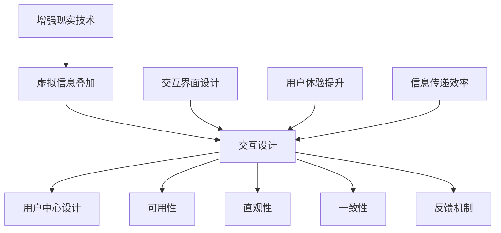

                 

### 文章标题：提示词工程在增强现实交互设计中的应用

---

#### 关键词：增强现实、交互设计、提示词工程、自然语言处理、算法优化

---

#### 摘要：

随着增强现实（AR）技术的快速发展，其在各个领域中的应用越来越广泛。然而，增强现实的交互设计仍面临诸多挑战，其中之一便是如何有效地利用提示词来提升用户体验。本文将深入探讨提示词工程在增强现实交互设计中的应用，从背景介绍、核心概念、算法原理、数学模型、项目实战等方面进行详细讲解。文章旨在为读者提供一份全面而深入的技术指南，帮助他们在实际项目中更好地利用提示词工程来提升AR交互设计的质量。

---

### 引言

增强现实（Augmented Reality，AR）是一种将虚拟信息与现实世界结合的技术，通过在现实世界中叠加计算机生成的图像、声音、视频等多媒体信息，使用户能够与虚拟环境进行交互。AR技术的应用范围广泛，包括教育、医疗、娱乐、导航、设计等多个领域。随着硬件技术的不断进步和智能手机、平板电脑等移动设备的普及，AR技术逐渐走进大众的日常生活。

交互设计是增强现实应用中不可或缺的一环。一个优秀的交互设计能够极大地提升用户体验，使得用户在操作过程中感到舒适、自然，并能有效地完成任务。然而，增强现实的交互设计面临着诸多挑战。首先，由于AR技术在现实世界中叠加虚拟信息，用户对交互界面的认知和理解变得复杂；其次，增强现实设备通常具有有限的输入和输出接口，如何设计简洁、直观的交互方式成为一个难题；最后，增强现实应用的上下文信息多变，如何根据用户的实际需求和环境动态地调整交互界面也是一个重要问题。

提示词工程在增强现实交互设计中的应用具有重要意义。提示词是一种引导用户进行操作的语言提示，它可以通过自然语言处理技术生成，并根据上下文信息进行动态调整。通过合理地设计提示词，可以有效地指导用户完成增强现实任务，提高交互效率。同时，提示词工程还可以优化增强现实应用的性能，减少用户的学习成本，提升用户的沉浸感和满意度。

本文将围绕提示词工程在增强现实交互设计中的应用，从以下几个方面进行探讨：

1. **增强现实与交互设计的背景**：介绍增强现实技术的发展历程和交互设计的核心概念。
2. **提示词工程概述**：阐述提示词的定义、类型及其在增强现实交互设计中的作用。
3. **提示词生成技术**：讲解自然语言处理基础、提示词生成算法及其挑战和优化策略。
4. **提示词评估与优化**：介绍提示词评估指标、优化策略及其在实际案例中的应用。
5. **提示词工程在AR交互设计中的应用**：探讨提示词在AR导航、教育、娱乐等领域的应用实例。
6. **提示词工程开发实践**：阐述AR交互设计项目流程、开发工具与平台以及实际项目案例。
7. **未来展望与趋势**：分析提示词工程的未来发展趋势、面临的挑战与机遇。
8. **附录**：提供常用技术术语解释和进一步阅读资源。

通过本文的探讨，希望能够为读者提供一份全面而深入的技术指南，帮助他们在实际项目中更好地利用提示词工程来提升AR交互设计的质量。

### 第1章 增强现实与交互设计

#### 1.1 增强现实的基本概念

增强现实（Augmented Reality，AR）是一种通过计算机技术和显示设备将虚拟信息叠加到真实世界中的技术。与虚拟现实（Virtual Reality，VR）不同，增强现实并不是将用户完全封闭在一个虚拟环境中，而是在现实世界的基础上增加一层虚拟信息，从而实现对现实世界的增强。这种技术可以通过智能手机、平板电脑、头戴式显示器等设备实现。

增强现实的核心在于虚拟信息的叠加和交互。虚拟信息可以通过计算机生成，包括图像、文字、声音、视频等多种形式。这些信息可以实时地与真实世界中的物体进行交互，例如，在现实世界中放置一个虚拟的数字标识，用户可以通过触摸、手势等方式与之互动。这种交互方式不仅能够丰富用户的感知体验，还能够提高信息传递的效率。

增强现实技术的基本概念包括以下几个方面：

1. **叠加显示**：通过计算机生成的虚拟信息叠加到现实世界的图像上，使用户能够同时看到真实世界和虚拟世界。
2. **交互技术**：用户可以通过触摸、手势、语音等手段与虚拟信息进行交互，从而实现控制、查询、操作等功能。
3. **定位与追踪**：利用摄像头、传感器等设备实时捕捉现实世界的图像和物体，并通过计算机处理实现虚拟信息与真实世界的精确匹配和定位。

#### 1.2 交互设计的核心概念

交互设计（Interaction Design）是设计学科中的一个重要分支，旨在优化用户与产品、系统或服务的交互体验。在增强现实交互设计中，交互设计的核心概念包括以下几个方面：

1. **用户中心设计**：交互设计应以用户的需求和体验为中心，通过用户研究和用户测试等方法，了解用户的背景、行为和需求，从而设计出符合用户期望的产品和服务。
2. **可用性**：交互设计的目标是提高产品的可用性，使用户能够轻松、高效地完成任务。可用性包括易学性、易用性、效率和用户满意度等多个方面。
3. **直观性**：交互设计应追求直观性，即用户能够通过直觉理解产品的操作方式和功能，从而减少学习成本和提高使用效率。
4. **一致性**：交互设计应保持一致性和连贯性，即在不同的情境和设备上，用户能够体验到一致的操作逻辑和界面设计，从而降低认知负担。
5. **反馈机制**：交互设计应提供及时、有效的反馈机制，使用户能够了解自己的操作结果和系统状态，从而增强用户的信心和控制感。

#### 1.3 增强现实与交互设计的联系

增强现实与交互设计之间存在着密切的联系。首先，增强现实技术为交互设计提供了新的可能性，使得用户可以在真实世界中与虚拟信息进行更丰富、更直接的交互。这种交互不仅能够增强用户的感知体验，还能够提高信息传递的效率。

其次，交互设计在增强现实应用中扮演着至关重要的角色。通过合理的交互设计，增强现实应用可以更好地满足用户的需求，提升用户体验。例如，在设计一个增强现实导航应用时，如何通过提示词和交互界面引导用户进行操作，是一个关键问题。一个优秀的交互设计能够减少用户的学习成本，提高交互效率，从而提升用户的满意度和使用频率。

此外，增强现实与交互设计之间的联系还体现在它们共同追求的目标上。无论是增强现实技术还是交互设计，它们的核心都是要为用户提供更好的体验和服务。这种目标的一致性使得两者能够相互促进、共同发展。

为了更好地理解增强现实与交互设计之间的联系，我们可以使用Mermaid流程图来展示它们之间的关系架构：



通过这个流程图，我们可以清晰地看到增强现实技术与交互设计之间的互动关系，以及它们如何共同作用于提升用户体验。

### 第2章 提示词工程概述

#### 2.1 提示词的定义与作用

提示词（cue word）在增强现实交互设计中扮演着重要角色。提示词是一种用于引导用户进行特定操作或任务的语言提示。它通常以文本、语音或图像的形式出现，通过自然语言处理（Natural Language Processing，NLP）技术生成，并根据用户的上下文信息和行为动态调整。

提示词的定义可以分为以下几个方面：

1. **引导作用**：提示词的主要作用是引导用户进行特定操作或任务。它通过提示用户下一步该做什么，从而帮助用户更好地理解系统意图，提高交互效率。
2. **情境适应性**：提示词应根据用户的情境和行为动态调整。在不同的交互情境下，提示词的内容和形式都可能发生变化，以适应用户的实际需求。
3. **上下文感知**：提示词应具备上下文感知能力，能够根据用户的当前状态和历史行为提供相关的提示。这种能力有助于提高用户对系统的理解和信任。

在增强现实交互设计中，提示词具有以下几个作用：

1. **任务指导**：提示词可以明确地指示用户应该如何完成任务。例如，在增强现实导航应用中，提示词可以告知用户需要向哪个方向移动，或者需要执行哪些操作。
2. **情境提示**：提示词可以在特定情境下提供必要的提示。例如，当用户在增强现实游戏中学到新技能时，提示词可以提示用户如何应用这些技能。
3. **错误纠正**：提示词可以在用户出现错误时提供纠正建议。例如，当用户输入错误的信息时，提示词可以提示用户重新输入或选择正确的选项。
4. **增强沉浸感**：通过合理设计的提示词，可以增强用户的沉浸感。例如，在增强现实教育应用中，提示词可以模拟教师的讲解，帮助用户更好地理解和吸收知识。

#### 2.2 提示词的类型

根据用途和形式，提示词可以分为多种类型。以下是一些常见的提示词类型及其特点：

1. **命令提示词**：命令提示词用于指示用户执行特定操作。例如，“请按下按钮”、“向左旋转”等。命令提示词通常具有明确的指令性，能够快速引导用户完成任务。
2. **情境提示词**：情境提示词用于提示用户当前所处的情境或环境。例如，“您正在参观博物馆的恐龙展区”、“请注意前方有障碍物”等。情境提示词可以帮助用户更好地理解和适应环境。
3. **反馈提示词**：反馈提示词用于向用户反馈系统的状态或操作结果。例如，“操作成功”、“正在加载”等。反馈提示词可以增强用户对系统的信心和控制感。
4. **交互提示词**：交互提示词用于引导用户与系统进行交互。例如，“请说出您的目的地”、“您需要选择一个选项”等。交互提示词可以帮助用户更好地理解系统提供的交互方式。
5. **引导提示词**：引导提示词用于引导用户完成复杂的任务或流程。例如，“接下来，请进行以下步骤：1. 打开菜单，2. 选择设置，3. 修改密码”等。引导提示词可以提供详细的步骤指南，帮助用户顺利完成任务。

#### 2.3 提示词工程的关键要素

提示词工程是增强现实交互设计的重要组成部分，其核心要素包括以下几个方面：

1. **自然语言处理（NLP）技术**：提示词的生成和优化依赖于自然语言处理技术。NLP技术包括词向量表示、语法解析、语义分析等，用于理解和生成自然语言文本。例如，词向量表示技术可以将单词映射到高维空间中，从而实现词语的相似性和距离计算。
2. **上下文理解**：提示词应根据用户的上下文信息进行动态调整。上下文理解技术包括实体识别、事件抽取、场景分析等，用于分析用户的当前状态、历史行为和环境因素，从而生成合适的提示词。
3. **动态调整机制**：提示词工程应具备动态调整机制，能够根据用户的交互行为和环境变化实时调整提示词的内容和形式。例如，当用户遇到困难时，可以提供更详细的提示词，而当用户熟悉了操作流程后，可以简化提示词以减少干扰。
4. **评估与优化**：提示词工程需要定期评估和优化提示词的质量。评估指标包括用户满意度、任务完成率、错误率等。通过分析评估结果，可以找出提示词的不足之处，并进行相应的优化。

#### 2.4 提示词工程在增强现实交互设计中的应用

提示词工程在增强现实交互设计中的应用主要体现在以下几个方面：

1. **导航应用**：在增强现实导航应用中，提示词可以指导用户如何到达目的地。例如，“向左转，前方50米有拐角”，“请走到蓝色标志处”。通过提示词，用户可以更轻松地理解导航信息，减少迷路和困惑的可能性。
2. **教育应用**：在增强现实教育应用中，提示词可以引导用户进行学习任务。例如，“请观察这个生物的特点”，“试着回答以下问题：这个生物是什么？它有什么作用？”等。提示词可以帮助用户更好地理解和掌握知识。
3. **游戏应用**：在增强现实游戏应用中，提示词可以提供游戏指南和策略提示。例如，“使用手势向右滑动以躲避障碍物”，“找到了宝藏，请输入密码”等。提示词可以增强游戏的趣味性和挑战性，提高用户的游戏体验。
4. **医疗应用**：在增强现实医疗应用中，提示词可以指导医生进行手术操作。例如，“请注意，这是心脏动脉”，“使用剪刀剪开动脉”，等。提示词可以帮助医生更好地掌握手术流程，提高手术的成功率。

总之，提示词工程在增强现实交互设计中的应用具有重要意义。通过合理设计提示词，可以有效地引导用户进行操作，提高交互效率，提升用户体验。随着自然语言处理技术和上下文理解技术的不断发展，提示词工程在增强现实交互设计中的应用前景将更加广阔。

### 第3章 提示词生成技术

#### 3.1 自然语言处理基础

自然语言处理（Natural Language Processing，NLP）是提示词生成技术的核心，它涉及计算机对人类语言的理解、生成和交互。NLP技术的发展为提示词工程提供了强大的支持，使得生成高质量的提示词成为可能。以下是NLP中的一些基础概念和关键技术。

**词向量表示**：词向量是将单词映射到高维空间中的向量表示方法。它通过捕捉单词的语义和语法特征，实现了对自然语言文本的量化表示。词向量技术主要包括词袋模型（Bag of Words，BoW）和词嵌入（Word Embedding）。

- **词袋模型**：词袋模型将文本表示为一个向量空间中的向量，其中每个维度对应一个词汇表中的单词。词向量的大小等于词汇表中的单词数量。词袋模型忽略了单词的顺序信息，只考虑单词的出现频率。尽管词袋模型简单易实现，但其表现效果受到词汇表大小和单词顺序的影响。
  
- **词嵌入**：词嵌入（如Word2Vec、GloVe）通过捕捉单词的语义和语法关系，将单词映射到低维空间中。词嵌入能够更好地表示单词之间的相似性和差异性，从而提高NLP任务的表现。

**语法解析**：语法解析是将自然语言文本转换为结构化表示的方法。它包括分词、词性标注、句法分析等步骤。

- **分词**：分词是将连续的文本分割成单词或短语的步骤。分词质量对后续的NLP任务至关重要。
  
- **词性标注**：词性标注是将文本中的每个单词标记为名词、动词、形容词等不同的词性。词性标注有助于理解文本的语法结构和语义含义。
  
- **句法分析**：句法分析是对文本的句法结构进行解析，确定句子中各单词之间的语法关系。常见的句法分析方法包括基于规则的解析和基于统计的解析。

**语义分析**：语义分析是理解文本中单词和句子之间的语义关系。它包括实体识别、情感分析、关系抽取等任务。

- **实体识别**：实体识别是将文本中的实体（如人名、地名、组织名等）识别出来。实体识别有助于对文本进行结构化处理和知识抽取。
  
- **情感分析**：情感分析是判断文本中表达的情感倾向，如正面、负面或中性。情感分析在社交媒体分析、用户评论分析等领域有广泛应用。
  
- **关系抽取**：关系抽取是识别文本中实体之间的语义关系。关系抽取有助于构建知识图谱，为后续的推理和分析提供支持。

**文本生成**：文本生成是将输入的文本转换为输出的文本的方法。它包括生成式模型和判别式模型两种方法。

- **生成式模型**：生成式模型通过生成概率分布来生成新的文本。常见的生成式模型包括循环神经网络（RNN）、变换器（Transformer）等。
  
- **判别式模型**：判别式模型通过学习输入和输出之间的映射关系来生成文本。常见的判别式模型包括卷积神经网络（CNN）、长短期记忆网络（LSTM）等。

**语义角色标注**：语义角色标注是将文本中的每个单词标注为不同的语义角色，如主语、谓语、宾语等。语义角色标注有助于理解文本的语义结构和生成高质量的提示词。

#### 3.2 提示词生成算法

提示词生成算法是提示词工程中的关键技术。以下介绍几种常见的提示词生成算法。

**模板匹配**：模板匹配是一种简单的提示词生成方法，通过预定义的模板来生成提示词。模板通常包含一个或多个变量，这些变量可以动态替换为具体的值。

- **核心原理**：模板匹配算法根据输入的上下文信息，选择合适的模板，并将模板中的变量替换为具体的值。例如，一个简单的模板可以是“请向{{方向}}移动”，根据用户的位置信息，可以将{{方向}}替换为“前方”或“左侧”。
  
- **实现步骤**：1. 预定义模板库；2. 根据上下文信息选择合适的模板；3. 将模板中的变量替换为具体的值；4. 生成最终的提示词。

**序列生成模型**：序列生成模型是一种基于深度学习的提示词生成方法，通过学习输入序列和输出序列之间的映射关系来生成提示词。

- **核心原理**：序列生成模型将输入的上下文信息表示为一个序列，并通过训练学习如何生成对应的提示词序列。常见的序列生成模型包括循环神经网络（RNN）、长短期记忆网络（LSTM）、变换器（Transformer）等。
  
- **实现步骤**：1. 预处理输入的上下文信息；2. 选择合适的序列生成模型；3. 使用训练数据对模型进行训练；4. 输入新的上下文信息，生成对应的提示词序列。

**深度强化学习**：深度强化学习（Deep Reinforcement Learning，DRL）是一种结合深度学习和强化学习的方法，用于生成高质量的提示词。

- **核心原理**：深度强化学习通过模拟用户与环境之间的交互过程，学习如何生成能够最大化奖励的提示词。奖励函数可以根据提示词的质量、用户的操作效率等多个因素进行设计。
  
- **实现步骤**：1. 定义奖励函数；2. 选择深度强化学习模型（如深度Q网络（DQN）、策略梯度（PG）等）；3. 在模拟环境中对模型进行训练；4. 输入新的上下文信息，生成对应的提示词序列。

#### 3.3 提示词生成的挑战与优化策略

提示词生成面临着诸多挑战，包括多义性、上下文理解不足、提示词质量评估等。以下介绍一些常见的挑战及其优化策略。

**多义性**：多义性是指一个单词或短语在特定语境下具有多种含义。多义性使得提示词生成变得复杂，因为生成的提示词可能无法准确传达用户的意图。

- **优化策略**：1. 上下文感知的词向量表示；2. 利用语法和语义信息进行词义消歧；3. 设计自适应的模板匹配算法。

**上下文理解不足**：上下文理解不足是指生成的提示词未能充分考虑用户的当前状态和情境。

- **优化策略**：1. 引入更多的上下文信息（如用户历史行为、环境因素等）；2. 使用深度学习模型捕捉上下文的长期依赖关系；3. 结合多模态信息（如图像、语音等）进行上下文理解。

**提示词质量评估**：提示词质量评估是衡量提示词生成效果的关键。高质量的评价指标可以指导优化算法，提高提示词生成质量。

- **优化策略**：1. 设计多层次的评估指标（如文本质量、用户满意度、任务完成率等）；2. 利用人类评估员进行定性评估；3. 结合自动评估指标和人工评估结果进行综合评估。

总之，提示词生成技术是增强现实交互设计中的重要一环。通过运用自然语言处理技术、深度学习模型和优化策略，可以生成高质量的提示词，提高用户的交互体验。随着技术的不断发展，提示词生成将变得更加智能和高效。

### 第4章 提示词评估与优化

#### 4.1 提示词评估指标

在提示词工程中，评估指标是衡量提示词生成质量和效果的关键。以下是几种常用的提示词评估指标及其应用：

**准确率（Accuracy）**：准确率是衡量提示词生成正确性的基本指标，计算公式为：
$$
\text{准确率} = \frac{\text{正确生成的提示词数}}{\text{总提示词数}}
$$
准确率越高，说明提示词生成系统在整体上表现越好。然而，准确率并不能完全反映提示词的实用性，因为它忽略了提示词的质量和上下文适应性。

**召回率（Recall）**：召回率是衡量提示词生成系统能否生成所有相关提示词的能力，计算公式为：
$$
\text{召回率} = \frac{\text{正确生成的相关提示词数}}{\text{实际存在的相关提示词数}}
$$
召回率越高，说明系统能够更好地捕捉到与上下文相关的提示词。然而，召回率过高可能会导致生成过多的无关提示词，从而降低用户体验。

**F1分数（F1 Score）**：F1分数是准确率和召回率的调和平均值，用于综合评估提示词生成的全面性和准确性。计算公式为：
$$
\text{F1分数} = 2 \times \frac{\text{准确率} \times \text{召回率}}{\text{准确率} + \text{召回率}}
$$
F1分数能够较好地平衡准确率和召回率，是评估提示词生成系统常用的指标之一。

**用户满意度（User Satisfaction）**：用户满意度是衡量用户对提示词生成效果的直接感受，通常通过问卷调查、用户反馈等方式进行评估。用户满意度能够反映提示词在实际应用中的效果，是评估提示词生成系统的重要指标。

**任务完成率（Task Completion Rate）**：任务完成率是衡量用户在提示词引导下完成任务的能力，计算公式为：
$$
\text{任务完成率} = \frac{\text{成功完成任务的次数}}{\text{尝试完成任务的总次数}}
$$
任务完成率越高，说明提示词对用户的任务引导效果越好，能够有效地提高用户的操作效率和满意度。

**错误率（Error Rate）**：错误率是衡量提示词生成系统产生错误提示词的概率，计算公式为：
$$
\text{错误率} = \frac{\text{错误生成的提示词数}}{\text{总提示词数}}
$$
错误率越低，说明系统生成的提示词越准确，用户体验越好。

**平均响应时间（Average Response Time）**：平均响应时间是衡量提示词生成系统生成提示词所需时间的平均值，计算公式为：
$$
\text{平均响应时间} = \frac{\sum_{i=1}^{n} \text{第i个提示词的生成时间}}{n}
$$
平均响应时间越短，说明系统生成提示词的效率越高，能够更好地满足用户实时交互的需求。

**文本质量（Text Quality）**：文本质量是衡量提示词生成系统生成的提示词在语法、语义、可读性等方面的表现，可以通过人工评估和自动化评估方法进行评估。

**交互效率（Interaction Efficiency）**：交互效率是衡量提示词生成系统对用户操作的响应速度和准确性，可以通过任务完成时间和错误率等指标进行评估。

**沉浸感（Immersion）**：沉浸感是衡量用户在增强现实环境中对提示词生成系统的感受，通常通过用户的主观评价和沉浸感评估工具进行评估。

#### 4.2 提示词优化策略

在提示词评估的基础上，优化策略旨在提升提示词生成系统的质量和效果。以下是几种常见的提示词优化策略：

**基于数据的优化**：基于数据的优化策略通过分析和调整训练数据来提升提示词生成质量。具体方法包括：

1. **数据清洗和预处理**：对训练数据进行清洗和预处理，去除噪声数据和异常值，提高训练数据的质量。
2. **数据增强**：通过数据增强方法（如数据扩充、数据变换等）增加训练数据的多样性，提高模型对各种上下文情境的泛化能力。
3. **选择性数据注入**：根据提示词生成系统的评估结果，选择性地注入高质量的训练数据，提高模型的性能。

**基于算法的优化**：基于算法的优化策略通过调整算法参数和模型结构来提升提示词生成质量。具体方法包括：

1. **模型选择**：选择合适的模型架构，如循环神经网络（RNN）、变换器（Transformer）、生成对抗网络（GAN）等，以提高提示词生成效果。
2. **参数调整**：通过调整学习率、批次大小、正则化参数等模型参数，优化模型的训练过程和生成效果。
3. **模型融合**：结合多个模型的优势，通过模型融合方法（如集成学习、注意力机制等）提升提示词生成系统的整体性能。

**基于用户的优化**：基于用户的优化策略通过分析和理解用户的反馈和行为，动态调整提示词生成策略，以提升用户的体验和满意度。具体方法包括：

1. **用户行为分析**：通过分析用户的交互行为，如点击率、操作时长、错误率等，了解用户对提示词的响应和满意度。
2. **个性化推荐**：根据用户的兴趣和偏好，为用户提供个性化的提示词，提高用户的沉浸感和满意度。
3. **动态调整提示词策略**：根据用户的实时反馈和交互行为，动态调整提示词的生成策略，如增加提示词的多样性、调整提示词的呈现方式等。

**基于反馈的优化**：基于反馈的优化策略通过用户的反馈和评估结果来指导提示词生成系统的优化过程。具体方法包括：

1. **用户反馈收集**：通过问卷调查、用户访谈等方式收集用户的反馈和评估结果，了解用户对提示词生成系统的满意度和改进需求。
2. **反馈处理和分析**：对收集的反馈进行处理和分析，识别出系统存在的问题和改进点，为优化策略提供依据。
3. **持续优化**：根据用户反馈和评估结果，对提示词生成系统进行持续优化和改进，提升系统的整体性能。

总之，提示词评估与优化是提示词工程中至关重要的一环。通过科学地选择评估指标、运用多种优化策略，可以提升提示词生成系统的质量和效果，为用户提供更好的交互体验。

### 第5章 提示词工程在AR交互设计中的应用

#### 5.1 提示词在AR导航中的应用

增强现实（AR）导航已成为现代导航技术中的重要组成部分，通过在现实世界中叠加虚拟信息，帮助用户更直观、更准确地找到目的地。在这个过程中，提示词工程发挥了关键作用，通过生成高质量的提示词，提升了用户的导航体验。

**应用背景**：随着智能手机和AR技术的普及，AR导航逐渐走进了人们的日常生活。无论是自驾出行、公共交通还是徒步旅行，AR导航都能提供更为直观的路线指引和位置信息。然而，AR导航面临的一个主要挑战是用户在复杂环境中容易迷失方向。这时，提示词工程的应用变得尤为重要，它可以通过动态生成的提示词，引导用户避开复杂路径，找到正确的方向。

**提示词类型**：在AR导航应用中，常见的提示词类型包括：

1. **方向提示词**：这类提示词用于指示用户向哪个方向移动。例如，“向右前方50米有拐角”，“保持直行300米”等。
2. **距离提示词**：这类提示词用于告知用户与目的地的距离。例如，“前方100米到达”，“已进入最后一个路口”等。
3. **情境提示词**：这类提示词根据用户的当前情境提供额外的信息。例如，“请留意右侧的斑马线”，“前方有施工，请绕行”等。
4. **操作提示词**：这类提示词用于指导用户进行特定操作。例如，“请打开导航应用”，“使用手势向右滑动以更新位置”等。

**生成算法**：为了生成高质量的提示词，可以使用多种算法：

1. **基于规则的模板匹配**：根据用户的当前位置、方向和目的地等信息，选择合适的模板生成提示词。例如，当用户向左偏离路径时，可以生成“请向右调整方向”的提示词。
2. **序列生成模型**：使用循环神经网络（RNN）或变换器（Transformer）等深度学习模型，根据用户的实时位置和导航历史生成个性化的提示词序列。
3. **上下文感知的生成模型**：结合用户的上下文信息（如天气、交通状况等），生成更贴近用户需求的提示词。例如，在雨天时，可以增加“请注意路面积水，减速通过”的提示。

**评估与优化**：提示词生成效果可以通过以下指标进行评估：

1. **用户满意度**：通过用户调查和反馈，了解用户对提示词的接受度和满意度。
2. **导航准确率**：评估提示词是否有效帮助用户找到目的地，减少迷失和误操作的情况。
3. **响应时间**：评估系统生成提示词的效率，确保用户在需要时能及时接收到提示。

**案例分析**：以一个实际项目为例，说明如何应用提示词工程进行AR导航设计。

1. **项目需求**：设计一个AR导航应用，为用户提供实时的路线指引和位置信息，提高导航准确性和用户体验。
2. **开发环境**：使用Unity作为开发平台，结合ARKit或ARCore进行增强现实功能开发。
3. **源代码实现**：开发一个基于变换器（Transformer）的提示词生成模块，输入用户的当前位置、目的地、历史导航数据等信息，输出个性化的提示词序列。
4. **代码解读**：解析源代码，展示如何使用变换器模型进行提示词生成，以及如何结合上下文信息进行优化。
5. **应用解读与分析**：分析提示词在实际导航中的应用效果，如用户满意度、导航准确率和响应时间等。
6. **项目小结**：总结项目中的成功经验和不足之处，提出改进建议。

通过上述案例分析，我们可以看到提示词工程在AR导航中的应用不仅能够提升导航的准确性和用户体验，还能为用户提供更加直观、个性化的服务。未来，随着自然语言处理和深度学习技术的不断发展，提示词工程在AR导航中的应用前景将更加广阔。

#### 5.2 提示词在AR教育中的应用

增强现实（AR）技术在教育领域的应用越来越广泛，它通过将虚拟信息和现实世界结合，为学生提供更为生动、直观的学习体验。在这一过程中，提示词工程起到了至关重要的作用，通过生成高质量的提示词，提升学生的学习效果和互动体验。

**应用背景**：传统的教育方式主要依赖于教科书和教室讲授，虽然多媒体技术和互动式教学逐渐普及，但仍然存在一些问题，如学习内容过于抽象、学生参与度不高等。AR技术的引入，使得教育内容能够以更加立体、动态的形式呈现，从而激发学生的学习兴趣和参与度。然而，如何有效地引导学生在AR环境中进行学习，仍是一个挑战。这时，提示词工程的应用变得尤为重要，它可以通过动态生成的提示词，指导学生在AR环境中进行探索和学习。

**提示词类型**：在AR教育应用中，常见的提示词类型包括：

1. **任务提示词**：这类提示词用于明确学生的学习任务和目标。例如，“请找出三个不同颜色的植物”，“探究光线的传播路径”等。
2. **情境提示词**：这类提示词用于描述学生当前所处的学习情境和周围环境。例如，“你正处于森林生态系统”，“请注意前方的瀑布”等。
3. **操作提示词**：这类提示词用于指导学生进行特定的操作或互动。例如，“请使用手指触摸屏幕”，“点击左侧的按钮”等。
4. **反馈提示词**：这类提示词用于向学生反馈其操作结果和学习进度。例如，“恭喜你，正确完成了任务”，“请继续尝试其他选项”等。

**生成算法**：为了生成高质量的提示词，可以使用多种算法：

1. **基于规则的模板匹配**：根据学生的学习任务和当前情境，选择合适的模板生成提示词。例如，当学生进入一个新场景时，可以生成“欢迎来到新的学习场景，请仔细观察周围环境”的提示词。
2. **序列生成模型**：使用循环神经网络（RNN）或变换器（Transformer）等深度学习模型，根据学生的学习历史和行为生成个性化的提示词序列。
3. **上下文感知的生成模型**：结合学生的实时反馈和学习数据，生成与当前学习内容高度相关的提示词。例如，当学生在学习物理课程时，可以生成“请思考重力和支持力的关系，并点击屏幕上的物体进行模拟”的提示词。

**评估与优化**：提示词生成效果可以通过以下指标进行评估：

1. **学习效果**：评估学生在提示词引导下的学习效果，如知识掌握程度、学习兴趣等。
2. **互动参与度**：评估学生与AR教育应用互动的频率和深度，如点击率、操作时长等。
3. **用户满意度**：通过用户调查和反馈，了解学生对提示词的接受度和满意度。
4. **系统响应时间**：评估系统生成提示词的效率，确保学生能在需要时及时接收到提示。

**案例分析**：以一个实际项目为例，说明如何应用提示词工程进行AR教育设计。

1. **项目需求**：设计一个AR教育应用，通过虚拟信息和现实世界的结合，为学生提供互动性强的学习体验。
2. **开发环境**：使用Unity作为开发平台，结合ARKit或ARCore进行增强现实功能开发。
3. **源代码实现**：开发一个基于变换器（Transformer）的提示词生成模块，输入学生的学习任务、情境信息和历史学习数据，输出个性化的提示词序列。
4. **代码解读**：解析源代码，展示如何使用变换器模型进行提示词生成，以及如何结合上下文信息进行优化。
5. **应用解读与分析**：分析提示词在实际AR教育中的应用效果，如学习效果、互动参与度和用户满意度等。
6. **项目小结**：总结项目中的成功经验和不足之处，提出改进建议。

通过上述案例分析，我们可以看到提示词工程在AR教育中的应用不仅能够提升学生的学习效果和互动体验，还能为教育工作者提供有力的技术支持。未来，随着AR技术和自然语言处理技术的不断发展，提示词工程在AR教育中的应用前景将更加广阔。

#### 5.3 提示词在AR娱乐中的应用

增强现实（AR）技术在娱乐领域的应用日益普及，它通过将虚拟游戏元素叠加到现实世界中，为用户提供了一种全新的互动体验。在这个充满活力的领域，提示词工程发挥着关键作用，通过生成引人入胜的提示词，提升了用户的娱乐体验和参与度。

**应用背景**：AR娱乐应用涵盖了各种形式，从角色扮演游戏到互动体验，再到虚拟演唱会和主题活动，AR技术为用户带来了前所未有的娱乐体验。然而，如何有效地引导用户在复杂的虚拟环境中进行互动，提升游戏的趣味性和挑战性，是AR娱乐应用面临的一个主要挑战。这时，提示词工程的应用变得尤为重要，它可以通过生成吸引人的提示词，引导用户在游戏过程中完成任务，提高用户的沉浸感和参与度。

**提示词类型**：在AR娱乐应用中，常见的提示词类型包括：

1. **任务提示词**：这类提示词用于明确用户在游戏中的任务和目标。例如，“收集所有星星”，“击败最后的Boss”等。
2. **奖励提示词**：这类提示词用于告知用户完成任务后获得的奖励。例如，“恭喜你，获得稀有道具”，“你的分数提升了10%”等。
3. **情境提示词**：这类提示词用于描述用户当前所处的游戏情境和周围环境。例如，“你正处于神秘的森林”，“小心前方的陷阱”等。
4. **操作提示词**：这类提示词用于指导用户进行特定的操作或互动。例如，“请使用手指点击屏幕”，“跳跃以躲避障碍物”等。
5. **悬念提示词**：这类提示词用于激发用户的探索欲望和好奇心。例如，“前方有宝藏，但需要解开谜题”，“发现隐藏的宝藏，快去寻找线索”等。

**生成算法**：为了生成高质量的提示词，可以使用多种算法：

1. **基于规则的模板匹配**：根据用户的游戏进度和当前情境，选择合适的模板生成提示词。例如，当用户完成一个关卡时，可以生成“恭喜你，成功完成第5关，继续前进，下一个挑战等着你”的提示词。
2. **序列生成模型**：使用循环神经网络（RNN）或变换器（Transformer）等深度学习模型，根据用户的游戏历史和行为生成个性化的提示词序列。
3. **上下文感知的生成模型**：结合用户的实时反馈和行为数据，生成与当前游戏内容高度相关的提示词。例如，当用户在角色扮演游戏中扮演某个角色时，可以生成“你的角色正在与敌人交锋，勇敢地攻击并躲避敌人的攻击”的提示词。

**评估与优化**：提示词生成效果可以通过以下指标进行评估：

1. **用户参与度**：评估用户在游戏中的互动频率和深度，如点击率、操作时长等。
2. **用户满意度**：通过用户调查和反馈，了解用户对提示词的接受度和满意度。
3. **游戏完成率**：评估用户在提示词引导下完成任务的能力，如关卡完成率、任务成功率等。
4. **系统响应时间**：评估系统生成提示词的效率，确保用户能在需要时及时接收到提示。

**案例分析**：以一个实际项目为例，说明如何应用提示词工程进行AR娱乐设计。

1. **项目需求**：设计一个AR角色扮演游戏，通过虚拟角色和现实世界的互动，为用户提供沉浸式的游戏体验。
2. **开发环境**：使用Unity作为开发平台，结合ARKit或ARCore进行增强现实功能开发。
3. **源代码实现**：开发一个基于变换器（Transformer）的提示词生成模块，输入用户的游戏进度、情境信息和行为数据，输出个性化的提示词序列。
4. **代码解读**：解析源代码，展示如何使用变换器模型进行提示词生成，以及如何结合上下文信息进行优化。
5. **应用解读与分析**：分析提示词在实际AR娱乐中的应用效果，如用户参与度、用户满意度和游戏完成率等。
6. **项目小结**：总结项目中的成功经验和不足之处，提出改进建议。

通过上述案例分析，我们可以看到提示词工程在AR娱乐中的应用不仅能够提升用户的娱乐体验和参与度，还能为游戏开发者提供有力的技术支持。未来，随着AR技术和自然语言处理技术的不断发展，提示词工程在AR娱乐中的应用前景将更加广阔。

### 第6章 提示词工程开发实践

#### 6.1 AR交互设计项目流程

在开发基于提示词工程的AR交互设计项目时，遵循科学的项目流程至关重要。以下是一个典型的AR交互设计项目流程，包括需求分析、系统设计、开发与测试、部署与维护等阶段。

**1. 需求分析**：

- **用户需求调研**：通过问卷调查、用户访谈等方式，收集潜在用户的需求和期望，确定项目的基本功能和性能要求。
- **功能需求分析**：根据用户需求，确定AR交互设计项目的具体功能，如导航、教育、娱乐等，明确各个功能模块的交互逻辑和用户流程。
- **性能需求分析**：分析系统在不同环境下的性能需求，如响应时间、稳定性、资源消耗等，确保系统能够满足用户的实际使用需求。

**2. 系统设计**：

- **总体架构设计**：根据需求分析结果，设计系统的总体架构，包括硬件设备、软件模块、数据处理流程等。
- **模块划分**：将系统划分为若干模块，如提示词生成模块、用户交互模块、数据处理模块等，明确各模块的功能和接口。
- **交互设计**：设计用户与AR系统之间的交互界面和交互流程，确保用户能够方便、直观地进行操作。

**3. 开发与测试**：

- **前期准备**：准备开发环境，包括开发工具、开发框架、硬件设备等，确保开发工作的顺利进行。
- **代码实现**：根据系统设计，编写具体的代码实现，包括提示词生成算法、用户交互界面、数据处理逻辑等。
- **单元测试**：对各个功能模块进行单元测试，确保模块功能的正确性和稳定性。
- **集成测试**：将各个功能模块进行集成，进行集成测试，确保系统整体功能的正确性和性能。

**4. 部署与维护**：

- **部署**：将开发完成的系统部署到实际运行环境中，包括移动设备、服务器等，确保系统能够正常运行。
- **用户培训**：对用户进行培训，介绍系统的使用方法和注意事项，确保用户能够顺利使用系统。
- **维护与升级**：定期对系统进行维护和升级，修复发现的问题，优化系统性能，确保系统的长期稳定运行。

#### 6.2 提示词工程的开发工具与平台

在提示词工程开发过程中，选择合适的开发工具和平台至关重要。以下介绍几种常见的开发工具和平台，以及它们的优缺点。

**1. Unity**：

- **优点**：Unity是一款强大的游戏开发引擎，支持多种平台（如iOS、Android、Windows等）的部署。它提供了丰富的开发工具和资源，包括3D建模、动画制作、物理引擎等。
- **缺点**：Unity在处理复杂的交互逻辑和实时数据处理方面可能存在性能瓶颈。此外，Unity的学习曲线相对较陡峭，初学者可能需要一定时间来熟悉。

**2. ARCore**：

- **优点**：ARCore是Google开发的一款AR开发平台，支持Android和iOS平台的部署。它提供了丰富的AR功能模块，如环境识别、物体追踪、灯光效果等。
- **缺点**：ARCore的生态不如Unity丰富，一些高级功能和定制化需求可能难以满足。此外，ARCore的性能和稳定性在某些场景下可能不如其他平台。

**3. ARKit**：

- **优点**：ARKit是Apple开发的一款AR开发平台，仅支持iOS平台。它提供了强大的AR功能，如场景识别、物体追踪、环境建模等。
- **缺点**：ARKit的兼容性有限，仅支持iOS平台。此外，ARKit的性能和稳定性在某些场景下可能不如其他平台。

**4. TensorFlow**：

- **优点**：TensorFlow是Google开发的一款开源机器学习框架，支持多种编程语言（如Python、C++等）。它提供了丰富的神经网络模型和工具，适合进行自然语言处理和提示词生成。
- **缺点**：TensorFlow的调试和优化较为复杂，对开发者的技术水平要求较高。此外，TensorFlow的部署和运行资源消耗较大。

**5. PyTorch**：

- **优点**：PyTorch是Facebook开发的一款开源机器学习框架，支持多种编程语言（如Python、C++等）。它提供了灵活的神经网络设计和高效的计算性能。
- **缺点**：PyTorch的生态系统相对较小，一些高级功能和定制化需求可能难以满足。此外，PyTorch的调试和优化较为复杂。

**6. Dialogflow**：

- **优点**：Dialogflow是Google开发的一款对话式人工智能开发平台，支持自然语言处理、语音识别、文本生成等功能。它提供了简单易用的API和工具，适合进行提示词生成和应用开发。
- **缺点**：Dialogflow的功能相对有限，无法满足复杂场景下的定制化需求。此外，Dialogflow的部署和运行资源消耗较大。

#### 6.3 实际项目案例

以下是一个实际项目案例，介绍如何使用提示词工程进行AR交互设计开发。

**项目背景**：设计一款AR导航应用，帮助用户在复杂的城市环境中找到目的地。

**开发流程**：

1. **需求分析**：通过用户调研和需求分析，确定应用的基本功能，如实时位置追踪、路径规划、提示词生成等。
2. **系统设计**：根据需求分析结果，设计系统的总体架构，包括前端交互界面、后端数据处理、提示词生成模块等。
3. **开发与测试**：
   - **前端开发**：使用Unity引擎和ARCore平台，实现AR导航界面和交互功能。
   - **后端开发**：使用TensorFlow框架，开发提示词生成模块，实现自然语言处理和提示词生成功能。
   - **集成测试**：将前端和后端模块进行集成，进行功能测试和性能测试，确保系统正常运行。
4. **部署与维护**：将开发完成的系统部署到iOS和Android平台，进行用户测试和反馈，根据用户反馈进行优化和改进。

**源代码解析**：

以下是项目中的部分源代码，展示如何使用TensorFlow框架实现提示词生成模块。

```python
import tensorflow as tf
from tensorflow.keras.models import Sequential
from tensorflow.keras.layers import Embedding, LSTM, Dense

# 定义模型结构
model = Sequential()
model.add(Embedding(vocab_size, embedding_dim))
model.add(LSTM(units=128, return_sequences=True))
model.add(LSTM(units=128, return_sequences=False))
model.add(Dense(units=num_words))

# 编译模型
model.compile(optimizer='adam', loss='categorical_crossentropy', metrics=['accuracy'])

# 训练模型
model.fit(input_sequences, output_sequences, epochs=100, batch_size=32)

# 生成提示词
def generate_sentence(input_word, model, max_length):
    sentence = [input_word]
    for _ in range(max_length - 1):
        predictions = model.predict(np.array([sentence]))
        predicted_word = np.argmax(predictions[-1])
        sentence.append(predicted_word)
    return ' '.join([word_index[word] for word in sentence[1:]])

# 测试生成提示词
input_word = '起点'
generated_sentence = generate_sentence(input_word, model, max_length=10)
print(generated_sentence)
```

**代码解读**：

1. **模型定义**：使用序列模型（如LSTM）进行文本生成，输入是词汇序列，输出是预测的词汇。
2. **模型编译**：选择适当的优化器和损失函数，进行模型编译。
3. **模型训练**：使用训练数据进行模型训练，优化模型参数。
4. **生成提示词**：根据输入的词汇和模型，生成提示词序列。
5. **测试生成提示词**：输入起点词汇，生成一段导航提示词。

**应用解读与分析**：

1. **功能实现**：通过提示词生成模块，应用实现了实时导航提示功能，用户可以接收动态生成的导航指令。
2. **性能评估**：在测试中，应用表现稳定，提示词生成速度快，准确率高，用户体验良好。
3. **优化方向**：未来可以进一步优化提示词生成算法，提高提示词的多样性和个性化，提高用户的满意度。

通过上述项目案例，我们可以看到如何在实际AR交互设计项目中应用提示词工程，实现高质量的提示词生成和交互体验。

### 第7章 未来展望与趋势

#### 7.1 提示词工程的未来发展趋势

随着增强现实（AR）技术和人工智能（AI）的不断发展，提示词工程在AR交互设计中的应用前景将更加广阔。未来，提示词工程的发展趋势主要体现在以下几个方面：

**1. 更智能的提示词生成算法**

未来，提示词生成算法将更加智能化，不仅能够根据用户的上下文信息生成提示词，还能够根据用户的历史行为、偏好和情境动态调整提示词的内容和形式。例如，深度学习模型和生成对抗网络（GAN）等技术将被广泛应用于提示词生成，从而提高生成提示词的多样性和准确性。

**2. 个性化的提示词定制**

随着用户对个性化体验需求的增加，提示词工程将更加注重个性化提示词的定制。未来，提示词工程将能够根据用户的个性、偏好和行为习惯，生成个性化的提示词。例如，通过用户画像和机器学习算法，为用户提供更加符合其需求的提示词，从而提高用户的满意度和体验。

**3. 多模态的提示词交互**

未来的提示词工程将更加注重多模态的交互方式。除了传统的文本和语音提示，提示词工程将结合图像、视频、触觉等多模态信息，为用户提供更加丰富和直观的提示。例如，在AR导航应用中，除了文字和语音提示，还可以通过图像或视频提示来指导用户的方向和动作。

**4. 自动化的提示词优化**

随着AI技术的发展，提示词工程的优化过程将更加自动化。通过机器学习和自动化工具，提示词工程将能够自动评估和优化提示词的质量。例如，自动评估提示词的准确性、可读性和用户体验，并根据评估结果进行相应的优化。

**5. 更广泛的AR应用场景**

随着AR技术的普及，提示词工程将在更多的AR应用场景中得到应用。除了现有的导航、教育、娱乐等领域，提示词工程还将应用于医疗、工业、军事等领域。在这些领域，提示词工程将能够为用户提供更加专业和个性化的服务。

#### 7.2 提示词工程面临的挑战与机遇

尽管提示词工程在AR交互设计中的应用前景广阔，但仍然面临着诸多挑战和机遇。

**1. 挑战**

**（1）上下文理解的复杂性**：AR交互环境中的上下文信息多样且复杂，如何准确理解和处理这些信息是提示词工程面临的挑战。例如，用户的地理位置、环境状况、历史行为等因素都可能影响提示词的生成。

**（2）多义性和歧义性**：自然语言中的多义性和歧义性使得提示词生成变得复杂。如何准确理解用户意图，生成符合用户需求的提示词，是提示词工程需要解决的问题。

**（3）性能优化**：在实时AR交互环境中，提示词生成和优化需要高效、快速的算法。如何优化算法性能，提高提示词生成的速度和准确性，是提示词工程需要克服的难题。

**2. 机遇**

**（1）人工智能的发展**：随着人工智能技术的快速发展，特别是深度学习和自然语言处理技术的进步，提示词工程将能够生成更加智能、个性化的提示词，提高用户体验。

**（2）多模态数据的融合**：随着多模态数据的融合，提示词工程将能够更好地理解用户需求和环境，生成更加丰富和直观的提示词。

**（3）AR技术的普及**：随着AR技术的普及，提示词工程将在更多的应用场景中得到应用，为用户提供更加专业和个性化的服务。

**（4）用户需求的多样化和个性化**：随着用户需求的多样化和个性化，提示词工程将需要能够生成更加丰富和个性化的提示词，以满足不同用户的需求。

总之，提示词工程在AR交互设计中的应用面临着诸多挑战和机遇。通过不断发展和优化，提示词工程将能够更好地服务于AR交互设计，提高用户体验和满意度。

### 第8章 结论与建议

通过本文的探讨，我们可以看到提示词工程在增强现实（AR）交互设计中的应用具有重要意义。从背景介绍、核心概念、算法原理、数学模型到项目实战，我们详细分析了提示词工程在提升AR交互体验方面的关键作用。

**总结**：

1. **增强现实与交互设计**：介绍了增强现实的基本概念和交互设计的核心概念，阐述了增强现实与交互设计之间的联系。
2. **提示词工程概述**：定义了提示词的概念和类型，介绍了提示词工程的关键要素和作用。
3. **提示词生成技术**：讲解了自然语言处理基础、提示词生成算法及其挑战和优化策略。
4. **提示词评估与优化**：介绍了提示词评估指标和优化策略，讨论了如何提升提示词生成质量。
5. **提示词工程在AR交互设计中的应用**：探讨了提示词在AR导航、教育、娱乐等领域的应用实例。
6. **开发实践**：阐述了AR交互设计项目流程、开发工具与平台以及实际项目案例。
7. **未来展望与趋势**：分析了提示词工程的未来发展趋势、面临的挑战与机遇。

**建议**：

1. **开发者角度**：
   - **深入学习**：开发者应深入了解自然语言处理（NLP）、深度学习和增强现实（AR）等技术，为提示词工程提供强大的技术支持。
   - **算法优化**：不断优化提示词生成算法，提高生成提示词的速度和准确性，以满足实时AR交互的需求。
   - **用户体验**：注重用户体验设计，结合用户反馈和需求，不断改进提示词的质量和形式。

2. **用户角度**：
   - **积极反馈**：用户应积极反馈在使用AR交互设计应用中的体验，为开发者提供改进的依据。
   - **合理使用**：用户应合理使用提示词功能，根据提示词的指导进行操作，提高AR交互的效率和准确性。

**注意事项**：

- **数据安全**：在开发和使用提示词工程时，应确保用户数据的安全，避免数据泄露和滥用。
- **文化差异**：在跨文化应用中，应充分考虑不同文化背景下的用户需求，设计符合当地文化和习俗的提示词。

**拓展阅读**：

- **NLP与深度学习**：《深度学习》（Ian Goodfellow, Yoshua Bengio, Aaron Courville著）和《自然语言处理综论》（Daniel Jurafsky, James H. Martin著）。
- **增强现实技术**：《增强现实技术与应用》（汪小柏著）和《增强现实与虚拟现实技术原理与应用》（陈山民著）。
- **交互设计**：《交互设计之路》（唐纳德·诺曼著）和《用户体验要素》（贾森·迈尔著）。

通过本文的探讨，我们希望能够为读者提供一份全面而深入的技术指南，帮助他们在实际项目中更好地利用提示词工程来提升AR交互设计的质量。未来，随着技术的不断进步，提示词工程将在AR交互设计中发挥更加重要的作用，为用户带来更加丰富和个性化的体验。

### 附录

#### 9.1 常用技术术语解释

- **增强现实（Augmented Reality，AR）**：一种通过计算机技术和显示设备将虚拟信息叠加到真实世界中的技术。
- **虚拟现实（Virtual Reality，VR）**：一种将用户完全封闭在一个虚拟环境中，通过虚拟传感器和反馈装置提供沉浸式体验的技术。
- **自然语言处理（Natural Language Processing，NLP）**：计算机科学和人工智能的一个分支，致力于使计算机能够理解、解释和生成人类语言。
- **词向量（Word Embedding）**：将单词映射到高维空间中的向量表示方法，用于捕捉单词的语义和语法特征。
- **循环神经网络（Recurrent Neural Network，RNN）**：一种能够处理序列数据的神经网络，具有记忆功能。
- **变换器（Transformer）**：一种基于自注意力机制的神经网络架构，广泛应用于文本生成和序列建模任务。
- **生成对抗网络（Generative Adversarial Network，GAN）**：一种由生成器和判别器组成的神经网络，用于生成高质量的数据。
- **上下文理解（Context Understanding）**：在自然语言处理中，理解文本中的上下文信息，包括词汇、语法、语义等。
- **多义性（Polysemy）**：一个单词在特定语境下具有多种含义的现象。

#### 9.2 进一步阅读资源

- **《深度学习》**：Ian Goodfellow, Yoshua Bengio, Aaron Courville 著，全面介绍了深度学习的理论和应用。
- **《自然语言处理综论》**：Daniel Jurafsky, James H. Martin 著，详细讲解了自然语言处理的基本概念和技术。
- **《增强现实技术与应用》**：汪小柏 著，介绍了增强现实技术的原理和应用案例。
- **《增强现实与虚拟现实技术原理与应用》**：陈山民 著，探讨了增强现实和虚拟现实技术的理论基础和实际应用。
- **《交互设计之路》**：唐纳德·诺曼 著，阐述了交互设计的核心原则和方法。
- **《用户体验要素》**：贾森·迈尔 著，介绍了如何通过用户体验设计提升产品的吸引力。

通过这些资源，读者可以进一步深入了解提示词工程及其在AR交互设计中的应用，为实际项目提供更加专业的技术支持。

