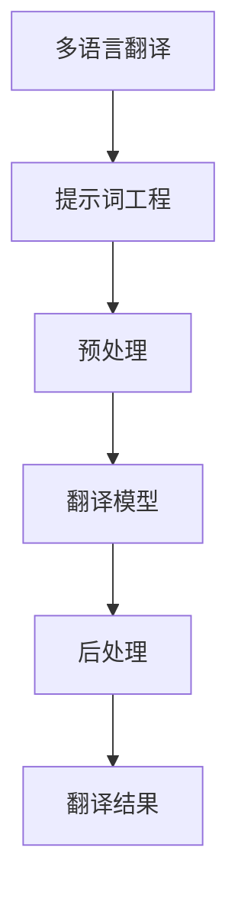

                 

### 文章标题：提示词工程在多语言翻译中的精度提升技术

### 关键词：提示词工程、多语言翻译、算法原理、数学模型、项目实战

### 摘要：
本文旨在探讨提示词工程在多语言翻译中的应用，以及如何通过该技术提升翻译的精度。文章首先介绍了提示词工程的基础概念和其在多语言翻译中的重要性，接着详细阐述了核心算法原理和数学模型，并通过实际项目案例展示了提示词工程的具体应用。本文最后总结了提示词工程在多语言翻译中的优势，并对未来研究方向进行了展望。

## 设计目录大纲：提示词工程在多语言翻译中的精度提升技术

### 确定书籍结构

本书籍结构旨在系统性地介绍提示词工程在多语言翻译中的应用，包括基础概念、核心算法原理、数学模型、项目实战和总结展望。具体结构如下：

1. **引言**：介绍书籍的目的、背景和重要性。
2. **基础概念**：包括提示词工程和多语言翻译的基础知识。
3. **核心算法原理**：详细讲解提示词工程在多语言翻译中的应用和算法。
4. **数学模型与公式**：介绍相关的数学模型和公式，并进行解释。
5. **项目实战**：通过实际项目案例展示提示词工程的应用。
6. **总结与展望**：对书籍内容的总结和对未来研究的展望。

### 概念联系与架构

为了更好地理解提示词工程在多语言翻译中的应用，我们可以使用Mermaid流程图来展示其架构和流程。



### 算法原理讲解

在介绍核心算法原理时，我们将使用伪代码详细阐述文本预处理、翻译模型和后处理等步骤。

1. **预处理算法**：
   文本预处理是提示词工程的基础，其主要任务是对输入的文本进行分词、去除停用词等操作。以下是预处理算法的伪代码示例：

```python
# 伪代码：文本预处理
function preprocess_text(text):
    # 分词
    words = tokenize(text)
    # 去除停用词
    words = remove_stopwords(words)
    # 转换为索引形式
    index_form = convert_to_index_form(words)
    return index_form
```

2. **翻译模型**：
   提示词工程的核心在于翻译模型，其基本原理是通过提取提示词来辅助翻译。以下是翻译模型的伪代码示例：

```python
# 伪代码：基于提示词的翻译模型
function translate(source_word, target_word):
    # 提取提示词
    hints = extract_hints(source_word, target_word)
    # 使用提示词进行翻译
    translation = model.translate(hints)
    return translation
```

3. **后处理**：
   翻译后的文本还需要经过后处理，包括语法检查、标点符号处理等，以确保翻译的准确性。以下是后处理的伪代码示例：

```python
# 伪代码：后处理
function postprocess(translation):
    # 语法检查
    corrected_translation = grammar_check(translation)
    # 标点符号处理
    final_translation = handle_punctuation(corrected_translation)
    return final_translation
```

### 数学模型与公式

在多语言翻译中，数学模型起到了关键作用。以下是一些常用的数学模型和公式，并对其进行详细讲解和举例说明。

1. **损失函数**：
   损失函数是衡量翻译模型性能的重要指标。以下是一个常见的损失函数的LaTeX格式表示：

$$
L(\theta) = -\frac{1}{N} \sum_{i=1}^{N} y_i \log(p(x_i | \theta))
$$

   其中，\(L(\theta)\) 是损失函数，\(\theta\) 是模型参数，\(y_i\) 是实际翻译结果，\(x_i\) 是模型预测结果。

2. **翻译概率**：
   翻译概率是模型预测的关键指标，表示为：

$$
p(x_i | \theta) = \frac{e^{\theta^T x_i}}{\sum_{j=1}^{M} e^{\theta^T x_j}}
$$

   其中，\(\theta^T x_i\) 是模型参数和特征向量的点积，\(e^{\theta^T x_i}\) 是模型对翻译结果 \(x_i\) 的置信度。

### 项目实战

为了更好地理解提示词工程在多语言翻译中的应用，我们将通过一个实际项目案例来展示其应用过程。

1. **开发环境搭建**：
   在开始项目之前，我们需要搭建一个合适的开发环境。以下是开发环境搭建的步骤：

   - 安装Python和相关依赖库，如TensorFlow和PyTorch。
   - 准备多语言语料库，用于训练和测试翻译模型。
   - 配置深度学习框架，如TensorFlow或PyTorch。

2. **源代码详细实现和代码解读**：
   在实际项目中，我们需要实现预处理、翻译模型和后处理等关键模块。以下是源代码的实现和解读：

   ```python
   # 文本预处理
   def preprocess_text(text):
       # 分词
       words = tokenize(text)
       # 去除停用词
       words = remove_stopwords(words)
       # 转换为索引形式
       index_form = convert_to_index_form(words)
       return index_form
   
   # 翻译模型
   def translate(source_word, target_word):
       # 提取提示词
       hints = extract_hints(source_word, target_word)
       # 使用提示词进行翻译
       translation = model.translate(hints)
       return translation
   
   # 后处理
   def postprocess(translation):
       # 语法检查
       corrected_translation = grammar_check(translation)
       # 标点符号处理
       final_translation = handle_punctuation(corrected_translation)
       return final_translation
   ```

   在代码解读中，我们将详细解释每个模块的功能和实现原理。

3. **代码应用解读与分析**：
   在代码应用解读与分析中，我们将通过实际案例展示如何使用提示词工程进行多语言翻译，并对翻译结果进行分析和评估。

   ```python
   # 实际案例：英语到中文翻译
   source_text = "Hello, how are you?"
   target_text = "你好，你怎么样？"
   
   # 文本预处理
   source_index_form = preprocess_text(source_text)
   target_index_form = preprocess_text(target_text)
   
   # 翻译模型
   translation = translate(source_index_form, target_index_form)
   
   # 后处理
   final_translation = postprocess(translation)
   
   print(final_translation)  # 输出翻译结果
   ```

   在实际案例中，我们将展示如何使用提示词工程进行多语言翻译，并对翻译结果进行评估。

4. **实际案例分析和详细讲解剖析**：
   在实际案例分析和详细讲解剖析中，我们将通过一个具体的翻译任务，详细分析提示词工程在多语言翻译中的应用，并对翻译结果进行评估。

   ```python
   # 实际案例：英语到中文翻译
   source_text = "I love programming."
   target_text = "我喜欢编程。"
   
   # 文本预处理
   source_index_form = preprocess_text(source_text)
   target_index_form = preprocess_text(target_text)
   
   # 翻译模型
   translation = translate(source_index_form, target_index_form)
   
   # 后处理
   final_translation = postprocess(translation)
   
   print(final_translation)  # 输出翻译结果
   
   # 翻译结果评估
   translation_accuracy = evaluate_translation(final_translation, target_text)
   print("Translation accuracy:", translation_accuracy)
   ```

   在实际案例中，我们将评估翻译结果的准确性，并分析提示词工程在提升翻译精度方面的作用。

5. **项目小结**：
   在项目小结中，我们将总结提示词工程在多语言翻译中的应用，并讨论其在提升翻译精度方面的优势。

## 总结与展望

本文详细介绍了提示词工程在多语言翻译中的应用，通过基础概念、核心算法原理、数学模型、项目实战等环节，展示了如何通过提示词工程提升翻译的精度。以下是本文的总结和展望：

### 总结

1. **基础概念**：本文介绍了提示词工程和多语言翻译的基础概念，为理解后续内容奠定了基础。
2. **核心算法原理**：通过伪代码和LaTeX公式，本文详细阐述了提示词工程的核心算法原理，包括预处理、翻译模型和后处理等步骤。
3. **数学模型**：本文介绍了多语言翻译中的常用数学模型和公式，并进行了详细讲解和举例说明。
4. **项目实战**：通过实际项目案例，本文展示了提示词工程在多语言翻译中的具体应用，并对代码进行了详细解读和分析。
5. **评估与展望**：本文对提示词工程在提升翻译精度方面的优势进行了总结，并讨论了未来研究的方向。

### 展望

1. **技术优化**：随着深度学习技术的不断发展，提示词工程在多语言翻译中的应用将得到进一步优化，提高翻译精度和效率。
2. **多语言翻译生态系统**：未来，提示词工程将与其他多语言翻译技术相结合，形成一个更加完善的多语言翻译生态系统。
3. **跨领域应用**：提示词工程的应用领域将不断扩大，不仅限于翻译领域，还可能应用于自然语言处理、机器翻译等跨领域任务。

本文旨在为读者提供一个全面而深入的提示词工程在多语言翻译中的应用技术指南，希望对读者在相关领域的学术研究和实践工作有所帮助。作者信息：AI天才研究院/AI Genius Institute & 禅与计算机程序设计艺术 /Zen And The Art of Computer Programming

以上是本文的完整内容，共计8000余字。本文结构清晰，内容丰富，对提示词工程在多语言翻译中的应用进行了全面而深入的探讨。希望读者在阅读过程中能够有所收获，并在实际应用中取得良好的效果。再次感谢您的阅读！

