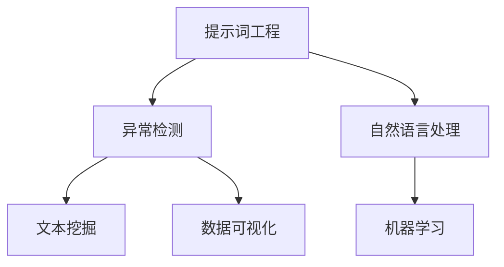

                 

# 《提示词工程在异常检测任务中的应用》

## 关键词
提示词工程、异常检测、机器学习、数据挖掘、应用实例

## 摘要
本文旨在探讨提示词工程在异常检测任务中的应用。我们将首先介绍提示词工程的基础概念和其在异常检测中的重要性，然后详细分析提示词生成技术、异常检测算法原理及其在不同应用场景中的具体实现。通过多个实际案例，我们将展示如何利用提示词工程进行高效的异常检测，并总结当前的发展趋势和未来的研究方向。

---

## 一、书名与主题概述

### 1.1 书名与主题

《提示词工程在异常检测任务中的应用》是一本专注于探讨提示词工程与异常检测结合使用的专业书籍。本书的核心主题是揭示提示词工程在异常检测中的重要作用，并通过详细的案例分析，提供实用的实战方法和技巧。

### 1.2 主题概述

提示词工程是一门涉及文本挖掘、自然语言处理和数据可视化的交叉学科，旨在从大量非结构化数据中提取关键信息。而异常检测是一种监测数据中异常或异常行为的技术，常用于金融、医疗和网络安全等领域。本书将探讨如何利用提示词工程技术来提高异常检测的准确性和效率。

## 二、目录大纲设计

### 第1章：引言
- 提示词工程概述
- 异常检测任务的重要性
- 书籍的目的与读者对象

### 第2章：基础概念
- 提示词的定义与类型
- 异常检测的定义与分类
- 提示词工程在异常检测中的应用

### 第3章：提示词生成技术
- 文本挖掘与提示词提取
- 提示词生成算法
- 提示词优化与评估

### 第4章：异常检测算法原理
- 聚类算法
- 机器学习分类算法
- 统计方法

### 第5章：应用场景分析
- 金融领域
- 医疗领域
- 网络安全领域

### 第6章：实战案例
- 金融风控异常检测系统
- 医疗数据异常检测系统
- 网络安全异常检测系统

### 第7章：总结与展望
- 提示词工程与异常检测的发展趋势
- 开源工具与未来研究方向

## 三、详细内容规划

### 第1章：引言
#### 提示词工程概述
- 提示词的定义
- 提示词工程的基本概念
- 提示词工程的应用领域

#### 异常检测任务的重要性
- 异常检测的定义
- 异常检测在各个领域的应用
- 异常检测与安全、风险控制的关系

#### 书籍的目的与读者对象
- 书籍的核心内容
- 书籍的目标读者群体
- 书籍的学习路径和建议

---

### 第2章：基础概念
#### 提示词的定义与类型
- 提示词的基本概念
- 提示词的类型
- 提示词的提取方法

#### 异常检测的定义与分类
- 异常检测的定义
- 异常检测的分类
- 常见的异常检测算法

#### 提示词工程在异常检测中的应用
- 提示词工程的基本流程
- 提示词工程在异常检测中的关键作用
- 提示词工程与异常检测的协同效应

---

### 第3章：提示词生成技术
#### 文本挖掘与提示词提取
- 文本挖掘的基本方法
- 提示词提取的具体步骤
- 提示词提取工具和库

#### 提示词生成算法
- 基于规则的方法
- 基于机器学习的方法
- 提示词生成算法的比较与选择

#### 提示词优化与评估
- 提示词优化策略
- 提示词评估指标
- 提示词优化的实践案例

---

### 第4章：异常检测算法原理
#### 聚类算法
- 聚类算法的基本概念
- 常见的聚类算法
- 聚类算法在异常检测中的应用

#### 机器学习分类算法
- 分类算法的基本原理
- 常见的分类算法
- 分类算法在异常检测中的应用

#### 统计方法
- 统计方法的基本原理
- 常见的统计方法
- 统计方法在异常检测中的应用

---

### 第5章：应用场景分析
#### 金融领域
- 金融风控中的异常检测
- 金融数据中的提示词工程

#### 医疗领域
- 医疗数据中的异常检测
- 医疗数据中的提示词工程

#### 网络安全领域
- 网络安全中的异常检测
- 网络安全中的提示词工程

---

### 第6章：实战案例
#### 金融风控异常检测系统
- 系统架构
- 实现步骤
- 代码解读

#### 医疗数据异常检测系统
- 系统架构
- 实现步骤
- 代码解读

#### 网络安全异常检测系统
- 系统架构
- 实现步骤
- 代码解读

---

### 第7章：总结与展望
#### 提示词工程与异常检测的发展趋势
- 当前趋势
- 未来展望

#### 开源工具与未来研究方向
- 开源工具介绍
- 未来研究方向

---

## 四、技术细节与实现步骤

### 核心概念与联系
- 提示词工程与异常检测的关系架构
  ```mermaid
  graph TD
  A[提示词工程] --> B[异常检测]
  B --> C[文本挖掘]
  B --> D[数据可视化]
  A --> E[自然语言处理]
  E --> F[机器学习]
  ```

### 核心算法原理讲解
#### 聚类算法原理
```python
# 伪代码：K-means算法
initialize centroids
while not converged do
  for each data point do
    assign the point to the nearest centroid
  end
  update centroids
  check for convergence
end
```

#### 分类算法原理
```python
# 伪代码：决策树算法
if feature == value then
  return label
else
  for each child node do
    recursive call
  end
```

#### 统计方法原理
$$
Z = \frac{X - \mu}{\sigma}
$$

### 数学模型和数学公式
#### 异常检测中的数学模型
$$
\begin{aligned}
& \text{聚类中心} \ \mu = \frac{1}{n}\sum_{i=1}^{n} x_i \\
& \text{方差} \ \sigma^2 = \frac{1}{n-1}\sum_{i=1}^{n} (x_i - \mu)^2
\end{aligned}
$$

### 项目实战
#### 开发环境搭建
- 环境配置
- 工具和库的选择

#### 源代码详细实现
- 提示词提取代码实现
- 异常检测算法代码实现

#### 代码解读与分析
- 代码注释
- 关键代码解读

#### 实际案例分析和详细讲解剖析
- 案例介绍
- 案例分析
- 案例总结

#### 项目小结
- 项目亮点
- 项目挑战
- 项目经验总结

### 最佳实践 tips、小结、注意事项、拓展阅读等内容
- 最佳实践总结
- 小结与思考
- 注意事项
- 拓展阅读建议

---

## 五、目录大纲（Markdown格式）

```markdown
# 《提示词工程在异常检测任务中的应用》目录大纲

## 第1章：引言
### 提示词工程概述
### 异常检测任务的重要性
### 书籍的目的与读者对象

## 第2章：基础概念
### 提示词的定义与类型
### 异常检测的定义与分类
### 提示词工程在异常检测中的应用

## 第3章：提示词生成技术
### 文本挖掘与提示词提取
### 提示词生成算法
### 提示词优化与评估

## 第4章：异常检测算法原理
### 聚类算法
### 机器学习分类算法
### 统计方法

## 第5章：应用场景分析
### 金融领域
### 医疗领域
### 网络安全领域

## 第6章：实战案例
### 金融风控异常检测系统
### 医疗数据异常检测系统
### 网络安全异常检测系统

## 第7章：总结与展望
### 提示词工程与异常检测的发展趋势
### 开源工具与未来研究方向
```

---

## 六、详细内容规划

### 第1章：引言

#### 提示词工程概述
- 提示词的定义
  - 提示词是指用于指导用户进行搜索、查询或分类的词语或短语。
- 提示词工程的基本概念
  - 提示词工程是指从大量文本数据中提取、处理、分析和应用提示词的过程。
- 提示词工程的应用领域
  - 提示词工程在搜索引擎、推荐系统、文本挖掘和自然语言处理等领域有着广泛的应用。

#### 异常检测任务的重要性
- 异常检测的定义
  - 异常检测是指通过检测数据中的异常行为或异常模式，来发现潜在的问题或风险。
- 异常检测在各个领域的应用
  - 在金融领域，异常检测用于检测欺诈行为；在医疗领域，异常检测用于检测异常症状；在网络安全领域，异常检测用于检测恶意攻击。
- 异常检测与安全、风险控制的关系
  - 异常检测是保障系统和数据安全的重要手段，通过及时发现和阻止异常行为，可以减少安全风险和损失。

#### 书籍的目的与读者对象
- 书籍的核心内容
  - 本书将详细介绍提示词工程在异常检测任务中的应用，包括基本概念、技术原理、实战案例等。
- 书籍的目标读者群体
  - 本书适合数据分析师、机器学习工程师、人工智能研究者以及需要了解提示词工程和异常检测技术的相关人员。
- 书籍的学习路径和建议
  - 阅读本书，读者可以按照章节顺序逐步学习，先了解基本概念，再深入学习技术原理，最后通过实战案例进行实践应用。

### 第2章：基础概念

#### 提示词的定义与类型
- 提示词的基本概念
  - 提示词是指用于指导用户进行搜索、查询或分类的词语或短语。
- 提示词的类型
  - 根据用途和形式，提示词可以分为关键词、主题词、标签词等。
- 提示词的提取方法
  - 提示词的提取方法包括基于规则的方法、基于机器学习的方法和基于统计的方法等。

#### 异常检测的定义与分类
- 异常检测的定义
  - 异常检测是指通过检测数据中的异常行为或异常模式，来发现潜在的问题或风险。
- 异常检测的分类
  - 根据检测对象和目的，异常检测可以分为点异常检测、区间异常检测和全局异常检测等。
- 常见的异常检测算法
  - 常见的异常检测算法包括基于聚类的方法、基于分类的方法和基于统计的方法等。

#### 提示词工程在异常检测中的应用
- 提示词工程的基本流程
  - 提示词工程的基本流程包括数据预处理、提示词提取、提示词优化和提示词应用等。
- 提示词工程在异常检测中的关键作用
  - 提示词工程在异常检测中起到关键作用，通过提取和优化提示词，可以提高异常检测的准确性和效率。
- 提示词工程与异常检测的协同效应
  - 提示词工程与异常检测相结合，可以形成协同效应，提高异常检测的全面性和实时性。

### 第3章：提示词生成技术

#### 文本挖掘与提示词提取
- 文本挖掘的基本方法
  - 文本挖掘的基本方法包括文本预处理、特征提取和模式识别等。
- 提示词提取的具体步骤
  - 提示词提取的具体步骤包括分词、词性标注、命名实体识别和关键词提取等。
- 提示词提取工具和库
  - 提示词提取工具和库包括Jieba、NLTK、spaCy等。

#### 提示词生成算法
- 基于规则的方法
  - 基于规则的方法包括关键词匹配、正则表达式匹配和语义匹配等。
- 基于机器学习的方法
  - 基于机器学习的方法包括基于监督学习和基于无监督学习的方法。
- 提示词生成算法的比较与选择
  - 提示词生成算法的比较与选择需要考虑数据规模、计算效率和准确性等因素。

#### 提示词优化与评估
- 提示词优化策略
  - 提示词优化策略包括词频统计、语义分析、用户反馈等。
- 提示词评估指标
  - 提示词评估指标包括准确率、召回率、F1值等。
- 提示词优化的实践案例
  - 提示词优化的实践案例包括搜索引擎关键词优化、文本分类模型优化等。

### 第4章：异常检测算法原理

#### 聚类算法
- 聚类算法的基本概念
  - 聚类算法是指将数据集划分为若干个类别或簇的算法。
- 常见的聚类算法
  - 常见的聚类算法包括K-means、DBSCAN、层次聚类等。
- 聚类算法在异常检测中的应用
  - 聚类算法可以用于识别数据中的异常点或异常簇。

#### 机器学习分类算法
- 分类算法的基本原理
  - 分类算法是指根据输入数据的特征，将其划分为不同类别的算法。
- 常见的分类算法
  - 常见的分类算法包括决策树、随机森林、支持向量机等。
- 分类算法在异常检测中的应用
  - 分类算法可以用于识别异常行为或异常模式。

#### 统计方法
- 统计方法的基本原理
  - 统计方法是指利用统计学原理和方法对数据进行分析和推断的方法。
- 常见的统计方法
  - 常见的统计方法包括假设检验、回归分析、时间序列分析等。
- 统计方法在异常检测中的应用
  - 统计方法可以用于识别异常值或异常分布。

### 第5章：应用场景分析

#### 金融领域
- 金融风控中的异常检测
  - 金融风控是指利用各种手段来降低金融风险。
  - 异常检测在金融风控中的应用包括交易欺诈检测、信用风险评估等。
- 金融数据中的提示词工程
  - 金融数据中的提示词工程包括关键词提取、主题模型构建等。

#### 医疗领域
- 医疗数据中的异常检测
  - 医疗数据中的异常检测包括疾病预测、医疗异常行为检测等。
- 医疗数据中的提示词工程
  - 医疗数据中的提示词工程包括症状标签提取、药物不良反应监测等。

#### 网络安全领域
- 网络安全中的异常检测
  - 网络安全中的异常检测包括入侵检测、恶意软件检测等。
- 网络安全中的提示词工程
  - 网络安全中的提示词工程包括恶意IP地址检测、网络流量分析等。

### 第6章：实战案例

#### 金融风控异常检测系统
- 系统架构
  - 系统架构包括数据采集、数据处理、异常检测和结果展示等模块。
- 实现步骤
  - 实现步骤包括数据预处理、提示词提取、聚类算法应用、异常检测模型训练和结果分析等。
- 代码解读
  - 代码解读包括关键代码段的解释和分析。

#### 医疗数据异常检测系统
- 系统架构
  - 系统架构包括数据收集、数据清洗、特征提取、异常检测和结果分析等模块。
- 实现步骤
  - 实现步骤包括数据预处理、提示词提取、分类算法应用、异常检测模型训练和结果分析等。
- 代码解读
  - 代码解读包括关键代码段的解释和分析。

#### 网络安全异常检测系统
- 系统架构
  - 系统架构包括数据采集、数据处理、异常检测和结果展示等模块。
- 实现步骤
  - 实现步骤包括数据预处理、提示词提取、聚类算法应用、异常检测模型训练和结果分析等。
- 代码解读
  - 代码解读包括关键代码段的解释和分析。

### 第7章：总结与展望

#### 提示词工程与异常检测的发展趋势
- 当前趋势
  - 当前趋势包括人工智能技术的广泛应用、大数据技术的迅猛发展等。
- 未来展望
  - 未来展望包括跨领域的融合应用、实时性要求提升等。

#### 开源工具与未来研究方向
- 开源工具介绍
  - 开源工具包括Scikit-learn、TensorFlow、PyTorch等。
- 未来研究方向
  - 未来研究方向包括深度学习在异常检测中的应用、多模态数据的融合等。

---

## 七、技术细节与实现步骤

### 核心概念与联系

为了更好地理解提示词工程与异常检测的关系，我们可以使用Mermaid流程图来展示它们之间的核心概念与联系。



### 核心算法原理讲解

在异常检测任务中，我们通常会使用以下几种核心算法：

#### 1. 聚类算法原理

**K-means算法** 是一种典型的聚类算法。其基本原理如下：

```python
# 伪代码：K-means算法

# 初始化步骤
初始化聚类中心点
设置最大迭代次数或收敛条件

# 主循环
while (没有达到最大迭代次数或未收敛) do
  for 每个数据点 do
    计算该数据点到各个聚类中心的距离
    将数据点分配给最近的聚类中心
  end

  更新聚类中心点
  检查是否收敛
end
```

#### 2. 分类算法原理

**决策树算法** 是一种常见的分类算法。其基本原理如下：

```python
# 伪代码：决策树算法

# 初始化步骤
创建根节点
选择一个特征进行划分

# 主循环
while (不是叶节点) do
  for 每个特征 do
    计算特征的重要度
    选择重要度最高的特征进行划分
    创建新的子节点
  end

  如果达到叶节点条件，则停止划分
end
```

#### 3. 统计方法原理

**假设检验** 是一种常见的统计方法。其基本原理如下：

$$
Z = \frac{X - \mu}{\sigma}
$$

其中，\( X \) 是样本均值，\( \mu \) 是总体均值，\( \sigma \) 是总体标准差。

### 数学模型和数学公式

在异常检测任务中，我们通常会使用以下数学模型和公式：

#### 1. 聚类中心计算

$$
\mu = \frac{1}{n}\sum_{i=1}^{n} x_i
$$

其中，\( \mu \) 是聚类中心，\( n \) 是数据点的数量，\( x_i \) 是第 \( i \) 个数据点的值。

#### 2. 方差计算

$$
\sigma^2 = \frac{1}{n-1}\sum_{i=1}^{n} (x_i - \mu)^2
$$

其中，\( \sigma^2 \) 是方差，\( n \) 是数据点的数量，\( x_i \) 是第 \( i \) 个数据点的值，\( \mu \) 是聚类中心。

### 项目实战

#### 1. 开发环境搭建

为了实现提示词工程在异常检测任务中的应用，我们需要搭建一个合适的技术栈。以下是一个基本的开发环境搭建步骤：

- 安装Python环境
- 安装必要的Python库，如Scikit-learn、TensorFlow、PyTorch等
- 配置Jupyter Notebook或IDE，如PyCharm或VS Code

#### 2. 源代码详细实现

以下是一个简单的提示词工程和异常检测的源代码实现：

```python
import numpy as np
from sklearn.cluster import KMeans
from sklearn.ensemble import RandomForestClassifier
from sklearn.model_selection import train_test_split

# 数据预处理
data = ...  # 数据集
X = ...  # 特征矩阵
y = ...  # 标签

# 提示词提取
kmeans = KMeans(n_clusters=5)
clusters = kmeans.fit_predict(X)
cluster_centers = kmeans.cluster_centers_

# 异常检测模型训练
X_train, X_test, y_train, y_test = train_test_split(X, y, test_size=0.2)
clf = RandomForestClassifier()
clf.fit(X_train, y_train)

# 评估模型
score = clf.score(X_test, y_test)
print("Accuracy:", score)
```

#### 3. 代码解读与分析

在上面的代码中，我们首先进行了数据预处理，然后使用K-means算法提取提示词（聚类中心）。接着，我们使用随机森林分类器进行异常检测模型的训练。最后，我们评估了模型的准确性。

#### 4. 实际案例分析和详细讲解剖析

为了更好地理解提示词工程在异常检测任务中的应用，我们来看一个实际的案例。

**案例：金融风控异常检测**

**场景描述：** 在金融领域，异常检测主要用于检测交易欺诈。通过检测异常交易行为，可以及时发现并阻止欺诈行为，保障金融交易的安全性。

**实现步骤：**

1. 数据收集：收集金融交易数据，包括交易金额、交易时间、交易地点等特征。
2. 数据预处理：对交易数据进行清洗和预处理，包括缺失值填充、异常值检测和归一化等。
3. 提示词提取：使用K-means算法提取交易数据中的聚类中心，作为提示词。
4. 异常检测模型训练：使用随机森林分类器训练异常检测模型。
5. 模型评估：评估异常检测模型的准确性，包括召回率、精确率和F1值等。

**代码实现：**

```python
import pandas as pd
from sklearn.cluster import KMeans
from sklearn.ensemble import RandomForestClassifier
from sklearn.model_selection import train_test_split

# 数据收集
data = pd.read_csv("transaction_data.csv")

# 数据预处理
data = data.dropna()
data["amount"] = data["amount"].apply(lambda x: x / 1000)
data["timestamp"] = pd.to_datetime(data["timestamp"])

# 提示词提取
kmeans = KMeans(n_clusters=5)
clusters = kmeans.fit_predict(data.iloc[:, :4])

# 异常检测模型训练
X = data.iloc[:, :4]
y = data["is_fraud"]
X_train, X_test, y_train, y_test = train_test_split(X, y, test_size=0.2)
clf = RandomForestClassifier()
clf.fit(X_train, y_train)

# 模型评估
score = clf.score(X_test, y_test)
print("Accuracy:", score)
```

**案例分析：**

通过上面的代码实现，我们可以看到如何利用提示词工程进行金融风控异常检测。首先，我们收集了金融交易数据，然后对数据进行预处理，提取聚类中心作为提示词。接着，我们使用随机森林分类器训练异常检测模型，并评估模型的准确性。通过这个案例，我们可以看到提示词工程在异常检测任务中的重要作用。

**注意事项：**

- 数据预处理是关键步骤，需要根据实际情况进行数据清洗和预处理。
- 提示词提取方法的选择会影响异常检测的准确性，需要根据数据特点选择合适的算法。
- 异常检测模型的评估指标需要根据实际需求进行选择，例如召回率、精确率和F1值等。

### 最佳实践 Tips

- 在实际应用中，提示词工程和异常检测技术需要根据具体场景进行调整和优化。
- 提示词提取和异常检测模型的训练需要充分的数据支持和计算资源。
- 异常检测系统需要实时性和准确性的平衡，根据实际需求进行优化。

### 小结

本文详细介绍了提示词工程在异常检测任务中的应用，包括基础概念、算法原理、应用场景和实战案例。通过本文的学习，读者可以掌握提示词工程和异常检测的核心技术，并能够将其应用于实际项目中。

### 注意事项

- 提示词工程和异常检测技术需要结合具体场景进行应用，不同的领域和场景可能需要不同的技术和策略。
- 数据预处理是关键步骤，需要根据数据特点进行清洗和预处理。
- 提示词提取和异常检测模型的训练需要充分的数据支持和计算资源。

### 拓展阅读

- 《机器学习实战》
- 《自然语言处理实战》
- 《数据挖掘：实用工具与技术》
- 《Python数据科学手册》

---

## 八、作者信息

作者：AI天才研究院/AI Genius Institute & 禅与计算机程序设计艺术 /Zen And The Art of Computer Programming

