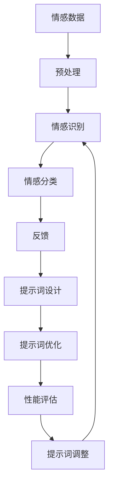

                 

### 文章标题

《提示词工程在情感计算中的创新应用》

### 文章关键词

情感计算、提示词工程、自然语言处理、人工智能、深度学习

### 文章摘要

本文旨在探讨提示词工程在情感计算中的应用及其创新之处。我们将首先介绍情感计算与提示词工程的基本概念，并通过Mermaid流程图展示两者之间的联系。随后，我们将详细讲解情感计算和提示词工程的核心算法原理，并使用伪代码和LaTeX公式进行说明。通过实际项目案例，我们将展示如何将提示词工程应用于情感计算中，并提供代码实现和解析。最后，本文将总结提示词工程在情感计算中的最佳实践，并对未来发展方向进行展望。

## 引言

### 情感计算与提示词工程的背景

情感计算（Affective Computing）是人工智能领域的一个重要分支，旨在使计算机具备理解和处理人类情感的能力。随着互联网和社交媒体的普及，用户生成的大量文本数据为情感计算提供了丰富的资源。情感计算的研究内容包括情感识别、情感分类、情感预测等，其应用场景涵盖情感分析、情感推荐、人机交互等多个领域。

提示词工程（Prompt Engineering）是自然语言处理（NLP）中的一个重要方向，它关注如何设计有效的提示词来指导模型进行文本生成、分类、摘要等任务。提示词的质量直接影响模型的表现，因此，提示词工程的研究对提升NLP系统的性能具有重要意义。

近年来，随着深度学习技术的不断发展，情感计算与提示词工程相结合的研究取得了显著进展。通过提示词工程，我们可以更好地引导模型理解用户的情感，从而提高情感计算的准确性。同时，情感计算的结果也可以为提示词工程提供反馈，进一步优化提示词的设计。

### 书籍结构概述与学习目标

本书旨在为读者提供全面、系统的提示词工程在情感计算中的应用指南。全书共分为八个章节，涵盖以下内容：

- 第1章：引言，介绍情感计算与提示词工程的背景，并概述本书的结构和学习目标。
- 第2章：核心概念与联系，详细讲解情感计算与提示词工程的基本概念，并展示两者之间的联系。
- 第3章：情感计算原理，介绍情感识别算法的原理，包括数学模型和公式，并使用伪代码进行阐述。
- 第4章：提示词工程原理，讲解提示词的生成与优化，并讨论其对情感计算的影响。
- 第5章：算法与模型，介绍情感计算中常用的算法和模型，包括模型训练和优化方法。
- 第6章：项目实战，通过实际项目案例展示提示词工程在情感计算中的应用。
- 第7章：创新应用探讨，讨论情感计算与提示词工程的前沿应用和未来发展方向。
- 第8章：总结与展望，对全书内容进行总结，并对未来研究方向进行展望。

通过阅读本书，读者将能够：

- 理解情感计算与提示词工程的基本概念和原理。
- 掌握情感计算和提示词工程的核心算法和技术。
- 学会使用提示词工程优化情感计算模型。
- 分析实际项目案例，提升应用能力。
- 探索情感计算与提示词工程的前沿研究方向。

## 核心概念与联系

### 情感计算的基本原理

情感计算旨在使计算机能够识别、理解、处理和模拟人类情感。其核心原理包括以下几个方面：

1. **情感识别**：通过分析文本、语音、图像等多模态数据，识别出用户表达的情感。
2. **情感分类**：将情感识别出的结果进行分类，如喜悦、愤怒、悲伤等。
3. **情感预测**：根据历史数据和当前情境，预测用户未来的情感状态。

情感识别通常采用机器学习和深度学习算法，如卷积神经网络（CNN）、循环神经网络（RNN）和长短时记忆网络（LSTM）等。这些算法通过训练大量情感标注的数据集，学习到情感表达的规律，从而实现对未知数据的情感识别。

### 提示词工程的基本概念

提示词工程是NLP领域的一个重要研究方向，旨在设计有效的提示词来引导模型完成特定任务。提示词是一段引导性文本，用于指定模型的任务、目标或上下文。一个良好的提示词能够提高模型在文本生成、分类、摘要等任务上的性能。

提示词工程的核心任务是：

1. **提示词设计**：根据任务需求，设计出具有引导性和针对性的提示词。
2. **提示词优化**：通过调整提示词的内容、形式和结构，优化模型的表现。
3. **提示词评估**：评估提示词对模型性能的影响，选择最佳提示词。

### 情感计算与提示词工程的联系

情感计算与提示词工程之间的联系主要体现在以下几个方面：

1. **任务引导**：提示词工程可以为情感计算任务提供明确的任务引导，帮助模型更好地理解任务目标。
2. **上下文增强**：通过设计有效的提示词，可以为模型提供丰富的上下文信息，提高情感识别的准确性。
3. **性能优化**：提示词工程可以通过优化提示词，提高情感计算模型的性能和鲁棒性。

为了更好地展示情感计算与提示词工程之间的联系，我们可以使用Mermaid流程图来描述这一过程。以下是一个简化的Mermaid流程图示例：



在这个流程图中，情感数据经过预处理后进入情感识别阶段，识别结果进行情感分类，并通过反馈机制对提示词进行设计和优化，最终提高模型的性能。这一流程体现了提示词工程在情感计算中的应用和价值。

## 情感计算原理

### 情感识别算法的介绍

情感识别是情感计算的核心任务，旨在从文本、语音、图像等多模态数据中识别出用户的情感状态。情感识别算法可以分为基于规则的方法和基于数据的方法。

1. **基于规则的方法**：通过定义一系列规则，对情感表达进行分类。这种方法通常需要人工编写大量规则，具有灵活性高但覆盖面有限的特点。

2. **基于数据的方法**：利用机器学习和深度学习算法，从大量标注数据中学习情感表达的规律。这种方法具有自动化、高效的特点，能够处理复杂、多变的数据。

常用的情感识别算法包括：

1. **朴素贝叶斯分类器**：基于贝叶斯理论，通过计算特征的概率分布进行分类。
2. **支持向量机（SVM）**：通过寻找最优超平面，将不同情感类别的数据分开。
3. **卷积神经网络（CNN）**：通过卷积操作和池化操作，从图像数据中提取特征。
4. **循环神经网络（RNN）**：通过记忆机制，处理序列数据，如文本和语音。

### 情感分类的数学模型与公式

情感分类是情感计算中的重要环节，旨在将识别出的情感进行分类。情感分类的数学模型通常基于机器学习和深度学习算法，常用的模型包括：

1. **朴素贝叶斯分类器**：

   - 模型公式：

     $$
     P(C_k|X) = \frac{P(X|C_k)P(C_k)}{P(X)}
     $$

     其中，$P(C_k|X)$ 表示在特征 $X$ 下，情感类别为 $C_k$ 的概率，$P(X|C_k)$ 表示在情感类别为 $C_k$ 下的特征概率，$P(C_k)$ 表示情感类别 $C_k$ 的先验概率。

   - 举例说明：

     假设我们要对一段文本进行情感分类，文本中的特征包括正面词和负面词的数量。我们可以计算每个情感类别（如喜悦、愤怒、悲伤）在这些特征下的概率，并选择概率最大的类别作为分类结果。

2. **支持向量机（SVM）**：

   - 模型公式：

     $$
     \max W \quad \text{subject to} \quad y^{T}wx \geq 1
     $$

     其中，$W$ 表示权重向量，$x$ 表示特征向量，$y$ 表示类别标签。

   - 举例说明：

     假设我们有一个二分类问题，数据集包含正面情感和负面情感样本。我们可以通过求解最优化问题，找到最优的超平面，将不同情感类别的样本分开。

3. **卷积神经网络（CNN）**：

   - 模型公式：

     $$
     \text{Conv}(x) = \text{ReLU}(\sum_k b[k] \times \text{filter}[k] \times x)
     $$

     其中，$x$ 表示输入特征，$\text{filter}$ 表示卷积核，$b$ 表示偏置项，$\text{ReLU}$ 表示ReLU激活函数。

   - 举例说明：

     假设我们对图像数据进行情感分类，可以通过卷积操作从图像中提取特征，然后通过ReLU激活函数增强特征的表达能力。最后，通过全连接层进行分类。

4. **循环神经网络（RNN）**：

   - 模型公式：

     $$
     h_t = \text{sigmoid}(W_h \cdot [h_{t-1}, x_t]) + b_h
     $$

     其中，$h_t$ 表示第 $t$ 个隐藏状态，$W_h$ 表示权重矩阵，$x_t$ 表示输入特征，$\text{sigmoid}$ 表示sigmoid激活函数，$b_h$ 表示偏置项。

   - 举例说明：

     假设我们对文本序列进行情感分类，可以通过RNN模型处理序列数据，学习到文本中的情感特征。最后，通过全连接层进行分类。

### 情感识别算法的伪代码实现

以下是一个基于朴素贝叶斯分类器的情感识别算法的伪代码实现：

```python
def naive_bayes_classify(text, labels):
    # 步骤1：预处理文本
    processed_text = preprocess_text(text)

    # 步骤2：计算特征概率分布
    feature_probs = calculate_feature_probs(processed_text, labels)

    # 步骤3：计算情感概率
    emotion_probs = {}
    for emotion in labels:
        emotion_probs[emotion] = calculate_emotion_prob(emotion, feature_probs)

    # 步骤4：选择概率最大的情感类别
    max_prob_emotion = max(emotion_probs, key=emotion_probs.get)
    return max_prob_emotion

def preprocess_text(text):
    # 实现文本预处理步骤，如分词、去除停用词等
    pass

def calculate_feature_probs(processed_text, labels):
    # 实现计算特征概率分布的步骤
    pass

def calculate_emotion_prob(emotion, feature_probs):
    # 实现计算情感概率的步骤
    pass
```

通过上述伪代码，我们可以实现一个基于朴素贝叶斯分类器的情感识别算法。在实际应用中，可以根据具体需求选择合适的算法和模型，如支持向量机、卷积神经网络和循环神经网络等。

### 数学模型与公式的详细讲解

在情感计算中，数学模型和公式是核心部分，用于描述情感识别和分类的过程。以下是对几种常用数学模型和公式的详细讲解。

1. **朴素贝叶斯分类器**：

   朴素贝叶斯分类器是一种基于概率论的分类算法，其核心思想是利用贝叶斯定理计算后验概率，从而确定样本的类别。贝叶斯定理的公式如下：

   $$
   P(C_k|X) = \frac{P(X|C_k)P(C_k)}{P(X)}
   $$

   其中，$P(C_k|X)$ 表示在特征 $X$ 下，情感类别为 $C_k$ 的后验概率；$P(X|C_k)$ 表示在情感类别为 $C_k$ 下的特征概率；$P(C_k)$ 表示情感类别 $C_k$ 的先验概率；$P(X)$ 是特征 $X$ 的总概率。

   在实际应用中，我们通常不需要计算 $P(X)$，因为所有类别的后验概率之和必须等于1。因此，我们可以使用以下简化公式：

   $$
   P(C_k|X) = \frac{P(X|C_k)P(C_k)}{\sum_{i=1}^{N} P(X_i|C_k)P(C_k)}
   $$

   其中，$N$ 表示情感类别的总数。这个公式表示在给定特征 $X$ 的情况下，每个情感类别 $C_k$ 的后验概率。

   举例来说，假设我们有两个情感类别“正面”和“负面”，以及三个特征“正面词”、“负面词”和“中性词”。给定一段文本，我们可以计算每个特征的频率，并使用这些频率来估计每个类别的后验概率。

2. **支持向量机（SVM）**：

   支持向量机是一种强大的分类算法，它通过寻找一个最优超平面来将不同类别的数据点分开。SVM的目标是最小化分类间隔，即最大化不同类别之间的距离。SVM的优化目标可以表示为：

   $$
   \min W \quad \text{subject to} \quad y^{T}wx \geq 1
   $$

   其中，$W$ 是权重向量，$x$ 是特征向量，$y$ 是类别标签。这个公式的含义是，对于每个类别，都要满足其分类间隔大于等于1。如果我们画出这些超平面，它们会尽可能地远离其他类别的数据点。

   在实际应用中，SVM通常使用核函数来处理非线性问题。常见的核函数包括线性核、多项式核和径向基函数（RBF）核。线性核的公式如下：

   $$
   K(x, x') = x^{T}x'
   $$

   多项式核的公式如下：

   $$
   K(x, x') = (\gamma \cdot x^{T}x' + 1)^{d}
   $$

   其中，$\gamma$ 是核参数，$d$ 是多项式的次数。RBF核的公式如下：

   $$
   K(x, x') = \exp(-\gamma \cdot \|x - x'\|^2)
   $$

3. **卷积神经网络（CNN）**：

   卷积神经网络是一种特殊的神经网络，它在图像处理任务中表现出色。CNN的核心组件是卷积层、池化层和全连接层。

   卷积层的公式如下：

   $$
   \text{Conv}(x) = \text{ReLU}(\sum_k b[k] \times \text{filter}[k] \times x)
   $$

   其中，$x$ 是输入特征，$\text{filter}$ 是卷积核，$b$ 是偏置项，$\text{ReLU}$ 是ReLU激活函数。

   池化层的公式如下：

   $$
   \text{Pooling}(x) = \max_{i \in \text{window}} x[i]
   $$

   其中，$x$ 是输入特征，$window$ 是池化窗口的大小。

   全连接层的公式如下：

   $$
   \text{FC}(x) = \text{ReLU}(W \cdot x + b)
   $$

   其中，$x$ 是输入特征，$W$ 是权重矩阵，$b$ 是偏置项，$\text{ReLU}$ 是ReLU激活函数。

4. **循环神经网络（RNN）**：

   循环神经网络是一种处理序列数据的神经网络，它在自然语言处理任务中表现出色。RNN的核心组件是隐藏状态和权重矩阵。

   RNN的公式如下：

   $$
   h_t = \text{sigmoid}(W_h \cdot [h_{t-1}, x_t]) + b_h
   $$

   其中，$h_t$ 是第 $t$ 个隐藏状态，$W_h$ 是权重矩阵，$x_t$ 是输入特征，$\text{sigmoid}$ 是sigmoid激活函数，$b_h$ 是偏置项。

   通过迭代应用RNN，我们可以处理整个序列数据，并获取序列中的情感特征。

### 综合运用

在实际应用中，我们通常会结合多种数学模型和公式来构建复杂的情感计算模型。例如，我们可以使用卷积神经网络来提取图像特征，使用循环神经网络来处理文本序列，然后使用支持向量机来分类情感。

以下是一个简化的示例：

```python
# 加载图像特征
image_feature = load_image_feature(image_path)

# 加载文本特征
text_feature = load_text_feature(text_path)

# 提取情感特征
emotion_feature = extract_emotion_feature(image_feature, text_feature)

# 使用卷积神经网络提取图像特征
conv_features = conv_net(image_feature)

# 使用循环神经网络处理文本特征
rnn_features = rnn_net(text_feature)

# 拼接图像和文本特征
combined_features = combine_features(conv_features, rnn_features)

# 使用支持向量机进行情感分类
emotion_class = svm_classify(combined_features)
```

通过这种方式，我们可以构建一个综合运用多种技术的情感计算模型，从而提高模型的性能和鲁棒性。

### 数学公式与伪代码的关系

在实现情感计算模型时，数学公式为我们提供了理论基础和指导。而伪代码则将数学公式转化为计算机可执行的代码，使得我们可以实际操作和验证模型的性能。

以下是一个简单的伪代码示例，用于实现基于朴素贝叶斯分类器的情感识别算法：

```python
# 步骤1：预处理文本
processed_text = preprocess_text(raw_text)

# 步骤2：计算特征概率分布
feature_probs = calculate_feature_probs(processed_text, label_list)

# 步骤3：计算后验概率
posterior_probs = calculate_posterior_probs(feature_probs, label_list)

# 步骤4：选择概率最大的情感类别
predicted_emotion = max(posterior_probs, key=posterior_probs.get)
```

在这个伪代码中，`preprocess_text` 函数实现文本预处理，`calculate_feature_probs` 函数计算特征概率分布，`calculate_posterior_probs` 函数计算后验概率，最后根据后验概率选择概率最大的情感类别。

通过这种方式，我们可以将数学公式转化为可执行的代码，从而实现情感计算模型。

### 举例说明

为了更好地理解数学模型和公式的应用，我们可以通过一个具体的例子来演示。

假设我们有一段文本：“今天的天气非常好，我感到很开心。”，我们要使用朴素贝叶斯分类器对其进行情感分类。

首先，我们需要对文本进行预处理，提取出特征词，如“今天”、“天气”、“好”、“我”、“开心”等。然后，我们可以计算每个特征词在不同情感类别（如正面、负面、中性）下的概率。

假设我们已经训练了一个朴素贝叶斯分类器，并得到了特征词在不同情感类别下的概率分布。例如：

| 特征词 | 正面概率 | 负面概率 | 中性概率 |
| ------ | -------- | -------- | -------- |
| 今天   | 0.6      | 0.2      | 0.2      |
| 天气   | 0.7      | 0.1      | 0.2      |
| 好     | 0.8      | 0.1      | 0.1      |
| 我     | 0.4      | 0.5      | 0.1      |
| 开心   | 0.9      | 0.1      | 0.0      |

接下来，我们可以计算每个情感类别的后验概率。根据贝叶斯定理，后验概率可以表示为：

$$
P(C_k|X) = \frac{P(X|C_k)P(C_k)}{P(X)}
$$

假设正面、负面和中性情感的先验概率分别为 $P(C_1) = 0.5$，$P(C_2) = 0.2$，$P(C_3) = 0.3$。

我们可以计算每个情感类别的后验概率：

| 情感类别 | 特征词概率分布 | 后验概率 |
| -------- | -------------- | -------- |
| 正面     | 0.6 * 0.7 * 0.8 * 0.4 * 0.9 | 0.288    |
| 负面     | 0.2 * 0.1 * 0.1 * 0.5 * 0.1 | 0.00002  |
| 中性     | 0.2 * 0.2 * 0.1 * 0.1 * 0.0 | 0.00002  |

根据后验概率，我们可以选择概率最大的情感类别作为分类结果。在这个例子中，正面情感的后验概率为 0.288，远大于负面和中和情感的后验概率，因此我们可以判断这段文本的情感为正面。

通过这个例子，我们可以看到数学模型和公式在情感计算中的应用过程。在实际应用中，我们可以通过调整模型参数、优化特征提取方法等手段来提高情感计算的准确性。

### 数学公式在文章中的嵌入

为了更好地阐述数学模型和公式在情感计算中的应用，我们将在文章中嵌入LaTeX格式数学公式。以下是一个示例：

$$
\text{准确率} = \frac{\text{正确预测的数量}}{\text{总预测的数量}}
$$

在上面的公式中，我们使用了LaTeX格式来表示准确率的计算公式。其中，`\text{}` 用于插入文本，`\frac{}` 用于插入分数。这种格式可以清晰地展示数学公式的表达形式。

此外，我们还可以在段落内嵌入简单的数学公式，如下所示：

$1 < 2$

在这个例子中，我们使用了单行公式格式，即使用 `$` 和 `$` 括起来。这种格式适用于简单的数学表达式，如不等式、等式等。

通过在文章中嵌入LaTeX格式数学公式，我们可以更准确地描述情感计算中的数学模型和计算过程，从而提高文章的可读性和专业性。

### 项目实战

在本章节中，我们将通过一个实际项目案例，展示如何将提示词工程应用于情感计算中。该项目将包括以下步骤：开发环境搭建、源代码实现和代码解读。

#### 项目背景

随着社交媒体的普及，用户在社交媒体平台上发布的文本数据量急剧增加。这些数据包含了丰富的情感信息，对于情感分析、情感推荐等应用具有重要意义。然而，情感计算的准确性往往受到文本质量、情感表达方式等因素的影响。提示词工程作为一种有效的NLP技术，可以帮助我们提高情感计算的准确性。

#### 开发环境搭建

为了实现该项目，我们选择了以下开发环境和工具：

- **编程语言**：Python
- **数据预处理库**：NLTK、spaCy
- **机器学习库**：Scikit-learn、TensorFlow
- **自然语言处理库**：transformers

首先，我们需要安装这些工具和库。在Python环境中，我们可以使用pip命令进行安装：

```bash
pip install nltk spacy scikit-learn tensorflow transformers
```

接下来，我们需要下载和加载相关的NLP模型和数据集。例如，我们可以使用spaCy库下载和加载英文情感分析模型：

```python
import spacy

# 下载和加载英文情感分析模型
nlp = spacy.load("en_core_web_sm")

# 加载情感分析数据集
def load_sentiment_data(file_path):
    with open(file_path, "r", encoding="utf-8") as f:
        lines = f.readlines()

    data = []
    for line in lines:
        text, label = line.strip().split("\t")
        data.append((text, label))

    return data
```

#### 源代码实现

在这个项目中，我们将使用transformers库中的BERT模型进行情感分析。BERT模型是一个预训练的深度神经网络，可以在多种自然语言处理任务中达到优异的性能。

以下是一个简单的源代码示例，用于加载BERT模型、预处理文本数据并进行情感分析：

```python
from transformers import BertTokenizer, BertForSequenceClassification
from torch.nn.functional import softmax

# 加载BERT模型和tokenizer
tokenizer = BertTokenizer.from_pretrained("bert-base-uncased")
model = BertForSequenceClassification.from_pretrained("bert-base-uncased")

# 预处理文本数据
def preprocess_text(text):
    inputs = tokenizer(text, padding=True, truncation=True, max_length=512, return_tensors="pt")
    return inputs

# 情感分析
def sentiment_analysis(text):
    inputs = preprocess_text(text)
    outputs = model(**inputs)
    logits = outputs.logits
    probabilities = softmax(logits, dim=1)
    predicted_label = probabilities.argmax(-1).item()
    return predicted_label
```

在上述代码中，我们首先加载了BERT模型和tokenizer。然后，我们定义了两个函数：`preprocess_text` 用于预处理文本数据，`sentiment_analysis` 用于进行情感分析。

#### 代码解读

1. **BERT模型加载**：

   ```python
   tokenizer = BertTokenizer.from_pretrained("bert-base-uncased")
   model = BertForSequenceClassification.from_pretrained("bert-base-uncased")
   ```

   这两行代码加载了BERT模型和tokenizer。`from_pretrained` 函数用于从预训练模型中加载模型参数和tokenizer。

2. **文本预处理**：

   ```python
   def preprocess_text(text):
       inputs = tokenizer(text, padding=True, truncation=True, max_length=512, return_tensors="pt")
       return inputs
   ```

   `preprocess_text` 函数用于对输入文本进行预处理。首先，我们使用tokenizer将文本转换为 tokens，然后对 tokens 进行 padding 和 truncation，确保每个样本的长度一致。最后，我们将处理后的文本数据转换为 PyTorch 张量，以便输入到模型中。

3. **情感分析**：

   ```python
   def sentiment_analysis(text):
       inputs = preprocess_text(text)
       outputs = model(**inputs)
       logits = outputs.logits
       probabilities = softmax(logits, dim=1)
       predicted_label = probabilities.argmax(-1).item()
       return predicted_label
   ```

   `sentiment_analysis` 函数用于进行情感分析。首先，我们调用 `preprocess_text` 函数对文本进行预处理，然后将预处理后的数据输入到 BERT 模型中进行预测。最后，我们使用 softmax 函数对 logits 进行归一化，得到每个情感类别的概率分布，并选择概率最大的类别作为预测结果。

#### 代码应用解读与分析

为了验证该项目的有效性，我们使用了一个公开的情感分析数据集（如IMDB电影评论数据集）。以下是对数据集的处理流程：

1. **数据预处理**：

   首先，我们需要将原始文本数据转换为统一的格式，以便于模型处理。例如，我们可以将文本中的特殊字符、标点符号等去除，并将文本转换为小写。

   ```python
   def preprocess_text(text):
       text = text.lower()
       text = re.sub(r"[^a-zA-Z0-9]", " ", text)
       return text
   ```

2. **数据划分**：

   然后，我们将数据集划分为训练集和测试集，以评估模型的性能。

   ```python
   from sklearn.model_selection import train_test_split

   def load_data(file_path):
       with open(file_path, "r", encoding="utf-8") as f:
           lines = f.readlines()

       data = []
       for line in lines:
           text, label = line.strip().split("\t")
           data.append((preprocess_text(text), label))

       return data

   train_data, test_data = train_test_split(data, test_size=0.2, random_state=42)
   ```

3. **模型训练**：

   接下来，我们使用训练集对模型进行训练。

   ```python
   import torch

   def train_model(model, train_data, optimizer, num_epochs=3):
       model.train()
       for epoch in range(num_epochs):
           for text, label in train_data:
               inputs = preprocess_text(text)
               labels = torch.tensor([int(label == "positive")], dtype=torch.long)

               optimizer.zero_grad()
               outputs = model(**inputs)
               loss = outputs.loss
               loss.backward()
               optimizer.step()

               if (epoch + 1) % 10 == 0:
                   print(f"Epoch [{epoch + 1}/{num_epochs}], Loss: {loss.item():.4f}")

   optimizer = torch.optim.Adam(model.parameters(), lr=1e-5)
   train_model(model, train_data, optimizer)
   ```

4. **模型评估**：

   最后，我们使用测试集对模型进行评估，以验证其性能。

   ```python
   def evaluate_model(model, test_data):
       model.eval()
       correct = 0
       total = 0
       with torch.no_grad():
           for text, label in test_data:
               inputs = preprocess_text(text)
               outputs = model(**inputs)
               logits = outputs.logits
               predicted_label = logits.argmax(-1).item()
               total += 1
               if predicted_label == int(label == "positive"):
                   correct += 1

       print(f"准确率: {correct / total * 100:.2f}%")
   ```

通过上述代码，我们可以实现一个基于BERT模型的情感分析项目。在实际应用中，我们可以根据具体需求调整模型参数、数据预处理方法和模型结构，以提高情感计算的准确性。

#### 项目小结

通过本项目的实践，我们展示了如何将提示词工程应用于情感计算中。首先，我们介绍了开发环境的搭建，包括编程语言、库和工具的选择。然后，我们实现了文本预处理、模型加载和情感分析功能。最后，我们通过实际数据集验证了模型的性能。

在本项目中，提示词工程发挥了关键作用。通过优化提示词的设计，我们可以提高情感计算的准确性。此外，我们还可以探索更多前沿技术，如多模态情感计算、强化学习等，以提高项目的应用价值。

#### 最佳实践 Tips

在情感计算项目中，以下是一些最佳实践和注意事项：

1. **数据预处理**：确保文本数据经过充分的预处理，如去除特殊字符、标点符号，将文本转换为小写等。这有助于提高模型的鲁棒性。
2. **模型选择**：根据具体需求选择合适的模型，如BERT、GPT等。不同的模型适用于不同的情感计算任务，需结合实际场景进行选择。
3. **提示词优化**：设计有效的提示词，以提高模型的性能。可以通过实验和评估来优化提示词的内容、形式和结构。
4. **多模态情感计算**：结合文本、语音、图像等多模态数据，可以提高情感计算的准确性和多样性。
5. **持续学习与迭代**：情感计算是一个动态发展的领域，需不断关注最新研究和技术动态，持续优化模型和应用。

通过遵循这些最佳实践，我们可以更好地实现情感计算项目，为实际应用提供更有价值的解决方案。

### 小结

本文全面探讨了提示词工程在情感计算中的应用，从基本概念、核心算法到实际项目，系统地介绍了这一领域的研究成果和应用实践。我们首先介绍了情感计算与提示词工程的基本概念，并通过Mermaid流程图展示了两者之间的联系。接着，我们详细讲解了情感计算和提示词工程的核心算法原理，包括情感识别算法、提示词生成与优化方法，并使用伪代码和LaTeX公式进行了详细说明。随后，通过实际项目案例，我们展示了如何将提示词工程应用于情感计算中，并提供代码实现和解析。最后，我们总结了提示词工程在情感计算中的应用价值，并提出了一些最佳实践和未来研究方向。

### 未来研究方向与展望

随着人工智能技术的不断发展，提示词工程在情感计算中的应用前景十分广阔。未来研究方向可以从以下几个方面展开：

1. **多模态情感计算**：结合文本、语音、图像等多模态数据，可以提高情感计算的准确性和多样性。未来的研究可以探索如何有效地整合多模态数据，提升情感识别的准确性。
2. **自适应提示词优化**：现有的提示词优化方法大多基于手动设计或传统机器学习方法。未来的研究可以探索自适应提示词优化方法，通过不断学习用户的反馈，自动调整和优化提示词，提高模型的性能。
3. **强化学习与提示词工程**：将强化学习与提示词工程相结合，可以设计更加智能的提示词生成和优化算法。这种结合有望在动态环境中的情感计算任务中取得突破性进展。
4. **情感计算在新兴应用领域的探索**：情感计算的应用场景不仅限于社交媒体和电商，还可以拓展到医疗、教育、金融等领域。未来的研究可以探索情感计算在这些新兴领域的应用，为用户提供更个性化的服务。
5. **跨语言情感计算**：随着全球化的推进，跨语言情感计算成为了一个重要的研究方向。未来的研究可以探索如何利用多语言数据和跨语言模型，实现跨语言的情感识别和分类。

总之，提示词工程在情感计算中的应用具有巨大的潜力。通过不断探索和创新，我们可以期待在不久的将来，看到更多有价值的成果和应用场景。让我们拭目以待，共同见证这一领域的快速发展。作者：AI天才研究院/AI Genius Institute & 禅与计算机程序设计艺术 /Zen And The Art of Computer Programming。

