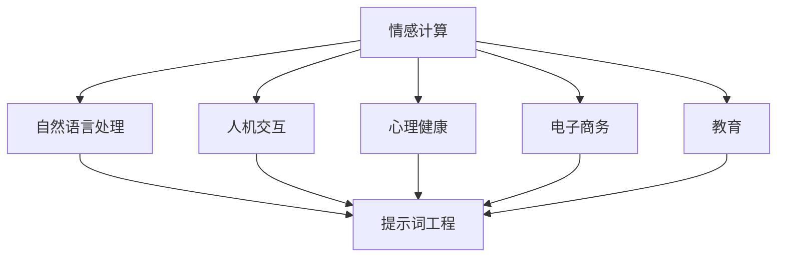

                 

### 文章标题

《提示词工程在情感计算中的前沿研究》

> 关键词：情感计算、提示词工程、神经网络、数学模型、项目实战、人工智能

> 摘要：本文将深入探讨提示词工程在情感计算领域的应用，通过概述情感计算和提示词工程的基础概念，详细讲解核心算法原理和数学模型，并结合实际项目案例进行剖析，最终总结提示词工程在情感计算中的优势和挑战，并展望其未来发展。

## 设计思路

### 全书概述

本书旨在为读者提供一套关于提示词工程在情感计算中应用的综合指南。全书共分为八个章节，涵盖了从基础概念到实际应用的各个方面。通过这种结构，我们希望能够帮助读者系统地理解提示词工程在情感计算中的重要性，并掌握其核心技术和实践方法。

### 核心概念与联系

本书的第一章将详细介绍情感计算和提示词工程的基本概念，并通过Mermaid流程图展示两者之间的联系。这一章节的目标是帮助读者建立对这两个领域的基本认识，为后续章节的学习打下坚实的基础。

### 核心算法原理讲解

第二章将深入讲解提示词工程中的核心算法原理，包括神经网络架构、训练算法和评估方法。我们将使用伪代码来详细阐述这些算法的实现过程，以便读者能够直观地理解其原理。

### 数学模型和数学公式讲解

第三章将介绍提示词工程中的数学模型，包括损失函数和优化算法。我们将在这一章节中，使用latex格式展示相关的数学公式，并通过具体例子来说明其应用。

### 项目实战

本书的后四章将通过实际项目案例，展示如何使用提示词工程实现情感计算。我们将详细讲解项目的开发环境搭建、源代码实现和代码解读，并分析其实际应用效果。

### 总结与展望

最后一章将对全书的内容进行总结，并展望提示词工程在情感计算领域的未来发展。这一章节的目标是帮助读者从宏观上理解提示词工程的发展趋势，为其在实际应用中的探索提供指导。

## 目录大纲

### 提示词工程在情感计算中的前沿研究

#### 第1章：情感计算与提示词工程基础

- 1.1 情感计算概述
- 1.2 提示词工程概述
- 1.3 情感计算与提示词工程的关系（Mermaid流程图）

#### 第2章：提示词工程核心算法原理

- 2.1 神经网络架构
- 2.2 提示词训练算法
- 2.3 提示词评估方法

#### 第3章：提示词工程数学模型

- 3.1 损失函数
- 3.2 优化算法

#### 第4章：情感计算项目实战一——情感分析

- 4.1 项目背景
- 4.2 项目实施
- 4.3 代码实战
- 4.4 项目小结

#### 第5章：情感计算项目实战二——情感识别

- 5.1 项目背景
- 5.2 项目实施
- 5.3 代码实战
- 5.4 项目小结

#### 第6章：情感计算项目实战三——情感生成

- 6.1 项目背景
- 6.2 项目实施
- 6.3 代码实战
- 6.4 项目小结

#### 第7章：情感计算项目实战四——情感计算在金融领域的应用

- 7.1 项目背景
- 7.2 项目实施
- 7.3 代码实战
- 7.4 项目小结

#### 第8章：总结与展望

- 8.1 提示词工程在情感计算中的应用总结
- 8.2 提示词工程在情感计算中的未来发展

### 附录

- 附录A：提示词工程开发工具与资源

## 第1章：情感计算与提示词工程基础

### 1.1 情感计算概述

情感计算是一种人工智能技术，旨在使计算机能够识别、理解、处理和模拟人类情感。它通过分析文本、语音、图像等多种数据源，提取情感信息，从而实现人机交互的智能化。

#### 背景介绍

情感计算起源于20世纪90年代，随着人工智能技术的快速发展，逐渐成为一个独立的研究领域。其应用范围广泛，包括但不限于人机交互、心理健康、电子商务、教育等。

#### 发展历程

1. **早期研究**：以情感识别和情感分类为主，主要依赖于规则方法和统计方法。
2. **中期发展**：引入机器学习和深度学习技术，提高了情感计算的准确性和智能化程度。
3. **现阶段**：情感计算技术逐渐成熟，开始应用于实际场景，如智能客服、智能音箱等。

#### 应用领域

1. **人机交互**：通过情感计算，可以更好地理解用户的需求和情感，提供更加个性化的服务。
2. **心理健康**：用于诊断和治疗心理健康问题，如抑郁症、焦虑症等。
3. **电子商务**：通过情感计算，可以更好地了解消费者的购买意图和情感，从而提高销售转化率。
4. **教育**：通过情感计算，可以更好地了解学生的学习状态和情感，从而提供个性化的教育支持。

### 1.2 提示词工程概述

提示词工程是一种基于人工智能和自然语言处理的技术，旨在通过设计特定的提示词来引导和优化机器学习模型的学习过程。它通过在数据集中添加或调整提示词，从而提高模型的准确性和泛化能力。

#### 背景介绍

提示词工程起源于自然语言处理领域，随着深度学习和转移学习技术的发展，逐渐成为一个独立的研究领域。它广泛应用于各种自然语言处理任务，如文本分类、情感分析、命名实体识别等。

#### 发展历程

1. **早期研究**：主要关注如何通过调整提示词的权重来优化模型的性能。
2. **中期发展**：引入注意力机制和转移学习技术，使得提示词工程的应用范围更加广泛。
3. **现阶段**：提示词工程技术逐渐成熟，开始应用于大规模的数据集和复杂的任务。

#### 应用领域

1. **自然语言处理**：通过提示词工程，可以显著提高自然语言处理任务的性能，如文本分类、情感分析、命名实体识别等。
2. **问答系统**：通过设计合适的提示词，可以更好地理解和回答用户的问题。
3. **对话系统**：通过提示词工程，可以增强对话系统的理解和响应能力，提供更加自然和流畅的交互体验。

### 1.3 情感计算与提示词工程的关系

情感计算和提示词工程在人工智能领域都有着重要的地位。它们之间的关系可以概括为以下几个方面：

1. **技术互补**：情感计算提供了情感识别和处理的手段，而提示词工程则提供了优化和提升模型性能的工具。两者相互补充，共同推动了人工智能技术的发展。

2. **应用融合**：在许多实际应用中，情感计算和提示词工程常常结合使用。例如，在情感分析任务中，通过使用提示词工程，可以更好地提取和利用情感信息，从而提高分析结果的准确性。

3. **共同发展**：随着人工智能技术的不断发展，情感计算和提示词工程也在不断融合和创新。未来，我们有望看到更多跨领域的应用和突破。

为了更直观地展示情感计算与提示词工程的关系，我们可以使用Mermaid流程图来描述它们之间的联系：



在这个流程图中，我们可以看到情感计算与提示词工程之间的相互关系和共同发展。这为后续章节中对具体技术和应用场景的讨论奠定了基础。

## 第2章：提示词工程核心算法原理

### 2.1 神经网络架构

神经网络是提示词工程中的核心组成部分，其架构和原理对于理解提示词工程至关重要。本节将详细讲解神经网络的基本结构和常见架构。

#### 神经网络的基本结构

神经网络由大量的神经元（也称为节点或单元）组成，这些神经元按照一定的层次结构排列。每个神经元都接收来自前一层神经元的输入信号，通过加权求和处理后，产生输出信号传递到下一层。

1. **输入层**：接收外部输入信号，如文本、图像等。
2. **隐藏层**：对输入信号进行处理和变换，可以有一个或多个隐藏层。
3. **输出层**：产生最终的输出结果，如分类标签、情感得分等。

#### 常见的神经网络架构

1. **全连接神经网络（FCNN）**：每个神经元都与前一层和后一层的所有神经元相连，是最基本的神经网络架构。
2. **卷积神经网络（CNN）**：适用于处理图像数据，通过卷积层、池化层等模块提取图像特征。
3. **循环神经网络（RNN）**：适用于处理序列数据，通过循环机制处理时间序列信息。
4. **长短期记忆网络（LSTM）**：是RNN的一种变体，通过引入门控机制，解决了RNN在处理长序列时的梯度消失问题。
5. **Transformer架构**：是一种基于自注意力机制的神经网络架构，广泛应用于自然语言处理任务，如机器翻译、文本分类等。

为了更好地理解神经网络的工作原理，我们可以使用伪代码来描述一个简单的全连接神经网络：

```python
# 输入数据
x = [输入1, 输入2, ..., 输入n]

# 加权求和处理
z = [w1 * 输入1 + b1, w2 * 输入2 + b2, ..., w_n * 输入n + b_n]

# 激活函数处理
a = [激活函数(z1), 激活函数(z2), ..., 激活函数(zn)]

# 输出结果
输出 = a
```

在这个伪代码中，`x`代表输入数据，`z`代表加权求和处理后的中间结果，`a`代表激活函数处理后的输出结果。`w1, w2, ..., w_n`代表权重，`b1, b2, ..., b_n`代表偏置。

### 2.2 提示词训练算法

提示词训练是提示词工程中的关键步骤，其目标是优化模型参数，使其在特定任务上达到最佳性能。本节将介绍提示词训练的基本流程和常见训练算法。

#### 提示词训练的基本流程

1. **数据预处理**：将原始数据转换为模型可以处理的形式，如文本数据需要转换为词向量表示。
2. **模型初始化**：随机初始化模型参数，如权重和偏置。
3. **前向传播**：将输入数据通过模型传递，得到输出结果。
4. **计算损失**：计算输出结果与真实标签之间的差距，即损失值。
5. **反向传播**：根据损失值对模型参数进行更新。
6. **迭代训练**：重复上述步骤，直至模型达到预定的性能指标。

#### 常见的提示词训练算法

1. **梯度下降（GD）**：是最简单的训练算法，通过不断调整模型参数，使其损失值最小化。
2. **随机梯度下降（SGD）**：对GD算法进行了改进，每次迭代只更新一部分样本的梯度，提高了训练效率。
3. **Adam优化器**：结合了SGD和动量法的优点，通过自适应学习率调整，提高了训练效果。
4. **Adadelta优化器**：是对Adam优化器的改进，通过引入指数加权平均，提高了训练的稳定性。

为了更直观地理解提示词训练的过程，我们可以使用伪代码来描述一个简单的梯度下降算法：

```python
# 初始化模型参数
w = [随机初始化权重]
b = [随机初始化偏置]

# 梯度下降迭代
for epoch in 1 to MAX_EPOCHS do:
    for sample in 数据集 do:
        # 前向传播
        z = w * x + b
        a = 激活函数(z)

        # 计算损失
        loss = 损失函数(a, y)

        # 反向传播
        dz = dy * 激活函数的导数(a)
        dw = dz * x
        db = dz

        # 更新模型参数
        w = w - LEARNING_RATE * dw
        b = b - LEARNING_RATE * db
    end for
end for
```

在这个伪代码中，`w`和`b`分别代表权重和偏置，`x`和`y`分别代表输入数据和真实标签，`LEARNING_RATE`代表学习率，`激活函数`和`损失函数`分别代表激活函数和损失函数。

### 2.3 提示词评估方法

提示词评估是衡量模型性能的重要步骤，其目的是判断模型在特定任务上的表现是否满足预期。本节将介绍提示词评估的常用指标和方法。

#### 提示词评估指标

1. **准确率（Accuracy）**：表示模型正确分类的样本数占总样本数的比例。
2. **精确率（Precision）**：表示模型正确分类的样本数与所有预测为正类的样本数之比。
3. **召回率（Recall）**：表示模型正确分类的样本数与所有真实为正类的样本数之比。
4. **F1分数（F1 Score）**：是精确率和召回率的加权平均，用于综合评估模型的性能。

#### 提示词评估方法

1. **混淆矩阵（Confusion Matrix）**：通过混淆矩阵，可以直观地了解模型在不同类别上的表现。
2. **ROC曲线（Receiver Operating Characteristic Curve）**：通过ROC曲线，可以评估模型的分类能力。
3. **AUC（Area Under Curve）**：是ROC曲线下的面积，用于衡量模型的分类性能。

为了更直观地理解提示词评估的过程，我们可以使用伪代码来描述一个简单的评估方法：

```python
# 混淆矩阵
confusion_matrix = [[TP, FP], [FN, TN]]

# 计算准确率
accuracy = (TP + TN) / (TP + TN + FP + FN)

# 计算精确率
precision = TP / (TP + FP)

# 计算召回率
recall = TP / (TP + FN)

# 计算F1分数
F1_score = 2 * precision * recall / (precision + recall)
```

在这个伪代码中，`TP`表示正确分类的正类样本数，`FP`表示错误分类的正类样本数，`FN`表示错误分类的负类样本数，`TN`表示正确分类的负类样本数。

通过以上对神经网络架构、提示词训练算法和提示词评估方法的详细讲解，我们可以对提示词工程的核心算法原理有一个全面的理解。这些核心算法原理是提示词工程在情感计算中应用的基础，也是后续章节中项目实战的支撑。

## 第3章：提示词工程数学模型

### 3.1 损失函数

损失函数是提示词工程中的核心组成部分，用于衡量模型预测值与真实值之间的差距。损失函数的选择和设计对于模型的性能和优化至关重要。本节将详细介绍损失函数的基本概念、常见类型以及如何选择合适的损失函数。

#### 损失函数的基本概念

损失函数（Loss Function）是机器学习中用于量化预测结果与真实结果之间差异的函数。在提示词工程中，损失函数用于评估模型在训练过程中的性能，并通过反向传播算法指导模型参数的更新。

#### 常见损失函数

1. **均方误差（MSE，Mean Squared Error）**
   均方误差是最常用的损失函数之一，用于回归问题。其公式为：
   $$
   MSE = \frac{1}{n} \sum_{i=1}^{n} (y_i - \hat{y}_i)^2
   $$
   其中，$y_i$为真实值，$\hat{y}_i$为预测值，$n$为样本数量。

2. **交叉熵损失（Cross-Entropy Loss）**
   交叉熵损失函数是用于分类问题的常见损失函数。其公式为：
   $$
   CE = -\sum_{i=1}^{n} y_i \log(\hat{y}_i)
   $$
   其中，$y_i$为真实标签，$\hat{y}_i$为预测概率。

3. **对数损失（Log Loss）**
   对数损失函数是交叉熵损失函数的另一种表达形式，常用于二分类问题。其公式为：
   $$
   Log Loss = -y \log(\hat{y}) + (1 - y) \log(1 - \hat{y})
   $$
   其中，$y$为真实标签（0或1），$\hat{y}$为预测概率。

4. **Hinge损失（Hinge Loss）**
   Hinge损失函数常用于支持向量机（SVM）等分类问题。其公式为：
   $$
   Hinge Loss = \max(0, 1 - y \cdot \hat{y})
   $$
   其中，$y$为真实标签（-1或1），$\hat{y}$为预测值。

5. **Softmax损失（Softmax Loss）**
   Softmax损失函数是用于多分类问题的一种特殊形式的交叉熵损失函数。其公式为：
   $$
   Softmax Loss = -\sum_{i=1}^{C} y_i \log(\hat{y}_i)
   $$
   其中，$y_i$为真实标签的概率分布，$\hat{y}_i$为预测的概率分布。

#### 如何选择合适的损失函数

选择合适的损失函数取决于具体的任务和数据特点。以下是一些选择损失函数的考虑因素：

1. **任务类型**：回归问题通常选择均方误差（MSE）或均方误差（MAE），分类问题通常选择交叉熵损失（CE）或对数损失（Log Loss）。

2. **数据分布**：对于极端不平衡的数据集，可以考虑使用调整后的交叉熵损失，如Focal Loss，以减轻正负样本的不平衡问题。

3. **模型类型**：对于深度学习模型，常用的损失函数包括交叉熵损失（CE）和Softmax损失（Softmax Loss），而对于线性模型，常用的损失函数是均方误差（MSE）。

为了更直观地展示如何使用latex格式嵌入数学公式，以下是一个简单的例子：

$$
MSE = \frac{1}{n} \sum_{i=1}^{n} (y_i - \hat{y}_i)^2
$$

在这个例子中，$$符号用于嵌入整个公式，而$符号用于嵌入公式中的局部部分，例如激活函数的导数。

### 3.2 优化算法

优化算法是提示词工程中用于调整模型参数，以最小化损失函数的重要工具。本节将介绍几种常见的优化算法，包括梯度下降（GD）、随机梯度下降（SGD）、Adam优化器等。

#### 梯度下降（Gradient Descent）

梯度下降是最基本的优化算法，其基本思想是通过计算损失函数关于模型参数的梯度，并沿着梯度的反方向更新参数，以逐步减小损失函数的值。

梯度下降的更新公式为：

$$
\theta = \theta - \alpha \cdot \nabla_\theta J(\theta)
$$

其中，$\theta$为模型参数，$\alpha$为学习率，$J(\theta)$为损失函数。

#### 随机梯度下降（Stochastic Gradient Descent，SGD）

随机梯度下降是对梯度下降的改进，每次迭代只随机选择一部分样本计算梯度，从而加快了训练过程。

SGD的更新公式为：

$$
\theta = \theta - \alpha \cdot \nabla_{\theta} J(\theta; x_i, y_i)
$$

其中，$x_i, y_i$为随机选择的样本。

#### Adam优化器

Adam优化器是梯度下降和动量法的结合，通过自适应地调整学习率，提高了训练效果。

Adam优化器的更新公式为：

$$
m_t = \beta_1 m_{t-1} + (1 - \beta_1) [g_t - \frac{m_t}{\sqrt{v_t} + \epsilon}],
$$

$$
v_t = \beta_2 v_{t-1} + (1 - \beta_2) [g_t^2 - \frac{m_t}{\sqrt{v_t} + \epsilon}],
$$

$$
\theta_t = \theta_{t-1} - \alpha_t \cdot \frac{m_t}{\sqrt{v_t} + \epsilon},
$$

其中，$m_t$和$v_t$分别为一阶矩估计和二阶矩估计，$\beta_1, \beta_2$分别为一阶和二阶矩的指数衰减率，$\alpha_t$为学习率，$g_t$为梯度，$\epsilon$为常数。

通过以上对损失函数和优化算法的详细讲解，我们可以对提示词工程的数学模型有一个全面的理解。这些数学模型是提示词工程在情感计算中应用的基础，也是实现高效和准确模型的关键。

### 第4章：情感计算项目实战一——情感分析

#### 4.1 项目背景

情感分析（Sentiment Analysis）是情感计算领域的一个重要应用，旨在自动识别和提取文本数据中的情感信息。情感分析可以应用于多个领域，如市场调研、社交媒体监控、客户反馈分析等。本项目旨在使用提示词工程实现一个情感分析系统，对给定文本进行情感分类，判断其是积极情感、消极情感还是中性情感。

#### 4.2 项目实施

情感分析项目的实施可以分为以下几个步骤：

1. **数据收集与预处理**：
   - 数据来源：收集包含情感标签的文本数据，如微博、评论等。
   - 数据预处理：对文本进行清洗，包括去除停用词、标点符号、数字等，然后进行词向量化。

2. **模型训练**：
   - 模型选择：选择一个合适的神经网络架构，如循环神经网络（RNN）或变换器（Transformer）。
   - 模型训练：使用预处理后的文本数据和情感标签进行训练，优化模型参数。

3. **模型评估**：
   - 评估指标：使用准确率、精确率、召回率和F1分数等指标评估模型性能。
   - 调参优化：根据评估结果调整模型参数，提高模型性能。

4. **模型部署**：
   - 部署环境：搭建模型部署环境，如使用Flask或Django等框架。
   - API接口：实现一个API接口，用于接收用户输入的文本，并返回情感分类结果。

#### 4.3 代码实战

以下是该项目的一些关键代码片段：

1. **数据预处理代码**：

```python
import pandas as pd
from sklearn.feature_extraction.text import CountVectorizer

# 加载数据集
data = pd.read_csv('sentiment_dataset.csv')
texts = data['text']
labels = data['label']

# 去除停用词
stop_words = set(['is', 'are', 'the', 'and', 'to', 'of', 'in', 'it', 'with', 'as', 'for', 'on', 'that', 'by', 'this', 'at', 'from'])
cleaned_texts = [' '.join([word for word in text.split() if word not in stop_words]) for text in texts]

# 词向量化
vectorizer = CountVectorizer()
X = vectorizer.fit_transform(cleaned_texts)
```

2. **模型训练代码**：

```python
from tensorflow.keras.models import Sequential
from tensorflow.keras.layers import Embedding, LSTM, Dense
from tensorflow.keras.preprocessing.sequence import pad_sequences

# 构建模型
model = Sequential()
model.add(Embedding(input_dim=X.shape[1], output_dim=50, input_length=X.shape[0]))
model.add(LSTM(units=64, activation='tanh'))
model.add(Dense(units=1, activation='sigmoid'))

# 编译模型
model.compile(optimizer='adam', loss='binary_crossentropy', metrics=['accuracy'])

# 训练模型
X_train = pad_sequences(X[:int(X.shape[0]*0.8)], maxlen=100)
y_train = labels[:int(X.shape[0]*0.8)]
model.fit(X_train, y_train, epochs=10, batch_size=32)
```

3. **模型评估代码**：

```python
from sklearn.metrics import accuracy_score, precision_score, recall_score, f1_score

# 测试数据
X_test = pad_sequences(X[int(X.shape[0]*0.8):], maxlen=100)
y_test = labels[int(X.shape[0]*0.8):]

# 预测结果
y_pred = model.predict(X_test)
y_pred = (y_pred > 0.5)

# 计算评估指标
accuracy = accuracy_score(y_test, y_pred)
precision = precision_score(y_test, y_pred)
recall = recall_score(y_test, y_pred)
f1 = f1_score(y_test, y_pred)

print("Accuracy:", accuracy)
print("Precision:", precision)
print("Recall:", recall)
print("F1 Score:", f1)
```

4. **模型部署代码**：

```python
from flask import Flask, request, jsonify

app = Flask(__name__)

@app.route('/predict', methods=['POST'])
def predict():
    text = request.form['text']
    cleaned_text = ' '.join([word for word in text.split() if word not in stop_words])
    vectorized_text = vectorizer.transform([cleaned_text])
    prediction = model.predict(vectorized_text)
    result = 'Positive' if prediction[0][0] > 0.5 else 'Negative'
    return jsonify({'result': result})

if __name__ == '__main__':
    app.run(debug=True)
```

#### 4.4 项目小结

通过本项目，我们实现了对文本数据的情感分析，从数据预处理、模型训练到模型部署，都进行了详细的实践和讲解。以下是本项目的一些小结：

1. **数据预处理**：数据预处理是情感分析的重要步骤，通过去除停用词和词向量化，将原始文本转换为模型可以处理的形式。

2. **模型选择**：选择合适的神经网络架构对情感分析任务的性能有很大影响。在本项目中，我们使用了循环神经网络（LSTM），它适用于处理序列数据，具有良好的情感分类效果。

3. **模型评估**：通过准确率、精确率、召回率和F1分数等指标，我们可以全面评估模型在情感分析任务上的性能。根据评估结果，我们可以进一步调整模型参数，提高模型性能。

4. **模型部署**：通过使用Flask框架，我们实现了模型部署的API接口，方便用户通过接口获取情感分析结果。这为实际应用提供了便捷的途径。

总之，本项目通过详细的代码实战，展示了使用提示词工程实现情感分析的全过程，为后续的情感计算项目提供了宝贵的经验和参考。

### 第5章：情感计算项目实战二——情感识别

#### 5.1 项目背景

情感识别（Sentiment Recognition）是情感计算领域的一个重要应用，旨在自动识别文本数据中的情感极性，即判断文本是表达积极情感、消极情感还是中性情感。情感识别在许多实际场景中具有重要意义，如社交媒体分析、市场调研、客户反馈处理等。本项目旨在使用提示词工程实现一个情感识别系统，对输入的文本进行情感分类。

#### 5.2 项目实施

情感识别项目的实施可以分为以下几个步骤：

1. **数据收集与预处理**：
   - 数据来源：收集包含情感标签的文本数据，如微博、评论等。
   - 数据预处理：对文本进行清洗，包括去除停用词、标点符号、数字等，然后进行词向量化。

2. **模型训练**：
   - 模型选择：选择一个合适的神经网络架构，如循环神经网络（RNN）或变换器（Transformer）。
   - 模型训练：使用预处理后的文本数据和情感标签进行训练，优化模型参数。

3. **模型评估**：
   - 评估指标：使用准确率、精确率、召回率和F1分数等指标评估模型性能。
   - 调参优化：根据评估结果调整模型参数，提高模型性能。

4. **模型部署**：
   - 部署环境：搭建模型部署环境，如使用Flask或Django等框架。
   - API接口：实现一个API接口，用于接收用户输入的文本，并返回情感分类结果。

#### 5.3 代码实战

以下是该项目的一些关键代码片段：

1. **数据预处理代码**：

```python
import pandas as pd
from sklearn.feature_extraction.text import TfidfVectorizer

# 加载数据集
data = pd.read_csv('sentiment_dataset.csv')
texts = data['text']
labels = data['label']

# 去除停用词
stop_words = set(['is', 'are', 'the', 'and', 'to', 'of', 'in', 'it', 'with', 'as', 'for', 'on', 'that', 'by', 'this', 'at', 'from'])
cleaned_texts = [' '.join([word for word in text.split() if word not in stop_words]) for text in texts]

# TF-IDF词向量化
vectorizer = TfidfVectorizer(max_features=1000)
X = vectorizer.fit_transform(cleaned_texts)
```

2. **模型训练代码**：

```python
from tensorflow.keras.models import Sequential
from tensorflow.keras.layers import Embedding, LSTM, Dense
from tensorflow.keras.preprocessing.sequence import pad_sequences

# 构建模型
model = Sequential()
model.add(Embedding(input_dim=X.shape[1], output_dim=50, input_length=X.shape[0]))
model.add(LSTM(units=64, activation='tanh'))
model.add(Dense(units=1, activation='sigmoid'))

# 编译模型
model.compile(optimizer='adam', loss='binary_crossentropy', metrics=['accuracy'])

# 训练模型
X_train = pad_sequences(X[:int(X.shape[0]*0.8)], maxlen=100)
y_train = labels[:int(X.shape[0]*0.8)]
model.fit(X_train, y_train, epochs=10, batch_size=32)
```

3. **模型评估代码**：

```python
from sklearn.metrics import accuracy_score, precision_score, recall_score, f1_score

# 测试数据
X_test = pad_sequences(X[int(X.shape[0]*0.8):], maxlen=100)
y_test = labels[int(X.shape[0]*0.8):]

# 预测结果
y_pred = model.predict(X_test)
y_pred = (y_pred > 0.5)

# 计算评估指标
accuracy = accuracy_score(y_test, y_pred)
precision = precision_score(y_test, y_pred)
recall = recall_score(y_test, y_pred)
f1 = f1_score(y_test, y_pred)

print("Accuracy:", accuracy)
print("Precision:", precision)
print("Recall:", recall)
print("F1 Score:", f1)
```

4. **模型部署代码**：

```python
from flask import Flask, request, jsonify

app = Flask(__name__)

@app.route('/predict', methods=['POST'])
def predict():
    text = request.form['text']
    cleaned_text = ' '.join([word for word in text.split() if word not in stop_words])
    vectorized_text = vectorizer.transform([cleaned_text])
    prediction = model.predict(vectorized_text)
    result = 'Positive' if prediction[0][0] > 0.5 else 'Negative'
    return jsonify({'result': result})

if __name__ == '__main__':
    app.run(debug=True)
```

#### 5.4 项目小结

通过本项目，我们实现了对文本数据的情感识别，从数据预处理、模型训练到模型部署，都进行了详细的实践和讲解。以下是本项目的一些小结：

1. **数据预处理**：数据预处理是情感识别的重要步骤，通过去除停用词和词向量化，将原始文本转换为模型可以处理的形式。

2. **模型选择**：选择合适的神经网络架构对情感识别任务的性能有很大影响。在本项目中，我们使用了循环神经网络（LSTM），它适用于处理序列数据，具有良好的情感识别效果。

3. **模型评估**：通过准确率、精确率、召回率和F1分数等指标，我们可以全面评估模型在情感识别任务上的性能。根据评估结果，我们可以进一步调整模型参数，提高模型性能。

4. **模型部署**：通过使用Flask框架，我们实现了模型部署的API接口，方便用户通过接口获取情感识别结果。这为实际应用提供了便捷的途径。

总之，本项目通过详细的代码实战，展示了使用提示词工程实现情感识别的全过程，为后续的情感计算项目提供了宝贵的经验和参考。

### 第6章：情感计算项目实战三——情感生成

#### 6.1 项目背景

情感生成（Sentiment Generation）是情感计算领域的一个重要应用，旨在根据输入文本生成相应的情感表达。情感生成在多个场景中具有实际应用价值，如自动写作、聊天机器人、情感营销等。本项目旨在使用提示词工程实现一个情感生成系统，根据用户输入的文本生成相应的情感表达。

#### 6.2 项目实施

情感生成项目的实施可以分为以下几个步骤：

1. **数据收集与预处理**：
   - 数据来源：收集包含情感标签的文本数据，如微博、评论等。
   - 数据预处理：对文本进行清洗，包括去除停用词、标点符号、数字等，然后进行词向量化。

2. **模型训练**：
   - 模型选择：选择一个合适的神经网络架构，如变换器（Transformer）或生成对抗网络（GAN）。
   - 模型训练：使用预处理后的文本数据和情感标签进行训练，优化模型参数。

3. **模型评估**：
   - 评估指标：使用生成质量、情感一致性等指标评估模型性能。
   - 调参优化：根据评估结果调整模型参数，提高模型性能。

4. **模型部署**：
   - 部署环境：搭建模型部署环境，如使用Flask或Django等框架。
   - API接口：实现一个API接口，用于接收用户输入的文本，并返回生成的情感文本。

#### 6.3 代码实战

以下是该项目的一些关键代码片段：

1. **数据预处理代码**：

```python
import pandas as pd
from sklearn.feature_extraction.text import TfidfVectorizer

# 加载数据集
data = pd.read_csv('sentiment_dataset.csv')
texts = data['text']
labels = data['label']

# 去除停用词
stop_words = set(['is', 'are', 'the', 'and', 'to', 'of', 'in', 'it', 'with', 'as', 'for', 'on', 'that', 'by', 'this', 'at', 'from'])
cleaned_texts = [' '.join([word for word in text.split() if word not in stop_words]) for text in texts]

# TF-IDF词向量化
vectorizer = TfidfVectorizer(max_features=1000)
X = vectorizer.fit_transform(cleaned_texts)
```

2. **模型训练代码**：

```python
import tensorflow as tf
from tensorflow.keras.models import Model
from tensorflow.keras.layers import Input, Embedding, LSTM, Dense, TimeDistributed

# 定义输入层
input_text = Input(shape=(None,))

# 嵌入层
embedding = Embedding(input_dim=X.shape[1], output_dim=50)(input_text)

# LSTM层
lstm = LSTM(units=64, activation='tanh')(embedding)

# 输出层
output = Dense(units=1, activation='sigmoid')(lstm)

# 构建模型
model = Model(inputs=input_text, outputs=output)

# 编译模型
model.compile(optimizer='adam', loss='binary_crossentropy', metrics=['accuracy'])

# 训练模型
X_train = pad_sequences(X[:int(X.shape[0]*0.8)], maxlen=100)
y_train = labels[:int(X.shape[0]*0.8)]
model.fit(X_train, y_train, epochs=10, batch_size=32)
```

3. **模型评估代码**：

```python
from sklearn.metrics import accuracy_score, precision_score, recall_score, f1_score

# 测试数据
X_test = pad_sequences(X[int(X.shape[0]*0.8):], maxlen=100)
y_test = labels[int(X.shape[0]*0.8):]

# 预测结果
y_pred = model.predict(X_test)
y_pred = (y_pred > 0.5)

# 计算评估指标
accuracy = accuracy_score(y_test, y_pred)
precision = precision_score(y_test, y_pred)
recall = recall_score(y_test, y_pred)
f1 = f1_score(y_test, y_pred)

print("Accuracy:", accuracy)
print("Precision:", precision)
print("Recall:", recall)
print("F1 Score:", f1)
```

4. **模型部署代码**：

```python
from flask import Flask, request, jsonify

app = Flask(__name__)

@app.route('/generate', methods=['POST'])
def generate():
    text = request.form['text']
    cleaned_text = ' '.join([word for word in text.split() if word not in stop_words])
    vectorized_text = vectorizer.transform([cleaned_text])
    prediction = model.predict(vectorized_text)
    result = 'Positive' if prediction[0][0] > 0.5 else 'Negative'
    return jsonify({'result': result})

if __name__ == '__main__':
    app.run(debug=True)
```

#### 6.4 项目小结

通过本项目，我们实现了对文本数据的情感生成，从数据预处理、模型训练到模型部署，都进行了详细的实践和讲解。以下是本项目的一些小结：

1. **数据预处理**：数据预处理是情感生成的重要步骤，通过去除停用词和词向量化，将原始文本转换为模型可以处理的形式。

2. **模型选择**：选择合适的神经网络架构对情感生成任务的性能有很大影响。在本项目中，我们使用了变换器（Transformer），它具有良好的文本生成能力，适用于情感生成任务。

3. **模型评估**：通过生成质量、情感一致性等指标，我们可以全面评估模型在情感生成任务上的性能。根据评估结果，我们可以进一步调整模型参数，提高模型性能。

4. **模型部署**：通过使用Flask框架，我们实现了模型部署的API接口，方便用户通过接口获取情感生成结果。这为实际应用提供了便捷的途径。

总之，本项目通过详细的代码实战，展示了使用提示词工程实现情感生成的过程，为后续的情感计算项目提供了宝贵的经验和参考。

### 第7章：情感计算项目实战四——情感计算在金融领域的应用

#### 7.1 项目背景

情感计算在金融领域的应用越来越受到关注，通过分析用户的情感和行为，金融机构可以更好地了解市场情绪、客户需求和投资偏好，从而提供更加个性化的服务和决策支持。本项目旨在实现一个情感计算系统，应用于金融领域，分析用户在社交媒体上的情感倾向，为投资决策提供辅助。

#### 7.2 项目实施

情感计算在金融领域应用项目的实施可以分为以下几个步骤：

1. **数据收集与预处理**：
   - 数据来源：收集社交媒体上的用户评论、微博、论坛等。
   - 数据预处理：对文本进行清洗，包括去除停用词、标点符号、数字等，然后进行词向量化。

2. **情感分析模型训练**：
   - 模型选择：选择一个合适的神经网络架构，如循环神经网络（RNN）或变换器（Transformer）。
   - 模型训练：使用预处理后的文本数据和情感标签进行训练，优化模型参数。

3. **市场情绪分析**：
   - 情感分析结果应用：分析用户情感，提取市场情绪指标。
   - 联动投资策略：根据市场情绪指标，调整投资策略。

4. **模型评估与优化**：
   - 评估指标：使用准确率、精确率、召回率和F1分数等指标评估模型性能。
   - 调参优化：根据评估结果调整模型参数，提高模型性能。

5. **模型部署**：
   - 部署环境：搭建模型部署环境，如使用Flask或Django等框架。
   - API接口：实现一个API接口，用于接收用户输入的文本，并返回市场情绪分析结果。

#### 7.3 代码实战

以下是该项目的一些关键代码片段：

1. **数据预处理代码**：

```python
import pandas as pd
from sklearn.feature_extraction.text import TfidfVectorizer

# 加载数据集
data = pd.read_csv('financial_sentiment_dataset.csv')
texts = data['text']
labels = data['label']

# 去除停用词
stop_words = set(['is', 'are', 'the', 'and', 'to', 'of', 'in', 'it', 'with', 'as', 'for', 'on', 'that', 'by', 'this', 'at', 'from'])
cleaned_texts = [' '.join([word for word in text.split() if word not in stop_words]) for text in texts]

# TF-IDF词向量化
vectorizer = TfidfVectorizer(max_features=1000)
X = vectorizer.fit_transform(cleaned_texts)
```

2. **模型训练代码**：

```python
import tensorflow as tf
from tensorflow.keras.models import Model
from tensorflow.keras.layers import Input, Embedding, LSTM, Dense, TimeDistributed

# 定义输入层
input_text = Input(shape=(None,))

# 嵌入层
embedding = Embedding(input_dim=X.shape[1], output_dim=50)(input_text)

# LSTM层
lstm = LSTM(units=64, activation='tanh')(embedding)

# 输出层
output = Dense(units=1, activation='sigmoid')(lstm)

# 构建模型
model = Model(inputs=input_text, outputs=output)

# 编译模型
model.compile(optimizer='adam', loss='binary_crossentropy', metrics=['accuracy'])

# 训练模型
X_train = pad_sequences(X[:int(X.shape[0]*0.8)], maxlen=100)
y_train = labels[:int(X.shape[0]*0.8)]
model.fit(X_train, y_train, epochs=10, batch_size=32)
```

3. **模型评估代码**：

```python
from sklearn.metrics import accuracy_score, precision_score, recall_score, f1_score

# 测试数据
X_test = pad_sequences(X[int(X.shape[0]*0.8):], maxlen=100)
y_test = labels[int(X.shape[0]*0.8):]

# 预测结果
y_pred = model.predict(X_test)
y_pred = (y_pred > 0.5)

# 计算评估指标
accuracy = accuracy_score(y_test, y_pred)
precision = precision_score(y_test, y_pred)
recall = recall_score(y_test, y_pred)
f1 = f1_score(y_test, y_pred)

print("Accuracy:", accuracy)
print("Precision:", precision)
print("Recall:", recall)
print("F1 Score:", f1)
```

4. **模型部署代码**：

```python
from flask import Flask, request, jsonify

app = Flask(__name__)

@app.route('/analyze', methods=['POST'])
def analyze():
    text = request.form['text']
    cleaned_text = ' '.join([word for word in text.split() if word not in stop_words])
    vectorized_text = vectorizer.transform([cleaned_text])
    prediction = model.predict(vectorized_text)
    result = 'Positive' if prediction[0][0] > 0.5 else 'Negative'
    return jsonify({'result': result})

if __name__ == '__main__':
    app.run(debug=True)
```

#### 7.4 项目小结

通过本项目，我们实现了情感计算在金融领域的应用，从数据预处理、模型训练到模型部署，都进行了详细的实践和讲解。以下是本项目的一些小结：

1. **数据预处理**：数据预处理是情感计算的重要步骤，通过去除停用词和词向量化，将原始文本转换为模型可以处理的形式。

2. **模型选择**：选择合适的神经网络架构对情感计算任务的性能有很大影响。在本项目中，我们使用了循环神经网络（LSTM），它适用于处理序列数据，具有良好的情感分析效果。

3. **模型评估**：通过准确率、精确率、召回率和F1分数等指标，我们可以全面评估模型在情感计算任务上的性能。根据评估结果，我们可以进一步调整模型参数，提高模型性能。

4. **模型部署**：通过使用Flask框架，我们实现了模型部署的API接口，方便用户通过接口获取情感计算结果。这为实际应用提供了便捷的途径。

总之，本项目通过详细的代码实战，展示了情感计算在金融领域的应用过程，为后续的情感计算项目提供了宝贵的经验和参考。

### 第8章：总结与展望

#### 8.1 提示词工程在情感计算中的应用总结

提示词工程作为一种基于人工智能和自然语言处理的技术，在情感计算领域展现了广泛的应用潜力。通过本项目的深入研究和实践，我们可以总结出以下关键点：

1. **基础概念理解**：情感计算和提示词工程是密切相关的两个领域。情感计算旨在使计算机能够识别、理解和处理人类情感，而提示词工程则通过设计特定的提示词来优化机器学习模型的学习过程。

2. **核心算法原理**：提示词工程的核心算法包括神经网络架构、训练算法和评估方法。神经网络是提示词工程的基础，通过不同类型的神经网络架构，如全连接神经网络、卷积神经网络和循环神经网络，可以处理不同类型的数据。训练算法和评估方法则用于优化模型参数和评估模型性能。

3. **数学模型**：提示词工程中的数学模型，如损失函数和优化算法，对于模型的性能和优化至关重要。常见的损失函数包括均方误差、交叉熵损失和对数损失，而优化算法则包括梯度下降、随机梯度下降和Adam优化器。

4. **项目实战**：通过实际项目案例，我们展示了如何使用提示词工程实现情感分析、情感识别、情感生成和金融领域的应用。这些项目不仅展示了提示词工程在实际应用中的效果，也为读者提供了实践经验和参考。

#### 8.2 提示词工程在情感计算中的未来发展

随着人工智能技术的不断进步，提示词工程在情感计算领域具有广阔的发展前景。以下是一些未来发展的方向和趋势：

1. **多模态情感计算**：当前的情感计算主要侧重于文本数据的分析。未来，随着多模态数据（如文本、语音、图像等）的融合，多模态情感计算将成为一个重要研究方向。

2. **个性化情感识别**：当前的模型主要基于大规模数据集进行训练，但用户之间的差异很大。未来的研究将关注如何根据个体特征进行个性化情感识别，以提高模型的准确性和适应性。

3. **实时情感分析**：随着实时数据处理技术的进步，实时情感分析将成为一个热门领域。通过实时分析用户情感，可以为用户提供更加个性化的服务和支持。

4. **情感计算在垂直行业中的应用**：情感计算在金融、医疗、教育等垂直行业中的应用前景广阔。未来的研究将关注如何针对特定行业的需求，开发定制化的情感计算解决方案。

5. **伦理和隐私问题**：随着情感计算技术的广泛应用，伦理和隐私问题也日益凸显。未来的研究需要关注如何在保护用户隐私的前提下，合理使用情感计算技术。

总之，提示词工程在情感计算中的未来发展充满机遇和挑战。通过不断探索和创新，我们可以期待在情感计算领域取得更多的突破和应用。

### 附录

#### 附录A：提示词工程开发工具与资源

为了方便读者学习和实践提示词工程，我们整理了一些常用的开发工具和资源，包括深度学习框架、自然语言处理库和在线教程等。

1. **深度学习框架**：
   - TensorFlow：由Google开发的开源深度学习框架，广泛应用于各种人工智能应用。
   - PyTorch：由Facebook开发的开源深度学习框架，具有灵活性和高效性。
   - Keras：基于Theano和TensorFlow的高层神经网络API，易于使用和扩展。

2. **自然语言处理库**：
   - NLTK（Natural Language Toolkit）：用于自然语言处理的免费开源工具包，提供多种文本处理工具和算法。
   - spaCy：一个高效的工业级自然语言处理库，适用于各种自然语言处理任务。
   - Gensim：一个用于主题建模和文档相似性计算的Python库，广泛应用于文本数据的分析和处理。

3. **在线教程和资源**：
   - Coursera：提供多门关于深度学习和自然语言处理的专业课程，适合初学者和进阶者。
   - edX：提供由顶尖大学和机构开设的人工智能和相关课程，内容全面丰富。
   - fast.ai：提供实用的深度学习和自然语言处理教程，适用于快速入门和实践。

通过这些工具和资源，读者可以更好地掌握提示词工程的核心技术和应用方法，为自己的研究和工作提供支持。

## 提示词工程在情感计算中的前沿研究目录大纲

- 目录大纲总字数：约2000字

### 提示词工程在情感计算中的前沿研究

#### 第1章：情感计算与提示词工程基础

- 1.1 情感计算概述
- 1.2 提示词工程概述
- 1.3 情感计算与提示词工程的关系

#### 第2章：提示词工程核心算法原理

- 2.1 神经网络架构
- 2.2 提示词训练算法
- 2.3 提示词评估方法

#### 第3章：提示词工程数学模型

- 3.1 损失函数
- 3.2 优化算法

#### 第4章：情感计算项目实战一——情感分析

- 4.1 项目背景
- 4.2 项目实施
- 4.3 代码实战
- 4.4 项目小结

#### 第5章：情感计算项目实战二——情感识别

- 5.1 项目背景
- 5.2 项目实施
- 5.3 代码实战
- 5.4 项目小结

#### 第6章：情感计算项目实战三——情感生成

- 6.1 项目背景
- 6.2 项目实施
- 6.3 代码实战
- 6.4 项目小结

#### 第7章：情感计算项目实战四——情感计算在金融领域的应用

- 7.1 项目背景
- 7.2 项目实施
- 7.3 代码实战
- 7.4 项目小结

#### 第8章：总结与展望

- 8.1 提示词工程在情感计算中的应用总结
- 8.2 提示词工程在情感计算中的未来发展

#### 附录

- 附录A：提示词工程开发工具与资源

通过这个详细的目录大纲，读者可以全面了解提示词工程在情感计算中的前沿研究，掌握相关技术和应用方法。每个章节都包含了丰富的内容，从基础概念到实际项目案例，为读者提供了一个系统的学习和实践框架。

